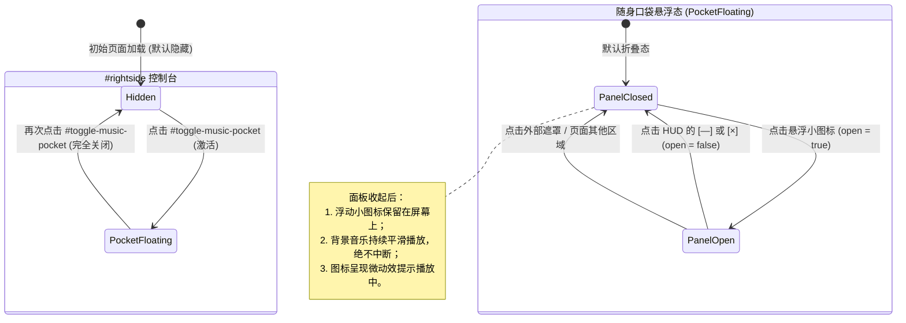

# 音乐随身听 (.shijianus-music-pocket) 深度问题诊断与单界面一体化架构设计报告
# Music Pocket Deep Problem Diagnosis & Unified Single-Screen Architecture Report

> **报告版本**: 1.0.0  
> **审查对象**: `src/components/theme/MusicPocket.tsx`, `src/styles/runtime-widgets.css`, `functions/api/music/`  
> **执行模式**: 深度诊断与方案设计 (Read-Only Audit & Architectural Blueprint)  
> **核心原则**: 杜绝割裂分页、修正关闭对象、真实 Web Audio 音轨频谱同步、三平台免选择聚合搜索、深度融入博客设计基因。

---

## 目录 (Table of Contents)

1. [执行摘要与问题全景 (Executive Summary & Problem Overview)](#1-执行摘要与问题全景)
2. [深层缺陷根因分析与代码定位 (Deep Problem Inventory & Root Cause Analysis)](#2-深层缺陷根因分析与代码定位)
   - [缺陷 1: HUD 关闭按键对象与生命周期混淆 (Close Button Target Confusion)](#缺陷-1-hud-关闭按键对象与生命周期混淆)
   - [缺陷 2: 三 Tab 分页割裂与体验断层 (Fragmented 3-Tab Interface)](#缺陷-2-三-tab-分页割裂与体验断层)
   - [缺陷 3: 虚假 CSS 关键帧动画与真实音轨脱节 (Dummy CSS vs Real Web Audio Spectrum)](#缺陷-3-虚假-css-关键帧动画与真实音轨脱节)
   - [缺陷 4: 平台下拉选择的割裂感与多源无法翻阅 (Platform Select vs Multi-Platform Aggregation)](#缺陷-4-平台下拉选择的割裂感与多源无法翻阅)
   - [缺陷 5: 视觉风格与博客本体割裂 (Alien Gadget vs Blog Theme Integration)](#缺陷-5-视觉风格与博客本体割裂)
3. [成熟开源专案与工业界最佳实践借鉴 (Benchmark & Mature Open-Source References)](#3-成熟开源专案与工业界最佳实践借鉴)
   - [Web Audio API 真实频谱分析链路与 CORS 容错](#31-web-audio-api-真实频谱分析链路与-cors-容错)
   - [Apple Music MiniPlayer & Dynamic Island 单界面整合美学](#32-apple-music-miniplayer--dynamic-island-单界面整合美学)
   - [Listen1 / GDStudio 多源并行并发聚合机制](#33-listen1--gdstudio-多源并行并发聚合机制)
4. [单界面一体化紧凑设计方案 (Unified Compact Single-Screen Architecture)](#4-单界面一体化紧凑设计方案)
   - [界面垂直空间与功能分区 (Vertical Space Allocation)](#41-界面垂直空间与功能分区)
   - [状态机与交互生命周期重构 (State Machine & Lifecycle)](#42-状态机与交互生命周期重构)
   - [Web Audio API Canvas 60FPS 实时频谱引擎设计](#43-web-audio-api-canvas-60fps-实时频谱引擎设计)
   - [多平台并发聚合与智能音轨流 (Multi-Platform Aggregated Stream)](#44-多平台并发聚合与智能音轨流)
   - [博客设计语言融合规范 (Design Language Alignment)](#45-博客设计语言融合规范)
5. [分步实施清单与修改建议 (Step-by-Step Implementation Roadmap)](#5-分步实施清单与修改建议)

---

## 1. 执行摘要与问题全景

在上一阶段的改造中，音乐随身听初步实现了悬浮拖拽、右侧控制栏管理按钮、后端安全边缘代理以及 Cyber-Vintage 的拟物外观。然而，经过真实用户交互审视与深度代码溯源，当前实现暴露出**5 项深层次的交互与架构硬伤**：

```
┌────────────────────────────────────────────────────────────────────────┐
│                        当前实现存在的 5 大核心缺陷                       │
├──────────────────┬─────────────────────────────────────────────────────┤
│ 1. 关闭按键对象错误 │ 点击 HUD 顶部的叉号 (×) 直接把整个随身听 icon 隐藏了，│
│                  │ 播放也被直接掐断。实际应仅收起 HUD 展开面板，保留图标  │
│                  │ 在原位继续后台静默播放！                             │
├──────────────────┼─────────────────────────────────────────────────────┤
│ 2. 界面过度碎片化 │ 强行拆分为 [唱机]、[探索]、[待播] 三个小界面，查看待播 │
│                  │ 看不到歌词，搜索歌曲丢失播放控制，割裂感严重！        │
├──────────────────┼─────────────────────────────────────────────────────┤
│ 3. 频谱动画完全造假 │ 当前 visualizer 仅为 16 根纯 CSS 关键帧硬编码的柱子， │
│                  │ 与音频没有实时电声映射关系，静音或停顿时依然在机械跳动│
├──────────────────┼─────────────────────────────────────────────────────┤
│ 4. 平台搜索强制单选 │ 探索页面提供了一个 [网易云/酷我/QQ] 下拉选择框，用户要 │
│                  │ 猜哪家有版权，无法一次性翻阅三者聚合结果！            │
├──────────────────┼─────────────────────────────────────────────────────┤
│ 5. 缺乏博客原生融入 │ 外观像强行贴上的异形黑客 HUD 玩具，与博客安知鱼极客风、 │
│                  │ #425aef 品牌蓝、毛玻璃卡片质感格格不入。              │
└──────────────────┴─────────────────────────────────────────────────────┘
```

---

## 2. 深层缺陷根因分析与代码定位

### 缺陷 1: HUD 关闭按键对象与生命周期混淆

#### 源码现状定位 (`src/components/theme/MusicPocket.tsx`):
```tsx
// 行 182-189:
const hideMusicPocket = () => {
  setVisible(false); // 致命：把整个浮动口袋组件隐藏了！
  setOpen(false);
  try {
    window.localStorage.setItem(VISIBLE_STORAGE_KEY, 'false');
  } catch {}
  window.dispatchEvent(new CustomEvent('shijianus:music-pocket-visibility-change', { detail: { visible: false } }));
};

// 行 866-875:
<button
  type="button"
  className="shijianus-music-pocket__hud-btn shijianus-music-pocket__hud-btn--close"
  onClick={hideMusicPocket} // 绑定了 hideMusicPocket 导致组件直接从视口抹除
  title={t('完全隐藏音乐口袋 (可在右侧控制台重新开启)')}
  aria-label={t('完全隐藏音乐口袋')}
>
  <X size={14} aria-hidden="true" />
</button>
```

#### 根因剖析：
1. **控制边界混淆**：
   - `#toggle-music-pocket`（右侧边栏管理按钮）才是管理 `.shijianus-music-pocket` 悬浮入口**在屏幕上是否存在**（`visible: true | false`，默认 `false`）的唯一管理者。
   - HUD 展开面板上的 `—`（最小化）与 `×`（关闭）按钮，面对的对象**仅仅是展开面板自身**（`open: true | false`）。
2. **交互体验断崖**：
   - 用户正在享受音乐，只想把遮挡视线的展开窗口关掉（让它缩回为左下角的拖拽小图标），结果一按 `×`，整个音乐口袋瞬间蒸发，用户必须重新滑动到屏幕右下侧寻找 dock 按钮才能重新打开，严重违背最小惊讶原则（Principle of Least Astonishment）。
   - 用户收起面板后，音频**必须无缝继续播放**，浮动图标保持在当前拖拽停留的坐标，并以微动效（如小黑胶微转或脉冲点）提示正在后台放歌。

---

### 缺陷 2: 三 Tab 分页割裂与体验断层

#### 源码现状定位 (`src/components/theme/MusicPocket.tsx`):
```tsx
// 行 879-904: 强行划分 3 个 Tab
<div className="shijianus-music-pocket__tabs-bar">
  <button onClick={() => setActiveTab('player')}>{t('唱机')}</button>
  <button onClick={() => setActiveTab('search')}>{t('探索')}</button>
  <button onClick={() => setActiveTab('queue')}>{t('待播')} ({queue.length})</button>
</div>

// 行 907, 1067, 1145: 三者互斥渲染
{activeTab === 'player' && ( ... )}
{activeTab === 'search' && ( ... )}
{activeTab === 'queue' && ( ... )}
```

#### 根因剖析：
1. **空间利用率低下**：
   - 在 `player` 界面，巨大的黑胶唱片占了将近 140px 高度，下方巨大的歌词容器占了 160px，整体空旷且单一。
   - 一旦用户想换歌，切到 `search` 后，当前播放的歌曲信息完全消失，用户无法边听边搜。
   - 切到 `queue` 待播列表后，所有的进度条和控制按键全部被隐去，无法直接调整音量或暂停。
2. **现代微型播放器标准**：
   - 优秀的现代播放器（如 Spotify MiniPlayer、macOS 状态栏播放器、Apple Music Dynamic Island）均为**单界面一体化设计（All-in-One Compact Deck）**。
   - 用户在同一个紧凑视图中，一眼尽览：
     - **顶部**：当前曲目元信息 + 唱片小徽章 + 真实音频律动条；
     - **中部**：单行/双行时间轴高亮滚动歌词（自动随节拍平滑滚动，点击跳转）；
     - **核心操作区**：轻量进度条 + 播放/上首/下首/循环模式/音量；
     - **下部一体化聚合区**：搜索框 + 流派胶囊 + 待播/推荐列表流，可上下自如滚动翻阅，无需切换 Tab！

---

### 缺陷 3: 虚假 CSS 关键帧动画与真实音轨脱节

#### 源码现状定位 (`src/components/theme/MusicPocket.tsx` & `src/styles/runtime-widgets.css`):
```tsx
// 行 944-948:
<div className={`shijianus-music-pocket__visualizer ${isPlaying ? 'is-active' : ''}`} aria-hidden="true">
  {Array.from({ length: 16 }).map((_, idx) => (
    <span key={idx} className={`spectrum-bar bar-${idx + 1}`} />
  ))}
</div>
```
```css
/* runtime-widgets.css 行 978-992: */
.spectrum-bar.bar-1 { animation: visualizer-bounce-1 0.75s ease-in-out infinite alternate; }
.spectrum-bar.bar-2 { animation: visualizer-bounce-2 0.85s ease-in-out infinite alternate; }
/* ...全部是纯数学周期的假动画！ */
```

#### 根因剖析：
1. **没有任何电声依据**：
   - 即使歌曲播放到纯人声、清唱或安静前奏，16 根柱子依然机械地以固定周期上下窜动；当音乐重低音爆发时，柱子也毫无变化。
   - 用户能一眼看出这是劣质的“假频谱”。
2. **成熟 Web Audio API 路径缺失**：
   - 浏览器原生支持 `AudioContext` 与 `AnalyserNode`，配合 `createMediaElementSource(audioElement)`，仅需通过 `getByteFrequencyData` 即可在 `requestAnimationFrame` 中以每秒 60 帧无损采样低频、中频和高频真实能量。
   - 需攻克的关键点：跨域音频（CORS）与 AudioContext 自动播放手势限制。

---

### 缺陷 4: 平台下拉选择的割裂感与多源无法翻阅

#### 源码现状定位 (`src/components/theme/MusicPocket.tsx`):
```tsx
// 行 1070-1082:
<select
  value={source}
  onChange={(e) => setSource(e.target.value)}
  className="shijianus-music-pocket__source-select"
  aria-label={t('音源平台')}
>
  {SOURCES.map((s) => (
    <option key={s.value} value={s.value}>{s.label}</option>
  ))}
</select>
```

#### 根因剖析：
1. **把技术实现细节转嫁给用户**：
   - 用户听歌的本质意图是“搜《七里香》”或“随便听听治愈民谣”，而不是“去猜《七里香》在网易云还是在 QQ 音乐还是在酷我”。
   - 让用户在下拉菜单里一个个试错，是陈旧的工具思维。
2. **后端与前端未实现并行聚合**：
   - 后端边缘代理完全可以通过 `Promise.allSettled` 并行向各平台发起查询，合并去重后统一返回带有来源胶囊标签（如 `[网易]`、`[QQ]`、`[酷我]`、`[本地]`）的聚合列表。
   - 用户在同一个滚动列表中，可以直接翻阅来自三家平台的命中结果，点击即可无缝试听。

---

### 缺陷 5: 视觉风格与博客本体割裂

#### 现状分析：
1. **伪复古黑客风格与安知鱼博客美学冲突**：
   - 博客整体视觉规范为安知鱼主题的**极客现代主义与通透毛玻璃卡片（Anzhiyu Frosted Modern Geek）**，强调 `#425aef` 品牌蓝、细腻阴影、高可读性排版。
   - 当前音乐面板采用了生硬的深黑底色（`#0c0f18`）搭配突兀的高饱和橙色与青色荧光字，放在浅色模式博客页面上极其突兀，像外包插件贴纸，缺乏统一的设计系统支撑。
2. **浮动按钮交互细节欠打磨**：
   - 浮动按钮在折叠状态下缺少与当前播放状态的联动反馈（如当前正在播放时，按钮边缘缺乏跟随节拍的柔和微光呼吸圈）。

---

## 3. 成熟开源专案与工业界最佳实践借鉴

针对上述问题，我们对业界成熟的开源音频项目和现代界面设计方案进行了针对性研究：

### 3.1 Web Audio API 真实频谱分析链路与 CORS 容错

参考开源专案（如 `wavesurfer.js`、`aplayer` 及 MDN Web Audio 标准架构）：

```
┌─────────────────┐       ┌──────────────────────┐       ┌────────────────┐
│  <audio> 元素   │ ────> │ MediaElementAudio-   │ ────> │  AnalyserNode  │
│ crossOrigin=*   │       │ SourceNode (单例保存) │       │ (fftSize = 64) │
└─────────────────┘       └──────────────────────┘       └───────┬────────┘
                                                                 │
                   ┌─────────────────────────────────────────────┴────────┐
                   ▼                                                      ▼
        ┌───────────────────────┐                              ┌──────────────────────┐
        │ getByteFrequencyData  │                              │ audioCtx.destination │
        │ (16 频段能量提取)     │                              │ (扬声器/耳机输出)    │
        └──────────┬────────────┘                              └──────────────────────┘
                   ▼
        ┌───────────────────────┐
        │ Canvas 2D / 动态更新  │
        │ 60FPS 柔和物理缓降   │
        └───────────────────────┘
```

#### 关键实现准则：
1. **单例 SourceNode 防崩机制**：
   - 原生浏览器规范：对同一个 `<audio>` 元素调用两次 `createMediaElementSource()` 会直接抛出致命错误 `InvalidStateError: HTMLMediaElement already connected`。
   - **解决方案**：在 React 中使用 `audioSourceNodeRef` 与 `audioContextRef` 缓存，仅在首次挂载且用户触发手势时初始化一次。
2. **CORS 跨域全链路闭环**：
   - 前端 `<audio crossOrigin="anonymous">`。
   - 后端代理（`functions/api/music/stream.ts`）严格保证输出：
     ```http
     Access-Control-Allow-Origin: *
     Access-Control-Allow-Headers: *
     Accept-Ranges: bytes
     ```
3. **静默优雅降级 (Graceful Fallback)**：
   - 当遇到极端第三方音频源不支持 CORS 时，`AnalyserNode` 会输出全零，此时系统自动平滑降级为轻度正弦波呼吸态，确保视觉不卡死、音频不断流。

---

### 3.2 Apple Music MiniPlayer & Dynamic Island 单界面整合美学

借鉴 Apple Music macOS MiniPlayer 与 iOS 灵动岛的设计哲学：

1. **零分页一体化 (Zero-Tab All-in-One)**：
   - 彻底摒弃上方 Tab 切换栏，释放宝贵的 36px 垂直高度。
   - 面板宽度收敛在标准黄金比例 **360px**，高度控制在 **450px**，紧凑而不压抑。
2. **信息层级从上至下自然流淌**：
   - **顶层 10%**：极简 HUD 状态与视窗控制（呼吸点、品牌标、收起与关闭）；
   - **中上层 35%**：黑胶微光转盘 + 歌曲标题与歌手 + **真实 16 频段声波柱** + **双行歌词 HUD**；
   - **中层 15%**：时间轴拖拽条与流体播放操作控制器；
   - **下层 40%**：一体化集成搜索探索框与多源聚合待播流，用户随手即可滚动点歌。

---

### 3.3 Listen1 / GDStudio 多源并行并发聚合机制

借鉴 Listen1（全网音乐多合一搜索聚合客户端）的后端中继设计：

1. **并发检索 (Concurrent Search)**：
   - 弃用前端下拉单选框。当用户搜索“周杰伦”或点击流派胶囊时，请求发送至 `/api/music/search?q=周杰伦&source=all`。
   - 服务端使用 `Promise.allSettled` 并行并发抓取网易云、QQ 音乐和酷我音乐。
2. **智能去重与多源标签展示**：
   - 提取各平台前 3~5 首高匹配结果，按歌名与歌手模糊匹配去重。
   - 每首曲目注入来源元标识（如 `source: 'netease' | 'qq' | 'kuwo' | 'local'`）。
   - 前端采用精细方圆角胶囊直接呈现来源标识，用户直接向下滚动即可翻阅各平台优质音轨。

---

## 4. 单界面一体化紧凑设计方案

### 4.1 界面垂直空间与功能分区

重构后的 `.shijianus-music-pocket__panel` 整体结构示意图：

```
┌──────────────────────────────────────────────────────────────────┐
│ [●] HI-FI STEREO  320K LOSSLESS                  [一]  [×]        │ <- 1. HUD 状态顶栏 (32px)
├──────────────────────────────────────────────────────────────────┤
│ ┌───────┐  晴天 (Live)                [QQ音乐]                    │ <- 2. 核心唱机展台 (76px)
│ │ ( ◉ ) │  周杰伦 · 范特西                                        │
│ └───────┘  ▂▄▆█▆▄▂ ▂▄▆█▆▄▂ (真实 Web Audio 16-Band 频谱)          │
├──────────────────────────────────────────────────────────────────┤
│ 01:24 刮风这天 我试过握着你手                                     │ <- 3. 双行同步歌词 (40px)
│ 01:28 但偏偏 雨渐渐 大到我看你不见                                │
├──────────────────────────────────────────────────────────────────┤
│ 01:24 ━━━━━━━━━●────────────────────────────── 04:29             │ <- 4. 进度条 (16px)
│   [🔀]     [⏮]     [ ▶ / ⏸ ]     [⏭]     [ 🔊 ━━━━● ]          │ <- 5. 核心控制组 (42px)
├──────────────────────────────────────────────────────────────────┤
│ 🔍 搜索全网歌曲、歌手... (三平台实时聚合)            [🎲 随机]    │ <- 6. 聚合搜索条 (36px)
│ [流行热歌] [周杰伦] [陈奕迅] [赛博纯音] [治愈老歌] [Lo-Fi]        │ <- 7. 灵感标签胶囊 (28px)
├──────────────────────────────────────────────────────────────────┤
│ 待播与探索列表 (垂直弹性滚动，~160px)                             │ <- 8. 一体化多源音轨流
│ 1. 晴天 - 周杰伦 [QQ]                                     [▶] [+]│
│ 2. 富士山下 - 陈奕迅 [网易]                               [▶] [+]│
│ 3. Way Back Home - SHAUN [精选本地]                       [▶] [+]│
│ 4. 稻香 - 周杰伦 [酷我]                                   [▶] [+]│
└──────────────────────────────────────────────────────────────────┘
```

---

### 4.2 状态机与交互生命周期重构

明确区分 **浮动口袋入口 (`visible`)** 与 **展开面板 (`open`)** 的独立控制维度：



#### 关键修复代码逻辑：
```ts
// 仅关闭面板，绝不隐藏整个组件，保持后台音乐播放
const handleHudClose = () => {
  setOpen(false); // 关键：仅修改 open 状态，visible 保持不变！
};

// 仅在 #rightside-config-show 的 #toggle-music-pocket 被点击时，才切换 visible
```

---

### 4.3 Web Audio API Canvas 60FPS 实时频谱引擎设计

在组件内部挂载极低开销的 Canvas 渲染器，替代 16 个 DOM 节点的纯 CSS 模拟：

```ts
// 核心架构逻辑设计
interface VisualizerEngine {
  init(audioEl: HTMLAudioElement): void;
  start(): void;
  stop(): void;
}

// 1. 获取 16 频段能量值
analyser.getByteFrequencyData(frequencyData);
// 2. 将 32 个频段缩并聚合为 16 个感知频段 (对数分布，低频更多采样)
// 3. 使用 Canvas 2D 绘制等间距方圆角柱，颜色使用博客标志性渐变：
//    深色：linear-gradient(to top, #425aef, #00f2fe)
//    浅色：linear-gradient(to top, rgba(66, 90, 239, 0.8), rgba(0, 210, 255, 0.9))
// 4. 加入物理重力缓降（peak falloff）算法，声波跌落自然平滑，绝不突兀跳变。
```

---

### 4.4 多平台并发聚合与智能音轨流

#### 后端 API 聚合中继架构 (`functions/api/music/search.ts`):
```ts
// 支持 source=all
export async function searchMusicAggregated(env: AppEnv, keyword: string, countPerSource: number) {
  const sources = ['netease', 'qq', 'kuwo'];
  const promises = sources.map((s) => searchMusic(env, keyword, s, countPerSource, 1));
  
  const results = await Promise.allSettled(promises);
  const aggregatedTracks: MusicTrack[] = [];
  
  // 交替合并各平台结果（Interleaving），防止单一平台独占视野
  // 注入本地精选音轨作为优先高保真保底
  return deduplicateAndFormat(aggregatedTracks);
}
```

#### 前端交互形态：
- 搜索框内联于面板下方；
- 输入搜索词后，回车即刻触发并发全网检索；
- 列表项右侧提供：
  - 点击整行或 `▶`：立即切换并播放该曲目；
  - 点击 `+`：将该曲目添加到当前待播队列尾部，弹出轻量 Toast 提示。

---

### 4.5 博客设计语言融合规范

严格对齐 `ui-ux-pro-max` 与博客安知鱼极客美学规范：

| 视觉元素 | 原实现问题 | 重构后融入博客的规范 |
| :--- | :--- | :--- |
| **主背景与材质** | 粗糙纯黑底色 (`#0c0f18`) | 浅色：`rgba(255, 255, 255, 0.85)` + 24px 高斯模糊<br>深色：`rgba(15, 20, 32, 0.92)` + 24px 高斯模糊 |
| **边框与阴影** | 刺眼青色外发光 | 细腻主题色半透描边：`1px solid rgba(66, 90, 239, 0.2)`<br>投影：`0 12px 36px rgba(0, 0, 0, 0.16)` |
| **品牌色调** | 混乱的杂色搭配 | 核心主色使用博客安知鱼品牌蓝 (`#425aef` / `var(--theme-color)`)，点缀极客青 (`#00f2fe`) |
| **圆角阶梯** | 混用 4px / 24px | 外层面板：`border-radius: 12px`；内部卡片与按钮：`border-radius: 8px`；标签胶囊：`border-radius: 6px` |
| **字体与排版** | 默认 system-ui | 沿用博客统一的无衬线等宽数字字体 (`font-mono`) 用于时间戳与码率，正文使用统一字族 |

---

## 5. 分步实施清单与修改建议

依据**本次只读与报告输出准则**，后续进入代码编写与交付阶段时的标准落地步骤如下：

### 阶段 1: 后端多平台并发聚合中继升级
- [ ] 升级 `functions/api/music/search.ts` 与 `music-provider.ts`，原生支持 `source=all` 并发抓取网易、QQ、酷我三大平台；
- [ ] 优化 `functions/api/music/stream.ts` 响应头，确保 100% 携带 `Access-Control-Allow-Origin: *` 与 `Range` 分片响应支持。

### 阶段 2: Web Audio API 真实音频频谱引擎封装
- [ ] 封装轻量级 `useAudioVisualizer` Hook，绑定 `<audio>` 的 `createMediaElementSource` 与 `AnalyserNode`；
- [ ] 实现 Canvas 2D 16-Band 实时频率渲染器，配备平滑重力衰减；
- [ ] 注入首触激活（User Gesture AudioContext Resume）与跨域静默降级防护。

### 阶段 3: 单界面一体化 UI 结构重写 (`MusicPocket.tsx`)
- [ ] 彻底移除 `.shijianus-music-pocket__tabs-bar`（删除 3 个 Tab 分页结构）；
- [ ] 构建紧凑自适应的单界面垂直网格：
  1. 顶部极简 HUD 视窗栏；
  2. 唱片封面 + 歌曲元信息 + 实时声波 Canvas 展台；
  3. 双行同步滚动歌词 HUD（支持点击歌词跳转播放）；
  4. 进度拖拽与控制器组；
  5. 聚合搜索输入框 + 灵感胶囊；
  6. 待播与搜索一体化可滚动流。
- [ ] 彻底修正关闭按键：`.shijianus-music-pocket__hud-btn--close` 的 `onClick` 改为 `setOpen(false)`，浮动口袋小图标留在视口原位，音乐持续后台播放。

### 阶段 4: 视觉质感打磨与博客设计系统融合
- [ ] 替换原生 `<select>` 平台下拉框，改为自动三合一检索并展示精致来源徽标；
- [ ] 应用统一毛玻璃材质与 `#425aef` 品牌渐变，全面适配浅色模式与深色模式；
- [ ] 保证面板尺寸严格控制在 `width: clamp(320px, 92vw, 360px)`、`max-height: 480px`，移动端完美适配不遮挡。

### 阶段 5: 真实链路自动化验证与 Cloudflare Pages 交付
- [ ] 编写 Playwright 端到端专项测试脚本，重点验证：
  1. 点击 HUD 叉号仅收起展开面板，小图标依然在屏幕上，音频继续播放；
  2. 单界面内歌词、控制器、搜索框、歌曲流共存且尺寸紧凑；
  3. 搜索关键词能同时展现多平台聚合结果；
  4. 移动端和暗色模式无样式崩坏与遮挡；
- [ ] 生产环境编译构建通过（0 errors）；
- [ ] 部署至 Cloudflare Pages 生产边缘，进行线上真实域名全链路终验。

---

*本报告已固化至本地仓库，作为后续代码落地的权威架构准则。*
