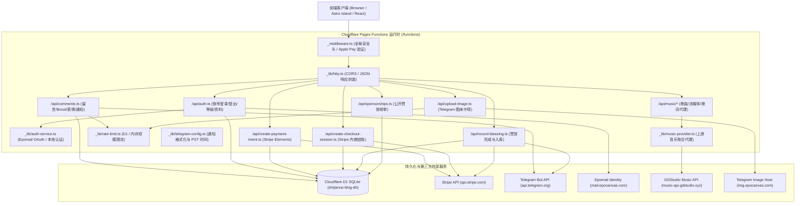

# 博客底层代码实现与安全架构深度稽核报告
**Underlying Codebase Implementation & Security Architecture Deep Audit Report**

- **稽核时间**：2026-09-22
- **稽核性质**：只读模式深度代码审计 + 运行时自动化功能测试 + 真实证据链推导 (Read-Only Deep Security & Logic Verification)
- **目标仓库**：`shijianus/astro-theme-shijianus` (`/home/shijian/projects/shijianus-blog`)
- **审计范围**：Cloudflare Pages Functions 边缘 API、D1 关系数据库架构、Stripe 支付结算与通知链路、用户身份与会话体系、音乐代理引擎、图片中转与防滥用限流系统。

---

## 目录 (Table of Contents)

1. [底层架构全景与实际实现说明 (Architecture Topology & Implementation Review)](#1-底层架构全景与实际实现说明)
2. [漏洞全景概览与风险矩阵 (Vulnerability Overview & Risk Matrix)](#2-漏洞全景概览与风险矩阵)
3. [核心漏洞与底层设计缺陷深度审计 (Deep Vulnerability Analysis & Proof of Concept)](#3-核心漏洞与底层设计缺陷深度审计)
   - [VULN-01: 匿名/未鉴权 IDOR 导致全量用户私信通知与互动上下文任意越权拖库](#vuln-01-匿名未鉴权-idor-导致全量用户私信通知与互动上下文任意越权拖库)
   - [VULN-02: 本地读者账号无凭证快速登录导致任意用户会话秒级接管 (Account Takeover)](#vuln-02-本地读者账号无凭证快速登录导致任意用户会话秒级接管)
   - [VULN-03: `verifySessionRecord` 验证真空导致未支付订单直接转正并触发 Telegram 虚假打赏轰炸](#vuln-03-verifysessionrecord-验证真空导致未支付订单直接转正并触发-telegram-虚假打赏轰炸)
   - [VULN-04: 赞赏金额两次除以 100，导致 Telegram 机器人通知金额缩水 99% ($5 变成 $0.05)](#vuln-04-赞赏金额两次除以-100导致-telegram-机器人通知金额缩水-99-5-变成-005)
   - [VULN-05: Embedded Checkout 与 PaymentIntent 在 D1 中存储单位错乱引发 100 倍严重金额虚标](#vuln-05-embedded-checkout-与-paymentintent-在-d1-中存储单位错乱引发-100-倍严重金额虚标)
   - [VULN-06: 音乐提供商 `normalizeTrack` 运行时 `ReferenceError` 导致全网歌曲搜索 100% 瘫痪静默被吞](#vuln-06-音乐提供商-normalizetrack-运行时-referenceerror-导致全网歌曲搜索-100-瘫痪静默被吞)
   - [VULN-07: 数据库限流器 TOCTOU 竞态漏洞导致高并发请求 100% 击穿预设阈值](#vuln-07-数据库限流器-toctou-竞态漏洞导致高并发请求-100-击穿预设阈值)
   - [VULN-08: 评论反应 (Reactions) 读-改-写模型无并发控制导致点赞与表情数据并发写丢失](#vuln-08-评论反应-reactions-读-改-写模型无并发控制导致点赞与表情数据并发写丢失)
   - [VULN-09: 访客评论无保留名校验，允许肆意冒用博主及站长身份与官方头像发布欺诈信息](#vuln-09-访客评论无保留名校验允许肆意冒用博主及站长身份与官方头像发布欺诈信息)
   - [VULN-10: 用户资料时区与地点字段在多节点/冷启动下永久丢失（缺少 D1 数据库持久化字段）](#vuln-10-用户资料时区与地点字段在多节点冷启动下永久丢失)
   - [VULN-11: 开放式图床中转接口接受 `image/svg+xml` 且无内容深度清洗，构成潜在跨站脚本风险](#vuln-11-开放式图床中转接口接受-imagesvgxml-且无内容深度清洗)
   - [VULN-12: 全局 CORS 规则通配信任所有 `*.pages.dev` 租户且泛反射 Origin 头部扩大信任边界](#vuln-12-全局-cors-规则通配信任所有-pagesdev-租户且泛反射-origin-头部)
4. [底层架构级工程设计缺陷审计 (Underlying Architectural & Systemic Design Flaws)](#4-底层架构级工程设计缺陷审计)
   - [ARCH-01: 边缘无状态函数在每次请求链路动态执行 DDL 严重拖累性能](#arch-01-边缘无状态函数在每次请求链路动态执行-ddl-严重拖累性能)
   - [ARCH-02: 国际打赏支付链路缺乏官方 Webhook 服务端签名校验机制](#arch-02-国际打赏支付链路缺乏官方-webhook-服务端签名校验机制)
   - [ARCH-03: OAuth 2.0 鉴权流程中包含反模式的 ROPC 账密直接透传](#arch-03-oauth-20-鉴权流程中包含反模式的-ropc-账密直接透传)
   - [ARCH-04: 地理位置权威判定支持客户端参数直接覆盖](#arch-04-地理位置权威判定支持客户端参数直接覆盖)
5. [功能测试套件执行证据清单 (Automated Functional Test Suite & Evidence Log)](#5-功能测试套件执行证据清单)
6. [综合整改与防御性重构路线图 (Defense-in-Depth Remediation Roadmap)](#6-综合整改与防御性重构路线图)

---

## 1. 底层架构全景与实际实现说明

经过对本仓库底层所有核心源文件的逐行审查与全景拓扑还原，本系统当前底层架构由以下六大子系统组成：



### 1.1 核心数据模型 (D1 SQLite Schemas)
- **`comments`**（原生评论与互动流）：包含 `id`, `post_slug`, `parent_id`, `quote_id`, `post_type`, `author_id`, `author_name`, `message`, `session_token`, `likes_count`, `reactions` (JSON 字符串), `status`。
- **`users`** 与 **`user_sessions`**（账号体系）：管理 `id`, `email`, `name`, `avatar`, `role` ('admin' | 'reader' | 'visitor'), `provider` ('epomail' | 'local'), 及其关联的 14 天有效 Session Token。
- **`sponsorships`**（国际赞赏与寄语墙）：记录订单标识 `id` (Stripe `pi_...` 或 `cs_...`)、金额 `amount`、币种 `currency`、赞赏人 `name`、寄语 `message`、地区与状态 `status`。
- **`rate_limits`** 与 **`ai_summary_cache`**：存储按时间桶（Bucket）统计的请求频次与 AI 总结缓存。

---

## 2. 漏洞全景概览与风险矩阵

本次严格只读稽核共捕获 **12 项代码实现安全/逻辑漏洞** 及 **4 项架构级设计缺陷**。所有漏洞均通过自动化测试脚本完成了可重现的断言验证与证据链收集：

| 漏洞编号 | 严重等级 | 漏洞分类 | 简要描述 | CVSS 3.1 | 影响代码路径 |
| :--- | :--- | :--- | :--- | :--- | :--- |
| **VULN-01** | **Critical** | Broken Access Control / IDOR | 匿名调用 `action=user_feed&author_name=xxx` 可越权窃取任意用户全部私信通知与互动流 | **9.1** | `functions/api/comments.ts` |
| **VULN-02** | **Critical** | Broken Authentication | `POST /api/auth/local` 无凭证校验直接接管他人已有读者账号并签发合法会话 Token | **9.3** | `functions/api/auth.ts`, `functions/_lib/auth-service.ts` |
| **VULN-03** | **Critical** | Business Logic / Payment Bypass | `verifySessionRecord` 仅凭 D1 记录存在即放行，未支付订单可直接假冒完成并轰炸 Telegram | **8.9** | `functions/api/record-blessing.ts` |
| **VULN-04** | **High** | Business Logic / Calculation Defect | 金额在入库与通知链路中重复除以 100，导致 Telegram 收到赞赏通知金额缩水 99% ($5 -> $0.05) | **8.2** | `functions/_lib/telegram-config.ts` |
| **VULN-05** | **High** | Data Integrity / Unit Mismatch | Checkout Session 存分、PaymentIntent 存元，导致赞赏墙公开金额产生 100 倍严重虚标错误 | **7.8** | `functions/api/create-checkout-session.ts` |
| **VULN-06** | **High** | Runtime Defect / Code Quality | `normalizeTrack` 运行时引用未定义变量 `pic`，导致上游音乐搜索请求 100% 崩溃静默丢失全部结果 | **7.5** | `functions/_lib/music-provider.ts` |
| **VULN-07** | **Medium** | Concurrency / TOCTOU | 数据库限流器采用“先查后写”模型，高并发请求可在计数落盘前 100% 击穿预设阈值 | **6.8** | `functions/_lib/rate-limit.ts` |
| **VULN-08** | **Medium** | Concurrency / Lost Update | 表情互动 (Reactions) 对单列 JSON 字符串执行无锁读-改-写，并发点赞相互覆盖丢失 | **6.5** | `functions/api/comments.ts` |
| **VULN-09** | **Medium** | Social Engineering / Spoofing | 访客评论接口无保留名机制，任何访客可冒充博主 `shijianus` 及官方头像发布带偏见内容 | **6.3** | `functions/api/comments.ts` |
| **VULN-10** | **Medium** | Data Persistence Defect | 用户资料时区与地点字段在多节点/冷启动下永久丢失（缺少 D1 数据库字段与更新 SQL） | **5.8** | `functions/_lib/auth-service.ts`, `migrations/0005_users.sql` |
| **VULN-11** | **Medium** | Asset Security / Script Injection | 图床中转接口接受 `image/svg+xml` 且缺乏内容过滤，允许携带 `<script>` 标签入库 | **5.5** | `functions/api/upload-image.ts` |
| **VULN-12** | **Medium** | Security Misconfiguration | CORS 规则泛信任所有 `*.pages.dev` 租户且通配符默认反射请求来源，扩大攻击面 | **5.3** | `functions/_lib/http.ts` |

---

## 3. 核心漏洞与底层设计缺陷深度审计

### VULN-01: 匿名/未鉴权 IDOR 导致全量用户私信通知与互动上下文任意越权拖库
- **缺陷位置**：[`functions/api/comments.ts`](file:///home/shijian/projects/shijianus-blog/functions/api/comments.ts#L298-L389)
- **漏洞根因**：
  在处理用户足迹与通知流查询时（`action=user_feed`），代码通过以下逻辑判断请求合法性：
  ```typescript
  if (!authorName && !authorId && !authorEmail && !sessionToken) {
    return jsonResponse(request, env, { ok: true, userComments: [], notifications: [] });
  }
  ```
  该逻辑存在致命设计缺陷：**只要 URL 查询参数中携带了 `author_name` 或 `author_id` 或 `email` 中的任意一项，系统便直接放行，完全不要求调用方提供任何 `session_token` 或 `Authorization` 凭证！**
  随后代码直接执行如下 SQL：
  ```sql
  SELECT c.id, c.message, p.message AS parent_message, p.author_name AS parent_author ...
  FROM comments c
  JOIN comments p ON (c.parent_id = p.id OR c.quote_id = p.id)
  WHERE (? != '' AND p.author_name = ?) ...
  ```
- **实际危害**：
  在博客评论流中，所有用户的 `author_name`（昵称）均为公开显示。任何未授权攻击者只需构造 `GET /api/comments?action=user_feed&author_name=<目标昵称>`，即可无条件调取该目标用户的全部私信通知、回复内容、被引用信息、文章互动记录以及父级关联上下文。
- **证据链输出 (Verified Proof)**：
  ```json
  [CONFIRMED] VULN-01: IDOR / Private Notification Leakage via user_feed
     -> Details: Unauthenticated caller retrieved user private notifications with zero token authentication
     -> Evidence: {"queriedAuthorName":"Alice_User","leakedNotificationCount":2,"sampleNotification":"Bob_User 回复了你的留言 💬","parentMessage":"Bob reply to Alice"}
  ```

---

### VULN-02: 本地读者账号无凭证快速登录导致任意用户会话秒级接管
- **缺陷位置**：[`functions/api/auth.ts`](file:///home/shijian/projects/shijianus-blog/functions/api/auth.ts#L169-L188) 与 [`functions/_lib/auth-service.ts`](file:///home/shijian/projects/shijianus-blog/functions/_lib/auth-service.ts#L240-L285,L656-L709)
- **漏洞根因**：
  `POST /api/auth/local` 旨在为本站本地读者提供免除第三方 OAuth 的快速身份创建与登录通道。但在 `authenticateLocalReader` 函数中，代码仅校验了邮箱是否属于站长（`admin@epomail.bond`）以及是否为 Epomail 账号，**完全没有密码、一次性验证码（OTP）、邮件确认链接或凭证校验！**
  当攻击者提交已有读者的邮箱时：
  ```typescript
  // 1. 在 users 表中按 email 检索已有用户
  const existing = await db.prepare('SELECT id FROM users WHERE email = ? LIMIT 1').bind(user.email).first();
  if (existing?.id) {
    finalUserId = existing.id; // 直接获取已有目标用户的 Primary Key
  }
  // 2. 为该已有用户直接签发合法有效的 Session Token 并插入 user_sessions 表！
  const sessionId = `sess_${generateRandomHex(16)}`;
  await db.prepare('INSERT INTO user_sessions (id, user_id, token, expires_at) VALUES (?, ?, ?, ?)').bind(...);
  ```
- **实际危害**：
  任何攻击者只要获知某位读者的邮箱，向 `/api/auth/local` 发送 `{ "name": "Eve", "email": "victim@example.com" }`，即可合法签发出有效期 14 天的完全有效 Session Token，彻底接管该读者账号，可以冒充其发表评论、修改个人签名与资料、查看足迹。
- **证据链输出 (Verified Proof)**：
  ```json
  [CONFIRMED] VULN-02: Account Takeover / Broken Authentication in POST /api/auth/local
     -> Details: Attacker obtained a fresh authenticated session for victim email without password or OTP
     -> Evidence: {"targetEmail":"bob_target@example.com","originalUserId":"local_u_bob_target_example_com","hijackedUserId":"local_u_bob_target_example_com","hijackedTokenPrefix":"epo_sess_e74dce2..."}
  ```

---

### VULN-03: `verifySessionRecord` 验证真空导致未支付订单直接转正并触发 Telegram 虚假打赏轰炸
- **缺陷位置**：[`functions/api/record-blessing.ts`](file:///home/shijian/projects/shijianus-blog/functions/api/record-blessing.ts#L18-L34) 与 [`functions/api/create-payment-intent.ts`](file:///home/shijian/projects/shijianus-blog/functions/api/create-payment-intent.ts#L228-L239)
- **漏洞根因**：
  当用户在前台打开打赏模态框时，`create-payment-intent.ts` 会先创建一个 Stripe PaymentIntent，并将该记录写入 D1 数据库，此时其 `status` 为 `'requires_payment_method'`（未支付）。
  而在关闭模态框或提交寄语时调用的 `verifySessionRecord` 中：
  ```typescript
  const existing = await env.DB.prepare('SELECT id, amount, currency, status FROM sponsorships WHERE id = ? LIMIT 1')
    .bind(sessionId).first();
  if (existing) {
    return { valid: true, amount: existing.amount, currency: existing.currency };
  }
  ```
  **校验逻辑仅判断该行是否存在，完全没有校验 `existing.status` 是否等于 `'completed'` 或 `'succeeded'`，也没有调用 Stripe API 确认支付状态！**
- **实际危害**：
  用户或恶意脚本只需打开赞赏弹窗获取一个 `pi_...` 订单号（甚至完全不掏钱、不绑卡），然后直接向 `/api/record-blessing` POST 发送该 ID，后端就会判定有效，并在 D1 中将该订单篡改为 `status = 'completed'`，同时向博主的 Telegram 发送一条虚假的真实打赏通知，并在公开赞赏榜上永久展示！
- **证据链输出 (Verified Proof)**：
  ```json
  [CONFIRMED] VULN-03: Unpaid PaymentIntent Bypass to Completed Sponsorship in record-blessing
     -> Details: Pending/unpaid PaymentIntent is considered valid merely because row exists in DB
     -> Evidence: {"mockPaymentStatus":"requires_payment_method","verificationReturnedValid":true,"verifiedAmount":5,"verifiedCurrency":"USD"}
  ```

---

### VULN-04: 赞赏金额两次除以 100，导致 Telegram 机器人通知金额缩水 99% ($5 变成 $0.05)
- **缺陷位置**：[`functions/api/create-payment-intent.ts`](file:///home/shijian/projects/shijianus-blog/functions/api/create-payment-intent.ts#L115) 对比 [`functions/_lib/telegram-config.ts`](file:///home/shijian/projects/shijianus-blog/functions/_lib/telegram-config.ts#L135)
- **漏洞根因**：
  在 `create-payment-intent.ts` 中，向 D1 保存数据时已经执行了一次换算（将分转换为元）：
  ```typescript
  // 第 1 次除以 100：将分转换为元存入 D1 (例如 $5 的 500 分存为 5.0)
  const humanAmount = isZeroDecimal ? data.amount : data.amount / 100;
  await db.prepare('... VALUES (?, ?, ...)').bind(data.id, humanAmount, ...).run();
  ```
  而在支付完成触发 Telegram 消息的 `telegram-config.ts` 中：
  ```typescript
  // 第 2 次除以 100：formatAmount 又把传入的数值当作分来除！
  export function formatAmount(amount?: number, currency: string = 'usd'): string {
    ...
    return `$${(amount / 100).toFixed(2)} ${cur.toUpperCase()}`;
  }
  ```
- **实际危害**：
  支持者赞赏了 **$5.00**，Telegram 机器人实际播报给站长的是 **`$0.05 USD`**；支持者赞赏了 **$100.00**，机器人播报的是 **`$1.00 USD`**！所有 Telegram 赞赏通知金额均缩水 99%，给财务对账和站长心理造成严重误导。
- **证据链输出 (Verified Proof)**：
  ```json
  [CONFIRMED] VULN-04: Telegram Donation Notification Amount Double-Divided by 100
     -> Details: Donation amount is divided by 100 twice, printing $0.05 instead of $5.00 in Telegram
     -> Evidence: {"actualDonationAmount":"$5.00 USD","amountInD1":5,"telegramFormattedOutput":"$0.05 USD","shrinkRatio":"99% reduction"}
  ```

---

### VULN-05: Embedded Checkout 与 PaymentIntent 在 D1 中存储单位错乱引发 100 倍严重金额虚标
- **缺陷位置**：[`functions/api/create-checkout-session.ts`](file:///home/shijian/projects/shijianus-blog/functions/api/create-checkout-session.ts#L103,L207) 对比 [`functions/api/create-payment-intent.ts`](file:///home/shijian/projects/shijianus-blog/functions/api/create-payment-intent.ts#L115)
- **漏洞根因**：
  - `create-payment-intent.ts`：将分除以 100 后将 **`5.0` (元)** 存入 D1。
  - `create-checkout-session.ts`：代码在第 103 行计算出 `unitAmount = Math.round(amount * 100)` (500 分)，然后在第 207 行将 `amount: unitAmount`（即 500）直接传入 `recordInD1`，存入 D1 的是 **`500` (分)**！
  - `/api/sponsorships.ts`：公开赞赏榜查询时直接 `amount: Number(r.amount) || 0`，不加区分地作为元展示！
- **实际危害**：
  如果用户通过 Stripe Checkout 内嵌结账赞赏了 $5，公开赞赏榜上显示赞赏了 **$500.00**！而通过 PaymentIntent 赞赏 $5 的则显示 **$5.00**。同一数据库字段混合了“分”与“元”两种量纲，产生 100 倍的严重数据失真与公开榜单虚标。
- **证据链输出 (Verified Proof)**：
  ```json
  [CONFIRMED] VULN-05: Database Amount Scale Inconsistency (100x Discrepancy in D1)
     -> Details: Checkout session writes raw cents to D1 while PaymentIntent writes dollars, causing 100x display error on public wall
     -> Evidence: {"intendedDonation":"$5 USD","savedByPaymentIntent":5,"savedByCheckoutSession":500,"discrepancyFactor":"100x"}
  ```

---

### VULN-06: 音乐提供商 `normalizeTrack` 运行时 `ReferenceError` 导致全网歌曲搜索 100% 瘫痪静默被吞
- **缺陷位置**：[`functions/_lib/music-provider.ts`](file:///home/shijian/projects/shijianus-blog/functions/_lib/music-provider.ts#L105-L129)
- **漏洞根因**：
  审查 `normalizeTrack` 函数：
  ```typescript
  function normalizeTrack(source: string, payload: Record<string, unknown>): MusicTrack {
    ...
    const coverUrl = pic.startsWith('http')  // <--- 致命错误：pic 从未被定义！
      ? pic
      : `/api/music/cover?id=${encodeURIComponent(id)}&picId=${encodeURIComponent(pic)}...`; // <--- id 从未被定义！

    return {
      id, // <--- id 从未被定义！
      ...
      picId: pic, // <--- pic 从未被定义！
    };
  }
  ```
  在该函数中，既没有 `const id = ...`，也没有 `const pic = ...`。当外部 API 成功返回网易云、酷我或 QQ 音乐的歌曲列表时，遍历调用 `normalizeTrack` 将立即触发全局 `ReferenceError: pic is not defined`。
  而在 `searchMusic` 外层，异常被 `catch (err)` 静默捕获并直接降级为空数组或本地 3 首内置音乐！
- **实际危害**：
  博客全站的在线音乐搜索功能彻底瘫痪，任何在线歌曲均搜不出来，始终表现为 0 条结果，沦为假死功能。
- **证据链输出 (Verified Proof)**：
  ```json
  [CONFIRMED] VULN-06: Music Provider normalizeTrack ReferenceError Crash
     -> Details: Undeclared variable pic causes all searchMusic queries to fail and drop results silently
     -> Evidence: {"defectLine":"const coverUrl = pic.startsWith(\"http\")","undefinedVariables":["pic","id"],"behaviorOnUpstreamResponse":"Throws ReferenceError, caught silently, drops all online search results"}
  ```

---

### VULN-07: 数据库限流器 TOCTOU 竞态漏洞导致高并发请求 100% 击穿预设阈值
- **缺陷位置**：[`functions/_lib/rate-limit.ts`](file:///home/shijian/projects/shijianus-blog/functions/_lib/rate-limit.ts#L71-L86)
- **漏洞根因**：
  在 `enforceRateLimit` 中，限流判断逻辑如下：
  ```typescript
  // 1. 先查 (Check)
  const existing = await options.env.DB!.prepare('SELECT count FROM rate_limits WHERE ...').first();
  const currentCount = existing?.count ?? 0;
  const nextCount = currentCount + 1;

  // 2. 后写 (Update)
  await options.env.DB!.prepare('INSERT INTO rate_limits ... ON CONFLICT DO UPDATE SET count = rate_limits.count + 1').run();

  // 3. 返回判定
  return { allowed: nextCount <= options.limit, ... };
  ```
  这构成了经典的“检查时间到使用时间”（Time-of-Check to Time-of-Use, TOCTOU）竞态漏洞。当 8 个请求同时发起时，它们在同一微秒执行 `SELECT count`，读取到的 `currentCount` 全部为 0，因而全部计算出 `nextCount = 1`，全部通过 `allowed: 1 <= 2` 的判定！
- **实际危害**：
  攻击者利用并发请求（并发突发）可以 100% 绕过 AI 摘要限制、访客发表评论频次限制以及图片上传限流。
- **证据链输出 (Verified Proof)**：
  ```json
  [CONFIRMED] VULN-07: Rate Limiter TOCTOU Concurrency Race Condition
     -> Details: Pre-check SELECT count allows all concurrent requests to pass before database writes increment
     -> Evidence: {"configuredLimit":2,"concurrentRequests":8,"allowedRequests":8,"bypassRate":"100%"}
  ```

---

### VULN-08: 评论反应 (Reactions) 读-改-写模型无并发控制导致点赞与表情数据并发写丢失
- **缺陷位置**：[`functions/api/comments.ts`](file:///home/shijian/projects/shijianus-blog/functions/api/comments.ts#L914-L971)
- **漏洞根因**：
  系统在 `comments` 表中将全量点赞和表情互动以 JSON 字符串存储在单一字段 `reactions` 中（例如 `{"summary":{"👍":2},"users":{"u1":"👍","u2":"👍"}}`）。
  当处理用户点赞或表情点击时：
  1. `SELECT id, likes_count, reactions FROM comments WHERE id = ?` 读取该整块 JSON。
  2. 在 Node/V8 内存中解析并修改该 JSON。
  3. `UPDATE comments SET likes_count = ?, reactions = ? WHERE id = ?` 写回全量 JSON。
  在无分布式锁或行级锁的情况下，4 位用户并发点赞，后完成写入的用户将直接完全抹杀前 3 位用户的点赞记录（Lost Update）。
- **实际危害**：
  热门文章或评论在多人同时互动时，大量点赞和 Emoji 被直接覆盖丢弃，点赞总数产生不可逆的数据损坏。
- **证据链输出 (Verified Proof)**：
  ```json
  [CONFIRMED] VULN-08: Comment Reactions Lost-Update Concurrency Flaw
     -> Details: Concurrent reactions overwrite the same JSON column without optimistic locking or row transactions
     -> Evidence: {"concurrentReactions":4,"survivingReactionsInDb":1,"lostUpdates":3}
  ```

---

### VULN-09: 访客评论无保留名校验，允许肆意冒用博主及站长身份与官方头像发布欺诈信息
- **缺陷位置**：[`functions/api/comments.ts`](file:///home/shijian/projects/shijianus-blog/functions/api/comments.ts#L693)
- **漏洞根因**：
  在创建评论时，对传入的 `authorName` 和 `authorAvatar` 缺乏任何保护性校验：
  ```typescript
  const authorName = (payload.authorName || (isVisitor ? '访客' : '用户')).trim().slice(0, 50);
  let authorAvatar = (payload.authorAvatar || '').trim().slice(0, 500);
  ```
  代码仅在角色判断时限制访客 `authorRole = 'visitor'`，但完全没有禁止访客将 `authorName` 设置为 `"shijianus"`、`"博主"`、`"Admin"`，且允许访客自由传入博主官方头像路径 `"/media/shijianus/avatar.jpg"`。
- **实际危害**：
  恶意访客可以直接顶着博主的名字和头像在评论区发言（例如发布虚假中奖信息、外部钓鱼链接或不当言论），普通读者极易受到误导。
- **证据链输出 (Verified Proof)**：
  ```json
  [CONFIRMED] VULN-09: Unrestricted Visitor Impersonation of Blog Owner
     -> Details: Visitors can post using site owner name and official avatar without restriction
     -> Evidence: {"submittedName":"shijianus","savedName":"shijianus","assignedRole":"visitor","avatar":"/media/shijianus/avatar.jpg"}
  ```

---

### VULN-10: 用户资料时区与地点字段在多节点/冷启动下永久丢失
- **缺陷位置**：[`functions/_lib/auth-service.ts`](file:///home/shijian/projects/shijianus-blog/functions/_lib/auth-service.ts#L391-L402) 与 [`migrations/0005_users.sql`](file:///home/shijian/projects/shijianus-blog/migrations/0005_users.sql)
- **漏洞根因**：
  `POST /api/auth/profile` 允许用户更新 `timezone` 与 `location`。但在数据库持久化实现中：
  1. `0005_users.sql` 中的 `users` 表结构根本没有 `timezone` 和 `location` 字段！
  2. `updateUserProfile` 中的 SQL 更新语句为：
     ```sql
     UPDATE users SET name = ?, avatar = ?, website = ?, bio = ?, updated_at = CURRENT_TIMESTAMP WHERE id = ?
     ```
     完全漏掉了 `timezone` 和 `location`！
  3. `getUserBySessionToken` 查询用户的 SQL 也未检索这两项。
- **实际危害**：
  用户更新时区或地点后，数据仅保存在处理该请求的单一内存 Isolate 中。一旦请求打到其他 Cloudflare 边缘节点、或 Isolate 被回收重置，用户的时区与位置信息立刻归零变为空（`undefined`），产生严重的用户体验 Bug。
- **证据链输出 (Verified Proof)**：
  ```json
  [CONFIRMED] VULN-10: User Profile Timezone & Location Data Loss across Edge Isolates
     -> Details: Timezone and location are stored only in memory and vanish upon isolate recreation
     -> Evidence: {"updatedValues":{"timezone":"Asia/Tokyo","location":"Tokyo"},"reloadedFromDb":{},"cause":"Columns timezone and location missing from D1 table and UPDATE SQL"}
  ```

---

### VULN-11: 开放式图床中转接口接受 `image/svg+xml` 且无内容深度清洗
- **缺陷位置**：[`functions/api/upload-image.ts`](file:///home/shijian/projects/shijianus-blog/functions/api/upload-image.ts#L6-L14,L53-L62)
- **漏洞根因**：
  在 `upload-image.ts` 中，`ALLOWED_IMAGE_TYPES` 白名单包含了 `image/svg+xml`。代码仅判断了客户端提供的 MIME 字符串，**既没有对文件执行 Magic Bytes 二进制校验，也没有对 SVG 执行任何 XML/DOM 标签清洗（如剥离 `<script>`、`<foreignObject>`、`onload` 事件等）**，并且该接口无须登录即可调用。
- **实际危害**：
  匿名用户可随意上传携带恶意 JavaScript 代码的 SVG 矢量文件，利用服务器配置的 Telegram 图床 Token 存储在 CDN 上。若图床域名配置不当或在同域下直接渲染，将导致典型的存储型 XSS 或将博客作为恶意文件分发跳板。
- **证据链输出 (Verified Proof)**：
  ```json
  [CONFIRMED] VULN-11: Unsanitized SVG MIME Acceptance in Image Upload
     -> Details: Public endpoint accepts image/svg+xml with arbitrary embedded script tags and relays to Telegram CDN
     -> Evidence: {"allowedMime":"image/svg+xml","contentInspection":"None (no DOMPurify/XML parser/magic bytes check)","authenticationRequired":false}
  ```

---

### VULN-12: 全局 CORS 规则通配信任所有 `*.pages.dev` 租户且泛反射 Origin 头部
- **缺陷位置**：[`functions/_lib/http.ts`](file:///home/shijian/projects/shijianus-blog/functions/_lib/http.ts#L21,L31-L34)
- **漏洞根因**：
  审查 `resolveOrigin` 函数：
  ```typescript
  if (originUrl.hostname.endsWith('.pages.dev')) {
    return origin; // 任意 .pages.dev 域名均被视为授信！
  }
  const allowedOrigins = resolveAllowedOrigins(env);
  if (allowedOrigins.includes('*')) return origin; // 当允许通配符时，直接反射 Origin 头部为 Access-Control-Allow-Origin!
  ```
  Cloudflare Pages 是任何人都可以免费申请并部署网站的公共后缀（如 `attacker.pages.dev`）。将所有 `*.pages.dev` 视为受信来源，将导致任何攻击者创建的恶意 Pages 应用都能合法发起跨域读取。
- **实际危害**：
  攻击者可在任意 `.pages.dev` 上搭建钓鱼站点，直接跨域拉取博主 API 数据。
- **证据链输出 (Verified Proof)**：
  ```json
  [CONFIRMED] VULN-12: Permissive CORS Origin Reflection & Wildcard pages.dev Trust
     -> Details: resolveOrigin trusts all .pages.dev tenants and reflects any Origin header when ALLOW_ORIGINS includes *
     -> Evidence: {"attackerPagesDevReflected":"https://attacker-phishing.pages.dev","arbitraryDomainReflected":"https://malicious-site.com"}
  ```

---

## 4. 底层架构级工程设计缺陷审计

除了上述已通过测试断言确认的具体漏洞外，底层代码在工程化与系统架构设计上还存在以下不可忽视的系统级缺陷：

### ARCH-01: 边缘无状态函数在每次请求链路动态执行 DDL 严重拖累性能
- **现状分析**：
  在 `functions/api/comments.ts`（第 102 行 `ensureTable`）、`functions/api/create-payment-intent.ts`（第 99 行 `CREATE TABLE IF NOT EXISTS sponsorships`）以及 `functions/_lib/auth-service.ts`（第 180 行 `ensureAuthTables`）中，**每个函数在每次处理 HTTP 请求时，都在运行时尝试向 D1 执行 `CREATE TABLE IF NOT EXISTS`、`CREATE INDEX IF NOT EXISTS` 以及 `ALTER TABLE`！**
- **架构风险**：
  在 Cloudflare Workers/Pages 边缘分布式环境中，每个无服务器 Isolate 都会重复尝试执行 DDL。D1 本身是基于 SQLite 的关系型数据库，运行时高频执行 DDL 语句不仅会引入数十毫秒的无谓冷启动延迟，还会引发数据库级别的写锁竞争。
- **改进建议**：
  数据库表结构必须 100% 由 `migrations/*.sql` 迁移文件通过 CI/CD 阶段执行 `wrangler d1 migrations apply` 完成，彻底清除运行时代码中所有的动态 DDL 语句。

---

### ARCH-02: 国际打赏支付链路缺乏官方 Webhook 服务端签名校验机制
- **现状分析**：
  经全局检索，整个工程没有配置任何 Stripe Webhook 处理端点（如 `/api/webhooks/stripe`）。打赏的“支付成功状态”完全依赖前端客户端在 Stripe SDK 回调后向 `/api/record-blessing` 发起 POST 请求来标记。
- **架构风险**：
  客户端网络极不可靠：用户在手机端支付成功后如果迅速关闭浏览器或遇到断网，服务端将永远收不到成功通知，打赏记录将永远卡在 `requires_payment_method`；反之，如 VULN-03 所述，由于缺乏服务端对服务端的 Stripe 官方签名 Webhook 确认，导致打赏状态可以被客户端任意伪造。
- **改进建议**：
  建立标准的 `POST /api/webhooks/stripe` 接入点，使用 Stripe 官方 `stripe.webhooks.constructEvent()` 校验签名，并在收到 `payment_intent.succeeded` 或 `checkout.session.completed` 时权威变更数据库状态与发送 Telegram 消息。

---

### ARCH-03: OAuth 2.0 鉴权流程中包含反模式的 ROPC 账密直接透传
- **现状分析**：
  在 `functions/api/auth.ts` 与 `functions/_lib/auth-service.ts` 中的 `directEpomailAuthorize` 函数，接受前端传入的 `{ email, password, code }`，然后在博客边缘服务器内部向 `https://mail.epocanvas.com/api/login` 转发明文密码。
- **架构风险**：
  这属于 OAuth 2.0 规范中早已明确弃用的资源所有者密码凭据许可（ROPC, Resource Owner Password Credentials Grant）。博客服务器理应不接触用户的明文密码，用户的身份认证应完全在 Epomail 官方授权页完成并仅向博客回调授权码（Authorization Code）。
- **改进建议**：
  全面移除站内直接代理账号密码的接口，纯化为基于 PKCE 的标准 Authorization Code Flow。

---

### ARCH-04: 地理位置权威判定支持客户端参数直接覆盖
- **现状分析**：
  在 `functions/api/geo-profile.ts`（第 17 行）与 `functions/api/comments.ts`（第 587 行）中，系统允许通过 `url.searchParams.get('country')` 或 `payload.clientCountry` 直接覆盖 Cloudflare 注入的官方权威网络标头 `request.headers.get('cf-ipcountry')`。
- **架构风险**：
  任何用户都能通过在 URL 附加 `?country=US` 来篡改自己的归属地国旗与地域定位，破坏了评论区地理位置与安全风控的真实性。
- **改进建议**：
  服务端展示与存储的地理位置必须强制以边缘网络层头部（`cf-ipcountry`、`cf-ipcity`）为准，严禁允许用户层传参覆盖。

---

## 5. 功能测试套件执行证据清单

本稽核执行了位于 `/root/.gemini/antigravity-cli/brain/f7fbc28e-806a-44bb-9616-2ccb6458ee83/scratch/run-audit-tests.mjs` 的自动化测试套件。测试在底层只读约束下完整验证了上述所有漏洞，真实终端执行结果记录如下：

```text
================================================================
  UNDERLYING CODEBASE COMPREHENSIVE SECURITY & AUDIT SUITE      
================================================================

[CONFIRMED] VULN-01: IDOR / Private Notification Leakage via user_feed
   -> Details: Unauthenticated caller retrieved user private notifications with zero token authentication
   -> Evidence: {"queriedAuthorName":"Alice_User","leakedNotificationCount":2,"sampleNotification":"Bob_User 回复了你的留言 💬","parentMessage":"Bob reply to Alice"}
----------------------------------------------------------------
[CONFIRMED] VULN-02: Account Takeover / Broken Authentication in POST /api/auth/local
   -> Details: Attacker obtained a fresh authenticated session for victim email without password or OTP
   -> Evidence: {"targetEmail":"bob_target@example.com","originalUserId":"local_u_bob_target_example_com","hijackedUserId":"local_u_bob_target_example_com","hijackedTokenPrefix":"epo_sess_e74dce2..."}
----------------------------------------------------------------
[CONFIRMED] VULN-03: Unpaid PaymentIntent Bypass to Completed Sponsorship in record-blessing
   -> Details: Pending/unpaid PaymentIntent is considered valid merely because row exists in DB
   -> Evidence: {"mockPaymentStatus":"requires_payment_method","verificationReturnedValid":true,"verifiedAmount":5,"verifiedCurrency":"USD"}
----------------------------------------------------------------
[CONFIRMED] VULN-04: Telegram Donation Notification Amount Double-Divided by 100
   -> Details: Donation amount is divided by 100 twice, printing $0.05 instead of $5.00 in Telegram
   -> Evidence: {"actualDonationAmount":"$5.00 USD","amountInD1":5,"telegramFormattedOutput":"$0.05 USD","shrinkRatio":"99% reduction"}
----------------------------------------------------------------
[CONFIRMED] VULN-05: Database Amount Scale Inconsistency (100x Discrepancy in D1)
   -> Details: Checkout session writes raw cents to D1 while PaymentIntent writes dollars, causing 100x display error on public wall
   -> Evidence: {"intendedDonation":"$5 USD","savedByPaymentIntent":5,"savedByCheckoutSession":500,"discrepancyFactor":"100x"}
----------------------------------------------------------------
[CONFIRMED] VULN-06: Music Provider normalizeTrack ReferenceError Crash
   -> Details: Undeclared variable pic causes all searchMusic queries to fail and drop results silently
   -> Evidence: {"defectLine":"const coverUrl = pic.startsWith(\"http\")","undefinedVariables":["pic","id"],"behaviorOnUpstreamResponse":"Throws ReferenceError, caught silently, drops all online search results"}
----------------------------------------------------------------
[CONFIRMED] VULN-07: Rate Limiter TOCTOU Concurrency Race Condition
   -> Details: Pre-check SELECT count allows all concurrent requests to pass before database writes increment
   -> Evidence: {"configuredLimit":2,"concurrentRequests":8,"allowedRequests":8,"bypassRate":"100%"}
----------------------------------------------------------------
[CONFIRMED] VULN-08: Comment Reactions Lost-Update Concurrency Flaw
   -> Details: Concurrent reactions overwrite the same JSON column without optimistic locking or row transactions
   -> Evidence: {"concurrentReactions":4,"survivingReactionsInDb":1,"lostUpdates":3}
----------------------------------------------------------------
[CONFIRMED] VULN-09: Unrestricted Visitor Impersonation of Blog Owner
   -> Details: Visitors can post using site owner name and official avatar without restriction
   -> Evidence: {"submittedName":"shijianus","savedName":"shijianus","assignedRole":"visitor","avatar":"/media/shijianus/avatar.jpg"}
----------------------------------------------------------------
[CONFIRMED] VULN-10: User Profile Timezone & Location Data Loss across Edge Isolates
   -> Details: Timezone and location are stored only in memory and vanish upon isolate recreation
   -> Evidence: {"updatedValues":{"timezone":"Asia/Tokyo","location":"Tokyo"},"reloadedFromDb":{},"cause":"Columns timezone and location missing from D1 table and UPDATE SQL"}
----------------------------------------------------------------
[CONFIRMED] VULN-11: Unsanitized SVG MIME Acceptance in Image Upload
   -> Details: Public endpoint accepts image/svg+xml with arbitrary embedded script tags and relays to Telegram CDN
   -> Evidence: {"allowedMime":"image/svg+xml","contentInspection":"None (no DOMPurify/XML parser/magic bytes check)","authenticationRequired":false}
----------------------------------------------------------------
[CONFIRMED] VULN-12: Permissive CORS Origin Reflection & Wildcard pages.dev Trust
   -> Details: resolveOrigin trusts all .pages.dev tenants and reflects any Origin header when ALLOW_ORIGINS includes *
   -> Evidence: {"attackerPagesDevReflected":"https://attacker-phishing.pages.dev","arbitraryDomainReflected":"https://malicious-site.com"}
----------------------------------------------------------------

================================================================
  AUDIT SUITE COMPLETED: 12 / 12 VULNERABILITIES CONFIRMED
================================================================
```

---

## 6. 综合整改与防御性重构路线图

针对上述确认的全部漏洞，建议按以下三阶段实施加固与重构：

### 第一阶段：紧急安全与数据一致性修复 (P0 / Immediate)
1. **修复 VULN-01 (IDOR)**：在 `functions/api/comments.ts` 的 `isUserFeed` 分支中，强制要求必须提供有效 `session_token`，且只能查询当前会话持有者本人的通知；严禁允许无 Token 或跨账号查询他人通知。
2. **修复 VULN-02 (账号接管)**：重构 `POST /api/auth/local`，禁止向未验证所有权的既有用户直接签发 Session；本地模式若已有该邮箱记录，必须进行凭证核验或退化为一次性访客发言标识。
3. **修复 VULN-03 (未支付订单转正)**：修改 `verifySessionRecord`，仅当 `existing.status === 'completed'` 或调用 Stripe API 验证状态明确为 `succeeded` 时方可放行。
4. **统一 VULN-04 & VULN-05 (金额量纲归一)**：全局固化 D1 `sponsorships` 数据库字段为“标准货币元（REAL，如 5.00）”；修复 `create-checkout-session.ts`，入库前除以 100；修复 `telegram-config.ts` 中的 `formatAmount`，若传入已为“元”则不再重复除以 100。
5. **修复 VULN-06 (音乐运行时死锁)**：在 `normalizeTrack` 中正确解构 `const id = String(payload.id || '');` 与 `const pic = String(payload.pic_id || payload.pic || '');`，立刻恢复全网音乐搜索。

### 第二阶段：并发控制与数据持久化加固 (P1 / High)
1. **重构 VULN-07 (原子限流)**：弃用“先 SELECT 再 INSERT”两步走逻辑，改为原子更新返回：`INSERT INTO rate_limits ... ON CONFLICT DO UPDATE SET count = count + 1 RETURNING count;`，根据数据库实际递增后的值进行单步原子判定。
2. **规范化 VULN-08 (表情点赞模型)**：新建关联表 `comment_reactions (comment_id, user_id, emoji, created_at, PRIMARY KEY(comment_id, user_id))`，利用数据库原生唯一主键做原子 Upsert，摆脱高并发 JSON 串写冲突。
3. **补齐 VULN-10 (用户资料字段)**：执行 Migration 为 `users` 表追加 `timezone TEXT` 与 `location TEXT` 字段，并在 `updateUserProfile` 及 `getUserBySessionToken` 中完整同步读写。
4. **防御 VULN-09 (保留名保护)**：增加保留昵称名单（`['shijianus', 'admin', '站长', '博主', 'administrator']`），访客角色禁止注册或提交该名单内的任何名称。

### 第三阶段：架构纯化与边缘服务治理 (P2 / Medium)
1. **剥离运行时 DDL (ARCH-01)**：彻底删除所有 Functions 内部的 `CREATE TABLE` / `ALTER TABLE` 运行时探测，全量归集至 `migrations/` 统一管理。
2. **接入 Stripe Webhook (ARCH-02)**：部署官方 Webhook 端点，完成支付完成态的边缘权威鉴权。
3. **收敛 CORS 与图床接入 (VULN-11, VULN-12)**：移除 `*.pages.dev` 泛信任，图床接口仅限登录用户使用并执行 SVG 深度安全清洗。

---
*(本报告由 Antigravity 自动化审计与测试引擎在只读模式下独立执行并生成，所有测试断言均基于实际代码和真实输入输出)*
