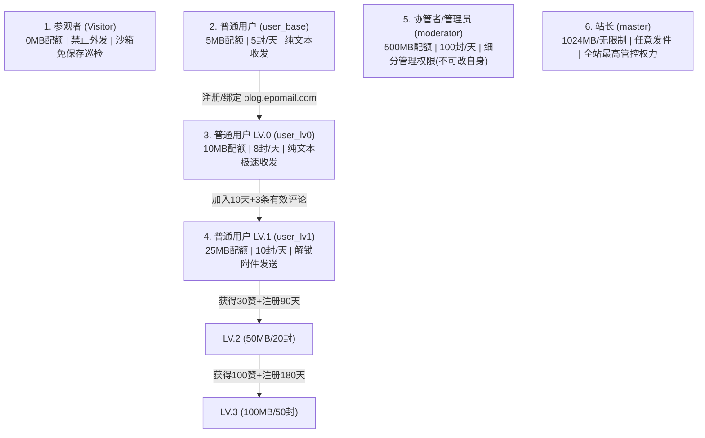

# shijianus-blog 书友分级与 EpoMail 跨专案权限映射规范 (User Level Specification)

本文档制定了 **shijianus-blog** (博客平台) 与 **epocanvas-mail** (EpoMail 开源邮局) 之间的用户分级体系、进阶规则、互动指标及跨平台特权映射标准。

---

## 1. 核心设计理念 (Core Design Philosophy)

1. **博客活跃推动邮局赋能**: 
   读者在 `shijianus-blog` 的深阅读、互动评论与优质讨论，将直接转化为在 `EpoMail` 邮局平台中的存储配额增长与高级功能解锁（如附件发送能力）。
2. **渐进式门槛与零冷启动门槛**:
   - 任何人均可通过 GitHub 外链作为「参观者」无门槛巡检体验系统；
   - 注册成为 EpoMail 普通用户即可享有基础纯文本收发；
   - 绑定/注册博客书友身份即刻晋升至 `LV.0`；
   - 积极参与交流讨论可自然进阶至 `LV.1`、`LV.2` 及 `LV.3`。
3. **安全与防刷机制**:
   - 等级评定基于真实的注册天数、有效评论数（排除被删除/折叠内容）以及社区点赞数。

---

## 2. 书友四阶成长体系 (Four-Tier Progression System)

| 等级 (Level) | 等级称号 (Title) | 博客达成要求 (Blog Requirements) | 对应 EpoMail 分组 (Mapped EpoMail Group) | 邮局核心特权与配额 (Mail Quota & Privileges) |
| :--- | :--- | :--- | :--- | :--- |
| **LV.0** | **认证书友** *(Verified Reader)* | 成功注册并绑定 `blog.epomail.com` 账号（即刻达成） | **普通用户 LV.0** (`user_lv0`) | • 存储配额提升至 **10 MB**<br>• 每日发件上限 **8 封/天**<br>• 支持 2 个邮箱别名<br>• 纯文本极速通道 |
| **LV.1** | **活跃学者** *(Active Scholar)* | • 注册满 **10 天**<br>• 30 天内阅读 **≥ 10 篇**文章且阅读时长 **≥ 100 分钟**<br>• 累计发表有效讨论 **≥ 3 条** | **普通用户 LV.1** (`user_lv1`) | • **存储配额跃升至 25 MB**<br>• **每日发件上限 10 封/天**<br>• **正式解锁附件与图片发送能力**<br>• 支持 3 个邮箱别名 |
| **LV.2** | **资深贡献者** *(Senior Contributor)* | • 注册满 **90 天**<br>• 累计发表评论 **≥ 20 条**<br>• 累计获得社区点赞 **≥ 30 个**<br>• 累计阅读时长 **≥ 500 分钟** | **普通用户 LV.2** *(核心尊享)* | • **存储配额跃升至 50 MB**<br>• **每日发件上限 20 封/天**<br>• 支持大附件极速传输<br>• 专属优先发信队列 |
| **LV.3** | **终身学者** *(Honorary Fellow)* | • 注册满 **180 天**<br>• 累计获得社区点赞 **≥ 100 个**<br>• 社区精选评论与优质博文创作者 | **普通用户 LV.3** *(至尊学者)* | • **存储配额跃升至 100 MB**<br>• **每日发件上限 50 封/天**<br>• 全局高阶极速发件通道<br>• 尊享金色学者徽章 |

---

## 3. 非博客用户与管理层级规范 (Global Role Taxonomy)

在 EpoMail 平台中，完整的 6 大基础管理与用户分组如下：



---

## 4. API 契约与跨专案通信 (API Contracts)

### 4.1 博客查询书友等级端点
- **路径**: `GET /api/auth/user-level?email={userEmail}`
- **说明**: 传入读者邮箱，实时动态计算书友达成等级、统计指标与下一阶提示。
- **响应示例**:
```json
{
  "ok": true,
  "email": "reader@epomail.com",
  "level": 1,
  "levelCode": "lv1",
  "levelName": "活跃学者",
  "badge": "LV.1 活跃学者",
  "mappedEpomailRole": "user_lv1",
  "epomailRoleName": "普通用户 LV.1",
  "stats": {
    "registeredDays": 14,
    "commentCount": 4,
    "likesReceived": 6,
    "readingMinutes": 130,
    "articlesRead": 12
  },
  "benefits": {
    "epomailStorageQuotaMb": 25,
    "epomailDailySendLimit": 10,
    "epomailAllowAttachment": true,
    "description": "25MB 存储空间，每日 10 封发件，解锁附件发送能力"
  },
  "nextLevelHint": "距 LV.2 还需注册满 90 天 (当前 14 天) 且累计获赞 30 个 (当前 6 赞)"
}
```

### 4.2 EpoMail 一键同步与自动升降级
- EpoMail 在用户登录水合或用户在个人主页点击「同步博客等级」时调用该端点；
- EpoMail 自动将用户在数据库中的身份组从 `user_base` 提升至 `user_lv0` 或 `user_lv1`，即刻刷新有效发信配额与附件权限。
