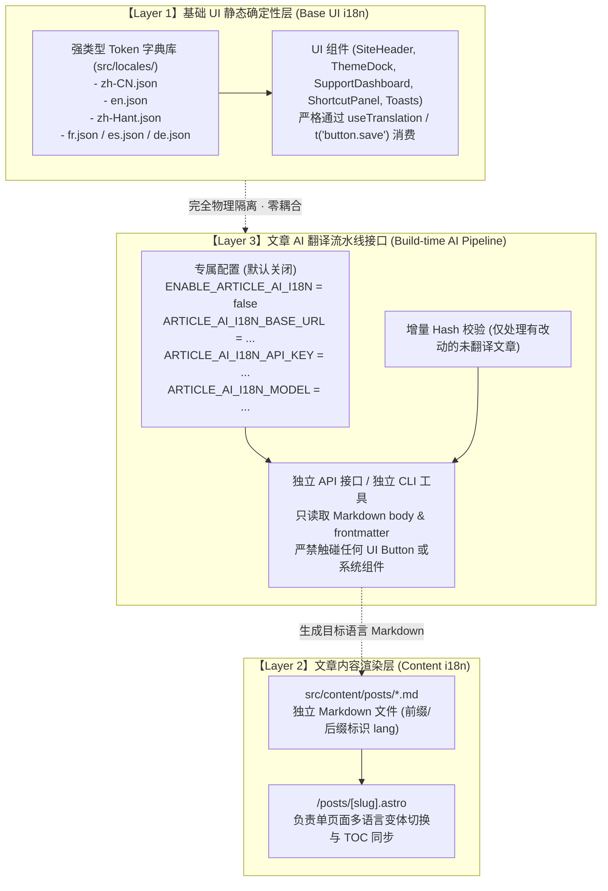

# 全站国际化 (i18n) 架构深度审计与专项分析报告
> **Document Status**: Production Readiness & Architectural Audit  
> **Audit Date**: 2026-09-19  
> **Auditor**: Antigravity Core Agent  
> **Scope**: UI 基础组件 (Buttons/Navs/Modals/Toasts)、页面路由与 SEO、客户端运行时、文章多语言 (Article i18n) 与 AI 翻译流水线

---

## 1. 审计执行概要 (Executive Summary)

本报告针对本博客系统（`shijianus-blog`）的国际化（i18n）现状展开了全景、只读的代码级物理审计。审计范围覆盖 **84 个源码文件**（Astro 页面模板、React 交互组件、配置与库函数）以及 **138 篇 Markdown 文章**。

### 核心审计结论总评：
1. **文章层 (Article Content Layer) 结构相对独立，但缺少增量与规范接口**：
   - 历史的 23 组文章已生成 6 语系覆盖（`zh-CN`, `zh-Hant`, `en`, `fr`, `es`, `de` 共 138 个 Markdown 文件）。
   - 详情页采用 Single-URL 多语言变体渲染与客户端切换。
   - 构建期虽然配置了 AI 翻译脚本雏形（`scripts/sync-post-i18n.mjs`），但**全量翻译极其耗时（预估 20~40 分钟），容易打断 build，目前处于非规范暴露状态**。
2. **基础 UI 层 (Base UI & Component Layer) 存在结构性缺陷与大量未覆盖死角**：
   - **硬编码严重**：全站 84 个核心源码文件中，有 **66 个文件含有硬编码中文（数千行代码）**。
   - 关键交互组件如赞助看板（`SupportDashboard.tsx` 142行中文）、快捷键提示（`ShortcutPanel.tsx` 99行中文）、控制台系统状态卡片（`ThemeOverlays.tsx` 多处系统指标）完全**零 i18n 覆盖**。
   - 超过 30 处动态反馈（`showUnifiedToast`, `emitActivity`, `setAccountNotice`）硬编码中文。
3. **架构机制隐患：过度依赖客户端 DOM TreeWalker 扫词替换**：
   - 采用 497 条“中文句子作 Key”的脆弱字典，任何标点、换行或空格变动即刻导致翻译失效。
   - 为避免破坏 React 虚拟 DOM，黑名单机制（`#console`, `#rightside`, `#theme-overlays` 等）导致这些区域成为**永久无法翻译的纯中文盲区**。
4. **AI 翻译与基础 UI 的隔离缺失明确规范**：
   - 基础 UI 按钮不应依赖 AI 翻译，必须由静态确定的字典提供；
   - AI 翻译只应聚焦于 Markdown 文章（article）本身，且在构建期必须具备独立开关、自定义模型端点及增量缓存控制。

---

## 2. i18n 现状全景与问题矩阵 (Comprehensive Issue Matrix)

### 维度一：UI 基础组件与按钮硬编码及缺失 (Hardcoded UI Elements)

| 组件 / 文件 | 缺失类型 | 典型受影响文案 / 元素 | 现状影响 |
| :--- | :--- | :--- | :--- |
| `src/components/theme/SupportDashboard.tsx` (142 行中文) | **完全缺失 i18n** | 咖啡 6 个档位描述（“便捷速溶咖啡条与小纸杯”、“经典商品外带咖啡纸杯”等）、4 大支付通道说明、赞助数据列表表头、寄语表单、复制反馈 | 外语用户访问赞助支持页面时，整个主体面板呈完全未翻译状态，体验割裂。 |
| `src/components/ShortcutPanel.tsx` (99 行中文) | **完全缺失 i18n** | 标题“快捷键提示”及全部 6 个按键动作（“唤起搜索面板”、“打开控制台”、“深浅模式切换”、“播放器切换”、“随机前往文章”、“返回首页”） | 按 Shift 呼出快捷键面板时，所有提示文字均为中文。 |
| `src/components/ThemeOverlays.tsx` (248 行中文) | **局部缺失 / 黑名单盲区** | 控制台 System Status Panel（“本站总字数”、“安全运行天数”、“最后推送”、“版本协议”、“活跃等级”、“内容密度”、“全站阅读”、“系统架构”及其 tooltip） | 由于 `#console` 位于 TreeWalker 黑名单中，该区域在所有外语模式下永远显示中文。 |
| 动态反馈与 Toasts (`ThemeOverlays.tsx`, `client-locale.ts`) | **硬编码中文** | 30+ 处 `showUnifiedToast`、`emitActivity`、`setAccountNotice`（例如：“正在验证 Epomail 凭据...”、“最多可同时佩戴 4 个称号”、“已切换为深色模式”等） | 交互通知、名片操作与活动流消息无法本地化。 |
| 侧边栏与页脚 (`Sidebar.astro`, `Footer.astro`) | **模板硬编码** | 站长名片信息、运行时间描述、页脚备案号、版权归属、驱动信息等 | 静态 HTML 模板直出中文，部分可被 TreeWalker 替换，部分断词无法匹配。 |
| 文章附属组件 (`PostCopyright.astro`, `PostOutdateNotice.astro`) | **模板硬编码** | 文章版权卡片（81 行中文）、过时提醒（“本文发布于 X 天前，部分内容可能已发生演化...”）、上一篇/下一篇按钮 | 文章正文虽切为英文，但文末版权与过时警告仍是中文。 |
| 移动端菜单与无障碍属性 (`SiteHeader.tsx`) | **Aria 属性硬编码** | `aria-label="关闭移动端导航菜单"`, `aria-label="移动端导航"`, `aria-label={`${item.label} 子页面`}` | 屏幕阅读器与无障碍辅助工具只能读取中文。 |

---

### 维度二：客户端 DOM TreeWalker 机制的架构缺陷 (TreeWalker Fragility)

目前博客的基础 i18n 主要依托 `src/lib/client-locale.ts` 中的 `document.createTreeWalker` 在客户端遍历 DOM 文本节点并执行映射替换。该机制存在以下四个重大隐患：

1. **中文句子作为 Key 的脆弱性**：
   - 字典采用 `MULTILINGUAL_DICTIONARY` 包含 497 条映射，键名为自然语言中文（如 `'全栈初探者 · 内容工程探索者 · 数字花园建造者'`）。
   - 只要 Astro 模板在格式化时多了一个空格、换行符（`\n`）或包含子标签（如 `<span>#</span>`），文本节点就会被截断，导致查找完全匹配失败，无法替换。
2. **缺乏类型系统保护 (Lack of Type Safety)**：
   - 新增或修改 UI 按钮（例如在某个组件加了一个 `<button>提交</button>`）时，TypeScript 编译器无法给出“缺少 i18n 键”的提示，极易遗漏。
3. **视觉闪烁与跳变 (FOUC)**：
   - 静态生成的 HTML 均为中文，客户端 JS 加载并执行 TreeWalker 需要时间，非中文用户进入页面时会发生先中文后英文的肉眼可见跳变。
4. **React Hydration 冲突与黑名单妥协**：
   - TreeWalker 运行时修改 DOM 会破坏 React 的虚拟 DOM 树比对；
   - 官方为了规避报错，在 `isIgnoredSubtree` 中硬编码排除了：
     ```ts
     el.closest('#article-container, #theme-overlays, #local-search, #console, #rightside, #post-comment, #nav-right, .theme-account-overlay, .theme-account-drawer, .ignore-opencc, .article-body, .post-content, [data-no-translate]')
     ```
   - 这一妥协直接导致了被忽略的子树内部如果缺乏独立的 React 多语言状态（如 `ShortcutPanel`, `SupportDashboard`, `#console` 内部系统卡片），就会彻底成为“未翻译死角”。

---

### 维度三：页面路由、SSR/SSG 渲染与国际化 SEO 缺陷 (Routing & SEO)

1. **Astro 原生 i18n 路由完全未启用**：
   - `astro.config.mjs` 中未配置 Astro 官方 `i18n` 规范模块（没有 `/en/`, `/zh-hant/`, `/fr/` 等子路由前缀）。
   - 除文章详情页通过单个 HTML 内置多个隐藏变体（`article-translation-variant`）外，所有独立页面（`/`, `/about`, `/support`, `/archives`, `/friends`, `/tags`, `/categories`）均只有唯一样本。
2. **国际化 SEO 评级几近为零**：
   - 搜索引擎蜘蛛抓取所有页面时，服务端响应的 HTML 均带有 `lang="zh-CN"`，且页面 Title、Meta Description、正文全为中文；
   - Google / Bing 无法针对英文或其它语种建立独立索引，无法参与多语言搜索排名。
3. **首屏语言提示误导**：
   - 英文操作系统用户打开网页，Chrome 会直接弹出“检测到网页语言为简体中文，是否由 Google 翻译为英文？”，体验不佳。

---

### 维度四：文章多语言与 AI 翻译构建流水线审计 (Article i18n & AI Pipeline)

针对用户关心的“AI 翻译只针对 article 而不包括基础 button，且在 build 时默认关闭、支持自定义 URL/API/模型”的核心要求，现状审计如下：

1. **构建脚本现状**：
   - 存在 `scripts/sync-post-i18n.mjs` 与 `src/lib/server-article-i18n.ts`；
   - 在 `package.json` 的 `prebuild` 和 `build` 中被挂载（`node scripts/sync-post-i18n.mjs`）；
   - 当前内置了开关 `ENABLE_ARTICLE_AI_I18N === 'true'`，默认未启用（静默跳过，耗时为 0）。
2. **为什么在 build 时全量执行“过长且不推荐”？**
   - 本站已有 23 组深度文章，若增加一篇新长文，翻译到 5 个目标语系需要调用 5 次长上下文 LLM 请求（长文分块可能需要 15~20 次 API 调用）；
   - 若全量扫描触发，将产生上百次网络请求，在 CI/CD（如 Cloudflare Pages 或 GitHub Actions）中极易触发 15 分钟超时强杀或触发服务商 429 速率限制；
   - 因此用户明确指出：**“默认关闭且不推荐在 build 时默认全量执行”是绝对科学且符合工业级构建标准的决定**。
3. **架构隔离边界现状**：
   - **现有脚本只操作 Markdown 文件与文章内容**，这一点在设计初衷上是正确的；
   - 但是整站配置中，AI 翻译与 AI 摘要（`server-ai-summary.ts`）共用部分环境变量（如 `INSTANCE_AI_BASE_URL`），没有清晰的专属独立参数空间；
   - 缺乏针对单篇文章按需触发的增量 CLI / 独立接口封装，用户无法在外部配置中直观指定自定义模型。

---

## 3. 隔离体系与接口设计规范建议 (Proposed Architecture)

基于本次审计，后续实施 UI 国际化重构与 AI 翻译接口开发时，应严格遵循以下**三层物理隔离模型**：



### 核心隔离原则：
1. **原则一：基础 UI 纯静态确定化**：
   - 所有的 Button、Navigation、Modal、Toast、Form 占位符一律由静态强类型字典维护，禁止任何 AI 介入基础 UI；
   - 逐步用精准的 `t('key')` 替代不确定的 TreeWalker 动态文本扫描。
2. **原则二：AI 翻译职能唯一性**：
   - AI 翻译接口仅输入 Markdown 原始字符串，输出目标语言 Markdown 字符串；
   - 杜绝 AI 翻译结果污染整站 UI 字典。
3. **原则三：AI 翻译流水线可配置、默认关闭、增量按需**：
   - 默认保持 `false`；
   - 暴露标准化配置结构，支持用户自定义任何 OpenAI 兼容端点（Base URL / API Key / Model）；
   - 引入文章 content-hash 机制，仅当源文章内容发生变动且缺少对应翻译时才触发，避免构建期无休止的长耗时阻塞。

---

## 4. 总结与后续实施步骤 (Actionable Roadmap)

本报告为全量只读审计产物。根据当前审计结果，后续具体优化任务可分步实施：
- **Phase 1 (基础 UI 治本)**：重构 `SupportDashboard.tsx`, `ShortcutPanel.tsx`, `ThemeOverlays.tsx` 等硬编码中文组件，统一接入规范 i18n 字典，消除 React 盲区与 Toasts 硬编码；
- **Phase 2 (架构隔离与接口开发)**：将文章 AI 翻译抽象为独立的按需接口与增量任务，配备专门的开关与自定义 URL/API/模型参数，保证构建默认零开销；
- **Phase 3 (全链路端到端审计)**：通过 Playwright 验证各语种下按钮、弹窗、看板及文章阅读的完整一致性。
