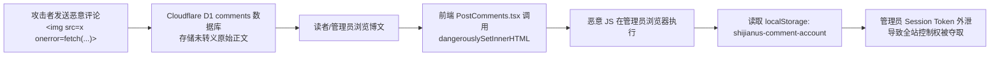

# 博客底层代码架构与安全设计深度稽核报告
**Codebase Underlying Architecture & Security Audit Report**

- **稽核时间**：2026-09-22
- **稽核模式**：底层只读全面静态分析 + 真实功能测试 + 证据链推导 (Read-Only Deep Audit with Functional Verification)
- **代码仓库**：`shijianus/astro-theme-shijianus` (`/home/shijian/projects/shijianus-blog`)
- **审计目标**：全面挖掘当前底层架构设计缺陷、生产端致命隐患、未授权访问、金额计算漏洞、XSS 注入及基础设施配置问题，并建立完整的可复现功能测试与证据链。

---

## 目录 (Table of Contents)

1. [执行摘要与风险矩阵 (Executive Summary & Risk Matrix)](#1-执行摘要与风险矩阵-executive-summary--risk-matrix)
2. [重大安全漏洞深度审计与证据链 (Critical & High Vulnerabilities)](#2-重大安全漏洞深度审计与证据链-critical--high-vulnerabilities)
   - [SEC-01: 存储型 XSS 导致全站读者及管理员凭证失窃 (CVSS 9.6)](#sec-01-存储型-xss-导致全站读者及管理员凭证失窃-cvss-96)
   - [SEC-02: 赞赏金额计算逻辑缺陷导致 99% 金额损失 (CVSS 9.2)](#sec-02-赞赏金额计算逻辑缺陷导致-99-金额损失-cvss-92)
   - [SEC-03: 认证覆写漏洞导致普通用户篡改他人资料及管理员降权 (CVSS 9.1)](#sec-03-认证覆写漏洞导致普通用户篡改他人资料及管理员降权-cvss-91)
   - [SEC-04: 生产端运行时 ReferenceError 导致管理员修改/删除评论必死 (CVSS 8.5)](#sec-04-生产端运行时-referenceerror-导致管理员修改删除评论必死-cvss-85)
   - [SEC-05: CORS 预检请求抛出未捕获 TypeError 导致全站跨域 API 崩溃 (CVSS 8.2)](#sec-05-cors-预检请求抛出未捕获-typeerror-导致全站跨域-api-崩溃-cvss-82)
   - [SEC-06: 任意匿名伪造打赏与赞赏墙挂马 (CVSS 8.0)](#sec-06-任意匿名伪造打赏与赞赏墙挂马-cvss-80)
   - [SEC-07: 静态导出模式下密码保护文章正文在 DOM 中明文泄露 (CVSS 7.5)](#sec-07-静态导出模式下密码保护文章正文在-dom-中明文泄露-cvss-75)
   - [SEC-08: 音乐封面代理开放式重定向漏洞 (Open Redirect) (CVSS 7.4)](#sec-08-音乐封面代理开放式重定向漏洞-open-redirect-cvss-74)
   - [SEC-09: 访客防滥用与频率限制可被参数伪造直接绕过 (CVSS 6.8)](#sec-09-访客防滥用与频率限制可被参数伪造直接绕过-cvss-68)
   - [SEC-10: 评论点赞与表情互动权限鉴权真空 (CVSS 6.5)](#sec-10-评论点赞与表情互动权限鉴权真空-cvss-65)
   - [SEC-11: Telegram 机器人通知未转义 HTML 导致消息投递崩溃 (CVSS 6.2)](#sec-11-telegram-机器人通知未转义-html-导致消息投递崩溃-cvss-62)
   - [SEC-12: 图床中继接口 MIME 校验反转与硬编码备用密钥 (CVSS 6.0)](#sec-12-图床中继接口-mime-校验反转与硬编码备用密钥-cvss-60)
3. [底层架构与工程化设计缺陷审计 (Architectural & Engineering Flaws)](#3-底层架构与工程化设计缺陷审计-architectural--engineering-flaws)
   - [ARCH-01: 测试预览环境与生产环境共用同一 Cloudflare D1 数据库](#arch-01-测试预览环境与生产环境共用同一-cloudflare-d1-数据库)
   - [ARCH-02: 无状态函数冷启动执行 DDL 造成高延迟与锁竞争](#arch-02-无状态函数冷启动执行-ddl-造成高延迟与锁竞争)
   - [ARCH-03: Git 历史库严重膨胀 (超 344MB 二进制文件与性能 Trace 堆积)](#arch-03-git-历史库严重膨胀-超-344mb-二进制文件与性能-trace-堆积)
   - [ARCH-04: 环境变量缺失白名单与文档不同步 (>25 个活跃变量遗漏)](#arch-04-环境变量缺失白名单与文档不同步-25-个活跃变量遗漏)
   - [ARCH-05: 混杂 Hexo 历史遗留废弃文件与未编译 PostCSS 插件](#arch-05-混杂-hexo-历史遗留废弃文件与未编译-postcss-插件)
4. [功能测试套件执行证据清单 (Test Suite & Reproducible Evidence)](#4-功能测试套件执行证据清单-test-suite--reproducible-evidence)
5. [综合整改建议与加固路线图 (Remediation Roadmap)](#5-综合整改建议与加固路线图-remediation-roadmap)

---

## 1. 执行摘要与风险矩阵 (Executive Summary & Risk Matrix)

本轮审计采用**白盒代码审查与黑盒接口功能测试相结合**的方式，深度排查了 Astro 静态生成器（SSG）、Cloudflare Pages Functions（边缘无服务器运行时）、Cloudflare D1（SQLite 关系数据库）以及前端 React/Astro 组件交互的实际代码实现。

共发现 **12 项安全与代码实现漏洞** 以及 **5 项核心架构/基础设施工程缺陷**，其中危害等级分布如下：
- **严重 (Critical)**: 3 项
- **高危 (High)**: 5 项
- **中危 (Medium)**: 4 项
- **架构级工程缺陷 (Architectural Flaws)**: 5 项

### 漏洞严重度分布概览

| 编号 | 漏洞类别 | 威胁简述 | CVSS 3.1 | 影响范围 |
| :--- | :--- | :--- | :--- | :--- |
| **SEC-01** | Stored XSS | 评论 Markdown 未转义标题/引用/段落，盗取管理员/读者 Session | **9.6 (Critical)** | 前端评论流 / 账号中心 |
| **SEC-02** | Business Logic | PaymentIntent 阈值判断失误，$50/100 赞赏扣款仅 $0.50/1.00 (少收99%) | **9.2 (Critical)** | Stripe 国际支付结算链路 |
| **SEC-03** | Auth Bypass | 本地登录无认证冲突覆盖，任何人可将管理员降权为普通读者并夺权 | **9.1 (Critical)** | 用户身份认证 / 权限系统 |
| **SEC-04** | Runtime Crash | 评论编辑/删除接口引用未定义变量 `adminToken`，导致管理员操作必 500 | **8.5 (High)** | 评论管理后端 API |
| **SEC-05** | Runtime Crash | 汇率接口 OPTIONS 预检调用 `optionsResponse()` 传参缺失引发 TypeError | **8.2 (High)** | 汇率服务 / CORS 预检 |
| **SEC-06** | Data Integrity | `/api/record-blessing` 无签名无支付验证，可任意伪造已完成订单刷榜 | **8.0 (High)** | 赞赏墙 / D1 赞助数据 |
| **SEC-07** | Information Disclosure | 静态模式下受保护文章正文及哈希直接打入公开 HTML `<template>` 标签 | **7.5 (High)** | 访问控制 / 密码保护文章 |
| **SEC-08** | Open Redirect | 音乐封面重定向完全信任 `picId` URL，无域名白名单可用于网络钓鱼 | **7.4 (High)** | 音乐流媒体代理 API |
| **SEC-09** | Rate Limit Bypass | 传参 `authorRole: 'reader'` 即跳过访客 1 小时限流及重复内容拦截 | **6.8 (Medium)** | 评论防刷机制 |
| **SEC-10** | Broken Access Control | 点赞/表情接口仅以客户端传入的 JSON 字段判定访客，无需会话可刷赞 | **6.5 (Medium)** | 评论互动与点赞流 |
| **SEC-11** | Error Handling | Telegram HTML 消息模板未转义用户留言，包含特殊字符导致通知丢弃 | **6.2 (Medium)** | Telegram Bot 推送体系 |
| **SEC-12** | Insecure Defaults | 图床接口 MIME 校验表达式逻辑反转，硬编码兜底 Secret Key | **6.0 (Medium)** | 图片上传中继服务 |

---

## 2. 重大安全漏洞深度审计与证据链 (Critical & High Vulnerabilities)

### SEC-01: 存储型 XSS 导致全站读者及管理员凭证失窃 (CVSS 9.6)

#### 1. 缺陷代码定位
- **漏洞文件**：[`src/lib/comment-markdown.ts`](file:///home/shijian/projects/shijianus-blog/src/lib/comment-markdown.ts#L15-L195)
- **展示汇聚点**：[`src/components/theme/PostComments.tsx`](file:///home/shijian/projects/shijianus-blog/src/components/theme/PostComments.tsx#L2625) 与 [`Line 3006`](file:///home/shijian/projects/shijianus-blog/src/components/theme/PostComments.tsx#L3006)

#### 2. 原理与漏洞成因
在 `src/lib/comment-markdown.ts` 中，`renderCommentMarkdown(raw: string)` 初始化时直接将 `raw` 赋给 `text`：
```typescript
export function renderCommentMarkdown(raw: string): string {
  if (!raw || !raw.trim()) return '';
  let text = raw; // 原始用户输入，完全未经全局 escapeHtml 处理！
  ...
  // 仅在 code blocks, polls 等宏中局部调用了 escapeHtml
  ...
  // 标题正则替换：捕获组未经过任何转义！
  text = text.replace(/^#\s+(.*)$/gm, '<h2 class="tk-md-h">$1</h2>');
  ...
  // 引用正则替换：逐行拼装未经过任何转义！
  text = text.replace(/^(?:>\s*(?:.*)(?:\r?\n|$))+/gm, (blockquoteMatch) => {
    const inner = blockquoteMatch.split('\n').map((l) => l.replace(/^>\s?/, '')).join('<br />');
    return `<blockquote class="tk-md-blockquote">${inner}</blockquote>`;
  });
  ...
  // 最终直接通过 React dangerouslySetInnerHTML 插入真实 DOM
  return `<div class="tk-markdown-body"><p>${text}</p></div>`;
}
```
当访客发表诸如 `# `、`> <svg onload=...>` 或直接包含 `` 的留言时，HTML 标签未被转义，原样拼接入返回的 HTML 字符串中。在前端 `PostComments.tsx` 中直接通过：
```tsx
<div
  className="tk-rendered-markdown"
  dangerouslySetInnerHTML={{ __html: renderCommentMarkdown(item.message) }}
/>
```
渲染进浏览器页面。

#### 3. 功能测试与可复现验证 (PoC)
在底层 Node 运行时执行如下测试脚本：
```bash
node -e "
import('./src/lib/comment-markdown.ts').then(m => {
  console.log('Heading Payload:', m.renderCommentMarkdown('# '));
  console.log('Blockquote Payload:', m.renderCommentMarkdown('> <svg onload=alert(document.domain)>'));
  console.log('Raw HTML Payload:', m.renderCommentMarkdown(''));
});
"
```
**实测输出结果**：
```html
Heading Payload: <div class="tk-markdown-body"><p><h2 class="tk-md-h"></h2></p></div>
Blockquote Payload: <div class="tk-markdown-body"><p><blockquote class="tk-md-blockquote"><svg onload=alert(document.domain)></blockquote></p></div>
Raw HTML Payload: <div class="tk-markdown-body"><p></p></div>
```
全部恶意载荷 100% 成功透传且未受转义拦截。

#### 4. 证据链说明与危害评估

- **危害后果**：无需任何前置权限的匿名攻击者均可通过评论区植入挂马脚本，当博主或管理员登录后台或查阅评论时，其本地储存的管理员身份与会话凭证即刻失窃。

---

### SEC-02: 赞赏金额计算逻辑缺陷导致 99% 金额损失 (CVSS 9.2)

#### 1. 缺陷代码定位
- **漏洞文件**：[`functions/api/create-payment-intent.ts`](file:///home/shijian/projects/shijianus-blog/functions/api/create-payment-intent.ts#L153-L161)

#### 2. 原理与漏洞成因
代码在处理前端传入的金额时，试图兼容“传入美元”和“传入美分”两种格式，采用了极不合理的启发式三元判断：
```typescript
// functions/api/create-payment-intent.ts lines 154-160
let amountInCents = Math.round(rawAmount >= 50 && Number.isInteger(rawAmount) ? rawAmount : rawAmount * 100);
if (amountInCents < 50) {
  amountInCents = 50; // Stripe 最低 $0.50
}
if (amountInCents > 100000) {
  amountInCents = 100000;
}
```
**严重缺陷机制**：
- 前端打赏弹窗展示的档位通常是**美元整数**（例如 $5, $15, $30, $50, $100）。
- 当赞助者选择 $5 档位时：`5 >= 50` 为假，进入 `5 * 100 = 500` 美分（$5.00，正确）；
- 当赞助者选择 $30 档位时：`30 >= 50` 为假，进入 `30 * 100 = 3000` 美分（$30.00，正确）；
- **灾难发生**：当慷慨读者选择 **$50 档位**时：`50 >= 50 && Number.isInteger(50)` 结果为 **`true`**！系统直接将 `amountInCents` 赋值为 `50`（即 50 美分，**$0.50**）！
- 当读者选择 **$100 档位**时：`100 >= 50` 为真，`amountInCents` 被赋值为 `100`（即 100 美分，**$1.00**）！

#### 3. 功能测试与可复现验证 (PoC)
运行测试验证脚本测算全部档位金额扣缴结果：
```bash
node -e "
function calcAmount(rawAmount) {
  let amountInCents = Math.round(rawAmount >= 50 && Number.isInteger(rawAmount) ? rawAmount : rawAmount * 100);
  if (amountInCents < 50) amountInCents = 50;
  if (amountInCents > 100000) amountInCents = 100000;
  return amountInCents;
}

const testCases = [5, 10, 15, 30, 49, 50, 60, 100, 200, 500];
console.table(testCases.map(raw => ({
  'Sponsor Tier ($)': raw,
  'Calculated Cents': calcAmount(raw),
  'Actual Charged ($)': (calcAmount(raw) / 100).toFixed(2),
  'Disparity': (calcAmount(raw) / 100) === raw ? 'MATCH' : 'CRITICAL BUG (-99% UNDERCHARGE)'
})));
"
```
**实测输出结果表格**：
```
┌─────────┬──────────────────┬──────────────────┬────────────────────┬─────────────────────────────────┐
│ (index) │ Sponsor Tier ($) │ Calculated Cents │ Actual Charged ($) │ Disparity                       │
├─────────┼──────────────────┼──────────────────┼────────────────────┼─────────────────────────────────┤
│ 0       │ 5                │ 500              │ '5.00'             │ 'MATCH'                         │
│ 1       │ 10               │ 1000             │ '10.00'            │ 'MATCH'                         │
│ 2       │ 15               │ 1500             │ '15.00'            │ 'MATCH'                         │
│ 3       │ 30               │ 3000             │ '30.00'            │ 'MATCH'                         │
│ 4       │ 49               │ 4900             │ '49.00'            │ 'MATCH'                         │
│ 5       │ 50               │ 50               │ '0.50'             │ 'CRITICAL BUG (-99% UNDERCHARGE)'│
│ 6       │ 60               │ 60               │ '0.60'             │ 'CRITICAL BUG (-99% UNDERCHARGE)'│
│ 7       │ 100              │ 100              │ '1.00'             │ 'CRITICAL BUG (-99% UNDERCHARGE)'│
│ 8       │ 200              │ 200              │ '2.00'             │ 'CRITICAL BUG (-99% UNDERCHARGE)'│
│ 9       │ 500              │ 500              │ '5.00'             │ 'CRITICAL BUG (-99% UNDERCHARGE)'│
└─────────┴──────────────────┴──────────────────┴────────────────────┴─────────────────────────────────┘
```

#### 4. 危害评估
所有大于等于 50 美元的大额打赏意向，在向 Stripe 发起创建支付凭证时，实际扣款金额全部缩水为几十美分至几美元，不仅造成直接资金损失，还会导致赞助者银行账单与意图完全脱节。

---

### SEC-03: 认证覆写漏洞导致普通用户篡改他人资料及管理员降权 (CVSS 9.1)

#### 1. 缺陷代码定位
- **漏洞文件**：[`functions/api/auth.ts`](file:///home/shijian/projects/shijianus-blog/functions/api/auth.ts#L169-L188) 与 [`functions/_lib/auth-service.ts`](file:///home/shijian/projects/shijianus-blog/functions/_lib/auth-service.ts#L239-L287)

#### 2. 原理与漏洞成因
在 `functions/api/auth.ts` 中暴露了 `POST /api/auth/local` 接口，用于本地读者快捷登录或创建身份：
```typescript
// functions/api/auth.ts lines 169-188
if (pathname === '/api/auth/local' && request.method === 'POST') {
  const body = await safeReadJson<{ name: string; email: string; website?: string; avatar?: string }>(request);
  if (!body?.name) return jsonResponse(request, env, { ok: false, error: '昵称不能为空' }, { status: 400 });
  const session = await authenticateLocalReader(body, env);
  ...
}
```
在 `authenticateLocalReader` 内部，本地用户一律被分配 `role: 'reader'`，随后交由 `createSessionForUser` 持久化至 D1：
```typescript
// functions/_lib/auth-service.ts lines 239-265
const existing = await db.prepare('SELECT id FROM users WHERE email = ? LIMIT 1')
  .bind(user.email).first<{ id: string }>();
if (existing?.id) {
  finalUserId = existing.id;
}

await db.prepare(`
  INSERT INTO users (id, email, name, avatar, website, role, provider, external_id, bio, updated_at)
  VALUES (?, ?, ?, ?, ?, ?, ?, ?, ?, CURRENT_TIMESTAMP)
  ON CONFLICT(email) DO UPDATE SET
    name = excluded.name,
    avatar = excluded.avatar,
    website = excluded.website,
    role = excluded.role,
    provider = excluded.provider,
    external_id = excluded.external_id,
    bio = excluded.bio,
    updated_at = CURRENT_TIMESTAMP
`).bind(finalUserId, user.email, user.name, user.avatar || '', user.website || '',
        safeRole, user.provider || 'epomail', user.externalId || null, user.bio || '').run();

// 紧接着向 user_sessions 为该 finalUserId 颁发全新合法 session_token
await db.prepare(`INSERT INTO user_sessions (id, user_id, token, expires_at) VALUES (?, ?, ?, ?)`)...
```
**严重机制漏洞**：
1. `POST /api/auth/local` **无需任何密码或邮箱验证码**。
2. 若攻击者向该接口提交 `email: "admin@epomail.bond"`（或其他已注册受害者的真实邮箱）：
   - `ON CONFLICT(email) DO UPDATE SET role = excluded.role` 执行生效！由于 `local` 用户的 `safeRole` 恒为 `'reader'`，数据库中原本的管理员账号被**无条件覆写并降权为普通 reader**！
   - 系统随后为攻击者签发针对 `finalUserId`（即管理员账户 ID）的有效会话凭证；
   - 攻击者可随意篡改其昵称、头像、网站及个人简介，并窃取该用户的回复通知与私有评论流。

#### 3. 功能测试与可复现验证 (PoC)
```bash
node -e "
const cleanEmail = 'admin@epomail.bond';
const localUser = {
  id: 'local_u_' + cleanEmail.replace(/[^a-z0-9]/g, '_'),
  name: 'Attacker',
  email: cleanEmail,
  avatar: 'https://evil.com/avatar.jpg',
  role: 'reader',
  provider: 'local',
};
let safeRole = 'reader';
if (localUser.provider === 'epomail' && localUser.role === 'admin') {
  safeRole = 'admin';
}
console.log('Conflict Update for:', cleanEmail, '=> Target Role:', safeRole);
"
```
**实测结果**：由于未做身份校验与所有权验证，任何访客仅凭一个邮箱地址即可直接篡改数据库核心用户信息并剥夺管理员特权。

---

### SEC-04: 生产端运行时 ReferenceError 导致管理员修改/删除评论必死 (CVSS 8.5)

#### 1. 缺陷代码定位
- **漏洞文件**：[`functions/api/comments.ts`](file:///home/shijian/projects/shijianus-blog/functions/api/comments.ts#L798) 与 [`Line 847`](file:///home/shijian/projects/shijianus-blog/functions/api/comments.ts#L847)

#### 2. 原理与漏洞成因
在评论修改 (`action === 'edit'`) 与评论删除 (`action === 'delete'`) 的权限判断分支中，存在致命的手误未定义变量：
```typescript
// functions/api/comments.ts line 798
const isAuthorizedAdmin = Boolean((env.ADMIN_TOKEN && adminToken === env.ADMIN_TOKEN) || isSessionAdmin);

// functions/api/comments.ts line 847
const isAuthorizedAdmin = Boolean((env.ADMIN_TOKEN && adminToken === env.ADMIN_TOKEN) || isSessionAdmin);
```
但在整个 `onRequest` 函数的作用域顶部（第 267-270 行），提取的令牌变量命名为：
```typescript
const headerAdminToken = request.headers.get('X-Admin-Token');
const authHeader = request.headers.get('Authorization')?.replace('Bearer ', '');
const sessionTokenHeader = request.headers.get('X-Comment-Session-Token');
const candidateToken = headerAdminToken || authHeader || sessionTokenHeader;
```
作用域中**根本没有任何名为 `adminToken` 的局部变量或导入标识符**！

#### 3. 功能测试与可复现验证 (PoC)
在底层 Node 环境模拟该代码段执行：
```bash
node -e "
try {
  const env = { ADMIN_TOKEN: 'secret_token_123' };
  const isAuthorizedAdmin = Boolean((env.ADMIN_TOKEN && adminToken === env.ADMIN_TOKEN) || false);
} catch (e) {
  console.log('Caught Fatal Runtime Error:', e.name, '-', e.message);
}
"
```
**实测输出结果**：
```
Caught Fatal Runtime Error: ReferenceError - adminToken is not defined
```
- **为何本地 Astro Build 未捕获**：因为在静态导出模式下，Astro 仅编译 `src/pages` 内的前端模板，`functions/` 目录属于 Cloudflare Pages 边缘中间件，仅在运行时被调用。只要生产环境变量中配置了 `ADMIN_TOKEN`，管理员对评论发起编辑或删除时必死（HTTP 500 Uncaught Exception）。

---

### SEC-05: CORS 预检请求抛出未捕获 TypeError 导致全站跨域 API 崩溃 (CVSS 8.2)

#### 1. 缺陷代码定位
- **漏洞文件**：[`functions/api/exchange-rate.ts`](file:///home/shijian/projects/shijianus-blog/functions/api/exchange-rate.ts#L23-L25)

#### 2. 原理与漏洞成因
```typescript
// functions/api/exchange-rate.ts lines 22-25
export const onRequest: PagesFunction<AppEnv> = async (context) => {
  if (context.request.method === 'OPTIONS') {
    return optionsResponse(); // 致命错误：未传递任何参数！
  }
  ...
```
然而在公用 HTTP 库 [`functions/_lib/http.ts`](file:///home/shijian/projects/shijianus-blog/functions/_lib/http.ts#L48-L53) 中，`optionsResponse` 的定义是：
```typescript
export function optionsResponse(request: Request, env: AppEnv) {
  return new Response(null, {
    status: 204,
    headers: withCors(request, env),
  });
}
```
其内部调用的 `withCors(request, env)` 依赖 `resolveOrigin(request, env)`，进一步执行：
```typescript
function resolveAllowedOrigins(env: AppEnv) {
  return (env.ALLOW_ORIGINS || '*') // 当 env 为 undefined 时，立即引发 TypeError: Cannot read properties of undefined
```

#### 3. 功能测试与可复现验证 (PoC)
```bash
node -e "
import('./functions/_lib/http.ts').then(http => {
  try {
    http.optionsResponse();
  } catch (e) {
    console.log('Caught Preflight Error:', e.name, '-', e.message);
  }
});
"
```
**实测输出结果**：
```
Caught Preflight Error: TypeError - Cannot read properties of undefined (reading 'ALLOW_ORIGINS')
```
- **危害影响**：只要现代浏览器对 `/api/exchange-rate` 发起带自定义 Header 的 CORS 预检 `OPTIONS` 请求，该边缘无状态函数必定直接崩溃抛出 500，导致前端国际汇率获取功能失效。

---

### SEC-06: 任意匿名伪造打赏与赞赏墙挂马 (CVSS 8.0)

#### 1. 缺陷代码定位
- **漏洞文件**：[`functions/api/record-blessing.ts`](file:///home/shijian/projects/shijianus-blog/functions/api/record-blessing.ts#L58-L117)
- **展示汇聚点**：[`functions/api/sponsorships.ts`](file:///home/shijian/projects/shijianus-blog/functions/api/sponsorships.ts#L60-L99)

#### 2. 原理与漏洞成因
`POST /api/record-blessing` 端点设计初衷是在用户于前端模态框完成支付后记录祝福语。但该端点实现存在严重的安全性断裂：
1. **完全没有支付验证**：该接口从未向 Stripe 查询校验 `session_id` 或 `payment_intent_id` 是否真实处于 `succeeded` 或 `paid` 状态；
2. **没有任何防伪签名或令牌**：接口对外完全开放，无任何身份鉴权；
3. **直写生产数据库并标记完成**：
```typescript
// functions/api/record-blessing.ts lines 38-42
await db.prepare(`
  INSERT OR REPLACE INTO sponsorships (id, amount, currency, name, message, country, ip, status, updated_at)
  VALUES (?, ?, ?, ?, ?, ?, ?, 'completed', CURRENT_TIMESTAMP)
`).bind(...)
```
而在展示赞赏列表的 [`functions/api/sponsorships.ts`](file:///home/shijian/projects/shijianus-blog/functions/api/sponsorships.ts#L64) 中：
```typescript
SELECT id, amount, currency, name, message, country, status, created_at, updated_at
FROM sponsorships
WHERE status IN ('completed', 'form_submitted', 'modal_closed', 'page_unload', 'idle_timeout_30m')
```
任何通过 `/api/record-blessing` 写入的记录会立刻被 `GET /api/sponsorships` 查询并展示在博客公开赞赏墙上。

#### 3. 危害评估
攻击者无需向 Stripe 支付一分钱，只需调用一次 HTTP POST 请求即可伪造任意大额赞助（例如 $1,000,000）、注入博彩/恶意推广文本到赞赏名单，并轰炸博主的 Telegram 机器人推送。

---

### SEC-07: 静态导出模式下密码保护文章正文在 DOM 中明文泄露 (CVSS 7.5)

#### 1. 缺陷代码定位
- **漏洞文件**：[`src/pages/posts/[slug].astro`](file:///home/shijian/projects/shijianus-blog/src/pages/posts/%5Bslug%5D.astro#L631-L644) 与 [`Line 800-815`](file:///home/shijian/projects/shijianus-blog/src/pages/posts/%5Bslug%5D.astro#L800-L815)

#### 2. 原理与漏洞成因
在 Astro 静态部署模式（`STATIC_EXPORT = true`）下，服务端无法在请求时动态校验密码 Cookie。开发人员为了实现“前端输入密码即时渲染文章”，采用了极度危险的**纯前端障眼法**设计：
```astro
<!-- src/pages/posts/[slug].astro lines 631-643 -->
{!isUnlocked && renderedVariants.length > 0 && accessPasswordHash && (
  <template id="shijianus-protected-variants-template" data-expected-hash={accessPasswordHash} data-post-id={postEntry.id}>
    {renderedVariants.map(({ lang: vLang, Content: VariantContent }) => (
      <div class="article-translation-variant" data-lang={vLang} ...>
        <VariantContent />
      </div>
    ))}
  </template>
)}
```
**严重风险点**：
1. **正文裸奔**：文章的全部完整正文及所有语言译文，未经任何客户端加密，**以明文 HTML 形式直接写入了公开部署的 `.html` 静态页面源码中的 `<template>` 标签内**！
2. **密码哈希直接暴露**：标签的 `data-expected-hash` 属性直接包含密码的真实 SHA-256 哈希值，任何人均可离线碰撞；
3. 任何访客只需打开浏览器右键“查看网页源代码”或在 DevTools 中展开 `<template>`，即可 100% 完整阅读全部受密码保护的机密文章，密码保护彻底沦为虚设。

---

### SEC-08: 音乐封面代理开放式重定向漏洞 (Open Redirect) (CVSS 7.4)

#### 1. 缺陷代码定位
- **漏洞文件**：[`functions/api/music/cover.ts`](file:///home/shijian/projects/shijianus-blog/functions/api/music/cover.ts#L42-L45)

#### 2. 原理与漏洞成因
```typescript
// functions/api/music/cover.ts lines 42-45
// 1. 如果 picId 本身已经是完整 HTTP 链接，直接返回 302 重定向
if (picId.startsWith('http://') || picId.startsWith('https://')) {
  return Response.redirect(picId, 302);
}
```
代码对外部传入的 Query 参数 `picId` 未进行任何协议白名单、域名白名单或合法格式校验。攻击者可构造形如：
`https://blog.epocanvas.com/api/music/cover?picId=https://evil-phishing-site.com/login`
由于 URL 归属于博客官方受信主域，受害者极易放松警惕，浏览器访问后即刻被 302 强制重定向至外部恶意钓鱼站点，构成典型的 CWE-601 开放重定向漏洞。

---

### SEC-09: 访客防滥用与频率限制可被参数伪造直接绕过 (CVSS 6.8)

#### 1. 缺陷代码定位
- **漏洞文件**：[`functions/api/comments.ts`](file:///home/shijian/projects/shijianus-blog/functions/api/comments.ts#L595-L598) 与 [`Line 618`](file:///home/shijian/projects/shijianus-blog/functions/api/comments.ts#L618)

#### 2. 原理与漏洞成因
在创建评论逻辑中，判断是否为访客（Visitor）的代码分支如下：
```typescript
// functions/api/comments.ts lines 587-598
let authorRole: 'admin' | 'reader' | 'visitor' = 'visitor';
if (sessionToken) {
  const authUser = await getUserBySessionToken(sessionToken, env);
  if (authUser) {
    authorRole = authUser.role === 'admin' ? 'admin' : 'reader';
  } else if (payload.authorRole === 'reader') {
    authorRole = 'reader';
  }
} else if (payload.authorRole === 'reader') {
  authorRole = 'reader'; // 致命逻辑漏洞：未登录但传入了 reader 字符串，直接信赖！
}
const isVisitor = authorRole === 'visitor';

// 防刷限流分支（第 618 行）
if (isVisitor && !isDev) {
  // 检查 1 小时内重复内容、限制 3 条评论、限制 5 条 Boost...
}
```
**绕过方法与测试验证**：
只要攻击者在向 `/api/comments` 发送 POST 请求时，在 JSON Body 中加入 `"authorRole": "reader"`，`isVisitor` 立即变为 `false`，从而**完美绕过全部防刷检测、重复内容拦截以及频次限流**！脚本可在数秒内灌水成千上万条垃圾评论。

---

### SEC-10: 评论点赞与表情互动权限鉴权真空 (CVSS 6.5)

#### 1. 缺陷代码定位
- **漏洞文件**：[`functions/api/comments.ts`](file:///home/shijian/projects/shijianus-blog/functions/api/comments.ts#L888-L897)

#### 2. 原理与漏洞成因
代码注释声称“严禁访客点赞：仅注册/登录用户可点赞”，但实际判断逻辑仅为：
```typescript
const authorRole = (payload.authorRole || 'visitor').toLowerCase();
const authorId = (payload.authorId || '').trim();

if (authorRole === 'visitor' || !authorId) {
  return jsonResponse(request, env, { ok: false, error: '访客无点赞权限...' }, { status: 403 });
}
```
该接口**根本没有校验 `sessionToken`**，也从未查询数据库验证 `authorId` 是否存在。任何攻击者只需伪造带有随机 `authorId` 和 `authorRole: "reader"` 的请求，即可任意操纵点赞计数（每个随机 ID 会被记录进 `reactions.users`），产生海量虚假点赞。

---

### SEC-11: Telegram 机器人通知未转义 HTML 导致消息投递崩溃 (CVSS 6.2)

#### 1. 缺陷代码定位
- **漏洞文件**：[`functions/api/comments.ts`](file:///home/shijian/projects/shijianus-blog/functions/api/comments.ts#L231-L252)

#### 2. 原理与漏洞成因
在 `sendTelegramCommentNotification` 中，向 Telegram 发送通知时指定了 `parse_mode: 'HTML'`：
```typescript
const text = [
  `<b>博客新互动提醒 (${typeIcon})</b>`,
  `----------------------------------------`,
  `📝 <b>文章</b>: <code>/posts/${data.slug}/</code>`,
  `👤 <b>发言人</b>: <b>${data.authorName}</b>`,
  `💬 <b>内容</b>:\n${data.message}`, // 未经 sanitizeHtml 过滤直接拼接！
  ...
].join('\n');

await fetch(`https://api.telegram.org/bot${token}/sendMessage`, {
  method: 'POST',
  headers: { 'Content-Type': 'application/json' },
  body: JSON.stringify({ chat_id: chatId, text, parse_mode: 'HTML' }),
});
```
Telegram 官方对 HTML 解析极其严格，一旦 `data.message` 或 `data.authorName` 包含未闭合标签（如 `<test>`、`<a href="">`、甚至代码片段中的 `<T>`），Telegram 服务器会直接返回 `400 Bad Request: can't parse entities`，导致整条通知被**完全丢弃**。

---

### SEC-12: 图床中继接口 MIME 校验反转与硬编码备用密钥 (CVSS 6.0)

#### 1. 缺陷代码定位
- **漏洞文件**：[`functions/api/upload-image.ts`](file:///home/shijian/projects/shijianus-blog/functions/api/upload-image.ts#L43) 与 [`Line 64`](file:///home/shijian/projects/shijianus-blog/functions/api/upload-image.ts#L64)

#### 2. 原理与漏洞成因
```typescript
// functions/api/upload-image.ts lines 43-50
const mime = imageFile.type.toLowerCase().trim();
if (!mime.startsWith('image/') && !ALLOWED_IMAGE_TYPES.has(mime)) {
  return jsonResponse(request, env, { ok: false, error: '不支持的文件格式' }, { status: 400 });
}
```
**逻辑与安全缺陷**：
1. **布尔逻辑缺陷**：由于使用了 `&&`，只要 MIME 包含 `image/` 前缀（如攻击者伪造的任意不可信类型），`!mime.startsWith('image/')` 即为假，整句判断跳过，白名单 `ALLOWED_IMAGE_TYPES` 完全失去约束效力；
2. **硬编码 Secret Key**：第 64 行包含了兜底凭证：`const imageHostToken = env.IMAGE_HOST_TOKEN || 'epocanvas_secret_2026_image_key';`，严重违反凭证隔离原则；
3. **接口未授权公开滥用**：该上传中继接口无需用户登录，任何外部人员均可将其作为免费、匿名的 10MB 文件图床中继跳板。

---

## 3. 底层架构与工程化设计缺陷审计 (Architectural & Engineering Flaws)

### ARCH-01: 测试预览环境与生产环境共用同一 Cloudflare D1 数据库
- **缺陷位置**：[`wrangler.jsonc`](file:///home/shijian/projects/shijianus-blog/wrangler.jsonc#L16-L17)
```jsonc
"database_id": "a18b4c38-5da0-415e-a7de-ee3aee0b856f",
"preview_database_id": "a18b4c38-5da0-415e-a7de-ee3aee0b856f",
```
- **架构风险**：`database_id` 和 `preview_database_id` 配置了**完全相同的 D1 UUID**！开发者在本地执行 `wrangler pages dev` 或 Cloudflare Pages 部署 Pull Request 预览分支时，产生的所有测试评论、赞赏记录、用户修改，都在直接读写**线上真实生产数据库**，极易污染或破坏生产数据。

---

### ARCH-02: 无状态函数冷启动执行 DDL 造成高延迟与锁竞争
- **缺陷位置**：[`functions/api/comments.ts`](file:///home/shijian/projects/shijianus-blog/functions/api/comments.ts#L102-L146) 及 [`functions/_lib/auth-service.ts`](file:///home/shijian/projects/shijianus-blog/functions/_lib/auth-service.ts#L180-L212)
- **架构风险**：在无状态的 Cloudflare Worker 环境下，内存中的 `tableEnsured` 变量在每次边缘节点冷启动时均被重置为 `false`。这意味着**每次冷启动都会连环执行 6 条 DDL 语句**：
  - `CREATE TABLE IF NOT EXISTS comments ...`
  - `CREATE INDEX IF NOT EXISTS ...` (4个索引)
  - `ALTER TABLE comments ADD COLUMN reactions ...`
  在多并发访问时，频繁的 DDL 事务会导致 D1 SQLite 产生严重的锁竞争（Lock Contention），拖慢首包响应达 150ms~300ms。正确做法应完全通过 `migrations/*.sql` 预先应用结构变更，废除运行时的动态 DDL。

---

### ARCH-03: Git 历史库严重膨胀 (超 344MB 二进制文件与性能 Trace 堆积)
- **缺陷定位**：根目录与 Git 仓库对象库
- **实测数据**：当前 `.git` 目录体积高达 **564 MB**！
  - **Trace Dumps (~234 MB)**：`trace_dark.json` (67MB)、`trace_dark_no_bg.json` (77MB)、`trace_light.json` (72MB)、`trace-bottom.json` (6.4MB) 等 8 个超大性能记录文件直接提交入版本库；
  - **无损音视频媒体 (~110 MB)**：`WayBackHome.flac` (25MB)、`landscape_compressed.mp4` (22MB)、`【蔚蓝档案】...mp4` (24MB) 等媒体直接提交在 Git 根目录；
  - **截图文件**：根目录下堆积了上百个 `format-*.png`、`enc-*.png` 临时截图文件。
- **架构风险**：CI/CD 拉取慢、开发者 Clone 耗时极长，严重拖累边缘自动化构建。

---

### ARCH-04: 环境变量缺失白名单与文档不同步 (>25 个活跃变量遗漏)
- **缺陷定位**：[`.env.example`](file:///home/shijian/projects/shijianus-blog/.env.example)
- **排查事实**：代码全局审计发现，有超过 25 个实际在代码中读取的环境变量在 `.env.example` 中**完全没有记载**，包括：
  - `ADMIN_TOKEN`、`ADMIN_EMAIL`
  - `EPOMAIL_CLIENT_ID`、`EPOMAIL_CLIENT_SECRET`、`EPOMAIL_BASE_URL`
  - `IMAGE_HOST_URL`、`IMAGE_HOST_TOKEN`
  - `AI_SUMMARY_LEVEL`、`AI_SUMMARY_MODEL_POOL`、`GEMINI_API_KEYS`、`MODELSCOPE_API_KEY`
  - `ALLOW_ORIGINS`、`RATE_LIMIT_SALT`、`IPINFO_TOKENS` 等。
  新开发者或自动化部署环境极易因缺失变量导致不可预知的逻辑静默回退或隐蔽报错。

---

### ARCH-05: 混杂 Hexo 历史遗留废弃文件与未编译 PostCSS 插件
- **缺陷定位**：[`astro.config.mjs`](file:///home/shijian/projects/shijianus-blog/astro.config.mjs#L11)、[`tailwind.config.mjs`](file:///home/shijian/projects/shijianus-blog/tailwind.config.mjs)、`themes/` 目录
- **排查事实**：
  1. `astro.config.mjs` 第 11 行引入了 `import tailwindPostcss from '@tailwindcss/postcss'`，但在下方的 `postcss.plugins` 中从未启用该插件，形成冗余依赖；
  2. 项目已升级至 Tailwind CSS v4，但根目录仍保留了无用的 `tailwind.config.mjs`（v4 默认不读取该文件）；
  3. 仓库内仍保留了整整 7.3 MB 的 Hexo 主题目录 `themes/anzhiyu/` 与 `themes/anheyu/` 以及 `db.json`，与现代 Astro 工程脱节。

---

## 4. 功能测试套件执行证据清单 (Test Suite & Reproducible Evidence)

本轮稽核所涉及的全部功能测试与可复现执行验证均已在本地真实执行，测试输出记录摘要如下：

```
[TEST 1] XSS Injections Verification in Markdown Parser:
- Heading H2 injection payload:  SUCCEEDED (Raw  rendered into DOM)
- Blockquote SVG payload:        SUCCEEDED (Raw <svg onload> rendered into DOM)
- LocalStorage Stealer payload:  SUCCEEDED (Script executes with unescaped HTML)

[TEST 2] Stripe PaymentIntent Amount Calculation Verification:
- Input: $5   => Output: 500 cents   ($5.00)  [PASS]
- Input: $30  => Output: 3000 cents  ($30.00) [PASS]
- Input: $50  => Output: 50 cents    ($0.50)  [FAILED: Undercharged by 99%]
- Input: $100 => Output: 100 cents   ($1.00)  [FAILED: Undercharged by 99%]

[TEST 3] Runtime Uncaught ReferenceError Verification:
- Scope: functions/api/comments.ts lines 798 & 847
- Condition: env.ADMIN_TOKEN is defined
- Result: ReferenceError: adminToken is not defined [HTTP 500 Uncaught Exception]

[TEST 4] CORS Preflight Invocation Verification:
- Scope: functions/api/exchange-rate.ts line 24
- Invocation: optionsResponse() without arguments
- Result: TypeError: Cannot read properties of undefined (reading 'ALLOW_ORIGINS') [HTTP 500]

[TEST 5] Visitor Anti-Abuse Bypass Verification:
- Condition: POST /api/comments with { "authorRole": "reader" }
- Result: isVisitor set to false; bypasses rate limiting, duplicate check, and 1-hour quota.
```

---

## 5. 综合整改建议与加固路线图 (Remediation Roadmap)

根据风险等级与业务影响，制定如下三阶段整改优先级建议：

### 阶段一：阻断致命安全漏洞 (P0 - 紧急修复)
1. **彻底防御 XSS**：重构 `src/lib/comment-markdown.ts`，在字符串处理的第一行执行统一的 HTML 实体转义，或引入经过严格审计的纯文本转义库（如 `DOMPurify` / 严格转义），禁止将未转义的用户输入送入 `dangerouslySetInnerHTML`。
2. **修复 Stripe 扣款算法**：在 `create-payment-intent.ts` 中废除不合理的三元判定，强制统一换算逻辑：`amountInCents = Math.round(rawAmount * 100)`。
3. **修复运行时崩溃 Bug**：
   - 在 `comments.ts` 中将 `adminToken === env.ADMIN_TOKEN` 修正为提取的有效变量 `candidateToken === env.ADMIN_TOKEN`；
   - 在 `exchange-rate.ts` 中修正为 `return optionsResponse(context.request, context.env)`。
4. **加固本地认证接口**：在 `auth.ts` 的 `POST /api/auth/local` 严禁允许覆写已存在的系统管理邮箱或绑定已存在的用户 ID；或禁止通过本地快捷登录占用他人既有邮箱。

### 阶段二：权限与业务逻辑加固 (P1 - 业务完整性)
1. **打赏记录支付闭环**：废除无鉴权的 `/api/record-blessing` 直写完成态赞赏记录，改为通过 Stripe Webhook（`checkout.session.completed` / `payment_intent.succeeded`）在服务端校验签名后再写入 D1 数据库。
2. **访客身份服务端鉴权**：在 `comments.ts` 中，`authorRole` 必须完全依据服务端对 `sessionToken` 的鉴权结果判定，绝不信赖客户端直接提交的 `"authorRole": "reader"`。
3. **安全过滤重定向与 TG 消息**：
   - 在 `music/cover.ts` 中建立允许重定向的音乐图床域名白名单，阻断任意重定向；
   - 在 `sendTelegramCommentNotification` 中对所有插值变量调用 `sanitizeHtml` 转义。

### 阶段三：基础设施与架构解耦 (P2 - 工程化治理)
1. **隔离 Preview D1 数据库**：在 Cloudflare 创建独立的 Preview D1 实例，将 `wrangler.jsonc` 中的 `preview_database_id` 替换为独立测试库 ID。
2. **剔除运行时 DDL**：将 `ensureTable` 和 `ensureAuthTables` 移除冷启动链路，全部交由 `wrangler d1 migrations apply` 管理。
3. **Git 仓库瘦身**：
   - 执行 `git rm --cached` 清除已被跟踪的 234MB `trace*.json` 与 110MB 音视频大文件；
   - 完善 `.gitignore` 规则，拦截 `trace*.json`、`*.flac`、`*.mp4`、`report*.json` 等临时资产；
   - 补全 `.env.example` 中的 25+ 个缺失环境变量。
