Hallo an alle Geek-Entwickler, Stammleser und tiefgründigen Blogfreunde!

Oft fragen sich aufmerksame Freunde, wenn sie am Ende von Blogartikeln interagieren oder mit der Maus über die Avatar-Bilder im Kommentarbereich fahren: Warum tragen einige Leser **„LV.1 · Mitwirkender“**, andere das strahlende **„LV.3 · Pionier“**, und eine sehr kleine Anzahl von Kernlesern zeigt sogar glänzende Zahlen wie **„📜 Gründungs-Schreiber“** oder **„TL.102“**, die die Obergrenze durchbrechen? Wie werden die Bezeichnungen **„☕ Langsame Lesezeit“** und **„💎 Tief geschätzt“** in der Visitenkarten-Einblendung aktiviert? Und warum hat der Avatar des Webmasters eine einzigartige, leicht abgerundete quadratische Form mit einer goldenen Krone?

Heute wird dieser offizielle, maßgebliche Leitfaden, der die **originelle Geek-Designästhetik von EpoCanvas** verkörpert, das aktuell auf dem EpoCanvas-Blog verwendete **zweigleisige Vertrauensstufensystem (LV-Zugangsschwelle + TL-Gewichtungsmechanismus)**, die **11 Kern-Leser-Standardtitel**, die **6 seltenen und limitierten Ehrentitel**, die **Rechte und Pflichten von Administratoren und dem Webmaster** sowie die zugrundeliegenden Bewertungsalgorithmen und praktischen Upgrade-Pfade für **über 15 exklusive Erfolgsabzeichen** vollständig offenlegen!

---

> [!warning]
> **Hinweis zur Datensynchronisation und Statistik**: Die Leserdaten dieses Blogs (einschließlich Lesezeit, aktive Tage, Kommentare, Emoji-Beifall-Aufzeichnungen) werden lokal persistent im `LocalStorage` des Clients gespeichert und asynchron über Cloudflare Workers / D1 Backend-Authentifizierungskanäle synchronisiert. Bei Verwendung des Inkognito-Modus, häufigem geräteübergreifendem Zugriff oder dem Leeren des Browser-Caches kann es zu geringen statistischen Verzögerungen oder temporären Sitzungsabbrüchen kommen. Es wird empfohlen, eine spezielle E-Mail-Adresse (z. B. Epomail) im Kontocenter zu verknüpfen, um die dauerhafte Bindung Ihrer Rechte zu gewährleisten!

> [!tip]
> **Schnellzugriff auf Erfolge und Abzeichen**: Klicken Sie auf die **„Kontocenter-Schublade (Account Drawer)“** rechts in der oberen Navigationsleiste des Blogs oder auf die Schnellschaltfläche in der Konsole, um Ihre aktuelle Vertrauensstufe (TL), den Prozentsatz bis zur nächsten Stufe und den freigeschalteten Erfolgspool in Echtzeit anzuzeigen. Sie können dann frei bis zu **4 exklusive Abzeichen** auswählen und tragen, um Ihre Geek-Identität zu zeigen!

<div data-theme-toc="true"> </div>

---

# 1. Kernmechanismus: Das zweigleisige System von LV-Zugangsschwelle und TL-Gewichtung

Das EpoCanvas Blog-Community-System verwendet eine präzise **zweigleisige Governance-Architektur**: **LV (Level)** und **TL (Trust Level)** haben jeweils ihre eigenen Aufgaben und ergänzen sich gegenseitig:

> [!important]
> **【Kernmechanismus: Der wesentliche Unterschied zwischen LV-Zugangsschwelle und TL-Gewichtungsranking】**
> - **LV (Level 0 ~ 4) – Bestimmt die Mindeststufe der Inhalte, die Sie sehen können (Zugangsschwelle / Zugriffsberechtigungssperre)**:
>   - LV ist die vom Blog festgelegte Schwelle für Inhaltssicherheit und Tiefenklassifizierung.
>   - **LV.0 (Anfänger)**: Kann nur reguläre öffentliche Blogbeiträge einsehen;
>   - **LV.1 (Fortgeschritten)**: Schaltet Turbo-Boost, exklusive Kommentarinteraktionen und fortgeschrittene technische Diskussionsspalten frei;
>   - **LV.2 (Geek)**: Schaltet fortgeschrittene Architekturaufzeichnungen, private faltbare Codeblöcke und Spalten für experimentelle interne Tests frei;
>   - **LV.3 (Pionier)**: Schaltet geschlossene Pionier-Workshops und Berechtigungen für eingeladene technische Vorschläge frei;
>   - **LV.4 (Verwaltung und Hauptentwickler)**: Community-Überwachung und -Verwaltung (Administrator) und uneingeschränkte Zugriffsrechte auf die gesamte Website (Webmaster).
> - **TL (Trust Level 0 ~ 100+) – Bestimmt Ihre Autorität und Ihr Ranking-Gewicht innerhalb dieses Level-Bereichs**:
>   - TL misst Ihre Aktivität und Ihren Vertrauensaufbau innerhalb Ihres aktuellen Level-Bereichs.
>   - Innerhalb derselben LV-Stufe haben Leser mit höherem TL eine höhere Anzeigepriorität im Kommentarbereich, ein größeres Gewicht bei Likes und Beifall, großzügigere Quoten für Anti-Spam-Ratenbegrenzung und sind auffälliger in der Leser-Aktivitätsrangliste.

---

> [!tip]
> **【Wichtige Aufstiegskriterien: Maximale Vertrauensstufen-Obergrenze (Max TL Cap), Kaskaden-Freischaltkette und 35-Punkte-Obergrenze für Aktivitätspunkte】**
> 1.  **Der Titel bestimmt die maximale TL-Obergrenze (Max TL Cap)**:
>     - Das TL im Titelsuffix repräsentiert die **maximale Vertrauensstufen-Obergrenze (Max TL Cap)**, die dieser Titel verleiht, und nicht den festen aktuellen Wert.
>     - **Strenge Festlegung der Obergrenzen für Stufenbereiche**:
>       - **LV.0 Stufe**: Obergrenze streng auf **TL.2** begrenzt (Neuer Benutzer Cap 0, Initialer Benutzer Cap 2);
>       - **LV.1 Stufe**: Obergrenze streng auf **TL.20** begrenzt (Basisbenutzer Cap 8, Mitwirkender Cap 15, Spekulativer Gelehrter Cap 20);
>       - **LV.2 Stufe**: Obergrenze streng auf **TL.50** begrenzt (Aktiver Benutzer Cap 35, Evergreen Geek Cap 50);
>       - **LV.3 Stufe**: Obergrenze für reguläre Leser streng auf **TL.90** begrenzt (Pionier Cap 70, Jahresbenutzer Cap 80, Tintenmeer-Meister Cap 90);
>       - **LV.4 Stufe**: Administrator TL 91 ~ 99, 👑 Webmaster TL 100 ist konstant die absolute Maximalstufe.
>     - **Praxisbeispiel**: Die maximale Vertrauensstufen-Obergrenze für einen LV.0 Initialen Benutzer ist 2 (TL Cap 2). Selbst wenn ein neuer Leser extrem fleißig ist und 1000 Minuten Blogbeiträge am Stück liest, bleibt seine Vertrauensstufe im System streng auf **TL.2** gesperrt, solange er noch keinen echten Kommentar veröffentlicht hat, um den LV.1 Basisbenutzer freizuschalten!
> 2.  **Kaskaden-Abhängigkeits-Freischaltkette (Strict Waterfall Progression)**:
>     - Zwischen Titeln derselben oder unterschiedlicher LV-Stufen besteht eine strenge Kette von Vorab-Freischaltungen. **Alle Anforderungen des vorherigen Titels müssen zuerst erfüllt werden, um nachfolgende Titel freizuschalten; ein Überspringen von Stufen ist strengstens untersagt!**
>     - **Praxisbeispiel**: Leser müssen zuerst den Titel „Pionier“ freischalten, bevor sie den Titel „Jahresbenutzer“ freischalten können. Wenn der Titel „Pionier“ noch nicht erreicht wurde (z. B. unzureichende Kommentare oder Likes), ist es absolut unmöglich, den Titel „Jahresbenutzer“ zu überspringen und freizuschalten, selbst wenn die aktiven Registrierungstage 365 Tage erreicht haben!
> 3.  **Wie wird die Vertrauensstufe (TL) erhöht und berechnet? (35 Aktivitätspunkte Obergrenze)**:
>     - Die Vertrauensstufe wird vom System dynamisch berechnet anhand von 4 mehrdimensionalen, echten Leseraktivitäten:
>       $$\text{Raw Activity Points} = \lfloor\frac{\text{Lesezeit(m)}}{30}\rfloor + \lfloor\frac{\text{Anzahl Kommentare}}{3}\rfloor + \lfloor\frac{\text{Anzahl Likes}}{2}\rfloor + \lfloor\frac{\text{Aktive Tage}}{3}\rfloor$$
>     - **【Harter Anti-Cheating-Mechanismus】Aktivitätspunkte sind auf maximal 35 Punkte begrenzt**:
>       $$\text{Earned Points} = \min(35, \text{Raw Activity Points})$$
>       Dies stellt sicher, dass kein Leser die Titel-Schwelle durch einfaches „AFK-Sein“ oder das Sammeln von aktiven Tagen umgehen kann; der Aufstieg zu einem Titel erfordert eine substanzielle, tiefe Interaktion!
>     - **Tatsächliche TL-Formel für reguläre Leser**:
>       $$\text{Aktuelle reguläre TL} = \min(\text{Max TL Cap}, \text{Base TL} + \text{Earned Points})$$
>     - Solange kein neuer Titel freigeschaltet wurde, erhöhen die gesammelten Punkte Ihre TL stetig, bis die Obergrenze des aktuellen Titels erreicht ist. Um die Obergrenze zu durchbrechen, müssen die Kaskadenanforderungen des nächsten Titels erfüllt werden!

---

# 2. Panorama-Stufenarchitektur und Kaskaden-Aufstiegsprozess

Die gesamte Website ist in 11 reguläre Leser-Titel unterteilt, zusätzlich zu 6 großen, vergriffenen Ehrentiteln sowie speziell eingeladenen und ernannten Administratoren und dem Webmaster-Kernteam. Falsche Hardcodierung ist strengstens untersagt; alle regulären Indikatoren können innerhalb eines Jahres ($\le 365$ Tage) durch echte Interaktionen auf natürliche Weise erreicht werden:

```mermaid
flowchart TD
    classDef lv0 fill:#f8fafc,stroke:#94a3b8,stroke-width:2px;
    classDef lv1 fill:#eff6ff,stroke:#3b82f6,stroke-width:2px;
    classDef lv2 fill:#f0fdf4,stroke:#22c55e,stroke-width:2px;
    classDef lv3 fill:#fefce8,stroke:#eab308,stroke-width:2px;
    classDef lv4 fill:#faf5ff,stroke:#a855f7,stroke-width:2px;
    classDef spec fill:#fff1f2,stroke:#f43f5e,stroke-width:2px;

    LV0["<b>🐣 LV.0 Einstiegsstufe für Neulinge (TL Cap 0 ~ 2 · Besucherstart und Lesebindung)</b><br/>• 🐣 Neuer Nutzer (TL Cap 0): Erstbesuch ohne Interaktionsaufzeichnung, kann alle öffentlichen statischen Blogbeiträge und die globale Stichwortsuche durchsuchen<br/>• 📘 Initialer Nutzer (TL Cap 2): Verweildauer bei tiefem Lesen eines beliebigen Blogbeitrags (>=1 Beitrag), startet die aktive Bindung und die Herzschlagstatistik der Lesezeit"]:::lv0

    LV1["<b>🥉 LV.1 Fortgeschrittene Beitragsstufe (TL Cap 8 ~ 20 Maximum · Kommentarinteraktion und akademische Debatte)</b><br/>• 🥉 Basisnutzer (TL Cap 8): Erster echter Kommentar veröffentlicht, schaltet Boost-Schnellunterstützung und Emoji-Interaktion, sowie das Recht zur Inline-Bearbeitung frei<br/>• 🏅 Mitwirkender (TL Cap 15): Kumulierte Lesezeit >= 30 Min. und >= 10 Diskussionsbeiträge, aktiviert exklusives orange-bronzenes Abzeichen auf der Visitenkarte<br/>• 💡 Debattierender Gelehrter (TL Cap 20 Maximum): Lesen >= 120 Min. und Kommentare >= 20 und Likes >= 10, erreicht die höchste Aufstiegsgrenze von LV.1"]:::lv1

    LV2["<b>🎖️ LV.2 Aktive Geek-Stufe (TL Cap 35 ~ 50 Maximum · Fortgeschrittene Kolumnen und Evergreen-Leser)</b><br/>• 🎖️ Aktiver Nutzer (TL Cap 35): Kumulierte Aktivität >= 20 Tage und Lesen >= 300 Min. und Kommentare >= 30 und Likes >= 20<br/>• 🌲 Evergreen-Geek (TL Cap 50 Maximum): Kumulierte Aktivität >= 45 Tage und Lesen >= 480 Min. und Kommentare >= 60 und Likes >= 40"]:::lv2

    LV3["<b>⭐ LV.3 Pionier-Großmeister-Stufe (TL Cap 70 ~ 90 · Höchster regulärer Aufstieg für Leser)</b><br/>• ⭐ Pionier (TL Cap 70): Kumulierte Aktivität >= 90 Tage und Lesen >= 720 Min. und Kommentare >= 100 und Likes >= 60<br/>• 🎂 Jahresnutzer (TL Cap 80): Muss zuerst Pionier erreichen + kumulierte Aktivität >= 180 Tage und Lesen >= 1440 Min. und Kommentare >= 150<br/>• 📜 Tintenmeer-Großmeister (TL Cap 90 regulärer Höhepunkt): Muss zuerst Jahresnutzer erreichen + Aktivität >= 300 Tage und Likes von allen Lesern der Website >= 100"]:::lv3

    SPEC["<b>💎 6 vergriffene und limitierte Ehrentitel (unabhängiger inkrementeller Bonus · Autorität durchbricht die Norm und erreicht direkt TL 100+!)</b><br/>• 🚀 Vorreiter (+3 bis +5 Stufen)  • 💎 Hardcore-Fan (+4 bis +6 Stufen)  • 🌱 Seed-Nutzer (+5 bis +8 Stufen)<br/>• 🔥 Dawn-Evangelist (+4 bis +7 Stufen)  • 🛠️ Architektur-Zeuge (+5 bis +8 Stufen)  • 📜 Gründungs-Tintenschreiber (+6 bis +10 Stufen)"]:::spec

    LV4["<b>👑 LV.4 Governance- und Kernteam-System (speziell ernannte Direktoren / alleiniger Eigentümer der Website)</b><br/>• 🛡️ Community-Administrator (TL 91 ~ 99): Vom Webmaster speziell ernannter Direktor, mit regulären Inspektions- und sensiblen Governance-Rechten · Standard-Rundprofilbild<br/>• 👑 Webmaster (TL 100 konstant absolutes Maximum): Alleiniger Eigentümer des System-Kernteams · Leicht abgerundetes, goldgekröntes quadratisches Profilbild · Absolute Durchdringungsrechte für die gesamte Website"]:::lv4

    LV0 ==>|Erster echter Kommentar veröffentlicht| LV1
    LV1 ==>|Umfassender Vier-Dimensionen-Sprung: 20 Tage aktiv, 300 Min. gelesen, 30 Kommentare, 20 Likes| LV2
    LV2 ==>|Langfristiges Studium und tiefe Resonanz: 90 Tage aktiv, 720 Min. gelesen, 100 Kommentare, 60 Likes| LV3
    LV3 -. Durchbruch zu 100+ durch exzellente, limitierte historische Beitragsboni .-> SPEC
    LV3 -. Vom Webmaster speziell ernannter Direktor .-> LV4
```



---

# 3. Detailliertes Freischalt-Handbuch für 11 reguläre Leser-Titel

### 1. LV.0 Neuer Nutzer (TL Cap: 0)
- **Titel-Identifikator**: 🐣 Neuer Nutzer
- **Zugangsbedingungen**: Erstmaliger Besucher des Blogs, der noch keine Lese- oder Interaktionsaufzeichnungen generiert hat.
- **Vertrauensstufe**: `TL.0` (nicht steigerbar, Obergrenze 0).
- **Berechtigungen und Rechte**: Anzeigen öffentlicher statischer Blogbeiträge, globale Stichwortsuche.
- **Aufstiegsweg**: Klicken Sie auf einen beliebigen Artikel, um sofort den Titel „Initialer Nutzer“ freizuschalten!

### 2. LV.0 Initialer Nutzer (TL Cap: 2)
- **Titel-Identifikator**: 📘 Initialer Nutzer
- **Voraussetzung**: Muss bereits ein Neuer Nutzer sein.
- **Zugangsbedingungen**: Verweildauer beim Lesen eines beliebigen Artikels im Blog abgeschlossen (`hasReadAny === true || readingMinutes >= 1`).
- **Vertrauensstufe**: `TL.1 ~ TL.2` (Obergrenze 2).
- **Berechtigungen und Rechte**: Beginnt mit der Aufzeichnung der täglichen aktiven Bindung und der Herzschlagstatistik der Lesezeit.
- **Aufstiegsweg**: Hinterlassen Sie Ihren ersten echten Kommentar unter einem beliebigen Blogbeitrag, um zu LV.1 aufzusteigen!

### 3. LV.1 Basisnutzer (TL Cap: 8)
- **Titel-Identifikator**: 🥉 Basisnutzer
- **Voraussetzung**: Muss zuerst den Titel „Initialer Nutzer“ freigeschaltet haben.
- **Zugangsbedingungen**: Kumuliert 1 echten Kommentar veröffentlicht (`commentCount >= 1`).
- **Vertrauensstufe**: `TL.3 ~ TL.8` (Obergrenze 8).
- **Berechtigungen und Rechte**:
  - Schaltet im Kommentarbereich **„⚡ Boost Schnellunterstützung“** (Hervorhebungsmodus mit $\le 16$ Zeichen) frei;
  - Schaltet im Kommentarbereich **„😀 Emoji-Interaktion“** (Ein-Klick-Emoji-Feedback) frei;
  - Besitzt die Berechtigung zur **„Inline-Bearbeitung“** und zum selbstständigen Widerruf für temporäre Sitzungen nach der Veröffentlichung.

### 4. LV.1 Mitwirkender (TL Cap: 15)
- **Titel-Identifikator**: 🏅 Mitwirkender
- **Voraussetzung**: Muss zuerst den Titel „Basisnutzer“ freigeschaltet haben.
- **Zugangsbedingungen**: Kumulierte Lesezeit $\ge 30$ Minuten und Kommentare $\ge 10$ (einschließlich regulärer Diskussionen und Boost).
- **Vertrauensstufe**: `TL.9 ~ TL.15` (Obergrenze 15).
- **Berechtigungen und Rechte**: Aktiviert das exklusive orange-bronzene „Mitwirkender“-Abzeichen auf der Visitenkarte, erhöht die Sortiergewichtung im Kommentarfluss.

### 5. LV.1 Denker (TL-Obergrenze: 20 · LV.1 Maximal)
- **Titelbezeichnung**: 💡 Denker
- **Voraussetzung**: Muss zuerst „Mitwirkender“ freigeschaltet haben.
- **Zulassungsbedingungen**: Kumulierte Lesezeit $\ge 120$ Minuten (2 Stunden) UND $\ge 20$ Kommentare verfasst UND $\ge 10$ Applaus/Likes von Lesern erhalten.
- **Vertrauensstufe**: `TL.16 ~ TL.20` (Obergrenze 20, **höchste Stufe in LV.1**).
- **Berechtigungen und Vorteile**: Visitenkarte aktiviert das intelligente Mikroleuchten „Denker“, erhält Zugang zum Bereich für tiefgehende Interaktionen.

### 6. LV.2 Aktiver Nutzer (TL-Obergrenze: 35)
- **Titelbezeichnung**: 🎖️ Aktiver Nutzer
- **Voraussetzung**: Muss zuerst „Denker“ freigeschaltet haben.
- **Zulassungsbedingungen** (vier Indikatoren eng verknüpft):
  - Kumulierte aktive Tage $\ge 20$ Tage;
  - Kumulierte Lesezeit $\ge 300$ Minuten (5 Stunden);
  - Kumulierte Kommentare verfasst $\ge 30$ Mal;
  - Kumulierter Applaus von Lesern erhalten $\ge 20$ Mal.
- **Vertrauensstufe**: `TL.21 ~ TL.35` (Obergrenze 35).
- **Berechtigungen und Vorteile**: Schaltet LV.2 Fortgeschrittenen-Spalten und Architektur-Fallstudien frei, Kommentare erhalten eine gewichtete Hervorhebung.

### 7. LV.2 Evergreen-Geek (TL-Obergrenze: 50 · LV.2 Maximal)
- **Titelbezeichnung**: 🌲 Evergreen-Geek
- **Voraussetzung**: Muss zuerst „Aktiver Nutzer“ freigeschaltet haben.
- **Zulassungsbedingungen**:
  - Kumulierte aktive Tage $\ge 45$ Tage;
  - Kumulierte Lesezeit $\ge 480$ Minuten (8 Stunden);
  - Kumulierte Kommentare verfasst $\ge 60$ Mal;
  - Kumulierter Applaus von Lesern erhalten $\ge 40$ Mal.
- **Vertrauensstufe**: `TL.36 ~ TL.50` (Obergrenze 50, **höchste Stufe in LV.2**).
- **Berechtigungen und Vorteile**: Visitenkarten-Overlay mit edlem smaragdgrünem Heiligenschein, Zertifizierung als aktives Kernmitglied der Community.

### 8. LV.3 Pionier (TL-Obergrenze: 70)
- **Titelbezeichnung**: ⭐ Pionier
- **Voraussetzung**: Muss zuerst „Evergreen-Geek“ freigeschaltet haben.
- **Zulassungsbedingungen**:
  - Kumulierte aktive Tage $\ge 90$ Tage;
  - Kumulierte Lesezeit $\ge 720$ Minuten (12 Stunden);
  - Kumulierte Kommentare verfasst $\ge 100$ Mal;
  - Kumulierter Applaus von Lesern erhalten $\ge 60$ Mal.
- **Vertrauensstufe**: `TL.51 ~ TL.70` (Obergrenze 70).
- **Berechtigungen und Vorteile**: Erhält das exklusive Sternenstrahl-Abzeichen des Pioniers, wird bevorzugt eingeladen, experimentelle Blog-Technologien zu testen.

### 9. LV.3 Jahresnutzer (TL-Obergrenze: 80)
- **Titelbezeichnung**: 🎂 Jahresnutzer
- **Voraussetzung**: **Muss zuerst „Pionier“ freigeschaltet haben!** Das Überspringen von Stufen allein durch inaktive Tage ist strengstens untersagt.
- **Zulassungsbedingungen**:
  - Nach Erreichen des „Pionier“-Status müssen die kumulierten aktiven Tage **180 Tage** erreichen;
  - Kumulierte Lesezeit $\ge 1440$ Minuten (24 Stunden);
  - Kumulierte Kommentare verfasst $\ge 150$ Mal.
- **Vertrauensstufe**: `TL.71 ~ TL.80` (Obergrenze 80).
- **Berechtigungen und Vorteile**: Lebenslange Ehre als Evergreen-Leser, prestigeträchtiges Jahresabzeichen, Symbol eines treuen Lesers, der niemals herabgestuft wird.

### 10. LV.3 Meister der Tintenmeere (TL-Obergrenze: 90 · Höhepunkt des regulären Aufstiegs)
- **Titelbezeichnung**: 📜 Meister der Tintenmeere
- **Voraussetzung**: **Muss zuerst „Jahresnutzer“ freigeschaltet haben!**
- **Zulassungsbedingungen** (die vollautomatische Aufstiegs-Obergrenze für Geek-Leser, absolut erreichbar innerhalb von $\le 365$ Tagen):
  - Kumulierte aktive Tage erreichen **300 Tage** (nicht über die 1-Jahres-Grenze hinaus!);
  - Kumulierte immersive Lesezeit $\ge 2160$ Minuten (36 Stunden);
  - Kumulierter Applaus/Likes von Lesern der gesamten Website erhalten $\ge 100$ Mal.
- **Vertrauensstufe**: `TL.81 ~ TL.90` (Obergrenze 90, **Höhepunkt des automatischen Aufstiegs für reguläre Leser**).
- **Berechtigungen und Vorteile**: **Der höchste Rang für den regulären Aufstieg gewöhnlicher Leser**! Die Visitenkarte erhält exklusiv den purpur-goldenen Glanz des Meisters der Tintenmeere, erreicht den Gipfel der Exzellenz.

---

# IV. Vergriffene und limitierte Ehrentitel (Durchbruch der TL 100+ Obergrenze!)

In der langen Entwicklung der EpoCanvas-Community gab es eine Gruppe von Pionieren, die Geschichte miterlebt und in kritischen Phasen entscheidendes Feedback gegeben haben. Um diese herausragenden Beiträge zu würdigen, hat das System speziell **6 vergriffene und limitierte Ehrentitel** eingeführt.

> [!important]
> **【Kernregeln: Bonussystem für vergriffene Titel und Privilegien über 100+】**
> 1. **Zusätzlicher Vertrauensstufen-Bonus (Special Title Bonus)**:
>    - Vergriffene und limitierte Titel belegen nicht das reguläre Kontingent von 35 Aktivitätspunkten; ihr Bonus ist ein **globaler Zuwachs, der direkt auf das Berechnungsergebnis aufaddiert wird**!
> 2. **Durchbruch der regulären 90er-Grenze, Vertrauensstufe direkt auf 100+**:
>    - Reguläre Leser sind durch die Obergrenze von 90 des LV.3 Meisters der Tintenmeere begrenzt. Aber **Leser mit einem vergriffenen Titel können ihre Vertrauensstufe über 90 hinaus erhöhen und maximal über 100 erreichen (z.B. TL.102, TL.106)**!
> 3. **Grundlegende LV-Schwelle bleibt unverändert (Sicherheitsuntergrenze)**:
>    - Vergriffene Titel verleihen eine extrem hohe TL-Autorität und ein hohes Ranking, aber die ursprüngliche LV-Grundschwelle des Lesers bleibt unverändert (wenn es sich um einen LV.3 Meister der Tintenmeere handelt und die TL nach Erhalt des vergriffenen Bonus 102 erreicht, bleibt sein LV weiterhin LV.3, um die Inhaltssicherheitsklassifizierung streng zu wahren).
> 4. **Was ist die Gewichtungsstufe (Priority)?**:
>    - Priority (0 ~ 100) bestimmt, wie das System die Anzeige und Sortierung mit hoher Priorität vornimmt, wenn ein Leser mehrere Titel und Abzeichen im Visitenkarten-Overlay und im Autorenfeld des Kommentarbereichs besitzt.
>    - Das Titelabzeichen (Tier Badge) ist fest auf Priority 100 gesetzt und nimmt die erste Position ein;
>    - **Vergriffene und limitierte Titel erhalten eine extrem hohe Gewichtung von Priority 92 ~ 98**, haben Vorrang vor allen regulären Erfolgsabzeichen und belegen standardmäßig die prominenten Plätze für bis zu 4 Abzeichen im Visitenkarten-Overlay!

Im Folgenden sind die Zulassungsbedingungen, Bonusstufen und Gewichtungsregeln für die 6 vergriffenen und limitierten Ehrentitel aufgeführt:

| Exklusiver Titel | Priorität | Qualifikation und Zugangsbeschränkungen | TL-Level-Bonusmechanismus | Status |
| :--- | :---: | :--- | :--- | :---: |
| **📜 Gründer-Schreiber** | `98` | Frühe Verfasser von ausführlichen Rezensionen, die vom System aufgenommen wurden, $\ge 30$ Likes, $\ge 10$ Kommentare und eine verknüpfte exklusive E-Mail-Adresse | **TL $\le 70$ + 10 Level**<br/>**TL $> 70$ + 6 Level** | 🔒 Dauerhaft vergriffen |
| **🛠️ Architektur-Zeuge** | `96` | Zeuge aller technischen Umstrukturierungen des Blogs, aktiv an $\ge 30$ Tagen, $\ge 600\text{m}$ Lesezeit, $\ge 20$ Kommentare und wichtige Rückmeldungen beigetragen | **TL $\le 70$ + 8 Level**<br/>**TL $> 70$ + 5 Level** | 🎖️ Begrenzte Vergabe |
| **🌱 Seed-Benutzer** | `95` | Beschränkt auf Leser unter LV.3; innerhalb von 90 Tagen nach der Registrierung $\ge 30$ Likes, $\ge 50$ Kommentare/Antworten | **TL $\le 60$ + 8 Level**<br/>**TL $> 60$ + 5 Level** | 🔒 Dauerhaft vergriffen |
| **💎 Treuer Fan** | `94` | Einer der ersten 1000 Stamm-Kern-Entdecker in der Frühphase des Blogs; aktiv an $\ge 60$ Tagen und $\ge 300\text{m}$ Lesezeit oder $\ge 20$ Kommentare | **TL $\le 50$ + 6 Level**<br/>**TL $> 50$ + 4 Level** | 🔒 Dauerhaft vergriffen |
| **🔥 Dämmerungs-Evangelist** | `93` | Beschränkt auf Leser LV.1+; Einreichung hochwertiger technischer Korrekturen, Bearbeitung und Verbesserung von Kommentaren während der Erstveröffentlichung einer Hauptversion und $\ge 15$ Likes | **TL $\le 50$ + 7 Level**<br/>**TL $> 50$ + 4 Level** | 🎖️ Begrenzte Auszeichnung |
| **🚀 Vorreiter** | `92` | Beschränkt auf Leser unter LV.3; aktiver Start innerhalb von 30 Tagen nach der Registrierung: $\ge 300\text{m}$ Lesezeit, $\ge 30$ Kommentare, $\ge 20$ Likes | **TL $\le 50$ + 5 Level**<br/>**TL $> 50$ + 3 Level** | 🔒 Dauerhaft vergriffen |

> [!example]
> **Echtes Highlight-Beispiel**:
> Ein fleißiger Leser erreichte nach fast einem Jahr Studium den Titel „LV.3 · Meister der Tintenmeere“ (Basis-TL-Cap 90). Gleichzeitig war er in der Frühphase des Blogs einer der ersten 1000 Gründer-Entdecker (erhielt „💎 Treuer Fan“ TL > 50 + 4 Level) und wurde aufgrund des Verfassens mehrerer hochwertiger Architektur-Feedbacks eingeladen, den Titel „📜 Gründer-Schreiber“ (TL > 70 + 6 Level) zu erhalten.
> - Sein endgültiges Vertrauenslevel beträgt: $90 + 4 + 6 = \mathbf{100}$. Wenn weitere begrenzte Beiträge hinzukommen, kann er sich von der Masse abheben und **TL.102+** erreichen!

---

# V. Governance- und Kernteam-System: Aufgabenverteilung zwischen Administratoren und Webmastern

> [!danger]
> **【Kernprinzipien für Typografie und Identifikation: Webmaster mit goldener Krone und leicht abgerundetem Quadrat vs. alle Administratoren mit rundem Profilbild】**
> - **👑 Webmaster**: Als Eigentümer des Blogsystems und oberster Architekturmanager besitzt er das **einzigartige, leicht abgerundete quadratische Profilbild mit goldener Krone (isSquareAvatar: true)** für die gesamte Website; er ist die einzige Person mit diesem Status;
> - **🛡️ Community-Administratoren (Admin)** und alle anderen Leser: Die gesamte Website folgt einem **standardmäßigen hochpräzisen runden Profilbild (border-radius: 50%)**, um Identitätsverwechslungen auszuschließen.

### 11. LV.4 Community-Administrator (Admin / Core Member)
- **Titel-Kennzeichnung**: 🛡️ Community-Administrator / ⭐ Kernmitglied
- **Profilbild-Stil**: **Standard-Rundes Profilbild** (`border-radius: 50%`)
- **Beförderungsmechanismus**: Nicht vollautomatische Beförderung. Manuelle Beförderung durch spezielle Einladung des Webmasters oder nach erfolgreicher Bewertung des Kernbeitrags zur Community.
- **Vertrauenslevel**: `TL.91 ~ TL.99` (Standardbasis 95, maximal 99).
- **Verantwortlichkeiten**:
  - Regelmäßige Community-Patrouillen und sofortige Überprüfung sensibler, regelwidriger Inhalte;
  - Blockieren und Entfernen von Spam und regelwidrigen Kommentaren;
  - Unterstützung des Webmasters bei technischen Themenbesprechungen und der Koordination von Leserangelegenheiten.

### 12. 👑 Webmaster (Webmaster / Site Owner)
- **Titel-Kennzeichnung**: 👑 Webmaster
- **Profilbild-Stil**: **Website-weit einzigartiges, leicht abgerundetes quadratisches Profilbild + exklusive goldene Krone** (`border-radius: 10px; isSquareAvatar: true`)
- **Identitätsauthentifizierung**: Blog-Gründer (shijianus), authentifiziert über einen exklusiven Schlüsselkanal und die Administrator-E-Mail.
- **Vertrauenslevel**: **`TL.100` (Konstant maximales Level)**.
- **Verantwortlichkeiten**:
  - **Uneingeschränkte absolute Durchgriffsberechtigung für die gesamte Website**: Keine vorherigen Hürden erforderlich, ignoriert alle LV-Beschränkungen, kann jederzeit alle privaten Spalten, versteckten abgestuften Dokumente und Labormodule der gesamten Website einsehen, testen und durchdringen;
  - Höchste Zuständigkeit für Cloud Functions / D1-Datenbank und die Stripe-Kassenarchitektur;
  - Endgültige Festlegung und Schiedsinterpretation der Community-Regeln.

---

# VI. Abzeichen für Leseverdienste (Stille Wasser sind tief)

Eine technische Tiefenanalyse von über tausend Wörtern zu lesen, ist wertvoller als oberflächliches Überfliegen. Die folgenden Abzeichen zeichnen Ihre Zeit des Wissenserwerbs auf EpoCanvas auf:

## Nr. 1 Vollständiges Lesen
> [!todo] Vollständiges Lesen (📖)
> **Priorität**: `40` | **Kategorie**: `read`
> **Systemdefinition**: Kumulierte tiefe Lesezeit für Blogbeiträge erreicht 15 Minuten.
- **So erhalten Sie es:** Erzielen Sie echtes Scrollen und Verweilen auf einer Blogbeitragsseite für **15 Minuten**.
- **Empfohlene Vorgehensweise:** Wählen Sie 2 lange Artikel aus, öffnen Sie das Inhaltsverzeichnis (TOC) und lesen Sie sie in Ruhe durch.
- **Hinweis zur Vermeidung von Fallstricken**: Das System verfügt über einen intelligenten Herzschlag. Wenn der Tab in den Hintergrund wechselt oder länger als 3 Minuten keine Aktion erfolgt, wird die Zeiterfassung angehalten.

## Nr. 2 Langsames Lesevergnügen
> [!todo] Langsames Lesevergnügen (☕)
> **Priorität**: `55` | **Kategorie**: `read`
> **Systemdefinition**: Kumulierte Zeit für tiefes, langsames Lesen über 2 Stunden.
- **So erhalten Sie es:** Die kumulierte Lesezeit aller Blogbeiträge auf der gesamten Website überschreitet **120 Minuten**.
- **Empfohlene Vorgehensweise:** Lesen Sie die langen Serien des Blogs „Architektur-Refactoring-Aufzeichnungen“ oder „Stripe Global Checkout Design“ vollständig durch.

## Nr. 3 Umfangreiches Lesen
> [!todo] Umfangreiches Lesen (📚)
> **Priorität**: `70` | **Kategorie**: `read`
> **Systemdefinition**: Kumulierte immersive Lesezeit im Blog über 10 Stunden.
- **So erhalten Sie es:** Die tiefe Lesezeit auf der gesamten Website überschreitet **600 Minuten** (10 Stunden).
- **Fortgeschrittenes Easter Egg**: Wenn die Lesezeit weiter **30 Stunden (1800m)** und **60 Stunden (3600m)** überschreitet, schaltet das System automatisch die versteckten Erfolge **„📜 Gelehrter des Ostens und Westens“** (Priorität 72) und **„🧭 Navigator der Tintenmeere“** (Priorität 75) frei!

---

# VII. Kommentar- und Interaktionsabzeichen (Kritisches Denken und Resonanz)

Das native, selbst entwickelte Kommentarsystem von EpoCanvas unterstützt multimodale Interaktionen, schnelle Boosts und In-situ-Antwortbäume:

## Nr. 4 Erste Schritte
> [!todo] Erste Schritte (✍️)
> **Priorität**: `30` | **Kategorie**: `comment`
> **Systemdefinition**: Streben nach Perfektion, die eigenen Kommentare direkt bearbeitet und verbessert.
- **So erhalten Sie es:** Nach dem Veröffentlichen eines beliebigen Kommentars im Kommentarbereich mindestens 1 Mal die Aktion **„Direkte Bearbeitung (Inline Edit)“** durchgeführt.
- **Praktischer Hinweis zur Vermeidung von Fallstricken**: Temporäre Gast-Sitzungen werden sofort nach dem Aktualisieren (F5) oder Schließen des Browsers zerstört. Bitte nutzen Sie die Gelegenheit, die Bearbeitung direkt nach dem Veröffentlichen auszuprobieren!

## Nr. 5 Reichhaltige Emojis
> [!todo] Reichhaltige Emojis (😀)
> **Priorität**: `35` | **Kategorie**: `comment`
> **Systemdefinition**: Verwenden Sie lebendige und vielfältige Emojis, um an Interaktionen teilzunehmen.
- **So erhalten Sie es:** Veröffentlichen Sie zum ersten Mal ein Emoji über das „😀 Emoji-Interaktion“-Feld im Kommentarbereich oder geben Sie eine Emoji-Reaktion in der unteren rechten Ecke der Kommentarbox eines anderen Nutzers ab.

## Nr. 6 Aussagekräftige Beiträge
> [!todo] Aussagekräftige Beiträge (💬)
> **Priorität**: `50` | **Kategorie**: `comment`
> **Systemdefinition**: Veröffentlichen Sie kumulativ 5 oder mehr hochwertige, eigenständige Meinungen.
- **So erhalten Sie es:** Veröffentlichen Sie kumulativ **5** echte Kommentare.
- **Fortgeschrittener Titel**: Erreichen Sie **20 Kommentare**, um **„💡 Tiefgreifende Einsichten“** (Priorität 58) freizuschalten, und **50 Kommentare**, um **„🗣️ Zeitlose Diskussionen“** (Priorität 65) freizuschalten.
- **Risikohinweis**: Gleiche Kommentare innerhalb von 1 Stunde werden blockiert; normale Kommentare sind auf 3 pro Stunde begrenzt. Nutzen Sie Ihr Posting-Kontingent weise, „Qualität vor Quantität“!

## Nr. 7 Resonanz erzeugen
> [!todo] Resonanz erzeugen (🔔)
> **Priorität**: `45` | **Kategorie**: `comment`
> **Systemdefinition**: Erwähnen oder antworten Sie aktiv auf andere in Kommentarinteraktionen.
- **So erhalten Sie es:** Erwähnen Sie zum ersten Mal einen bestimmten Leser mit `@` in einem Kommentar oder klicken Sie auf die Schaltfläche **„🔗 Zitieren“** in der Kommentarbox eines anderen Nutzers, um eine Antwort mit Zitat zu verfassen.

---

# VIII. Abzeichen für Wertschätzung und Beifall (Rosen verschenken)

## Nr. 8 Großzügiger Lobgeber
> [!todo] Großzügiger Lobgeber (❤️)
> **Priorität**: `45` | **Kategorie**: `reaction`
> **Systemdefinition**: Spenden Sie großzügig mehr als 10 Mal Beifall für die tiefgründigen Gedanken anderer.
- **So erhalten Sie es:** Geben Sie kumulativ **mehr als 10** Emoji-Reaktionen (Beifall) (`reactionsGiven >= 10`). Wenn Sie mehr als 30 Mal Beifall spenden, schalten Sie außerdem **„💖 Wohltäter“** (Priorität 55) frei.

## Nr. 9 Erste Resonanz
> [!todo] Erste Resonanz (✨)
> **Priorität**: `40` | **Kategorie**: `reaction`
> **Systemdefinition**: Ihr persönlicher Beitrag hat den ersten begeisterten Beifall eines Lesers erhalten.
- **So erhalten Sie es:** Ihr eigener Kommentar oder Boost erhält zum ersten Mal Beifall/Likes von anderen.

## Nr. 10 Resonanz erzeugen
> [!todo] Resonanz erzeugen (🔥)
> **Priorität**: `65` | **Kategorie**: `reaction`
> **Systemdefinition**: Ihre veröffentlichten Meinungen haben kumulativ mehr als 20 Beifallsinteraktionen erhalten.
- **So erhalten Sie es:** Ihre Beiträge haben kumulativ **20 Mal** Beifall/Likes erhalten.

## Nr. 11 Beliebt
> [!todo] Beliebt (💎)
> **Priorität**: `80` | **Kategorie**: `reaction`
> **Systemdefinition**: Kumulativ mehr als 50 Mal Beifall und Wertschätzung von Lesern erhalten.
- **Fortgeschrittene Stufe**: Wenn Sie mehr als **100 Mal** Beifall erhalten, wird die Errungenschaft mit sehr hoher Priorität **„🌟 Publikumsliebling“** (Priorität 85) aktiviert!

---

# IX. Geek-Identität und Stammgast-Abzeichen (Zeitlos)

## Nr. 12 Autobiograf
> [!todo] Autobiograf (🏷️)
> **Priorität**: `35` | **Kategorie**: `activity`
> **Systemdefinition**: Vervollständigen Sie Ihre persönliche Signatur und konfigurieren Sie einen exklusiven Avatar.
- **So erhalten Sie es:** Laden Sie im Kontocenter einen benutzerdefinierten Avatar hoch und verfassen Sie eine persönliche Beschreibung von **mindestens 10 Zeichen** (`bio.length >= 10 && avatarUrl`).

## Nr. 13 E-Mail-Verbindung
> [!todo] E-Mail-Verbindung (✉️)
> **Priorität**: `40` | **Kategorie**: `activity`
> **Systemdefinition**: Binden Sie eine exklusive E-Mail-Adresse, um den Kanal für den Gedankenaustausch zu öffnen.
- **So erhalten Sie es:** Binden Sie erfolgreich eine häufig verwendete E-Mail-Adresse oder testen Sie die exklusive `@epomail.bond` E-Mail-Adresse. Das Binden einer offiziellen Domain-E-Mail-Adresse gewährt Ihnen außerdem das exklusive Identitäts-Tag **„Epomail Verifizierter Leser“**!

## Nr. 14 Stammgast-Zeichen
> [!todo] Stammgast-Zeichen (🏃)
> **Priorität**: `50` | **Kategorie**: `activity`
> **Systemdefinition**: Kumulativ mehr als 10 Tage aktiv im Blog unterwegs.
- **So erhalten Sie es:** Erreichen Sie kumulativ **10 aktive Besuchstage**. Wenn Sie 30 Tage aktiv sind, schalten Sie außerdem **„⚡ Überall präsent“** (Priorität 60) frei.

## Nr. 15 Hundert-Tage-Schreiber
> [!todo] Hundert-Tage-Schreiber (🏔️)
> **Priorität**: `75` | **Kategorie**: `activity`
> **Systemdefinition**: Ein langjähriger Blog-Freund, der kumulativ über 100 Tage aktiv im Blog war.
- **So erhalten Sie es:** Überschreiten Sie kumulativ **100 aktive Tage**.

## Nr. 16 Ein Jahr gemeinsam
> [!todo] Ein Jahr gemeinsam (🎂)
> **Priorität**: `85` | **Kategorie**: `activity`
> **Systemdefinition**: Seit über 1 Jahr mit diesem Blog verbunden und gemeinsam unterwegs.
- **So erhalten Sie es:** Seit dem ersten Besuch oder der Registrierung sind **365 Tage** vergangen (maximal $\le 365$ Tage). Wenn Sie außerdem kumulativ über 200 Tage aktiv sind, schalten Sie **„🌲 Dauerhaft beständig“** (Priorität 88) frei!

---

# X. Anhang: Erläuterung der Anzeigeregeln für das Visitenkarten-Popover (Für Leser)

Wenn Sie den Mauszeiger über den Avatar oder den Spitznamen eines Kommentators im Kommentarbereich bewegen, wird sofort ein sorgfältig abgestimmtes **Geek-Profil-Popover (Author Profile Popover)** angezeigt:

```
┌────────────────────────────────────────────────────────┐
│  [Runder Avatar]  shijian_fan  [⭐ Pionier] [Epomail Verifiziert]     │
│  Liebt Open Source, Full-Stack-Entwickler, der mit Astro und Rust experimentiert             │
│  ────────────────────────────────────────────────────  │
│  [ 💎 Beliebt ] [ 📚 Bücherwurm ] [ 🏔️ Hundert-Tage-Schreiber ] [ ☕ Langsamer Leser ] │
│  ────────────────────────────────────────────────────  │
│  Letzter Beitrag: Gerade eben · Beigetreten: vor 120 Tagen · Gelesen: 480m · Beifall: 68   │
└────────────────────────────────────────────────────────┘
```

Viele Freunde fragen: **„Ich habe 8 Abzeichen freigeschaltet, warum werden auf meiner Visitenkarte nur 4 angezeigt?“**

### 1. Originale, minimalistische und zurückhaltende Layout-Richtlinien
- **Keine überflüssige Extravaganz**: Wir möchten nicht, dass die Visitenkarte zu einer überladenen Abzeichenwand wird und das Layout-Gefühl beeinträchtigt.
- **Maximal 4 Abzeichen**: Das System begrenzt die Abzeichenleiste im Visitenkarten-Popover streng auf **maximal 4 Abzeichen pro Zeile** (`max 4`).
- **Selbstauswahl vs. Prioritäts-Fallback**:
  - **Manuelle Auswahl**: Im Abzeichen-Fach des „Kontocenters“ können Sie beliebig Ihre 4 Lieblingsabzeichen auswählen und „ausrüsten“;
  - **Intelligenter Fallback**: Wenn Sie noch nie manuelle Einstellungen vorgenommen haben, wählt das System algorithmusbasiert automatisch aus Ihrem Pool der freigeschalteten Abzeichen **streng nach Prioritätsgewicht von hoch nach niedrig sortiert die 4 höchsten Ehrenabzeichen** zur Anzeige aus!
  - **Exklusive Titel mit natürlicher Hervorhebung**: Da die 6 großen exklusiven Ehrentitel eine extrem hohe Priorität von `92 ~ 98` haben, werden sie, sobald Sie sie freigeschaltet haben, vom System standardmäßig direkt an der prominentesten Anzeigeposition platziert!

### 2. Typografie der Statistikleiste (Flexibler horizontaler Fluss)
Die Leseraktivitätsdaten am unteren Rand der Visitenkarte sind in einem flexiblen horizontalen Fluss angeordnet und umfassen 4 echte statistische Indikatoren:
1. **Letzter Beitrag**: Berechnet und zeigt dynamisch relative Zeitstempel an (z.B. „gerade eben“, „vor 3 Stunden“);
2. **Beitrittsdatum**: Zeigt die Anzahl der Tage seit dem ersten Besuch oder der Registrierung des Lesers an (z.B. „vor 180 Tagen“);
3. **Lesezeit**: Zeigt die kumulierte Lesezeit (Herzschläge) im Blog an (z.B. „240m“);
4. **Applaus & Likes**: Zeigt die Gesamtzahl der Likes, die für veröffentlichte Beiträge gesammelt wurden.

---

# Elf. Fazit: Qualität vor Quantität, lehnen Sie sich zurück und entspannen Sie sich!

Die Tiefe einer Community liegt niemals im blinden Anhäufen von Beiträgen, sondern im Echo, das aus jedem Gedankenaustausch entsteht.

Egal, ob Sie ein gerade angekommener **„🐣 Neuer Nutzer“** oder ein Besitzer von **„☕ Langsamer Lesezeit“** sind, der bereits Dutzende von Blogbeiträgen stillschweigend gelesen hat – der EpoCanvas Blog hält eine digitale Geek-Visitenkarte für Sie bereit.

**Lehnen Sie sich zurück und entspannen Sie sich, und teilen Sie Ihre erste Einsicht im Kommentarbereich unten, um Ihre Reise zur Vertrauensstufen-Beförderung zu beginnen!**