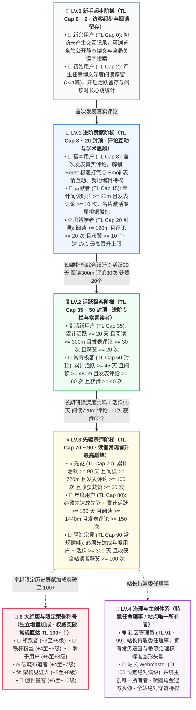

Hello, fellow geek developers, regular readers, and deep-dive enthusiasts!

Many attentive friends often wonder when interacting at the bottom of blog posts or hovering over avatars in the comment section: Why do some readers display **「LV.1 · Contributor」**, others show the dazzling **「LV.3 · Pioneer」**, and a very few core veteran readers even shine with ceiling-breaking numbers like **「📜 Genesis Scribe」** or **「TL.102」**? How are badges like **「☕ Slow Reading Time」** and **「💎 Deeply Respected」** in the profile overlay unlocked? And why does the site owner's avatar uniquely feature a micro-rounded square shape with a golden crown?

Today, this official authoritative guide, infused with **EpoCanvas's original geek design aesthetics**, will thoroughly open-source and reveal the underlying determination algorithms and practical upgrade paths for EpoCanvas blog's current **Dual-Track Trust Ladder System (LV Entry Thresholds + TL Weight Mechanism)**, **11 Core Regular Reader Titles**, **6 Limited & Exclusive Honorary Titles**, **Administrator & Site Owner Responsibilities**, and **15+ Exclusive Achievement Badges**!

---

> [!warning]
> **Data Synchronization & Statistics Notice**: Reader data for this blog (including reading duration, active days, comment count, and Emoji cheer records) relies on client-side `LocalStorage` local persistent storage and asynchronous synchronization via the Cloudflare Workers / D1 backend authentication channel. Using incognito privacy mode, frequent cross-device access, or clearing browser cache may cause slight statistical delays or temporary session disconnections. It is recommended to bind a dedicated email (e.g., Epomail) in the Account Center to ensure permanent binding of your privileges!

> [!tip]
> **Quick Access to Achievements & Badge Display**: Click the **「Account Center」 Drawer** on the right side of the top navigation bar or the quick button in the console to view your current Trust Level (TL), the percentage required for the next level, and your unlocked achievement pool in real-time. You can freely choose to display up to **4 exclusive badges** to showcase your geek identity!

<div data-theme-toc="true"> </div>

---

# I. Core Mechanism: The Dual-Track System of LV Entry Thresholds and TL Weights

The EpoCanvas blog community system adopts a precise **Dual-Track Governance Architecture**: **LV (Level)** and **TL (Trust Level)** each serve distinct functions and complement each other:

> [!important]
> **【Core Mechanism: The Essential Difference Between LV Entry Thresholds and TL Weight Rankings】**
> - **LV (Level 0 ~ 4) —— Determines the minimum content level you can access (Entry Threshold / Access Permission Lock)**:
>   - LV is the content safety and depth grading threshold established by the blog.
>   - **LV.0 (Novice)**: Can only view standard public blog posts;
>   - **LV.1 (Advanced)**: Unlocks Boost, exclusive comment interactions, and advanced technical discussion columns;
>   - **LV.2 (Geek)**: Unlocks high-level architecture records, private collapsible code blocks, and cutting-edge beta testing columns;
>   - **LV.3 (Pioneer)**: Unlocks Pioneer closed-door seminar columns and invited technical proposal permissions;
>   - **LV.4 (Admin & Creator)**: Community patrol and governance (Administrator) and unconditional site-wide penetration permissions (Site Owner).
> - **TL (Trust Level 0 ~ 100+) —— Determines your authority and ranking weight within the current level tier**:
>   - TL measures your activity and reputation accumulation within the current level tier.
>   - Within the same LV level, readers with higher TL have higher display priority in the comment section, greater weight for likes and cheers, more lenient anti-spam rate limits, and a more prominent presence on the reader activity leaderboard.

---

> [!tip]
> **【Key Promotion Criteria: Max TL Cap, Waterfall Unlock Chain, and 35-Point Score Cap】**
> 1. **Titles Determine the Max TL Cap**:
>    - 称号后缀的 TL 代表该称号所赋予的 **最高信任等级上限（Max TL Cap）**，而非固定的当前数值。
>    - **阶梯区间上限严格划定**：
>      - **LV.0 阶梯**：上限严格限制在 **TL.2**（新兴用户 Cap 0，初始用户 Cap 2）；
>      - **LV.1 阶梯**：上限严格限制在 **TL.20**（基本用户 Cap 8，贡献者 Cap 15，思辨学者 Cap 20）；
>      - **LV.2 阶梯**：上限严格限制在 **TL.50**（活跃用户 Cap 35，常青极客 Cap 50）；
>      - **LV.3 阶梯**：常规读者上限严格限制在 **TL.90**（先驱 Cap 70，年度用户 Cap 80，墨海宗师 Cap 90）；
>      - **LV.4 阶梯**：管理员 TL 91 ~ 99，👑 站长 TL 100 恒定绝对满级。
>    - **真实案例**：LV.0 初始用户的最高信任等级上限是 2（TL Cap 2）。即使一位新读者极度用功，一口气连续阅读了 1000 分钟博文，只要他尚未发表过任何真实评论以解锁 LV.1 基本用户，他的信任等级在系统中依然被严格锁死在 **TL.2**！
> 2. **瀑布依赖解锁链（Strict Waterfall Progression）**：
>    - 处于相同或不同 LV 的称号之间，存在严密的前置解锁链条。**必须先满足前一个称号的所有要求，才能解锁后续称号，严禁越级！**
>    - **真实案例**：读者必须先解锁「先驱」，才能进一步解锁「年度用户」。如果尚未达成「先驱」（如评论数或获赞未达标），即使注册活跃天数达到了 365 天，也绝对无法越级解锁「年度用户」！
> 3. **信任等级（TL）如何提升与计算？（35 点活动积分封顶）**：
>    - 信任等级由系统根据 4 项多维度读者真实活动动态计算：
>      $\text{Raw Activity Points} = \lfloor\frac{\text{阅读时长(m)}}{30}\rfloor + \lfloor\frac{\text{评论数}}{3}\rfloor + \lfloor\frac{\text{获赞数}}{2}\rfloor + \lfloor\frac{\text{活跃天数}}{3}\rfloor$
>    - **【硬性防刷分机制】活动积分上限限制为 35 点**：
>      $\text{Earned Points} = \min(35, \text{Raw Activity Points})$
>      这保证了任何读者都无法通过单纯挂机刷时长或活跃天数绕过称号门槛，必须通过实质性深度互动晋升称号！
>    - **常规读者实际 TL 公式**：
>      $\text{当前常规 TL} = \min(\text{Max TL Cap}, \text{Base TL} + \text{Earned Points})$
>    - 只要未解锁新称号，获得的积分将平滑提升你的 TL，直到达到当前称号的上限。想要突破天花板，必须完成下一称号的瀑布要求！

---

# 二、全景阶梯架构与瀑布晋级流程

全站划分为 11 个读者常规原生称号，外加 6 大绝版荣誉称号与特邀委任管理员、站长主创。严禁虚假硬编码，全部常规指标均可在 1 年（$\le 365$ 天）内由真实交互自然达成：



---

# 三、11 大常规读者称号详细解锁手册

### 1. LV.0 新兴用户 (TL Cap: 0)
- **称号标识**：🐣 新兴用户
- **准入条件**：初次到访博客的新访客，尚未产生阅读与互动记录。
- **信任等级**：`TL.0`（不可上涨，上限 0）。
- **权限与权益**：浏览公开静态博文、全局关键字搜索。
- **Promotion Path**: Click to view any article, instantly unlock "Initial User"!

### 2. LV.0 Initial User (TL Cap: 2)
- **Title Badge**: 📘 Initial User
- **Prerequisite**: Have become an Emerging User.
- **Admission Condition**: Complete a reading stay on any article in the blog (`hasReadAny === true || readingMinutes >= 1`).
- **Trust Level**: `TL.1 ~ TL.2` (maximum 2).
- **Permissions and Benefits**: Begin recording daily active retention and reading time heartbeat.
- **Promotion Path**: Leave your first genuine comment at the bottom of any blog post to jump to LV.1!

### 3. LV.1 Basic User (TL Cap: 8)
- **Title Badge**: 🥉 Basic User
- **Prerequisite**: Must first unlock "Initial User".
- **Admission Condition**: Accumulate 1 genuine comment posted (`commentCount >= 1`).
- **Trust Level**: `TL.3 ~ TL.8` (maximum 8).
- **Permissions and Benefits**:
  - Unlock comment section **“⚡ Boost Rapid Boost”** ($\le 16$ character highlight mode);
  - Unlock comment section **“😀 Emoji Interaction”** (one-click Emoji feedback);
  - Gain temporary session post-publication **“Inline Edit”** and self-retraction rights.

### 4. LV.1 Contributor (TL Cap: 15)
- **Title Badge**: 🏅 Contributor
- **Prerequisite**: Must first unlock "Basic User".
- **Admission Condition**: Accumulate $\ge 30$ minutes of reading time and post $\ge 10$ comments (including regular discussions and Boost).
- **Trust Level**: `TL.9 ~ TL.15` (maximum 15).
- **Permissions and Benefits**: Business card activates the exclusive orange-copper badge for "Contributor", increasing comment stream ranking weight.

### 5. LV.1 Reflective Scholar (TL Cap: 20 · LV.1 cap)
- **Title Badge**: 💡 Reflective Scholar
- **前置依赖**：必须先解锁「贡献者」。
- **准入条件**：累计阅读时长 $\ge 120$ 分钟（2 小时）且 发表评论 $\ge 20$ 次 且 累计收获读者喝彩/点赞 $\ge 10$ 个。
- **信任等级**：`TL.16 ~ TL.20`（上限 20，**LV.1 阶梯最高天花板**）。
- **权限与权益**：名片激活「思辨学者」智能微光，获得深度互动专区准入权。

### 6. LV.2 活跃用户 (TL Cap: 35)
- **称号标识**：🎖️ 活跃用户
- **前置依赖**：必须先解锁「思辨学者」。
- **准入条件**（四项指标严密联动）：
  - 累计活跃天数 $\ge 20$ 天；
  - 累计阅读时长 $\ge 300$ 分钟（5 小时）；
  - 累计发表评论 $\ge 30$ 次；
  - 累计收获读者喝彩 $\ge 20$ 次。
- **信任等级**：`TL.21 ~ TL.35`（上限 35）。
- **权限与权益**：解锁 LV.2 进阶专栏与架构踩坑实录，评论具备加权高亮标识。

### 7. LV.2 常青极客 (TL Cap: 50 · LV.2 封顶)
- **称号标识**：🌲 常青极客
- **前置依赖**：必须先解锁「活跃用户」。
- **准入条件**：
  - 累计活跃天数 $\ge 45$ 天；
  - 累计阅读时长 $\ge 480$ 分钟（8 小时）；
  - 累计发表评论 $\ge 60$ 次；
  - 累计收获读者喝彩 $\ge 40$ 次。
- **信任等级**：`TL.36 ~ TL.50`（上限 50，**LV.2 阶梯最高天花板**）。
- **权限与权益**：名片浮层附带翡翠绿尊贵光晕，社区活跃骨干成员认证。

### 8. LV.3 先驱 (TL Cap: 70)
- **Title Identifier**: ⭐ Pioneer
- **Prerequisite**: Must first unlock "Evergreen Geek".
- **Eligibility Conditions**:
  - Cumulative active days $\ge 90$ days;
  - Cumulative reading time $\ge 720$ minutes (12 hours);
  - Cumulative comments $\ge 100$ times;
  - Cumulative reader cheers $\ge 60$ times.
- **Trust Level**: `TL.51 ~ TL.70` (max 70).
- **Privileges and Benefits**: Enjoy the Pioneer exclusive starburst badge, and be invited to prioritize experience of experimental black tech features on the blog.

### 9. LV.3 Annual User (TL Cap: 80)
- **Title Identifier**: 🎂 Annual User
- **Prerequisite**: **Must first unlock "Pioneer"!** Strictly prohibited to level up solely by idle days.
- **Eligibility Conditions**:
  - On top of achieving "Pioneer", cumulative active days reach **180 days**;
  - Cumulative reading time $\ge 1440$ minutes (24 hours);
  - Cumulative comments $\ge 150$ times.
- **Trust Level**: `TL.71 ~ TL.80` (max 80).
- **Privileges and Benefits**: Evergreen reader lifetime honor, prestigious annual mark, symbol of loyal reader never downgraded.

### 10. LV.3 Ink Sea Master (TL Cap: 90 · Regular Promotion Peak)
- **Title Identifier**: 📜 Ink Sea Master
- **Prerequisite**: **Must first unlock "Annual User"!**
- **Eligibility Conditions** (the fully automated upgrade ceiling for geek readers, absolutely achievable within $\le 365$ days):
  - Cumulative active days reach **300 days** (within 1 year limit!);
  - Cumulative immersive reading time $\ge 2160$ minutes (36 hours);
  - Cumulative site-wide reader cheers and likes $\ge 100$ times.
- **信任等级**：`TL.81 ~ TL.90`（上限 90，**常规读者自动晋升巅峰**）。
- **权限与权益**：**普通读者常规晋升最高殿堂**！名片独享墨海宗师紫金光芒，登峰造极。

---

# 四、绝版与限定荣誉称号（突破 TL 100+ 上限！）

在 EpoCanvas 社区的漫长演进中，有一群见证历史、在关键时期给予关键反馈的开拓者。为了铭记这些卓越贡献，系统特别推出了 **6 大绝版与限定荣誉称号**。

> [!important]
> **【核心规则：绝版称号加分机制与突破 100+ 特权】**
> 1. **额外信任等级加成（Special Title Bonus）**：
>    - 绝版与限定称号不占用常规 35 点活动积分配额，其加分是 **直接叠加在计算结果之上的全局增量**！
> 2. **突破常规 90 限制，信任等级直达 100+**：
>    - 常规读者受限于 LV.3 墨海宗师的 90 上限。但**拥有绝版称号的读者，其信任等级可以突破 90，最高达到 100 以上（如 TL.102、TL.106）**！
> 3. **基础 LV 门槛保持不变（安全底线）**：
>    - 绝版称号赋予极高的 TL 权威度和排名，但读者原有的 LV 基础门槛不变（若为 LV.3 墨海宗师，获得绝版加成后 TL 达到 102，其 LV 仍为 LV.3，严格守卫内容安全分级）。
> 4. **什么是权重等级（Priority）？**：
>    - Priority（0 ~ 100）决定了在名片浮层与评论区作者栏中，当读者拥有多个称号与徽章时，系统如何进行高优展示与排序。
>    - 称号徽标（Tier Badge）固定为 Priority 100，独占首位；
>    - **绝版限定称号赋予了 Priority 92 ~ 98 的超高权重**，优先于所有常规成就徽章，默认抢占名片浮层至多 4 枚徽章的高光席位！

以下是 6 大绝版与限定称号的准入条件、加成梯度与权重规则：

| 绝版称号 | 权重 Priority | 获得资格与门槛限制 | TL 等级加成机制 | 绝版状态 |
| :--- | :---: | :--- | :--- | :---: |
| **📜 创世墨客** | `98` | 早期撰写深度长评被系统收录、获赞 $\ge 30$、评论 $\ge 10$ 且绑定专属邮箱 | **TL $\le 70$ 加 10 级**<br/>**TL $> 70$ 加 6 级** | 🔒 Permanently Out of Print |
| **🛠️ Architecture Witness** | `96` | Witnessed the blog's multiple technical refactors, active for $\ge 30$ days, read $\ge 600\text{m}$ times, commented $\ge 20$ times, and contributed key feedback. | **TL $\le 70$ + 8 levels**<br/>**TL $> 70$ + 5 levels** | 🎖️ Limited Grant |
| **🌱 Seed User** | `95` | Limited to readers below LV.3; within 90 days of registration, receive $\ge 30$ likes and $\ge 50$ comment replies. | **TL $\le 60$ + 8 levels**<br/>**TL $> 60$ + 5 levels** | 🔒 Permanently Out of Print |
| **💎 Hardcore Fan** | `94` | Early blog core explorers among the first 1000; active for $\ge 60$ days and read $\ge 300\text{m}$ or commented $\ge 20$ times. | **TL $\le 50$ + 6 levels**<br/>**TL $> 50$ + 4 levels** | 🔒 Permanently Out of Print |
| **🔥 Dawn Evangelist** | `93` | Limited to readers LV.1+; during the first release of major versions, submit high-quality technical corrections, edit and improve comments, and receive $\ge 15$ likes. | **TL $\le 50$ + 7 levels**<br/>**TL $> 50$ + 4 levels** | 🎖️ Limited Honor |
| **🚀 Trailblazer** | `92` | Limited to readers below LV.3; within 30 days of registration, active: read $\ge 300\text{m}$ times, comment $\ge 30$ times, receive $\ge 20$ likes. | **TL $\le 50$ + 5 levels**<br/>**TL $> 50$ + 3 levels** | 🔒 Permanently Out of Print |

> [!example]
> **Real Highlight Case**:
> A diligent reader studied for nearly a year, achieving "LV.3 · Master of the Ink Sea" (baseline TL Cap 90). At the same time, he was among the first 1000 explorers in the blog's early days (earned "💎 Hardcore Fan" TL > 50 + 4 levels), and was invited to receive "📜 Genesis Ink Scholar" (TL > 70 + 6 levels) for writing multiple high-quality architecture feedback.
> - His final trust level is: $90 + 4 + 6 = \mathbf{100}$, and with additional limited contributions, he can surpass others to reach **TL.102+**!

---

# 五、治理与主创体系：管理员与站长权责划分

> [!danger]
> **【核心排印与辨识原则：站长金冠微圆角方型 vs 管理员全员圆形】**
> - **👑 站长 (Webmaster)**：作为博客系统所有者与最高架构管理者，拥有全站 **独一无二的微圆角方形头像与金色皇冠（isSquareAvatar: true）**，全站仅此一人；
> - **🛡️ 社区管理员 (Admin)** 与其他所有读者：全站统一遵循 **标准高精度圆形头像（border-radius: 50%）**，杜绝身份混淆。

### 11. LV.4 社区管理员 (Admin / Core Member)
- **称号标识**：🛡️ 社区管理员 / ⭐ 核心成员
- **头像样式**：**标准圆形头像**（`border-radius: 50%`）
- **晋升机制**：非全自动升级。由站长特邀委任或经社区核心贡献考核通过后人工晋升。
- **信任等级**：`TL.91 ~ TL.99`（默认基准 95，最高可达 99）。
- **权责范围**：
  - 社区常务巡查与敏感违规内容就地审核；
  - 恶意灌水与违规评论屏蔽下架；
  - 协助站长进行技术选题讨论与读者事务协调。

### 12. 👑 站长 (Webmaster / Site Owner)
- **称号标识**：👑 站长
- **头像样式**：**全站唯一微圆角方形头像 + 独家金色皇冠**（`border-radius: 10px; isSquareAvatar: true`）
- **身份认证**：博客主创（shijianus），通过专属密钥通道与管理员邮箱鉴权。
- **信任等级**：**`TL.100`（恒定绝对满级）**。
- **权责范围**：
  - **全站无条件绝对穿透权限**：无需任何前置门槛，无视所有 LV 限制，可随时调阅、测试与穿透全站所有私有专栏、隐藏分级文档及实验室模块；
  - 云端 Functions / D1 数据库与 Stripe 收银台架构最高管辖权；
  - 社区规则的最终制定与仲裁解释权。

---

# 六、阅读沉淀成就徽章（静水流深）

读完一篇上千字的技术深度文章，比浮躁走马观花更有价值。以下徽章为你记录在 EpoCanvas 汲取知识的时光轨迹：

## No.1 通读全文
> [!todo] 通读全文 (📖)
> **权重优先级**：`40` | **所属分类**：`read`
> **系统定义**：累计深度阅读博文时长达到 15 分钟。
- **获取方式：** 在博文页面产生真实滚动与阅读停留达到 **15 分钟**。
- **参考操作：** 挑选 2 篇长文，开启目录索引（TOC），静下心读完。
- **避坑提示**：系统内置智能心跳。标签页切入后台或超过 3 分钟无操作将暂停计时。

## No.2 慢读时光
> [!todo] 慢读时光 (☕)
> **权重优先级**：`55` | **所属分类**：`read`
> **系统定义**：累计享受深度慢读时光超过 2 小时。
- **获取方式：** 全站各博文累计阅读时长突破 **120 分钟**。
- **参考操作：** 完整研读博客的“架构重构实录”或“Stripe 全球结账设计”长篇系列。

## No.3 博览群书
> [!todo] 博览群书 (📚)
> **权重优先级**：`70` | **所属分类**：`read`
> **系统定义**：累计沉浸阅读博客超过 10 小时。
- **获取方式：** 全站深度研读时长突破 **600 分钟**（10 小时）。
- **进阶彩蛋**：当阅读时长进一步突破 **30 小时（1800m）** 与 **60 小时（3600m）** 时，系统将自动解锁隐藏成就 **「📜 学贯中西」**（权重 72）与 **「🧭 墨海领航」**（权重 75）！

---

# 七、评论与互动徽章（思辨共鸣）

EpoCanvas 原生自研评论系统，支持多模态交互、Boost 极速打气与就地回复树：

## No.4 初露锋芒
> [!todo] 初露锋芒 (✍️)
> **权重优先级**：`30` | **所属分类**：`comment`
> **系统定义**：精益求精，就地编辑完善过自己的发言。
- **Acquisition Method:** After posting any comment in the comment area, have completed at least 1 **“Inline Edit”** operation.
- **Practical Pitfall Avoidance:** Guest temporary sessions are destroyed immediately after a refresh (F5) or closing the browser; please experience editing while it's still fresh after posting!

## No.5 Rich Emojis
> [!todo] Rich Emojis (😀)
> **Weight Priority**: `35` | **Category**: `comment`
> **System Definition**: Use vivid and rich emojis to engage in interactive communication.
- **Acquisition Method:** First use the “😀 Emoji Interaction” tray in the comment area to post an Emoji, or send an Emoji Reaction at the bottom right of another user's comment card.

## No.6 Meaningful Speech
> [!todo] Meaningful Speech (💬)
> **Weight Priority**: `50` | **Category**: `comment`
> **System Definition**: Accumulate 5 or more high-quality independent insights.
- **Acquisition Method:** Accumulate **5** genuine comments.
- **Advanced Title**: Reach **20** comments to unlock **「💡 Insightful Wisdom」** (weight 58), reach **50** comments to unlock **「🗣️ Comprehensive Discourse」** (weight 65).
- **Risk Control Warning**: Identical comments within 1 hour will be blocked; regular comments are limited to 3 per hour, cherish your posting quota, “spam posts are less valuable than careful reading”!

## No.7 Echoing Resonance
> [!todo] Echoing Resonance (🔔)
> **Weight Priority**: `45` | **Category**: `comment`
> **System Definition**: Actively mention or echo others in comment interactions.
- **Acquisition Method:** First use `@` in a comment to mention a specific reader, or click the **“🔗 Quote”** button on another user's comment card to reply with a citation.

---

# 8. Appreciation and Applause Achievement Badges (Give Roses to Others)

## No.8 Generous Praise
> [!todo] Generous Praise (❤️)
> **Weight Priority**: `45` | **Category**: `reaction`
> **System Definition**: Generously give more than 10 applause for others' profound thoughts.
- **Acquisition Method:** Accumulate actively sending **more than 10** Emoji applause (`reactionsGiven >= 10`). Sending over 30 will also unlock **「💖 Benevolent Kindness」** (weight 55).

## No.9 初见回响
> [!todo] 初见回响 (✨)
> **权重优先级**：`40` | **所属分类**：`reaction`
> **系统定义**：个人发言收获了读者的第一枚热烈喝彩。
- **获取方式：** 自己发表的评论或 Boost 首次收到来自他人的点赞喝彩。

## No.10 引发共鸣
> [!todo] 引发共鸣 (🔥)
> **权重优先级**：`65` | **所属分类**：`reaction`
> **系统定义**：发表的见解累计收获 20 次以上喝彩互动。
- **获取方式：** 个人名下发言累计收获喝彩点赞达到 **20 次**。

## No.11 深得人心
> [!todo] 深得人心 (💎)
> **权重优先级**：`80` | **所属分类**：`reaction`
> **系统定义**：累计获得超过 50 次读者共鸣喝彩与赞赏。
- **进阶殿堂**：当收获喝彩突破 **100 次** 时，将激活极高权重成就 **「🌟 众望所归」**（权重 85）！

---

# 九、极客身份与常客徽章（历久弥新）

## No.12 自传作者
> [!todo] 自传作者 (🏷️)
> **权重优先级**：`35` | **所属分类**：`activity`
> **系统定义**：完善了个性签名介绍并配置了专属头像。
- **获取方式：** 在账号中心上传自定义头像，并且撰写 **不少于 10 个字** 的个人简介（`bio.length >= 10 && avatarUrl`）。

## No.13 信件连结
> [!todo] 信件连结 (✉️)
> **权重优先级**：`40` | **所属分类**：`activity`
> **系统定义**：绑定了专属邮箱，开启思想交流连结通道。
- **获取方式：** 成功绑定常用邮箱或测试专属的 `@epomail.bond` 邮箱。绑定官方域名邮箱还将获赠 **「Epomail 认证读者」** 专属身份标签！

## No.14 常客印记
> [!todo] 常客印记 (🏃)
> **权重优先级**：`50` | **所属分类**：`activity`
> **系统定义**：累计在博客活跃探索 10 天以上。
- **获取方式：** 累计活跃访问天数达到 **10 天**。活跃达到 30 天还将解锁 **「⚡ 见缝插针」**（权重 60）。

## No.15 百日墨客
> [!todo] 百日墨客 (🏔️)
> **权重优先级**：`75` | **所属分类**：`activity`
> **系统定义**：累计在博客活跃长达 100 天的深厚笔友。
- **获取方式：** 累计活跃天数突破 **100 天**。

## No.16 同舟一载
> [!todo] 同舟一载 (🎂)
> **权重优先级**：`85` | **所属分类**：`activity`
> **系统定义**：与本博客相识相伴同行超过 1 年时光。
- **获取方式：** 距离初次访问或注册时间满 **365 天**（$\le 365$ 天上限）。此外，累计活跃超过 200 天还将解锁 **「🌲 坚韧长青」**（权重 88）！

---

# 十、附录：名片浮层展示规则说明（读者须知）

当你把鼠标悬停在评论区任何一位发帖者的头像或昵称上时，系统都会瞬间弹出一张精心调校的 **极客名片（Author Profile Popover）**：

```
┌────────────────────────────────────────────────────────┐
│  [圆形头像]  shijian_fan  [⭐ 先驱] [Epomail 认证]     │
│  热爱开源，折腾 Astro 与 Rust 的全栈开发者             │
│  ────────────────────────────────────────────────────  │
│  [ 💎 深得人心 ] [ 📚 博览群书 ] [ 🏔️ 百日墨客 ] [ ☕ 慢读时光 ] │
│  ────────────────────────────────────────────────────  │
│  最新发言: 刚刚 · 加入时间: 120天前 · 已读: 480m · 喝彩: 68   │
└────────────────────────────────────────────────────────┘
```

很多朋友会问：**“我已经解锁了 8 个徽章，为什么我的名片上只显示了 4 个？”**

### 1. 原创极简克制排版规范
- **拒绝花哨冗余**：我们不希望名片变成铺天盖地的勋章墙，破坏排版呼吸感。
- **至多佩戴 4 枚**：系统严格限制名片浮层中的勋章栏 **单行最多展示 4 个徽章**（`max 4`）。
- **自主挑选 vs 权重兜底**：
  - **自主装备**：你可以在「账号中心」的徽章抽屉中，任意点击挑选你最喜欢的 4 枚徽章进行“装备”；
  - **智能兜底**：如果你从未手动设置，系统将基于算法，自动从你已解锁的徽章池中 **严格按照 Priority 权重从高到低排序，截取前 4 个最高荣誉徽章** 展示！
  - **绝版称号天然高光**：由于 6 大绝版荣誉称号赋予了 `92 ~ 98` 的超高 Priority，只要你达成解锁，系统默认会直接将它们排在最醒目的展示位！

### 2. 统计栏排印规范（弹性横向流）
名片底部的读者活跃数据采用横向弹性流排布，包含 4 项真实统计指标：
1. **最新发言**：动态计算并展示相对时间戳（如“刚刚”、“3小时前”）；
2. **加入时间**：记录读者首次访问或注册距离当前的天数（如“180天前”）；
3. **已读时长**：展示在博客累计消耗的阅读心跳时长（如“240m”）；
4. **喝彩点赞**：展示发表见解累计收获的读者点赞总数。

---

# 十一、结语：水贴不如精读，坐和放宽！

社区的深度从不在于发帖数量的盲目堆砌，而在于每一次思想碰撞所激荡出的回响。

无论你是刚刚到访的 **「🐣 新兴用户」**，还是已经默默读完数十篇博文的 **「☕ 慢读时光」** 拥有者，EpoCanvas 博客都为你保留了一张属于你的极客数字名片。

**坐和放宽，欢迎在下方评论区发表你的第一条见解，开启属于你的信任等级晋升之旅！**