Hello, fellow geek developers, regular readers, and in-depth blog enthusiasts!

Often, observant friends interacting at the bottom of blog posts or hovering over comment section avatars wonder: Why do some readers display **"LV.1 · Contributor"**, others a dazzling **"LV.3 · Pioneer"**, and a select few core veteran readers even show **"📜 Genesis Scribe"** or a ceiling-breaking **"TL.102"**? How are **"☕ Slow Reading Time"** and **"💎 Deeply Respected"** lit up in the profile pop-up? Why does the site owner's avatar uniquely feature a slightly rounded square and a golden crown?

Today, this official authoritative guide, embodying **EpoCanvas's original geek design aesthetic**, will fully open-source and reveal the underlying judgment algorithms and practical upgrade paths for EpoCanvas blog's current **Dual-Track Trust Tier System (LV Access Threshold + TL Weight Mechanism)**, **11 Core Regular Reader Titles**, **6 Rare and Limited Edition Honor Titles**, **Administrator and Site Owner Responsibilities**, and **15+ Exclusive Achievement Badges**!

---

> [!warning]
> **Data Synchronization and Statistics Notice**: This blog's reader data (including reading time, active days, comment count, and Emoji applause records) relies on client-side `LocalStorage` for local persistent storage and asynchronous synchronization via Cloudflare Workers / D1 backend authentication channels. Using incognito/private mode, frequent cross-device access, or clearing browser cache may result in slight statistical delays or temporary session disconnections. It is recommended to bind a dedicated email (e.g., Epomail) in the account center to ensure permanent binding of your rights!

> [!tip]
> **Quick Access to Achievements and Badge Equipping**: Click the **"Account Center" drawer** on the right side of the blog's top navigation bar or the console quick button to view your current Trust Level (TL), percentage to the next level, unlocked achievement pool, and freely select and equip up to **4 exclusive badges** to showcase your geek identity!

<div data-theme-toc="true"> </div>

---

# 1. Core Mechanism: The Dual-Track System of LV Access Thresholds and TL Weight

The EpoCanvas blog community system employs a sophisticated **dual-track governance architecture**: **LV (Level)** and **TL (Trust Level)**, each with distinct roles, complementing each other:

> [!important]
> **[Core Mechanism: Essential Distinction between LV Access Thresholds vs TL Weight Ranking]**
> - **LV (Level 0 ~ 4) — Determines the minimum content level you can view (Access Threshold / Access Permission Lock)**:
>   - LV is the blog's content security and depth-based classification threshold.
>   - **LV.0 (Novice)**: Can only view regular public blog posts;
>   - **LV.1 (Advanced)**: Unlocks Boost, exclusive comment interaction, and advanced technical discussion columns;
>   - **LV.2 (Geek)**: Unlocks high-level architecture records, private collapsible code blocks, and cutting-edge internal testing experiment columns;
>   - **LV.3 (Pioneer)**: Unlocks pioneer closed-door seminar columns and invited technical proposal permissions;
>   - **LV.4 (Admin & Creator)**: Community moderation and governance (Administrator) and unconditional full-site access (Site Owner).
> - **TL (Trust Level 0 ~ 100+) — Determines your authority and ranking weight within your current level range**:
>   - TL measures your activity and reputation accumulation within your current level range.
>   - Within the same LV, readers with higher TL have higher display priority in the comment section, greater weight for likes and applause, more lenient anti-spam rate limits, and a more prominent presence on the active reader leaderboard.

---

> [!tip]
> **[Key Promotion Criteria: Max TL Cap, Waterfall Unlock Chain, and 35-Point Activity Cap]**
> 1. **Title Determines Max TL Cap**:
>    - The TL suffix of a title represents the **Maximum Trust Level Cap (Max TL Cap)** granted by that title, not a fixed current value.
>    - **Strictly Defined Tier Caps**:
>      - **LV.0 Tier**: Cap strictly limited to **TL.2** (Emerging User Cap 0, Initial User Cap 2);
>      - **LV.1 Tier**: Cap strictly limited to **TL.20** (Basic User Cap 8, Contributor Cap 15, Discerning Scholar Cap 20);
>      - **LV.2 Tier**: Cap strictly limited to **TL.50** (Active User Cap 35, Evergreen Geek Cap 50);
>      - **LV.3 Tier**: Regular reader cap strictly limited to **TL.90** (Pioneer Cap 70, Annual User Cap 80, Ink Sea Grandmaster Cap 90);
>      - **LV.4 Tier**: Administrator TL 91 ~ 99, 👑 Site Owner TL 100 (constant absolute max level).
>    - **Real-world Example**: An LV.0 Initial User's Max TL Cap is 2 (TL Cap 2). Even if a new reader diligently reads blog posts for 1000 consecutive minutes, as long as they haven't posted any genuine comments to unlock LV.1 Basic User, their Trust Level will remain strictly capped at **TL.2** in the system!
> 2. **Strict Waterfall Progression**:
>    - There is a strict prerequisite unlock chain between titles at the same or different LVs. **All requirements for the preceding title must be met before subsequent titles can be unlocked; skipping levels is strictly prohibited!**
>    - **Real-world Example**: A reader must first unlock "Pioneer" before they can further unlock "Annual User". If "Pioneer" has not yet been achieved (e.g., comment count or likes not met), even if the registered active days reach 365 days, "Annual User" absolutely cannot be unlocked by skipping levels!
> 3. **How is Trust Level (TL) Increased and Calculated? (35 Activity Points Cap)**:
>    - Trust Level is dynamically calculated by the system based on 4 multi-dimensional reader activities:
>      $$\text{Raw Activity Points} = \lfloor\frac{\text{Reading Duration(m)}}{30}\rfloor + \lfloor\frac{\text{Comments}}{3}\rfloor + \lfloor\frac{\text{Likes Received}}{2}\rfloor + \lfloor\frac{\text{Active Days}}{3}\rfloor$$
>    - **[Hard Anti-Cheating Mechanism] Activity Points Cap is 35 points**:
>      $$\text{Earned Points} = \min(35, \text{Raw Activity Points})$$
>      This ensures that no reader can bypass title thresholds by simply idling to accumulate reading time or active days; promotion to titles must be achieved through substantive deep interaction!
>    - **Actual TL Formula for Regular Readers**:
>      $$\text{Current Regular TL} = \min(\text{Max TL Cap}, \text{Base TL} + \text{Earned Points})$$
>    - As long as a new title is not unlocked, earned points will smoothly increase your TL until it reaches the cap for your current title. To break through the ceiling, you must fulfill the waterfall requirements for the next title!

---

# II. Panoramic Tiered Architecture and Waterfall Promotion Process

The entire site is divided into 11 regular native reader titles, plus 6 major discontinued honorary titles and specially invited appointed administrators, and the site owner/creator. False hardcoding is strictly prohibited; all regular metrics can be naturally achieved through genuine interaction within 1 year ($\le 365$ days):

```mermaid
flowchart TD
    classDef lv0 fill:#f8fafc,stroke:#94a3b8,stroke-width:2px;
    classDef lv1 fill:#eff6ff,stroke:#3b82f6,stroke-width:2px;
    classDef lv2 fill:#f0fdf4,stroke:#22c55e,stroke-width:2px;
    classDef lv3 fill:#fefce8,stroke:#eab308,stroke-width:2px;
    classDef lv4 fill:#faf5ff,stroke:#a855f7,stroke-width:2px;
    classDef spec fill:#fff1f2,stroke:#f43f5e,stroke-width:2px;

    LV0["<b>🐣 LV.0 Novice Starter Tier (TL Cap 0 ~ 2 · Visitor Onboarding & Reading Retention)</b><br/>• 🐣 Emerging User (TL Cap 0): First visit with no interaction record, can browse all public static blog posts and perform global keyword searches<br/>• 📘 Initial User (TL Cap 2): Generated deep reading dwell time on any blog post (>=1 article), activates active retention and reading duration heartbeat statistics"]:::lv0

    LV1["<b>🥉 LV.1 Advanced Contributor Tier (TL Cap 8 ~ 20 Max · Comment Interaction & Academic Deliberation)</b><br/>• 🥉 Basic User (TL Cap 8): First genuine comment published, unlocks Boost rapid encouragement and Emoji reactions, and in-place editing privilege<br/>• 🏅 Contributor (TL Cap 15): Cumulative reading duration >= 30m AND discussions published >= 10 times, profile card activates exclusive orange-bronze badge<br/>• 💡 Deliberative Scholar (TL Cap 20 Max): Reading >= 120m AND comments >= 20 times AND likes received >= 10, reaching the highest promotion limit for LV.1"]:::lv1

    LV2["<b>🎖️ LV.2 Active Geek Tier (TL Cap 35 ~ 50 Max · Advanced Columns & Evergreen Readers)</b><br/>• 🎖️ Active User (TL Cap 35): Cumulative active days >= 20 AND reading >= 300m AND comments published >= 30 times AND likes received >= 20 times<br/>• 🌲 Evergreen Geek (TL Cap 50 Max): Cumulative active days >= 45 AND reading >= 480m AND comments published >= 60 times AND likes received >= 40 times"]:::lv2

    LV3["<b>⭐ LV.3 Pioneer Grandmaster Tier (TL Cap 70 ~ 90 · Highest Peak for Regular Reader Promotion)</b><br/>• ⭐ Pioneer (TL Cap 70): Cumulative active days >= 90 AND reading >= 720m AND comments published >= 100 times AND likes received >= 60 times<br/>• 🎂 Annual User (TL Cap 80): Must first achieve Pioneer + Cumulative active days >= 180 AND reading >= 1440m AND comments published >= 150 times<br/>• 📜 Ink Sea Grandmaster (TL Cap 90 Regular Peak): Must first achieve Annual User + Active days >= 300 AND total likes received from site readers >= 100 times"]:::lv3

    SPEC["<b>💎 6 Major Discontinued & Limited Honorary Titles (Independent Incremental Bonus · Authority Breaks Convention to Reach TL 100+!)</b><br/>• 🚀 Frontrunner (+3 to +5 levels)  • 💎 Die-hard Fan (+4 to +6 levels)  • 🌱 Seed User (+5 to +8 levels)<br/>• 🔥 Dawn Evangelist (+4 to +7 levels)  • 🛠️ Architecture Witness (+5 to +8 levels)  • 📜 Genesis Ink Scribe (+6 to +10 levels)"]:::spec

    LV4["<b>👑 LV.4 Governance & Core Creator System (Specially Appointed Director / Sole Site Owner)</b><br/>• 🛡️ Community Administrator (TL 91 ~ 99): Site owner's specially appointed director, possesses routine inspection and sensitive governance authority · Standard circular avatar<br/>• 👑 Site Webmaster (TL 100 Constant Absolute Max Level): Sole owner of the system's core creation · Slightly rounded golden crown square avatar · Absolute site-wide penetration privileges"]:::lv4

    LV0 ==>|First genuine comment published| LV1
    LV1 ==>|Four-dimensional metric leap: 20 active days, 300m reading, 30 comments, 20 likes| LV2
    LV2 ==>|Long-term study & deep resonance: 90 active days, 720m reading, 100 comments, 60 likes| LV3
    LV3 -. Exceptional limited historical contribution bonus breaks through to 100+ .-> SPEC
    LV3 -. Site owner's specially appointed director .-> LV4
```



---

# III. Detailed Unlock Manual for 11 Regular Reader Titles

### 1. LV.0 Emerging User (TL Cap: 0)
- **Title Identifier**: 🐣 Emerging User
- **Admission Criteria**: A new visitor to the blog for the first time, with no reading or interaction records yet.
- **Trust Level**: `TL.0` (Cannot increase, cap 0).
- **Permissions & Privileges**: Browse public static blog posts, global keyword search.
- **Promotion Path**: Click to browse any article to immediately unlock 'Initial User'!

### 2. LV.0 Initial User (TL Cap: 2)
- **Title Identifier**: 📘 Initial User
- **Prerequisite**: Already an Emerging User.
- **Admission Criteria**: Completed reading dwell time on any article on the blog (`hasReadAny === true || readingMinutes >= 1`).
- **Trust Level**: `TL.1 ~ TL.2` (Cap 2).
- **Permissions & Privileges**: Starts recording daily active retention and reading duration heartbeat.
- **Promotion Path**: Leave your first genuine comment at the bottom of any blog post to advance to LV.1!

### 3. LV.1 Basic User (TL Cap: 8)
- **Title Identifier**: 🥉 Basic User
- **Prerequisite**: Must first unlock 'Initial User'.
- **Admission Criteria**: Accumulated 1 genuine comment published (`commentCount >= 1`).
- **Trust Level**: `TL.3 ~ TL.8` (Cap 8).
- **Permissions & Privileges**:
  - Unlocks comment section **“⚡ Boost Rapid Encouragement”** ($\le 16$ character highlight mode);
  - Unlocks comment section **“😀 Emoji Reactions”** (one-click Emoji feedback);
  - Possesses **“Inline Edit”** and self-withdrawal privileges for temporary sessions after publishing.

### 4. LV.1 Contributor (TL Cap: 15)
- **Title Identifier**: 🏅 Contributor
- **Prerequisite**: Must first unlock 'Basic User'.
- **Admission Criteria**: Cumulative reading duration $\ge 30$ minutes AND comments published $\ge 10$ times (including regular discussions and Boost).
- **Trust Level**: `TL.9 ~ TL.15` (Cap 15).
- **Permissions & Privileges**: Profile card activates the exclusive orange-bronze 'Contributor' badge, comment stream sorting weight increased.

### 5. LV.1 Discerning Scholar (TL Cap: 20 · LV.1 Ceiling)
-   **Title Badge**: 💡 Discerning Scholar
-   **Prerequisite**: Must first unlock "Contributor".
-   **Eligibility Requirements**: Cumulative reading time $\ge 120$ minutes (2 hours) AND comments posted $\ge 20$ times AND cumulative reader applause/likes received $\ge 10$.
-   **Trust Level**: `TL.16 ~ TL.20` (Max 20, **Highest Ceiling for LV.1 Tier**).
-   **Permissions and Benefits**: Profile card activates 'Discerning Scholar' smart glow, gains access to the deep interaction zone.

### 6. LV.2 Active User (TL Cap: 35)
-   **Title Badge**: 🎖️ Active User
-   **Prerequisite**: Must first unlock "Discerning Scholar".
-   **Eligibility Requirements** (Four closely linked metrics):
    -   Cumulative active days $\ge 20$ days;
    -   Cumulative reading time $\ge 300$ minutes (5 hours);
    -   Cumulative comments posted $\ge 30$ times;
    -   Cumulative reader applause received $\ge 20$ times.
-   **Trust Level**: `TL.21 ~ TL.35` (Max 35).
-   **Permissions and Benefits**: Unlocks LV.2 Advanced Columns and Architecture Pitfall Records, comments receive weighted highlight status.

### 7. LV.2 Evergreen Geek (TL Cap: 50 · LV.2 Ceiling)
-   **Title Badge**: 🌲 Evergreen Geek
-   **Prerequisite**: Must first unlock "Active User".
-   **Eligibility Requirements**:
    -   Cumulative active days $\ge 45$ days;
    -   Cumulative reading time $\ge 480$ minutes (8 hours);
    -   Cumulative comments posted $\ge 60$ times;
    -   Cumulative reader applause received $\ge 40$ times.
-   **Trust Level**: `TL.36 ~ TL.50` (Max 50, **Highest Ceiling for LV.2 Tier**).
-   **Permissions and Benefits**: Profile card overlay features a distinguished emerald green halo, certification as a core active community member.

### 8. LV.3 Pioneer (TL Cap: 70)
-   **Title Badge**: ⭐ Pioneer
-   **Prerequisite**: Must first unlock "Evergreen Geek".
-   **Eligibility Requirements**:
    -   Cumulative active days $\ge 90$ days;
    -   Cumulative reading time $\ge 720$ minutes (12 hours);
    -   Cumulative comments posted $\ge 100$ times;
    -   Cumulative reader applause received $\ge 60$ times.
-   **Trust Level**: `TL.51 ~ TL.70` (Max 70).
-   **Permissions and Benefits**: Enjoys an exclusive Pioneer starburst badge, invited to preferentially experience experimental cutting-edge features of the blog.

### 9. LV.3 Annual User (TL Cap: 80)
-   **Title Badge**: 🎂 Annual User
-   **Prerequisite**: **Must first unlock "Pioneer"!** Skipping levels solely by idle days is strictly prohibited.
-   **Eligibility Requirements**:
    -   Building upon achieving "Pioneer" status, cumulative active days reach **180 days**;
    -   Cumulative reading time $\ge 1440$ minutes (24 hours);
    -   Cumulative comments posted $\ge 150$ times.
-   **Trust Level**: `TL.71 ~ TL.80` (Max 80).
-   **Permissions and Benefits**: Evergreen Reader Lifetime Honor, distinguished annual mark, symbol of a loyal reader with permanent status.

### 10. LV.3 Ink Sea Grandmaster (TL Cap: 90 · Peak of Regular Promotion)
-   **Title Badge**: 📜 Ink Sea Grandmaster
-   **Prerequisite**: **Must first unlock "Annual User"!**
-   **Eligibility Requirements** (The fully automatic upgrade ceiling for geek readers, absolutely achievable within $\le 365$ days):
    -   Cumulative active days reach **300 days** (not exceeding the 1-year limit!);
    -   Cumulative immersive reading time $\ge 2160$ minutes (36 hours);
    -   Cumulative site-wide reader applause/likes received $\ge 100$ times.
-   **Trust Level**: `TL.81 ~ TL.90` (Max 90, **Peak of Regular Reader Automatic Promotion**).
-   **Permissions and Benefits**: **The highest pinnacle of regular promotion for ordinary readers!** Profile card exclusively features 'Ink Sea Grandmaster' purple-gold glow, reaching the summit.

---

# IV. Legacy and Limited Edition Honor Titles (Breaking the TL 100+ Cap!)

Throughout the long evolution of the EpoCanvas community, there has been a group of pioneers who witnessed history and provided critical feedback during crucial periods. To commemorate these outstanding contributions, the system has specially introduced **6 Legacy and Limited Edition Honor Titles**.

> [!important]
> **【Core Rules: Legacy Title Bonus Mechanism and Breaking the 100+ Cap Privilege】**
> 1.  **Additional Trust Level Bonus (Special Title Bonus)**:
>     -   Legacy and Limited Edition Titles do not occupy the regular 35 activity point quota; their bonus is a **global increment directly superimposed on the calculated result**!
> 2.  **Breaking the regular 90 limit, Trust Level directly reaches 100+**:
>     -   Regular readers are limited by the LV.3 Ink Sea Grandmaster's cap of 90. However, **readers with Legacy Titles can break through the 90 limit, reaching over 100 (e.g., TL.102, TL.106)**!
> 3.  **Base LV Threshold Remains Unchanged (Safety Baseline)**:
>     -   Legacy Titles grant extremely high TL authority and ranking, but the reader's original base LV threshold remains unchanged (if an LV.3 Ink Sea Grandmaster obtains a Legacy bonus and their TL reaches 102, their LV remains LV.3, strictly safeguarding content safety classification).
> 4.  **What is Priority Level (Priority)?**:
>     -   Priority (0 ~ 100) determines how the system prioritizes display and sorting in the profile card overlay and comment author section when a reader possesses multiple titles and badges.
>     -   Title Badge (Tier Badge) is fixed at Priority 100, exclusively occupying the top spot;
>     -   **Legacy and Limited Edition Titles are granted an ultra-high Priority of 92 ~ 98**, taking precedence over all regular achievement badges, by default securing prominent positions among the up to 4 badges on the profile card overlay!

Below are the eligibility requirements, bonus tiers, and priority rules for the 6 Legacy and Limited Edition Titles:

| Exclusive Title | Priority | Eligibility & Threshold | TL Level Bonus Mechanism | Status |
| :--- | :---: | :--- | :--- | :---: |
| **📜 Genesis Scribe** | `98` | Early deep long-form reviews collected by the system, $\ge 30$ likes, $\ge 10$ comments, and bound to an exclusive email | **TL $\le 70$ adds 10 levels**<br/>**TL $> 70$ adds 6 levels** | 🔒 Permanently Exclusive |
| **🛠️ Architecture Witness** | `96` | Witnessed all past technical refactorings of the blog, active $\ge 30$ days, read $\ge 600\text{m}$, $\ge 20$ comments, and contributed key feedback | **TL $\le 70$ adds 8 levels**<br/>**TL $> 70$ adds 5 levels** | 🎖️ Limited Grant |
| **🌱 Seed User** | `95` | Limited to readers below LV.3; registered within 90 days with $\ge 30$ likes, $\ge 50$ comment replies | **TL $\le 60$ adds 8 levels**<br/>**TL $> 60$ adds 5 levels** | 🔒 Permanently Exclusive |
| **💎 Die-hard Fan** | `94` | Among the first 1000 core explorers residing on the blog in its early days; active $\ge 60$ days and read $\ge 300\text{m}$ or $\ge 20$ comments | **TL $\le 50$ adds 6 levels**<br/>**TL $> 50$ adds 4 levels** | 🔒 Permanently Exclusive |
| **🔥 Dawn Evangelist** | `93` | Limited to LV.1+ readers; submitted high-quality technical corrections, edited and improved comments, and received $\ge 15$ likes during major version launch | **TL $\le 50$ adds 7 levels**<br/>**TL $> 50$ adds 4 levels** | 🎖️ Limited Honor |
| **🚀 Trailblazer** | `92` | Limited to readers below LV.3; active start within 30 days of registration: read $\ge 300\text{m}$, $\ge 30$ comments, $\ge 20$ likes | **TL $\le 50$ adds 5 levels**<br/>**TL $> 50$ adds 3 levels** | 🔒 Permanently Exclusive |

> [!example]
> **Real Highlight Case**:
> A diligent reader, after nearly a year of study, achieved "LV.3 · Master of Ink Sea" (base TL Cap 90). Concurrently, in the blog's early days, he was among the first 1000 genesis explorers (earning "💎 Die-hard Fan" TL > 50 adds 4 levels), and was invited to receive "📜 Genesis Scribe" (TL > 70 adds 6 levels) for writing multiple high-quality architecture feedback.
> - His final Trust Level is: $90 + 4 + 6 = \mathbf{100}$. If other limited contributions are added, he could proudly break through to **TL.102+**!

---

# V. Governance and Core Creator System: Division of Responsibilities for Admins and Webmaster

> [!danger]
> **【Core Typography and Identification Principle: Webmaster's Golden Crown with Slightly Rounded Square vs. All Admins' Circular】**
> - **👑 Webmaster**: As the blog system owner and highest architectural manager, possesses a **unique slightly rounded square avatar with a golden crown (isSquareAvatar: true)** across the entire site, only one such person exists;
> - **🛡️ Community Admin** and all other readers: The entire site uniformly adheres to **standard high-precision circular avatars (border-radius: 50%)**, preventing identity confusion.

### 11. LV.4 Community Admin (Admin / Core Member)
- **Title Identifier**: 🛡️ Community Admin / ⭐ Core Member
- **Avatar Style**: **Standard circular avatar** (`border-radius: 50%`)
- **Promotion Mechanism**: Not fully automatic upgrade. Appointed by special invitation from the Webmaster or manually promoted after passing core community contribution assessment.
- **Trust Level**: `TL.91 ~ TL.99` (default base 95, maximum up to 99).
- **Scope of Responsibilities**:
  - Routine community patrols and on-site review of sensitive violating content;
  - Blocking and removal of malicious spam and violating comments;
  - Assisting the Webmaster in technical topic discussions and reader affairs coordination.

### 12. 👑 Webmaster (Webmaster / Site Owner)
- **Title Identifier**: 👑 Webmaster
- **Avatar Style**: **Site-unique slightly rounded square avatar + exclusive golden crown** (`border-radius: 10px; isSquareAvatar: true`)
- **Identity Authentication**: Blog creator (shijianus), authenticated via exclusive key channel and admin email.
- **Trust Level**: **`TL.100` (Constant absolute max level)**.
- **Scope of Responsibilities**:
  - **Unconditional absolute penetration access across the entire site**: No prerequisite thresholds required, disregards all LV restrictions, can at any time access, test, and penetrate all private columns, hidden graded documents, and laboratory modules across the entire site;
  - Highest jurisdiction over cloud Functions / D1 database and Stripe checkout architecture;
  - Final authority for rule-making and arbitration interpretation for the community.

---

# VI. Reading Accumulation Achievement Badges (Deep Waters Run Still)

Finishing a technical deep-dive article of thousands of words is more valuable than superficial browsing. The following badges record your journey of knowledge acquisition on EpoCanvas:

## No.1 Read Through
> [!todo] Read Through (📖)
> **Weight Priority**: `40` | **Category**: `read`
> **System Definition**: Accumulated deep reading time for blog posts reaches 15 minutes.
- **How to Obtain**: Generate actual scrolling and reading dwell time of **15 minutes** on a blog post page.
- **Suggested Action**: Choose 2 long articles, enable the table of contents (TOC), and calmly read them through.
- **Pitfall Alert**: The system has a built-in smart heartbeat. Switching the tab to the background or no operation for more than 3 minutes will pause the timer.

## No.2 Slow Reading Time
> [!todo] Slow Reading Time (☕)
> **Weight Priority**: `55` | **Category**: `read`
> **System Definition**: Accumulated enjoyment of deep slow reading time exceeds 2 hours.
- **How to Obtain**: Total accumulated reading time across all blog posts on the site exceeds **120 minutes**.
- **Suggested Action**: Fully study the blog's "Architecture Refactoring Records" or "Stripe Global Checkout Design" long-form series.

## No.3 Well-Read
> [!todo] Well-Read (📚)
> **Weight Priority**: `70` | **Category**: `read`
> **System Definition**: Accumulated immersive reading of the blog exceeds 10 hours.
- **How to Obtain**: Total deep study time across the entire site exceeds **600 minutes** (10 hours).
- **Advanced Easter Egg**: When reading time further breaks through **30 hours (1800m)** and **60 hours (3600m)**, the system will automatically unlock hidden achievements **「📜 Polymath」** (Weight 72) and **「🧭 Ink Sea Navigator」** (Weight 75)!

---

# VII. Comment and Interaction Badges (Critical Resonance)

EpoCanvas's natively developed comment system supports multi-modal interaction, Boost rapid encouragement, and inline reply trees:

## No.4 Emerging Talent
> [!todo] Emerging Talent (✍️)
> **Weight Priority**: `30` | **Category**: `comment`
> **System Definition**: Strived for excellence, having edited and refined one's own comments inline.
- **How to Obtain**: After posting any comment in the comment section, complete at least 1 **"Inline Edit"** operation.
- **Practical Pitfall**: Visitor temporary sessions are immediately destroyed upon refresh (F5) or closing the browser. Please experience editing while the comment is fresh after posting!

## No.5 Rich Expressions
> [!todo] Rich Expressions (😀)
> **Weight Priority**: `35` | **Category**: `comment`
> **System Definition**: Engage in interactive communication using vivid and rich emoji symbols.
- **How to obtain:** First time posting an Emoji using the "😀 Emoji Interaction" tray in the comment section, or sending an Emoji Reaction from the bottom right corner of another user's comment card.

## No.6 Substantive Comments
> [!todo] Substantive Comments (💬)
> **Weight Priority**: `50` | **Category**: `comment`
> **System Definition**: Accumulate 5 or more high-quality, independent insights.
- **How to obtain:** Accumulate **5** genuine comments.
- **Advanced Titles**: Reach **20** comments to unlock **"💡 Profound Insights"** (Weight 58), and **50** comments to unlock **"🗣️ Discussing Past and Present"** (Weight 65).
- **Risk Control Warning**: Identical comments within 1 hour will be blocked; regular comments are limited to 3 per hour. Cherish your posting quota, "quality over quantity"!

## No.7 Echoing Resonance
> [!todo] Echoing Resonance (🔔)
> **Weight Priority**: `45` | **Category**: `comment`
> **System Definition**: Actively mention or respond to others in comment interactions.
- **How to obtain:** First time using `@` to mention a specific reader in a comment, or clicking the **"🔗 Quote"** button on another user's comment card to reply with a quote.

---

# VIII. Appreciation and Acclaim Achievement Badges (Giving is Receiving)

## No.8 Generous Praiser
> [!todo] Generous Praiser (❤️)
> **Weight Priority**: `45` | **Category**: `reaction`
> **System Definition**: Generously give applause/acclaim for others' profound thoughts 10 or more times.
- **How to obtain:** Accumulate **10 or more** active Emoji reactions (`reactionsGiven >= 10`). Giving more than 30 reactions will also unlock **"💖 Benevolent Giver"** (Weight 55).

## No.9 First Resonance
> [!todo] First Resonance (✨)
> **Weight Priority**: `40` | **Category**: `reaction`
> **System Definition**: Your personal comment receives its first enthusiastic acclaim from a reader.
- **How to obtain:** Your own published comment or Boost receives its first like/acclaim from another user.

## No.10 Sparking Resonance
> [!todo] Sparking Resonance (🔥)
> **Weight Priority**: `65` | **Category**: `reaction`
> **System Definition**: Your published insights accumulate 20 or more acclaim interactions.
- **How to obtain:** Your personal comments/posts accumulate **20** likes/acclaims.

## No.11 Deeply Cherished
> [!todo] Deeply Cherished (💎)
> **Weight Priority**: `80` | **Category**: `reaction`
> **System Definition**: Accumulate over 50 reader resonance, acclaim, and appreciation.
- **Advanced Hall of Fame**: When the number of acclaims received exceeds **100**, the extremely high-weight achievement **"🌟 Universally Acclaimed"** (Weight 85) will be activated!

---

# IX. Geek Identity and Regular Visitor Badges (Timeless)

## No.12 Autobiographer
> [!todo] Autobiographer (🏷️)
> **Weight Priority**: `35` | **Category**: `activity`
> **System Definition**: Completed personal signature/introduction and configured a dedicated avatar.
- **How to obtain:** Upload a custom avatar in the account center and write a personal bio of **at least 10 characters** (`bio.length >= 10 && avatarUrl`).

## No.13 Mail Link
> [!todo] Mail Link (✉️)
> **Weight Priority**: `40` | **Category**: `activity`
> **System Definition**: Bound a dedicated email address, opening a channel for intellectual exchange.
- **How to obtain:** Successfully bind a frequently used email address or test the dedicated `@epomail.bond` email. Binding an official domain email will also grant the exclusive identity tag **"Epomail Certified Reader"**!

## No.14 Regular Visitor Mark
> [!todo] Regular Visitor Mark (🏃)
> **Weight Priority**: `50` | **Category**: `activity`
> **System Definition**: Accumulated active exploration on the blog for more than 10 days.
- **How to obtain:** Accumulated active visit days reach **10 days**. Being active for 30 days will also unlock **"⚡ Opportunist"** (Weight 60).

## No.15 Hundred-Day Scribe
> [!todo] Hundred-Day Scribe (🏔️)
> **Weight Priority**: `75` | **Category**: `activity`
> **System Definition**: A profound pen pal who has been actively engaged on the blog for a cumulative 100 days.
- **How to obtain:** Accumulated active days exceed **100 days**.

## No.16 One Year Together
> [!todo] One Year Together (🎂)
> **Weight Priority**: `85` | **Category**: `activity`
> **System Definition**: Known and accompanied this blog for over 1 year.
- **How to obtain:** **365 days** since the first visit or registration ($\le 365$ days limit). Additionally, accumulating over 200 active days will unlock **"🌲 Resilient Evergreen"** (Weight 88)!

---

# X. Appendix: Profile Popover Display Rules (Reader's Notice)

When you hover your mouse over any commenter's avatar or username in the comment section, the system will instantly display a carefully tuned **Geek Profile Popover**:

```
┌────────────────────────────────────────────────────────┐
│  [Circular Avatar]  shijian_fan  [⭐ Pioneer] [Epomail Certified]     │
│  Passionate about open source, a full-stack developer tinkering with Astro and Rust             │
│  ────────────────────────────────────────────────────  │
│  [ 💎 Deeply Cherished ] [ 📚 Well-Read ] [ 🏔️ Hundred-Day Scribe ] [ ☕ Slow Reading Time ] │
│  ────────────────────────────────────────────────────  │
│  Latest Comment: Just now · Joined: 120 days ago · Read: 480m · Acclaims: 68   │
└────────────────────────────────────────────────────────┘
```

Many friends ask: **"I've unlocked 8 badges, why does my profile only show 4?"**

### 1. Original Minimalist and Restrained Layout Guidelines
- **Reject flashy redundancy**: We don't want the profile to become an overwhelming wall of badges, disrupting the layout's sense of space.
- **Wear a maximum of 4**: The system strictly limits the badge section in the profile popover to display a **maximum of 4 badges per line** (`max 4`).
- **Self-selection vs. Weight-based Fallback**:
  - **Self-Equip**: In the "Account Center" badge drawer, you can freely click and select your 4 favorite badges to "equip";
  - **Smart Fallback**: If you have never set them manually, the system will automatically, based on an algorithm, **strictly sort your unlocked badges by Priority weight from highest to lowest, and display the top 4 highest honor badges**!
  - **Exclusive Titles Naturally Highlighted**: Since the 6 major exclusive honor titles are given an ultra-high Priority of `92 ~ 98`, as long as you unlock them, the system will by default place them directly in the most prominent display positions!

### 2. Statistics Bar Layout Specification (Flexible Horizontal Flow)
The reader activity data at the bottom of the profile card is arranged in a flexible horizontal flow and includes 4 real statistical metrics:
1.  **Latest Comment**: Dynamically calculates and displays a relative timestamp (e.g., "Just now", "3 hours ago");
2.  **Join Date**: Records the number of days since the reader's first visit or registration (e.g., "180 days ago");
3.  **Total Read Time**: Displays the cumulative reading time spent on the blog (e.g., "240m");
4.  **Appreciations & Likes**: Displays the total number of reader likes accumulated for published insights.

---

# XI. Conclusion: Deep Reading Over Shallow Posting, Sit Back and Relax!

The depth of a community is never about the blind accumulation of posts, but rather the echoes stirred by every clash of ideas.

Whether you are a newly arrived **「🐣 Emerging User」** or an owner of **「☕ Slow Reading Time」** who has quietly read dozens of blog posts, the EpoCanvas blog has reserved a unique digital geek profile card for you.

**Sit back and relax, and feel free to share your first insight in the comments section below to begin your journey to elevate your trust level!**