¡Hola a todos, desarrolladores geeks, lectores habituales y amigos blogueros de investigación profunda!

A menudo, amigos atentos, al interactuar en la parte inferior de los artículos del blog o al pasar el cursor sobre los avatares en la sección de comentarios, sienten curiosidad: ¿Por qué algunos lectores lucen **«LV.1 · Contribuidor»**, otros el deslumbrante **«LV.3 · Pionero»**, e incluso un puñado de lectores veteranos muestran números tan brillantes que rompen el techo como **«📜 Escriba Fundacional»** o **«TL.102»**? ¿Cómo se iluminan **«☕ Tiempo de Lectura Lenta»** y **«💎 Muy Apreciado»** en la tarjeta flotante? ¿Por qué el avatar del administrador del sitio puede presentarse de forma única con un cuadrado de esquinas ligeramente redondeadas y una corona dorada?

Hoy, esta guía oficial y autorizada, que encarna la **estética de diseño geek original de EpoCanvas**, revelará completamente y de forma abierta el **sistema de escalera de confianza de doble vía (umbral de acceso LV + mecanismo de ponderación TL)**, los **11 títulos regulares principales para lectores**, los **6 títulos de honor exclusivos y limitados**, las **responsabilidades del administrador y del webmaster**, y el algoritmo de determinación subyacente y la ruta de actualización práctica para más de **15 insignias de logros exclusivas** del blog EpoCanvas.

---

> [!warning]
> **Aviso sobre la sincronización y estadísticas de datos**: Los datos de los lectores de este blog (incluyendo tiempo de lectura, días activos, número de comentarios, registros de aplausos con Emoji) se basan en la persistencia local en el `LocalStorage` del cliente y la sincronización asíncrona a través del canal de autenticación de backend de Cloudflare Workers / D1. Si se utiliza el modo de incógnito/privado, se accede con frecuencia desde múltiples dispositivos o se borra la caché del navegador, pueden producirse ligeros retrasos estadísticos o desconexiones temporales de la sesión. ¡Se recomienda vincular un correo electrónico exclusivo (como Epomail) en el centro de la cuenta para asegurar la vinculación permanente de los derechos!

> [!tip]
> **Acceso rápido a logros e insignias**: Haz clic en el **cajón de «Centro de Cuenta» (Account Drawer)**, ubicado a la derecha de la barra de navegación superior del blog o en el botón de acceso rápido de la consola, para ver en tiempo real tu Nivel de Confianza (TL) actual, el porcentaje para alcanzar el siguiente nivel, el conjunto de logros desbloqueados, y podrás elegir libremente hasta **4 insignias exclusivas** para mostrar tu identidad geek.

<div data-theme-toc="true"> </div>

---

# 1. Mecanismo Central: El Sistema de Doble Vía de Umbral de Acceso LV y Ponderación TL

El sistema de la comunidad del blog EpoCanvas adopta una **arquitectura de gobernanza de doble vía** precisa: **LV (Nivel)** y **TL (Nivel de Confianza)**, cada uno con sus funciones, se complementan mutuamente:

> [!important]
> **【Mecanismo Central: Diferencia Esencial entre el Umbral de Acceso LV y la Ponderación de Clasificación TL】**
> - **LV (Nivel 0 ~ 4) —— Determina el nivel mínimo de contenido que puedes ver (Umbral de Acceso / Bloqueo de Permisos de Acceso)**:
>   - LV es el umbral de seguridad y clasificación de profundidad de contenido establecido por el blog.
>   - **LV.0 (Novato)**: Solo puede consultar publicaciones de blog públicas regulares;
>   - **LV.1 (Avanzado)**: Desbloquea el impulso rápido (Boost), la interacción exclusiva en comentarios y la columna de discusión técnica avanzada;
>   - **LV.2 (Geek)**: Desbloquea registros de arquitectura de alto nivel, bloques de código plegables privados y la columna de experimentos internos de vanguardia;
>   - **LV.3 (Pionero)**: Desbloquea la columna de seminarios cerrados para pioneros y los permisos de propuesta técnica por invitación;
>   - **LV.4 (Administración y Creador Principal)**: Gobernanza y supervisión de la comunidad (administrador) y permisos de acceso incondicional a todo el sitio (webmaster).
> - **TL (Nivel de Confianza 0 ~ 100+) —— Determina tu autoridad y peso en la clasificación dentro de tu rango de nivel actual**:
>   - TL mide tu actividad y acumulación de credibilidad dentro de tu rango de nivel actual.
>   - Dentro del mismo nivel LV, los lectores con un TL más alto tienen mayor prioridad de visualización en la sección de comentarios, mayor peso en los 'me gusta' y aplausos, una cuota más flexible para la limitación de spam, y destacan más en la lista de lectores activos.

---

> [!tip]
> **【Criterios Clave de Promoción: Límite Máximo de Nivel de Confianza (Max TL Cap), Cadena de Desbloqueo en Cascada y Límite de 35 Puntos de Actividad】**
> 1. **El título determina el límite máximo de TL (Max TL Cap)**:
>    - El sufijo TL del título representa el **Límite Máximo de Nivel de Confianza (Max TL Cap)** otorgado por dicho título, no un valor actual fijo.
>    - **Límites de rango de nivel estrictamente definidos**:
>      - **Nivel LV.0**: Límite estrictamente restringido a **TL.2** (Usuario Emergente Cap 0, Usuario Inicial Cap 2);
>      - **Nivel LV.1**: Límite estrictamente restringido a **TL.20** (Usuario Básico Cap 8, Contribuidor Cap 15, Erudito Reflexivo Cap 20);
>      - **Nivel LV.2**: Límite estrictamente restringido a **TL.50** (Usuario Activo Cap 35, Geek Perenne Cap 50);
>      - **Nivel LV.3**: Límite para lectores regulares estrictamente restringido a **TL.90** (Pionero Cap 70, Usuario del Año Cap 80, Gran Maestro de la Tinta Cap 90);
>      - **Nivel LV.4**: Administrador TL 91 ~ 99, 👑 Webmaster TL 100 (nivel máximo absoluto constante).
>    - **Caso real**: El límite máximo de nivel de confianza para un usuario inicial LV.0 es 2 (TL Cap 2). Incluso si un nuevo lector se esfuerza mucho y lee 1000 minutos de artículos de blog de una sola vez, mientras no haya publicado ningún comentario real para desbloquear el usuario básico LV.1, ¡su nivel de confianza seguirá estrictamente bloqueado en **TL.2** en el sistema!
> 2. **Cadena de Desbloqueo por Dependencia en Cascada (Strict Waterfall Progression)**:
>    - Entre los títulos de un mismo LV o de diferentes LV, existe una estricta cadena de desbloqueo de prerrequisitos. **¡Se deben cumplir todos los requisitos del título anterior para poder desbloquear los títulos posteriores; está estrictamente prohibido saltarse niveles!**
>    - **Caso real**: Un lector debe primero desbloquear el título de «Pionero» para poder desbloquear el de «Usuario del Año». Si aún no ha alcanzado el título de «Pionero» (por ejemplo, si el número de comentarios o de 'me gusta' no cumple los requisitos), incluso si sus días activos registrados alcanzan los 365 días, ¡será absolutamente imposible saltarse el nivel y desbloquear el título de «Usuario del Año»!
> 3. **¿Cómo se eleva y calcula el Nivel de Confianza (TL)? (Límite de 35 puntos de actividad)**:
>    - El Nivel de Confianza es calculado dinámicamente por el sistema basándose en 4 dimensiones de actividad real del lector:
>      $$\text{Puntos de Actividad Brutos} = \lfloor\frac{\text{Tiempo de Lectura(m)}}{30}\rfloor + \lfloor\frac{\text{Número de Comentarios}}{3}\rfloor + \lfloor\frac{\text{Número de Me Gusta}}{2}\rfloor + \lfloor\frac{\text{Días Activos}}{3}\rfloor$$
>    - **【Mecanismo Antifraude Estricto】El límite máximo de puntos de actividad es de 35 puntos**:
>      $$\text{Puntos Obtenidos} = \min(35, \text{Puntos de Actividad Brutos})$$
>      Esto garantiza que ningún lector pueda eludir los umbrales de los títulos simplemente dejando la sesión abierta para acumular tiempo o días activos; la promoción a un título debe lograrse a través de una interacción profunda y sustancial.
>    - **Fórmula real del TL para lectores regulares**:
>      $$\text{TL Regular Actual} = \min(\text{Límite Máximo de TL}, \text{TL Base} + \text{Puntos Obtenidos})$$
>    - Mientras no se desbloquee un nuevo título, los puntos obtenidos aumentarán suavemente tu TL hasta alcanzar el límite máximo del título actual. Para superar ese límite, ¡debes cumplir los requisitos en cascada del siguiente título!

---

# II. Arquitectura de Escalones Panorámica y Proceso de Ascenso en Cascada

El sitio web se divide en 11 títulos regulares nativos para lectores, además de 6 grandes títulos honoríficos de edición limitada y administradores designados por invitación, así como el webmaster principal. Se prohíbe estrictamente la codificación falsa; todos los indicadores regulares pueden alcanzarse de forma natural mediante interacción real en 1 año ($\le 365$ días):

```mermaid
flowchart TD
    classDef lv0 fill:#f8fafc,stroke:#94a3b8,stroke-width:2px;
    classDef lv1 fill:#eff6ff,stroke:#3b82f6,stroke-width:2px;
    classDef lv2 fill:#f0fdf4,stroke:#22c55e,stroke-width:2px;
    classDef lv3 fill:#fefce8,stroke:#eab308,stroke-width:2px;
    classDef lv4 fill:#faf5ff,stroke:#a855f7,stroke-width:2px;
    classDef spec fill:#fff1f2,stroke:#f43f5e,stroke-width:2px;

    LV0["<b>🐣 LV.0 Escalón de Inicio para Novatos (TL Cap 0 ~ 2 · Inicio de Visitantes y Retención de Lectura)</b><br/>• 🐣 Usuario Emergente (TL Cap 0): Primera visita sin registro de interacción, puede navegar por todas las publicaciones estáticas públicas del sitio y realizar búsquedas globales por palabra clave<br/>• 📘 Usuario Inicial (TL Cap 2): Ha permanecido en la lectura profunda de cualquier publicación (>=1 artículo), activa el registro de retención activa y el seguimiento de la duración de lectura"]:::lv0

    LV1["<b>🥉 LV.1 Escalón de Contribución Avanzada (TL Cap 8 ~ 20 Máximo · Interacción con Comentarios y Debate Académico)</b><br/>• 🥉 Usuario Básico (TL Cap 8): Primera vez que publica un comentario real, desbloquea el Boost de ánimo rápido y la interacción con emojis, así como el privilegio de edición in situ<br/>• 🏅 Contribuyente (TL Cap 15): Tiempo de lectura acumulado >= 30m y ha publicado discusiones >= 10 veces, la tarjeta de perfil activa la insignia exclusiva de bronce naranja<br/>• 💡 Erudito Crítico (TL Cap 20 Máximo): Lectura >= 120m y comentarios >= 20 veces y likes recibidos >= 10, alcanza el límite máximo de ascenso de LV.1"]:::lv1

    LV2["<b>🎖️ LV.2 Escalón de Geek Activo (TL Cap 35 ~ 50 Máximo · Columnas Avanzadas y Lectores Perennes)</b><br/>• 🎖️ Usuario Activo (TL Cap 35): Actividad acumulada >= 20 días y lectura >= 300m y comentarios publicados >= 30 veces y likes recibidos >= 20<br/>• 🌲 Geek Perenne (TL Cap 50 Máximo): Actividad acumulada >= 45 días y lectura >= 480m y comentarios publicados >= 60 veces y likes recibidos >= 40"]:::lv2

    LV3["<b>⭐ LV.3 Escalón de Pionero Gran Maestro (TL Cap 70 ~ 90 · Cima Máxima de Ascenso Regular para Lectores)</b><br/>• ⭐ Pionero (TL Cap 70): Actividad acumulada >= 90 días y lectura >= 720m y comentarios publicados >= 100 veces y likes recibidos >= 60<br/>• 🎂 Usuario Anual (TL Cap 80): Debe haber alcanzado primero Pionero + actividad acumulada >= 180 días y lectura >= 1440m y comentarios publicados >= 150 veces<br/>• 📜 Gran Maestro del Mar de Tinta (TL Cap 90 Cima Regular): Debe haber alcanzado primero Usuario Anual + actividad >= 300 días y likes recibidos de lectores de todo el sitio >= 100"]:::lv3

    SPEC["<b>💎 6 Títulos de Honor Exclusivos y de Edición Limitada (Bonificación Incremental Independiente · ¡Autoridad que Rompe lo Convencional para Alcanzar Directamente TL 100+!)</b><br/>• 🚀 Líder (+3 a +5 niveles)  • 💎 Fan Fiel (+4 a +6 niveles)  • 🌱 Usuario Semilla (+5 a +8 niveles)<br/>• 🔥 Evangelista del Amanecer (+4 a +7 niveles)  • 🛠️ Testigo de Arquitectura (+5 a +8 niveles)  • 📜 Escriba Fundador (+6 a +10 niveles)"]:::spec

    LV4["<b>👑 LV.4 Sistema de Gobernanza y Creadores Principales (Consejero Designado por Invitación / Único Propietario del Sitio)</b><br/>• 🛡️ Administrador de la Comunidad (TL 91 ~ 99): Consejero designado por invitación del webmaster, con autoridad de supervisión regular y gobernanza sensible · Avatar redondo estándar<br/>• 👑 Webmaster (TL 100 Nivel Máximo Absoluto Constante): Único propietario y creador principal del sistema · Avatar cuadrado con corona dorada y esquinas ligeramente redondeadas · Privilegios de acceso absoluto a todo el sitio"]:::lv4

    LV0 ==>|Primera vez que publica un comentario real| LV1
    LV1 ==>|Salto integral de cuatro dimensiones: 20 días activo, 300m de lectura, 30 comentarios, 20 likes| LV2
    LV2 ==>|Estudio a largo plazo y resonancia profunda: 90 días activo, 720m de lectura, 100 comentarios, 60 likes| LV3
    LV3 -. Bonificación por contribución histórica excepcional y limitada que supera los 100+ .-> SPEC
    LV3 -. Consejero designado por invitación del webmaster .-> LV4
```



---

# III. Manual Detallado de Desbloqueo de los 11 Títulos de Lector Regulares

### 1. LV.0 Usuario Emergente (TL Cap: 0)
- **Identificador de Título**：🐣 Usuario Emergente
- **Condiciones de Acceso**：Nuevo visitante que llega por primera vez al blog, sin registros de lectura o interacción.
- **Nivel de Confianza**：`TL.0` (No puede subir, límite 0).
- **Permisos y Derechos**：Navegar por publicaciones estáticas públicas, búsqueda global por palabra clave.
- **Ruta de Ascenso**：¡Haz clic para navegar por cualquier artículo y desbloquea instantáneamente "Usuario Inicial"!

### 2. LV.0 Usuario Inicial (TL Cap: 2)
- **Identificador de Título**：📘 Usuario Inicial
- **Dependencia Previa**：Ya es un Usuario Emergente.
- **Condiciones de Acceso**：Ha completado la lectura de cualquier artículo en el blog (`hasReadAny === true || readingMinutes >= 1`).
- **Nivel de Confianza**：`TL.1 ~ TL.2` (límite 2).
- **Permisos y Derechos**：Comienza a registrar la retención activa diaria y el seguimiento de la duración de lectura.
- **Ruta de Ascenso**：¡Deja tu primer comentario real al final de cualquier publicación para ascender a LV.1!

### 3. LV.1 Usuario Básico (TL Cap: 8)
- **Identificador de Título**：🥉 Usuario Básico
- **Dependencia Previa**：Debe haber desbloqueado primero "Usuario Inicial".
- **Condiciones de Acceso**：Ha publicado 1 comentario real acumulado (`commentCount >= 1`).
- **Nivel de Confianza**：`TL.3 ~ TL.8` (límite 8).
- **Permisos y Derechos**：
  - Desbloquea **"⚡ Boost de ánimo rápido"** en la sección de comentarios (modo destacado de $\le 16$ caracteres);
  - Desbloquea **"😀 Interacción con emojis"** en la sección de comentarios (envío de feedback con Emoji con un solo clic);
  - Tiene el privilegio de **"Edición en el lugar (Inline Edit)"** y de retractación autónoma para sesiones temporales después de la publicación.

### 4. LV.1 Contribuyente (TL Cap: 15)
- **Identificador de Título**：🏅 Contribuyente
- **Dependencia Previa**：Debe haber desbloqueado primero "Usuario Básico".
- **Condiciones de Acceso**：Tiempo de lectura acumulado $\ge 30$ minutos Y comentarios publicados $\ge 10$ veces (incluyendo discusiones regulares y Boost).
- **Nivel de Confianza**：`TL.9 ~ TL.15` (límite 15).
- **Permisos y Derechos**：La tarjeta de perfil activa la insignia exclusiva de bronce naranja de "Contribuyente", y el peso de clasificación en el flujo de comentarios aumenta.

### 5. LV.1 Erudito Reflexivo (Límite TL: 20 · Tope LV.1)
- **Identificador de Título**: 💡 Erudito Reflexivo
- **Requisito Previo**: Debe desbloquear primero "Contribuyente".
- **Condiciones de Acceso**: Tiempo de lectura acumulado $\ge 120$ minutos (2 horas) Y Comentarios publicados $\ge 20$ veces Y Aplusos/Me gusta de lectores acumulados $\ge 10$.
- **Nivel de Confianza**: `TL.16 ~ TL.20` (Límite 20, **techo máximo del nivel LV.1**).
- **Permisos y Beneficios**: La tarjeta de perfil activa el resplandor inteligente de "Erudito Reflexivo", obteniendo acceso a la zona de interacción profunda.

### 6. LV.2 Usuario Activo (Límite TL: 35)
- **Identificador de Título**: 🎖️ Usuario Activo
- **Requisito Previo**: Debe desbloquear primero "Erudito Reflexivo".
- **Condiciones de Acceso** (cuatro indicadores estrechamente vinculados):
  - Días activos acumulados $\ge 20$ días;
  - Tiempo de lectura acumulado $\ge 300$ minutos (5 horas);
  - Comentarios publicados acumulados $\ge 30$ veces;
  - Aplusos de lectores acumulados $\ge 20$ veces.
- **Nivel de Confianza**: `TL.21 ~ TL.35` (Límite 35).
- **Permisos y Beneficios**: Desbloquea la columna avanzada LV.2 y los registros de problemas de arquitectura, los comentarios tienen una marca de resaltado ponderada.

### 7. LV.2 Geek Perenne (Límite TL: 50 · Tope LV.2)
- **Identificador de Título**: 🌲 Geek Perenne
- **Requisito Previo**: Debe desbloquear primero "Usuario Activo".
- **Condiciones de Acceso**:
  - Días activos acumulados $\ge 45$ días;
  - Tiempo de lectura acumulado $\ge 480$ minutos (8 horas);
  - Comentarios publicados acumulados $\ge 60$ veces;
  - Aplusos de lectores acumulados $\ge 40$ veces.
- **Nivel de Confianza**: `TL.36 ~ TL.50` (Límite 50, **techo máximo del nivel LV.2**).
- **Permisos y Beneficios**: La capa flotante de la tarjeta de perfil incluye un halo de esmeralda verde distinguido, certificación como miembro activo clave de la comunidad.

### 8. LV.3 Pionero (Límite TL: 70)
- **Identificador de Título**: ⭐ Pionero
- **Requisito Previo**: Debe desbloquear primero "Geek Perenne".
- **Condiciones de Acceso**:
  - Días activos acumulados $\ge 90$ días;
  - Tiempo de lectura acumulado $\ge 720$ minutos (12 horas);
  - Comentarios publicados acumulados $\ge 100$ veces;
  - Aplusos de lectores acumulados $\ge 60$ veces.
- **Nivel de Confianza**: `TL.51 ~ TL.70` (Límite 70).
- **Permisos y Beneficios**: Disfruta de la insignia de estrella exclusiva de Pionero, invitado a experimentar prioritariamente las características experimentales de tecnología avanzada del blog.

### 9. LV.3 Usuario del Año (Límite TL: 80)
- **Identificador de Título**: 🎂 Usuario del Año
- **Requisito Previo**: **¡Debe desbloquear primero "Pionero"!** Está estrictamente prohibido subir de nivel solo por días de inactividad.
- **Condiciones de Acceso**:
  - Además de haber alcanzado "Pionero", los días activos acumulados deben llegar a **180 días**;
  - Tiempo de lectura acumulado $\ge 1440$ minutos (24 horas);
  - Comentarios publicados acumulados $\ge 150$ veces.
- **Nivel de Confianza**: `TL.71 ~ TL.80` (Límite 80).
- **Permisos y Beneficios**: Honor vitalicio de lector perenne, distinguida marca anual, símbolo de lector leal que nunca desciende de nivel.

### 10. LV.3 Gran Maestro del Mar de Tinta (Límite TL: 90 · Cima de Ascenso Regular)
- **Identificador de Título**: 📜 Gran Maestro del Mar de Tinta
- **Requisito Previo**: **¡Debe desbloquear primero "Usuario del Año"!**
- **Condiciones de Acceso** (el techo de actualización completamente automática para lectores geek, absolutamente alcanzable en $\le 365$ días):
  - Días activos acumulados deben llegar a **300 días** (¡sin exceder el límite de 1 año!);
  - Tiempo de lectura inmersiva acumulado $\ge 2160$ minutos (36 horas);
  - Aplusos y Me gusta de lectores de todo el sitio acumulados $\ge 100$ veces.
- **Nivel de Confianza**: `TL.81 ~ TL.90` (Límite 90, **cima de ascenso automático para lectores regulares**).
- **Permisos y Beneficios**: **¡El pináculo de ascenso regular para lectores comunes!** La tarjeta de perfil disfruta exclusivamente del resplandor púrpura y dorado de Gran Maestro del Mar de Tinta, alcanzando la cúspide.

---

# IV. Títulos de Honor Exclusivos y de Edición Limitada (¡Superando el Límite de TL 100+!)

En la larga evolución de la comunidad EpoCanvas, existe un grupo de pioneros que han sido testigos de la historia y han proporcionado comentarios cruciales en momentos clave. Para conmemorar estas contribuciones excepcionales, el sistema ha lanzado especialmente **6 grandes títulos de honor exclusivos y de edición limitada**.

> [!important]
> **【Reglas Clave: Mecanismo de Bonificación de Títulos Exclusivos y Privilegios de Superar 100+】**
> 1. **Bonificación Adicional de Nivel de Confianza (Special Title Bonus)**:
>    - Los títulos exclusivos y de edición limitada no ocupan la cuota regular de 35 puntos de actividad; ¡su bonificación es un **incremento global que se superpone directamente al resultado del cálculo**!
> 2. **Superar la Restricción Regular de 90, Nivel de Confianza Directo a 100+**:
>    - Los lectores regulares están limitados al tope de 90 del Gran Maestro del Mar de Tinta LV.3. Sin embargo, **los lectores con títulos exclusivos pueden superar el 90 en su nivel de confianza, alcanzando un máximo de más de 100 (como TL.102, TL.106)**.
> 3. **El Umbral Básico de LV Permanece Inalterado (Línea de Seguridad)**:
>    - Los títulos exclusivos otorgan una autoridad y clasificación de TL muy altas, pero el umbral básico de LV original del lector permanece inalterado (si es un Gran Maestro del Mar de Tinta LV.3 y obtiene la bonificación exclusiva, su TL alcanza 102, pero su LV sigue siendo LV.3, salvaguardando estrictamente la clasificación de seguridad del contenido).
> 4. **¿Qué es el Nivel de Prioridad (Priority)?**:
>    - Priority (0 ~ 100) determina cómo el sistema muestra y clasifica con alta prioridad los títulos y las insignias cuando un lector posee múltiples de ellos en la capa flotante de la tarjeta de perfil y en la sección de autor de los comentarios.
>    - La insignia de título (Tier Badge) se fija en Priority 100, ocupando el primer lugar;
>    - **Los títulos exclusivos y de edición limitada otorgan una prioridad ultra alta de 92 ~ 98**, superando a todas las insignias de logros regulares, ¡ocupando por defecto los asientos destacados para un máximo de 4 insignias en la capa flotante de la tarjeta de perfil!

A continuación se presentan las condiciones de acceso, los grados de bonificación y las reglas de prioridad para los 6 grandes títulos exclusivos y de edición limitada:

| Título Descatalogado | Prioridad | Requisitos y Restricciones de Acceso | Mecanismo de Bonificación de Nivel TL | Estado |
| :--- | :---: | :--- | :--- | :---: |
| **📜 Escriba Fundador** | `98` | Escribió reseñas largas y profundas que fueron incluidas por el sistema en las primeras etapas, obtuvo $\ge 30$ "me gusta", $\ge 10$ comentarios y vinculó un correo electrónico exclusivo. | **TL $\le 70$ añade 10 niveles**<br/>**TL $> 70$ añade 6 niveles** | 🔒 Descatalogado Permanentemente |
| **🛠️ Testigo de Arquitectura** | `96` | Fue testigo de las sucesivas reestructuraciones técnicas del blog, activo durante $\ge 30$ días, leyó $\ge 600\text{m}$, $\ge 20$ comentarios y contribuyó con feedback clave. | **TL $\le 70$ añade 8 niveles**<br/>**TL $> 70$ añade 5 niveles** | 🎖️ Concesión Limitada |
| **🌱 Usuario Semilla** | `95` | Restringido a lectores de LV.3 o inferior; obtuvo $\ge 30$ "me gusta" y $\ge 50$ respuestas a comentarios dentro de los 90 días de registro. | **TL $\le 60$ añade 8 niveles**<br/>**TL $> 60$ añade 5 niveles** | 🔒 Descatalogado Permanentemente |
| **💎 Fan Fiel** | `94` | Entre los primeros 1000 exploradores principales residentes en las primeras etapas del lanzamiento del blog; activo durante $\ge 60$ días y leyó $\ge 300\text{m}$ o $\ge 20$ comentarios. | **TL $\le 50$ añade 6 niveles**<br/>**TL $> 50$ añade 4 niveles** | 🔒 Descatalogado Permanentemente |
| **🔥 Evangelista del Amanecer** | `93` | Restringido a lectores de LV.1+; envió correcciones técnicas de alta calidad, editó y mejoró comentarios y obtuvo $\ge 15$ "me gusta" durante el período de lanzamiento de una versión importante. | **TL $\le 50$ añade 7 niveles**<br/>**TL $> 50$ añade 4 niveles** | 🎖️ Honor Limitado |
| **🚀 Pionero** | `92` | Restringido a lectores de LV.3 o inferior; inicio activo dentro de los 30 días posteriores al registro: leyó $\ge 300\text{m}$, $\ge 30$ comentarios, obtuvo $\ge 20$ "me gusta". | **TL $\le 50$ añade 5 niveles**<br/>**TL $> 50$ añade 3 niveles** | 🔒 Descatalogado Permanentemente |

> [!ejemplo]
> **Caso Destacado Real**:
> Un lector diligente, tras casi un año de estudio, alcanzó el nivel "LV.3 · Maestro del Mar de Tinta" (TL Cap base 90). Además, en los inicios del blog, fue uno de los primeros 1000 exploradores fundadores (obteniendo "💎 Fan Fiel" TL > 50 con un añadido de 4 niveles), y fue invitado a recibir el título "📜 Escriba Fundador" (TL > 70 con un añadido de 6 niveles) por escribir múltiples comentarios de alta calidad sobre la arquitectura.
> - Su Nivel de Confianza final es: $90 + 4 + 6 = \mathbf{100}$, y si se añaden otras contribuciones limitadas, ¡podría superar a la multitud y alcanzar **TL.102+**!

---

# V. Sistema de Gobernanza y Creadores Principales: División de Responsabilidades entre Administradores y Webmaster

> [!peligro]
> **【Principios Clave de Tipografía e Identificación: Webmaster con Corona Dorada y Avatar Cuadrado de Bordes Ligeramente Redondeados vs. Administradores con Avatar Redondo】**
> - **👑 Webmaster**: Como propietario del sistema del blog y máximo gestor de la arquitectura, posee un **avatar cuadrado de bordes ligeramente redondeados y una corona dorada (isSquareAvatar: true) únicos** en todo el sitio; solo hay una persona con este rol.
> - **🛡️ Administradores de la Comunidad (Admin)** y todos los demás lectores: Todo el sitio sigue un **avatar redondo estándar de alta precisión (border-radius: 50%)**, para evitar confusiones de identidad.

### 11. LV.4 Administrador de la Comunidad (Admin / Miembro Principal)
- **Identificador de Título**: 🛡️ Administrador de la Comunidad / ⭐ Miembro Principal
- **Estilo de Avatar**: **Avatar redondo estándar** (`border-radius: 50%`)
- **Mecanismo de Promoción**: No es una actualización completamente automática. Promoción manual por invitación especial del Webmaster o tras pasar una evaluación de contribución clave a la comunidad.
- **Nivel de Confianza**: `TL.91 ~ TL.99` (base predeterminada 95, máximo 99).
- **Ámbito de Responsabilidades**:
  - Patrullaje regular de la comunidad y revisión in situ de contenido sensible o infractor;
  - Bloqueo y eliminación de spam malicioso y comentarios infractores;
  - Asistencia al Webmaster en discusiones sobre temas técnicos y coordinación de asuntos de lectores.

### 12. 👑 Webmaster (Webmaster / Propietario del Sitio)
- **Identificador de Título**: 👑 Webmaster
- **Estilo de Avatar**: **Avatar cuadrado de bordes ligeramente redondeados único en todo el sitio + corona dorada exclusiva** (`border-radius: 10px; isSquareAvatar: true`)
- **Autenticación de Identidad**: Creador principal del blog (shijianus), autenticado a través de un canal de clave exclusivo y el correo electrónico del administrador.
- **Nivel de Confianza**: **`TL.100` (Nivel máximo absoluto y constante)**.
- **Ámbito de Responsabilidades**:
  - **Permisos de acceso absoluto e incondicional a todo el sitio**: Sin requisitos previos, ignorando todas las restricciones de LV, puede acceder, probar y penetrar en cualquier momento todos los artículos privados, documentos clasificados ocultos y módulos de laboratorio de todo el sitio;
  - Máxima jurisdicción sobre la arquitectura de Cloud Functions / Base de datos D1 y la pasarela de pago Stripe;
  - Autoridad final para la formulación de reglas de la comunidad y la interpretación arbitral.

---

# VI. Insignias de Logro por Lectura Profunda (Aguas Tranquilas, Corrientes Profundas)

Terminar de leer un artículo técnico profundo de miles de palabras es más valioso que una lectura superficial. Las siguientes insignias registran tu trayectoria de adquisición de conocimiento en EpoCanvas:

## No.1 Lectura Completa
> [!todo] Lectura Completa (📖)
> **Prioridad de Ponderación**: `40` | **Categoría**: `read`
> **Definición del Sistema**: Tiempo acumulado de lectura profunda de artículos del blog que alcanza los 15 minutos.
- **Cómo Obtenerlo**: Generar desplazamiento real y permanencia de lectura en la página de un artículo durante **15 minutos**.
- **Operación de Referencia**: Elige 2 artículos largos, activa el índice de contenido (TOC) y léelos con calma.
- **Consejo para Evitar Problemas**: El sistema tiene un "latido" inteligente incorporado. Si la pestaña se mueve a segundo plano o no hay actividad durante más de 3 minutos, el temporizador se pausará.

## No.2 Tiempo de Lectura Lenta
> [!todo] Tiempo de Lectura Lenta (☕)
> **Prioridad de Ponderación**: `55` | **Categoría**: `read`
> **Definición del Sistema**: Tiempo acumulado de lectura lenta y profunda que supera las 2 horas.
- **Cómo Obtenerlo**: El tiempo acumulado de lectura de todos los artículos del sitio supera los **120 minutos**.
- **Operación de Referencia**: Estudia a fondo las series largas del blog "Registro de Reestructuración de Arquitectura" o "Diseño de Pago Global de Stripe".

## No.3 Gran Lector
> [!todo] Gran Lector (📚)
> **Prioridad de Ponderación**: `70` | **Categoría**: `read`
> **Definición del Sistema**: Tiempo acumulado de lectura inmersiva en el blog que supera las 10 horas.
- **Cómo Obtenerlo**: El tiempo de estudio profundo en todo el sitio supera los **600 minutos** (10 horas).
- **Huevo de Pascua Avanzado**: Cuando el tiempo de lectura supere las **30 horas (1800m)** y las **60 horas (3600m)**, el sistema desbloqueará automáticamente los logros ocultos **「📜 Erudito Universal」** (ponderación 72) y **「🧭 Navegante del Mar de Tinta」** (ponderación 75).

---

# VII. Insignias de Comentarios e Interacción (Resonancia Crítica)

El sistema de comentarios nativo y de desarrollo propio de EpoCanvas soporta interacción multimodal, "Boost" para animar rápidamente y árboles de respuesta in situ:

## No.4 Primeros Pasos
> [!todo] Primeros Pasos (✍️)
> **Prioridad de Ponderación**: `30` | **Categoría**: `comment`
> **Definición del Sistema**: Perfeccionamiento continuo, ha editado y mejorado sus propios comentarios in situ.
- **Cómo Obtenerlo**: Después de publicar cualquier comentario en la sección de comentarios, ha completado al menos 1 operación de **"Edición en Línea (Inline Edit)"**.
- **Consejo Práctico para Evitar Problemas**: Las sesiones temporales de invitado se destruyen inmediatamente después de actualizar (F5) o cerrar el navegador. ¡Por favor, edita mientras el comentario está "caliente" después de publicarlo!

## No.5 Expresiones Variadas
> [!todo] Expresiones Variadas (😀)
> **Prioridad de peso**: `35` | **Categoría**: `comment`
> **Definición del sistema**: Utiliza emojis vívidos y variados para interactuar.
- **Cómo obtenerlo**: Publica un Emoji por primera vez usando la bandeja de "😀 Interacción con Emojis" en la sección de comentarios, o envía una Reacción de Emoji en la esquina inferior derecha de la tarjeta de comentario de otra persona.

## No.6 Contenido Sustancial
> [!todo] Contenido Sustancial (💬)
> **Prioridad de peso**: `50` | **Categoría**: `comment`
> **Definición del sistema**: Acumula 5 o más opiniones independientes y de calidad.
- **Cómo obtenerlo**: Acumula **5** comentarios genuinos.
- **Título avanzado**: Al alcanzar **20** comentarios, desbloqueas **「💡 Perspicacia Genuina」** (peso 58); al alcanzar **50** comentarios, desbloqueas **「🗣️ Discusión Profunda」** (peso 65).
- **Advertencia de control de riesgo**: Los comentarios idénticos serán interceptados en 1 hora; los comentarios normales tienen un límite de 3 por hora. ¡Valora tu cuota de publicación, "es mejor leer con atención que publicar sin sustancia"!

## No.7 Eco Resonante
> [!todo] Eco Resonante (🔔)
> **Prioridad de peso**: `45` | **Categoría**: `comment`
> **Definición del sistema**: Menciona o responde activamente a otros en las interacciones de comentarios.
- **Cómo obtenerlo**: Utiliza `@` por primera vez en un comentario para mencionar a un lector específico, o haz clic en el botón **"🔗 Citar"** de la tarjeta de comentario de otra persona para responder con una cita.

---

# VIII. Insignias de Logro por Aprecio y Ovación (Dar es Recibir)

## No.8 Generoso en Elogios
> [!todo] Generoso en Elogios (❤️)
> **Prioridad de peso**: `45` | **Categoría**: `reaction`
> **Definición del sistema**: Ofrece más de 10 ovaciones generosas a las reflexiones profundas de otros.
- **Cómo obtenerlo**: Acumula y envía activamente **más de 10** ovaciones con Emoji (`reactionsGiven >= 10`). Enviar más de 30 también desbloqueará **「💖 Altruista」** (peso 55).

## No.9 Primera Resonancia
> [!todo] Primera Resonancia (✨)
> **Prioridad de peso**: `40` | **Categoría**: `reaction`
> **Definición del sistema**: Tu comentario personal recibe la primera ovación entusiasta de un lector.
- **Cómo obtenerlo**: Tu comentario o Boost publicado recibe por primera vez un "me gusta" o una ovación de otra persona.

## No.10 Generador de Empatía
> [!todo] Generador de Empatía (🔥)
> **Prioridad de peso**: `65` | **Categoría**: `reaction`
> **Definición del sistema**: Las opiniones publicadas acumulan más de 20 interacciones de ovación.
- **Cómo obtenerlo**: Tus publicaciones personales acumulan un total de **20** "me gusta" u ovaciones.

## No.11 Muy Apreciado
> [!todo] Muy Apreciado (💎)
> **Prioridad de peso**: `80` | **Categoría**: `reaction`
> **Definición del sistema**: Acumula más de 50 ovaciones y apreciaciones de lectores.
- **Salón de la Fama Avanzado**: Cuando las ovaciones superen las **100**, se activará el logro de muy alto peso **「🌟 Favorito del Público」** (peso 85).

---

# IX. Insignias de Identidad Geek y Visitante Frecuente (Perdurable)

## No.12 Autor de Autobiografía
> [!todo] Autor de Autobiografía (🏷️)
> **Prioridad de peso**: `35` | **Categoría**: `activity`
> **Definición del sistema**: Ha completado su biografía personalizada y configurado un avatar exclusivo.
- **Cómo obtenerlo**: Sube un avatar personalizado en el centro de la cuenta y escribe una biografía personal de **al menos 10 caracteres** (`bio.length >= 10 && avatarUrl`).

## No.13 Conexión por Correo
> [!todo] Conexión por Correo (✉️)
> **Prioridad de peso**: `40` | **Categoría**: `activity`
> **Definición del sistema**: Ha vinculado un correo electrónico exclusivo, abriendo un canal para el intercambio de ideas.
- **Cómo obtenerlo**: Vincula con éxito un correo electrónico de uso frecuente o prueba el correo electrónico exclusivo `@epomail.bond`. ¡Vincular un correo electrónico de dominio oficial también te otorgará la etiqueta de identidad exclusiva **「Lector Certificado Epomail」**!

## No.14 Huella de Visitante Frecuente
> [!todo] Huella de Visitante Frecuente (🏃)
> **Prioridad de peso**: `50` | **Categoría**: `activity`
> **Definición del sistema**: Ha explorado activamente el blog durante más de 10 días acumulados.
- **Cómo obtenerlo**: Alcanza un total de **10 días** de visitas activas. Al alcanzar 30 días de actividad, también desbloquearás **「⚡ Oportunista」** (peso 60).

## No.15 Escritor Centenario
> [!todo] Escritor Centenario (🏔️)
> **Prioridad de peso**: `75` | **Categoría**: `activity`
> **Definición del sistema**: Un amigo de pluma dedicado que ha estado activo en el blog durante 100 días acumulados.
- **Cómo obtenerlo**: El número total de días activos supera los **100 días**.

## No.16 Un Año Juntos
> [!todo] Un Año Juntos (🎂)
> **Prioridad de peso**: `85` | **Categoría**: `activity`
> **Definición del sistema**: Ha acompañado a este blog durante más de 1 año desde que se conocieron.
- **Cómo obtenerlo**: Han transcurrido **365 días** desde la primera visita o registro (límite de $\le 365$ días). Además, si la actividad acumulada supera los 200 días, también desbloquearás **「🌲 Resistencia Eterna」** (peso 88).

---

# X. Apéndice: Reglas de Visualización de la Tarjeta Flotante (Información para el Lector)

Cuando pasas el ratón por encima del avatar o el nombre de usuario de cualquier comentarista, el sistema mostrará instantáneamente una **Tarjeta de Perfil Geek (Author Profile Popover)** cuidadosamente diseñada:

```
┌────────────────────────────────────────────────────────┐
│  [Avatar Redondo]  shijian_fan  [⭐ Pionero] [Epomail Certificado]     │
│  Apasionado del código abierto, desarrollador full-stack con Astro y Rust             │
│  ────────────────────────────────────────────────────  │
│  [ 💎 Muy Apreciado ] [ 📚 Lector Ávido ] [ 🏔️ Escritor Centenario ] [ ☕ Tiempo de Lectura Lenta ] │
│  ────────────────────────────────────────────────────  │
│  Último comentario: Ahora mismo · Se unió hace: 120 días · Leído: 480m · Ovaciones: 68   │
└────────────────────────────────────────────────────────┘
```

Muchos amigos preguntarán: **"He desbloqueado 8 insignias, ¿por qué mi tarjeta solo muestra 4?"**

### 1. Estándar de Diseño Minimalista y Restringido Original
- **No a la redundancia ostentosa**: No queremos que la tarjeta se convierta en una pared de medallas abrumadora, que rompa la sensación de espacio en el diseño.
- **Máximo 4 insignias**: El sistema restringe estrictamente la barra de insignias en la tarjeta flotante para mostrar **un máximo de 4 insignias por línea** (`max 4`).
- **Selección manual vs. Respaldo por peso**:
  - **Equipamiento manual**: Puedes hacer clic y seleccionar libremente tus 4 insignias favoritas para "equipar" en el cajón de insignias del "Centro de Cuenta".
  - **Respaldo inteligente**: Si nunca has configurado manualmente, el sistema, basándose en un algoritmo, seleccionará automáticamente del grupo de insignias que has desbloqueado **las 4 insignias de mayor honor, ordenadas estrictamente por peso de Prioridad de mayor a menor**, para mostrarlas.
  - **Títulos exclusivos con destaque natural**: Dado que los 6 títulos de honor exclusivos tienen una Prioridad ultra alta de `92 ~ 98`, una vez que los desbloquees, el sistema los colocará por defecto en la posición más destacada.

### 2. Normas de maquetación de la barra de estadísticas (Flujo horizontal flexible)
Los datos de actividad del lector en la parte inferior de la tarjeta de presentación se organizan en un flujo horizontal flexible, e incluyen 4 métricas estadísticas reales:
1. **Última intervención**: Calcula y muestra dinámicamente una marca de tiempo relativa (como "justo ahora", "hace 3 horas");
2. **Fecha de incorporación**: Registra el número de días desde la primera visita o registro del lector hasta la fecha actual (como "hace 180 días");
3. **Tiempo de lectura**: Muestra el tiempo acumulado de lectura activa consumido en el blog (como "240m");
4. **Aplausos y Me gusta**: Muestra el número total de "Me gusta" recibidos por los lectores en las opiniones publicadas.

---

# XI. Conclusión: Es mejor leer a fondo que publicar sin sustancia, ¡siéntate y relájate!

La profundidad de una comunidad no reside en la acumulación indiscriminada de publicaciones, sino en el eco que resuena de cada choque de ideas.

Tanto si eres un **«🐣 Usuario emergente»** recién llegado, como si eres un poseedor de **«☕ Tiempo de lectura pausada»** que ya ha leído en silencio decenas de artículos de blog, el blog de EpoCanvas te tiene reservada una tarjeta de presentación digital geek.

**¡Siéntate y relájate! Te invitamos a compartir tu primera opinión en la sección de comentarios de abajo y comenzar tu viaje de ascenso en el nivel de confianza.**