Bonjour à tous, développeurs geeks, lecteurs assidus et amis blogueurs passionnés !

Souvent, des amis attentifs, en interagissant au bas des articles du blog ou en survolant les avatars dans la section des commentaires, se demandent : Pourquoi certains lecteurs affichent-ils **« LV.1 · Contributeur »**, d'autres un éclatant **« LV.3 · Pionnier »**, et même quelques rares lecteurs fidèles arborent-ils des chiffres éblouissants qui dépassent le plafond, comme **« 📜 Scribe Fondateur »** ou **« TL.102 »** ? Comment les badges **« ☕ Temps de lecture lent »** et **« 💎 Très apprécié »** s'illuminent-ils dans la carte de visite flottante ? Pourquoi l'avatar de l'administrateur du site se distingue-t-il par sa forme carrée légèrement arrondie et sa couronne dorée ?

Aujourd'hui, ce guide officiel et faisant autorité, imprégné de l'**esthétique de design geek originale d'EpoCanvas**, va vous révéler en toute transparence le système actuel de **double échelle de confiance (seuil d'accès LV + mécanisme de pondération TL)** du blog EpoCanvas, les **11 titres de lecteurs réguliers principaux**, les **6 titres honorifiques rares et limités**, les **responsabilités des administrateurs et du webmaster**, ainsi que l'algorithme de détermination sous-jacent et le chemin de mise à niveau pratique pour les **plus de 15 badges de succès exclusifs** !

---

> [!avertissement]
> **Avis sur la synchronisation et les statistiques des données** : Les données des lecteurs de ce blog (y compris le temps de lecture, les jours d'activité, le nombre de commentaires, les enregistrements d'applaudissements Emoji) reposent sur la persistance locale via `LocalStorage` côté client et la synchronisation asynchrone via les canaux d'authentification backend Cloudflare Workers / D1. L'utilisation du mode de navigation privée, des accès fréquents multi-appareils ou la suppression du cache du navigateur peuvent entraîner de légers retards statistiques ou des déconnexions de session temporaires. Il est recommandé de lier une adresse e-mail dédiée (comme Epomail) dans le centre de compte pour garantir la liaison permanente de vos droits !

> [!astuce]
> **Accès rapide aux réalisations et à l'équipement des badges** : Cliquez sur le **tiroir « Centre de compte » (Account Drawer)**, situé à droite de la barre de navigation supérieure du blog ou via le bouton de raccourci de la console, pour consulter en temps réel votre niveau de confiance (TL), le pourcentage d'atteinte du niveau suivant, le pool de succès débloqués, et choisir librement de porter jusqu'à **4 badges exclusifs** pour affirmer votre identité geek !

<div data-theme-toc="true"> </div>

---

# I. Mécanisme central : Le système à double voie du seuil d'accès LV et de la pondération TL

Le système communautaire du blog EpoCanvas adopte une **architecture de gouvernance à double voie** sophistiquée : **LV (Level)** et **TL (Trust Level)** ont chacun leur rôle et se complètent mutuellement :

> [!important]
> **[Mécanisme central : Différence essentielle entre le seuil d'accès LV et le classement par pondération TL]**
> - **LV (Niveau 0 ~ 4) — Détermine le niveau minimum de contenu que vous pouvez voir (seuil d'accès / verrou d'autorisation d'accès)** :
>   - Le LV est le seuil de sécurité du contenu et de classification par profondeur établi par le blog.
>   - **LV.0 (Débutant)** : Peut uniquement consulter les articles de blog publics réguliers ;
>   - **LV.1 (Avancé)** : Débloque le Boost rapide, les interactions de commentaires exclusives et les rubriques de discussion technique avancée ;
>   - **LV.2 (Geek)** : Débloque les enregistrements d'architecture avancée, les blocs de code pliables privés et les rubriques d'expérimentation bêta de pointe ;
>   - **LV.3 (Pionnier)** : Débloque les rubriques de séminaires privés pour pionniers et les autorisations de proposition technique sur invitation ;
>   - **LV.4 (Administration et Création principale)** : Gouvernance de la patrouille communautaire (administrateur) et accès illimité à l'ensemble du site (webmaster).
> - **TL (Niveau de confiance 0 ~ 100+) — Détermine votre autorité et votre poids de classement au sein de votre niveau actuel** :
>   - Le TL mesure votre activité et l'accumulation de votre réputation au sein de votre niveau actuel.
>   - Au sein du même niveau LV, les lecteurs avec un TL plus élevé ont une priorité d'affichage supérieure dans la section des commentaires, un poids plus important pour les likes et les applaudissements, un quota de limitation anti-spam plus généreux, et sont plus visibles dans le classement des lecteurs actifs.

---

> [!astuce]
> **[Critères de promotion clés : Plafond maximal du niveau de confiance (Max TL Cap), chaîne de déverrouillage en cascade et plafond de 35 points d'activité]**
> 1. **Le titre détermine le plafond maximal du TL (Max TL Cap)** :
>    - Le TL en suffixe du titre représente le **plafond maximal du niveau de confiance (Max TL Cap)** accordé par ce titre, et non une valeur actuelle fixe.
>    - **Les plafonds des paliers sont strictement définis** :
>      - **Palier LV.0** : Le plafond est strictement limité à **TL.2** (Nouvel utilisateur Cap 0, Utilisateur initial Cap 2) ;
>      - **Palier LV.1** : Le plafond est strictement limité à **TL.20** (Utilisateur de base Cap 8, Contributeur Cap 15, Érudit spéculatif Cap 20) ;
>      - **Palier LV.2** : Le plafond est strictement limité à **TL.50** (Utilisateur actif Cap 35, Geek émérite Cap 50) ;
>      - **Palier LV.3** : Le plafond pour les lecteurs réguliers est strictement limité à **TL.90** (Pionnier Cap 70, Utilisateur annuel Cap 80, Maître de l'encre Cap 90) ;
>      - **Palier LV.4** : Administrateur TL 91 ~ 99, 👑 Webmaster TL 100, niveau maximum absolu et constant.
>    - **Cas réel** : Le plafond maximal du niveau de confiance pour un utilisateur initial LV.0 est de 2 (TL Cap 2). Même si un nouveau lecteur est extrêmement assidu et lit 1000 minutes d'articles de blog d'affilée, tant qu'il n'a pas publié de commentaires réels pour débloquer le statut d'utilisateur de base LV.1, son niveau de confiance restera strictement bloqué à **TL.2** dans le système !
> 2. **Chaîne de déverrouillage par dépendance en cascade (Strict Waterfall Progression)** :
>    - Entre les titres de LV identiques ou différents, il existe une chaîne de déverrouillage préalable stricte. **Il est impératif de satisfaire toutes les exigences du titre précédent avant de pouvoir débloquer les titres suivants ; tout saut de niveau est interdit !**
>    - **Cas réel** : Un lecteur doit d'abord débloquer le titre de « Pionnier » avant de pouvoir débloquer celui d'« Utilisateur annuel ». Si le titre de « Pionnier » n'est pas encore atteint (par exemple, le nombre de commentaires ou de likes est insuffisant), même si le nombre de jours d'activité depuis l'inscription atteint 365 jours, il sera absolument impossible de sauter un niveau pour débloquer le titre d'« Utilisateur annuel » !
> 3. **Comment le niveau de confiance (TL) est-il augmenté et calculé ? (Plafond de 35 points d'activité)** :
>    - Le niveau de confiance est calculé dynamiquement par le système en fonction de 4 activités réelles multidimensionnelles du lecteur :
>      $$\text{Points d'activité bruts} = \lfloor\frac{\text{Temps de lecture (min)}}{30}\rfloor + \lfloor\frac{\text{Nombre de commentaires}}{3}\rfloor + \lfloor\frac{\text{Nombre de likes reçus}}{2}\rfloor + \lfloor\frac{\text{Jours d'activité}}{3}\rfloor$$
>    - **[Mécanisme anti-triche strict] Le plafond des points d'activité est limité à 35 points** :
>      $$\text{Points gagnés} = \min(35, \text{Points d'activité bruts})$$
>      Cela garantit qu'aucun lecteur ne peut contourner les seuils de titre en se contentant de laisser le site ouvert ou d'accumuler des jours d'activité ; la promotion des titres doit se faire par une interaction substantielle et approfondie !
>    - **Formule réelle du TL pour les lecteurs réguliers** :
>      $$\text{TL régulier actuel} = \min(\text{Plafond TL Max}, \text{TL de base} + \text{Points gagnés})$$
>    - Tant qu'un nouveau titre n'est pas débloqué, les points obtenus augmenteront progressivement votre TL jusqu'à atteindre le plafond du titre actuel. Pour dépasser ce plafond, il est impératif de satisfaire aux exigences en cascade du titre suivant !

---

# II. Architecture panoramique par paliers et processus de promotion en cascade

Le site est divisé en 11 titres de lecteur natifs réguliers, plus 6 titres honorifiques exclusifs et limités, ainsi que des administrateurs nommés sur invitation spéciale et le créateur/propriétaire du site. Le codage en dur (hardcoding) frauduleux est strictement interdit ; tous les indicateurs réguliers peuvent être atteints naturellement par des interactions réelles en 1 an ($\le 365$ jours) :

```mermaid
flowchart TD
    classDef lv0 fill:#f8fafc,stroke:#94a3b8,stroke-width:2px;
    classDef lv1 fill:#eff6ff,stroke:#3b82f6,stroke-width:2px;
    classDef lv2 fill:#f0fdf4,stroke:#22c55e,stroke-width:2px;
    classDef lv3 fill:#fefce8,stroke:#eab308,stroke-width:2px;
    classDef lv4 fill:#faf5ff,stroke:#a855f7,stroke-width:2px;
    classDef spec fill:#fff1f2,stroke:#f43f5e,stroke-width:2px;

    LV0["<b>🐣 LV.0 Palier de démarrage pour débutants (Plafond TL 0 ~ 2 · Démarrage visiteur et rétention de lecture)</b><br/>• 🐣 Utilisateur Émergent (Plafond TL 0): Première visite sans enregistrement d'interaction, peut parcourir tous les articles de blog statiques publics et la recherche globale par mots-clés<br/>• 📘 Utilisateur Initial (Plafond TL 2): Séjour de lecture approfondie sur n'importe quel article de blog (>=1 article), active la rétention active et le suivi du temps de lecture"]:::lv0

    LV1["<b>🥉 LV.1 Palier de contribution avancée (Plafond TL 8 ~ 20 max · Interaction par commentaires et délibération académique)</b><br/>• 🥉 Utilisateur Basique (Plafond TL 8): Premier commentaire authentique publié, débloque le Boost rapide et l'interaction par emojis, ainsi que le privilège d'édition sur place<br/>• 🏅 Contributeur (Plafond TL 15): Durée de lecture cumulée >= 30m et discussions publiées >= 10 fois, la carte de profil active un badge exclusif en bronze-orange<br/>• 💡 Érudit Délibératif (Plafond TL 20 max): Lecture >= 120m et commentaires >= 20 fois et likes reçus >= 10, atteint la limite de promotion maximale du LV.1"]:::lv1

    LV2["<b>🎖️ LV.2 Palier de geek actif (Plafond TL 35 ~ 50 max · Rubriques avancées et lecteurs assidus)</b><br/>• 🎖️ Utilisateur Actif (Plafond TL 35): Activité cumulée >= 20 jours et lecture >= 300m et commentaires publiés >= 30 fois et likes reçus >= 20 fois<br/>• 🌲 Geek Assidu (Plafond TL 50 max): Activité cumulée >= 45 jours et lecture >= 480m et commentaires publiés >= 60 fois et likes reçus >= 40 fois"]:::lv2

    LV3["<b>⭐ LV.3 Palier de pionnier grand maître (Plafond TL 70 ~ 90 · Le plus haut sommet de promotion régulière pour les lecteurs)</b><br/>• ⭐ Pionnier (Plafond TL 70): Activité cumulée >= 90 jours et lecture >= 720m et commentaires publiés >= 100 fois et likes reçus >= 60 fois<br/>• 🎂 Utilisateur Annuel (Plafond TL 80): Doit d'abord atteindre Pionnier + Activité cumulée >= 180 jours et lecture >= 1440m et commentaires publiés >= 150 fois<br/>• 📜 Grand Maître de l'Encre (Plafond régulier 90): Doit d'abord atteindre Utilisateur Annuel + Activité >= 300 jours et likes reçus de tous les lecteurs du site >= 100 fois"]:::lv3

    SPEC["<b>💎 6 titres honorifiques exclusifs et limités (Bonus incrémental indépendant · L'autorité dépasse les conventions pour atteindre TL 100+ !)</b><br/>• 🚀 Leader (+3 à +5 niveaux)  • 💎 Fan Inconditionnel (+4 à +6 niveaux)  • 🌱 Utilisateur Semence (+5 à +8 niveaux)<br/>• 🔥 Évangéliste de l'Aube (+4 à +7 niveaux)  • 🛠️ Témoin de l'Architecture (+5 à +8 niveaux)  • 📜 Scribe Fondateur (+6 à +10 niveaux)"]:::spec

    LV4["<b>👑 LV.4 Système de gouvernance et de création (Directeur nommé sur invitation / Propriétaire unique du site)</b><br/>• 🛡️ Administrateur Communautaire (TL 91 ~ 99): Directeur nommé sur invitation spéciale par le propriétaire du site, possède des droits de patrouille régulière et de gouvernance sensible · Avatar circulaire standard<br/>• 👑 Propriétaire du site Webmaster (TL 100 niveau absolu constant): Propriétaire unique du créateur du système · Avatar carré avec couronne dorée légèrement arrondie · Privilèges de pénétration absolue sur tout le site"]:::lv4

    LV0 ==>|Premier commentaire authentique publié| LV1
    LV1 ==>|Saut complet des quatre indicateurs : 20 jours actifs, 300m de lecture, 30 commentaires, 20 likes| LV2
    LV2 ==>|Étude approfondie à long terme et résonance profonde : 90 jours actifs, 720m de lecture, 100 commentaires, 60 likes| LV3
    LV3 -. Bonus exceptionnel de contribution historique limitée pour dépasser 100+ .-> SPEC
    LV3 -. Directeur nommé sur invitation spéciale par le propriétaire du site .-> LV4
```



---

# III. Manuel détaillé de déverrouillage des 11 titres de lecteur réguliers

### 1. LV.0 Utilisateur Émergent (Plafond TL: 0)
- **Identifiant du titre** : 🐣 Utilisateur Émergent
- **Conditions d'accès** : Nouveau visiteur arrivant sur le blog pour la première fois, n'ayant pas encore généré d'enregistrements de lecture ou d'interaction.
- **Niveau de confiance** : `TL.0` (non augmentable, plafond 0).
- **Permissions et droits** : Parcourir les articles de blog statiques publics, recherche globale par mots-clés.
- **Chemin de promotion** : Cliquez pour parcourir n'importe quel article, débloquez instantanément « Utilisateur Initial » !

### 2. LV.0 Utilisateur Initial (Plafond TL: 2)
- **Identifiant du titre** : 📘 Utilisateur Initial
- **Prérequis** : Est déjà un utilisateur émergent.
- **Conditions d'accès** : A terminé un séjour de lecture sur n'importe quel article du blog (`hasReadAny === true || readingMinutes >= 1`).
- **Niveau de confiance** : `TL.1 ~ TL.2` (plafond 2).
- **Permissions et droits** : Début de l'enregistrement de la rétention active quotidienne et du suivi du temps de lecture.
- **Chemin de promotion** : Laissez votre premier commentaire authentique au bas de n'importe quel article de blog, passez au LV.1 !

### 3. LV.1 Utilisateur Basique (Plafond TL: 8)
- **Identifiant du titre** : 🥉 Utilisateur Basique
- **Prérequis** : Doit d'abord débloquer « Utilisateur Initial ».
- **Conditions d'accès** : A publié 1 commentaire authentique au total (`commentCount >= 1`).
- **Niveau de confiance** : `TL.3 ~ TL.8` (plafond 8).
- **Permissions et droits** :
  - Débloque le **« ⚡ Boost Rapide »** dans la section des commentaires (mode surligné $\le 16$ caractères) ;
  - Débloque l'**« 😀 Interaction par Emojis »** dans la section des commentaires (envoyer un feedback Emoji en un clic) ;
  - Possède le privilège d'**« Édition sur place (Inline Edit) »** et de retrait autonome pour les sessions temporaires après publication.

### 4. LV.1 Contributeur (Plafond TL: 15)
- **Identifiant du titre** : 🏅 Contributeur
- **Prérequis** : Doit d'abord débloquer « Utilisateur Basique ».
- **Conditions d'accès** : Durée de lecture cumulée $\ge 30$ minutes ET commentaires publiés $\ge 10$ fois (incluant les discussions régulières et les Boosts).
- **Niveau de confiance** : `TL.9 ~ TL.15` (plafond 15).
- **Permissions et droits** : La carte de profil active le badge exclusif en bronze-orange « Contributeur », le poids de tri dans le flux de commentaires est augmenté.

### 5. LV.1 Érudit Réfléchi (Plafond TL : 20 · Plafond LV.1)
- **Identifiant de titre** : 💡 Érudit Réfléchi
- **Prérequis** : Doit d'abord débloquer « Contributeur ».
- **Conditions d'accès** : Durée de lecture cumulée $\ge 120$ minutes (2 heures) et Commentaires publiés $\ge 20$ fois et Applaudissements/Likes de lecteurs cumulés $\ge 10$.
- **Niveau de confiance** : `TL.16 ~ TL.20` (plafond 20, **plafond le plus élevé pour le palier LV.1**).
- **Permissions et avantages** : La carte de profil active la micro-lumière intelligente « Érudit Réfléchi », et donne accès à la zone d'interaction approfondie.

### 6. LV.2 Utilisateur Actif (Plafond TL : 35)
- **Identifiant de titre** : 🎖️ Utilisateur Actif
- **Prérequis** : Doit d'abord débloquer « Érudit Réfléchi ».
- **Conditions d'accès** (quatre indicateurs étroitement liés) :
  - Jours d'activité cumulés $\ge 20$ jours ;
  - Durée de lecture cumulée $\ge 300$ minutes (5 heures) ;
  - Commentaires publiés cumulés $\ge 30$ fois ;
  - Applaudissements de lecteurs cumulés $\ge 20$ fois.
- **Niveau de confiance** : `TL.21 ~ TL.35` (plafond 35).
- **Permissions et avantages** : Débloque les rubriques avancées LV.2 et les retours d'expérience sur les pièges architecturaux, les commentaires bénéficient d'un marquage en surbrillance pondéré.

### 7. LV.2 Geek Éternel (Plafond TL : 50 · Plafond LV.2)
- **Identifiant de titre** : 🌲 Geek Éternel
- **Prérequis** : Doit d'abord débloquer « Utilisateur Actif ».
- **Conditions d'accès** :
  - Jours d'activité cumulés $\ge 45$ jours ;
  - Durée de lecture cumulée $\ge 480$ minutes (8 heures) ;
  - Commentaires publiés cumulés $\ge 60$ fois ;
  - Applaudissements de lecteurs cumulés $\ge 40$ fois.
- **Niveau de confiance** : `TL.36 ~ TL.50` (plafond 50, **plafond le plus élevé pour le palier LV.2**).
- **Permissions et avantages** : La superposition de la carte de profil est accompagnée d'une auréole vert émeraude distinguée, certification de membre actif clé de la communauté.

### 8. LV.3 Pionnier (Plafond TL : 70)
- **Identifiant de titre** : ⭐ Pionnier
- **Prérequis** : Doit d'abord débloquer « Geek Éternel ».
- **Conditions d'accès** :
  - Jours d'activité cumulés $\ge 90$ jours ;
  - Durée de lecture cumulée $\ge 720$ minutes (12 heures) ;
  - Commentaires publiés cumulés $\ge 100$ fois ;
  - Applaudissements de lecteurs cumulés $\ge 60$ fois.
- **Niveau de confiance** : `TL.51 ~ TL.70` (plafond 70).
- **Permissions et avantages** : Bénéficie de l'emblème étoilé exclusif du Pionnier, invité à expérimenter en priorité les fonctionnalités expérimentales de pointe du blog.

### 9. LV.3 Utilisateur Annuel (Plafond TL : 80)
- **Identifiant de titre** : 🎂 Utilisateur Annuel
- **Prérequis** : **Doit d'abord débloquer « Pionnier » !** Il est strictement interdit de sauter des niveaux en se basant uniquement sur les jours d'inactivité.
- **Conditions d'accès** :
  - En plus d'avoir atteint le statut de « Pionnier », les jours d'activité cumulés doivent atteindre **180 jours** ;
  - Durée de lecture cumulée $\ge 1440$ minutes (24 heures) ;
  - Commentaires publiés cumulés $\ge 150$ fois.
- **Niveau de confiance** : `TL.71 ~ TL.80` (plafond 80).
- **Permissions et avantages** : Honneur à vie de lecteur fidèle, insigne annuel distingué, symbole d'un lecteur loyal qui ne sera jamais rétrogradé.

### 10. LV.3 Grand Maître de l'Encre (Plafond TL : 90 · Sommet de la promotion régulière)
- **Identifiant de titre** : 📜 Grand Maître de l'Encre
- **Prérequis** : **Doit d'abord débloquer « Utilisateur Annuel » !**
- **Conditions d'accès** (plafond de mise à niveau entièrement automatique pour les lecteurs geeks, absolument réalisable en $\le 365$ jours) :
  - Jours d'activité cumulés atteignant **300 jours** (sans dépasser la limite d'un an !) ;
  - Durée de lecture immersive cumulée $\ge 2160$ minutes (36 heures) ;
  - Applaudissements/Likes de lecteurs cumulés sur tout le site $\ge 100$ fois.
- **Niveau de confiance** : `TL.81 ~ TL.90` (plafond 90, **sommet de la promotion automatique pour les lecteurs réguliers**).
- **Permissions et avantages** : **Le plus haut niveau de promotion régulière pour les lecteurs ordinaires** ! La carte de profil bénéficie exclusivement de l'éclat violet et or du Grand Maître de l'Encre, atteignant le summum.

---

# IV. Titres honorifiques exclusifs et limités (dépassant le plafond TL 100+ !)

Au cours de la longue évolution de la communauté EpoCanvas, il y a eu un groupe de pionniers qui ont été témoins de l'histoire et ont fourni des retours cruciaux à des moments clés. Pour commémorer ces contributions exceptionnelles, le système a spécialement introduit **6 titres honorifiques exclusifs et limités**.

> [!important]
> **【Règles fondamentales : Mécanisme de bonus des titres exclusifs et privilèges de dépassement du TL 100+】**
> 1. **Bonus de niveau de confiance supplémentaire (Special Title Bonus)** :
>    - Les titres exclusifs et limités n'utilisent pas le quota régulier de 35 points d'activité ; leur bonus est un **incrément global directement superposé au résultat du calcul** !
> 2. **Dépassement de la limite régulière de 90, niveau de confiance atteignant 100+** :
>    - Les lecteurs réguliers sont limités par le plafond de 90 du Grand Maître de l'Encre LV.3. Cependant, **les lecteurs possédant un titre exclusif peuvent dépasser 90 en niveau de confiance, atteignant plus de 100 (par exemple TL.102, TL.106)** !
> 3. **Le seuil de LV de base reste inchangé (ligne de sécurité)** :
>    - Les titres exclusifs confèrent une autorité et un classement TL très élevés, mais le seuil de LV de base du lecteur reste inchangé (si le lecteur est un Grand Maître de l'Encre LV.3 et atteint TL 102 après avoir obtenu le bonus exclusif, son LV reste LV.3, protégeant strictement la classification de sécurité du contenu).
> 4. **Qu'est-ce que le niveau de priorité (Priority) ?** :
>    - La Priorité (0 ~ 100) détermine comment le système affiche et classe les titres et badges avec une haute priorité lorsque le lecteur en possède plusieurs dans la superposition de la carte de profil et la section auteur des commentaires.
>    - Le badge de titre (Tier Badge) est fixé à Priorité 100, occupant la première place ;
>    - **Les titres exclusifs et limités confèrent une priorité ultra-élevée de 92 ~ 98**, primant sur tous les badges d'accomplissement réguliers, et occupant par défaut les emplacements de mise en évidence pour un maximum de 4 badges dans la superposition de la carte de profil !

Voici les conditions d'accès, les paliers de bonus et les règles de priorité pour les 6 titres exclusifs et limités :

| Titre Exclusif | Priorité (Poids) | Conditions d'éligibilité et restrictions | Mécanisme de bonus de niveau TL | Statut d'Exclusivité |
| :--- | :---: | :--- | :--- | :---: |
| **📜 Érudit Fondateur** | `98` | Auteur de critiques approfondies précoces, enregistrées par le système, avec $\ge 30$ likes, $\ge 10$ commentaires et une adresse e-mail exclusive liée. | **TL $\le 70$ : +10 niveaux**<br/>**TL $> 70$ : +6 niveaux** | 🔒 Exclusivité permanente |
| **🛠️ Témoin de l'Architecture** | `96` | A témoigné des refontes techniques successives du blog, actif $\ge 30$ jours, lecture $\ge 600\text{m}$, $\ge 20$ commentaires et a contribué à des retours clés. | **TL $\le 70$ : +8 niveaux**<br/>**TL $> 70$ : +5 niveaux** | 🎖️ Attribution limitée |
| **🌱 Utilisateur Pionnier** | `95` | Limité aux lecteurs de niveau LV.3 et inférieur ; dans les 90 jours suivant l'inscription, $\ge 30$ likes, $\ge 50$ réponses aux commentaires. | **TL $\le 60$ : +8 niveaux**<br/>**TL $> 60$ : +5 niveaux** | 🔒 Exclusivité permanente |
| **💎 Fan Inconditionnel** | `94` | Parmi les 1000 premiers explorateurs principaux résidents au début du blog ; actif $\ge 60$ jours et lecture $\ge 300\text{m}$ ou $\ge 20$ commentaires. | **TL $\le 50$ : +6 niveaux**<br/>**TL $> 50$ : +4 niveaux** | 🔒 Exclusivité permanente |
| **🔥 Évangéliste de l'Aube** | `93` | Limité aux lecteurs de niveau LV.1+ ; a soumis des corrections techniques de haute qualité, a édité et amélioré des commentaires et a reçu $\ge 15$ likes pendant la période de lancement des versions majeures. | **TL $\le 50$ : +7 niveaux**<br/>**TL $> 50$ : +4 niveaux** | 🎖️ Honneur limité |
| **🚀 Précurseur** | `92` | Limité aux lecteurs de niveau LV.3 et inférieur ; actif dans les 30 jours suivant l'inscription : lecture $\ge 300\text{m}$, $\ge 30$ commentaires, $\ge 20$ likes. | **TL $\le 50$ : +5 niveaux**<br/>**TL $> 50$ : +3 niveaux** | 🔒 Exclusivité permanente |

> [!example]
> **Cas réel d'exemple marquant** :
> Un lecteur assidu, après près d'un an d'étude, a atteint le niveau « LV.3 · Maître de l'Encre Océanique » (plafond TL de base 90). De plus, il faisait partie des 1000 premiers explorateurs fondateurs du blog (obtenant le titre « 💎 Fan Inconditionnel » avec un bonus de +4 niveaux pour TL > 50), et a été invité à recevoir le titre « 📜 Érudit Fondateur » (bonus de +6 niveaux pour TL > 70) pour avoir rédigé plusieurs retours architecturaux de haute qualité.
> - Son niveau de confiance final est : $90 + 4 + 6 = \mathbf{100}$. S'il ajoute d'autres contributions limitées, il pourra dépasser les autres et atteindre **TL.102+** !

---

# V. Gouvernance et Système des Créateurs Principaux : Répartition des Responsabilités entre Administrateurs et Webmaster

> [!danger]
> **【Principes clés de typographie et d'identification : Webmaster avec couronne dorée et carré légèrement arrondi vs Administrateurs avec avatar rond】**
> - **👑 Webmaster** : En tant que propriétaire du système de blog et gestionnaire d'architecture suprême, il possède le **seul avatar carré légèrement arrondi et la couronne dorée (isSquareAvatar: true)** de tout le site ; il est le seul.
> - **🛡️ Administrateur Communautaire (Admin)** et tous les autres lecteurs : tout le site suit un **avatar rond standard de haute précision (border-radius: 50%)**, pour éviter toute confusion d'identité.

### 11. LV.4 Administrateur Communautaire (Admin / Membre Principal)
- **Identifiant du titre** : 🛡️ Administrateur Communautaire / ⭐ Membre Principal
- **Style d'avatar** : **Avatar rond standard** (`border-radius: 50%`)
- **Mécanisme de promotion** : Mise à niveau non entièrement automatique. Nomination par invitation spéciale du webmaster ou promotion manuelle après évaluation des contributions clés à la communauté.
- **Niveau de confiance** : `TL.91 ~ TL.99` (base par défaut 95, maximum 99).
- **Champ de responsabilités** :
  - Patrouille régulière de la communauté et examen sur place des contenus sensibles ou non conformes ;
  - Blocage et suppression des spams malveillants et des commentaires non conformes ;
  - Assister le webmaster dans les discussions sur les sujets techniques et la coordination des affaires des lecteurs.

### 12. 👑 Webmaster (Propriétaire du Site)
- **Identifiant du titre** : 👑 Webmaster
- **Style d'avatar** : **Avatar carré légèrement arrondi unique sur tout le site + couronne dorée exclusive** (`border-radius: 10px; isSquareAvatar: true`)
- **Authentification d'identité** : Créateur principal du blog (shijianus), authentifié via un canal de clé exclusif et l'e-mail de l'administrateur.
- **Niveau de confiance** : **`TL.100` (Niveau maximum absolu et constant)**.
- **Champ de responsabilités** :
  - **Accès absolu et inconditionnel à tout le site** : sans aucun prérequis, ignorant toutes les restrictions de niveau, peut consulter, tester et accéder à tout moment à toutes les colonnes privées, documents classifiés cachés et modules de laboratoire du site ;
  - Juridiction suprême sur les fonctions cloud / base de données D1 et l'architecture de la caisse Stripe ;
  - Droit de formulation finale et d'interprétation arbitrale des règles de la communauté.

---

# VI. Badges d'Accomplissement de Lecture (Profondeur Silencieuse)

Terminer la lecture d'un article technique approfondi de plus de mille mots a plus de valeur qu'une lecture superficielle et hâtive. Les badges suivants enregistrent votre parcours d'acquisition de connaissances sur EpoCanvas :

## No.1 Lecture Complète
> [!todo] Lecture Complète (📖)
> **Priorité (Poids)** : `40` | **Catégorie** : `read`
> **Définition du système** : Durée cumulée de lecture approfondie d'articles de blog atteignant 15 minutes.
- **Comment l'obtenir :** Atteindre **15 minutes** de défilement réel et de temps de lecture sur une page d'article.
- **Opération de référence :** Choisissez 2 articles longs, activez l'index (TOC), et lisez-les attentivement.
- **Conseil pour éviter les pièges** : Le système intègre un battement de cœur intelligent. Le chronomètre sera mis en pause si l'onglet passe en arrière-plan ou s'il n'y a aucune activité pendant plus de 3 minutes.

## No.2 Temps de Lecture Lente
> [!todo] Temps de Lecture Lente (☕)
> **Priorité (Poids)** : `55` | **Catégorie** : `read`
> **Définition du système** : Temps cumulé de lecture lente et approfondie dépassant 2 heures.
- **Comment l'obtenir :** La durée cumulée de lecture de tous les articles du site dépasse **120 minutes**.
- **Opération de référence :** Étudiez en profondeur les séries longues du blog « Enregistrement de la refonte architecturale » ou « Conception du système de paiement mondial Stripe ».

## No.3 Lecture Extensive
> [!todo] Lecture Extensive (📚)
> **Priorité (Poids)** : `70` | **Catégorie** : `read`
> **Définition du système** : Temps cumulé de lecture immersive du blog dépassant 10 heures.
- **Comment l'obtenir :** La durée d'étude approfondie sur tout le site dépasse **600 minutes** (10 heures).
- **Œuf de Pâques avancé** : Lorsque la durée de lecture dépasse **30 heures (1800m)** et **60 heures (3600m)**, le système débloquera automatiquement les succès cachés **« 📜 Érudit Universel »** (priorité 72) et **« 🧭 Navigateur de l'Encre Océanique »** (priorité 75) !

---

# VII. Badges de Commentaires et d'Interaction (Résonance Critique)

Le système de commentaires natif et auto-développé d'EpoCanvas prend en charge l'interaction multimodale, les boosts rapides et les arbres de réponses sur place :

## No.4 Première Apparition
> [!todo] Première Apparition (✍️)
> **Priorité (Poids)** : `30` | **Catégorie** : `comment`
> **Définition du système** : Rechercher l'excellence en éditant et en améliorant ses propres commentaires sur place.
- **Comment l'obtenir :** Après avoir publié un commentaire dans la section des commentaires, avoir effectué au moins 1 opération d'**« édition en ligne (Inline Edit) »**.
- **Conseil pratique pour éviter les pièges** : Les sessions temporaires des visiteurs sont immédiatement détruites après un rafraîchissement (F5) ou la fermeture du navigateur. Veuillez profiter de l'édition tant que c'est chaud après la publication !

## N°5 Expressions riches
> [!todo] Expressions riches (😀)
> **Priorité de poids** : `35` | **Catégorie** : `comment`
> **Définition du système** : Utiliser des émoticônes vivantes et variées pour interagir et communiquer.
- **Comment l'obtenir :** Publier un Emoji pour la première fois en utilisant le plateau "😀 Interaction Emoji" dans la section des commentaires, ou envoyer une Réaction Emoji depuis le coin inférieur droit de la carte de commentaire d'une autre personne.

## N°6 Contenu pertinent
> [!todo] Contenu pertinent (💬)
> **Priorité de poids** : `50` | **Catégorie** : `comment`
> **Définition du système** : Avoir publié 5 opinions indépendantes de qualité ou plus.
- **Comment l'obtenir :** Avoir publié un total de **5** commentaires authentiques.
- **Titre avancé** : Atteindre **20** commentaires débloque **« 💡 Idées lumineuses »** (poids 58), et atteindre **50** débloque **« 🗣️ Discours intemporel »** (poids 65).
- **Avertissement de contrôle des risques** : Les commentaires identiques seront bloqués dans l'heure ; les commentaires ordinaires sont limités à 3 par heure. Utilisez votre quota de publication avec parcimonie, "mieux vaut lire attentivement que de spammer" !

## N°7 Écho retentissant
> [!todo] Écho retentissant (🔔)
> **Priorité de poids** : `45` | **Catégorie** : `comment`
> **Définition du système** : Mentionner ou répondre activement à d'autres personnes dans les interactions de commentaires.
- **Comment l'obtenir :** Utiliser `@` pour mentionner un lecteur spécifique pour la première fois dans un commentaire, ou cliquer sur le bouton **« 🔗 Citer »** de la carte de commentaire d'une autre personne pour répondre avec une citation.

---

# VIII. Badges de réussite pour les appréciations et les acclamations (Donner des roses)

## N°8 Louanges généreuses
> [!todo] Louanges généreuses (❤️)
> **Priorité de poids** : `45` | **Catégorie** : `reaction`
> **Définition du système** : Acclamer généreusement les réflexions profondes d'autrui plus de 10 fois.
- **Comment l'obtenir :** Avoir envoyé un total de **plus de 10** acclamations Emoji (`reactionsGiven >= 10`). Envoyer plus de 30 débloquera également **« 💖 Bienfaiteur »** (poids 55).

## N°9 Premier écho
> [!todo] Premier écho (✨)
> **Priorité de poids** : `40` | **Catégorie** : `reaction`
> **Définition du système** : Votre propre publication a reçu la première acclamation enthousiaste d'un lecteur.
- **Comment l'obtenir :** Votre commentaire ou Boost publié reçoit pour la première fois une acclamation/un like d'une autre personne.

## N°10 Résonance
> [!todo] Résonance (🔥)
> **Priorité de poids** : `65` | **Catégorie** : `reaction`
> **Définition du système** : Vos opinions publiées ont cumulé plus de 20 interactions d'acclamations.
- **Comment l'obtenir :** Vos publications ont cumulé **20** acclamations/likes.

## N°11 Très apprécié
> [!todo] Très apprécié (💎)
> **Priorité de poids** : `80` | **Catégorie** : `reaction`
> **Définition du système** : Avoir cumulé plus de 50 acclamations et appréciations de lecteurs.
- **Hall d'avancement** : Lorsque le nombre d'acclamations dépasse **100**, l'accomplissement de très haute priorité **« 🌟 Plébiscité »** (poids 85) sera activé !

---

# IX. Badges d'identité de geek et de visiteur régulier (Intemporel)

## N°12 Auteur d'autobiographie
> [!todo] Auteur d'autobiographie (🏷️)
> **Priorité de poids** : `35` | **Catégorie** : `activity`
> **Définition du système** : Avoir complété la description de votre signature personnalisée et configuré un avatar exclusif.
- **Comment l'obtenir :** Télécharger un avatar personnalisé dans le centre de compte et rédiger une biographie personnelle de **pas moins de 10 caractères** (`bio.length >= 10 && avatarUrl`).

## N°13 Lien par e-mail
> [!todo] Lien par e-mail (✉️)
> **Priorité de poids** : `40` | **Catégorie** : `activity`
> **Définition du système** : Avoir lié une adresse e-mail exclusive pour ouvrir un canal de connexion et d'échange d'idées.
- **Comment l'obtenir :** Lier avec succès une adresse e-mail courante ou tester l'adresse e-mail exclusive `@epomail.bond`. Lier une adresse e-mail de domaine officiel vous donnera également le badge d'identité exclusif **« Lecteur certifié Epomail »** !

## N°14 Marque de régulier
> [!todo] Marque de régulier (🏃)
> **Priorité de poids** : `50` | **Catégorie** : `activity`
> **Définition du système** : Avoir été actif sur le blog pendant plus de 10 jours cumulés.
- **Comment l'obtenir :** Atteindre un total de **10 jours** de visite active. Atteindre 30 jours débloquera également **« ⚡ Opportuniste »** (poids 60).

## N°15 Écrivain centenaire
> [!todo] Écrivain centenaire (🏔️)
> **Priorité de poids** : `75` | **Catégorie** : `activity`
> **Définition du système** : Un ami de plume assidu, actif sur le blog pendant 100 jours cumulés.
- **Comment l'obtenir :** Le nombre total de jours d'activité dépasse **100 jours**.

## N°16 Un an ensemble
> [!todo] Un an ensemble (🎂)
> **Priorité de poids** : `85` | **Catégorie** : `activity`
> **Définition du système** : Avoir accompagné ce blog pendant plus d'un an depuis la première rencontre.
- **Comment l'obtenir :** **365 jours** se sont écoulés depuis la première visite ou l'inscription (limite de $\le 365$ jours). De plus, une activité cumulée de plus de 200 jours débloquera également **« 🌲 Persévérance éternelle »** (poids 88) !

---

# X. Annexe : Règles d'affichage du popover de carte de visite (À l'attention des lecteurs)

Lorsque vous survolez l'avatar ou le pseudonyme de n'importe quel commentateur dans la section des commentaires, le système affiche instantanément une **carte de visite de geek (Author Profile Popover)** soigneusement ajustée :

```
┌────────────────────────────────────────────────────────┐
│  [Avatar rond]  shijian_fan  [⭐ Pionnier] [Certifié Epomail]     │
│  Développeur full-stack passionné par l'open source, Astro et Rust             │
│  ────────────────────────────────────────────────────  │
│  [ 💎 Très apprécié ] [ 📚 Grand lecteur ] [ 🏔️ Écrivain centenaire ] [ ☕ Temps de lecture lent ] │
│  ────────────────────────────────────────────────────  │
│  Dernière publication : À l'instant · Membre depuis : 120 jours · Lu : 480 min · Acclamations : 68   │
└────────────────────────────────────────────────────────┘
```

Beaucoup d'amis se demanderont : **« J'ai débloqué 8 badges, pourquoi seulement 4 sont-ils affichés sur ma carte de visite ? »**

### 1. Normes de mise en page minimalistes et originales
- **Refus du superflu ostentatoire** : Nous ne voulons pas que la carte de visite devienne un mur de médailles envahissant, nuisant à la lisibilité de la mise en page.
- **Maximum 4 badges** : Le système limite strictement la barre de badges dans le popover de la carte de visite à **un maximum de 4 badges par ligne** (`max 4`).
- **Sélection autonome vs. Priorité par défaut** :
  - **Équipement autonome** : Vous pouvez choisir et « équiper » vos 4 badges préférés en cliquant dessus dans le tiroir à badges du « Centre de compte » ;
  - **Priorité intelligente par défaut** : Si vous n'avez jamais effectué de réglage manuel, le système, basé sur un algorithme, sélectionnera automatiquement les **4 badges d'honneur les plus élevés de votre pool de badges débloqués, strictement triés par poids de priorité du plus élevé au plus bas**, pour les afficher !
  - **Titres exclusifs naturellement mis en avant** : Étant donné que les 6 titres d'honneur exclusifs ont une priorité très élevée de `92 ~ 98`, dès que vous les débloquez, le système les placera par défaut directement dans les emplacements d'affichage les plus visibles !

### 2. Spécifications de typographie de la barre de statistiques (Flux horizontal flexible)
Les données d'activité du lecteur en bas de la carte de visite sont disposées en flux horizontal flexible, comprenant 4 indicateurs statistiques réels :
1. **Dernier commentaire** : Calcule et affiche dynamiquement un horodatage relatif (par exemple, « à l'instant », « il y a 3 heures ») ;
2. **Date d'adhésion** : Enregistre le nombre de jours écoulés depuis la première visite ou inscription du lecteur (par exemple, « il y a 180 jours ») ;
3. **Temps de lecture** : Affiche la durée cumulée des battements de cœur de lecture passée sur le blog (par exemple, « 240m ») ;
4. **Applaudissements et J'aime** : Affiche le nombre total de J'aime reçus des lecteurs pour les opinions publiées.

---

# XI. Conclusion : Mieux vaut une lecture approfondie qu'une publication superficielle, asseyez-vous et détendez-vous !

La profondeur d'une communauté ne réside jamais dans l'accumulation aveugle de publications, mais dans l'écho généré par chaque échange d'idées.

Que vous soyez un **« 🐣 Nouvel utilisateur »** qui vient d'arriver, ou un détenteur du **« ☕ Temps de lecture lente »** ayant déjà lu des dizaines d'articles de blog en silence, le blog EpoCanvas vous a réservé une carte de visite numérique de geek qui vous est propre.

**Asseyez-vous et détendez-vous, nous vous invitons à partager votre première opinion dans la section des commentaires ci-dessous et à commencer votre parcours de progression du niveau de confiance !**