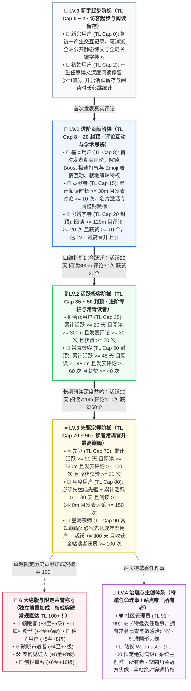

Bonjour à tous, développeurs geeks, lecteurs fidèles et passionnés de la recherche approfondie !

Des amis attentifs s'interrogent souvent, en interagissant en bas des articles de blog ou en survolant les avatars dans la section des commentaires : pourquoi certains lecteurs arborent-ils le titre **« LV.1 · Contributeur »**, d'autres le brillant **« LV.3 · Pionnier »**, et même un très petit nombre de lecteurs fidèles affichent-ils des chiffres impressionnants comme **« 📜 Scribe de la Genèse »** ou **« TL.102 »** ? Comment les badges **« ☕ Temps de lecture lente »** et **« 💎 Profondément apprécié »** s'illuminent-ils dans la carte de visite ? Pourquoi l'avatar de l'administrateur se distingue-t-il par une forme carrée aux coins légèrement arrondis et une couronne dorée ?

Aujourd'hui, ce guide officiel et autoritaire, qui incarne l'**esthétique de design geek originale d'EpoCanvas**, vous dévoilera en toute transparence l'algorithme de base et le parcours de mise à niveau pratique du **système de double échelle de confiance (seuils d'accès LV + mécanisme de pondération TL)**, des **11 titres de lecteur courants**, des **6 titres honorifiques épuisés et limités**, des **prérogatives des administrateurs et de l'administrateur principal**, ainsi que des **15+ badges d'accomplissement exclusifs** actuellement en vigueur sur le blog EpoCanvas !

---

> [!warning]
> **Informations sur la synchronisation et les statistiques des données** : Les données des lecteurs de ce blog (y compris la durée de lecture, les jours d'activité, le nombre de commentaires et les enregistrements d'applaudissements Emoji) reposent sur la persistance locale du client `LocalStorage` et sur la synchronisation asynchrone via le canal d'authentification backend Cloudflare Workers / D1. L'utilisation du mode navigation privée, l'accès fréquent depuis plusieurs appareils ou le vidage du cache du navigateur peuvent entraîner de légers retards de statistiques ou des déconnexions de session temporaires. Il est recommandé de lier un e-mail dédié (comme Epomail) dans le centre de compte pour garantir la liaison permanente de vos droits !

> [!tip]
> **Accès rapide aux statistiques et à l'affichage des badges** : Cliquez sur le **tiroir « Centre de compte » (Account Drawer)** situé à droite de la barre de navigation supérieure du blog ou sur le bouton rapide de la console pour consulter en temps réel votre niveau de confiance actuel (TL), le pourcentage d'atteinte du niveau suivant, le pool d'accomplissements débloqués, et choisir librement jusqu'à **4 badges exclusifs** à afficher pour affirmer votre identité geek !

<div data-theme-toc="true"> </div>

---

# I. Mécanisme central : le système à double piste des seuils d'accès LV et de la pondération TL

Le système communautaire du blog EpoCanvas adopte une **architecture de gouvernance à double piste** précise : **LV (Niveau)** et **TL (Niveau de Confiance)** ont chacun leur rôle et se complètent :

> [!important]
> **【Mécanisme central : différence essentielle entre le seuil d'accès LV et le classement par pondération TL】**
> - **LV (Niveau 0 ~ 4) — Détermine le niveau minimal de contenu que vous pouvez voir (seuil d'accès / verrou d'autorisation d'accès)** :
>   - Le LV est le seuil de sécurité du contenu et de classification en profondeur établi par le blog.
>   - **LV.0 (Débutant)** : Accès uniquement aux articles publics courants ;
>   - **LV.1 (Intermédiaire)** : Débloque le Boost rapide, l'interaction en commentaire exclusive et la rubrique de discussion technique avancée ;
>   - **LV.2 (Geek)** : Débloque les comptes rendus d'architecture de haut niveau, les blocs de code privés repliables et la rubrique d'expérimentation bêta de pointe ;
>   - **LV.3 (Pionnier)** : Débloque la rubrique de séminaire privé des pionniers et les droits de proposition technique par invitation ;
>   - **LV.4 (Gestion et Création principale)** : Gouvernance et surveillance de la communauté (Administrateurs) et droits de pénétration inconditionnelle sur tout le site (Administrateur principal).
> - **TL (Niveau de Confiance 0 ~ 100+) — Détermine votre autorité et votre poids de classement dans cette plage de niveau** :
>   - Le TL mesure votre niveau d'activité et l'accumulation de réputation dans votre plage de niveau actuelle.
>   - Au sein du même niveau LV, les lecteurs ayant un TL plus élevé ont une priorité d'affichage plus élevée dans la section des commentaires, un poids plus important pour les likes et les applaudissements, des quotas de limitation anti-spam plus souples et une présence plus éclatante dans le classement d'activité des lecteurs.

---

> [!tip]
> **【Critères clés de promotion : plafond maximal du niveau de confiance (Max TL Cap), chaîne de déblocage en cascade et plafonnement à 35 points d'intégrité】**
> 1. **Le titre détermine le plafond maximal du TL (Max TL Cap)** :
>    - Le TL en suffixe du titre représente le **plafond maximal du niveau de confiance (Max TL Cap)**, et non une valeur actuelle fixe.
>    - **Délimitation stricte du plafond de chaque palier** :
>      - **Palier LV.0** : le plafond est strictement limité à **TL.2** (Nouvel utilisateur Cap 0, Utilisateur initial Cap 2) ;
>      - **Palier LV.1** : le plafond est strictement limité à **TL.20** (Utilisateur de base Cap 8, Contributeur Cap 15, Chercheur réflexif Cap 20) ;
>      - **Palier LV.2** : le plafond est strictement limité à **TL.50** (Utilisateur actif Cap 35, Geek éternel Cap 50) ;
>      - **Palier LV.3** : le plafond des lecteurs ordinaires est strictement limité à **TL.90** (Pionnier Cap 70, Utilisateur annuel Cap 80, Maître de l’encre Cap 90) ;
>      - **Palier LV.4** : administrateurs TL 91 ~ 99, 👑 propriétaire du site TL 100, niveau maximal constant et absolu.
>    - **Cas réel** : le plafond du niveau de confiance maximal pour un utilisateur initial LV.0 est de 2 (TL Cap 2). Même si un nouveau lecteur travaille intensément, lisant d'affilée 1000 minutes d'articles, tant qu'il n'a pas publié de commentaire réel pour débloquer le LV.1 Utilisateur de base, son niveau de confiance reste strictement bloqué à **TL.2** dans le système !
> 2. **Chaîne de déverrouillage en cascade (Strict Waterfall Progression)** :
>    - Entre les titres du même ou de différents LV, il existe une chaîne de déverrouillage préalable rigoureuse. **Il faut d'abord satisfaire toutes les exigences du titre précédent pour pouvoir débloquer le suivant, le saut de niveau est strictement interdit !**
>    - **Cas réel** : le lecteur doit d'abord débloquer « Pionnier », avant de pouvoir débloquer « Utilisateur annuel ». Si le « Pionnier » n'est pas atteint (par exemple le nombre de commentaires ou de likes insuffisant), même avec 365 jours d'activité enregistrés, il est absolument impossible de débloquer « Utilisateur annuel » en sautant le niveau !
> 3. **Comment le niveau de confiance (TL) est-il augmenté et calculé ? (Plafond de 35 points d'activité)** :
>    - Le niveau de confiance est calculé dynamiquement par le système en fonction de 4 dimensions d'activités réelles du lecteur :
>      $\text{Raw Activity Points} = \lfloor\frac{\text{阅读时长(m)}}{30}\rfloor + \lfloor\frac{\text{评论数}}{3}\rfloor + \lfloor\frac{\text{获赞数}}{2}\rfloor + \lfloor\frac{\text{活跃天数}}{3}\rfloor$
>    - **【Mécanisme anti-fraude rigide】 Le plafond des points d'activité est limité à 35 points** :
>      $\text{Earned Points} = \min(35, \text{Raw Activity Points})$
>      Cela garantit qu'aucun lecteur ne peut contourner les seuils de titre en se contentant d'accumuler du temps d'inactivité ou des jours d'activité, il doit progresser grâce à des interactions profondes et substantielles !
>    - **Formule du TL réel pour les lecteurs ordinaires** :
>      $\text{当前常规 TL} = \min(\text{Max TL Cap}, \text{Base TL} + \text{Earned Points})$
>    - Tant que vous n'avez pas débloqué un nouveau titre, les points obtenus augmenteront votre TL de manière progressive jusqu'à atteindre le plafond du titre actuel. Pour dépasser ce plafond, il faut satisfaire les exigences en cascade du titre suivant !

---

# II. Architecture globale des paliers et processus de promotion en cascade

Le site est divisé en 11 titres natifs réguliers pour les lecteurs, plus 6 titres d'honneur exclusifs et les administrateurs et propriétaire du site nommés sur invitation. Aucun codage dur factice n'est autorisé ; tous les indicateurs réguliers peuvent être atteints naturellement par des interactions réelles en 1 an ($\le 365$ jours) :



---

# III. Manuel détaillé de déverrouillage des 11 titres réguliers pour les lecteurs

### 1. LV.0 Nouvel utilisateur (TL Cap : 0)
- **Identifiant du titre** : 🐣 Nouvel utilisateur
- **Condition d'admission** : nouveau visiteur du blog, n'ayant pas encore généré d'historique de lecture ou d'interaction.
- **Niveau de confiance** : `TL.0` (non augmentable, plafond 0).
- **Permissions et avantages** : consulter les articles statiques publics, recherche globale par mots-clés.
- **Chemin de progression** : Cliquez sur n'importe quel article pour débloquer immédiatement l'utilisateur « Initial » !

### 2. LV.0 Utilisateur initial (TL Cap: 2)
- **Identifiant de titre** : 📘 Utilisateur initial
- **Pré-requis** : Vous êtes déjà devenu un nouvel utilisateur.
- **Conditions d'admission** : Restez en lecture d'un article sur le blog ( `hasReadAny === true || readingMinutes >= 1` ).
- **Niveau de confiance** : `TL.1 ~ TL.2` (maximum 2).
- **Permissions et avantages** : Commencez à enregistrer le suivi quotidien de l'activité et de la durée de lecture.
- **Chemin de progression** : Laissez votre premier commentaire authentique sous n'importe quel article pour passer à LV.1 !

### 3. LV.1 Utilisateur de base (TL Cap: 8)
- **Identifiant de titre** : 🥉 Utilisateur de base
- **Pré-requis** : Vous devez d'abord débloquer l'utilisateur « Initial ».
- **Conditions d'admission** : Publiez 1 commentaire authentique ( `commentCount >= 1` ).
- **Niveau de confiance** : `TL.3 ~ TL.8` (maximum 8).
- **Permissions et avantages** :
  - Débloquez la zone de commentaire **“⚡ Boost Accélération”** (mode surbrillance de caractères $\le 16$ );
  - Débloquez la zone de commentaire **“😀 Interaction d'émoticônes”** (lancer un Emoji en un clic);
  - Vous avez la permission d'**« Édition en place (Inline Edit) »** et de retrait autonome après publication.

### 4. LV.1 Contributeur (TL Cap: 15)
- **Identifiant de titre** : 🏅 Contributeur
- **Pré-requis** : Vous devez d'abord débloquer l'utilisateur « De base ».
- **Conditions d'admission** : Durée de lecture cumulée de $\ge 30$ minutes et publication de $\ge 10$ commentaires (y compris discussions régulières et Boost).
- **Niveau de confiance** : `TL.9 ~ TL.15` (maximum 15).
- **Permissions et avantages** : Activation du badge orange-copper exclusif « Contributeur » sur la carte de visite, et augmentation du poids de tri du flux de commentaires.

### 5. LV.1 Penseur critique (TL Cap: 20 · plafond LV.1)
- **Identifiant de titre** : 💡 Penseur critique
- **Pré-requis** : Vous devez d'abord débloquer « Contributeur ».
- **Conditions d'admission** : Temps de lecture cumulatif de $\ge 120$ minutes (2 heures) et $\ge 20$ commentaires, ainsi que $\ge 10$ applaudissements/likes cumulés de lecteurs.
- **Niveau de confiance** : `TL.16 ~ TL.20` (plafond 20, **LV.1 plafond maximum**).
- **Permissions et avantages** : Activer la carte « Penseur critique » pour obtenir l'accès à la zone d'interaction approfondie.

### 6. LV.2 Utilisateur actif (TL Cap: 35)
- **Titre** : 🎖️ Utilisateur actif
- **Pré-requis** : Vous devez d'abord débloquer « Penseur critique ».
- **Conditions d'admission** (quatre indicateurs étroitement liés) :
  - Nombre de jours actifs cumulés : $\ge 20$ jours ;
  - Temps de lecture cumulatif : $\ge 300$ minutes (5 heures) ;
  - Nombre de commentaires cumulés : $\ge 30$ ;
  - Applaudissements de lecteurs cumulés : $\ge 20$ ;
- **Niveau de confiance** : `TL.21 ~ TL.35` (plafond 35).
- **Permissions et avantages** : Débloquer la colonne avancée LV.2 et le journal de pièges d'architecture, les commentaires bénéficient d'un surlignage pondéré.

### 7. LV.2 Geek éternel (TL Cap: 50 · plafond LV.2)
- **Titre** : 🌲 Geek éternel
- **Pré-requis** : Vous devez d'abord débloquer « Utilisateur actif ».
- **Conditions d'admission** :
  - Nombre de jours actifs cumulés : $\ge 45$ jours ;
  - Temps de lecture cumulatif : $\ge 480$ minutes (8 heures) ;
  - Nombre de commentaires cumulés : $\ge 60$ ;
  - Applaudissements de lecteurs cumulés : $\ge 40$ ;
- **Niveau de confiance** : `TL.36 ~ TL.50` (plafond 50, **LV.2 plafond maximum**).
- **Permissions et avantages** : La couche flottante de la carte est accompagnée d'une lueur verte émeraude, certification de membre actif de la communauté.

### 8. LV.3 Pionnier (TL Cap: 70)
- **称号标识**：⭐ 先驱
- **前置依赖**：必须先解锁「常青极客」。
- **准入条件**：
  - 累计活跃天数 $\ge 90$ 天；
  - 累计阅读时长 $\ge 720$ 分钟（12 小时）；
  - 累计发表评论 $\ge 100$ 次；
  - 累计收获读者喝彩 $\ge 60$ 次。
- **信任等级**：`TL.51 ~ TL.70`（上限 70）。
- **权限与权益**：享有先驱专属星芒徽标，受邀优先体验博客实验性黑科技特性。

### 9. LV.3 年度用户 (TL Cap: 80)
- **称号标识**：🎂 年度用户
- **前置依赖**：**必须先解锁「先驱」！** 严禁仅靠挂机天数跳级。
- **准入条件**：
  - 在达成「先驱」基础上，累计活跃天数达到 **180 天**；
  - 累计阅读时长 $\ge 1440$ 分钟（24 小时）；
  - 累计发表评论 $\ge 150$ 次。
- **信任等级**：`TL.71 ~ TL.80`（上限 80）。
- **权限与权益**：常青读者终身荣誉，尊贵年度印记，永不降级的忠实读者象征。

### 10. LV.3 墨海宗师 (TL Cap: 90 · 常规晋升巅峰)
- **称号标识**：📜 墨海宗师
- **前置依赖**：**必须先解锁「年度用户」！**
- **准入条件**（极客读者的全自动升级天花板，$\le 365$ 天内绝对可达成）：
  - 累计活跃天数达到 **300 天**（未超过 1 年限制！）；
  - 累计沉浸阅读时长 $\ge 2160$ 分钟（36 小时）；
  - 累计收获全站读者喝彩点赞 $\ge 100$ 次。
- **信任等级**：`TL.81 ~ TL.90`（上限 90，**常规读者自动晋升巅峰**）。
- **权限与权益**：**普通读者常规晋升最高殿堂**！名片独享墨海宗师紫金光芒，登峰造极。

---

# 四、绝版与限定荣誉称号（突破 TL 100+ 上限！）

在 EpoCanvas 社区的漫长演进中，有一群见证历史、在关键时期给予关键反馈的开拓者。为了铭记这些卓越贡献，系统特别推出了 **6 大绝版与限定荣誉称号**。

> [!important]
> **【核心规则：绝版称号加分机制与突破 100+ 特权】**
> 1. **额外信任等级加成（Special Title Bonus）**：
>    - 绝版与限定称号不占用常规 35 点活动积分配额，其加分是 **直接叠加在计算结果之上的全局增量**！
> 2. **突破常规 90 限制，信任等级直达 100+**：
>    - 常规读者受限于 LV.3 墨海宗师的 90 上限。但**拥有绝版称号的读者，其信任等级可以突破 90，最高达到 100 以上（如 TL.102、TL.106）**！
> 3. **基础 LV 门槛保持不变（安全底线）**：
>    - 绝版称号赋予极高的 TL 权威度和排名，但读者原有的 LV 基础门槛不变（若为 LV.3 墨海宗师，获得绝版加成后 TL 达到 102，其 LV 仍为 LV.3，严格守卫内容安全分级）。
> 4. **什么是权重等级（Priority）？**：
>    - Priority（0 ~ 100）决定了在名片浮层与评论区作者栏中，当读者拥有多个称号与徽章时，系统如何进行高优展示与排序。
>    - 称号徽标（Tier Badge）固定为 Priority 100，独占首位；
>    - **绝版限定称号赋予了 Priority 92 ~ 98 的超高权重**，优先于所有常规成就徽章，默认抢占名片浮层至多 4 枚徽章的高光席位！

以下是 6 大绝版与限定称号的准入条件、加成梯度与权重规则：

| 绝版称号 | 权重 Priority | 获得资格与门槛限制 | TL 等级加成机制 | 绝版状态 |
| :--- | :---: | :--- | :--- | :---: |
| **📜 创世墨客** | `98` | 早期撰写深度长评被系统收录、获赞 $\ge 30$、评论 $\ge 10$ 且绑定专属邮箱 | **TL $\le 70$ 加 10 级**<br/>**TL $> 70$ 加 6 级** | 🔒 永久绝版 |
| **🛠️ 架构见证人** | `96` | 见证博客历次技术重构，活跃 $\ge 30$ 天、阅读 $\ge 600\text{m}$、评论 $\ge 20$ 条并贡献关键反馈 | **TL $\le 70$ 加 8 级**<br/>**TL $> 70$ 加 5 级** | 🎖️ 限定授予 |
| **🌱 种子用户** | `95` | 限制 LV.3 以下读者；注册 90 天内获赞 $\ge 30$、评论回复 $\ge 50$ 条 | **TL $\le 60$ 加 8 级**<br/>**TL $> 60$ 加 5 级** | 🔒 永久绝版 |
| **💎 铁杆粉丝** | `94` | 博客开站早期前 1000 名常驻核心探索者；活跃 $\ge 60$ 天且阅读 $\ge 300\text{m}$ 或评论 $\ge 20$ 条 | **TL $\le 50$ 加 6 级**<br/>**TL $> 50$ 加 4 级** | 🔒 永久绝版 |
| **🔥 破晓布道者** | `93` | 限制 LV.1+ 读者；大版本首发期提交高质量技术纠错、编辑完善评论且获赞 $\ge 15$ | **TL $\le 50$ 加 7 级**<br/>**TL $> 50$ 加 4 级** | 🎖️ 限定荣誉 |
| **🚀 领跑者** | `92` | 限制 LV.3 以下读者；注册起 30 天内活跃起跑：阅读 $\ge 300\text{m}$、评论 $\ge 30$ 条、获赞 $\ge 20$ 个 | **TL $\le 50$ 加 5 级**<br/>**TL $> 50$ 加 3 级** | 🔒 永久绝版 |

> [!example]
> **真实高光案例**：
> 一位勤勉的读者历经近一年研读，达成了「LV.3 · 墨海宗师」（基准 TL Cap 90）。同时，他在博客早期曾是前 1000 名创世探索者（获得「💎 铁杆粉丝」TL > 50 加 4 级），并因撰写多篇高质量架构反馈受邀获得「📜 创世墨客」（TL > 70 加 6 级）。
> - 他的最终信任等级为：$90 + 4 + 6 = \mathbf{100}$，若再叠加其他限定贡献，便可傲视群雄突破至 **TL.102+**！

---

# 五、治理与主创体系：管理员与站长权责划分

> [!danger]
> **【核心排印与辨识原则：站长金冠微圆角方型 vs 管理员全员圆形】**
> - **👑 站长 (Webmaster)**：作为博客系统所有者与最高架构管理者，拥有全站 **独一无二的微圆角方形头像与金色皇冠（isSquareAvatar: true）**，全站仅此一人；
> - **🛡️ 社区管理员 (Admin)** 与其他所有读者：全站统一遵循 **标准高精度圆形头像（border-radius: 50%）**，杜绝身份混淆。

### 11. LV.4 社区管理员 (Admin / Core Member)
- **称号标识**：🛡️ 社区管理员 / ⭐ 核心成员
- **头像样式**：**标准圆形头像**（`border-radius: 50%`）
- **晋升机制**：非全自动升级。由站长特邀委任或经社区核心贡献考核通过后人工晋升。
- **信任等级**：`TL.91 ~ TL.99`（默认基准 95，最高可达 99）。
- **权责范围**：
  - 社区常务巡查与敏感违规内容就地审核；
  - 恶意灌水与违规评论屏蔽下架；
  - 协助站长进行技术选题讨论与读者事务协调。

### 12. 👑 站长 (Webmaster / Site Owner)
- **称号标识**：👑 站长
- **头像样式**：**全站唯一微圆角方形头像 + 独家金色皇冠**（`border-radius: 10px; isSquareAvatar: true`）
- **身份认证**：博客主创（shijianus），通过专属密钥通道与管理员邮箱鉴权。
- **信任等级**：**`TL.100`（恒定绝对满级）**。
- **权责范围**：
  - **全站无条件绝对穿透权限**：无需任何前置门槛，无视所有 LV 限制，可随时调阅、测试与穿透全站所有私有专栏、隐藏分级文档及实验室模块；
  - 云端 Functions / D1 数据库与 Stripe 收银台架构最高管辖权；
  - 社区规则的最终制定与仲裁解释权。

---

# 六、阅读沉淀成就徽章（静水流深）

读完一篇上千字的技术深度文章，比浮躁走马观花更有价值。以下徽章为你记录在 EpoCanvas 汲取知识的时光轨迹：

## No.1 通读全文
> [!todo] 通读全文 (📖)
> **权重优先级**：`40` | **所属分类**：`read`
> **系统定义**：累计深度阅读博文时长达到 15 分钟。
- **获取方式：** 在博文页面产生真实滚动与阅读停留达到 **15 分钟**。
- **参考操作：** 挑选 2 篇长文，开启目录索引（TOC），静下心读完。
- **避坑提示**：系统内置智能心跳。标签页切入后台或超过 3 分钟无操作将暂停计时。

## No.2 慢读时光
> [!todo] 慢读时光 (☕)
> **权重优先级**：`55` | **所属分类**：`read`
> **系统定义**：累计享受深度慢读时光超过 2 小时。
- **获取方式：** 全站各博文累计阅读时长突破 **120 分钟**。
- **参考操作：** 完整研读博客的“架构重构实录”或“Stripe 全球结账设计”长篇系列。

## No.3 博览群书
> [!todo] 博览群书 (📚)
> **权重优先级**：`70` | **所属分类**：`read`
> **系统定义**：累计沉浸阅读博客超过 10 小时。
- **获取方式：** 全站深度研读时长突破 **600 分钟**（10 小时）。
- **进阶彩蛋**：当阅读时长进一步突破 **30 小时（1800m）** 与 **60 小时（3600m）** 时，系统将自动解锁隐藏成就 **「📜 学贯中西」**（权重 72）与 **「🧭 墨海领航」**（权重 75）！

---

# 七、评论与互动徽章（思辨共鸣）

EpoCanvas 原生自研评论系统，支持多模态交互、Boost 极速打气与就地回复树：

## No.4 初露锋芒
> [!todo] 初露锋芒 (✍️)
> **权重优先级**：`30` | **所属分类**：`comment`
> **系统定义**：精益求精，就地编辑完善过自己的发言。
- **获取方式：** 在评论区发表任意言论后，完成过至少 1 次 **“就地编辑（Inline Edit）”** 操作。
- **实操避坑**：访客临时会话在刷新（F5）或关闭浏览器后即刻销毁，请在发布后趁热打铁体验编辑！

## No.5 丰富表情
> [!todo] 丰富表情 (😀)
> **权重优先级**：`35` | **所属分类**：`comment`
> **系统定义**：使用生动丰富的表情符号参与互动交流。
- **获取方式：** 首次使用评论区的“😀 表情互动”托盘发布 Emoji，或在他人评论卡片右下角送出 Emoji Reaction。

## No.6 言之有物
> [!todo] 言之有物 (💬)
> **权重优先级**：`50` | **所属分类**：`comment`
> **系统定义**：累计发表 5 条及以上优质独立见解。
- **获取方式：** 累计发表达到 **5 条** 真实评论。
- **进阶称号**：评论数达到 **20 条** 解锁 **「💡 真知灼见」**（权重 58），达到 **50 条** 解锁 **「🗣️ 纵论古今」**（权重 65）。
- **风控警示**：1 小时内相同评论会被拦截；普通评论每小时限额 3 次，珍惜发帖额度，“水贴不如精读”！

## No.7 回音激荡
> [!todo] 回音激荡 (🔔)
> **权重优先级**：`45` | **所属分类**：`comment`
> **系统定义**：在评论互动中主动提及或呼应他人。
- **获取方式：** 在评论中首次使用 `@` 提及特定读者，或点击他人评论卡片的 **“🔗 引用”** 按钮完成带引文的回复。

---

# 八、赞赏与喝彩成就徽章（赠人玫瑰）

## No.8 不吝赞美
> [!todo] 不吝赞美 (❤️)
> **权重优先级**：`45` | **所属分类**：`reaction`
> **系统定义**：慷慨为他人的深刻思考送出 10 次以上喝彩。
- **获取方式：** 累计主动送出 **10 次以上** Emoji 喝彩（`reactionsGiven >= 10`）。送出超过 30 次还将解锁 **「💖 乐善好施」**（权重 55）。

## No.9 Première rencontre résonnante
> [!todo] Première rencontre résonnante (✨)
> **Priorité de poids**：`40` | **Catégorie**：`reaction`
> **Définition du système**：L'énoncé personnel a reçu le premier applaudissement enthousiaste du lecteur.
- **Mode d'obtention :** Publier un commentaire ou un Boost et recevoir pour la première fois des applaudissements et des likes d'autres personnes.

## No.10 Susciter la résonance
> [!todo] Susciter la résonance (🔥)
> **Priorité de poids**：`65` | **Catégorie**：`reaction`
> **Définition du système**：Les idées publiées ont accumulé plus de 20 interactions d'applaudissements.
- **Mode d'obtention :** Les déclarations sous votre nom accumulent des applaudissements et des likes atteignant **20 fois**.

## No.11 Toucher le cœur
> [!todo] Toucher le cœur (💎)
> **Priorité de poids**：`80` | **Catégorie**：`reaction`
> **Définition du système**：Accumuler plus de 50 applaudissements et appréciations de résonance des lecteurs.
- **Hall d'avancement**：Lorsque les applaudissements dépassent **100 fois**, l'accomplissement à poids très élevé **« 🌟 Consensus général »** (poids 85) sera activé !

---

# 9. Identité Geek et Badge de client habituel (intemporel)

## No.12 Auteur d'autobiographie
> [!todo] Auteur d'autobiographie (🏷️)
> **Priorité de poids**：`35` | **Catégorie**：`activity`
> **Définition du système**：Signature personnalisée améliorée et avatar dédié configuré.
- **Mode d'obtention :** Téléchargez un avatar personnalisé dans le centre de compte et rédigez une biographie personnelle d'**au moins 10 caractères** (`bio.length >= 10 && avatarUrl`).

## No.13 Lien de lettre
> [!todo] Lien de lettre (✉️)
> **Priorité de poids**：`40` | **Catégorie**：`activity`
> **Définition du système**：Boîte mail dédiée liée, ouvrant le canal de connexion d'échange d'idées.
- **Méthode d'obtention :** Lier avec succès une adresse e-mail courante ou l'adresse e-mail `@epomail.bond` dédiée aux tests. La liaison d'une adresse e-mail sur un domaine officiel vous offrira également l'étiquette d'identité exclusive **« Lecteur certifié Epomail »** !

## No.14 Empreinte de fidèle
> [!todo] Empreinte de fidèle (🏃)
> **Priorité de poids** : `50` | **Catégorie** : `activity`
> **Définition système** : Cumul de plus de 10 jours d'exploration active sur le blog.
- **Méthode d'obtention :** Atteindre **10 jours** de jours d'activité cumulée. Atteindre 30 jours d'activité débloquera également **« ⚡ Opportuniste »** (poids 60).

## No.15 Calligraphe centenaire
> [!todo] Calligraphe centenaire (🏔️)
> **Priorité de poids** : `75` | **Catégorie** : `activity`
> **Définition système** : Ami de plume profondément enraciné, actif sur le blog depuis 100 jours cumulés.
- **Méthode d'obtention :** Franchir le seuil de **100 jours** d'activité cumulée.

## No.16 Un an de navigation commune
> [!todo] Un an de navigation commune (🎂)
> **Priorité de poids** : `85` | **Catégorie** : `activity`
> **Définition système** : Plus d'un an de connaissance et de compagnonnage avec ce blog.
- **Méthode d'obtention :** Atteindre **365 jours** depuis la première visite ou l'inscription (plafond de $\le 365$ jours). De plus, une activité cumulée supérieure à 200 jours débloquera **« 🌲 Résilience éternelle »** (poids 88) !

---

# X. Annexe : Explication des règles d'affichage de la superposition de carte de visite (À l'attention des lecteurs)

Lorsque vous survolez la photo de profil ou le pseudonyme de n'importe quel contributeur dans la section des commentaires, le système affiche instantanément une **carte de visite geek (Popover de profil de l'auteur)** soigneusement ajustée :

```
┌────────────────────────────────────────────────────────┐
│  [圆形头像]  shijian_fan  [⭐ 先驱] [Epomail 认证]     │
│  热爱开源，折腾 Astro 与 Rust 的全栈开发者             │
│  ────────────────────────────────────────────────────  │
│  [ 💎 深得人心 ] [ 📚 博览群书 ] [ 🏔️ 百日墨客 ] [ ☕ 慢读时光 ] │
│  ────────────────────────────────────────────────────  │
│  最新发言: 刚刚 · 加入时间: 120天前 · 已读: 480m · 喝彩: 68   │
└────────────────────────────────────────────────────────┘
```

Beaucoup de gens se demandent : **« J'ai déjà débloqué 8 badges, pourquoi seulement 4 sont affichés sur ma carte de visite ? »**

### 1. Normes de mise en page minimalistes et épurées
- **Refus de l'excès** : Nous ne voulons pas que la carte de visite devienne un mur de médailles envahissant, nuisant à l'aération de la mise en page.
- **Maximum de 4 badges** : Le système limite strictement la barre de médailles dans la superposition de carte de visite à **un maximum de 4 badges par ligne** (`max 4`).
- **Sélection autonome vs Repli par poids** :
  - **Équipement autonome** : Vous pouvez cliquer dans le tiroir des badges du « Centre de compte » pour sélectionner et « équiper » librement vos 4 badges préférés ;
  - **Repli intelligent** : Si vous n'avez jamais effectué de configuration manuelle, le système triera automatiquement, sur la base de l'algorithme, les badges débloqués **strictement par ordre de poids de priorité décroissant, et affichera les 4 badges d'honneur les plus élevés** !
  - **Titres en édition limitée naturellement en vedette** : En raison des 6 grands titres d'honneur en édition limitée qui attribuent une priorité `92 ~ 98` très élevée, dès que vous les débloquez, le système les place automatiquement dans l'emplacement le plus visible !

### 2. Normes de mise en page de la barre de statistiques (flux horizontal flexible)
Les données d'activité des lecteurs en bas de la carte sont disposées en flux horizontal flexible, comprenant 4 indicateurs statistiques réels :
1. **Dernière prise de parole** : calcul dynamique et affichage d'un horodatage relatif (ex. « à l'instant », « il y a 3 heures ») ;
2. **Date d'adhésion** : enregistre le nombre de jours depuis la première visite ou inscription du lecteur (ex. « il y a 180 jours ») ;
3. **Durée de lecture** : affiche la durée totale de lecture accumulée sur le blog (ex. « 240m ») ;
4. **Applaudissements et likes** : affiche le nombre total de likes reçus pour les publications d'opinions.

---

# XI, Conclusion : les posts superficiels ne valent pas la lecture approfondie, détendez-vous et relaxez !

La profondeur de la communauté ne réside pas dans l'empilement aveugle de publications, mais dans les résonances générées à chaque collision d'idées.

Que vous soyez un **«🐣 nouvel utilisateur »** qui vient de visiter, ou un **«☕ amateur de lecture lente »** qui a silencieusement lu des dizaines d'articles, le blog EpoCanvas vous réserve une carte numérique geek à votre nom.

**Détendez-vous et relaxez, bienvenue à publier votre première opinion dans la section commentaires ci-dessous, et lancez votre parcours d'ascension de niveau de confiance !**