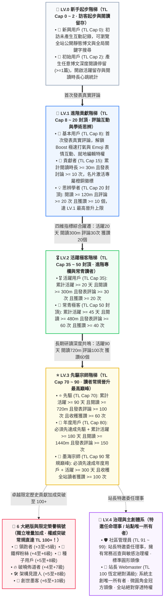

各位極客開發者、常駐讀者與深研博友們，大家好！

經常有細心的朋友在部落格文章底部互動或懸停評論區頭像時好奇：為什麼有的讀者頂著 **「LV.1 · 貢獻者」**，有的是耀眼的 **「LV.3 · 先驅」**，甚至還有極少數核心老讀者亮著 **「📜 創世墨客」** 或 **「TL.102」** 這樣突破天花板的耀眼數字？名片浮層裡的 **「☕ 慢讀時光」**、**「💎 深得人心」** 又是如何點亮的？站長的頭像為什麼能獨樹一幟地呈現微圓角方形與金色皇冠？

今天，這篇凝聚了 **EpoCanvas 原創極客設計美學** 的官方權威指南，將向大家徹底開源揭秘 EpoCanvas 部落格現行的 **雙軌信任階梯系統（LV 準入門檻 + TL 權重機制）**、**11 大核心讀者常規稱號**、**6 大絕版與限定榮譽稱號**、**管理員與站長權責** 以及 **15+ 枚專屬成就徽章** 的底層判定演算法與實操升級路徑！

---

> [!warning]
> **資料同步與統計須知**：本部落格讀者資料（包括閱讀時長、活躍天數、評論數、Emoji 喝采記錄）依托客戶端 `LocalStorage` 本地持久沉澱與 Cloudflare Workers / D1 後端鑑權通道非同步同步。若使用無痕隱私模式、頻繁跨裝置訪問或清空瀏覽器快取，可能會產生微弱的統計延遲或臨時會話斷連。建議在帳號中心綁定專屬信箱（如 Epomail）以確保權益永久綁定！

> [!tip]
> **戰績與徽章佩戴快捷入口**：點擊部落格頂部導覽列右側或控制台快捷按鈕的 **「帳號中心」抽屜（Account Drawer）**，即可即時查看目前的信任等級（TL）、下一級達成百分比、已解鎖成就池，並可自由挑選佩戴最多 **4 枚專屬徽章** 彰顯極客身份！

<div data-theme-toc="true"> </div>

---

# 一、核心機制：LV 準入門檻與 TL 權重的雙軌制

EpoCanvas 部落格社群體系採用精密的 **雙軌治理架構**：**LV（Level）** 與 **TL（Trust Level）** 各司其職，相輔相成：

> [!important]
> **【核心機制：LV 準入門檻 vs TL 權重排名的本質區別】**
> - **LV (Level 0 ~ 4) —— 決定你能看到的內容最低等級（準入門檻 / 訪問權限鎖）**：
>   - LV 是部落格設立的內容安全與深度分級門檻。
>   - **LV.0（新手）**：僅可查閱常規公開博文；
>   - **LV.1（進階）**：解鎖極速打氣（Boost）、專屬評論互動與進階技術探討專欄；
>   - **LV.2（極客）**：解鎖高階架構實錄、私有折疊程式碼區塊與前沿內測實驗專欄；
>   - **LV.3（先驅）**：解鎖先驅閉門研討專欄與特邀技術提案權限；
>   - **LV.4（管理與主創）**：社群巡查治理（管理員）與全站無條件穿透權限（站長）。
> - **TL (Trust Level 0 ~ 100+) —— 決定你在本等級區間內的權威度與排名權重**：
>   - TL 衡量你在目前等級區間內的活躍度與信譽累積。
>   - 在同一 LV 等級內，TL 更高的讀者在評論區展示優先級更高、點讚喝采權重更大、防灌水限流配額更寬鬆、在讀者活躍榜上更亮眼。

---

> [!tip]
> **【關鍵晉級準則：最高信任等級上限（Max TL Cap）、瀑布解鎖鏈與 35 點積分封頂】**
> 1. **稱號決定最高 TL 上限（Max TL Cap）**：
>    - 稱號後綴的 TL 代表該稱號所賦予的 **最高信任等級上限（Max TL Cap）**，而非固定的目前數值。
>    - **階梯區間上限嚴格劃定**：
>      - **LV.0 階梯**：上限嚴格限制在 **TL.2**（新興用戶 Cap 0，初始用戶 Cap 2）；
>      - **LV.1 階梯**：上限嚴格限制在 **TL.20**（基本用戶 Cap 8，貢獻者 Cap 15，思辨學者 Cap 20）；
>      - **LV.2 階梯**：上限嚴格限制在 **TL.50**（活躍用戶 Cap 35，常青極客 Cap 50）；
>      - **LV.3 階梯**：常規讀者上限嚴格限制在 **TL.90**（先驅 Cap 70，年度用戶 Cap 80，墨海宗師 Cap 90）；
>      - **LV.4 階梯**：管理員 TL 91 ~ 99，👑 站長 TL 100 恆定絕對滿級。
>    - **真實案例**：LV.0 初始用戶的最高信任等級上限是 2（TL Cap 2）。即使一位新讀者極度用功，一口氣連續閱讀了 1000 分鐘博文，只要他尚未發表過任何真實評論以解鎖 LV.1 基本用戶，他的信任等級在系統中依然被嚴格鎖死在 **TL.2**！
> 2. **瀑布依賴解鎖鏈（Strict Waterfall Progression）**：
>    - 處於相同或不同 LV 的稱號之間，存在嚴密的前置解鎖鏈條。**必須先滿足前一個稱號的所有要求，才能解鎖後續稱號，嚴禁越級！**
>    - **真實案例**：讀者必須先解鎖「先驅」，才能進一步解鎖「年度用戶」。如果尚未達成「先驅」（如評論數或獲讚未達標），即使註冊活躍天數達到了 365 天，也絕對無法越級解鎖「年度用戶」！
> 3. **信任等級（TL）如何提升與計算？（35 點活動積分封頂）**：
>    - 信任等級由系統根據 4 項多維度讀者真實活動動態計算：
>      $$\text{Raw Activity Points} = \lfloor\frac{\text{閱讀時長(m)}}{30}\rfloor + \lfloor\frac{\text{評論數}}{3}\rfloor + \lfloor\frac{\text{獲贊數}}{2}\rfloor + \lfloor\frac{\text{活躍天數}}{3}\rfloor$$
>    - **【硬性防刷分機制】活動積分上限限制為 35 點**：
>      $$\text{Earned Points} = \min(35, \text{Raw Activity Points})$$
>      這保證了任何讀者都無法通過單純掛機刷時長或活躍天數繞過稱號門檻，必須通過實質性深度互動晉升稱號！
>    - **常規讀者實際 TL 公式**：
>      $$\text{目前常規 TL} = \min(\text{Max TL Cap}, \text{Base TL} + \text{Earned Points})$$
>    - 只要未解鎖新稱號，獲得的積分將平滑提升你的 TL，直到達到目前稱號的上限。想要突破天花板，必須完成下一稱號的瀑布要求！

---

# 二、全景階梯架構與瀑布晉級流程

全站劃分為 11 個讀者常規原生稱號，外加 6 大絕版榮譽稱號與特邀委任管理員、站長主創。嚴禁虛假硬編碼，全部常規指標均可在 1 年（$\le 365$ 天）內由真實互動自然達成：



---

# 三、11 大常規讀者稱號詳細解鎖手冊

### 1. LV.0 新興用戶 (TL Cap: 0)
- **稱號標識**：🐣 新興用戶
- **準入條件**：初次到訪部落格的新訪客，尚未產生閱讀與互動記錄。
- **信任等級**：`TL.0`（不可上漲，上限 0）。
- **權限與權益**：瀏覽公開靜態博文、全局關鍵字搜尋。
- **晉級路線**：點擊瀏覽任意一篇文章，即刻解鎖「初始用戶」！

### 2. LV.0 初始用戶 (TL Cap: 2)
- **稱號標識**：📘 初始用戶
- **前置依賴**：已成為新興用戶。
- **準入條件**：在部落格完成任意一篇文章的閱讀停留（`hasReadAny === true || readingMinutes >= 1`）。
- **信任等級**：`TL.1 ~ TL.2`（上限 2）。
- **權限與權益**：開始記錄每日活躍留存與閱讀時長心跳。
- **晉級路線**：在任意博文底部留下你的第一條真實評論，躍遷 LV.1！

### 3. LV.1 基本用戶 (TL Cap: 8)
- **稱號標識**：🥉 基本用戶
- **前置依賴**：必須先解鎖「初始用戶」。
- **準入條件**：累計發表 1 條真實評論（`commentCount >= 1`）。
- **信任等級**：`TL.3 ~ TL.8`（上限 8）。
- **權限與權益**：
  - 解鎖評論區 **“⚡ Boost 極速打氣”**（$\le 16$ 字元高光模式）；
  - 解鎖評論區 **“😀 表情互動”**（一鍵發射 Emoji 反饋）；
  - 擁有發表後臨時會話的 **“就地編輯（Inline Edit）”** 與自主撤回權限。

### 4. LV.1 貢獻者 (TL Cap: 15)
- **稱號標識**：🏅 貢獻者
- **前置依賴**：必須先解鎖「基本用戶」。
- **準入條件**：累計閱讀時長 $\ge 30$ 分鐘 且 發表評論 $\ge 10$ 次（含常規討論與 Boost）。
- **信任等級**：`TL.9 ~ TL.15`（上限 15）。
- **權限與權益**：名片激活「貢獻者」專屬橙銅徽標，評論流排序權重提升。

### 5. LV.1 思辨學者 (TL 上限: 20 · LV.1 封頂)
- **稱號標識**：💡 思辨學者
- **前置依賴**：必須先解鎖「貢獻者」。
- **準入條件**：累積閱讀時長 $\ge 120$ 分鐘（2 小時）且 發表評論 $\ge 20$ 次 且 累積獲得讀者喝采/點讚 $\ge 10$ 個。
- **信任等級**：`TL.16 ~ TL.20`（上限 20，**LV.1 階梯最高上限**）。
- **權限與權益**：名片啟用「思辨學者」智能微光，獲得深度互動專區準入權。

### 6. LV.2 活躍用戶 (TL 上限: 35)
- **稱號標識**：🎖️ 活躍用戶
- **前置依賴**：必須先解鎖「思辨學者」。
- **準入條件**（四項指標嚴密聯動）：
  - 累積活躍天數 $\ge 20$ 天；
  - 累積閱讀時長 $\ge 300$ 分鐘（5 小時）；
  - 累積發表評論 $\ge 30$ 次；
  - 累積獲得讀者喝采 $\ge 20$ 次。
- **信任等級**：`TL.21 ~ TL.35`（上限 35）。
- **權限與權益**：解鎖 LV.2 進階專欄與架構踩坑實錄，評論具備加權高亮標識。

### 7. LV.2 常青極客 (TL 上限: 50 · LV.2 封頂)
- **稱號標識**：🌲 常青極客
- **前置依賴**：必須先解鎖「活躍用戶」。
- **準入條件**：
  - 累積活躍天數 $\ge 45$ 天；
  - 累積閱讀時長 $\ge 480$ 分鐘（8 小時）；
  - 累積發表評論 $\ge 60$ 次；
  - 累積獲得讀者喝采 $\ge 40$ 次。
- **信任等級**：`TL.36 ~ TL.50`（上限 50，**LV.2 階梯最高上限**）。
- **權限與權益**：名片浮層附帶翡翠綠尊貴光暈，社群活躍骨幹成員認證。

### 8. LV.3 先驅 (TL 上限: 70)
- **稱號標識**：⭐ 先驅
- **前置依賴**：必須先解鎖「常青極客」。
- **準入條件**：
  - 累積活躍天數 $\ge 90$ 天；
  - 累積閱讀時長 $\ge 720$ 分鐘（12 小時）；
  - 累積發表評論 $\ge 100$ 次；
  - 累積獲得讀者喝采 $\ge 60$ 次。
- **信任等級**：`TL.51 ~ TL.70`（上限 70）。
- **權限與權益**：享有先驅專屬星芒徽標，受邀優先體驗部落格實驗性黑科技特性。

### 9. LV.3 年度用戶 (TL 上限: 80)
- **稱號標識**：🎂 年度用戶
- **前置依賴**：**必須先解鎖「先驅」！** 嚴禁僅靠掛機天數跳級。
- **準入條件**：
  - 在達成「先驅」基礎上，累積活躍天數達到 **180 天**；
  - 累積閱讀時長 $\ge 1440$ 分鐘（24 小時）；
  - 累積發表評論 $\ge 150$ 次。
- **信任等級**：`TL.71 ~ TL.80`（上限 80）。
- **權限與權益**：常青讀者終身榮譽，尊貴年度印記，永不降級的忠實讀者象徵。

### 10. LV.3 墨海宗師 (TL 上限: 90 · 常規晉升巔峰)
- **稱號標識**：📜 墨海宗師
- **前置依賴**：**必須先解鎖「年度用戶」！**
- **準入條件**（極客讀者的全自動升級上限，$\le 365$ 天內絕對可達成）：
  - 累積活躍天數達到 **300 天**（未超過 1 年限制！）；
  - 累積沉浸閱讀時長 $\ge 2160$ 分鐘（36 小時）；
  - 累積獲得全站讀者喝采點讚 $\ge 100$ 次。
- **信任等級**：`TL.81 ~ TL.90`（上限 90，**常規讀者自動晉升巔峰**）。
- **權限與權益**：**普通讀者常規晉升最高殿堂**！名片獨享墨海宗師紫金光芒，登峰造極。

---

# 四、絕版與限定榮譽稱號（突破 TL 100+ 上限！）

在 EpoCanvas 社群的漫長演進中，有一群見證歷史、在關鍵時期給予關鍵回饋的開拓者。為了銘記這些卓越貢獻，系統特別推出了 **6 大絕版與限定榮譽稱號**。

> [!important]
> **【核心規則：絕版稱號加分機制與突破 100+ 特權】**
> 1. **額外信任等級加成（Special Title Bonus）**：
>    - 絕版與限定稱號不佔用常規 35 點活動積分配額，其加分是 **直接疊加在計算結果之上的全域增量**！
> 2. **突破常規 90 限制，信任等級直達 100+**：
>    - 常規讀者受限於 LV.3 墨海宗師的 90 上限。但**擁有絕版稱號的讀者，其信任等級可以突破 90，最高達到 100 以上（如 TL.102、TL.106）**！
> 3. **基礎 LV 門檻保持不變（安全底線）**：
>    - 絕版稱號賦予極高的 TL 權威度與排名，但讀者原有的 LV 基礎門檻不變（若為 LV.3 墨海宗師，獲得絕版加成後 TL 達到 102，其 LV 仍為 LV.3，嚴格守衛內容安全分級）。
> 4. **什麼是權重等級（Priority）？**：
>    - Priority（0 ~ 100）決定了在名片浮層與評論區作者欄中，當讀者擁有多個稱號與徽章時，系統如何進行高優先級展示與排序。
>    - 稱號徽標（Tier Badge）固定為 Priority 100，獨佔首位；
>    - **絕版限定稱號賦予了 Priority 92 ~ 98 的超高權重**，優先於所有常規成就徽章，預設搶佔名片浮層至多 4 枚徽章的高光席位！

以下是 6 大絕版與限定稱號的準入條件、加成梯度與權重規則：

| 絕版稱號 | 權重 Priority | 獲得資格與門檻限制 | TL 等級加成機制 | 絕版狀態 |
| :--- | :---: | :--- | :--- | :---: |
| **📜 創世墨客** | `98` | 早期撰寫深度長評被系統收錄、獲讚 $\ge 30$、評論 $\ge 10$ 且綁定專屬信箱 | **TL $\le 70$ 加 10 級**<br/>**TL $> 70$ 加 6 級** | 🔒 永久絕版 |
| **🛠️ 架構見證人** | `96` | 見證部落格歷次技術重構，活躍 $\ge 30$ 天、閱讀 $\ge 600\text{m}$、評論 $\ge 20$ 條並貢獻關鍵回饋 | **TL $\le 70$ 加 8 級**<br/>**TL $> 70$ 加 5 級** | 🎖️ 限定授予 |
| **🌱 種子用戶** | `95` | 限制 LV.3 以下讀者；註冊 90 天內獲讚 $\ge 30$、評論回覆 $\ge 50$ 條 | **TL $\le 60$ 加 8 級**<br/>**TL $> 60$ 加 5 級** | 🔒 永久絕版 |
| **💎 鐵桿粉絲** | `94` | 部落格開站早期前 1000 名常駐核心探索者；活躍 $\ge 60$ 天且閱讀 $\ge 300\text{m}$ 或評論 $\ge 20$ 條 | **TL $\le 50$ 加 6 級**<br/>**TL $> 50$ 加 4 級** | 🔒 永久絕版 |
| **🔥 破曉佈道者** | `93` | 限制 LV.1+ 讀者；大版本首發期提交高品質技術糾錯、編輯完善評論且獲讚 $\ge 15$ | **TL $\le 50$ 加 7 級**<br/>**TL $> 50$ 加 4 級** | 🎖️ 限定榮譽 |
| **🚀 領跑者** | `92` | 限制 LV.3 以下讀者；註冊起 30 天內活躍起跑：閱讀 $\ge 300\text{m}$、評論 $\ge 30$ 條、獲讚 $\ge 20$ 個 | **TL $\le 50$ 加 5 級**<br/>**TL $> 50$ 加 3 級** | 🔒 永久絕版 |

> [!example]
> **真實高光案例**：
> 一位勤勉的讀者歷經近一年研讀，達成了「LV.3 · 墨海宗師」（基準 TL Cap 90）。同時，他在部落格早期曾是前 1000 名創世探索者（獲得「💎 鐵桿粉絲」TL > 50 加 4 級），並因撰寫多篇高品質架構回饋受邀獲得「📜 創世墨客」（TL > 70 加 6 級）。
> - 他的最終信任等級為：$90 + 4 + 6 = \mathbf{100}$，若再疊加其他限定貢獻，便可傲視群雄突破至 **TL.102+**！

---

# 五、治理與主創體系：管理員與站長權責劃分

> [!danger]
> **【核心排版與辨識原則：站長金冠微圓角方型 vs 管理員全員圓形】**
> - **👑 站長 (Webmaster)**：作為部落格系統所有者與最高架構管理者，擁有全站 **獨一無二的微圓角方形頭像與金色皇冠（isSquareAvatar: true）**，全站僅此一人；
> - **🛡️ 社群管理員 (Admin)** 與其他所有讀者：全站統一遵循 **標準高精度圓形頭像（border-radius: 50%）**，杜絕身份混淆。

### 11. LV.4 社群管理員 (Admin / Core Member)
- **稱號標識**：🛡️ 社群管理員 / ⭐ 核心成員
- **頭像樣式**：**標準圓形頭像**（`border-radius: 50%`）
- **晉升機制**：非全自動升級。由站長特邀委任或經社群核心貢獻考核通過後人工晉升。
- **信任等級**：`TL.91 ~ TL.99`（預設基準 95，最高可達 99）。
- **權責範圍**：
  - 社群常務巡查與敏感違規內容就地審核；
  - 惡意灌水與違規評論屏蔽下架；
  - 協助站長進行技術選題討論與讀者事務協調。

### 12. 👑 站長 (Webmaster / Site Owner)
- **稱號標識**：👑 站長
- **頭像樣式**：**全站唯一微圓角方形頭像 + 獨家金色皇冠**（`border-radius: 10px; isSquareAvatar: true`）
- **身份認證**：部落格主創（shijianus），透過專屬密鑰通道與管理員信箱鑑權。
- **信任等級**：**`TL.100`（恆定絕對滿級）**。
- **權責範圍**：
  - **全站無條件絕對穿透權限**：無需任何前置門檻，無視所有 LV 限制，可隨時調閱、測試與穿透全站所有私有專欄、隱藏分級文件及實驗室模組；
  - 雲端 Functions / D1 資料庫與 Stripe 收銀台架構最高管轄權；
  - 社群規則的最終制定與仲裁解釋權。

---

# 六、閱讀沉澱成就徽章（靜水流深）

讀完一篇上千字的技術深度文章，比浮躁走馬看花更有價值。以下徽章為你記錄在 EpoCanvas 汲取知識的時光軌跡：

## No.1 通讀全文
> [!todo] 通讀全文 (📖)
> **權重優先級**：`40` | **所屬分類**：`read`
> **系統定義**：累計深度閱讀部落格文章時長達到 15 分鐘。
- **獲取方式：** 在部落格文章頁面產生真實滾動與閱讀停留達到 **15 分鐘**。
- **參考操作：** 挑選 2 篇長文，開啟目錄索引（TOC），靜下心讀完。
- **避坑提示**：系統內置智能心跳。分頁切入後台或超過 3 分鐘無操作將暫停計時。

## No.2 慢讀時光
> [!todo] 慢讀時光 (☕)
> **權重優先級**：`55` | **所屬分類**：`read`
> **系統定義**：累計享受深度慢讀時光超過 2 小時。
- **獲取方式：** 全站各部落格文章累計閱讀時長突破 **120 分鐘**。
- **參考操作：** 完整研讀部落格的「架構重構實錄」或「Stripe 全球結帳設計」長篇系列。

## No.3 博覽群書
> [!todo] 博覽群書 (📚)
> **權重優先級**：`70` | **所屬分類**：`read`
> **系統定義**：累計沉浸閱讀部落格超過 10 小時。
- **獲取方式：** 全站深度研讀時長突破 **600 分鐘**（10 小時）。
- **進階彩蛋**：當閱讀時長進一步突破 **30 小時（1800m）** 與 **60 小時（3600m）** 時，系統將自動解鎖隱藏成就 **「📜 學貫中西」**（權重 72）與 **「🧭 墨海領航」**（權重 75）！

---

# 七、評論與互動徽章（思辨共鳴）

EpoCanvas 原生自研評論系統，支援多模態互動、Boost 極速打氣與就地回覆樹：

## No.4 初露鋒芒
> [!todo] 初露鋒芒 (✍️)
> **權重優先級**：`30` | **所屬分類**：`comment`
> **系統定義**：精益求精，就地編輯完善過自己的發言。
- **獲取方式：** 在評論區發表任意言論後，完成過至少 1 次 **「就地編輯（Inline Edit）」** 操作。
- **實操避坑**：訪客臨時會話在重新整理（F5）或關閉瀏覽器後即刻銷毀，請在發布後趁熱打鐵體驗編輯！

## No.5 豐富表情
> [!todo] 豐富表情 (😀)
> **權重優先級**：`35` | **所屬分類**：`comment`
> **系統定義**：使用生動豐富的表情符號參與互動交流。
- **獲取方式：** 首次使用評論區的「😀 表情互動」托盤發佈 Emoji，或在他人評論卡片右下角送出 Emoji Reaction。

## No.6 言之有物
> [!todo] 言之有物 (💬)
> **權重優先級**：`50` | **所屬分類**：`comment`
> **系統定義**：累計發表 5 條及以上優質獨立見解。
- **獲取方式：** 累計發表達到 **5 條** 真實評論。
- **進階稱號**：評論數達到 **20 條** 解鎖 **「💡 真知灼見」**（權重 58），達到 **50 條** 解鎖 **「🗣️ 縱論古今」**（權重 65）。
- **風控警示**：1 小時內相同評論會被攔截；普通評論每小時限額 3 次，珍惜發帖額度，「水貼不如精讀」！

## No.7 回音激盪
> [!todo] 回音激盪 (🔔)
> **權重優先級**：`45` | **所屬分類**：`comment`
> **系統定義**：在評論互動中主動提及或呼應他人。
- **獲取方式：** 在評論中首次使用 `@` 提及特定讀者，或點擊他人評論卡片的 **「🔗 引用」** 按鈕完成帶引文的回覆。

---

# 八、讚賞與喝采成就徽章（贈人玫瑰）

## No.8 不吝讚美
> [!todo] 不吝讚美 (❤️)
> **權重優先級**：`45` | **所屬分類**：`reaction`
> **系統定義**：慷慨為他人的深刻思考送出 10 次以上喝采。
- **獲取方式：** 累計主動送出 **10 次以上** Emoji 喝采（`reactionsGiven >= 10`）。送出超過 30 次還將解鎖 **「💖 樂善好施」**（權重 55）。

## No.9 初見迴響
> [!todo] 初見迴響 (✨)
> **權重優先級**：`40` | **所屬分類**：`reaction`
> **系統定義**：個人發言收穫了讀者的第一枚熱烈喝采。
- **獲取方式：** 自己發表評論或 Boost 首次收到來自他人的點讚喝采。

## No.10 引發共鳴
> [!todo] 引發共鳴 (🔥)
> **權重優先級**：`65` | **所屬分類**：`reaction`
> **系統定義**：發表的見解累計收穫 20 次以上喝采互動。
- **獲取方式：** 個人名下發言累計收穫喝采點讚達到 **20 次**。

## No.11 深得人心
> [!todo] 深得人心 (💎)
> **權重優先級**：`80` | **所屬分類**：`reaction`
> **系統定義**：累計獲得超過 50 次讀者共鳴喝采與讚賞。
- **進階殿堂**：當收穫喝采突破 **100 次** 時，將激活極高權重成就 **「🌟 眾望所歸」**（權重 85）！

---

# 九、極客身份與常客徽章（歷久彌新）

## No.12 自傳作者
> [!todo] 自傳作者 (🏷️)
> **權重優先級**：`35` | **所屬分類**：`activity`
> **系統定義**：完善了個性簽名介紹並配置了專屬頭像。
- **獲取方式：** 在帳號中心上傳自訂頭像，並且撰寫 **不少於 10 個字** 的個人簡介（`bio.length >= 10 && avatarUrl`）。

## No.13 信件連結
> [!todo] 信件連結 (✉️)
> **權重優先級**：`40` | **所屬分類**：`activity`
> **系統定義**：綁定了專屬信箱，開啟思想交流連結通道。
- **獲取方式：** 成功綁定常用信箱或測試專屬的 `@epomail.bond` 信箱。綁定官方域名信箱還將獲贈 **「Epomail 認證讀者」** 專屬身份標籤！

## No.14 常客印記
> [!todo] 常客印記 (🏃)
> **權重優先級**：`50` | **所屬分類**：`activity`
> **系統定義**：累計在部落格活躍探索 10 天以上。
- **獲取方式：** 累計活躍訪問天數達到 **10 天**。活躍達到 30 天還將解鎖 **「⚡ 見縫插針」**（權重 60）。

## No.15 百日墨客
> [!todo] 百日墨客 (🏔️)
> **權重優先級**：`75` | **所屬分類**：`activity`
> **系統定義**：累計在部落格活躍長達 100 天的深厚筆友。
- **獲取方式：** 累計活躍天數突破 **100 天**。

## No.16 同舟一載
> [!todo] 同舟一載 (🎂)
> **權重優先級**：`85` | **所屬分類**：`activity`
> **系統定義**：與本部落格相識相伴同行超過 1 年時光。
- **獲取方式：** 距離初次訪問或註冊時間滿 **365 天**（$\le 365$ 天上限）。此外，累計活躍超過 200 天還將解鎖 **「🌲 堅韌長青」**（權重 88）！

---

# 十、附錄：名片浮層展示規則說明（讀者須知）

當你把滑鼠懸停在評論區任何一位發帖者的頭像或暱稱上時，系統都會瞬間彈出一張精心調校的 **極客名片（Author Profile Popover）**：

```
┌────────────────────────────────────────────────────────┐
│  [圓形頭像]  shijian_fan  [⭐ 先驅] [Epomail 認證]     │
│  熱愛開源，折騰 Astro 與 Rust 的全棧開發者             │
│  ────────────────────────────────────────────────────  │
│  [ 💎 深得人心 ] [ 📚 博覽群書 ] [ 🏔️ 百日墨客 ] [ ☕ 慢讀時光 ] │
│  ────────────────────────────────────────────────────  │
│  最新發言: 剛剛 · 加入時間: 120天前 · 已讀: 480m · 喝采: 68   │
└────────────────────────────────────────────────────────┘
```

很多朋友會問：**「我已經解鎖了 8 個徽章，為什麼我的名片上只顯示了 4 個？」**

### 1. 原創極簡克制排版規範
- **拒絕花俏冗餘**：我們不希望名片變成鋪天蓋地的勳章牆，破壞排版呼吸感。
- **至多佩戴 4 枚**：系統嚴格限制名片浮層中的勳章欄 **單行最多展示 4 個徽章**（`max 4`）。
- **自主挑選 vs 權重兜底**：
  - **自主裝備**：你可以在「帳號中心」的徽章抽屜中，任意點擊挑選你最喜歡的 4 枚徽章進行「裝備」；
  - **智能兜底**：如果你從未手動設置，系統將基於演算法，自動從你已解鎖的徽章池中 **嚴格按照 Priority 權重從高到低排序，截取前 4 個最高榮譽徽章** 展示！
  - **絕版稱號天然高光**：由於 6 大絕版榮譽稱號賦予了 `92 ~ 98` 的超高 Priority，只要你達成解鎖，系統默認會直接將它們排在最醒目的展示位！

### 2. 統計欄排版規範（彈性橫向流）
名片底部的讀者活躍數據採用橫向彈性流排佈，包含 4 項真實統計指標：
1. **最新發言**：動態計算並展示相對時間戳（如「剛剛」、「3 小時前」）；
2. **加入時間**：記錄讀者首次造訪或註冊距離當前的天數（如「180 天前」）；
3. **已讀時長**：展示在部落格累積消耗的閱讀心跳時長（如「240m」）；
4. **喝采點讚**：展示發表見解累積獲得的讀者點讚總數。

---

# 十一、結語：灌水不如精讀，坐而放寬！

社群的深度從不在於發文數量的盲目堆砌，而在於每一次思想碰撞所激盪出的迴響。

無論你是剛到訪的 **「🐣 新興使用者」**，還是已經默默讀完數十篇部落格文章的 **「☕ 慢讀時光」** 擁有者，EpoCanvas 部落格都為你保留了一張屬於你的極客數位名片。

**坐而放寬，歡迎在下方評論區發表你的第一條見解，開啟屬於你的信任等級晉升之旅！**