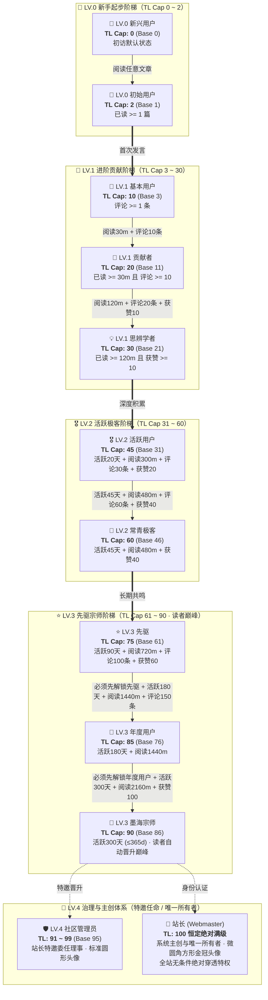

各位极客开发者、常驻读者与深研博友们，大家好！

经常有细心的朋友在博客文章底部互动或悬停评论区头像时好奇：为什么有的读者顶着 **「LV.1 · 贡献者」**，有的是耀眼的 **「LV.3 · 先驱」**？名片浮层里的 **「☕ 慢读时光」**、**「💎 深得人心」** 又是如何点亮的？站长的头像为什么能独树一帜地呈现微圆角方形与金色皇冠？

今天，这篇凝聚了 **EpoCanvas 原创极客设计美学** 的官方权威指南，将向大家彻底开源揭秘 EpoCanvas 博客现行的 **双轨信任阶梯系统（LV 准入门槛 + TL 权重机制）**、**11 大核心读者称号**、**管理员与站长权责** 以及 **15+ 枚专属成就徽章** 的底层判定算法与实操升级路径！

---

> [!warning]
> **数据同步与统计须知**：本博客读者数据（包括阅读时长、活跃天数、评论数、Emoji 喝彩记录）依托客户端 `LocalStorage` 本地持久沉淀与 Cloudflare Workers / D1 后端鉴权通道异步同步。若使用无痕隐私模式、频繁跨设备访问或清空浏览器缓存，可能会产生微弱的统计延迟或临时会话断连。建议在账号中心绑定专属邮箱（如 Epomail）以确保权益永久绑定！

> [!tip]
> **战绩与徽章佩戴快捷入口**：点击博客顶部导航栏右侧或控制台快捷按钮的 **「账号中心」抽屉（Account Drawer）**，即可实时查看当前的信任等级（TL）、下一级达成百分比、已解锁成就池，并可自由挑选佩戴最多 **4 枚专属徽章** 彰显极客身份！

<div data-theme-toc="true"> </div>

---

# 一、核心机制：LV 准入门槛与 TL 权重的双轨制

EpoCanvas 博客社区体系采用精密的 **双轨治理架构**：**LV（Level）** 与 **TL（Trust Level）** 各司其职，相辅相成：

> [!important]
> **【核心机制：LV 准入门槛 vs TL 权重排名的本质区别】**
> - **LV (Level 0 ~ 4) —— 决定你能看到的内容最低等级（准入门槛 / 访问权限锁）**：
>   - LV 是博客设立的内容安全与深度分级门槛。
>   - **LV.0（新手）**：仅可查阅常规公开博文；
>   - **LV.1（进阶）**：解锁极速打气（Boost）、专属评论互动与进阶技术探讨专栏；
>   - **LV.2（极客）**：解锁高阶架构实录、私有折叠代码块与前沿内测实验专栏；
>   - **LV.3（先驱）**：解锁先驱闭门研讨专栏与特邀技术提案权限；
>   - **LV.4（管理与主创）**：社区巡查治理（管理员）与全站无条件穿透权限（站长）。
> - **TL (Trust Level 0 ~ 100) —— 决定你在本等级区间内的权威度与排名权重**：
>   - TL 衡量你在当前等级区间内的活跃度与信誉积累。
>   - 在同一 LV 等级内，TL 更高的读者在评论区展示优先级更高、点赞喝彩权重更大、防灌水限流配额更宽松、在读者活跃榜上更亮眼。

---

> [!tip]
> **【关键晋级准则：最高信任等级上限（Max TL Cap）与瀑布依赖解锁链】**
> 1. **称号决定最高 TL 上限（Max TL Cap）**：
>    - 称号后缀的 TL 代表该称号所赋予的 **最高信任等级上限（Max TL Cap）**，而非固定的当前数值。
>    - **真实案例**：LV.0 初始用户的最高信任等级上限是 2（TL Cap 2）。即使一位新读者极度用功，一口气连续阅读了 1000 分钟博文（折算活动分很高），但只要他尚未发表过任何评论以解锁 LV.1 基本用户，他的信任等级在系统中依然被严格锁死在 **TL.2**！
> 2. **瀑布依赖解锁链（Strict Waterfall Progression）**：
>    - 处于相同或不同 LV 的称号之间，存在严密的前置解锁链条。**必须先满足前一个称号的所有要求，才能解锁后续称号，严禁越级！**
>    - **真实案例**：读者必须先解锁「先驱」，才能进一步解锁「年度用户」。如果尚未达成「先驱」（如评论数或获赞未达标），即使注册活跃天数达到了 365 天，也绝对无法越级解锁「年度用户」！
> 3. **信任等级（TL）如何提升与计算？**
>    - 信任等级由系统根据 4 项多维度读者真实活动积分动态计算：
>      $$\text{Earned Points} = \lfloor\frac{\text{阅读时长(m)}}{30}\rfloor + \lfloor\frac{\text{评论数}}{3}\rfloor + \lfloor\frac{\text{获赞数}}{2}\rfloor + \lfloor\frac{\text{活跃天数}}{3}\rfloor$$
>      $$\text{当前实际 TL} = \min(\text{Max TL Cap}, \text{Base TL} + \text{Earned Points})$$
>    - 只要未解锁新称号，获得的积分将平滑提升你的 TL，直到达到当前称号的上限。想要突破天花板，必须完成下一称号的瀑布要求！

---

# 二、全景阶梯架构与瀑布晋级流程

全站划分为 11 个读者原生称号，辅以特邀委任管理员与站长主创，严禁虚假硬编码，全部指标均可在 1 年（$\le 365$ 天）内由真实交互自然达成：



---

# 三、11 大读者称号详细解锁手册

### 1. LV.0 新兴用户 (TL Cap: 0)
- **称号标识**：🐣 新兴用户
- **准入条件**：初次到访博客的新访客，尚未产生阅读与互动记录。
- **信任等级**：`TL.0`（不可上涨，上限 0）。
- **权限与权益**：浏览公开静态博文、全局关键字搜索。
- **晋级路线**：点击浏览任意一篇文章，即刻解锁「初始用户」！

### 2. LV.0 初始用户 (TL Cap: 2)
- **称号标识**：📘 初始用户
- **前置依赖**：已成为新兴用户。
- **准入条件**：在博客完成任意一篇文章的阅读停留（`hasReadAny === true || readingMinutes >= 1`）。
- **信任等级**：`TL.1 ~ TL.2`（上限 2）。
- **权限与权益**：开始记录每日活跃留存与阅读时长心跳。
- **晋级路线**：在任意博文底部留下你的第一条评论，跃迁 LV.1！

### 3. LV.1 基本用户 (TL Cap: 10)
- **称号标识**：🥉 基本用户
- **前置依赖**：必须先解锁「初始用户」。
- **准入条件**：累计发表 1 条真实评论（`commentCount >= 1`）。
- **信任等级**：`TL.3 ~ TL.10`（上限 10）。
- **权限与权益**：
  - 解锁评论区 **“⚡ Boost 极速打气”**（$\le 16$ 字符高光模式）；
  - 解锁评论区 **“😀 表情互动”**（一键发射 Emoji 反馈）；
  - 拥有发表后临时会话的 **“就地编辑（Inline Edit）”** 与自主撤回权限。

### 4. LV.1 贡献者 (TL Cap: 20)
- **称号标识**：🏅 贡献者
- **前置依赖**：必须先解锁「基本用户」。
- **准入条件**：累计阅读时长 $\ge 30$ 分钟 且 发表评论 $\ge 10$ 次（含常规讨论与 Boost）。
- **信任等级**：`TL.11 ~ TL.20`（上限 20）。
- **权限与权益**：名片激活「贡献者」专属橙铜徽标，评论流排序权重提升。

### 5. LV.1 思辨学者 (TL Cap: 30)
- **称号标识**：💡 思辨学者
- **前置依赖**：必须先解锁「贡献者」。
- **准入条件**：累计阅读时长 $\ge 120$ 分钟（2 小时）且 发表评论 $\ge 20$ 次 且 累计收获读者喝彩/点赞 $\ge 10$ 个。
- **信任等级**：`TL.21 ~ TL.30`（上限 30）。
- **权限与权益**：名片激活「思辨学者」智能微光，获得深度互动专区准入权。

### 6. LV.2 活跃用户 (TL Cap: 45)
- **称号标识**：🎖️ 活跃用户
- **前置依赖**：必须先解锁「思辨学者」。
- **准入条件**（四项指标严密联动）：
  - 累计活跃天数 $\ge 20$ 天；
  - 累计阅读时长 $\ge 300$ 分钟（5 小时）；
  - 累计发表评论 $\ge 30$ 次；
  - 累计收获读者喝彩 $\ge 20$ 次。
- **信任等级**：`TL.31 ~ TL.45`（上限 45）。
- **权限与权益**：解锁 LV.2 进阶专栏与架构踩坑实录，评论具备加权高亮标识。

### 7. LV.2 常青极客 (TL Cap: 60)
- **称号标识**：🌲 常青极客
- **前置依赖**：必须先解锁「活跃用户」。
- **准入条件**：
  - 累计活跃天数 $\ge 45$ 天；
  - 累计阅读时长 $\ge 480$ 分钟（8 小时）；
  - 累计发表评论 $\ge 60$ 次；
  - 累计收获读者喝彩 $\ge 40$ 次。
- **信任等级**：`TL.46 ~ TL.60`（上限 60）。
- **权限与权益**：名片浮层附带翡翠绿尊贵光晕，社区活跃骨干成员认证。

### 8. LV.3 先驱 (TL Cap: 75)
- **称号标识**：⭐ 先驱
- **前置依赖**：必须先解锁「常青极客」。
- **准入条件**：
  - 累计活跃天数 $\ge 90$ 天；
  - 累计阅读时长 $\ge 720$ 分钟（12 小时）；
  - 累计发表评论 $\ge 100$ 次；
  - 累计收获读者喝彩 $\ge 60$ 次。
- **信任等级**：`TL.61 ~ TL.75`（上限 75）。
- **权限与权益**：享有先驱专属星芒徽标，受邀优先体验博客实验性黑科技特性。

### 9. LV.3 年度用户 (TL Cap: 85)
- **称号标识**：🎂 年度用户
- **前置依赖**：**必须先解锁「先驱」！** 严禁仅靠挂机天数跳级。
- **准入条件**：
  - 在达成「先驱」基础上，累计活跃天数达到 **180 天**；
  - 累计阅读时长 $\ge 1440$ 分钟（24 小时）；
  - 累计发表评论 $\ge 150$ 次。
- **信任等级**：`TL.76 ~ TL.85`（上限 85）。
- **权限与权益**：常青读者终身荣誉，尊贵年度印记，永不降级的忠实读者象征。

### 10. LV.3 墨海宗师 (TL Cap: 90 · 读者晋升巅峰)
- **称号标识**：📜 墨海宗师
- **前置依赖**：**必须先解锁「年度用户」！**
- **准入条件**（极客读者的全自动升级天花板，$\le 365$ 天内绝对可达成）：
  - 累计活跃天数达到 **300 天**（未超过 1 年限制！）；
  - 累计沉浸阅读时长 $\ge 2160$ 分钟（36 小时）；
  - 累计收获全站读者喝彩点赞 $\ge 100$ 次。
- **信任等级**：`TL.86 ~ TL.90`（上限 90）。
- **权限与权益**：**普通读者全自动晋升的最高巅峰**！名片独享墨海宗师紫金光芒，登峰造极。

---

# 四、治理与主创体系：管理员与站长权责划分

> [!danger]
> **【核心排印与辨识原则：站长金冠微圆角方型 vs 管理员全员圆形】**
> - **👑 站长 (Webmaster)**：作为博客系统所有者与最高架构管理者，拥有全站 **独一无二的微圆角方形头像与金色皇冠（isSquareAvatar: true）**，全站仅此一人；
> - **🛡️ 社区管理员 (Admin)** 与其他所有读者：全站统一遵循 **标准高精度圆形头像（border-radius: 50%）**，杜绝身份混淆。

### 11. LV.4 社区管理员 (Admin / Core Member)
- **称号标识**：🛡️ 社区管理员 / ⭐ 核心成员
- **头像样式**：**标准圆形头像**（`border-radius: 50%`）
- **晋升机制**：非全自动升级。由站长特邀委任或经社区核心贡献考核通过后人工晋升。
- **信任等级**：`TL.91 ~ TL.99`（默认基准 95，最高可达 99）。
- **权责范围**：
  - 社区常务巡查与敏感违规内容就地审核；
  - 恶意灌水与违规评论屏蔽下架；
  - 协助站长进行技术选题讨论与读者事务协调。

### 12. 👑 站长 (Webmaster / Site Owner)
- **称号标识**：👑 站长
- **头像样式**：**全站唯一微圆角方形头像 + 独家金色皇冠**（`border-radius: 10px; isSquareAvatar: true`）
- **身份认证**：博客主创（shijianus），通过专属密钥通道与管理员邮箱鉴权。
- **信任等级**：**`TL.100`（恒定绝对满级）**。
- **权责范围**：
  - **全站无条件绝对穿透权限**：无需任何前置门槛，无视所有 LV 限制，可随时调阅、测试与穿透全站所有私有专栏、隐藏分级文档及实验室模块；
  - 云端 Functions / D1 数据库与 Stripe 收银台架构最高管辖权；
  - 社区规则的最终制定与仲裁解释权。

---

# 五、阅读沉淀成就徽章（静水流深）

读完一篇上千字的技术深度文章，比浮躁走马观花更有价值。以下徽章为你记录在 EpoCanvas 汲取知识的时光轨迹：

## No.1 通读全文
> [!todo] 通读全文 (📖)
> **权重优先级**：`40` | **所属分类**：`read`
> **系统定义**：累计深度阅读博文时长达到 15 分钟。
- **获取方式：** 在博文页面产生真实滚动与阅读停留达到 **15 分钟**。
- **参考操作：** 挑选 2 篇长文，开启目录索引（TOC），静下心读完。
- **避坑提示**：系统内置智能心跳。标签页切入后台或超过 3 分钟无操作将暂停计时。

## No.2 慢读时光
> [!todo] 慢读时光 (☕)
> **权重优先级**：`55` | **所属分类**：`read`
> **系统定义**：累计享受深度慢读时光超过 2 小时。
- **获取方式：** 全站各博文累计阅读时长突破 **120 分钟**。
- **参考操作：** 完整研读博客的“架构重构实录”或“Stripe 全球结账设计”长篇系列。

## No.3 博览群书
> [!todo] 博览群书 (📚)
> **权重优先级**：`70` | **所属分类**：`read`
> **系统定义**：累计沉浸阅读博客超过 10 小时。
- **获取方式：** 全站深度研读时长突破 **600 分钟**（10 小时）。
- **进阶彩蛋**：当阅读时长进一步突破 **30 小时（1800m）** 与 **60 小时（3600m）** 时，系统将自动解锁隐藏成就 **「📜 学贯中西」**（权重 72）与 **「🧭 墨海领航」**（权重 75）！

---

# 六、评论与互动徽章（思辨共鸣）

EpoCanvas 原生自研评论系统，支持多模态交互、Boost 极速打气与就地回复树：

## No.4 初露锋芒
> [!todo] 初露锋芒 (✍️)
> **权重优先级**：`30` | **所属分类**：`comment`
> **系统定义**：精益求精，就地编辑完善过自己的发言。
- **获取方式：** 在评论区发表任意言论后，完成过至少 1 次 **“就地编辑（Inline Edit）”** 操作。
- **实操避坑**：访客临时会话在刷新（F5）或关闭浏览器后即刻销毁，请在发布后趁热打铁体验编辑！

## No.5 丰富表情
> [!todo] 丰富表情 (😀)
> **权重优先级**：`35` | **所属分类**：`comment`
> **系统定义**：使用生动丰富的表情符号参与互动交流。
- **获取方式：** 首次使用评论区的“😀 表情互动”托盘发布 Emoji，或在他人评论卡片右下角送出 Emoji Reaction。

## No.6 言之有物
> [!todo] 言之有物 (💬)
> **权重优先级**：`50` | **所属分类**：`comment`
> **系统定义**：累计发表 5 条及以上优质独立见解。
- **获取方式：** 累计发表达到 **5 条** 真实评论。
- **进阶称号**：评论数达到 **20 条** 解锁 **「💡 真知灼见」**（权重 58），达到 **50 条** 解锁 **「🗣️ 纵论古今」**（权重 65）。
- **风控警示**：1 小时内相同评论会被拦截；普通评论每小时限额 3 次，珍惜发帖额度，“水贴不如精读”！

## No.7 回音激荡
> [!todo] 回音激荡 (🔔)
> **权重优先级**：`45` | **所属分类**：`comment`
> **系统定义**：在评论互动中主动提及或呼应他人。
- **获取方式：** 在评论中首次使用 `@` 提及特定读者，或点击他人评论卡片的 **“🔗 引用”** 按钮完成带引文的回复。

---

# 七、赞赏与喝彩成就徽章（赠人玫瑰）

## No.8 不吝赞美
> [!todo] 不吝赞美 (❤️)
> **权重优先级**：`45` | **所属分类**：`reaction`
> **系统定义**：慷慨为他人的深刻思考送出 10 次以上喝彩。
- **获取方式：** 累计主动送出 **10 次以上** Emoji 喝彩（`reactionsGiven >= 10`）。送出超过 30 次还将解锁 **「💖 乐善好施」**（权重 55）。

## No.9 初见回响
> [!todo] 初见回响 (✨)
> **权重优先级**：`40` | **所属分类**：`reaction`
> **系统定义**：个人发言收获了读者的第一枚热烈喝彩。
- **获取方式：** 自己发表的评论或 Boost 首次收到来自他人的点赞喝彩。

## No.10 引发共鸣
> [!todo] 引发共鸣 (🔥)
> **权重优先级**：`65` | **所属分类**：`reaction`
> **系统定义**：发表的见解累计收获 20 次以上喝彩互动。
- **获取方式：** 个人名下发言累计收获喝彩点赞达到 **20 次**。

## No.11 深得人心
> [!todo] 深得人心 (💎)
> **权重优先级**：`80` | **所属分类**：`reaction`
> **系统定义**：累计获得超过 50 次读者共鸣喝彩与赞赏。
- **进阶殿堂**：当收获喝彩突破 **100 次** 时，将激活极高权重成就 **「🌟 众望所归」**（权重 85）！

---

# 八、极客身份与常客徽章（历久弥新）

## No.12 自传作者
> [!todo] 自传作者 (🏷️)
> **权重优先级**：`35` | **所属分类**：`activity`
> **系统定义**：完善了个性签名介绍并配置了专属头像。
- **获取方式：** 在账号中心上传自定义头像，并且撰写 **不少于 10 个字** 的个人简介（`bio.length >= 10 && avatarUrl`）。

## No.13 信件连结
> [!todo] 信件连结 (✉️)
> **权重优先级**：`40` | **所属分类**：`activity`
> **系统定义**：绑定了专属邮箱，开启思想交流连结通道。
- **获取方式：** 成功绑定常用邮箱或测试专属的 `@epomail.bond` 邮箱。绑定官方域名邮箱还将获赠 **「Epomail 认证读者」** 专属身份标签！

## No.14 常客印记
> [!todo] 常客印记 (🏃)
> **权重优先级**：`50` | **所属分类**：`activity`
> **系统定义**：累计在博客活跃探索 10 天以上。
- **获取方式：** 累计活跃访问天数达到 **10 天**。活跃达到 30 天还将解锁 **「⚡ 见缝插针」**（权重 60）。

## No.15 百日墨客
> [!todo] 百日墨客 (🏔️)
> **权重优先级**：`75` | **所属分类**：`activity`
> **系统定义**：累计在博客活跃长达 100 天的深厚笔友。
- **获取方式：** 累计活跃天数突破 **100 天**。

## No.16 同舟一载
> [!todo] 同舟一载 (🎂)
> **权重优先级**：`85` | **所属分类**：`activity`
> **系统定义**：与本博客相识相伴同行超过 1 年时光。
- **获取方式：** 距离初次访问或注册时间满 **365 天**（$\le 365$ 天上限）。此外，累计活跃超过 200 天还将解锁 **「🌲 坚韧长青」**（权重 88）！

---

# 九、附录：名片浮层展示规则说明（读者须知）

当你把鼠标悬停在评论区任何一位发帖者的头像或昵称上时，系统都会瞬间弹出一张精心调校的 **极客名片（Author Profile Popover）**：

```
┌────────────────────────────────────────────────────────┐
│  [圆形头像]  shijian_fan  [⭐ 先驱] [Epomail 认证]     │
│  热爱开源，折腾 Astro 与 Rust 的全栈开发者             │
│  ────────────────────────────────────────────────────  │
│  [ 💎 深得人心 ] [ 📚 博览群书 ] [ 🏔️ 百日墨客 ] [ ☕ 慢读时光 ] │
│  ────────────────────────────────────────────────────  │
│  最新发言: 刚刚 · 加入时间: 120天前 · 已读: 480m · 喝彩: 68   │
└────────────────────────────────────────────────────────┘
```

很多朋友会问：**“我已经解锁了 8 个徽章，为什么我的名片上只显示了 4 个？”**

### 1. 原创极简克制排版规范
- **拒绝花哨冗余**：我们不希望名片变成铺天盖地的勋章墙，破坏排版呼吸感。
- **至多佩戴 4 枚**：系统严格限制名片浮层中的勋章栏 **单行最多展示 4 个徽章**（`max 4`）。
- **自主挑选 vs 权重兜底**：
  - **自主装备**：你可以在「账号中心」的徽章抽屉中，任意点击挑选你最喜欢的 4 枚徽章进行“装备”；
  - **智能兜底**：如果你从未手动设置，系统将基于算法，自动从你已解锁的徽章池中 **严格按照 Priority 权重从高到低排序，截取前 4 个最高荣誉徽章** 展示！

### 2. 统计栏排印规范（弹性横向流）
名片底部的读者活跃数据采用横向弹性流排布，包含 4 项真实统计指标：
1. **最新发言**：动态计算并展示相对时间戳（如“刚刚”、“3小时前”）；
2. **加入时间**：记录读者首次访问或注册距离当前的天数（如“180天前”）；
3. **已读时长**：展示在博客累计消耗的阅读心跳时长（如“240m”）；
4. **喝彩点赞**：展示发表见解累计收获的读者点赞总数。

---

# 十、结语：水贴不如精读，坐和放宽！

社区的深度从不在于发帖数量的盲目堆砌，而在于每一次思想碰撞所激荡出的回响。

无论你是刚刚到访的 **「🐣 新兴用户」**，还是已经默默读完数十篇博文的 **「☕ 慢读时光」** 拥有者，EpoCanvas 博客都为你保留了一张属于你的极客数字名片。

**坐和放宽，欢迎在下方评论区发表你的第一条见解，开启属于你的信任等级晋升之旅！**
