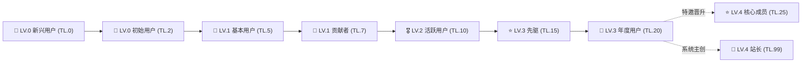

各位佬友、极客开发者与常驻读者们，大家好！

经常有细心的朋友在博客文章底部互动或悬停评论区头像时好奇：为什么有的读者顶着 **「LV.1 · 贡献者」**，有的是耀眼的 **「LV.3 · 先驱」**？名片浮层里的 **「☕ 慢读时光」**、**「💎 深得人心」** 又是如何点亮的？站长的头像为什么能独树一帜地呈现微圆角方形？

今天，这篇凝聚了 **EpoCanvas 原创极客设计美学** 的官方权威指南，将向大家彻底开源揭秘 EpoCanvas 博客现行的 **信任阶梯系统（Trust Levels）**、**8 大核心称号** 与 **15+ 枚专属成就徽章** 的判定底层算法与实操升级路径！

---

> [!warning]
> **数据同步与统计须知**：本博客读者数据（包括阅读时长、活跃天数、评论数、Emoji 喝彩记录）依托客户端 `LocalStorage` 本地持久沉淀与 Cloudflare Workers / D1 后端鉴权通道异步同步。若使用无痕隐私模式、频繁跨设备访问或清空浏览器缓存，可能会产生微弱的统计延迟或临时会话断连。建议在账号中心绑定专属邮箱（如 Epomail）以确保权益永久绑定！

> [!tip]
> **战绩与徽章佩戴快捷入口**：点击博客顶部导航栏右侧或控制台快捷按钮的 **「账号中心」抽屉（Account Drawer）**，即可实时查看当前的信任等级（TL）、下一级达成百分比、已解锁成就池，并可自由挑选佩戴最多 **4 枚专属徽章** 彰显极客身份！

<div data-theme-toc="true"> </div>

---

# 一、信任阶梯与核心等级（基础阶梯）

EpoCanvas 博客的信任阶梯（Trust Level，简称 TL）是专为深度阅读与高品质技术交流量身定制的原创社区治理体系。我们坚信：**“水贴不如精读，浮躁不如沉淀”**。全站划分为 8 个原生信任阶梯，每一个等级都严格由代码自动化审计判定：



### 1. LV.0 新兴用户 (TL.0, Newcomer)
- **阶梯代码**：`lv0` / `TL.0`
- **称号标识**：🐣 新兴用户
- **准入条件**：初次访问博客的新访客，或刚建立本地读者会话的初始状态。
- **权限与权益**：享有全站博文的极速静态阅读体验，支持使用站内搜索与阅读进度追踪。
- **晋级路线**：点击阅读任意一篇博文即可晋级！

### 2. LV.0 初始用户 (TL.2, Initial Reader)
- **阶梯代码**：`lv0` / `TL.2`
- **称号标识**：📘 初始用户
- **准入条件**：在博客完成任意一篇文章的真实有效阅读（`hasReadAny === true || readingMinutes > 0`）。
- **权限与权益**：正式进入读者活力池，开始统计每日活跃留存天数与累计阅读心跳。
- **晋级路线**：在任意博文底部留下你的第一次评论发言，立即晋升 LV.1！

### 3. LV.1 基本用户 (TL.5, Basic User)
- **阶梯代码**：`lv1` / `TL.5`
- **称号标识**：🥉 基本用户
- **准入条件**：累计发表 1 条有效评论（`commentCount >= 1`）。
- **权限与权益**：
  - 解锁评论区的 **“⚡ Boost 极速打气”**（$\le 16$ 字符高光发布）模式；
  - 解锁评论区 **“😀 表情互动”**（一键直达 Emoji Reaction）；
  - 拥有发布后的 **“就地编辑（Inline Edit）”** 与修改权限。

### 4. LV.1 贡献者 (TL.7, Contributor)
- **阶梯代码**：`lv1` / `TL.7`
- **称号标识**：🏅 贡献者
- **准入条件**：累计阅读时长超过 **30 分钟**，且在全站发表评论达到 **10 次以上**（含常规讨论与 Boost）。
- **权限与权益**：名片激活“贡献者”高亮徽标，评论列表优先渲染贡献者铭牌，获得社区技术交流专属标签。

### 5. LV.2 活跃用户 (TL.10, Active User)
- **阶梯代码**：`lv2` / `TL.10`
- **称号标识**：🎖️ 活跃用户
- **准入条件**（四项指标全满足，严格由系统判定）：
  - 累计活跃天数 $\ge$ **20 天**；
  - 累计深度阅读时长 $\ge$ **300 分钟**（5 小时）；
  - 累计发表评论 $\ge$ **30 条**；
  - 累计收获他人送出的 Emoji 喝彩/点赞 $\ge$ **30 次**。
- **权限与权益**：社区中坚力量，名片浮层附带高亮微光效果，评论拥有更高的展示优先级，优先受邀体验实验室前沿特性。

### 6. LV.3 先驱 (TL.15, Pioneer)
- **阶梯代码**：`lv3` / `TL.15`
- **称号标识**：⭐ 先驱
- **准入条件**（极客读者的全自动晋升天花板）：
  - 累计活跃天数 $\ge$ **60 天**；
  - 累计阅读时长 $\ge$ **720 分钟**（12 小时）；
  - 累计发表评论 $\ge$ **100 次**；
  - 累计获得读者喝彩/点赞 $\ge$ **50 次**。
- **权限与权益**：享有社区最高级别的读者认证，名片附带先驱星芒图标，属于长期深研博客内容的硬核布道者。

### 7. LV.3 年度用户 (TL.20, Annual Member)
- **阶梯代码**：`lv3` / `TL.20`
- **称号标识**：🎂 年度用户
- **准入条件**：与博客相识相伴，累计活跃天数跨度满 **365 天**（`activeDays >= 365`）。
- **权限与权益**：达成常青学者顶级荣誉，全自动升级机制的终极巅峰，永不降级的忠实读者见证。

### 8. LV.4 站长与核心成员 (TL.99 / TL.25)
- **LV.4 核心成员 (TL.25)**：站长特邀理事与系统共建者，拥有社区协助治理与特别致谢名册。
- **LV.4 站长 (TL.99)**：博客主创、全栈架构师与系统所有者（shijianus），拥有全站最高调度与审计权限。

> [!important]
> **【核心排印规则：全站头像唯一性原则】**
> - **站长专属微圆角方型头像**：为了确保全站权威辨识度，**唯独且仅有站长（Webmaster）** 在全站所有评论、卡片与名片中采用 **微圆角方形头像（带专属金色皇冠）**（`isSquareAvatar: true`）；
> - **全员圆形头像**：除站长外的所有读者、贡献者、先驱、年度用户以及 LV.4 核心成员，全站统一遵循 **标准高精度圆形头像**（`border-radius: 50%`）。

---

# 二、阅读沉淀成就徽章（静水流深）

读完一篇上千字的技术深度文章，比走马观花地刷几十条短动态更有价值。以下徽章为你记录在 EpoCanvas 汲取知识的时光轨迹：

## No.1 通读全文

> [!todo] 通读全文 (📖)
> **权重优先级**：`40` | **所属分类**：`read`
> **系统定义**：累计深度阅读博文时长达到 15 分钟。

- **获取方式：** 累计在博文正文页面产生真实滚动与阅读停留达到 **15 分钟**（900 秒）。
- **参考操作：** 挑选 2 至 3 篇心仪的博客长文，开启目录索引（TOC），静下心完整通读全文。

> [!tip]
> **避坑提示**：系统内置了智能阅读心跳探针。如果把浏览器标签页切入后台、最小化或超过 3 分钟没有任何页面滚动与鼠标移动，心跳将自动暂停，挂机可是无法“水分”的哦！

---

## No.2 慢读时光

> [!todo] 慢读时光 (☕)
> **权重优先级**：`55` | **所属分类**：`read`
> **系统定义**：累计享受深度慢读时光超过 2 小时。

- **获取方式：** 全站各博文累计阅读时长突破 **120 分钟**。
- **参考操作：** 周末午后冲泡一杯手冲咖啡，完整细读博客的“架构重构实录”、“Stripe 全球结账设计”或“UI/UX 进阶规范”等长篇干货系列。

> [!tip]
> **极客心得**：慢读时长跨越不同文章均可连续累加。无需一次性读满 2 小时，随时回来继续阅读，进度条会自动向下叠加。

---

## No.3 博览群书

> [!todo] 博览群书 (📚)
> **权重优先级**：`70` | **所属分类**：`read`
> **系统定义**：累计沉浸阅读博客超过 10 小时。

- **获取方式：** 全站深度研读时长突破 **600 分钟**（10 小时）。
- **参考操作：** 探索博客所有专题分类：从前端性能优化、Cloudflare Serverless 到极客生活碎碎念，成为全站文章的资深品鉴官。

> [!tip]
> **进阶彩蛋**：当阅读时长进一步突破 **30 小时（1800m）** 与 **60 小时（3600m）** 时，系统还将自动暗中解锁更具传奇色彩的 **「📜 学贯中西」**（权重 72）与 **「🧭 墨海领航」**（权重 75）隐藏成就！

---

# 三、评论与互动徽章（思辨共鸣）

独乐乐不如众乐乐。EpoCanvas 原生自研的评论互动系统，支持多模态交互、Boost 极速打气与就地回复树：

## No.4 初露锋芒

> [!todo] 初露锋芒 (✍️)
> **权重优先级**：`30` | **所属分类**：`comment`
> **系统定义**：精益求精，就地编辑完善过自己的发言。

- **获取方式：** 在评论区发表任意一条讨论后，完成过至少 1 次 **“就地编辑（Inline Edit）”** 操作。
- **参考操作：** 发送评论后，发现错别字或想要补充观点？在当前页面点击评论卡片右上角的 **“✏️ 编辑”**，修改内容后点击保存即可立即点亮！

> [!danger]
> **实操避坑**：访客的就地编辑权限依托当前浏览器的临时会话凭证。一旦刷新页面（F5）或关闭浏览器标签，临时会话将出于安全考量自动销毁。因此请在发布后趁热打铁体验编辑完善功能！

---

## No.5 丰富表情

> [!todo] 丰富表情 (😀)
> **权重优先级**：`35` | **所属分类**：`comment`
> **系统定义**：使用生动丰富的表情符号参与互动交流。

- **获取方式：** 首次在评论输入框切换到“😀 表情互动”发布 Emoji，或者在他人评论卡片右下角送出 Emoji Reaction。
- **参考操作：** 评论输入框上方支持一键切换「💬 评论」、「⚡ Boost」和「😀 表情」，挑选 👍、❤️、🔥、🚀 等代表心境的 Emoji 发射出去！

> [!tip]
> **极客心得**：我们社区最核心的精髓就是“能用表情表达的情感，绝不多打废话”。遇到击中痛点的评论，毫不犹豫送上一枚 🔥 吧！

---

## No.6 言之有物

> [!todo] 言之有物 (💬)
> **权重优先级**：`50` | **所属分类**：`comment`
> **系统定义**：累计发表 5 条及以上优质独立见解。

- **获取方式：** 在全站博文评论区累计发表达到 **5 条** 真实评论。
- **参考操作：** 拒绝无意义的单纯打卡，针对博文中的技术选型、踩坑经历或设计思路提出建设性看法。

> [!danger]
> **风控警示**：博客后端 Cloudflare Workers 配置了防滥用风控体系：同一访客 IP 1 小时内相同评论内容会被直接拒绝；普通评论每小时限额 3 次。请务必言之有物，珍惜发帖额度，“水贴不如精读”！

---

## No.7 回音激荡

> [!todo] 回音激荡 (🔔)
> **权重优先级**：`45` | **所属分类**：`comment`
> **系统定义**：在评论互动中主动提及或呼应他人。

- **获取方式：** 在评论中首次使用 `@` 提及特定读者，或点击他人评论卡片的 **“🔗 引用”** 按钮完成带引文的回复。
- **参考操作：** 浏览到某位读者的精彩观点时，点击该评论下方的“🔗 引用”，输入框上方会自动嵌套出该段文字的优雅卡片，接着写下你的观点即可。

> [!tip]
> **玩法解析**：结构化引文能让交流脉络清晰分明，如同论坛中的盖楼论战，回音激荡正是社区活力的催化剂。

---

# 四、赞赏与喝彩成就徽章（赠人玫瑰）

见解产生共振，思维碰撞出火花。以下徽章专门奖赏那些乐于认可他人、以及凭借高质量发言征服全场读者的优质发声者：

## No.8 不吝赞美

> [!todo] 不吝赞美 (❤️)
> **权重优先级**：`45` | **所属分类**：`reaction`
> **系统定义**：慷慨为他人的深刻思考送出 10 次以上喝彩。

- **获取方式：** 主动在博文底部或读者评论中累计送出 **10 次以上** Emoji 喝彩（`reactionsGiven >= 10`）。
- **参考操作：** 读到深有启发的段落，在评论区给精彩发言点赞、喝彩。

> [!tip]
> **极客哲学**：吝啬赞美并不会让知识增值，慷慨认可才是开源社区精神的基石。送出 10 次喝彩即可点亮红心徽章！

---

## No.9 初见回响

> [!todo] 初见回响 (✨)
> **权重优先级**：`40` | **所属分类**：`reaction`
> **系统定义**：个人发言收获了读者的第一枚热烈喝彩。

- **获取方式：** 自己发表的任意一条评论或 Boost，累计收到来自其他读者或博主的 **首次喝彩**（`reactionsReceived >= 1`）。
- **参考操作：** 在最新文章下抢先占楼，写下一段具有启发性、幽默或直击要害的评论，等待同频读者的点赞。

> [!tip]
> **纪念价值**：就像你在 GitHub 获得的第一颗 Star 一样，第一枚喝彩标志着你的观点已经在互联网的另一端产生了真实共振。

---

## No.10 引发共鸣

> [!todo] 引发共鸣 (🔥)
> **权重优先级**：`65` | **所属分类**：`reaction`
> **系统定义**：发表的见解累计收获 20 次以上喝彩互动。

- **获取方式：** 个人名下的所有历史发言，累计获得的喝彩点赞数达到 **20 次**。
- **参考操作：** 输出有深度、有实践参考意义的代码片段、填坑指南或独家思考。

> [!tip]
> **权重解析**：该徽章权重高达 `65`，一旦解锁，系统在名片排版时将优先展示它，瞬间成为评论区焦点！

---

## No.11 深得人心

> [!todo] 深得人心 (💎)
> **权重优先级**：`80` | **所属分类**：`reaction`
> **系统定义**：累计获得超过 50 次读者共鸣喝彩与赞赏。

- **获取方式：** 个人名下的发言累计收获达到 **50 次** 喝彩互动。
- **参考操作：** 持续产出高质量回答，成为评论区的“技术答疑课代表”。

> [!tip]
> **殿堂荣誉**：权重高达 `80`！全站仅次于站长/核心成员与同舟一载的超级顶级徽章，佩戴在名片上会呈现出耀眼的钻石蓝光芒。

---

# 五、极客身份与常客徽章（历久弥新）

极客的浪漫往往藏在细节中：一个有态度的头像、一串专属的域名邮箱、一段真实的极客座右铭：

## No.12 自传作者

> [!todo] 自传作者 (🏷️)
> **权重优先级**：`35` | **所属分类**：`activity`
> **系统定义**：完善了个性签名介绍并配置了专属头像。

- **获取方式：** 在账号中心上传自定义头像，并且撰写 **不少于 10 个字** 的个人简介（`bio.length >= 10 && avatarUrl`）。
- **参考操作：**
  1. 打开右上角「账号中心」抽屉；
  2. 点击头像区域，选择一张符合你气质的极客头像完成上传（支持即时裁剪与压缩）；
  3. 在“个人签名 / Bio”输入框中输入你的技术栈或座右铭（字数 $\ge 10$），点击保存。

> [!danger]
> **避坑提醒**：仅上传头像或仅写 3 个字的短语是无法点亮的哦！字数必须严格达到 10 个字符以上，方显自传作者的诚意。

---

## No.13 信件连结

> [!todo] 信件连结 (✉️)
> **权重优先级**：`40` | **所属分类**：`activity`
> **系统定义**：绑定了专属邮箱，开启思想交流连结通道。

- **获取方式：** 成功绑定 Epomail 或公开独立邮箱地址（`epomail || email`）。
- **参考操作：** 在账号中心输入你的常用邮箱或测试专属的 `@epomail.bond` 邮箱完成确认绑定。

> [!tip]
> **专属特权**：凡是绑定了 `@epomail.bond` 官方域名的读者，系统还会自动授予名片 **「Epomail 认证读者」** 与 **「邮件公测组」** 的专属组织身份铭牌！

---

## No.14 常客印记

> [!todo] 常客印记 (🏃)
> **权重优先级**：`50` | **所属分类**：`activity`
> **系统定义**：累计在博客活跃探索 10 天以上。

- **获取方式：** 累计活跃访问天数达到 **10 天**（`activeDays >= 10`）。
- **参考操作：** 把 EpoCanvas 博客加入你的常用浏览器书签栏或 RSS 阅读器，常来翻阅新推文。

> [!tip]
> **统计机制**：活跃天数按标准日历天（`YYYY-MM-DD`）去重记录。同一天内多次刷新只计为 1 天，注重的是持续性而不是单日狂刷。

---

## No.15 百日墨客

> [!todo] 百日墨客 (🏔️)
> **权重优先级**：`75` | **所属分类**：`activity`
> **系统定义**：累计在博客活跃长达 100 天的深厚笔友。

- **获取方式：** 累计活跃天数突破 **100 天**（`activeDays >= 100`）。
- **参考操作：** 陪伴博客走过四季更迭，见证每一次代码重构与版本发布。

> [!tip]
> **传奇铭记**：100 天的持久关注，在快餐时代尤为珍贵。权重高达 `75`，是老粉们最值得骄傲的专属印章。

---

# 六、附录：名片浮层展示规则说明（读者须知）

当你把鼠标悬停在评论区任何一位发帖者的头像或昵称上时，系统都会瞬间弹出一张精心调校的 **极客名片（Author Profile Popover）**：

```
┌────────────────────────────────────────────────────────┐
│  [圆形头像]  shijian_fan  [⭐ 先驱] [Epomail 认证]     │
│  热爱开源，折腾 Astro 与 Rust 的全栈开发者             │
│  ────────────────────────────────────────────────────  │
│  [ 💎 深得人心 ] [ 📚 博览群书 ] [ 🏔️ 百日墨客 ] [ ☕ 慢读时光 ] │
│  ────────────────────────────────────────────────────  │
│  最新发言: 刚刚 · 加入时间: 120天前 · 已读: 480m · 喝彩: 68   │
└────────────────────────────────────────────────────────┘
```

很多朋友会问：**“我已经解锁了 8 个徽章，为什么我的名片上只显示了 4 个？”**

### 1. 原创极简克制排版规范
- **拒绝花哨冗余**：我们不希望名片变成铺天盖地的勋章墙，破坏排版呼吸感。
- **至多佩戴 4 枚**：系统严格限制名片浮层中的勋章栏 **单行最多展示 4 个徽章**（`max 4`）。
- **自主挑选 vs 权重兜底**：
  - **自主装备**：你可以在「账号中心」的徽章抽屉中，任意点击挑选你最喜欢的 4 枚徽章进行“装备”；
  - **智能兜底**：如果你从未手动设置，系统将基于算法，自动从你已解锁的徽章池中 **严格按照 Priority 权重从高到低排序，截取前 4 个最高荣誉徽章** 展示！

### 2. 统计栏排印规范（弹性横向流）
名片底部的读者活跃数据采用横向弹性流（Flex Responsive Stream）排布，包含 4 项真实统计指标：
1. **最新发言**：动态计算并展示相对时间戳（如“刚刚”、“3小时前”、“5天前”）；
2. **加入时间**：记录读者首次访问或注册距离当前的天数（如“180天前”）；
3. **已读时长**：展示在博客累计消耗的阅读心跳时长（如“240m”）；
4. **喝彩点赞**：展示发表见解累计收获的读者点赞总数。

---

# 七、结语：水贴不如精读，坐和放宽！

社区的深度从不在于发帖数量的盲目堆砌，而在于每一次思想碰撞所激荡出的回响。

无论你是刚刚到访的 **「🐣 新兴用户」**，还是已经默默读完数十篇博文的 **「☕ 慢读时光」** 拥有者，EpoCanvas 博客都为你保留了一张属于你的极客数字名片。

**坐和放宽，欢迎在下方评论区发表你的第一条见解，开启属于你的信任等级晋升之旅！**
