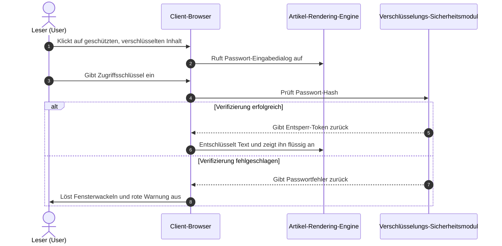

# Umfassender Leitfaden zu Static Site Generatoren (SSG) und Themen-Inhaltsformaten

In modernen Static Site Generatoren (SSG) und der Entwicklung unabhängiger Blog-Themes entscheidet die **Fähigkeit zur Analyse und Darstellung von Artikelinhaltsformaten** direkt über die Ausdrucksmöglichkeiten des Erstellers und das Leseerlebnis des Lesers.

Dieser Leitfaden kombiniert die Inhaltsspezifikationen gängiger SSG-Ökosysteme (**Hugo, Jekyll, Eleventy, Astro, Pelican, Hexo, WordPress, VitePress** usw.) und etabliert ein umfassendes System, das **grundlegendes Markup, erweiterte Dokumentsprachen, WordPress Post Formats, interaktive Dropdown-Umschalter, Akkordeon-Faltfunktionen, LaTeX-Mathematikformeln, Mermaid-Diagramme sowie spezielle Ver- und Entschlüsselungsfunktionen** abdeckt und sofort einsatzbereite Live-Rendering-Demonstrationen bietet.

---

## I. Unterstützung von Inhaltsformaten und Ökosystemübersicht gängiger Static Site Generatoren (SSG)

Verschiedene Static Site Generatoren verfolgen unterschiedliche Philosophien bei der Architektur ihrer Inhaltsanalyse. Die folgende Tabelle fasst systematisch die native und erweiterte Unterstützung verschiedener Formate durch die gängigsten Engines zusammen:

| Static Site Generator / Plattform | Kern-Parsing-Engine | Nativ unterstützte Formate | Erweiterte / Externe Tool-Unterstützung | Front Matter Serialisierungsunterstützung |
| :--- | :--- | :--- | :--- | :--- |
| **Hugo** | Goldmark (Go) | `.md` (CommonMark/GFM), `.html`, `.org` (Org-mode) | `.adoc` (Asciidoctor), `.rst` (rst2html), `.pdc` (Pandoc) | YAML (`---`), TOML (`+++`), JSON (`{}`) |
| **Astro (Architektur dieses Blogs)** | Vite + Unified/Remark + MDX | `.md` (GFM), `.mdx` (JSX), `.html`, `.astro` Komponenten | Erweiterung von Org/AsciiDoc/RST über montierbare AST Loader | YAML, TOML, JSON |
| **Jekyll** | Kramdown (Ruby) | `.md` (Kramdown/GFM), `.html` | `.textile` (Textile Plugin) | YAML |
| **Eleventy (11ty)** | JavaScript Template-Pipeline | `.md`, `.html`, `.liquid`, `.njk`, `.ejs`, `.webc` | MDX (Plugin), Benutzerdefinierte Template-Erweiterung | YAML, JSON, JS/11tydata |
| **Hexo** | Marked / Hexo-Renderer | `.md` (GFM), `.html`, EJS/Pug Templates | Org-mode / Pandoc (Plugin-Unterstützung) | YAML, JSON |
| **Pelican** | Python Docutils | `.md` (Markdown), `.rst` (reStructuredText) | `.asciidoc` (Asciidoctor) | YAML, Markdown Metadata |
| **WordPress (Headless/Theme)** | Gutenberg Block Engine | HTML5 Blocks, Shortcodes, Post Formats | Classic Editor HTML | JSON Block-Metadaten / Post Meta |
| **VitePress / Docusaurus** | Markdown-It / MDX | `.md`, `.mdx`, Vue/React Komponenten | Benutzerdefinierte Container-Syntax (`::: tip`) | YAML |

> [!NOTE]
> **Einblick in die Ökosystem-Architektur**: Hugo unterstützt Markdown und Org-mode nativ dank der hohen Parallelität von Go; während moderne Frontend-SSGs, repräsentiert durch **Astro**, mit ihren **MDX- und komponentenbasierten Islands-Fähigkeiten** die ultimative Flexibilität erreichen, dynamische interaktive UIs (wie die in diesem Artikel gezeigten Dropdown-Umschalter, Passwort-Popups, Schallplatten) nahtlos in den Haupttext einzubetten.

---

## II. Spezifikation zur Unterstützung von Front Matter Serialisierungsformaten

Die Metadaten (Front Matter) am Anfang eines Blogbeitrags bestimmen die Route, den Titel, die Zeit, die Kategorie, das Titelbild und den Schutzstatus des Artikels. Dieses Theme unterstützt alle gängigen Serialisierungsmodi:

### 1. YAML-Format (Am weitesten verbreitet, als Standard empfohlen)

```yaml
---
title: "Artikelüberschrift"
pubDate: 2026-08-28
author: "shijianus"
tags: ["Astro", "Markdown"]
featured: true
postFormat: "aside"
---
```

### 2. TOML-Format (Häufig in Hugo verwendet)

```toml
+++
title = "Artikelüberschrift"
pubDate = 2026-08-28T00:00:00Z
author = "shijianus"
tags = ["Astro", "Markdown"]
featured = true
+++
```

### 3. JSON-Format (API-gesteuerte und Headless-Szenarien)

```json
{
  "title": "Artikelüberschrift",
  "pubDate": "2026-08-28T00:00:00.000Z",
  "author": "shijianus",
  "tags": ["Astro", "Markdown"],
  "featured": true
}
```

---

## III. Vergleich und Migrationsreferenz für spezielle leichte Markup- und Nicht-Markdown-Formate

In verschiedenen Technologie-Stacks können Autoren neben Markdown auch andere leichte Auszeichnungssprachen verwenden. Im Folgenden werden die Syntaxmerkmale gängiger Formate und deren äquivalente Darstellung in diesem Theme aufgeführt:

### 1. AsciiDoc (.adoc / .asciidoc)

AsciiDoc ist häufig in technischen Büchern und langen technischen Handbüchern zu finden und verfügt über ein äußerst reichhaltiges System von Hinweisblöcken und Attributen:

```asciidoc
// AsciiDoc Quellcode-Syntax
= AsciiDoc Technische Spezifikation
:author: shijianus
:toc: macro

[NOTE]
====
Dies ist eine Notizkarte im AsciiDoc-Stil.
====

[cols="1,2,1", options="header"]
|===
| Modul | Beschreibung | Status
| Kern-Engine | Astro 6 Statische Pipeline | Bereit
|===
```

**Äquivalente Markdown / MDX Schreibweise in diesem Theme**:

> [!NOTE]
> Dies ist eine äquivalente Notizkarte, die nativ im Astro-Theme gerendert wird, wobei Stil und Interaktion vollständig übereinstimmen.

| Modul | Beschreibung | Status |
| :--- | :--- | :---: |
| **Kern-Engine** | Astro 6 Statische Pipeline | <span class="badge badge-success">Bereit</span> |

---

### 2. Emacs Org-Mode (.org)

Org-mode ist ein leistungsstarkes Werkzeug für Emacs-Benutzer zur Wissensverwaltung, Aufgabenverfolgung und Dokumentenerstellung:

```ini
#+TITLE: Emacs Org-Mode Praxisnotizen
#+DATE: 2026-08-28
#+TAGS: Emacs OrgMode

* TODO Phase Eins: Markdown-Scan-Verbesserung [1/2]
- [X] Tabellen- und Mobilgeräte-Überlauf beheben
- [ ] Org-mode Syntax-Konverter vervollständigen

#+BEGIN_QUOTE
„Org-mode ist nicht nur ein Format, sondern ein ausführbarer Denk-Workflow.“
#+END_QUOTE
```

**Standardmäßige statische GFM-Aufgabenlisten-Darstellung in diesem Thema (schreibgeschützt)**:

- [x] Tabellen- und Mobilgeräte-Überlauf beheben
- [ ] Org-mode Syntax-Konverter vervollständigen

> [!QUOTE]
> „Org-mode ist nicht nur ein Format, sondern ein ausführbarer Denk-Workflow.“

#### Interaktive Tutorial-Checkliste & verketteter Fortschritt (Interactive Tutorial Checklist & Chained Progression)

In technischen Tutorials, praktischen Übungen und Bereitstellungsanleitungen sind herkömmliche schreibgeschützte `[ ]` Aufgabenlisten nicht intuitiv interaktiv oder einprägsam. Dieses Thema bietet eine spezielle **interaktive Checkliste (`.article-task-tracker`), die Echtzeit-Häkchen und verknüpfte Statusaktualisierungen unterstützt**. Jedes Mal, wenn der Leser einen Punkt abhakt, berechnet der dynamische Fortschrittsbalken den Prozentsatz in Echtzeit neu, und wenn alle wichtigen Schritte bestätigt sind, werden **nachfolgende Bereitschaftsanweisungen automatisch freigeschaltet**, was sich hervorragend als Abschluss-Checkliste für Tutorials eignet:

<div class="article-task-tracker" data-storage-key="content-format-tutorial-demo">
  <div class="task-tracker__header">
    <div class="task-tracker__title">
      <svg width="20" height="20" viewBox="0 0 24 24" fill="none" stroke="currentColor" stroke-width="2"><path d="M9 11l3 3L22 4"/><path d="M21 12v7a2 2 0 0 1-2 2H5a2 2 0 0 1-2-2V5a2 2 0 0 1 2-2h11"/></svg>
      <span>Pre-Deployment-Checkliste für die technische Inbetriebnahme statischer Websites (interaktiv abhaken)</span>
    </div>
    <span class="task-tracker__count">1/4 Schritte abgeschlossen (25%)</span>
  </div>
  <div class="task-tracker__bar-wrap">
    <div class="task-tracker__fill" style="width: 25%;"></div>
  </div>
  <ul class="task-checklist">
    <li class="task-checklist-item is-done">
      <input type="checkbox" checked id="chk-step-1" />
      <div class="task-item-body">
        <label for="chk-step-1" class="task-item-label">Schritt 1: Vollständige lokale Code-Sicherung und Git Commit abschließen</label>
        <div class="task-item-desc">Bestätigen, dass der aktuelle Arbeitsbaum sauber ist, und den Backup-Hash im Entwicklungs-Audit-Log aufzeichnen.</div>
      </div>
    </li>
    <li class="task-checklist-item">
      <input type="checkbox" id="chk-step-2" />
      <div class="task-item-body">
        <label for="chk-step-2" class="task-item-label">Schritt 2: Cloudflare Pages statische Build-Pipeline konfigurieren</label>
        <div class="task-item-desc">BLOG_BUILD_TARGET=static und Node.js 20+ Laufzeitumgebung einrichten.</div>
      </div>
    </li>
    <li class="task-checklist-item">
      <input type="checkbox" id="chk-step-3" />
      <div class="task-item-body">
        <label for="chk-step-3" class="task-item-label">Schritt 3: Medienressourcen und externe Video-/Audio-Einbettungen überprüfen</label>
        <div class="task-item-desc">Sicherstellen, dass alle Audio- und Videodateien einzeln streng auf unter 25 MB begrenzt sind, um die CDN-Bereitstellungsspezifikationen zu erfüllen.</div>
      </div>
    </li>
    <li class="task-checklist-item">
      <input type="checkbox" id="chk-step-4" />
      <div class="task-item-body">
        <label for="chk-step-4" class="task-item-label">Schritt 4: Playwright automatisierte visuelle Regression und Smoke-Tests durchführen</label>
        <div class="task-item-desc">Überprüfen, ob alle Rich-Media-Karten und interaktiven Komponenten auf PC und Mobilgeräten bei verschiedenen Auflösungen korrekt angeordnet sind.</div>
      </div>
    </li>
  </ul>
  <div class="task-tracker__status-card is-pending">
    <div class="status-card__header">
      <span class="badge badge-warning">⏳ In Vorbereitung</span>
      <span style="font-weight:700;">Aktueller Fortschritt: 1/4 (25%)</span>
    </div>
    <p style="margin-top:0.4rem;margin-bottom:0;font-size:0.88rem;line-height:1.6;">Bitte schließen Sie jeden der oben angekreuzten Schritte in der Liste der Reihe nach ab; sobald alle Aufgaben erledigt sind, wird hier die Freigabeanweisung für die Produktion in Echtzeit freigeschaltet.</p>
  </div>
</div>

---

### 3. reStructuredText (.rst)

reStructuredText ist das Standard-Dokumentationsformat der Python-Community (z.B. Sphinx, ReadTheDocs):

```rst
.. reStructuredText Quellcode-Syntax
.. note::
   Dies ist ein Notizblock, definiert durch eine RST-Direktive.

.. code-block:: python
   :linenos:

   def greet(name: str) -> str:
       return f"Hello, {name}!"
```

**Markdown-Äquivalente Darstellung in diesem Thema**:

> [!NOTE]
> Dies ist eine äquivalente RST-Notizkarte, die in Astro gemäß der GitHub Alert-Spezifikation gerendert wird.

```python
def greet(name: str) -> str:
    return f"Hello, {name}!"
```

---

### 4. Textile-Syntax

Textile ist eine etablierte, leichtgewichtige Auszeichnungssprache (häufig in Redmine und frühen Jekyll-Blogs):

```markdown
h2. Kapitelüberschrift
bq. Dies ist der Inhalt eines Textile-Zitatblocks.
*Listeneintrag 1*
_kursiv hervorgehobener Text_
```

---

## IV. Vollständige Implementierung und visuelle Darstellung von WordPress-Post-Formaten

Der klassische **Post Formats**-Mechanismus im WordPress-Theme-Ökosystem ermöglicht es Blogs, spezifische visuelle Darstellungen für verschiedene Inhaltstypen zu zeigen. Wir haben alle 9 dieser Formate in der Hauptinhaltsspalte dieses Themas vollständig implementiert:

### 1. `aside` (Notiz / Memo / Gedankenkarte)

Geeignet zum Festhalten kurzer Gedankenblitze, Erinnerungen oder temporärer Notizen:

<div class="article-aside">
  <p><strong>💡 Notiz/Memo</strong>: Der wahre Wert statischer Websites liegt nicht in der Demonstration technischer Fähigkeiten, sondern in der Bereitstellung eines extrem schnellen, wartungsfreien und reinen Leseerlebnisses. Selbst nach fünf oder zehn Jahren lassen sich die generierten HTML-Dateien noch perfekt öffnen.</p>
</div>

---

### 2. `status` (Status-Update / Gedanken / Mikro-Zitat)

Eine sofortige Status-Update-Karte im Twitter-/Weibo-Stil, inklusive Autoren-Avatar, Client-Identifikator und Stimmungs-Tag:

<div class="article-status">
  <div class="article-status__header">
    <div class="article-status__user">
      
      <div>
        <div class="article-status__name">shijianus</div>
        <div class="article-status__meta">Veröffentlicht am 28.08.2026 14:32 · 🇨🇳 Hangzhou</div>
      </div>
    </div>
    <div class="article-status__badge">
      <span>📱 Von Geek Workshop Mac Studio</span>
    </div>
  </div>
  <p class="article-status__content">
    Heute habe ich endlich die vollständige Formaterweiterung und visuelle Neugestaltung der Hauptinhaltsspalte des Blogs abgeschlossen! Von KaTeX und Mermaid bis hin zu interaktiven Dropdowns und Schallplatten – das Gefühl der vollständigen statischen Bereitstellung ist fantastisch 🚀✨
  </p>
</div>

---

### 3. `quote` (Ausgewähltes Zitat / Großes Zitat)

Dient zur Präsentation bedeutsamer Zitate, Design-Maximen oder prägnanter Aussagen:

<div class="article-quote">
  <div class="article-quote__icon">“</div>
  <div class="article-quote__body">
    Simplicity is prerequisite for reliability. (Einfachheit ist die Voraussetzung für Zuverlässigkeit.)
  </div>
  <div class="article-quote__author">
    
    <div class="article-quote__author-info">
      <div class="article-quote__author-name">Edsger W. Dijkstra</div>
      <div class="article-quote__author-title">Informatiker · Turing-Preisträger (1972)</div>
    </div>
  </div>
</div>

---

### 4. `gallery` (Bildergalerie / Adaptives Album und Polaroid-Raster)

Unterstützt mehrspaltige, adaptive, responsive Raster und Polaroid-Karten mit einem Hauch von Menschlichkeit. Jedes Bild kann durch Anklicken in einer Vollbild-Lightbox vergrößert werden:

#### 2- und 3-spaltige adaptive Galerie

<div class="article-gallery">
  <div class="gallery-grid gallery-grid-3">
    <div class="gallery-item">
      
      <div class="gallery-item__caption">Panorama des Geek-Arbeitsplatzes</div>
    </div>
    <div class="gallery-item">
      
      <div class="gallery-item__caption">Großer Bildschirm für Systemarchitekturdesign</div>
    </div>
    <div class="gallery-item">
      
      <div class="gallery-item__caption">Visuelles Cover für Sternenwanderung</div>
    </div>
  </div>
</div>

#### Polaroid-Galerie (Polaroid Style)

<div class="gallery-polaroid">
  <div class="polaroid-card">
    
    <div class="polaroid-card__caption">2026.04 Hangzhou · F&E-Basis</div>
  </div>
  <div class="polaroid-card">
    
    <div class="polaroid-card__caption">2026.08 Nacht der Architektur-Evolution und Refaktorierung</div>
  </div>
</div>

---

### 5. `video` (Adaptive Videoplayer-Karte)

Unterstützt ein responsives 16:9-Verhältnis, abgerundete Ecken und eine Fußzeilenbeschreibung, wobei jedes Video eine volle Zeile einnimmt. Kompatibel mit externen Proxy-Einbettungen von Bilibili und YouTube sowie nativen MP4-Dateien auf der Website (einzelne Dateien sind auf 25 MB begrenzt, um die statischen Bereitstellungsrichtlinien von Cloudflare Pages zu erfüllen):

#### Externe Videoeinbettung (Bilibili & YouTube Link-Proxy-Einbettung · Standardmäßig muss der Leser hierher scrollen und auf Wiedergabe klicken)

<div class="video-embed-card" data-video-type="bilibili">
  <iframe src="https://player.bilibili.com/player.html?bvid=BV11k4y1T7kS&page=1&high_quality=1&danmaku=0&autoplay=0" allowfullscreen="true" loading="lazy" allow="accelerometer; autoplay; clipboard-write; encrypted-media; gyroscope; picture-in-picture; web-share" sandbox="allow-top-navigation-by-user-activation allow-same-origin allow-forms allow-scripts allow-popups"></iframe>
  <div class="embed-caption">🎬 Bilibili externe Einbettungsdemo: BV11k4y1T7kS (1080P HD · Hierher scrollen und auf Wiedergabe klicken)</div>
</div>

<div class="video-embed-card" data-video-type="youtube">
  <iframe src="https://www.youtube-nocookie.com/embed/LXb3EKWsInQ?autoplay=0&rel=0" allowfullscreen="true" loading="lazy" allow="accelerometer; autoplay; clipboard-write; encrypted-media; gyroscope; picture-in-picture; web-share"></iframe>
  <div class="embed-caption">🎬 YouTube externe Einbettungsdemo: Costa Rica 4K 60fps HDR Demo (1080P/4K · Gültige URL · Hierher scrollen und auf Wiedergabe klicken)</div>
</div>

#### Native MP4-Videoeinbettung auf der Website (Nativer HTML5-Videoplayer · Unterstützt Wiedergabegeschwindigkeit und Bild-in-Bild · Download standardmäßig deaktiviert)

<div class="video-embed-card">
  <video controls controlsList="nodownload" preload="metadata" playsinline oncontextmenu="return false;">
    <source src="/media/video/landscape_compressed.mp4" type="video/mp4" />
    Ihr Browser unterstützt HTML5-Videowiedergabe nicht.
  </video>
  <div class="embed-caption">🎥 Lokales natives eingebettetes Video 1: 4K/1080P Ultra-HD-Landschaftsdemo (Größe 21.7MB · Unterstützt Wiedergabegeschwindigkeit und Bild-in-Bild · Direkter Download deaktiviert)</div>
</div>

<div class="video-embed-card">
  <video controls controlsList="nodownload" preload="metadata" playsinline oncontextmenu="return false;">
    <source src="/media/video/blue_archive_miracle.mp4" type="video/mp4" />
    Ihr Browser unterstützt HTML5-Videowiedergabe nicht.
  </video>
  <div class="embed-caption">🎥 Lokales natives eingebettetes Video 2: [Blue Archive] "Der Anfang und das Ende eines Wunders – Unsere Geschichte bestimmen wir selbst!" (Größe 23.3MB · Unterstützt Wiedergabegeschwindigkeit und Bild-in-Bild · Direkter Download deaktiviert)</div>
</div>

---

### 6. `audio` (Vinyl-Schallplatten-Musikkarte mit Rotation)

Integriert einen HTML5-Audiocontroller und löst bei der Wiedergabe automatisch einen **stufenlosen, sanften Rotationseffekt einer Vinyl-Schallplatte** aus. Alle Plattencover verwenden originalgetreue, offizielle HD-Albumcover, unterstützen verschiedene gängige Audioformate (verlustfreies FLAC, hochbitratiges MP3, AAC/M4A) und verfügen über einen integrierten Schutz gegen Web-Scraping und Downloads:

#### ① Shaun - Way Back Home (FLAC verlustfreies Audioformat · 24.55MB)

<div class="article-audio-card">
  <div class="audio-card__cover">
    
  </div>
  <div class="audio-card__info">
    <div class="audio-card__title">
      <span>Way Back Home</span>
      <span class="badge badge-purple">FLAC Lossless</span>
    </div>
    <div class="audio-card__author">Shaun (숀) · Verlustfreies Audio (FLAC / 44.1kHz 16-bit 961 kbps)</div>
    <audio controls preload="metadata" controlsList="nodownload" oncontextmenu="return false;" src="/media/audio/WayBackHome.flac"></audio>
  </div>
</div>

#### ② ヨルシカ (Yorushika) - 彼女は旅に出る (MP3 320Kbps HD-Format · 8.41MB)

<div class="article-audio-card">
  <div class="audio-card__cover">
    
  </div>
  <div class="audio-card__info">
    <div class="audio-card__title">
      <span>彼女は旅に出る (She Leaves on a Journey)</span>
      <span class="badge badge-success">320 Kbps MP3</span>
    </div>
    <div class="audio-card__author">ヨルシカ (Yorushika) · HD-Stereo (MP3 / 48kHz 320 kbps)</div>
    <audio controls preload="metadata" controlsList="nodownload" oncontextmenu="return false;" src="/media/audio/彼女は旅に出る.mp3"></audio>
  </div>
</div>

#### ③ すこっぷ feat. 初音ミク - アイロニ (M4A / AAC Format · 7.63MB)

<div class="article-audio-card">
  <div class="audio-card__cover">
    
  </div>
  <div class="audio-card__info">
    <div class="audio-card__title">
      <span>アイロニ (Irony / Ironie)</span>
      <span class="badge badge-cyan">M4A / AAC</span>
    </div>
    <div class="audio-card__author">すこっぷ feat. 初音ミク · AAC Audio (M4A / 44.1kHz 260 kbps)</div>
    <audio controls preload="metadata" controlsList="nodownload" oncontextmenu="return false;" src="/media/audio/アイロニ.m4a"></audio>
  </div>
</div>

---

### 7. `link` (Externe Links und Lesezeichen-Vorschaukarten / Bookmark Preview)

Bietet eine elegante kartenbasierte Vorschau für wichtige Referenzen im Artikel:

<a class="article-bookmark" href="https://github.com/shijianus/shijianus-blog" target="_blank" rel="noopener">
  <div class="article-bookmark__content">
    <div class="article-bookmark__title">EpoCanvas / shijianus-blog (Kernspezifikations-Repository für das Zeit-Blog-Theme)</div>
    <p class="article-bookmark__desc">EpoCanvas (Zeit-Leinwand) ist ein modernes Geek-Blog-Content-Architektursystem, das sich auf die Präsentation von Informationen mit hoher Dichte, elegante Mikrointeraktionen und die Unterstützung aller Formate konzentriert.</p>
    <div class="article-bookmark__site">
      <span class="badge badge-primary">GitHub</span>
      <span>github.com · EpoCanvas Core Spec</span>
    </div>
  </div>
  <div class="article-bookmark__icon">
    <svg viewBox="0 0 24 24" width="24" height="24" fill="none" stroke="currentColor" stroke-width="2" stroke-linecap="round" stroke-linejoin="round"><path d="M18 13v6a2 2 0 0 1-2 2H5a2 2 0 0 1-2-2V8a2 2 0 0 1 2-2h6"/><polyline points="15 3 21 3 21 9"/><line x1="10" y1="14" x2="21" y2="3"/></svg>
  </div>
</a>

### 8. `chat` (Chat-Sprechblasen-Dialogfluss / Organischer animierter Dialogfluss)

Zur lebendigen Darstellung von technischen Präsentationen, Diskussionen zu zweit oder Benutzerszenarien, unterstützt linke und rechte Sprechblasen, Inline-Code, benutzerdefinierte Farbgebung sowie **dynamische, inhaltsadaptive Tippanimationen, Web Audio Synthesizer-Soundeffekte und dynamische Avatare (`footer_mini_logo__media`)**:
*   **Statischer Modus (Standard)**: `<div class="article-chat">` bleibt leichtgewichtig und rein statisch, null JS-Overhead;
*   **Dynamische Präsentation aktivieren (Parametersteuerung)**: Konfigurieren Sie `data-animate="true"` (oder `class="article-chat is-animated"`), das System löst automatisch eine realistische, zeitgesteuerte Tippanimation, basierend auf Zeichenlänge und natürlicher Zufälligkeit, sowie spezifische Hinweistöne für linke und rechte Sprechblasen aus, sobald der Leser zum ersten Mal in den Viewport scrollt;
*   **Nicht-mechanische dynamische Zeitsteuerung (Content-Length Aware Timing)**: Das System bestimmt intelligent die Dauer des Tippindikators basierend auf der Länge der Aussage (kurze Sätze blinken 380ms, lange technische Abschnitte 1000ms+ Tipp-Denkpause) und fügt natürliche Pausen und leichte Frequenzschwankungen der Soundeffekte zwischen den Sprechblasen ein, die dem menschlichen Leseverhalten entsprechen;
*   **Unterstützung für dynamische Video-Avatare (`footer_mini_logo__media`)**: Avatare unterstützen das Einbetten von MP4-Mikrovideo-Animationen und statischen Fallback-Postern;
*   **Einmalige Auslösung und Neulade-Garantie**: Nach der ersten Auslösung durch Scrollen wird es automatisch gesperrt, wiederholtes Scrollen löst es später nicht erneut aus und stört das Lesen nicht; es wird nur dann wieder bereit, wenn der Benutzer die Webseite (F5) neu lädt; gleichzeitig wird eine Mikro-Steuerleiste oben rechts mit „↺ Wiederholen“ und „🔊/🔇 Soundeffekt umschalten“ bereitgestellt.

<div class="article-chat" data-animate="true" data-sound="true">
  <div class="chat-message chat-left">
    <span class="chat-avatar footer_mini_logo__media">
      <video autoplay muted loop playsinline preload="metadata" poster="/media/shijianus/avatar.jpg" aria-hidden="true">
        <source src="/media/shijianus/avatar-dynamic.mp4" type="video/mp4" />
      </video>
      
    </span>
    <div class="chat-body">
      <div class="chat-author">Entwickler <a href="https://github.com/LeonBoven" target="_blank" rel="noopener noreferrer">Léon Boven</a> · 10:15</div>
      <div class="chat-bubble">
        Hallo! Würde die Implementierung der statischen Darstellung von <code>KaTeX</code> und <code>Mermaid</code> in Astro die Ladezeit der Frontend-Seite verlangsamen?
      </div>
    </div>
  </div>

  <div class="chat-message chat-right">
    
    <div class="chat-body">
      <div class="chat-author">Architekt <a href="https://github.com/shijianus" target="_blank" rel="noopener noreferrer">shijianus</a> · 10:16</div>
      <div class="chat-bubble">
        Überhaupt nicht! Da <code>remark-math</code> und <code>rehype-katex</code> die Formeln bereits während der Build-Phase (Build-time) in reine HTML/MathML-Strings kompiliert haben, gibt es auf der Browserseite <strong>keine JS-Laufzeitbelastung</strong>; und Mermaid-Diagramme werden ebenfalls dynamisch und asynchron als ESM-Module bei Bedarf geladen, was die erste Bildschirmansicht extrem schnell macht! ⚡
      </div>
    </div>
  </div>

  <div class="chat-message chat-left">
    <span class="chat-avatar footer_mini_logo__media">
      <video autoplay muted loop playsinline preload="metadata" poster="/media/shijianus/avatar.jpg" aria-hidden="true">
        <source src="/media/shijianus/avatar-dynamic.mp4" type="video/mp4" />
      </video>
      
    </span>
    <div class="chat-body">
      <div class="chat-author">Entwickler <a href="https://github.com/LeonBoven" target="_blank" rel="noopener noreferrer">Léon Boven</a> · 10:17</div>
      <div class="chat-bubble">
        Großartig! Das bedeutet, dass wir Architektur-Sequenzdiagramme und interaktive Einheitenumrechner direkt in Markdown schreiben können und sie sofort einsatzbereit sind, richtig?
      </div>
    </div>
  </div>

  <div class="chat-message chat-right">
    
    <div class="chat-body">
      <div class="chat-author">Architekt <a href="https://github.com/shijianus" target="_blank" rel="noopener noreferrer">shijianus</a> · 10:18</div>
      <div class="chat-bubble">
        Genau! Nicht nur Doppelklick-Zoom und hochauflösender SVG-Export sind vollständig integriert, der Einheitenumrechner ist sogar mit <strong>Echtzeit-Online-Wechselkurs-Synchronisation</strong> und <strong>Dropdown-Umschaltung der Basiseinheiten</strong> verbunden, und gewährleistet eine vollständige symmetrische Darstellung fester Qualitätseinheiten. Alle Messungen wurden streng getestet! 🚀
      </div>
    </div>
  </div>

  <div class="chat-message chat-left">
    <span class="chat-avatar footer_mini_logo__media">
      <video autoplay muted loop playsinline preload="metadata" poster="/media/shijianus/avatar.jpg" aria-hidden="true">
        <source src="/media/shijianus/avatar-dynamic.mp4" type="video/mp4" />
      </video>
      
    </span>
    <div class="chat-body">
      <div class="chat-author">Entwickler <a href="https://github.com/LeonBoven" target="_blank" rel="noopener noreferrer">Léon Boven</a> · 10:19</div>
      <div class="chat-bubble">
        Verstanden! Dieses interaktive Gefühl und die Tippanimation, die sich an die Länge der Nachricht anpasst, sind sehr natürlich. Ich werde die technische Dokumentationsbibliothek des Teams sofort aktualisieren! 🎉
      </div>
    </div>
  </div>

  <div class="chat-message chat-right">
    
    <div class="chat-body">
      <div class="chat-author">Architekt <a href="https://github.com/shijianus" target="_blank" rel="noopener noreferrer">shijianus</a> · 10:20</div>
      <div class="chat-bubble">
        Viel Spaß beim Ausprobieren! Sollten Sie später auf Formatierungserweiterungen oder Anpassungswünsche stoßen, können Sie diese jederzeit im Diskussionsbereich oder auf GitHub besprechen~ ✨
      </div>
    </div>
  </div>
</div>

---

## V. Spezielle Dropdown-Formate und dynamische interaktive Komponenten (Dropdown Selectors & Interactive Formats)

Für die vom Benutzer explizit angeforderten **speziellen Dropdown-Formate** stellen wir auf der Ebene des Artikeltextes clientseitige, sofort reagierende Dropdown-Selektor-Komponenten bereit:

### 1. Dropdown-Umschalter für mehrere Frameworks und Code-Versionen (Interactive Dropdown Switcher)

Leser können im Dropdown-Menü frei ein technisches Framework auswählen, und das Haupttextfeld wechselt den entsprechenden Inhalt und Code in Echtzeit und ohne Neuladen der Seite:

<div class="article-dropdown-switcher">
  <div class="article-dropdown-switcher__header">
    <div class="article-dropdown-switcher__title">
      <svg width="20" height="20" viewBox="0 0 24 24" fill="none" stroke="currentColor" stroke-width="2"><rect x="3" y="3" width="18" height="18" rx="2"/><path d="M9 3v18"/><path d="m14 9 3 3-3 3"/></svg>
      <span>Bitte wählen Sie den Implementierungscode des Frontend-Frameworks aus, den Sie anzeigen möchten:</span>
    </div>
    <select class="article-select dropdown-switcher__select">
      <option value="react-tab">⚛️ React 19 (Hooks & TSX)</option>
      <option value="vue-tab">🟢 Vue 3.5 (Composition API)</option>
      <option value="astro-tab">🚀 Astro 6 (Island Component)</option>
      <option value="svelte-tab">🟠 Svelte 5 (Runes)</option>
    </select>
  </div>
  <div class="article-dropdown-switcher__body">
    <div class="article-dropdown-panel is-active" data-panel="react-tab">
      <div class="article-dropdown-panel__title">⚛️ React 19 Implementierung der Komponente:</div>
      <pre class="no-code-enhance"><code class="language-tsx">import { useState } from 'react';
export function Counter() {
  const [count, setCount] = useState(0);
  return (
    &lt;button onClick={() =&gt; setCount((c) =&gt; c + 1)} className="btn-primary"&gt;
      React Klickzähler: &#123;count&#125;
    &lt;/button&gt;
  );
}</code></pre>
    </div>
    <div class="article-dropdown-panel" data-panel="vue-tab">
      <div class="article-dropdown-panel__title">🟢 Vue 3.5 Implementierung der Einzeldateikomponente:</div>
      <pre class="no-code-enhance"><code class="language-html">&lt;script setup lang="ts"&gt;
import { ref } from 'vue';
const count = ref(0);
&lt;/script&gt;
&lt;template&gt;
  &lt;button @click="count++" class="btn-primary"&gt;
    Vue Klickzähler: &#123;&#123; count &#125;&#125;
  &lt;/button&gt;
&lt;/template&gt;</code></pre>
    </div>
    <div class="article-dropdown-panel" data-panel="astro-tab">
      <div class="article-dropdown-panel__title">🚀 Astro 6 Implementierung der statischen Komponente ohne JS:</div>
      <pre class="no-code-enhance"><code class="language-astro">---
const { title = "Astro Speed Islands" } = Astro.props;
---
&lt;div class="astro-island"&gt;
  &lt;h3&gt;&#123;title&#125;&lt;/h3&gt;
  &lt;p&gt;Standardmäßig 0KB JavaScript, Interaktivität bei Bedarf hydriert!&lt;/p&gt;
&lt;/div&gt;</code></pre>
    </div>
    <div class="article-dropdown-panel" data-panel="svelte-tab">
      <div class="article-dropdown-panel__title">🟠 Svelte 5 Runes Implementierung:</div>
      <pre class="no-code-enhance"><code class="language-svelte">&lt;script lang="ts"&gt;
  let count = $state(0);
&lt;/script&gt;
&lt;button onclick={() =&gt; count++} class="btn-primary"&gt;
  Svelte Klickzähler: &#123;count&#125;
&lt;/button&gt;</code></pre>
    </div>
  </div>
</div>

---

### 2. Interaktiver universeller Einheitenumrechner für mehrere Kategorien (Universal Interactive Unit Converter · Basis-Dropdown-Umschaltung und Echtzeit-Wechselkurse)

Unterstützt Benutzer bei der freien Eingabe **beliebiger Basiswerte** in das Eingabefeld (Standardwert ist `1`, unterstützt Schrittregler zum Erhöhen/Verringern und eine Ein-Klick-Zurücksetzung) und nahtlose Sofortumrechnung zwischen verschiedenen Kategorien (Masse/Gewicht, internationale Wechselkurse, Datenspeicher, Netzwerkbandbreite, Länge/Abmessungen):
* **Dynamisch umschaltbare Umrechnungsbasis (Base Unit Dropdown)**: Die Basiseinheit rechts neben dem Eingabefeld kann über ein Dropdown-Menü frei gewählt werden (z.B. bei Masse: `kg`, `g`, `lb`, `斤`, `oz`, `t` usw.; bei Wechselkursen: `USD`, `HKD`, `CNY`, `EUR`, `JPY`, `GBP` usw.). Nach Auswahl einer Basiseinheit schließt das Zielumrechnungsraster die aktuelle Basiseinheit intelligent automatisch aus (verhindert vollständig redundante 1kg=1kg-Karten) und berechnet alle Zieleinheiten sofort neu, wobei die aktuelle Basis als Nenner verwendet wird;
* **Echtzeit-Wechselkursschwankungen über Netzwerkanbindung (Live Forex API)**: Beim Umschalten auf „💱 Internationale Wechselkurse“ fordert das System automatisch asynchron den `/api/exchange-rate`-Dienst des Servers an und greift auf eine öffentliche Echtzeit-Wechselkurs-API zurück, um die neuesten Echtzeitkurse der wichtigsten Währungen zu erhalten (oben rechts wird `🟢 Echtzeit-Online-Wechselkurse synchronisiert` angezeigt); bei fehlender oder unterbrochener Internetverbindung wird nahtlos auf die integrierten Basisverhältnisse zurückgegriffen (angezeigt wird `⚪ Offline-Basis-Wechselkurse`), um sicherzustellen, dass „Echtzeit“ wirklich in Echtzeit ist und das Offline-Erlebnis felsenfest bleibt;
* **Bequemer Aufruf über universelle API**: Das System stellt gleichzeitig die Hilfsfunktion `window.shijianusAPI.fetchExchangeRates(base)` global zur Verfügung, um jedem benutzerdefinierten Skript innerhalb des Dokuments den sofortigen Abruf von Echtzeit-Kursdaten zu ermöglichen;
* **Schnelles Ein-Klick-Kopieren und Gleichungsableitung**: Jede Umrechnungskarte bietet eine Ein-Klick-Kopierfunktion mit visueller Rückmeldung, und unten wird synchron eine Zusammenfassung der dynamischen Gleichungskettenableitung angezeigt.

<div class="interactive-unit-converter" data-default="1" data-title="🔄 Interaktiver universeller Einheitenumrechner (unterstützt Basis-Einheitenumschaltung und Echtzeit-Wechselkurse)"></div>

---

### 3. Dropdown-Rechner für Spezifikationen und Videocodierung (Interactive Spec Calc Dropdown)

Beim Auswählen verschiedener Optionen werden die entsprechenden technischen Indikatoren und Umrechnungserklärungen auf der rechten Seite in Echtzeit angezeigt:

<div class="interactive-calc-select">
  <div class="article-select-box">
    <label>
      <svg width="18" height="18" viewBox="0 0 24 24" fill="none" stroke="currentColor" stroke-width="2"><circle cx="12" cy="12" r="10"/><path d="M12 6v6l4 2"/></svg>
      <span>Video-Kodierungsauflösung auswählen:</span>
    </label>
    <select class="article-select">
      <option value="1080p" data-desc="1920 × 1080 @ 60fps · Bitrate 6.000 Kbps · Empfohlene Bandbreite 15 Mbps">1080P Full HD (1080p60)</option>
      <option value="2k" data-desc="2560 × 1440 @ 60fps · Bitrate 12.000 Kbps · Empfohlene Bandbreite 30 Mbps">2K Ultra HD (1440p60)</option>
      <option value="4k" data-desc="3840 × 2160 @ 60fps · Bitrate 25.000 Kbps · Empfohlene Bandbreite 60 Mbps">4K Ultra HD (2160p60 HDR)</option>
      <option value="8k" data-desc="7680 × 4320 @ 60fps · Bitrate 80.000 Kbps · Empfohlene Bandbreite 200 Mbps">8K Kinoqualität (4320p60 AV1)</option>
    </select>
  </div>
  <div class="calc-output-box">
    <span>📊 <strong>Ergebnis der technischen Spezifikationsberechnung</strong>:</span>
    <span class="calc-output-value">1920 × 1080 @ 60fps · Bitrate 6.000 Kbps · Empfohlene Bandbreite 15 Mbps</span>
  </div>
</div>

---

## VI. Akkordeon-Faltung, Tabs und mehrspaltiges Layout (Collapsibles, Tabs & Columns)

### 1. Exklusive Akkordeon-Faltgruppe (Beim Öffnen eines Elements werden die anderen automatisch geschlossen)

Konfigurieren Sie `data-single="true"`. Wenn Sie ein Element erweitern, werden andere erweiterte Elemente in derselben Gruppe automatisch geschlossen, um die Seite übersichtlich und fokussiert zu halten:

<div class="article-accordion-group" data-single="true">
  <details class="article-accordion" open>
    <summary>
      <span>🔒 1. Sicherheitsvorteile statischer Websites</span>
      <svg class="accordion-chevron" viewBox="0 0 24 24" fill="none" stroke="currentColor" stroke-width="2"><polyline points="9 18 15 12 9 6"/></svg>
    </summary>
    <div class="accordion-content">
      <p>Statische Websites verfügen nicht über traditionelle PHP/Node.js dynamische Ausführungs-Engines und öffentlich zugängliche SQL-Datenbanken, wodurch sie physisch immun gegen SQL-Injection und Remote Code Execution (RCE) Risiken auf dem Server sind.</p>
    </div>
  </details>

  <details class="article-accordion">
    <summary>
      <span>⚡ 2. Globale CDN-Edge-Beschleunigung der Bereitstellung</span>
      <svg class="accordion-chevron" viewBox="0 0 24 24" fill="none" stroke="currentColor" stroke-width="2"><polyline points="9 18 15 12 9 6"/></svg>
    </summary>
    <div class="accordion-content">
      <p>Durch die Bereitstellung der kompilierten Artefakte auf Cloudflare Pages oder GitHub Pages können alle statischen Ressourcen auf über 300 Edge-Knoten weltweit zwischengespeichert werden, wobei die Time to First Byte (TTFB) in der Regel unter 20 ms liegt.</p>
    </div>
  </details>

  <details class="article-accordion">
    <summary>
      <span>💰 3. Extrem niedrige Hosting-Kosten für Cloud-Dienste</span>
      <svg class="accordion-chevron" viewBox="0 0 24 24" fill="none" stroke="currentColor" stroke-width="2"><polyline points="9 18 15 12 9 6"/></svg>
    </summary>
    <div class="accordion-content">
      <p>Statische Websites erfordern keine rund um die Uhr laufenden teuren VPS-Cloud-Server. In Kombination mit der kostenlosen Cloudflare D1-Datenbank und einem Serverless-Kommentarsystem sind die täglichen Betriebskosten nahezu null.</p>
    </div>
  </details>
</div>

---

### 2. Nicht-exklusive, unabhängige Akkordeon-Faltgruppe (Mehrere Elemente können gleichzeitig geöffnet werden)

Konfigurieren Sie `data-single="false"` (oder den Standard-Mehrfachöffnungsmodus). Leser können mehrere oder alle Faltabschnitte frei erweitern, um sie quer zu vergleichen und tiefer zu lesen, ohne dass bereits geöffnete Inhalte durch das Öffnen neuer Elemente geschlossen werden:

<div class="article-accordion-group" data-single="false">
  <details class="article-accordion" open>
    <summary>
      <span>🛠️ Architekturmodul A: Markdown AST Syntax-Compiler-Pipeline</span>
      <svg class="accordion-chevron" viewBox="0 0 24 24" fill="none" stroke="currentColor" stroke-width="2"><polyline points="9 18 15 12 9 6"/></svg>
    </summary>
    <div class="accordion-content">
      <p>Basierend auf der Unified-, Remark-math- und Rehype-katex-Architektur wird der Markdown-Syntaxbaum während der Kompilierungsphase vollständig statisch in standardmäßige semantische HTML-Knoten umgewandelt, und die Hervorhebung sowie Formelgenerierung werden auf der Node.js-Seite abgeschlossen.</p>
    </div>
  </details>

  <details class="article-accordion" open>
    <summary>
      <span>🎨 Architekturmodul B: EpoCanvas Dynamische Visual-Engine und Responsive System</span>
      <svg class="accordion-chevron" viewBox="0 0 24 24" fill="none" stroke="currentColor" stroke-width="2"><polyline points="9 18 15 12 9 6"/></svg>
    </summary>
    <div class="accordion-content">
      <p>Bietet Aurora-Hintergrund, Sternenfeld-Parallaxe, Glasmorphismus und Multi-Device-Responsive-Breakpoint-Anpassung, um ein konsistentes ästhetisches Erlebnis sowohl auf 4K-Breitbildschirmen als auch auf faltbaren Smartphones zu gewährleisten.</p>
    </div>
  </details>

  <details class="article-accordion">
    <summary>
      <span>🛡️ Architekturmodul C: WebCrypto SHA-256 Gestuftes Sicherheitsisolationssystem</span>
      <svg class="accordion-chevron" viewBox="0 0 24 24" fill="none" stroke="currentColor" stroke-width="2"><polyline points="9 18 15 12 9 6"/></svg>
    </summary>
    <div class="accordion-content">
      <p>Integriert eine 1-stufige persistente Sitzungsentsperrung, eine 2-stufige dynamische polymorphe Sichtschutzmaske (Gaußscher Weichzeichner/Mosaik/Spoiler-Maske), eine 3-stufige Viewport-Sentinel-Sperre bei Verlassen und ein externes URL-Fragmentverschlüsselungsschema, um die Offenlegung von Klartextpasswörtern im DOM vollständig zu verhindern.</p>
    </div>
  </details>
</div>

---

### 3. Interaktive Tabs

<div class="article-tabs">
  <div class="article-tabs__nav">
    <button class="article-tabs__button is-active" type="button">pnpm</button>
    <button class="article-tabs__button" type="button">npm</button>
    <button class="article-tabs__button" type="button">yarn</button>
    <button class="article-tabs__button" type="button">bun</button>
  </div>
  <div class="article-tabs__panels">
    <div class="article-tabs__panel is-active">
      <pre class="no-code-enhance"><code class="language-bash">pnpm add @astrojs/mdx remark-math rehype-katex katex mermaid</code></pre>
    </div>
    <div class="article-tabs__panel">
      <pre class="no-code-enhance"><code class="language-bash">npm install @astrojs/mdx remark-math rehype-katex katex mermaid</code></pre>
    </div>
    <div class="article-tabs__panel">
      <pre class="no-code-enhance"><code class="language-bash">yarn add @astrojs/mdx remark-math rehype-katex katex mermaid</code></pre>
    </div>
    <div class="article-tabs__panel">
      <pre class="no-code-enhance"><code class="language-bash">bun add @astrojs/mdx remark-math rehype-katex katex mermaid</code></pre>
    </div>
  </div>
</div>

---

### 4. Mehrspaltiges Rasterlayout-System (Multi-Column Grid)

#### 3 Spalten gleichbreites Kartenraster

<div class="article-grid article-grid-3">
  <div class="article-col-card">
    <h4>🎨 Visuelles System</h4>
    <p>Tiefgreifende Übernahme der modernen Geek-Designästhetik von EpoCanvas, unterstützt hohe Hell-Dunkel-Kontraste, Milchglas-Hintergründe und sanfte Farbübergänge.</p>
  </div>
  <div class="article-col-card">
    <h4>⚡ Performance-Engineering</h4>
    <p>Astro 6 statische Inselarchitektur, HTML-Vorrendering zur Build-Zeit, rein statische, ultimative SEO-Optimierung.</p>
  </div>
  <div class="article-col-card">
    <h4>🛠️ Erweiterbares Ökosystem</h4>
    <p>Umfassende Unterstützung für KaTeX-Formeln, Mermaid-Diagramme, verschlüsselte Pop-ups und 9 Post-Formate.</p>
  </div>
</div>

#### 1:2 Ungleiches Seitenleistenraster

<div class="article-grid article-columns-1-2">
  <div class="article-col-card">
    <h4>📌 Architektonische Positionierung</h4>
    <p>Fokus auf ein modernes Medium für technisches Schreiben für Geeks und Ingenieure.</p>
  </div>
  <div class="article-col-card">
    <h4>🚀 Liefergarantie</h4>
    <p>Integrierte, umfassende automatisierte Smoke-Tests und statische Build-Validierungsmechanismen stellen sicher, dass Formeln, Diagramme und komplexe Karten auf allen Geräten perfekt dargestellt werden.</p>
  </div>
</div>

---

## VII. 13 semantische Hinweisfelder (Admonitions / GitHub Alerts)

Basierend auf den Designrichtlinien von GitHub Alert und EpoCanvas werden 13 farbige Karten mit unterschiedlicher Semantik unterstützt, und die Syntax `[!TYPE]-` ermöglicht das standardmäßige Einklappen:

> [!NOTE]
> **Regulärer Hinweis (Note)**: Dies ist eine Standard-Hintergrundinformation oder Kontextbeschreibung.

> [!TIP]
> **Praktischer Tipp (Tip)**: Verwenden Sie die Tastenkombination <kbd>Strg</kbd> + <kbd>K</kbd>, um schnell das globale Artikelsuchfeld aufzurufen!

> [!IMPORTANT]
> **Wichtiger Hinweis (Important)**: Stellen Sie vor der Bereitstellung in der Produktionsumgebung sicher, dass die Umgebungsvariable `BLOG_BUILD_TARGET=static` korrekt injiziert wurde.

> [!WARNING]
> **Risikowarnung (Warning)**: Übermitteln Sie keine Produktionsdatenbank-Schlüssel oder private Cloud-Dienstschlüssel in öffentlichen Git-Repositories.

> [!CAUTION]
> **Gefahrenhinweis (Caution)**: Das Ausführen von Tabellenrekonstruktionsoperationen ist destruktiv; sichern Sie zuerst die D1-Datenbank!

> [!DANGER]
> **Tödliche Gefahr (Danger)**: Das direkte Löschen der Produktionsdatenbank führt zum dauerhaften Verlust aller Kommentare und Benutzerdaten.

> [!SUCCESS]
> **Operation erfolgreich (Success)**: Der statische Build-Prozess wurde erfolgreich abgeschlossen, alle 47 statischen Routen sind bereit!

> [!QUESTION]
> **Problemdiskussion (Question)**: Wie lässt sich eine millisekundenschnelle, rein clientseitige Volltextsuche in einer Umgebung ohne Serverabhängigkeiten realisieren?

> [!QUOTE]
> **Ausgewähltes Zitat (Quote)**: „Guter Code kann nicht nur von Maschinen ausgeführt werden, sondern vermittelt Gedanken auch elegant wie Poesie an Menschen.“

> [!INFO]
> **Detaillierte Informationen (Info)**: Dieser Blog basiert auf Astro 6 und Tailwind 4 und ist vollständig statisch exportiert.

> [!TODO]
> **To-Do-Plan (Todo)**: Es ist geplant, in der nächsten Iteration einen WebAssembly-Client-Volltextsuchindex einzuführen.

> [!BUG]
> **Fehlerprotokoll (Bug)**: Ein Layoutproblem, bei dem Tabellen in extrem schmalen Bildschirmen horizontal abgeschnitten wurden, wurde in der alten Version behoben.

> [!EXAMPLE]
> **Beispielerklärung (Example)**: Alle oben genannten Hinweisfelder passen sich automatisch an hochkontrastreiche Farben im Dunkel- und Hellmodus an.

### Demonstration einklappbarer Hinweisfelder

> [!TIP]- Zum Erweitern klicken: Referenz zur Nginx-Schnellcache-Konfiguration für die Produktionsumgebung
> ```nginx
> location ~* \.(?:css|js|woff2?|svg|png|jpg|webp)$ {
>     expires 1y;
>     add_header Cache-Control "public, immutable";
>     access_log off;
> }
> ```

## 8. Wissenschaftliche mathematische Formeln (KaTeX), Architekturdiagramme (Mermaid 11) und dynamische Mindmaps (Markmap)

In präsentations- und beispielorientierten technischen Dokumentationen ist das Kernkonzept der Darstellung **„Tatsächliches Rendering-Ergebnis + Vergleich des entsprechenden Quellcodes“** (Doppel-Tab-Optionen) nicht nur dazu gedacht, den Lesern eine intuitive Erfahrung der endgültigen visuellen und interaktiven Eigenschaften zu ermöglichen, sondern auch Entwicklern das einfache Referenzieren, Kopieren und Migrieren in reale Projekte zu erleichtern.

---

### 1. LaTeX-Mathematikformeln (KaTeX Math · Inline- und mehrzeilige Blockableitungen)

#### Inline-Formel

<div class="article-tabs">
<div class="article-tabs__nav">
<button class="article-tabs__button is-active" type="button">🌟 Rendering-Ergebnis</button>
<button class="article-tabs__button" type="button">💻 LaTeX-Quellcode</button>
</div>
<div class="article-tabs__panels">
<div class="article-tabs__panel is-active">

Die Masse-Energie-Äquivalenz $E = mc^2$, die Eulersche Identität $e^{i\pi} + 1 = 0$, das Gaußsche Integral $\int_{-\infty}^{\infty} e^{-x^2} dx = \sqrt{\pi}$.

</div>
<div class="article-tabs__panel">

```latex
质能方程 $E = mc^2$，欧拉恒等式 $e^{i\pi} + 1 = 0$，高斯积分 $\int_{-\infty}^{\infty} e^{-x^2} dx = \sqrt{\pi}$。
```

</div>
</div>
</div>

#### Mehrzeilige Blockableitungsformel 1: Laplace-Transformation eines dynamischen Systems zweiter Ordnung (Block Math · Einzelgleichung)

<div class="article-tabs">
<div class="article-tabs__nav">
<button class="article-tabs__button is-active" type="button">🌟 Rendering-Ergebnis</button>
<button class="article-tabs__button" type="button">💻 LaTeX-Quellcode</button>
</div>
<div class="article-tabs__panels">
<div class="article-tabs__panel is-active">

$$
\mathcal{L}\{\ddot{x}(t) + 2\zeta\omega_n\dot{x}(t) + \omega_n^2 x(t)\} = X(s)(s^2 + 2\zeta\omega_n s + \omega_n^2)
$$

</div>
<div class="article-tabs__panel">

```latex
$$
\mathcal{L}\{\ddot{x}(t) + 2\zeta\omega_n\dot{x}(t) + \omega_n^2 x(t)\} = X(s)(s^2 + 2\zeta\omega_n s + \omega_n^2)
$$
```

</div>
</div>
</div>

#### Mehrzeilige Blockableitungsformel 2: Maxwellsche Gleichungen der klassischen Elektrodynamik (Block Math · Mehrzeilig ausgerichtet)

<div class="article-tabs">
<div class="article-tabs__nav">
<button class="article-tabs__button is-active" type="button">🌟 Rendering-Ergebnis</button>
<button class="article-tabs__button" type="button">💻 LaTeX-Quellcode</button>
</div>
<div class="article-tabs__panels">
<div class="article-tabs__panel is-active">

$$
\begin{aligned}
\nabla \cdot \mathbf{E} &= \frac{\rho}{\varepsilon_0} \\
\nabla \cdot \mathbf{B} &= 0 \\
\nabla \times \mathbf{E} &= -\frac{\partial \mathbf{B}}{\partial t} \\
\nabla \times \mathbf{B} &= \mu_0 \mathbf{J} + \mu_0 \varepsilon_0 \frac{\partial \mathbf{E}}{\partial t}
\end{aligned}
$$

</div>
<div class="article-tabs__panel">

```latex
$$
\begin{aligned}
\nabla \cdot \mathbf{E} &= \frac{\rho}{\varepsilon_0} \\
\nabla \cdot \mathbf{B} &= 0 \\
\nabla \times \mathbf{E} &= -\frac{\partial \mathbf{B}}{\partial t} \\
\nabla \times \mathbf{B} &= \mu_0 \mathbf{J} + \mu_0 \varepsilon_0 \frac{\partial \mathbf{E}}{\partial t}
\end{aligned}
$$
```

</div>
</div>
</div>

---

### 2. Mermaid 11 Architekturdiagramme (Flowchart & Sequence · Flussdiagramm & Sequenzdiagramm)

#### ① Flussdiagramm für Blog-Verschlüsselungsprüfung und Inhalts-Rendering (Flowchart TD)

<div class="article-tabs">
<div class="article-tabs__nav">
<button class="article-tabs__button is-active" type="button">🌟 Rendering-Ergebnis</button>
<button class="article-tabs__button" type="button">💻 Mermaid Quellcode</button>
</div>
<div class="article-tabs__panels">
<div class="article-tabs__panel is-active">

```mermaid
flowchart TD
    A[Leser besucht Artikel] --> B{Ist der Artikel verschlüsselt?}
    B -- Ja --> C[Passwort-Dialogfeld (Milchglas-Effekt) erscheint]
    C --> D{Passwortprüfung}
    D -- Korrekt --> E[Text entschlüsseln und anzeigen]
    D -- Falsch --> F[Fenster wackelt und rote Warnung erscheint]
    F -. Passwort erneut eingeben .-> C
    B -- Nein --> E
    E --> G[KaTeX-Formeln und Mermaid-Diagramme rendern]
    G --> H[Vollständiges immersives Leseerlebnis präsentieren]
```

</div>
<div class="article-tabs__panel">

````markdown
```mermaid
flowchart TD
    A[Leser besucht Artikel] --> B{Ist der Artikel verschlüsselt?}
    B -- Ja --> C[Passwort-Dialogfeld (Milchglas-Effekt) erscheint]
    C --> D{Passwortprüfung}
    D -- Korrekt --> E[Text entschlüsseln und anzeigen]
    D -- Falsch --> F[Fenster wackelt und rote Warnung erscheint]
    F -. Passwort erneut eingeben .-> C
    B -- Nein --> E
    E --> G[KaTeX-Formeln und Mermaid-Diagramme rendern]
    G --> H[Vollständiges immersives Leseerlebnis präsentieren]
```
````

</div>
</div>
</div>

#### ② Sequenzdiagramm für Client-Sicherheitsauthentifizierung und Entschlüsselung (Sequence Diagram)

<div class="article-tabs">
<div class="article-tabs__nav">
<button class="article-tabs__button is-active" type="button">🌟 Rendering-Ergebnis</button>
<button class="article-tabs__button" type="button">💻 Mermaid Quellcode</button>
</div>
<div class="article-tabs__panels">
<div class="article-tabs__panel is-active">



</div>
<div class="article-tabs__panel">

````markdown

````

</div>
</div>
</div>

### 3. Dynamische interaktive Mindmaps (Markmap / Mindmap · Multidirektionale Verzweigung)

Bei der Erstellung langer technischer Spezifikationen und Systemarchitekturen können traditionelle statische Listen komplexe Wissensstrukturen nur schwer intuitiv darstellen. Dieses Thema implementiert den **Markmap dynamischen interaktiven Mindmap-Engine** vollständig neu, um eine native Analyse und verbesserte Interaktion in der Hauptspalte des Artikels (`.post.post-page-shell`) zu ermöglichen:

> [!TIP]
> **Kernregeln für die multidirektionale Verzweigung**:
> 1. **Standardmäßiger Einzelblock-Schutzraum**: Standardmäßig zeigt die Mindmap nur **einen Kern-Wurzelknoten** (Level 1) an, begleitet von einem kleinen Faltpunkt-Indikator auf der rechten Seite;
> 2. **Klicken zum Erweitern multidirektionaler Zweige**: Klicken Sie auf den kleinen Punkt des Wurzelknotens oder eines beliebigen Kindknotens, um die Unterzweige **sanft nach außen zu entfalten**;
> 3. **Vollständige Steuerung über die Symbolleiste**: Unterstützt **Vergrößern / Verkleinern / Zentrieren und Anpassen / Alles auf einmal erweitern / Einzelnen Block auf einmal einklappen / Immersive Vollbildansicht / Quellcode kopieren**;
> 4. **Leinwand ziehen und zoomen**: Halten Sie die linke Maustaste gedrückt, um die Leinwand frei zu verschieben, und scrollen Sie mit dem Mausrad, um den Ansichtsbereich zu zoomen.

#### Lebendige Mindmap-Darstellung: SSG und das Ökosystem der Themeninhaltsformate

<div class="article-tabs">
<div class="article-tabs__nav">
<button class="article-tabs__button is-active" type="button">🌟 Interaktive Mindmap-Darstellung</button>
<button class="article-tabs__button" type="button">💻 Mindmap-Struktur-Quellcode</button>
</div>
<div class="article-tabs__panels">
<div class="article-tabs__panel is-active">

```mindmap
# Statische Seitengeneratoren und das Ökosystem für alle Inhaltsformate
## 1. Kern-Pipeline für statische Kompilierung
### AST-Syntax-Transformations-Pipeline
#### Markdown / MDX Semantik-Parsing-Pipeline
##### Unified / Remark Syntax-Erweiterung
- GFM Tabellen- und Durchstreichungs-Syntax-Konvertierung
- Automatische Generierung von Überschriften-Ankern und IDs
##### Markmap Interaktive multidirektionale Mindmap-Erweiterung
- Rekursive AST-Baum-Konstruktion (Transformer.transform)
- D3 Hierarchisches flexibles Layout (Flextree Algorithm)
- Interaktiver Falt-Zustandsautomat (payload.fold)
- Dynamische Farbpaletten-Zweigfärbung (d3.scaleOrdinal)
##### Rehype Katex mathematische Formel-Erweiterung
- Inline-Formel- und unabhängige Blockformel-Analyse
- Makro-Definition-Unterstützung und Fehler-Fallbacks
#### Code-Hervorhebung und statische Shader
##### Shiki Dual-Theme-Compiler
- VSCode TextMate Syntaxregel-Analyse
- Hell-/Dunkelmodus Dual-Theme Pre-Rendering ohne Hydration
### Compiler und Ressourcen-Bundling
#### Vite 6 Extrem schnelles Hot Module Replacement (HMR)
##### ESM Native Modul-Laden
- Millisekunden-On-Demand-Kompilierung und Hot-Update
#### Rollup Statische Generierungs-Pipeline
##### Statische Bundling-Optimierung
- Intelligentes Code-Splitting
- Tree-Shaking zur Redundanzeliminierung
## 2. Dynamische Interaktion und Insel-Architektur
### Hybride Komponenten-Inseln (Islands)
#### Client-Komponenten-Insel-Mounting
##### React 19 Client Components
- Isolierte Zustandsverwaltung und Kontextkommunikation
- Sitzungszustand beibehalten (SessionStorage / Crypto)
##### Astro Server-Side Islands
- Null-Laufzeit-Client-JS (Zero-JS by Default)
- On-Demand-Aktivierung interaktiver Inseln (client:visible)
### Modernes visuelles und Animationssystem
#### Dynamische Hintergründe und Rendering-Engine
##### Aurora / Sternenfeld
- WebGL / Canvas 2D Hardware-Beschleunigung
- Energiesparmodus und automatische Pause bei Verlassen des Viewports
##### Glassmorphism-Spezifikation für Karten
- Dynamische Gaußsche Unschärfe und mehrfache Umgebungsschatten
- Responsives, plattformübergreifendes Layout (PC / Pad / Mobile)
## 3. Formatübersicht und spezielle Funktionen
### Vergleich erweiterter Dokumentationsstandards
#### AsciiDoc (.adoc) native äquivalente Anpassung
#### Emacs Org-Mode (.org) Aufgabenlisten-Mapping
#### reStructuredText (.rst) Direktiven-Konvertierung
### Reichhaltige interaktive Komponentensammlung
#### Interaktiver Dropdown-Umschalter (Dropdown Switcher)
#### Exklusive Akkordeon-Faltkarten (Accordion Groups)
#### Dynamischer Vinyl-Audio-Player (Vinyl Audio)
### Sicherheit, Datenschutz und gestufte Verschlüsselung
#### WebCrypto SHA-256 Hash-Prüfung (keine Klartext-Exposition)
#### Stufe 1: Sitzungsdauerhafte Entsperrung (Session Persistent)
#### Stufe 2: Anti-Spionage-Masken-Umschaltung (Gaußsche Unschärfe / Mosaik / Spoiler-Maske)
#### Stufe 3: Viewport-Anti-Spionage-Sperre bei Verlassen (IntersectionObserver)
#### Externe segmentierte Entschlüsselungs-Endpunkt-Isolation (Standalone Token)
```

</div>
<div class="article-tabs__panel">

````markdown
```mindmap
# Statische Seitengeneratoren und das Ökosystem für alle Inhaltsformate
## 1. Kern-Pipeline für statische Kompilierung
### AST-Syntax-Transformations-Pipeline
#### Markdown / MDX Semantik-Parsing-Pipeline
##### Unified / Remark Syntax-Erweiterung
- GFM Tabellen- und Durchstreichungs-Syntax-Konvertierung
- Automatische Generierung von Überschriften-Ankern und IDs
##### Markmap Interaktive multidirektionale Mindmap-Erweiterung
- Rekursive AST-Baum-Konstruktion (Transformer.transform)
- D3 Hierarchisches flexibles Layout (Flextree Algorithm)
- Interaktiver Falt-Zustandsautomat (payload.fold)
- Dynamische Farbpaletten-Zweigfärbung (d3.scaleOrdinal)
##### Rehype Katex mathematische Formel-Erweiterung
- Inline-Formel- und unabhängige Blockformel-Analyse
- Makro-Definition-Unterstützung und Fehler-Fallbacks
#### Code-Hervorhebung und statische Shader
##### Shiki Dual-Theme-Compiler
- VSCode TextMate Syntaxregel-Analyse
- Hell-/Dunkelmodus Dual-Theme Pre-Rendering ohne Hydration
### Compiler und Ressourcen-Bundling
#### Vite 6 Extrem schnelles Hot Module Replacement (HMR)
##### ESM Native Modul-Laden
- Millisekunden-On-Demand-Kompilierung und Hot-Update
#### Rollup Statische Generierungs-Pipeline
##### Statische Bundling-Optimierung
- Intelligentes Code-Splitting
- Tree-Shaking zur Redundanzeliminierung
## 2. Dynamische Interaktion und Insel-Architektur
### Hybride Komponenten-Inseln (Islands)
#### Client-Komponenten-Insel-Mounting
##### React 19 Client Components
- Isolierte Zustandsverwaltung und Kontextkommunikation
- Sitzungszustand beibehalten (SessionStorage / Crypto)
##### Astro Server-Side Islands
- Null-Laufzeit-Client-JS (Zero-JS by Default)
- On-Demand-Aktivierung interaktiver Inseln (client:visible)
### Modernes visuelles und Animationssystem
#### Dynamische Hintergründe und Rendering-Engine
##### Aurora / Sternenfeld
- WebGL / Canvas 2D Hardware-Beschleunigung
- Energiesparmodus und automatische Pause bei Verlassen des Viewports
##### Glassmorphism-Spezifikation für Karten
- Dynamische Gaußsche Unschärfe und mehrfache Umgebungsschatten
- Responsives, plattformübergreifendes Layout (PC / Pad / Mobile)
## 3. Formatübersicht und spezielle Funktionen
### Vergleich erweiterter Dokumentationsstandards
#### AsciiDoc (.adoc) native äquivalente Anpassung
#### Emacs Org-Mode (.org) Aufgabenlisten-Mapping
#### reStructuredText (.rst) Direktiven-Konvertierung
### Reichhaltige interaktive Komponentensammlung
#### Interaktiver Dropdown-Umschalter (Dropdown Switcher)
#### Exklusive Akkordeon-Faltkarten (Accordion Groups)
#### Dynamischer Vinyl-Audio-Player (Vinyl Audio)
### Sicherheit, Datenschutz und gestufte Verschlüsselung
#### WebCrypto SHA-256 Hash-Prüfung (keine Klartext-Exposition)
#### Stufe 1: Sitzungsdauerhafte Entsperrung (Session Persistent)
#### Stufe 2: Anti-Spionage-Masken-Umschaltung (Gaußsche Unschärfe / Mosaik / Spoiler-Maske)
#### Stufe 3: Viewport-Anti-Spionage-Sperre bei Verlassen (IntersectionObserver)
#### Externe segmentierte Entschlüsselungs-Endpunkt-Isolation (Standalone Token)
```
````

</div>
</div>
</div>

#### Markdown Schreibkonventionen und Syntaxreferenz

Die in diesem Blog integrierte **Mindmap-Rendering-Engine** basiert auf rekursiver AST-Analyse und dem D3 Flextree-Layout für flexible Bäume, **unterstützt nativ unbegrenzte Ebenenerweiterung (Level 1 bis Level N)**, ohne jegliche Tiefenbegrenzung. Beim Verfassen von Artikeln kann der Autor je nach Komplexität des Wissensbaums die folgenden Schreibkonventionen wählen:

##### 1. Gemischte Stufensyntax (empfohlen: 1~6 Hauptebenen + unbegrenzte Listenableitung)
Standard-Markdown-Überschriften unterstützen 6 Tiefenlevel (`#` bis `######`). Unterhalb der 6. Ebene kann die Ableitung unbegrenzt nach unten fortgesetzt werden, indem ungeordnete Listenelemente (`-`, `*`) in Kombination mit Leerzeichen-Einrückungen verwendet werden (Level 7, Level 8, Level 9...):

````markdown
```mindmap
# Level 1 Kernthema (H1)
## Level 2 Themenbereich (H2)
### Level 3 Subsystem (H3)
#### Level 4 Technisches Modul (H4)
##### Level 5 Komponenteneinheit (H5)
###### Level 6 Algorithmus-Spezifikation (H6)
- Level 7 Detaillierte Ausführungsdetails (Listenelement)
  - Level 8 Unterpunkt-Parameter (Einzug +2 Leerzeichen)
    - Level 9 Hardware-Grundelemente (Einzug +4 Leerzeichen)
```
````

##### 2. Reine Listen-Einrückungssyntax (empfohlen für über 6 Ebenen oder sehr tiefe Wissensbäume)
Wenn keine Markdown-Überschriftensemantik benötigt wird oder die Wissensnetzwerkebenen extrem tief sind (z.B. Klassifikationsbäume, Konzeptableitungen, AST-Strukturen), können direkt ungeordnete Listen (`-`) verwendet werden, die durch 2 oder 4 Leerzeichen eingerückt werden, um mehrseitige Verzweigungen mit **theoretisch unendlicher Tiefe** auszudrücken:

````markdown
```mindmap
- 🌐 Wurzelthema: Wissensgraph der Informatik (Level 1)
  - 🖥️ Software-Systemtechnik (Level 2)
    - 📦 Betriebssysteme und Kernel (Level 3)
      - ⚙️ Prozess- und Thread-Scheduling (Level 4)
        - 🔄 Parallelitäts-Synchronisationsprimitive (Level 5)
          - 🔒 Mutexes und Semaphore (Level 6)
            - ⚡ Hardware-CAS-Atominstruktionen (Level 7)
              - ⏱️ Cache-Kohärenz MESI-Protokoll (Level 8)
                - 🔬 Speicherbarrieren und Pipeline-Instruktions-Reordering (Level 9)
```
````

##### 3. Inline-Steuerung erweiterter Parameter (optionaler JSON-Header)
In der ersten Zeile des Codeblocks kann ein einzeiliges JSON-Objekt verwendet werden, um den Anfangszustand und die visuellen Abmessungen der Mindmap anzupassen:

````markdown
```mindmap
{"initialExpandLevel": 2, "height": "560px", "title": "Gesamtübersicht der Full-Stack-Architektur"}
# Kernthema
## Ebene 1 Zweig A
### Ebene 2 Zweig A1
- Detaillierter Wissenspunkt 1
```
````

* **`initialExpandLevel`**: Anfängliche Erweiterungsebene. `1` für den Schutzmodus mit zusammengeklapptem Einzel-Wurzelknoten; `2` für die Erweiterung bis zum Hauptstamm; `6` für die vollständige Erweiterung.
* **`height`**: Gibt die Höhe der Zeichenfläche an, z.B. `"480px"`, `"600px"` (Standard `"460px"`).
* **`title`**: Benutzerdefinierter Titeltext für den Mindmap-Header.

##### 4. Interaktive Funktionen und Anweisungen zur Viewport-Bedienung
* **Klicken für sanftes Drill-down**: Klicken Sie auf einen Knoten mit einem pulsierenden Punkt oder Text, um seine untergeordneten mehrseitigen Verzweigungen sanft zu erweitern/zusammenzuklappen;
* **Ein-Klick-Erweitern/Zusammenklappen**: Die Symbolleiste bietet `⊞` (alle Zweige mit einem Klick erweitern) und `⊟` (mit einem Klick zum ursprünglichen Einzelblock zurückkehren);
* **Adaptives Zentrieren (Fit View)**: Klicken Sie auf `🎯`, um automatisch die beste zentrierte Ansicht basierend auf allen aktuell erweiterten Knoten zu berechnen;
* **Vollbild-Immersionsmodus**: Klicken Sie auf `⛶`, um auf eine unabhängige Vollbild-Leinwand zu erweitern (jederzeit mit `Esc` beenden), um unbegrenzten horizontalen Erkundungsraum zu erhalten;
* **Echtzeit-Metadaten-Erkennung**: Die Header-Leiste zeigt in Echtzeit die Gesamtzahl der Knoten und die maximale Tiefe der aktuellen Mindmap an (z.B. `53 Knoten · 6 Ebenen Verzweigungsstruktur`).

---

## IX. Sicherheit, Datenschutz, gestufte Verschlüsselung (Level 1/2/3) und externe segmentierte Entschlüsselungsfunktionen

Um die Offenlegung von Klartextpasswörtern in DOM-Attributen (z.B. `data-password`, das leicht durch Elementinspektion ausspioniert werden kann) vollständig zu verhindern, wurde das Inhaltssystem dieses Blogs vollständig auf **WebCrypto SHA-256 Hash-Verifizierung (`data-hash`)** aktualisiert und ein dreistufiges System für lokale Inhaltsverschlüsselung und externe segmentierte Entschlüsselung etabliert:
* **Standard-Sicherheitsrücksetzregel (Zero Persistence on Reload)**: Standardmäßig werden alle verschlüsselten Inhalte (Level 1, Level 2, Level 3 und externe Entschlüsselungstüren) nach einer **Seitenaktualisierung (F5 / Neuladen) konsequent und automatisch in den gesperrten Zustand zurückgesetzt**, wodurch die Sicherheitslücke, dass Inhalte nach dem Neuladen der Seite ungeschützt bleiben, vollständig vermieden wird;
* **Offener Persistenzparameter (`data-persist`)**: Um den Offenheitsanforderungen spezieller Dokumentszenarien gerecht zu werden, kann die Standard-Rücksetzstrategie durch Parameterkonfiguration überschrieben werden:
  * `data-persist="session"` (oder `data-persist="true"`): Bleibt während der aktuellen Tab-Sitzung über Aktualisierungen hinweg entsperrt;
  * `data-persist="local"`: Speichert den Entsperrstatus dauerhaft im lokalen Browserspeicher;
  * Standardmäßig nicht konfiguriert: reiner Speicherlebenszyklus, **Seitenaktualisierung setzt sofort sicher auf gesperrt zurück**.

---

### 1. Level 1-Verschlüsselung: Einzelseiten-Basisschutz (Level 1 · Default Refresh Reset)

Geben Sie einmalig ein Zugangs-Passwort ein, um den Inhalt freizuschalten. Standardmäßig wird die Seite beim Neuladen sofort wieder gesperrt; um die Freischaltung über mehrere Neuladungen hinweg beizubehalten, fügen Sie dem Tag `data-persist="session"` hinzu:

<div class="article-encrypted-box" data-level="1" data-hash="d7fb6c64b9aa44cc0c3b427edaa623369dee1a9778329801f68fdaa34b09d351" data-hint="💡 Level 1-Verschlüsselungshinweis: Geben Sie für den Demo-Schlüssel shijianus2026 ein (Hash-Prüfung · Automatisches erneutes Sperren beim Neuladen)">
  <div class="encrypted-box__lock">
    <div class="encrypted-box__level-tag"><span class="badge badge-success">🛡️ Level 1-Verschlüsselung · Automatisches Zurücksetzen beim Neuladen</span> <span class="badge badge-cyan">SHA-256 Schutz</span></div>
    <div class="encrypted-box__icon">🔒</div>
    <div class="encrypted-box__title">Level 1-Schutz: Private Entwicklungskonfigurationen und Quellcode-Assets</div>
    <div class="encrypted-box__desc">Dieser Bereich ist durch eine Level 1-Sicherheitsrichtlinie geschützt. Passwörter werden mittels WebCrypto-Hash überprüft, ohne Klartext-Exposition; die Seite wird nach dem Neuladen automatisch wieder gesperrt.</div>
    <button class="encrypted-box__btn" type="button">🔑 Schlüssel verifizieren, um Inhalt freizuschalten</button>
  </div>
  <div class="encrypted-box__content">
    <div class="admonition admonition-success">
      <div class="admonition-title">
        <svg viewBox="0 0 24 24" fill="none" stroke="currentColor" stroke-width="2"><path d="M22 11.08V12a10 10 0 1 1-5.93-9.14"/><polyline points="22 4 12 14.01 9 11.01"/></svg>
        <span>🎉 Level 1-Verifizierung erfolgreich! Aktuelle Seite ist freigeschaltet (wird beim Neuladen automatisch sicher wieder gesperrt)</span>
      </div>
      <div class="admonition-content">
        <p><strong>Kern-Entwicklungsumgebungsparameter freigeschaltet:</strong></p>
        <ul>
          <li><code>DEPLOY_ENDPOINT</code>: <code>https://api.shijian.us/v2/deploy/core</code></li>
          <li><code>AUTH_SCOPE</code>: <code>read:articles, write:releases</code></li>
        </ul>
      </div>
    </div>
  </div>
</div>

---

### 2. Level 2-Verschlüsselung: Sichtschutzmaske nach Entschlüsselung (Level 2 · Mask Protection)

Nach erfolgreicher Verifizierung ist der Inhalt zwar entschlüsselt, wechselt aber **standardmäßig automatisch in einen Gauss'schen Unschärfe-Sichtschutzmodus** (standardmäßig wird keine Umschaltleiste angezeigt, beim Überfahren mit der Maus wird der Inhalt klar sichtbar), um das Ausspähen aus nächster Nähe effektiv zu verhindern.
- **Symbolleiste aktivieren**: Konfigurieren Sie `data-allow-select="true"`, um die Umschalt-Symbolleiste für die Maske zu aktivieren. **Die Symbolleiste ist standardmäßig ebenfalls in der Maske enthalten und geschützt** (beim Überfahren mit der Maus werden die Symbolleiste und der Text zusammen klar sichtbar und können angeklickt werden); wenn die Symbolleiste außerhalb der Maske bleiben soll, konfigurieren Sie `data-toolbar-masked="false"`;
- **Maskierungsmodus festlegen**: Der Maskierungsmodus kann über `data-mask="blur|mosaic|spoiler|reveal"` erzwungen werden;
- **Benutzerdefinierte Einstellungsleiste**: Es wird unterstützt, `data-mask-options="blur,mosaic"` in Markdown-Tags zu übergeben, um schnell optionale Modi anzupassen, oder direkt die Struktur `<div class="encrypted-mask-toolbar">` im Text zu schreiben. Das System scannt und aktiviert dann automatisch die benutzerdefinierte Einstellungsleiste;
- **Garantie für das Zurücksetzen beim Neuladen**: Standardmäßig wird die Seite nach dem Neuladen automatisch wieder gesperrt.

<div class="article-encrypted-box" data-level="2" data-allow-select="true" data-hash="f31aafdcf42582306027026c37ee59c747be6e17258aa490c5bba32b93911c07" data-hint="💡 Hinweis zur Level-2-Verschlüsselung: Geben Sie als Demo-Schlüssel epocanvas2026 ein">
  <div class="encrypted-box__lock">
    <div class="encrypted-box__level-tag"><span class="badge badge-warning">🛡️ Level 2 Verschlüsselung · Sichtschutzmodus</span> <span class="badge badge-purple">Dynamische polymorphe Maskierung</span></div>
    <div class="encrypted-box__icon">🛡️</div>
    <div class="encrypted-box__title">Level 2 Schutz: Vertrauliche Geschäftsdaten und Finanzübersicht</div>
    <div class="encrypted-box__desc">Nach der Entschlüsselung wird standardmäßig ein Gaußscher Weichzeichner-Schutz aktiviert. Zum Anzeigen mit der Maus darüberfahren oder klicken, um neugierige Blicke aus der Nähe effektiv abzuwehren; die Seite wird nach dem Neuladen automatisch wieder gesperrt.</div>
    <button class="encrypted-box__btn" type="button">🔑 Anmeldeinformationen überprüfen und Sichtschutzansicht aktivieren</button>
  </div>
  <div class="encrypted-box__content">
    <div class="admonition admonition-important">
      <div class="admonition-title">
        <svg viewBox="0 0 24 24" fill="none" stroke="currentColor" stroke-width="2"><path d="M12 2v20"/><path d="M17 5H9.5a3.5 3.5 0 0 0 0 7h5a3.5 3.5 0 0 1 0 7H6"/></svg>
        <span>📊 Kernfinanz- und Vertragsparameter für Geschäftsprojekte</span>
      </div>
      <div class="admonition-content">
        <p>Im Folgenden ist die Budgetverteilung für den EpoCanvas Business Support im Jahr 2026 aufgeführt:</p>
        <ul>
          <li><strong>Lizenzgebühr für unternehmensweite Privatisierung</strong>: ¥ 280.000 / Jahr (inkl. Hochverfügbarkeitscluster und SLA-Garantie)</li>
          <li><strong>Kosten für Edge-CDN-Traffic</strong>: ¥ 36.500 / Monat</li>
          <li><strong>Exklusiver technischer Beraterschlüssel</strong>: <code>sec_corp_epocanvas_key_2026</code></li>
        </ul>
      </div>
    </div>
  </div>
</div>

---

### 3. Level 3 Verschlüsselung: Sofortige Neusperrung beim Verlassen des Viewports (Level 3 · Viewport Auto-Lock)

Höchstes Sicherheitsniveau! **Keine Speicherung in persistentem Speicher**; sobald der entschlüsselte Inhalt beim Scrollen den **aktuellen Bildschirm-Viewport verlässt** oder der Browser-Tab in den Hintergrund wechselt, wird das System **sofort automatisch wieder gesperrt**. Für eine erneute Anzeige muss das Passwort erneut eingegeben werden:

<div class="article-encrypted-box" data-level="3" data-hash="0f67fcb3bceddb88ef917fa5cf73affc3490db24a44adf25238a00f5ee81ee89" data-hint="💡 Hinweis zur Level-3-Verschlüsselung: Geben Sie als Demo-Schlüssel level3pass ein">
  <div class="encrypted-box__lock">
    <div class="encrypted-box__level-tag"><span class="badge badge-danger">🛡️ Level 3 Verschlüsselung · Sperrung beim Verlassen des Viewports</span> <span class="badge badge-orange">Viewport-Sentinel-Überwachung</span></div>
    <div class="encrypted-box__relock-wrap">
      <div class="encrypted-relock-notice">⚠️ Sicherheitsschutz ausgelöst: Da der Inhalt zuvor den Bildschirm-Viewport verlassen hat, wurde das System automatisch wieder gesperrt!</div>
    </div>
    <div class="encrypted-box__icon">🚨</div>
    <div class="encrypted-box__title">Level 3 Streng Geheim: Private Schlüssel der Kerninfrastruktur und Notfallwiederherstellungsanweisungen</div>
    <div class="encrypted-box__desc">Höchster Schutzstandard. Nach der Entschlüsselung wird beim Scrollen außerhalb des Bildschirms sofort ein Zerstörungs- und Neusperrmechanismus ausgelöst, um sicherzustellen, dass außerhalb des Bildschirms kein Klartext verbleibt.</div>
    <button class="encrypted-box__btn" type="button">🔐 Hochrangigen Schlüssel überprüfen (Sperrung beim Verlassen des Viewports)</button>
  </div>
  <div class="encrypted-box__content">
    <div class="encrypted-level3-status">
      <span class="security-pulse-dot"></span>
      <span>Viewport-Sichtschutz-Sentinel überwacht in Echtzeit · Klartext wird sofort beim Verlassen des Viewports zerstört</span>
    </div>
    <div class="admonition admonition-danger">
      <div class="admonition-title">
        <svg viewBox="0 0 24 24" fill="none" stroke="currentColor" stroke-width="2"><path d="M8.5 14.5A2.5 2.5 0 0 0 11 12c0-1.38-.5-2-1-3-1.072-2.143-.224-4.054 2-6 .5 2.5 2 4.9 4 6.5 2 1.6 3 3.5 3 5.5a7 7 0 1 1-14 0c0-1.153.433-2.294 1-3a2.5 2.5 0 0 0 2.5 2.5z"/></svg>
        <span>⚡ Streng geheime Notfall-Übernahmeanmeldeinformationen für Cluster</span>
      </div>
      <div class="admonition-content">
        <p>Bitte beachten Sie: Diese Informationen sind nur im aktuellen Viewport sichtbar. Wenn Sie nach unten oder oben scrollen und sie den Bildschirm verlassen, wird die Sperre automatisch aktiviert:</p>
        <pre><code># 核心节点紧急自毁 / 切换指令
curl -X POST https://cluster.shijian.us/v1/node/failover \
  -H "X-Root-Token: 9f86d081884c7d659a2feaa0c55ad015a3bf4f1b2b0b822cd15d6c15b0f00a08"</code></pre>
      </div>
    </div>
  </div>
</div>

---

### 4. Externe Segmentverschlüsselung (External Link Segment Decryption Gate)

Während der Erstellungsphase oder bei der Architekturschichtung kann derselbe Artikel physisch in einen **öffentlichen Textabschnitt** und einen **extern verknüpften, kontrollierten Chiffretextabschnitt** unterteilt werden. Der Ersteller kann am Ende des Artikels oder an beliebiger Stelle in einem Kapitel ein externes Entschlüsselungs-Gateway einfügen, das nach der Überprüfung der Anmeldeinformationen den vollständigen zweiten Teil des Textes dynamisch entschlüsselt und nahtlos hier einbindet:

<div class="article-external-decrypt-gate" data-hash="d7fb6c64b9aa44cc0c3b427edaa62369dee1a9778329801f68fdaa34b09d351" data-hint="🔑 Externer Segment-Schlüssel: Bitte geben Sie shijianus2026 ein">
  <div class="external-gate__header">
    <div class="external-gate__badge">
      <span class="badge badge-purple">🌐 Externe sichere Segmentverschlüsselung</span>
      <span class="badge badge-cyan">Endpunkt-Fragment-Speicherung</span>
      <span class="badge badge-success">WebCrypto SHA-256</span>
    </div>
    <h3 class="external-gate__title">🔐 Tiefergehende Textkapitel extern isoliert gespeichert</h3>
    <p class="external-gate__desc">Dieser lange Artikel verwendet in der Erstellungsphase eine **externe segmentierte Isolationsspeicherung**: Die ersten 75% der grundlegenden Syntax und Komponentenbeschreibungen sind öffentlich zugänglich; die Kernlösungen für die Implementierung von Unternehmensprojekten und die Architekturableitungen wurden verschlüsselt und gespeichert. Klicken Sie auf die Schaltfläche unten und geben Sie den Schlüssel ein, um den restlichen Text auf dieser Seite in Echtzeit nahtlos zu entschlüsseln und einzubinden.</p>
  </div>
  <div class="external-gate__actions">
    <button type="button" class="external-gate__btn">🔑 Anmeldeinformationen eingeben, um den vollständigen Text zu entschlüsseln und einzubinden</button>
    <a href="#top" class="article-btn article-btn-outline external-gate__btn-alt">⬆️ Zum Seitenanfang zurückkehren</a>
  </div>
  <div class="external-gate__decrypted-payload">
    <div class="decrypted-payload-banner">
      <span class="badge badge-success">✨ Externe Segment-Chiffre erfolgreich verifiziert und entschlüsselt, Text nahtlos eingebunden</span>
      <span class="payload-timestamp">SHA-256 Stream Verified</span>
    </div>
    <div class="decrypted-payload-body">
      <h4>📦 Extern entschlüsselter Segmenttext: Implementierungsrichtlinien für SSG-Content-Engineering auf Unternehmensebene</h4>
      <p>Herzlichen Glückwunsch, Sie haben den externen segmentierten Kerninhalt dieses Artikels erfolgreich freigeschaltet! In modernen großen statischen Wissensdatenbankprojekten bietet die externe segmentierte Verschlüsselung von hochsensiblen oder kostenpflichtigen Premium-Inhalten die folgenden Kernvorteile:</p>
      <ul>
        <li><strong>Minimierung der Erstladezeit</strong>: Unautorisierte Besucher laden nur das grundlegende öffentliche HTML, wodurch der Netzwerkaufwand um über 60% reduziert wird;</li>
        <li><strong>Schutz vor Scraping und Reverse Engineering</strong>: Sensible Chiffretexte und Schlüssel werden isoliert gespeichert, sodass statische Crawler keine gültigen Daten aus dem öffentlichen DOM extrahieren können;</li>
        <li><strong>Nahtloser Streaming-Zugriff</strong>: Mithilfe der clientseitigen WebCrypto-Engine können Leser auf der aktuellen Seite ein nahtloses und zusammenhängendes Leseerlebnis genießen, ohne die Seite wechseln zu müssen.</li>
      </ul>
    </div>
  </div>
</div>

---

### 5. Inline-Gaußsche Unschärfe, Mosaik und Spoiler-Verbergen

Neben der Blockverschlüsselung bietet der Text auch eine Vielzahl von leichten Anti-Spionage- und unterhaltsamen Maskierungen:

- **Text mit Gaußscher Unschärfe**: <span class="blur-text">Dies ist ein wichtiger Spoiler-Text, der durch Gaußsche Unschärfe geschützt ist. Fahren Sie mit der Maus darüber oder klicken Sie, um ihn zu sehen!</span>
- **Blackout-Mosaik**: <span class="mosaic-text">Vertrauliche Daten: SHA256-7f83b1657ff1fc53b92dc18148a1d65dfc2d4b1fa3d677284addd200126d9069</span>
- **Discord Spoiler-Maske**: ||Dies ist eine Spoiler-Maske, die von doppelten vertikalen Linien umschlossen ist. Klicken Sie, um sie zu enthüllen.||
- **Inline-Verstecksperre**: %%Dies ist ein inline versteckter Inhalt, der von Prozentzeichen umschlossen ist. Klicken Sie, um ihn zu erweitern.%%

#### Bildschutz mit Gaußscher Unschärfe

<div class="blur-image-wrap">
  
  <div class="blur-image-badge"><span>👁️ Fahren Sie mit der Maus darüber oder klicken Sie, um den Schleier zu lüften</span></div>
</div>

---

## 10. Zeitleisten, Fortschrittsbalken, Definitionslisten und Datentabellen

### 1. Vertikale Zeitleiste (Vertical Timeline)

<div class="article-timeline">
  <div class="timeline-node is-success">
    <div class="timeline-node__dot"></div>
    <div class="timeline-node__content">
      <div class="timeline-node__date">2026.04 · Grundlegende Umstrukturierung</div>
      <div class="timeline-node__title">Migration des Astro 6 Static Site Kernels abgeschlossen</div>
      <p class="timeline-node__desc">Aufbau einer neuen Content Collections Architektur und Shiki Code-Highlighting-Pipeline.</p>
    </div>
  </div>

  <div class="timeline-node is-warning">
    <div class="timeline-node__dot"></div>
    <div class="timeline-node__content">
      <div class="timeline-node__date">2026.08 · Funktionserweiterung</div>
      <div class="timeline-node__title">Vollständige Implementierung von WordPress Post Formats und Dropdown-Umschaltern</div>
      <p class="timeline-node__desc">Ergänzung von 13 Arten von Admonitions, KaTeX mathematischen Formeln und einem Passwort-Popup-Entschlüsselungssystem.</p>
    </div>
  </div>

  <div class="timeline-node">
    <div class="timeline-node__dot"></div>
    <div class="timeline-node__content">
      <div class="timeline-node__date">Zukunftsausblick · Ökologische Entwicklung</div>
      <div class="timeline-node__title">Veröffentlichung von Open-Source-Themenstandards und Multiplattform-Plugins</div>
      <p class="timeline-node__desc">Bereitstellung einer nahtlosen One-Click-Content-Migrations-Toolchain von Hexo/WordPress zu Astro.</p>
    </div>
  </div>
</div>

---

### 2. Tutorial-Schritte (Tutorial Steps)

<div class="article-steps">
  <div class="article-steps__item">
    <div class="article-steps__num">1</div>
    <div class="article-steps__content">
      <h4>Markdown- oder MDX-Artikel schreiben</h4>
      <p>Erstellen Sie eine <code>.md</code>-Datei im Verzeichnis <code>src/content/posts/</code> und deklarieren Sie die Front Matter Metadaten.</p>
    </div>
  </div>
  <div class="article-steps__item">
    <div class="article-steps__num">2</div>
    <div class="article-steps__content">
      <h4>Rich-Media-Karten und interaktive Komponenten frei kombinieren</h4>
      <p>Wählen Sie nach Bedarf Dropdown-Umschalter, Vinyl-Musikkarten, Galerie-Alben oder Verschlüsselungs-/Entschlüsselungsblöcke.</p>
    </div>
  </div>
  <div class="article-steps__item">
    <div class="article-steps__num">3</div>
    <div class="article-steps__content">
      <h4>Ein-Klick-statische Kompilierung und Veröffentlichung in Sekundenschnelle</h4>
      <p>Führen Sie <code>npm run build</code> aus, um rein statische Artefakte zu generieren und diese für die globale Beschleunigung an Cloudflare CDN zu pushen.</p>
    </div>
  </div>
</div>

---

### 3. Definitionslisten & Spezifikationen (Definition Lists & Specs)

<dl class="article-dl">
  <dt>Astro-Inseln (Islands)</dt>
  <dd>Teilt Seiten in statische HTML-Skelette und unabhängig hydrierte interaktive Komponenten auf, wodurch die JavaScript-Größe erheblich reduziert wird.</dd>
  <dt>KaTeX-Compiler</dt>
  <dd>Führt die AST-Analyse der LaTeX-Syntax während der Build-Zeit durch, ohne zusätzliche Rendering-Verzögerung auf Client-Seite.</dd>
  <dt>Post Formats</dt>
  <dd>Eine aus WordPress stammende Spezifikation zur Definition von Inhaltsformaten, die verschiedenen Artikeltypen ein spezifisches Layout verleiht.</dd>
</dl>

---

## Elf. Inline-Mikrotypografie-Verschönerung und Badges für Rich Text

- **Mehrfarbige Hervorhebung (HTML-Tag-Form)**:
  - <mark class="mark-yellow">Gelbe Hervorhebung (wichtige Anmerkung)</mark>
  - <mark class="mark-green">Grüne Hervorhebung (erfolgreiche Empfehlung)</mark>
  - <mark class="mark-blue">Blaue Hervorhebung (Informationshinweis)</mark>
  - <mark class="mark-pink">Rosa Hervorhebung (Designinspiration)</mark>
  - <mark class="mark-purple">Violette Hervorhebung (tiefgreifendes Prinzip)</mark>
  - <mark class="mark-orange">Orange Hervorhebung (Bedienungswarnung)</mark>
  - <mark class="mark-red">Rote Hervorhebung (Risikowarnung)</mark>
  - <mark class="mark-cyan">Türkise Hervorhebung (Netzwerkprotokoll)</mark>
- **Kurzschreibweise für Syntax-Highlighting (`==Farbe:Inhalt==` Format)**:
  - ==Standard-Hervorhebungstext (automatisch gelb)==
  - ==green:Grüne Hervorhebung (agile Markierung)==
  - ==blue:Blaue Hervorhebung (Architekturelement)==
  - ==pink:Rosa Hervorhebung (Oberflächenverschönerung)==
  - ==purple:Violette Hervorhebung (Kernalgorithmus)==
- **Status-Badges**:
  - <span class="badge badge-primary">Empfehlung (Primary)</span>
  - <span class="badge badge-success">Bestanden (Success)</span>
  - <span class="badge badge-warning">Achtung (Warning)</span>
  - <span class="badge badge-danger">Gefahr (Danger)</span>
  - <span class="badge badge-info">Info (Info)</span>
  - <span class="badge badge-purple">Architektur (Purple)</span>
  - <span class="badge badge-cyan">Netzwerk (Cyan)</span>
  - <span class="badge badge-orange">Hardware (Orange)</span>
- **Tastenanzeige**: <kbd>Strg</kbd> + <kbd>Umschalt</kbd> + <kbd>P</kbd> öffnet die globale Befehlspalette.
- **Mehrsprachige Lautschrift und Ausspracheannotation (Ruby / Multilingual Phonetics)**:
  - **Chinesisches Hanyu Pinyin**: <ruby>時間<rt>shí jiān</rt></ruby> · <ruby>画布<rt>huà bù</rt></ruby> · <ruby>極客<rt>jí kè</rt></ruby>
  - **Chinesische Bopomofo-Symbole (Taiwanische Lautschrift)**: <ruby>時間<rt>ㄕˊ ㄐㄧㄢ</rt></ruby> · <ruby>極客<rt>ㄐㄧˊ ㄎㄜˋ</rt></ruby> · <ruby>編程<rt>ㄅㄧㄢ ㄔㄥˊ</rt></ruby>
  - **Japanische Kanji + Hiragana Furigana (Kun'yomi/On'yomi)**: <ruby>時間<rt>じかん</rt></ruby> · <ruby>明日<rt>あす</rt></ruby> · <ruby>儚い<rt>はかない</rt></ruby>
  - **Japanische Katakana-Lehnwörter und Ateji**: <ruby>画布<rt>キャンバス</rt></ruby> · <ruby>電脳<rt>パソコン</rt></ruby> · <ruby>宇宙<rt>コスモ</rt></ruby>
  - **Japanische Jukujikun (spezielle Lesung)**: <ruby>煙草<rt>タバコ</rt></ruby> · <ruby>大人<rt>おとな</rt></ruby> · <ruby>今日<rt>きょう</rt></ruby>
  - **Englisches Wort + IPA-Transkription**: <ruby>EpoCanvas<rt>/ˌepəˈkænvəs/</rt></ruby> · <ruby>Aesthetics<rt>/esˈθetɪks/</rt></ruby> · <ruby>Chronos<rt>/ˈkrɒnɒs/</rt></ruby>
  - **Französische IPA und spezielle Liaison**: <ruby>Rendez-vous<rt>/ʁɑ̃.de.vu/</rt></ruby> · <ruby>Déjà-vu<rt>/de.ʒa.vy/</rt></ruby> · <ruby>C'est la vie<rt>/sɛ la vi/</rt></ruby>
  - **Deutsche Umlaute und Komposita-Aussprache**: <ruby>Zeitgeist<rt>/ˈtsaɪtɡaɪst/</rt></ruby> · <ruby>Schadenfreude<rt>/ˈʃaːdn̩ˌfʁɔʏ̯də/</rt></ruby>
  - **Griechisch + Lateinische Transkription**: <ruby>Φιλοσοφία<rt>philosophia</rt></ruby> · <ruby>Καλημέρα<rt>kaliméra</rt></ruby>
  - **Koreanische Hanja + Hangul-Aussprache**: <ruby>時間<rt>시간</rt></ruby> · <ruby>極客<rt>긱</rt></ruby> · <ruby>未來<rt>미래</rt></ruby>
  - **Russisch/Kyrillische IPA**: <ruby>Привет<rt>/prʲɪˈvʲet/</rt></ruby> · <ruby>Спасибо<rt>/spɐˈsʲibə/</rt></ruby>
  - **Sanskrit Devanagari + IAST-Transkription**: <ruby>नमस्ते<rt>namaste</rt></ruby> · <ruby>शान्तिः<rt>śāntiḥ</rt></ruby>
- **Abkürzungserklärung**: <abbr title="Static Site Generator (Statischer Seitengenerator)">SSG</abbr> und <abbr title="Single Page Application (Einzelseitenanwendung)">SPA</abbr>.
- **Wellen- und gestrichelte Unterstreichung**: <u class="u-wavy">Wellenförmige Hervorhebung</u> und <u class="u-dashed">Gestrichelte Betonungsunterstreichung</u>.
- **Call-to-Action-Buttons (CTA-Buttons)**:
  - <a class="article-btn article-btn-primary" href="#top">Zum Seitenanfang ⬆️</a>
  - <a class="article-btn article-btn-outline" href="/archives/">Alle Archivierungen ansehen 📂</a>

---

## Zwölf: Fußnoten und schwebende Pop-ups (Footnotes)

In wissenschaftlichen oder langen technischen Artikeln sind Fußnoten eine unverzichtbare Form der Referenzierung. Wenn Sie den Mauszeiger über das Fußnotensymbol unten bewegen, wird direkt ein Erklärungs-Pop-up angezeigt[^ref-ssg-spec], ohne dass Sie den aktuellen Lesebereich verlassen müssen[^ref-epocanvas-ui].

[^ref-ssg-spec]: **SSG-Inhaltsstandard**: Die meisten gängigen Static Site Generatoren folgen modernen Content-Engineering-Standards, die auf Markdown/GFM basieren und durch MDX oder Templating-Sprachen erweitert werden.
[^ref-epocanvas-ui]: **EpoCanvas Ästhetik-Standard**: Mit raffinierten Mikrointeraktionen, hochkontrastreichen Farben und zurückhaltendem Weißraum bietet es der chinesischen und globalen Geek-Community ein erstklassiges Leseerlebnis.

---

---

## Fazit: Aufbau eines zukunftsorientierten Content-Präsentationssystems

Durch dieses umfassende Upgrade und diese Erweiterung hat `shijianus-blog` in der Hauptinhaltsspalte (`.article-body.post-content`) eine vollständige Abdeckung gängiger SSG-Inhaltsformate, WordPress Post Formats, interaktiver Dropdown-Menüs, Akkordeon-Faltfunktionen, LaTeX-Formeln, Mermaid-Diagramme und spezifischer Funktionen wie Passwortverschlüsselung erreicht.

Ob strenge technische Langartikel oder leichte Essays über das Leben – jeder Ersteller findet in diesem System die passendste Ausdrucksform!