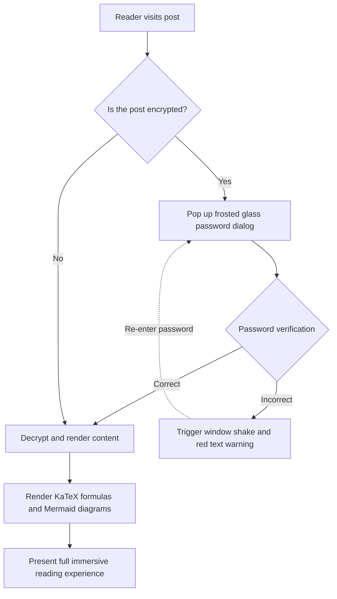
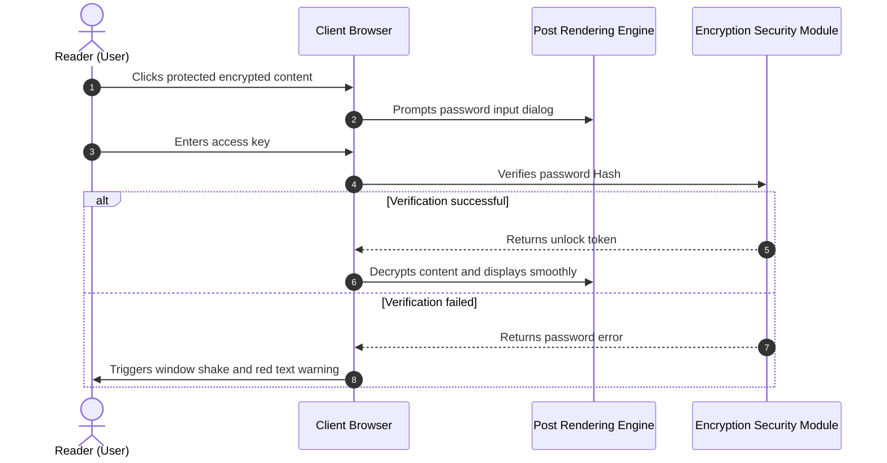

# A Comprehensive Guide to Static Site Generators (SSG) and Theme Content Formats

In modern Static Site Generators (SSG) and independent blog theme development, the **ability to parse and render article content formats** directly determines the creator's expressive boundaries and the reader's experience.

This guide, combining the content specifications of mainstream SSG ecosystems (**Hugo, Jekyll, Eleventy, Astro, Pelican, Hexo, WordPress, VitePress**, etc.), establishes a comprehensive system covering **basic Markup, extended document languages, WordPress Post Formats, interactive dropdown switchers, accordion collapses, LaTeX mathematical formulas, Mermaid diagrams, and unique encryption/decryption features**, providing plug-and-play live rendering demonstrations.

---

## I. Mainstream Static Site Generator (SSG) Content Format Support and Ecosystem Summary

Different Static Site Generators have varying architectural philosophies for content parsing. The table below systematically summarizes the native and extended support for various formats across mainstream engines:

| Static Site Generator / Platform | Core Parsing Engine | Native Built-in Support Formats | Extended / External Tool Support Formats | Front Matter Serialization Support |
| :--- | :--- | :--- | :--- | :--- |
| **Hugo** | Goldmark (Go) | `.md` (CommonMark/GFM), `.html`, `.org` (Org-mode) | `.adoc` (Asciidoctor), `.rst` (rst2html), `.pdc` (Pandoc) | YAML (`---`), TOML (`+++`), JSON (`{}`) |
| **Astro (This Blog's Architecture)** | Vite + Unified/Remark + MDX | `.md` (GFM), `.mdx` (JSX), `.html`, `.astro` Components | Mountable AST Loader for Org/AsciiDoc/RST Extension | YAML, TOML, JSON |
| **Jekyll** | Kramdown (Ruby) | `.md` (Kramdown/GFM), `.html` | `.textile` (Textile Plugin) | YAML |
| **Eleventy (11ty)** | JavaScript Template Pipeline | `.md`, `.html`, `.liquid`, `.njk`, `.ejs`, `.webc` | MDX (Plugin), Custom Template Extension | YAML, JSON, JS/11tydata |
| **Hexo** | Marked / Hexo-Renderer | `.md` (GFM), `.html`, EJS/Pug Templates | Org-mode / Pandoc (Plugin Support) | YAML, JSON |
| **Pelican** | Python Docutils | `.md` (Markdown), `.rst` (reStructuredText) | `.asciidoc` (Asciidoctor) | YAML, Markdown Metadata |
| **WordPress (Headless/Theme)** | Gutenberg Block Engine | HTML5 Blocks, Shortcodes, Post Formats | Classic Editor HTML | JSON Block Metadata / Post Meta |
| **VitePress / Docusaurus** | Markdown-It / MDX | `.md`, `.mdx`, Vue/React Components | Custom Container Syntax (`::: tip`) | YAML |

> [!NOTE]
> **Ecosystem Architecture Insight**: Hugo natively supports Markdown and Org-mode with Go's high concurrency; while modern frontend SSGs like **Astro**, leveraging **MDX and component-based Islands architecture**, achieve ultimate flexibility by seamlessly embedding dynamic interactive UIs (such as the dropdown switcher, password pop-up, and vinyl record player demonstrated in this article) directly into the main content.

---

## II. Front Matter Serialization Format Support Specification

The metadata (Front Matter) at the beginning of a blog post determines its routing, title, date, category, cover image, and protected status. This theme supports all mainstream serialization modes:

### 1. YAML Format (Most Widely Used, Recommended Default)

```yaml
---
title: "Article Title"
pubDate: 2026-08-28
author: "shijianus"
tags: ["Astro", "Markdown"]
featured: true
postFormat: "aside"
---
```

### 2. TOML Format (Commonly Used by Hugo)

```toml
+++
title = "Article Title"
pubDate = 2026-08-28T00:00:00Z
author = "shijianus"
tags = ["Astro", "Markdown"]
featured = true
+++
```

### 3. JSON Format (API-Driven and Headless Scenarios)

```json
{
  "title": "Article Title",
  "pubDate": "2026-08-28T00:00:00.000Z",
  "author": "shijianus",
  "tags": ["Astro", "Markdown"],
  "featured": true
}
```

---

## III. Comparison and Migration Reference for Special Lightweight Markup and Non-Markdown Formats

In different technology stacks, authors may use lightweight markup languages other than Markdown. The following provides the syntax features of mainstream formats and their equivalent presentation in this theme:

### 1. AsciiDoc (.adoc / .asciidoc)

AsciiDoc is commonly found in technical books and lengthy engineering manuals, featuring a rich system of admonition blocks and attributes:

```asciidoc
// AsciiDoc Source Syntax
= AsciiDoc Technical Specification
:author: shijianus
:toc: macro

[NOTE]
====
This is an AsciiDoc-style note card.
====

[cols="1,2,1", options="header"]
|===
| Module | Description | Status
| Core Engine | Astro 6 Static Pipeline | Ready
|===
```

**Equivalent Markdown / MDX Syntax in This Theme**:

> [!NOTE]
> This is an equivalent note card natively rendered in the Astro theme, with perfectly aligned style and interaction.

| Module | Description | Status |
| :--- | :--- | :---: |
| **Core Engine** | Astro 6 Static Pipeline | <span class="badge badge-success">Ready</span> |

---

### 2. Emacs Org-Mode (.org)

Org-mode is a powerful tool for Emacs users for knowledge management, task tracking, and document writing:

```ini
#+TITLE: Emacs Org-Mode Practice Notes
#+DATE: 2026-08-28
#+TAGS: Emacs OrgMode

* TODO Phase 1: Markdown Scan Enhancement [1/2]
- [X] Fix table and mobile overflow
- [ ] Complete Org-mode syntax converter

#+BEGIN_QUOTE
“Org-mode is not just a format; it's an executable thought workflow.”
#+END_QUOTE
```

**Standard Static GFM Task List Presentation in this Theme (Read-only)**:

- [x] Fix table and mobile overflow
- [ ] Complete Org-mode syntax converter

> [!QUOTE]
> “Org-mode is not just a format; it's an executable thought workflow.”

#### Interactive Tutorial Checklist & Chained Progression

In technical tutorials, practical exercises, and deployment guides, traditional read-only `[ ]` task checklists lack intuitive interaction and memorability. This theme specifically adds an **interactive checklist (`.article-task-tracker`) that supports real-time checking and chained status linkage**. Each time a reader checks an item, the dynamic progress bar will recalculate the percentage in real-time. Once all critical steps are confirmed, it will also **automatically unlock downstream readiness instructions**, making it ideal as a completion checklist for tutorials:

<div class="article-task-tracker" data-storage-key="content-format-tutorial-demo">
  <div class="task-tracker__header">
    <div class="task-tracker__title">
      <svg width="20" height="20" viewBox="0 0 24 24" fill="none" stroke="currentColor" stroke-width="2"><path d="M9 11l3 3L22 4"/><path d="M21 12v7a2 2 0 0 1-2 2H5a2 2 0 0 1-2-2V5a2 2 0 0 1 2-2h11"/></svg>
      <span>Static Site Engineering Online Deployment Pre-check Checklist (Interactive, Real-time Ticking)</span>
    </div>
    <span class="task-tracker__count">1/4 Steps Completed (25%)</span>
  </div>
  <div class="task-tracker__bar-wrap">
    <div class="task-tracker__fill" style="width: 25%;"></div>
  </div>
  <ul class="task-checklist">
    <li class="task-checklist-item is-done">
      <input type="checkbox" checked id="chk-step-1" />
      <div class="task-item-body">
        <label for="chk-step-1" class="task-item-label">Step 1: Complete Local Code Full Backup and Git Commit</label>
        <div class="task-item-desc">Confirm current working tree is clean, record backup hash in development audit log.</div>
      </div>
    </li>
    <li class="task-checklist-item">
      <input type="checkbox" id="chk-step-2" />
      <div class="task-item-body">
        <label for="chk-step-2" class="task-item-label">Step 2: Configure Cloudflare Pages Static Build Pipeline</label>
        <div class="task-item-desc">Set <code>BLOG_BUILD_TARGET=static</code> and Node.js 20+ runtime environment.</div>
      </div>
    </li>
    <li class="task-checklist-item">
      <input type="checkbox" id="chk-step-3" />
      <div class="task-item-body">
        <label for="chk-step-3" class="task-item-label">Step 3: Verify Media Resources and External Video/Audio Embedding</label>
        <div class="task-item-desc">Ensure all audio and video single file sizes are strictly controlled within 25MB, meeting CDN deployment specifications.</div>
      </div>
    </li>
    <li class="task-checklist-item">
      <input type="checkbox" id="chk-step-4" />
      <div class="task-item-body">
        <label for="chk-step-4" class="task-item-label">Step 4: Execute Playwright Automated Visual Regression and Smoke Testing</label>
        <div class="task-item-desc">Verify that all rich media cards and interactive components are laid out correctly across multiple resolutions on PC and mobile.</div>
      </div>
    </li>
  </ul>
  <div class="task-tracker__status-card is-pending">
    <div class="status-card__header">
      <span class="badge badge-warning">⏳ Pending Readiness</span>
      <span style="font-weight:700;">Current Progress: 1/4 (25%)</span>
    </div>
    <p style="margin-top:0.4rem;margin-bottom:0;font-size:0.88rem;line-height:1.6;">Please complete each checked step in the list above in order; once all tasks are completed, production release instructions will be unlocked here in real-time.</p>
  </div>
</div>

---

### 3. reStructuredText (.rst)

reStructuredText is the standard documentation format for the Python community (e.g., Sphinx, ReadTheDocs):

```rst
.. reStructuredText source syntax
.. note::
   This is a Note block defined by an RST directive.

.. code-block:: python
   :linenos:

   def greet(name: str) -> str:
       return f"Hello, {name}!"
```

**Markdown equivalent rendering in this theme**:

> [!NOTE]
> This is the RST Note equivalent card rendered in Astro according to GitHub Alert specifications.

```python
def greet(name: str) -> str:
    return f"Hello, {name}!"
```

---

### 4. Textile Syntax

Textile is a classic lightweight markup language (commonly found in Redmine and early Jekyll blogs):

```markdown
h2. Section Title
bq. This is the content of a Textile blockquote.
*List Item 1*
_Emphasized Italic Text_
```

---

## 4. Full Implementation and Visual Presentation of WordPress-Style Post Formats

The classic **Post Formats** mechanism in the WordPress theme ecosystem allows blogs to display exclusive visual styles for different types of content. We have fully implemented all 9 of these formats in the main content column of this theme:

### 1. `aside` (Whisper / Memo / Snippet Card)

Suitable for recording brief thoughts, reminders, or temporary notes:

<div class="article-aside">
  <p><strong>💡 Snippet Memo</strong>: The true value of static sites lies not in showing off technical prowess, but in delivering a pure reading experience with extreme speed and zero server-side maintenance burden. Even after five or ten years, the generated HTML files will still open perfectly.</p>
</div>

---

### 2. `status` (Status Update / Musings / Micro-Quote)

A Twitter/Weibo-style instant status update card, including author avatar, client identifier, and mood tag:

<div class="article-status">
  <div class="article-status__header">
    <div class="article-status__user">
      
      <div>
        <div class="article-status__name">shijianus</div>
        <div class="article-status__meta">Posted on 2026-08-28 14:32 · 🇨🇳 Hangzhou</div>
      </div>
    </div>
    <div class="article-status__badge">
      <span>📱 From Geek Workshop Mac Studio</span>
    </div>
  </div>
  <p class="article-status__content">
    Finally completed all format extensions and visual refactoring for the blog's main content column today! From KaTeX and Mermaid to interactive dropdowns and vinyl records, the feeling of full-stack static delivery is amazing 🚀✨
  </p>
</div>

---

### 3. `quote` (Featured Quote / Grand Quote Card)

Used to display impactful personal quotes, design maxims, or golden phrases:

<div class="article-quote">
  <div class="article-quote__icon">“</div>
  <div class="article-quote__body">
    Simplicity is prerequisite for reliability. (Simplicity is a prerequisite for reliability.)
  </div>
  <div class="article-quote__author">
    
    <div class="article-quote__author-info">
      <div class="article-quote__author-name">Edsger W. Dijkstra</div>
      <div class="article-quote__author-title">Computer Scientist · Turing Award Laureate (1972)</div>
    </div>
  </div>
</div>

---

### 4. `gallery` (Image Gallery / Responsive Album and Polaroid Grid)

Supports multi-column adaptive responsive grids and Polaroid-style photo paper cards with a humanistic touch. Clicking any image triggers a full-screen lightbox zoom:

#### 2-Column and 3-Column Responsive Gallery

<div class="article-gallery">
  <div class="gallery-grid gallery-grid-3">
    <div class="gallery-item">
      
      <div class="gallery-item__caption">Geek Workbench Panorama</div>
    </div>
    <div class="gallery-item">
      
      <div class="gallery-item__caption">System Architecture Design Dashboard</div>
    </div>
    <div class="gallery-item">
      
      <div class="gallery-item__caption">Stellar Roam Visual Cover</div>
    </div>
  </div>
</div>

#### Polaroid Photo Paper Gallery (Polaroid Style)

<div class="gallery-polaroid">
  <div class="polaroid-card">
    
    <div class="polaroid-card__caption">2026.04 Hangzhou · R&D Base</div>
  </div>
  <div class="polaroid-card">
    
    <div class="polaroid-card__caption">2026.08 Architecture Evolution Refactoring Night</div>
  </div>
</div>

---

### 5. `video` (Responsive Video Player Card)

Supports 16:9 responsive aspect ratio, rounded borders, and a bottom caption. Each video occupies a full-width slot. Compatible with external proxy embeds from Bilibili and YouTube, as well as native MP4 files hosted on the site (single files kept under 25MB to meet Cloudflare Pages static deployment specifications):

#### External Video Embeds (Bilibili & YouTube Link Proxy Embeds · By default, readers need to scroll here and click to start playback)

<div class="video-embed-card" data-video-type="bilibili">
  <iframe src="https://player.bilibili.com/player.html?bvid=BV11k4y1T7kS&page=1&high_quality=1&danmaku=0&autoplay=0" allowfullscreen="true" loading="lazy" allow="accelerometer; autoplay; clipboard-write; encrypted-media; gyroscope; picture-in-picture; web-share" sandbox="allow-top-navigation-by-user-activation allow-same-origin allow-forms allow-scripts allow-popups"></iframe>
  <div class="embed-caption">🎬 Bilibili External Embed Demo: BV11k4y1T7kS (1080P HD · Scroll here and click to play)</div>
</div>

<div class="video-embed-card" data-video-type="youtube">
  <iframe src="https://www.youtube-nocookie.com/embed/LXb3EKWsInQ?autoplay=0&rel=0" allowfullscreen="true" loading="lazy" allow="accelerometer; autoplay; clipboard-write; encrypted-media; gyroscope; picture-in-picture; web-share"></iframe>
  <div class="embed-caption">🎬 YouTube External Embed Demo: Costa Rica 4K 60fps HDR Demo (1080P/4K · Valid URL · Scroll here and click to play)</div>
</div>

#### Native MP4 Video Embeds on Site (Native HTML5 Video Player · Supports Playback Speed and Picture-in-Picture · Downloads Disabled by Default)

<div class="video-embed-card">
  <video controls controlsList="nodownload" preload="metadata" playsinline oncontextmenu="return false;">
    <source src="/media/video/landscape_compressed.mp4" type="video/mp4" />
    Your browser does not support HTML5 video playback.
  </video>
  <div class="embed-caption">🎥 Local Native Embedded Video 1: 4K/1080P Ultra HD Landscape Demo (Size 21.7MB · Supports playback speed and picture-in-picture · Direct download disabled)</div>
</div>

<div class="video-embed-card">
  <video controls controlsList="nodownload" preload="metadata" playsinline oncontextmenu="return false;">
    <source src="/media/video/blue_archive_miracle.mp4" type="video/mp4" />
    Your browser does not support HTML5 video playback.
  </video>
  <div class="embed-caption">🎥 Local Native Embedded Video 2: [Blue Archive] "The Beginning and End of a Miracle—Our Story, Our Choice!" (Size 23.3MB · Supports playback speed and picture-in-picture · Direct download disabled)</div>
</div>

---

### 6. `audio` (Vinyl Record Spinning Music Card)

Built-in HTML5 audio controller that automatically triggers a **stepless smooth vinyl record spinning animation** when playing. All album covers use genuinely matched official high-definition album art, supporting various mainstream audio formats (lossless FLAC, high-bitrate MP3, AAC/M4A), and include built-in anti-scraping and download protection:

#### ① Shaun - Way Back Home (FLAC Lossless Audio Format · 24.55MB)

<div class="article-audio-card">
  <div class="audio-card__cover">
    
  </div>
  <div class="audio-card__info">
    <div class="audio-card__title">
      <span>Way Back Home</span>
      <span class="badge badge-purple">FLAC Lossless</span>
    </div>
    <div class="audio-card__author">Shaun (숀) · Lossless Audio (FLAC / 44.1kHz 16-bit 961 kbps)</div>
    <audio controls preload="metadata" controlsList="nodownload" oncontextmenu="return false;" src="/media/audio/WayBackHome.flac"></audio>
  </div>
</div>

#### ② ヨルシカ (Yorushika) - 彼女は旅に出る (MP3 320Kbps High-Definition Format · 8.41MB)

<div class="article-audio-card">
  <div class="audio-card__cover">
    
  </div>
  <div class="audio-card__info">
    <div class="audio-card__title">
      <span>彼女は旅に出る (She Leaves on a Journey)</span>
      <span class="badge badge-success">320 Kbps MP3</span>
    </div>
    <div class="audio-card__author">ヨルシカ (Yorushika) · High-Definition Stereo (MP3 / 48kHz 320 kbps)</div>
    <audio controls preload="metadata" controlsList="nodownload" oncontextmenu="return false;" src="/media/audio/彼女は旅に出る.mp3"></audio>
  </div>
</div>

#### ③ すこっぷ feat. 初音ミク - アイロニ (M4A / AAC Format · 7.63MB)

<div class="article-audio-card">
  <div class="audio-card__cover">
    
  </div>
  <div class="audio-card__info">
    <div class="audio-card__title">
      <span>アイロニ (Irony / 讽刺)</span>
      <span class="badge badge-cyan">M4A / AAC</span>
    </div>
    <div class="audio-card__author">すこっぷ feat. 初音ミク · AAC Audio (M4A / 44.1kHz 260 kbps)</div>
    <audio controls preload="metadata" controlsList="nodownload" oncontextmenu="return false;" src="/media/audio/アイロニ.m4a"></audio>
  </div>
</div>

---

### 7. `link` (External Link and Bookmark Preview Card / Bookmark Preview)

Provides elegant card-style previews for key references within the article:

<a class="article-bookmark" href="https://github.com/shijianus/shijianus-blog" target="_blank" rel="noopener">
  <div class="article-bookmark__content">
    <div class="article-bookmark__title">EpoCanvas / shijianus-blog (Shijianus Blog Theme Core Design Specification Repository)</div>
    <p class="article-bookmark__desc">EpoCanvas (Canvas of Time) is a modern geek blog content architecture system focused on high-density information presentation, elegant micro-interactions, and full format support.</p>
    <div class="article-bookmark__site">
      <span class="badge badge-primary">GitHub</span>
      <span>github.com · EpoCanvas Core Spec</span>
    </div>
  </div>
  <div class="article-bookmark__icon">
    <svg viewBox="0 0 24 24" width="24" height="24" fill="none" stroke="currentColor" stroke-width="2" stroke-linecap="round" stroke-linejoin="round"><path d="M18 13v6a2 2 0 0 1-2 2H5a2 2 0 0 1-2-2V8a2 2 0 0 1 2-2h6"/><polyline points="15 3 21 3 21 9"/><line x1="10" y1="14" x2="21" y2="3"/></svg>
  </div>
</a>

---

### 8. chat (Chat Bubble Dialogue Flow / Organic Animated Dialogue Stream)

Used for vivid demonstrations of technical defenses, two-person discussions, or user interview scenarios, supporting left/right bubbles, inline code, custom color schemes, and **dynamic content-adaptive typing animation effects, Web Audio synthesized sound effects, and dynamic avatars (`footer_mini_logo__media`)**:
*   **Static Mode (Default)**: `<div class="article-chat">` maintains a lightweight, purely static presentation with zero JS overhead;
*   **Enable Dynamic Demo (Parameter Control)**: Configure `data-animate="true"` (or `class="article-chat is-animated"`), and the system will **automatically trigger a realistic, time-sequenced typing animation and dedicated left/right prompt sounds, determined by character length and natural randomness, when the reader first scrolls into the viewport**;
*   **Non-Mechanical Dynamic Timing (Content-Length Aware Timing)**: The system intelligently determines the duration of the typing indicator based on the length of the speech (short sentences flash for 380ms, long technical paragraphs involve 1000ms+ typing contemplation), and incorporates natural pauses and subtle frequency sound effect jitters between bubbles, consistent with human reading judgment;
*   **Dynamic Video Avatar Support (`footer_mini_logo__media`)**: Avatars support embedding MP4 micro-video animations and static fallback posters;
*   **Single Trigger and Reload Guarantee**: Automatically locks after the first scroll-in trigger; subsequent repeated scrolling will not re-trigger and disturb reading. It will only be re-ready when the user refreshes the page (F5). It also provides a micro-control bar in the top right corner with "↺ Replay" and "🔊/🔇 Sound Toggle".

<div class="article-chat" data-animate="true" data-sound="true">
  <div class="chat-message chat-left">
    <span class="chat-avatar footer_mini_logo__media">
      <video autoplay muted loop playsinline preload="metadata" poster="/media/shijianus/avatar.jpg" aria-hidden="true">
        <source src="/media/shijianus/avatar-dynamic.mp4" type="video/mp4" />
      </video>
      
    </span>
    <div class="chat-body">
      <div class="chat-author">Developer <a href="https://github.com/LeonBoven" target="_blank" rel="noopener noreferrer">Léon Boven</a> · 10:15</div>
      <div class="chat-bubble">
        Hello! Will implementing static rendering of <code>KaTeX</code> and <code>Mermaid</code> in Astro slow down the frontend page loading speed?
      </div>
    </div>
  </div>

  <div class="chat-message chat-right">
    
    <div class="chat-body">
      <div class="chat-author">Architect <a href="https://github.com/shijianus" target="_blank" rel="noopener noreferrer">shijianus</a> · 10:16</div>
      <div class="chat-bubble">
        Not at all! Because <code>remark-math</code> and <code>rehype-katex</code> already compile formulas into pure HTML/MathML strings during the build-time, resulting in <strong>0 JS runtime overhead</strong> on the browser side; and Mermaid diagrams are dynamically loaded as ESM modules on demand, making the initial screen extremely fast! ⚡
      </div>
    </div>
  </div>

  <div class="chat-message chat-left">
    <span class="chat-avatar footer_mini_logo__media">
      <video autoplay muted loop playsinline preload="metadata" poster="/media/shijianus/avatar.jpg" aria-hidden="true">
        <source src="/media/shijianus/avatar-dynamic.mp4" type="video/mp4" />
      </video>
      
    </span>
    <div class="chat-body">
      <div class="chat-author">Developer <a href="https://github.com/LeonBoven" target="_blank" rel="noopener noreferrer">Léon Boven</a> · 10:17</div>
      <div class="chat-bubble">
        That's great! So, writing architectural sequence diagrams and interactive unit converters directly in Markdown is also out-of-the-box, right?
      </div>
    </div>
  </div>

  <div class="chat-message chat-right">
    
    <div class="chat-body">
      <div class="chat-author">Architect <a href="https://github.com/shijianus" target="_blank" rel="noopener noreferrer">shijianus</a> · 10:18</div>
      <div class="chat-bubble">
        Exactly! Not only are double-click zoom and high-definition SVG export fully available, but the unit converter also integrates <strong>real-time online exchange rate synchronization</strong> and <strong>base unit dropdown switching</strong>, ensuring a complete and symmetrical representation of fixed quality units, with all measurements rigorously tested! 🚀
      </div>
    </div>
  </div>

  <div class="chat-message chat-left">
    <span class="chat-avatar footer_mini_logo__media">
      <video autoplay muted loop playsinline preload="metadata" poster="/media/shijianus/avatar.jpg" aria-hidden="true">
        <source src="/media/shijianus/avatar-dynamic.mp4" type="video/mp4" />
      </video>
      
    </span>
    <div class="chat-body">
      <div class="chat-author">Developer <a href="https://github.com/LeonBoven" target="_blank" rel="noopener noreferrer">Léon Boven</a> · 10:19</div>
      <div class="chat-bubble">
        Got it! The interactive feel and the typing animation that varies with message length are very natural. I'll upgrade the team's technical documentation library right away! 🎉
      </div>
    </div>
  </div>

  <div class="chat-message chat-right">
    
    <div class="chat-body">
      <div class="chat-author">Architect <a href="https://github.com/shijianus" target="_blank" rel="noopener noreferrer">shijianus</a> · 10:20</div>
      <div class="chat-bubble">
        Welcome to try it out! If you encounter any format extension or customization needs later, feel free to discuss them in the discussion area or on GitHub~ ✨
      </div>
    </div>
  </div>
</div>

---

## V. Special Dropdown Formats and Dynamic Interactive Components (Dropdown Selectors & Interactive Formats)

For **special dropdown formats** explicitly requested by users, we provide client-side, instantly responsive dropdown selector components within the article body:

### 1. Multi-Framework and Multi-Code Version Dropdown Switcher (Interactive Dropdown Switcher)

Readers can freely select a technical framework from the dropdown, and the main content panel will switch to the corresponding content and code in real-time without refreshing:

<div class="article-dropdown-switcher">
  <div class="article-dropdown-switcher__header">
    <div class="article-dropdown-switcher__title">
      <svg width="20" height="20" viewBox="0 0 24 24" fill="none" stroke="currentColor" stroke-width="2"><rect x="3" y="3" width="18" height="18" rx="2"/><path d="M9 3v18"/><path d="m14 9 3 3-3 3"/></svg>
      <span>Please select the frontend framework implementation code to view:</span>
    </div>
    <select class="article-select dropdown-switcher__select">
      <option value="react-tab">⚛️ React 19 (Hooks & TSX)</option>
      <option value="vue-tab">🟢 Vue 3.5 (Composition API)</option>
      <option value="astro-tab">🚀 Astro 6 (Island Component)</option>
      <option value="svelte-tab">🟠 Svelte 5 (Runes)</option>
    </select>
  </div>
  <div class="article-dropdown-switcher__body">
    <div class="article-dropdown-panel is-active" data-panel="react-tab">
      <div class="article-dropdown-panel__title">⚛️ React 19 Component Implementation:</div>
      <pre class="no-code-enhance"><code class="language-tsx">import { useState } from 'react';
export function Counter() {
  const [count, setCount] = useState(0);
  return (
    &lt;button onClick={() =&gt; setCount((c) =&gt; c + 1)} className="btn-primary"&gt;
      React Click Count: &#123;count&#125;
    &lt;/button&gt;
  );
}</code></pre>
    </div>
    <div class="article-dropdown-panel" data-panel="vue-tab">
      <div class="article-dropdown-panel__title">🟢 Vue 3.5 Single-File Component Implementation:</div>
      <pre class="no-code-enhance"><code class="language-html">&lt;script setup lang="ts"&gt;
import { ref } from 'vue';
const count = ref(0);
&lt;/script&gt;
&lt;template&gt;
  &lt;button @click="count++" class="btn-primary"&gt;
    Vue Click Count: &#123;&#123; count &#125;&#125;
  &lt;/button&gt;
&lt;/template&gt;</code></pre>
    </div>
    <div class="article-dropdown-panel" data-panel="astro-tab">
      <div class="article-dropdown-panel__title">🚀 Astro 6 Zero-JS Static Component Implementation:</div>
      <pre class="no-code-enhance"><code class="language-astro">---
const { title = "Astro Speed Islands" } = Astro.props;
---
&lt;div class="astro-island"&gt;
  &lt;h3&gt;&#123;title&#125;&lt;/h3&gt;
  &lt;p&gt;Delivers 0KB JavaScript by default, hydrates interactivity on demand!&lt;/p&gt;
&lt;/div&gt;</code></pre>
    </div>
    <div class="article-dropdown-panel" data-panel="svelte-tab">
      <div class="article-dropdown-panel__title">🟠 Svelte 5 Runes Implementation:</div>
      <pre class="no-code-enhance"><code class="language-svelte">&lt;script lang="ts"&gt;
  let count = $state(0);
&lt;/script&gt;
&lt;button onclick={() =&gt; count++} class="btn-primary"&gt;
  Svelte Click Count: &#123;count&#125;
&lt;/button&gt;</code></pre>
    </div>
  </div>
</div>

---

### 2. Interactive Multi-Category Universal Unit Converter (Base Unit Dropdown Switching & Live Exchange Rates)

Supports users freely entering **any base numerical value** in the input box (default value is `1`, supports increment/decrement steppers and one-click reset), and instantly and seamlessly converting between different categories (Mass/Weight, International Exchange Rates, Data Storage, Network Bandwidth, Length/Dimensions):
*   **Dynamically Switchable Conversion Base (Base Unit Dropdown)**: The base unit to the right of the input box supports free selection via dropdown (e.g., for mass, `kg`, `g`, `lb`, `斤`, `oz`, `t` etc. can be selected; for exchange rates, `USD`, `HKD`, `CNY`, `EUR`, `JPY`, `GBP` etc. can be selected). After selecting any base unit, the target conversion grid will **intelligently and automatically exclude the current base unit (completely eliminating redundant 1kg=1kg cards)**, and instantly recalculate all target units using the current base as the denominator;
*   **Live Forex API Integration (Real-time Exchange Rate Fluctuations)**: When switching to '💱 International Exchange Rates', the system will automatically asynchronously request the `/api/exchange-rate` endpoint from the server and fall back to a public real-time exchange rate interface to obtain the latest real-time rates for major currencies (top right displays `🟢 Live Network Exchange Rates Synced`); when offline or disconnected, it automatically and seamlessly falls back to built-in base ratios (displays `⚪ Offline Base Exchange Rates`), ensuring "real-time" is truly real-time and the offline experience is rock-solid;
*   **Convenient Universal API Call**: The system also globally exposes the `window.shijianusAPI.fetchExchangeRates(base)` helper function, making it convenient for any custom script within the documentation to instantly call real-time rate data;
*   **Quick One-Click Copy & Equation Derivation**: Each conversion card provides a one-click copy button with highlight feedback, and a dynamic equation chain derivation summary is simultaneously displayed at the bottom.

<div class="interactive-unit-converter" data-default="1" data-title="🔄 Interactive Universal Unit Converter (Supports Base Unit Switching & Live Exchange Rates)"></div>

---

### 3. Specification Parameters and Video Encoding Dropdown Calculator (Interactive Spec Calc Dropdown)

When different options are selected, the corresponding technical indicators and conversion explanations are displayed in real-time on the right:

<div class="interactive-calc-select">
  <div class="article-select-box">
    <label>
      <svg width="18" height="18" viewBox="0 0 24 24" fill="none" stroke="currentColor" stroke-width="2"><circle cx="12" cy="12" r="10"/><path d="M12 6v6l4 2"/></svg>
      <span>Select Video Encoding Resolution:</span>
    </label>
    <select class="article-select">
      <option value="1080p" data-desc="1920 × 1080 @ 60fps · Bitrate 6,000 Kbps · Recommended Bandwidth 15 Mbps">1080P Full HD (1080p60)</option>
      <option value="2k" data-desc="2560 × 1440 @ 60fps · Bitrate 12,000 Kbps · Recommended Bandwidth 30 Mbps">2K Ultra Clear (1440p60)</option>
      <option value="4k" data-desc="3840 × 2160 @ 60fps · Bitrate 25,000 Kbps · Recommended Bandwidth 60 Mbps">4K Ultra HD (2160p60 HDR)</option>
      <option value="8k" data-desc="7680 × 4320 @ 60fps · Bitrate 80,000 Kbps · Recommended Bandwidth 200 Mbps">8K Cinematic (4320p60 AV1)</option>
    </select>
  </div>
  <div class="calc-output-box">
    <span>📊 <strong>Technical Specification Calculation Result</strong>:</span>
    <span class="calc-output-value">1920 × 1080 @ 60fps · Bitrate 6,000 Kbps · Recommended Bandwidth 15 Mbps</span>
  </div>
</div>

---

## 6. Accordion Collapsibles, Tabs & Multi-Column Layout (Collapsibles, Tabs & Columns)

### 1. Exclusive Accordion Group · Expands one item, automatically collapsing others

Configure `data-single="true"`. When one item is expanded, other expanded items within the same group will automatically collapse, keeping the page clean and focused:

<div class="article-accordion-group" data-single="true">
  <details class="article-accordion" open>
    <summary>
      <span>🔒 1. Security Advantages of Static Sites</span>
      <svg class="accordion-chevron" viewBox="0 0 24 24" fill="none" stroke="currentColor" stroke-width="2"><polyline points="9 18 15 12 9 6"/></svg>
    </summary>
    <div class="accordion-content">
      <p>Static sites lack traditional PHP/Node.js dynamic execution engines and SQL databases exposed to the public network, making them physically immune to SQL injection and Server-Side Remote Code Execution (RCE) risks.</p>
    </div>
  </details>

  <details class="article-accordion">
    <summary>
      <span>⚡ 2. Global CDN Edge Accelerated Delivery</span>
      <svg class="accordion-chevron" viewBox="0 0 24 24" fill="none" stroke="currentColor" stroke-width="2"><polyline points="9 18 15 12 9 6"/></svg>
    </summary>
    <div class="accordion-content">
      <p>By deploying compiled artifacts to Cloudflare Pages or GitHub Pages, all static resources can be cached at over 300 edge nodes worldwide, with First Byte Time (TTFB) typically below 20ms.</p>
    </div>
  </details>

  <details class="article-accordion">
    <summary>
      <span>💰 3. Extremely Low Cloud Hosting Costs</span>
      <svg class="accordion-chevron" viewBox="0 0 24 24" fill="none" stroke="currentColor" stroke-width="2"><polyline points="9 18 15 12 9 6"/></svg>
    </summary>
    <div class="accordion-content">
      <p>Static sites do not require expensive VPS cloud servers to run 24/7. Coupled with the free tier of Cloudflare D1 database and a Serverless comment system, daily operational costs are almost zero.</p>
    </div>
  </details>
</div>

---

### 2. Multi-Expand / Non-Exclusive Accordion Group · Allows multiple items to be expanded simultaneously

Configure `data-single="false"` (or default multi-open mode). Readers can freely expand multiple or all collapsible items for side-by-side comparison and in-depth reading, without new expansions closing already open content:

<div class="article-accordion-group" data-single="false">
  <details class="article-accordion" open>
    <summary>
      <span>🛠️ Architecture Module A: Markdown AST Syntax Compiler Pipeline</span>
      <svg class="accordion-chevron" viewBox="0 0 24 24" fill="none" stroke="currentColor" stroke-width="2"><polyline points="9 18 15 12 9 6"/></svg>
    </summary>
    <div class="accordion-content">
      <p>Based on the Unified, Remark-math, and Rehype-katex architecture, the Markdown syntax tree is fully statically transformed into standard semantic HTML nodes during the compilation and build phase, with highlighting and formula generation completed on the Node.js side.</p>
    </div>
  </details>

  <details class="article-accordion" open>
    <summary>
      <span>🎨 Architecture Module B: EpoCanvas Dynamic Visual Engine and Responsive System</span>
      <svg class="accordion-chevron" viewBox="0 0 24 24" fill="none" stroke="currentColor" stroke-width="2"><polyline points="9 18 15 12 9 6"/></svg>
    </summary>
    <div class="accordion-content">
      <p>Provides Aurora backgrounds, Starfield parallax, Glassmorphism, and multi-device responsive breakpoint adaptation, delivering a consistent aesthetic experience on both 4K widescreen displays and foldable phones.</p>
    </div>
  </details>

  <details class="article-accordion">
    <summary>
      <span>🛡️ Architecture Module C: WebCrypto SHA-256 Tiered Security Isolation System</span>
      <svg class="accordion-chevron" viewBox="0 0 24 24" fill="none" stroke="currentColor" stroke-width="2"><polyline points="9 18 15 12 9 6"/></svg>
    </summary>
    <div class="accordion-content">
      <p>Features Level 1 persistent session unlock, Level 2 anti-peep dynamic polymorphic masks (Gaussian blur/mosaic/spoiler mask), Level 3 viewport sentinel "lock on leave," and external URL sharding encryption, completely preventing plaintext passwords from being exposed in the DOM.</p>
    </div>
  </details>
</div>

---

### 3. Interactive Tabs

<div class="article-tabs">
  <div class="article-tabs__nav">
    <button class="article-tabs__button is-active" type="button">pnpm</button>
    <button class="article-tabs__button" type="button">npm</button>
    <button class="article-tabs__button" type="button">yarn</button>
    <button class="article-tabs__button" type="button">bun</button>
  </div>
  <div class="article-tabs__panels">
    <div class="article-tabs__panel is-active">
      <pre class="no-code-enhance"><code class="language-bash">pnpm add @astrojs/mdx remark-math rehype-katex katex mermaid</code></pre>
    </div>
    <div class="article-tabs__panel">
      <pre class="no-code-enhance"><code class="language-bash">npm install @astrojs/mdx remark-math rehype-katex katex mermaid</code></pre>
    </div>
    <div class="article-tabs__panel">
      <pre class="no-code-enhance"><code class="language-bash">yarn add @astrojs/mdx remark-math rehype-katex katex mermaid</code></pre>
    </div>
    <div class="article-tabs__panel">
      <pre class="no-code-enhance"><code class="language-bash">bun add @astrojs/mdx remark-math rehype-katex katex mermaid</code></pre>
    </div>
  </div>
</div>

---

### 4. Multi-Column Grid Layout System

#### 3-Column Equal-Width Card Grid

<div class="article-grid article-grid-3">
  <div class="article-col-card">
    <h4>🎨 Visual System</h4>
    <p>Deeply incorporates EpoCanvas's modern geek design aesthetics, supporting high contrast dark/light modes, frosted glass backgrounds, and smooth color transitions.</p>
  </div>
  <div class="article-col-card">
    <h4>⚡ Performance Engineering</h4>
    <p>Astro 6 static island architecture, build-time HTML pre-rendering, pure static for ultimate SEO optimization.</p>
  </div>
  <div class="article-col-card">
    <h4>🛠️ Extension Ecosystem</h4>
    <p>Full support for KaTeX formulas, Mermaid diagrams, encrypted pop-ups, and 9 Post Formats.</p>
  </div>
</div>

#### 1:2 Unequal Sidebar Grid

<div class="article-grid article-columns-1-2">
  <div class="article-col-card">
    <h4>📌 Architectural Positioning</h4>
    <p>Focused on being a modern technical writing vehicle for geeks and engineers.</p>
  </div>
  <div class="article-col-card">
    <h4>🚀 Delivery Assurance</h4>
    <p>Built-in comprehensive automated smoke testing and static build verification mechanisms ensure flawless rendering on all devices, whether for formulas, diagrams, or complex cards.</p>
  </div>
</div>

---

## VII. 13 Semantic Admonition Boxes (Admonitions / GitHub Alerts)

Based on GitHub Alert and EpoCanvas design specifications, supporting 13 different semantic colored cards, and allowing default collapsing using the `[!TYPE]-` syntax:

> [!NOTE]
> **Regular Note (Note)**: This is a standard piece of background information or contextual explanation.

> [!TIP]
> **Practical Tip (Tip)**: Use the shortcut <kbd>Ctrl</kbd> + <kbd>K</kbd> to quickly bring up the global article search panel!

> [!IMPORTANT]
> **Important Matter (Important)**: Before deploying to a production environment, please confirm that the `BLOG_BUILD_TARGET=static` environment variable has been correctly injected.

> [!WARNING]
> **Risk Warning (Warning)**: Do not commit production database keys or cloud service private keys to public Git repositories.

> [!CAUTION]
> **Danger Alert (Caution)**: Performing a data table rebuild operation is destructive; please back up your D1 database first!

> [!DANGER]
> **Fatal Danger (Danger)**: Directly deleting the production database will result in the permanent loss of all comments and user assets.

> [!SUCCESS]
> **Operation Successful (Success)**: The static build process has been successfully completed, and all 47 static routes are ready!

> [!QUESTION]
> **Problem Discussion (Question)**: How can millisecond-level pure client-side full-text search be achieved in an environment without server-side dependencies?

> [!QUOTE]
> **Selected Quote (Quote)**: "Good code is not only executable by machines but also elegantly conveys ideas to humans, like poetry."

> [!INFO]
> **Detailed Information (Info)**: This blog is built on Astro 6 and Tailwind 4, with the entire site exported as pure static.

> [!TODO]
> **To-Do Plan (Todo)**: Planning to introduce WebAssembly client-side full-text search indexing in the next iteration.

> [!BUG]
> **Bug Record (Bug)**: Fixed the layout issue of horizontal table truncation in older versions on extremely narrow-screen devices.

> [!EXAMPLE]
> **Example Explanation (Example)**: All the admonition boxes above automatically adapt to high-contrast colors in both dark and light modes.

### Collapsible Admonition Demo

> [!TIP]- Click to expand and view: Production Environment Nginx High-Speed Cache Configuration Reference
> ```nginx
> location ~* \.(?:css|js|woff2?|svg|png|jpg|webp)$ {
>     expires 1y;
>     add_header Cache-Control "public, immutable";
>     access_log off;
> }
> ```

---

## 8. Academic Math Formulas (KaTeX), Architecture Diagrams (Mermaid 11), and Dynamic Mind Maps (Markmap)

In demonstrative and example-based technical documentation, the core presentation concept is **"Actual Rendered Effect + Corresponding Source Code Comparison"** (Tabs), which not only allows readers to intuitively experience the final visual and interactive features but also enables developers to easily reference, copy, and migrate to their actual projects with a single click.

---

### 1. LaTeX Math Formulas (KaTeX Math · Inline and Block Multi-line Derivations)

#### Inline Formula (Inline Formula)

<div class="article-tabs">
<div class="article-tabs__nav">
<button class="article-tabs__button is-active" type="button">🌟 Rendered Effect</button>
<button class="article-tabs__button" type="button">💻 LaTeX Source</button>
</div>
<div class="article-tabs__panels">
<div class="article-tabs__panel is-active">

Mass-energy equation $E = mc^2$, Euler's identity $e^{i\pi} + 1 = 0$, Gaussian integral $\int_{-\infty}^{\infty} e^{-x^2} dx = \sqrt{\pi}$.

</div>
<div class="article-tabs__panel">

```latex
Mass-energy equation $E = mc^2$, Euler's identity $e^{i\pi} + 1 = 0$, Gaussian integral $\int_{-\infty}^{\infty} e^{-x^2} dx = \sqrt{\pi}$.
```

</div>
</div>
</div>

#### Block Multi-line Derivation Formula 1: Laplace Transform of a Second-Order Dynamic System (Block Math · Single Equation)

<div class="article-tabs">
<div class="article-tabs__nav">
<button class="article-tabs__button is-active" type="button">🌟 Rendered Effect</button>
<button class="article-tabs__button" type="button">💻 LaTeX Source</button>
</div>
<div class="article-tabs__panels">
<div class="article-tabs__panel is-active">

$$
\mathcal{L}\{\ddot{x}(t) + 2\zeta\omega_n\dot{x}(t) + \omega_n^2 x(t)\} = X(s)(s^2 + 2\zeta\omega_n s + \omega_n^2)
$$

</div>
<div class="article-tabs__panel">

```latex
$$
\mathcal{L}\{\ddot{x}(t) + 2\zeta\omega_n\dot{x}(t) + \omega_n^2 x(t)\} = X(s)(s^2 + 2\zeta\omega_n s + \omega_n^2)
$$
```

</div>
</div>
</div>

#### Block Multi-line Derivation Formula 2: Maxwell's Classical Electromagnetic Equations (Block Math · Multi-line Aligned)

<div class="article-tabs">
<div class="article-tabs__nav">
<button class="article-tabs__button is-active" type="button">🌟 Rendered Effect</button>
<button class="article-tabs__button" type="button">💻 LaTeX Source</button>
</div>
<div class="article-tabs__panels">
<div class="article-tabs__panel is-active">

$$
\begin{aligned}
\nabla \cdot \mathbf{E} &= \frac{\rho}{\varepsilon_0} \\
\nabla \cdot \mathbf{B} &= 0 \\
\nabla \times \mathbf{E} &= -\frac{\partial \mathbf{B}}{\partial t} \\
\nabla \times \mathbf{B} &= \mu_0 \mathbf{J} + \mu_0 \varepsilon_0 \frac{\partial \mathbf{E}}{\partial t}
\end{aligned}
$$

</div>
<div class="article-tabs__panel">

```latex
$$
\begin{aligned}
\nabla \cdot \mathbf{E} &= \frac{\rho}{\varepsilon_0} \\
\nabla \cdot \mathbf{B} &= 0 \\
\nabla \times \mathbf{E} &= -\frac{\partial \mathbf{B}}{\partial t} \\
\nabla \times \mathbf{B} &= \mu_0 \mathbf{J} + \mu_0 \varepsilon_0 \frac{\partial \mathbf{E}}{\partial t}
\end{aligned}
$$
```

</div>
</div>
</div>

---

### 2. Mermaid 11 Architecture Diagrams (Flowchart & Sequence)

#### ① Blog Encryption Verification and Content Rendering Flowchart (Flowchart TD)

<div class="article-tabs">
<div class="article-tabs__nav">
<button class="article-tabs__button is-active" type="button">🌟 Rendered Effect</button>
<button class="article-tabs__button" type="button">💻 Mermaid Source</button>
</div>
<div class="article-tabs__panels">
<div class="article-tabs__panel is-active">



</div>
<div class="article-tabs__panel">

````markdown

````

</div>
</div>
</div>

#### ② Client-side Security Authentication and Decryption Sequence Diagram (Sequence Diagram)

<div class="article-tabs">
<div class="article-tabs__nav">
<button class="article-tabs__button is-active" type="button">🌟 Rendered Effect</button>
<button class="article-tabs__button" type="button">💻 Mermaid Source</button>
</div>
<div class="article-tabs__panels">
<div class="article-tabs__panel is-active">



</div>
<div class="article-tabs__panel">

````markdown

````

</div>
</div>
</div>

### 3. Dynamic Interactive Mind Map (Markmap / Mindmap · Multi-directional Branch Expansion)

In lengthy technical specifications and system architecture overviews, traditional static lists struggle to visually represent complex knowledge structures. This theme newly implements the **Markmap Dynamic Interactive Mind Map Engine**, achieving thorough native parsing and enhanced interactivity within the article's main column (`.post.post-page-shell`):

> [!TIP]
> **Core Rules for Multi-directional Branch Expansion**:
> 1.  **Default Single Block Protected Space**: By default, the mind map only displays **1 core root node** (Level 1), with a collapsible dot indicator on the right side;
> 2.  **Click to Expand Multi-directional Branches**: Clicking the dot on a root node or any child node will cause its sub-branches to **smoothly spread outwards**;
> 3.  **All-in-one Toolbar Control**: Supports **Zoom In / Zoom Out / Center & Fit / Expand All / Collapse Single Block / Full-screen Immersive Reading / Copy Source Code**;
> 4.  **Canvas Drag and Zoom**: Hold the left mouse button to freely drag and pan the canvas, and scroll the mouse wheel to zoom the view.

#### Live Mind Map Presentation: SSG and Theme Content Format Ecosystem Overview

<div class="article-tabs">
<div class="article-tabs__nav">
<button class="article-tabs__button is-active" type="button">🌟 Interactive Map Presentation</button>
<button class="article-tabs__button" type="button">💻 Mindmap Structure Source</button>
</div>
<div class="article-tabs__panels">
<div class="article-tabs__panel is-active">

```mindmap
# Static Site Generator and Full-Format Content Ecosystem Architecture
## 1. Static Compilation Core Pipeline
### AST Syntax Transformation Pipeline
#### Markdown / MDX Semantic Parsing Pipeline
##### Unified / Remark Syntax Extensions
- GFM Table and Strikethrough Syntax Conversion
- Automatic Generation of Heading Anchors and IDs
##### Markmap Interactive Multi-directional Mind Map Extension
- Recursive AST Tree Construction (Transformer.transform)
- D3 Hierarchical Elastic Layout (Flextree Algorithm)
- Interactive Collapse State Machine (payload.fold)
- Dynamic Color Palette Branch Coloring (d3.scaleOrdinal)
##### Rehype Katex Math Formula Extension
- Inline and Block Math Formula Parsing
- Macro Definition Support and Error Fallback
#### Code Highlighting and Static Colorizer
##### Shiki Dual-Theme Compiler
- VSCode TextMate Grammar Rule Parsing
- Light/Dark Mode Dual-Theme Pre-rendering Zero Hydration
### Compiler and Resource Bundling
#### Vite 6 Ultra-fast Hot Module Replacement (HMR)
##### ESM Native Module Loading
- Millisecond-level On-demand Compilation and Hot Updates
#### Rollup Static Generation Pipeline
##### Static Bundling Optimization
- Intelligent Code Splitting
- Tree-Shaking Redundancy Elimination
## 2. Dynamic Interactivity and Islands Architecture
### Hybrid Component Islands
#### Client Component Island Mounting
##### React 19 Client Components
- Independent State Isolation and Context Communication
- Session State Persistence (SessionStorage / Crypto)
##### Astro Server-Side Islands
- Zero Runtime Client JS (Zero-JS by Default)
- On-demand Activation of Interactive Islands (client:visible)
### Modern Visuals and Animation System
#### Dynamic Backgrounds and Rendering Engine
##### Aurora / Starfield
- WebGL / Canvas 2D Hardware Acceleration
- Power Saving Mode and Automatic Pause on Viewport Exit
##### Glassmorphism Card Specification
- Dynamic Gaussian Blur and Multiple Ambient Shadows
- Responsive Full-Platform Adaptive Layout (PC / Pad / Mobile)
## 3. Format Overview and Special Features
### Extended Document Specification Comparison
#### AsciiDoc (.adoc) Native Equivalent Adaptation
#### Emacs Org-Mode (.org) Task List Mapping
#### reStructuredText (.rst) Directive Conversion
### Rich Interactive Component Set
#### Interactive Dropdown Switcher
#### Mutually Exclusive Accordion Collapse Cards (Accordion Groups)
#### Dynamic Vinyl Record Audio Player (Vinyl Audio)
### Security, Privacy, and Graded Encryption
#### WebCrypto SHA-256 Hash Verification (No Plaintext Exposure)
#### Level 1 Session Persistent Unlock
#### Level 2 Anti-Peep Mask Toggle (Gaussian Blur / Mosaic / Spoiler Mask)
#### Level 3 Viewport Anti-Peep Lock on Exit (IntersectionObserver)
#### External Segmented Decryption Endpoint Isolation (Standalone Token)
```

</div>
<div class="article-tabs__panel">

````markdown
```mindmap
# Static Site Generator and Full-Format Content Ecosystem Architecture
## 1. Static Compilation Core Pipeline
### AST Syntax Transformation Pipeline
#### Markdown / MDX Semantic Parsing Pipeline
##### Unified / Remark Syntax Extensions
- GFM Table and Strikethrough Syntax Conversion
- Automatic Generation of Heading Anchors and IDs
##### Markmap Interactive Multi-directional Mind Map Extension
- Recursive AST Tree Construction (Transformer.transform)
- D3 Hierarchical Elastic Layout (Flextree Algorithm)
- Interactive Collapse State Machine (payload.fold)
- Dynamic Color Palette Branch Coloring (d3.scaleOrdinal)
##### Rehype Katex Math Formula Extension
- Inline and Block Math Formula Parsing
- Macro Definition Support and Error Fallback
#### Code Highlighting and Static Colorizer
##### Shiki Dual-Theme Compiler
- VSCode TextMate Grammar Rule Parsing
- Light/Dark Mode Dual-Theme Pre-rendering Zero Hydration
### Compiler and Resource Bundling
#### Vite 6 Ultra-fast Hot Module Replacement (HMR)
##### ESM Native Module Loading
- Millisecond-level On-demand Compilation and Hot Updates
#### Rollup Static Generation Pipeline
##### Static Bundling Optimization
- Intelligent Code Splitting
- Tree-Shaking Redundancy Elimination
## 2. Dynamic Interactivity and Islands Architecture
### Hybrid Component Islands
#### Client Component Island Mounting
##### React 19 Client Components
- Independent State Isolation and Context Communication
- Session State Persistence (SessionStorage / Crypto)
##### Astro Server-Side Islands
- Zero Runtime Client JS (Zero-JS by Default)
- On-demand Activation of Interactive Islands (client:visible)
### Modern Visuals and Animation System
#### Dynamic Backgrounds and Rendering Engine
##### Aurora / Starfield
- WebGL / Canvas 2D Hardware Acceleration
- Power Saving Mode and Automatic Pause on Viewport Exit
##### Glassmorphism Card Specification
- Dynamic Gaussian Blur and Multiple Ambient Shadows
- Responsive Full-Platform Adaptive Layout (PC / Pad / Mobile)
## 3. Format Overview and Special Features
### Extended Document Specification Comparison
#### AsciiDoc (.adoc) Native Equivalent Adaptation
#### Emacs Org-Mode (.org) Task List Mapping
#### reStructuredText (.rst) Directive Conversion
### Rich Interactive Component Set
#### Interactive Dropdown Switcher
#### Mutually Exclusive Accordion Collapse Cards (Accordion Groups)
#### Dynamic Vinyl Record Audio Player (Vinyl Audio)
### Security, Privacy, and Graded Encryption
#### WebCrypto SHA-256 Hash Verification (No Plaintext Exposure)
#### Level 1 Session Persistent Unlock
#### Level 2 Anti-Peep Mask Toggle (Gaussian Blur / Mosaic / Spoiler Mask)
#### Level 3 Viewport Anti-Peep Lock on Exit (IntersectionObserver)
#### External Segmented Decryption Endpoint Isolation (Standalone Token)
```
````

</div>
</div>
</div>

#### Markdown Writing Guidelines and Syntax Reference

The **Mindmap rendering engine** integrated into this blog is based on AST recursive parsing and D3 Flextree elastic tree layout, **natively supporting infinite level expansion (Level 1 to Level N)**, without any depth limitations. When writing articles, authors can choose the following writing guidelines based on the vertical complexity of the knowledge tree:

##### 1. Hybrid Stepped Syntax (Recommended 1-6 Core Levels + Infinite List Deep Derivations)
Standard Markdown headings support 6 levels of depth (`#` to `######`). Below the 6th level, you can continue to derive infinitely downwards (Level 7, Level 8, Level 9...) using unordered list items (`-`, `*`) combined with spaces for indentation:

````markdown
```mindmap
# Level 1 Core Topic (H1)
## Level 2 Domain Branch (H2)
### Level 3 Subsystem (H3)
#### Level 4 Technical Module (H4)
##### Level 5 Component Unit (H5)
###### Level 6 Algorithm Specification (H6)
- Level 7 Detailed Execution Aspects (List item)
  - Level 8 Sub-item Parameters (Indent +2 spaces)
    - Level 9 Low-level Hardware Primitives (Indent +4 spaces)
```
````

##### 2. Pure List Infinite Indentation Syntax (Recommended for >6 Levels or Extremely Deep Knowledge Trees)
If Markdown heading semantics are not required, or if the knowledge network has extremely deep levels (e.g., classification trees, conceptual deductions, AST structures), you can directly use unordered lists (`-`) and express **theoretically infinite depth** multi-directional branches through 2 or 4 spaces of indentation:

````markdown
```mindmap
- 🌐 Root Topic: Computer Science Knowledge Graph (Level 1)
  - 🖥️ Software System Engineering (Level 2)
    - 📦 Operating Systems and Kernels (Level 3)
      - ⚙️ Process and Thread Scheduling (Level 4)
        - 🔄 Concurrency Synchronization Primitives (Level 5)
          - 🔒 Mutexes and Semaphores (Level 6)
            - ⚡ Hardware-level CAS Atomic Instructions (Level 7)
              - ⏱️ Cache Coherency MESI Protocol (Level 8)
                - 🔬 Memory Barriers and Pipelined Instruction Reordering (Level 9)
```
````

##### 3. Inline Advanced Parameter Control (Optional JSON Header)
You can use a single-line JSON object in the first line of the code block to customize the initial state and appearance dimensions of the mind map:

````markdown
```mindmap
{"initialExpandLevel": 2, "height": "560px", "title": "Full-Stack Engineering Architecture Panorama"}
# Core Topic
## Level 1 Branch A
### Level 2 Branch A1
- Detailed Knowledge Point 1
```
````

*   **`initialExpandLevel`**: Initial expansion level. `1` for single-block root node collapsed protection mode; `2` for expansion to the main trunk; `6` for full expansion.
*   **`height`**: Specifies the canvas height, e.g., `"480px"`, `"600px"` (default `"460px"`).
*   **`title`**: Custom mind map Header title text.

##### 4. Interactive Features and Viewport Operation Guide
*   **Click to Smoothly Drill-down**: Click on a node with a pulsating glow dot or text to smoothly expand/collapse its subordinate multi-directional branches;
*   **One-click Expand/Collapse**: The toolbar provides `⊞` (one-click expand all branches) and `⊟` (one-click restore to initial single block);
*   **Adaptive Centering (Fit View)**: Click `🎯` to automatically calculate the best centered view based on all currently expanded nodes;
*   **Full-screen Immersive Mode**: Click `⛶` to expand to a full-screen independent canvas (press `Esc` to exit anytime), gaining infinite horizontal exploration space;
*   **Real-time Metadata Perception**: The Header bar displays the current mind map's total number of nodes and maximum depth in real-time (e.g., `53 Nodes · 6 Level Branch Structure`).

---

## IX. Security & Privacy, Tiered Encryption (Level 1/2/3), and Standalone Segmented Decryption Special Features

To completely prevent passwords from being exposed in plain text within DOM attributes (e.g., `data-password` easily spied upon by element inspection), this blog's content system has been fully upgraded to **WebCrypto SHA-256 Hash Verification (`data-hash`)**, establishing a three-tier in-document local encryption and standalone segmented decryption system:
*   **Default Security Reset Rule (Zero Persistence on Reload)**: By default, all encrypted content (Level 1, Level 2, Level 3, and standalone decryption gates) will **firmly and automatically reset to a locked state after a page refresh (F5 / reload)**, completely avoiding the security risk of remaining exposed after a page refresh;
*   **Open Persistence Parameters (`data-persist`)**: To meet the open requirements of special document scenarios, the default reset policy can be overridden via parameter configuration:
    *   `data-persist="session"` (or `data-persist="true"`): Maintains unlocked status across refreshes during the current tab session;
    *   `data-persist="local"`: Persistently remembers the unlocked state in local browser storage;
    *   Default (not configured): Pure memory lifecycle, **page refresh immediately triggers a secure reset to locked state**.

---

### 1. Level 1 Encryption: Single-Page Basic Encryption (Level 1 · Default Refresh Reset)

Enter access credentials once to unlock and read the main content. By default, refreshing the page will automatically re-lock it immediately. To maintain access across refreshes, add `data-persist="session"` to the tag:

<div class="article-encrypted-box" data-level="1" data-hash="d7fb6c64b9aa44cc0c3b427edaa623369dee1a9778329801f68fdaa34b09d351" data-hint="💡 Level 1 Encryption Hint: For demo key, please enter shijianus2026 (Hash verification · Auto re-lock on refresh)">
  <div class="encrypted-box__lock">
    <div class="encrypted-box__level-tag"><span class="badge badge-success">🛡️ Level 1 Encryption · Auto Reset on Refresh</span> <span class="badge badge-cyan">SHA-256 Protected</span></div>
    <div class="encrypted-box__icon">🔒</div>
    <div class="encrypted-box__title">Level 1 Protection: Private Development Configuration & Source Code Assets</div>
    <div class="encrypted-box__desc">This area is protected by Level 1 security policy. Passwords are verified using WebCrypto hashing, with no plaintext exposure. The page will automatically re-lock after refresh.</div>
    <button class="encrypted-box__btn" type="button">🔑 Verify Key to Unlock Content</button>
  </div>
  <div class="encrypted-box__content">
    <div class="admonition admonition-success">
      <div class="admonition-title">
        <svg viewBox="0 0 24 24" fill="none" stroke="currentColor" stroke-width="2"><path d="M22 11.08V12a10 10 0 1 1-5.93-9.14"/><polyline points="22 4 12 14.01 9 11.01"/></svg>
        <span>🎉 Level 1 Verification Passed! Current page unlocked (will auto-securely re-lock on refresh)</span>
      </div>
      <div class="admonition-content">
        <p><strong>Core development environment parameters unlocked:</strong></p>
        <ul>
          <li><code>DEPLOY_ENDPOINT</code>: <code>https://api.shijian.us/v2/deploy/core</code></li>
          <li><code>AUTH_SCOPE</code>: <code>read:articles, write:releases</code></li>
        </ul>
      </div>
    </div>
  </div>
</div>

---

### 2. Level 2 Encryption: Mask Protection After Decryption (Level 2 · Mask Protection)

Although content is decrypted upon successful verification, it **automatically enters a Gaussian blur anti-peep mask state by default** (the toggle bar is not displayed by default; hovering the mouse reveals the content clearly), effectively resisting close-range screen peeking.
- **Enable Toolbar**: Configure `data-allow-select="true"` to enable the mask toggle toolbar. **The toolbar is also protected within the mask by default** (when hovering the mouse, the toolbar and content are clearly revealed together and can be clicked to switch); if you need the toolbar to remain outside the mask, configure `data-toolbar-masked="false"`;
- **Specify Mask Method**: You can force a specific mask mode via `data-mask="blur|mosaic|spoiler|reveal"`;
- **Custom Settings Bar**: Supports passing `data-mask-options="blur,mosaic"` in Markdown tags to quickly customize optional modes, or directly writing the `<div class="encrypted-mask-toolbar">` structure in the main content, and the system will automatically scan and activate the custom settings bar;
- **Refresh Reset Guarantee**: By default, the page automatically re-locks after refresh.

<div class="article-encrypted-box" data-level="2" data-allow-select="true" data-hash="f31aafdcf42582306027026c37ee59c747be6e17258aa490c5bba32b93911c07" data-hint="💡 Level 2 Encryption Hint: Demo key is epocanvas2026">
  <div class="encrypted-box__lock">
    <div class="encrypted-box__level-tag"><span class="badge badge-warning">🛡️ Level 2 Encryption · Masking Anti-Peep Mode</span> <span class="badge badge-purple">Dynamic Polymorphic Mask</span></div>
    <div class="encrypted-box__icon">🛡️</div>
    <div class="encrypted-box__title">Level 2 Protection: Confidential Business Data and Financial List</div>
    <div class="encrypted-box__desc">After decryption, Gaussian blur protection will be enabled by default. Hover or click to view clearly, effectively resisting close-range peeping; automatically re-locks upon page refresh.</div>
    <button class="encrypted-box__btn" type="button">🔑 Verify Credentials and Enable Anti-Peep View</button>
  </div>
  <div class="encrypted-box__content">
    <div class="admonition admonition-important">
      <div class="admonition-title">
        <svg viewBox="0 0 24 24" fill="none" stroke="currentColor" stroke-width="2"><path d="M12 2v20"/><path d="M17 5H9.5a3.5 3.5 0 0 0 0 7h5a3.5 3.5 0 0 1 0 7H6"/></svg>
        <span>📊 Core Financial and Contract Parameters for Business Projects</span>
      </div>
      <div class="admonition-content">
        <p>Below is the EpoCanvas business support budget allocation for 2026:</p>
        <ul>
          <li><strong>Enterprise Private Deployment License Fee</strong>: ¥ 280,000 / year (includes high-availability cluster and SLA guarantee)</li>
          <li><strong>Edge CDN Traffic Expenditure</strong>: ¥ 36,500 / month</li>
          <li><strong>Dedicated Technical Consultant Key</strong>: <code>sec_corp_epocanvas_key_2026</code></li>
        </ul>
      </div>
    </div>
  </div>
</div>

---

### 3. Level 3 Encryption: Re-lock Immediately Upon Leaving Viewport (Level 3 · Viewport Auto-Lock)

Ultra-high security level! **No persistent storage is written**; once the decrypted content **leaves the current screen viewport** during scrolling, or the browser tab switches to the background, the system will **instantly re-lock automatically**, requiring re-entry of the password to view again:

<div class="article-encrypted-box" data-level="3" data-hash="0f67fcb3bceddb88ef917fa5cf73affc3490db24a44adf25238a00f5ee81ee89" data-hint="💡 Level 3 Encryption Hint: Demo key is level3pass">
  <div class="encrypted-box__lock">
    <div class="encrypted-box__level-tag"><span class="badge badge-danger">🛡️ Level 3 Encryption · Lock on Viewport Exit</span> <span class="badge badge-orange">Viewport Sentinel Monitoring</span></div>
    <div class="encrypted-box__relock-wrap">
      <div class="encrypted-relock-notice">⚠️ Security protection triggered: This content has been automatically re-locked by the system because it previously left the screen viewport!</div>
    </div>
    <div class="encrypted-box__icon">🚨</div>
    <div class="encrypted-box__title">Level 3 Top Secret: Core Infrastructure Private Keys and Disaster Recovery Instructions</div>
    <div class="encrypted-box__desc">Highest protection standard. Once decrypted content scrolls off-screen, a destroy-and-re-lock mechanism is immediately triggered, ensuring no plaintext is left outside the screen.</div>
    <button class="encrypted-box__btn" type="button">🔐 Verify Advanced Key (Lock on Viewport Exit)</button>
  </div>
  <div class="encrypted-box__content">
    <div class="encrypted-level3-status">
      <span class="security-pulse-dot"></span>
      <span>Viewport Anti-Peep Sentinel Monitoring in Real-Time · Plaintext Destroyed Immediately Upon Viewport Exit</span>
    </div>
    <div class="admonition admonition-danger">
      <div class="admonition-title">
        <svg viewBox="0 0 24 24" fill="none" stroke="currentColor" stroke-width="2"><path d="M8.5 14.5A2.5 2.5 0 0 0 11 12c0-1.38-.5-2-1-3-1.072-2.143-.224-4.054 2-6 .5 2.5 2 4.9 4 6.5 2 1.6 3 3.5 3 5.5a7 7 0 1 1-14 0c0-1.153.433-2.294 1-3a2.5 2.5 0 0 0 2.5 2.5z"/></svg>
        <span>⚡ Top Secret Cluster Emergency Takeover Credentials</span>
      </div>
      <div class="admonition-content">
        <p>Please note: This information is only visible within the current viewport. Scrolling down or up to move it off-screen will automatically lock it:</p>
        <pre><code># 核心节点紧急自毁 / 切换指令
curl -X POST https://cluster.shijian.us/v1/node/failover \
  -H "X-Root-Token: 9f86d081884c7d659a2feaa0c55ad015a3bf4f1b2b0b822cd15d6c15b0f00a08"</code></pre>
      </div>
    </div>
  </div>
</div>

---

### 4. External Link Segment Decryption Gate

During the build phase or architectural layering, the same article can be physically divided into a **public body segment** and an **externally linked controlled ciphertext segment**. Creators can insert an external decryption gate at the end of the article or at any point within a chapter to dynamically decrypt and seamlessly mount the complete latter half of the body text after credential verification:

<div class="article-external-decrypt-gate" data-hash="d7fb6c64b9aa44cc0c3b427edaa623369dee1a9778329801f68fdaa34b09d351" data-hint="🔑 External Segment Key: Please enter shijianus2026">
  <div class="external-gate__header">
    <div class="external-gate__badge">
      <span class="badge badge-purple">🌐 External Secure Segment Encryption</span>
      <span class="badge badge-cyan">Endpoint Sharded Storage</span>
      <span class="badge badge-success">WebCrypto SHA-256</span>
    </div>
    <h3 class="external-gate__title">🔐 Deep Chapters of Body Text Are Stored in External Isolation</h3>
    <p class="external-gate__desc">This long article has enabled **external segment isolation storage** during the build phase: the first 75% of basic syntax and component descriptions are publicly delivered; core enterprise-grade engineering implementation solutions and architectural derivation demonstrations have been encrypted and stored. Click the button below to enter the key, and the remaining body content will be seamlessly decrypted and mounted in real-time on the current page.</p>
  </div>
  <div class="external-gate__actions">
    <button type="button" class="external-gate__btn">🔑 Enter Credentials to Decrypt and Mount Full Body Text</button>
    <a href="#top" class="article-btn article-btn-outline external-gate__btn-alt">⬆️ Return to Top of Article</a>
  </div>
  <div class="external-gate__decrypted-payload">
    <div class="decrypted-payload-banner">
      <span class="badge badge-success">✨ External Segment Ciphertext Successfully Verified and Decrypted, Body Text Seamlessly Mounted</span>
      <span class="payload-timestamp">SHA-256 Stream Verified</span>
    </div>
    <div class="decrypted-payload-body">
      <h4>📦 External Segment Decrypted Body: Enterprise-Grade SSG Content Engineering Implementation Specification</h4>
      <p>Congratulations, you have successfully unlocked the core external segment content of this article! In modern large-scale static knowledge base engineering, storing highly sensitive or paid premium content using external segment encryption offers the following key advantages:</p>
      <ul>
        <li><strong>Minimal First-Screen Load</strong>: Unauthorized visitors only fetch basic public HTML, reducing network overhead by over 60%;</li>
        <li><strong>Anti-Scraping and Anti-Reverse Engineering</strong>: Sensitive ciphertext and keys are stored in isolation, preventing static crawlers from extracting any valid data from the public DOM;</li>
        <li><strong>Seamless Streaming Access</strong>: Through the client-side WebCrypto engine, readers can enjoy a continuously unfolding reading experience on the current page without any page redirects.</li>
      </ul>
    </div>
  </div>
</div>

---

### 5. Inline Gaussian Blur, Mosaic, and Spoiler Hiding

In addition to block-level encryption, the body text also offers a variety of lightweight anti-peeking and fun masking options:

- **Text Gaussian Blur**: <span class="blur-text">This is a critical spoiler text protected by a Gaussian blur; hover or click to reveal!</span>
- **Blackout Mosaic**: <span class="mosaic-text">Confidential Data: SHA256-7f83b1657ff1fc53b92dc18148a1d65dfc2d4b1fa3d677284addd200126d9069</span>
- **Discord Spoiler Mask**: ||This is a spoiler mask enclosed by double vertical bars; click to reveal.||
- **Inline Hidden Lock**: %%This is inline hidden content enclosed by percentage signs; click to expand.%%

#### Image Gaussian Blur Protection

<div class="blur-image-wrap">
  
  <div class="blur-image-badge"><span>👁️ Hover or click to reveal</span></div>
</div>

---

## X. Timelines, Step Bars, Definition Lists, and Data Tables

### 1. Vertical Timeline

<div class="article-timeline">
  <div class="timeline-node is-success">
    <div class="timeline-node__dot"></div>
    <div class="timeline-node__content">
      <div class="timeline-node__date">2026.04 · Core Refactoring</div>
      <div class="timeline-node__title">Completed Astro 6 Static Site Core Migration</div>
      <p class="timeline-node__desc">Established a new Content Collections architecture and Shiki code highlighting pipeline.</p>
    </div>
  </div>

  <div class="timeline-node is-warning">
    <div class="timeline-node__dot"></div>
    <div class="timeline-node__content">
      <div class="timeline-node__date">2026.08 · Feature Expansion</div>
      <div class="timeline-node__title">Fully Implemented WordPress Post Formats and Dropdown Switchers</div>
      <p class="timeline-node__desc">Completed 13 types of Admonitions, KaTeX math formulas, and a password pop-up decryption system.</p>
    </div>
  </div>

  <div class="timeline-node">
    <div class="timeline-node__dot"></div>
    <div class="timeline-node__content">
      <div class="timeline-node__date">Future Outlook · Ecosystem Evolution</div>
      <div class="timeline-node__title">Released Open-Source Theme Standards and Multi-Platform Plugins</div>
      <p class="timeline-node__desc">Provided a one-click seamless content migration toolchain from Hexo/WordPress to Astro.</p>
    </div>
  </div>
</div>

---

### 2. Tutorial Steps

<div class="article-steps">
  <div class="article-steps__item">
    <div class="article-steps__num">1</div>
    <div class="article-steps__content">
      <h4>Write Markdown or MDX Articles</h4>
      <p>Create <code>.md</code> files in the <code>src/content/posts/</code> directory and declare Front Matter metadata.</p>
    </div>
  </div>
  <div class="article-steps__item">
    <div class="article-steps__num">2</div>
    <div class="article-steps__content">
      <h4>Freely Combine Rich Media Cards and Interactive Components</h4>
      <p>Select dropdown switchers, vinyl music cards, gallery albums, or encryption/decryption blocks as needed.</p>
    </div>
  </div>
  <div class="article-steps__item">
    <div class="article-steps__num">3</div>
    <div class="article-steps__content">
      <h4>One-Click Static Compilation and Second-Level Publishing</h4>
      <p>Execute <code>npm run build</code> to generate pure static assets, then push to Cloudflare CDN for global acceleration.</p>
    </div>
  </div>
</div>

---

### 3. Definition Lists & Specs

<dl class="article-dl">
  <dt>Astro Islands</dt>
  <dd>Splits pages into static HTML skeletons and independently hydrated interactive components, significantly reducing JavaScript size.</dd>
  <dt>KaTeX Compiler</dt>
  <dd>Completes AST parsing of LaTeX syntax during build time, with zero additional client-side rendering latency.</dd>
  <dt>Post Formats</dt>
  <dd>A content format definition specification originating from WordPress, used to give different article types their exclusive layout appearance.</dd>
</dl>

---

## 11. Rich Text Inline Micro-Typography and Badges

- **Multi-color Highlighting (HTML Tag Form)**:
  - <mark class="mark-yellow">Yellow Highlight (Key Annotation)</mark>
  - <mark class="mark-green">Green Highlight (Successful Recommendation)</mark>
  - <mark class="mark-blue">Blue Highlight (Information Clue)</mark>
  - <mark class="mark-pink">Pink Highlight (Design Inspiration)</mark>
  - <mark class="mark-purple">Purple Highlight (In-depth Principle)</mark>
  - <mark class="mark-orange">Orange Highlight (Operation Warning)</mark>
  - <mark class="mark-red">Red Highlight (Risk Alert)</mark>
  - <mark class="mark-cyan">Cyan Highlight (Network Protocol)</mark>
- **Quick Syntax Sugar Highlighting (`==Color:Content==` Form)**:
  - ==Default Highlight Text (Automatic Yellow)==
  - ==green:Green Highlight Syntax Sugar (Agile Marking)==
  - ==blue:Blue Highlight Syntax Sugar (Architectural Element)==
  - ==pink:Pink Highlight Syntax Sugar (Interface Beautification)==
  - ==purple:Purple Highlight Syntax Sugar (Core Algorithm)==
- **Status Badges**:
  - <span class="badge badge-primary">Recommended (Primary)</span>
  - <span class="badge badge-success">Approved (Success)</span>
  - <span class="badge badge-warning">Attention (Warning)</span>
  - <span class="badge badge-danger">Danger (Danger)</span>
  - <span class="badge badge-info">Information (Info)</span>
  - <span class="badge badge-purple">Architecture (Purple)</span>
  - <span class="badge badge-cyan">Network (Cyan)</span>
  - <span class="badge badge-orange">Hardware (Orange)</span>
- **Key Display**: <kbd>Ctrl</kbd> + <kbd>Shift</kbd> + <kbd>P</kbd> to open the global command palette.
- **Multilingual Phonetics and Pronunciation Annotation (Ruby / Multilingual Phonetics)**:
  - **Chinese Hanyu Pinyin**: <ruby>時間<rt>shí jiān</rt></ruby> · <ruby>画布<rt>huà bù</rt></ruby> · <ruby>極客<rt>jí kè</rt></ruby>
  - **Chinese Bopomofo (Taiwanese Zhuyin)**: <ruby>時間<rt>ㄕˊ ㄐㄧㄢ</rt></ruby> · <ruby>極客<rt>ㄐㄧˊ ㄎㄜˋ</rt></ruby> · <ruby>編程<rt>ㄅㄧㄢ ㄔㄥˊ</rt></ruby>
  - **Japanese Kanji + Hiragana Furigana (Kun'yomi/On'yomi)**: <ruby>時間<rt>じかん</rt></ruby> · <ruby>明日<rt>あす</rt></ruby> · <ruby>儚い<rt>はかない</rt></ruby>
  - **Japanese Katakana Loanwords & Ateji**: <ruby>画布<rt>キャンバス</rt></ruby> · <ruby>電脳<rt>パソコン</rt></ruby> · <ruby>宇宙<rt>コスモ</rt></ruby>
  - **Japanese Jukujikun (Special Gikun Readings)**: <ruby>煙草<rt>タバコ</rt></ruby> · <ruby>大人<rt>おとな</rt></ruby> · <ruby>今日<rt>きょう</rt></ruby>
  - **English Words + IPA International Phonetic Alphabet Transcription**: <ruby>EpoCanvas<rt>/ˌepəˈkænvəs/</rt></ruby> · <ruby>Aesthetics<rt>/esˈθetɪks/</rt></ruby> · <ruby>Chronos<rt>/ˈkrɒnɒs/</rt></ruby>
  - **French IPA and Special Liaisons**: <ruby>Rendez-vous<rt>/ʁɑ̃.de.vu/</rt></ruby> · <ruby>Déjà-vu<rt>/de.ʒa.vy/</rt></ruby> · <ruby>C'est la vie<rt>/sɛ la vi/</rt></ruby>
  - **German Umlaut and Compound Word Pronunciation**: <ruby>Zeitgeist<rt>/ˈtsaɪtɡaɪst/</rt></ruby> · <ruby>Schadenfreude<rt>/ˈʃaːdn̩ˌfʁɔʏ̯də/</rt></ruby>
  - **Greek and its Latin Transliteration**: <ruby>Φιλοσοφία<rt>philosophia</rt></ruby> · <ruby>Καλημέρα<rt>kaliméra</rt></ruby>
  - **Korean Hanja + Hangul Pronunciation**: <ruby>時間<rt>시간</rt></ruby> · <ruby>極客<rt>긱</rt></ruby> · <ruby>未來<rt>미래</rt></ruby>
  - **Russian/Cyrillic Alphabet IPA**: <ruby>Привет<rt>/prʲɪˈvʲet/</rt></ruby> · <ruby>Спасибо<rt>/spɐˈsʲibə/</rt></ruby>
  - **Sanskrit Devanagari + IAST Transliteration**: <ruby>नमस्ते<rt>namaste</rt></ruby> · <ruby>शान्तिः<rt>śāntiḥ</rt></ruby>
- **Abbreviation Explanations**: <abbr title="Static Site Generator">SSG</abbr> and <abbr title="Single Page Application">SPA</abbr>.
- **Wavy and Dashed Underlines**: <u class="u-wavy">Wavy Emphasis Underline</u> and <u class="u-dashed">Dashed Emphasis Underline</u>.
- **Call to Action Buttons (CTA Buttons)**:
  - <a class="article-btn article-btn-primary" href="#top">Back to Top ⬆️</a>
  - <a class="article-btn article-btn-outline" href="/archives/">View Full Site Archives 📂</a>

---

## XII. Footnotes and Hover Popovers (Footnotes)

In academic or long-form technical articles, footnotes are an indispensable form of citation. Hovering over the footnote superscript below will directly display a definition popover[^ref-ssg-spec], without leaving the current reading viewport[^ref-epocanvas-ui].

[^ref-ssg-spec]: **SSG Content Specification**: Mainstream static site generators adhere to modern content engineering standards, centered on Markdown/GFM and extended with MDX or templating languages.
[^ref-epocanvas-ui]: **EpoCanvas Aesthetic Specification**: With refined micro-interactions, high-contrast colors, and restrained whitespace, it delivers a first-class reading experience for the Chinese and global geek communities.

---

---

## Conclusion: Building a Future-Oriented Content Presentation System

Through this comprehensive upgrade and expansion, `shijianus-blog` has achieved panoramic coverage in the main content column (`.article-body.post-content`) for mainstream SSG content formats, WordPress Post Formats, interactive dropdowns, accordion collapses, LaTeX formulas, Mermaid diagrams, and unique features like password encryption.

Whether it's a rigorous long-form technical paper or a lighthearted personal essay, every creator can find the most suitable form of expression within this system!