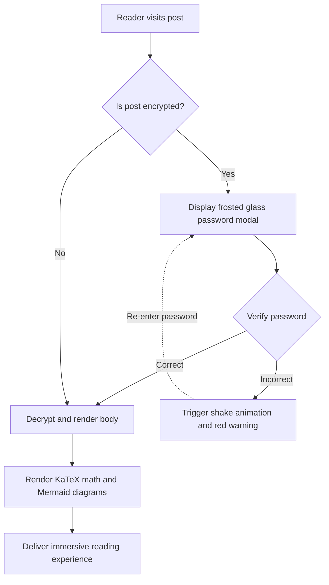
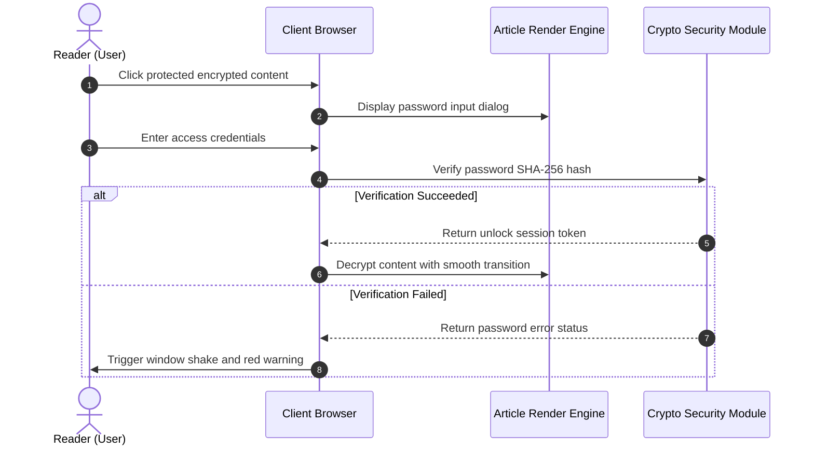

# Static Site Generators (SSG) and Theme Content Format Panorama Guide

In modern static site generators (SSG) and independent blog theme projects, **the parsing and rendering capabilities of article content formats** directly determine the creative boundaries of authors and the reading experience of readers.

This guide combines the content specifications of mainstream SSG ecosystems (**Hugo, Jekyll, Eleventy, Astro, Pelican, Hexo, WordPress, VitePress**, etc.) to establish a panoramic system covering **basic markup, extended document languages, WordPress Post Formats, interactive dropdown switchers, accordion folding, LaTeX mathematical formulas, Mermaid diagrams, and encryption/decryption special functions**, and provides plug‑and‑play live rendering demonstrations.

---

## 1. Summary of Content Format Support and Ecosystem for Mainstream Static Site Generators (SSG)

Different static site generators have different selection philosophies in their content parsing architecture. The table below systematically summarizes the native and extended support for various formats by mainstream engines:

| Static Site Generator / Platform | Core Parsing Engine | Native Built‑in Supported Formats | Extended / External Tool Supported Formats | Front Matter Serialization Support |
| :--- | :--- | :--- | :--- | :--- |
| **Hugo** | Goldmark (Go) | `.md` (CommonMark/GFM), `.html`, `.org` (Org‑mode) | `.adoc` (Asciidoctor), `.rst` (rst2html), `.pdc` (Pandoc) | YAML (`---`), TOML (`+++`), JSON (`{}`) |
| **Astro (this blog architecture)** | Vite + Unified/Remark + MDX | `.md` (GFM), `.mdx` (JSX), `.html`, `.astro` components | Can mount AST Loader extensions for Org/AsciiDoc/RST | YAML, TOML, JSON |
| **Jekyll** | Kramdown (Ruby) | `.md` (Kramdown/GFM), `.html` | `.textile` (Textile plugin) | YAML |
| **Eleventy (11ty)** | JavaScript template pipeline | `.md`, `.html`, `.liquid`, `.njk`, `.ejs`, `.webc` | MDX (plugin), custom template extensions | YAML, JSON, JS/11tydata |
| **Hexo** | Marked / Hexo‑Renderer | `.md` (GFM), `.html`, EJS/Pug templates | Org‑mode / Pandoc (plugin support) | YAML, JSON |
| **Pelican** | Python Docutils | `.md` (Markdown), `.rst` (reStructuredText) | `.asciidoc` (Asciidoctor) | YAML, Markdown Metadata |
| **WordPress (Headless/Theme)** | Gutenberg Block Engine | HTML5 Blocks, Shortcodes, Post Formats | Classic Editor HTML | JSON block metadata / Post Meta |
| **VitePress / Docusaurus** | Markdown‑It / MDX | `.md`, `.mdx`, Vue/React components | Custom container syntax (`::: tip`) | YAML |

> [!NOTE]
> **Ecosystem Architecture Insight**: Hugo, leveraging Go's native high concurrency, supports Markdown and Org‑mode; while modern front‑end SSGs represented by **Astro** leverage **MDX and component islands** to seamlessly embed dynamic interactive UIs (such as the dropdown switcher, password popup, vinyl record demonstrated in this article) into the text with ultimate flexibility.

---

## 2. Front Matter Serialization Format Support Specification

The metadata (Front Matter) at the top of a blog post determines the article's routing, title, date, categories, cover, and protection status. This theme supports all mainstream serialization modes:

### 1. YAML Format (most widely used, recommended default)

```yaml
---
title: "Article Title"
pubDate: 2026-08-28
author: "shijianus"
tags: ["Astro", "Markdown"]
featured: true
postFormat: "aside"
---
```

### 2. TOML Format (commonly used in Hugo)

```toml
+++
title = "Article Title"
pubDate = 2026-08-28T00:00:00Z
author = "shijianus"
tags = ["Astro", "Markdown"]
featured = true
+++
```

### 3. JSON Format (API‑driven and headless scenarios)

```json
{
  "title": "Article Title",
  "pubDate": "2026-08-28T00:00:00.000Z",
  "author": "shijianus",
  "tags": ["Astro", "Markdown"],
  "featured": true
}
```

---

## 3. Comparison of Special Lightweight Markup and Non‑Markdown Formats and Migration Reference

In different technology stacks, authors may use lightweight markup languages other than Markdown. The following provides the syntax features of mainstream formats and their equivalent rendering in this theme:

### 1. AsciiDoc (.adoc / .asciidoc)

AsciiDoc is common in technical books and long engineering manuals, featuring extremely rich note blocks and attribute systems:

```asciidoc
// AsciiDoc source syntax
= AsciiDoc Technical Specification
:author: shijianus
:toc: macro

[NOTE]
====
This is an AsciiDoc‑style note card.
====

[cols="1,2,1", options="header"]
|===
| Module | Description | Status
| Core Engine | Astro 6 static pipeline | Ready
|===
```

**Equivalent Markdown / MDX in this theme**:

> [!NOTE]
> This is an equivalent note card natively rendered in the Astro theme, with styles and interactions fully aligned.

| Module | Description | Status |
| :--- | :--- | :---: |
| **Core Engine** | Astro 6 static pipeline | <span class="badge badge-success">Ready</span> |

---

### 2. Emacs Org‑Mode (.org)

Org‑mode is a powerful tool for Emacs users for knowledge management, task tracking, and document writing:

```ini
#+TITLE: Emacs Org‑Mode Practice Notes
#+DATE: 2026-08-28
#+TAGS: Emacs OrgMode

* TODO Phase One: Markdown Scan Enhancement [1/2]
- [X] Fix table and mobile overflow
- [ ] Complete Org‑mode syntax converter

#+BEGIN_QUOTE
“Org‑mode is not just a format, but an executable thinking workflow.”
#+END_QUOTE
```

**Standard static GFM task list rendering in this theme (read‑only state)**:

- [x] Fix table and mobile overflow
- [ ] Complete Org‑mode syntax converter

> [!QUOTE]
> “Org‑mode is not just a format, but an executable thinking workflow.”

> “Org-mode is not just formatting, but also an executable thought workflow.”

**Standard static GFM task list presentation in this theme (read‑only state):**

- [x] Fix table overflow on mobile
- [ ] Complete Org‑mode syntax converter

> [!QUOTE] “Org-mode is not just formatting, but also an executable thought workflow.”

#### Interactive Task Checklist and Linked Progress Bar (Interactive Tutorial Checklist & Chained Progression)

In technical tutorials, practical exercises, and deployment guides, the traditional read‑only `[ ]` task list cannot intuitively interact and remember. This theme specifically adds a **interactive checklist that supports real‑time checking and chained status linkage (`.article-task-tracker`)**. Each time a reader checks an item, the dynamic progress bar will recalculate the percentage in real time. When all key steps are confirmed, it will also **automatically chain unlock downstream readiness commands**, making it ideal as a tutorial completion checklist:

<div class="article-task-tracker" data-storage-key="content-format-tutorial-demo">
  <div class="task-tracker__header">
    <div class="task-tracker__title">
      <svg width="20" height="20" viewBox="0 0 24 24" fill="none" stroke="currentColor" stroke-width="2"><path d="M9 11l3 3L22 4"/><path d="M21 12v7a2 2 0 0 1-2 2H5a2 2 0 0 1-2-2V5a2 2 0 0 1 2-2h11"/></svg>
      <span>Static Site Engineering Pre‑Deployment Checklist (Interactive Real‑Time Checking)</span>
    </div>
    <span class="task-tracker__count">1/4 steps completed (25%)</span>
  </div>
  <div class="task-tracker__bar-wrap">
    <div class="task-tracker__fill" style="width: 25%;"></div>
  </div>
  <ul class="task-checklist">
    <li class="task-checklist-item is-done">
      <input type="checkbox" checked id="chk-step-1" />
      <div class="task-item-body">
        <label for="chk-step-1" class="task-item-label">Step 1: Complete full local code backup and Git commit</label>
        <div class="task-item-desc">Confirm the current working tree is clean, record backup hash to the development audit log.</div>
      </div>
    </li>
    <li class="task-checklist-item">
      <input type="checkbox" id="chk-step-2" />
      <div class="task-item-body">
        <label for="chk-step-2" class="task-item-label">Step 2: Configure Cloudflare Pages static build pipeline</label>
        <div class="task-item-desc">Set <code>BLOG_BUILD_TARGET=static</code> and Node.js 20+ runtime environment.</div>
      </div>
    </li>
    <li class="task-checklist-item">
      <input type="checkbox" id="chk-step-3" />
      <div class="task-item-body">
        <label for="chk-step-3" class="task-item-label">Step 3: Verify media resources and external video/audio embedding</label>
        <div class="task-item-desc">Ensure all audio and video single files are strictly controlled within 25 MB, meeting CDN deployment specifications.</div>
      </div>
    </li>
    <li class="task-checklist-item">
      <input type="checkbox" id="chk-step-4" />
      <div class="task-item-body">
        <label for="chk-step-4" class="task-item-label">Step 4: Execute Playwright automated visual regression and smoke tests</label>
        <div class="task-item-desc">Verify that all rich‑media cards and interactive components are correctly laid out on PC and mobile across multiple resolutions.</div>
      </div>
    </li>
  </ul>
  <div class="task-tracker__status-card is-pending">
    <div class="status-card__header">
      <span class="badge badge-warning">⏳ Pending</span>
      <span style="font-weight:700;">Current progress: 1/4 (25%)</span>
    </div>
    <p style="margin-top:0.4rem;margin-bottom:0;font-size:0.88rem;line-height:1.6;">Please complete each step in the checklist above in order; when all tasks are completed, this area will automatically chain unlock the production release command in real time.</p>
  </div>
</div>

---

### 3. reStructuredText (.rst)

reStructuredText is the standard documentation format for the Python community (e.g., Sphinx, ReadTheDocs):

```rst
.. reStructuredText source syntax
.. note::
   This is a Note block defined by an RST directive.

.. code-block:: python
   :linenos:

   def greet(name: str) -> str:
       return f"Hello, {name}!"
```

**Markdown equivalent presentation in this theme:**

> [!NOTE]
> This is the RST Note equivalent card presented in Astro using the GitHub Alert specification.

```python
def greet(name: str) -> str:
    return f"Hello, {name}!"
```

---

### 4. Textile syntax

Textile is a classic lightweight markup language (commonly used in Redmine and early Jekyll blogs):

```markdown
h2. Chapter Title
bq. This is the content of a Textile block quote.
* List item 1
_ Italic emphasis text _
```

---

## Four, WordPress Style Article Formats (Post Formats) Full Implementation and Visual Presentation

The classic **Post Formats** mechanism in WordPress theme ecosystems allows blogs to display exclusive visual styles for different content types. In this theme’s main content area, we fully implement all nine formats:

### 1. `aside` (Light Talk / Sticky Note / Essay Card)

Suitable for recording short thoughts, reminders, or temporary notes:

<div class="article-aside">
  <p><strong>💡 Essay Memo</strong>: The true value of a static site lies not in flashy features, but in delivering a lightning‑fast, zero server‑maintenance pure reading experience. Even after five or ten years, the generated HTML files can still open perfectly.</p>
</div>


### 2. `status` (Status Updates / Ramblings / Micro Quotes)

Instant status posting cards similar to Twitter/Weibo style, featuring an author avatar, client identifier, and mood tags:

<div class="article-status">
  <div class="article-status__header">
    <div class="article-status__user">
      
      <div>
        <div class="article-status__name">shijianus</div>
        <div class="article-status__meta">Posted on 2026-08-28 14:32 · 🇨🇳 Hangzhou</div>
      </div>
    </div>
    <div class="article-status__badge">
      <span>📱 From Geek Workshop Mac Studio</span>
    </div>
  </div>
  <p class="article-status__content">
    Finally completed all format extensions and visual refactoring for the blog's main content area today! From KaTeX and Mermaid to interactive dropdowns and vinyl records, the feeling of full-stack static delivery is amazing 🚀✨
  </p>
</div>

---

### 3. `quote` (Featured Quotes / Quote Cards)

Used to showcase impactful quotes from notable figures, design maxims, or golden sayings:

<div class="article-quote">
  <div class="article-quote__icon">“</div>
  <div class="article-quote__body">
    Simplicity is prerequisite for reliability. (Simplicity is the prerequisite for reliability.)
  </div>
  <div class="article-quote__author">
    
    <div class="article-quote__author-info">
      <div class="article-quote__author-name">Edsger W. Dijkstra</div>
      <div class="article-quote__author-title">Computer Scientist · Turing Award Laureate (1972)</div>
    </div>
  </div>
</div>

---

### 4. `gallery` (Image Gallery / Responsive Albums & Polaroid Grid)

Supports multi-column adaptive responsive grids and Polaroid-style photo cards with a humanistic touch. Clicking any image triggers a full-screen lightbox zoom:

#### 2-Column and 3-Column Adaptive Gallery

<div class="article-gallery">
  <div class="gallery-grid gallery-grid-3">
    <div class="gallery-item">
      
      <div class="gallery-item__caption">Geek Workbench Panorama</div>
    </div>
    <div class="gallery-item">
      
      <div class="gallery-item__caption">System Architecture Design Dashboard</div>
    </div>
    <div class="gallery-item">
      
      <div class="gallery-item__caption">Galaxy Roaming Visual Cover</div>
    </div>
  </div>
</div>

#### Polaroid Photo Gallery (Polaroid Style)

<div class="gallery-polaroid">
  <div class="polaroid-card">
    
    <div class="polaroid-card__caption">2026.04 Hangzhou · R&D Base</div>
  </div>
  <div class="polaroid-card">
    
    <div class="polaroid-card__caption">2026.08 Architecture Evolution Refactoring Night</div>
  </div>
</div>

---

### 5. `video` (Responsive Video Player Card)

Supports 16:9 responsive aspect ratios, rounded borders, and bottom captions, occupying a full horizontal row per line. Compatible with external proxy-style embeds from Bilibili and YouTube, as well as native MP4 files hosted on-site (each file kept under 25MB to comply with Cloudflare Pages static deployment standards):

#### External Video Embeds (Bilibili & YouTube Proxy-Style Links · Readers must scroll to this section and click to start playing by default)

<div class="video-embed-card" data-video-type="bilibili">
  <iframe src="https://player.bilibili.com/player.html?bvid=BV11k4y1T7kS&page=1&high_quality=1&danmaku=0&autoplay=0" allowfullscreen="true" loading="lazy" allow="accelerometer; autoplay; clipboard-write; encrypted-media; gyroscope; picture-in-picture; web-share" sandbox="allow-top-navigation-by-user-activation allow-same-origin allow-forms allow-scripts allow-popups"></iframe>
  <div class="embed-caption">🎬 Bilibili External Embed Demo: BV11k4y1T7kS (1080P HD · Scroll to here and click to play)</div>
</div>

<div class="video-embed-card" data-video-type="youtube">
  <iframe src="https://www.youtube-nocookie.com/embed/LXb3EKWsInQ?autoplay=0&rel=0" allowfullscreen="true" loading="lazy" allow="accelerometer; autoplay; clipboard-write; encrypted-media; gyroscope; picture-in-picture; web-share"></iframe>
  <div class="embed-caption">🎬 YouTube External Embed Demo: Costa Rica 4K 60fps HDR Demo (1080P/4K · Valid URL · Scroll to this section and click to play)</div>
</div>

#### Native On-Site MP4 Video Embedding (Native HTML5 Video Player · Supports Playback Speed & Picture-in-Picture · Download Disabled by Default)

<div class="video-embed-card">
  <video controls controlsList="nodownload" preload="metadata" playsinline oncontextmenu="return false;">
    <source src="/media/video/landscape_compressed.mp4" type="video/mp4" />
    Your browser does not support HTML5 video playback.
  </video>
  <div class="embed-caption">🎥 Local Native Embedded Video 1: 4K/1080P Ultra-HD Landscape Demo (Size 21.7MB · Supports Playback Speed & Picture-in-Picture · Direct Download Disabled)</div>
</div>

<div class="video-embed-card">
  <video controls controlsList="nodownload" preload="metadata" playsinline oncontextmenu="return false;">
    <source src="/media/video/blue_archive_miracle.mp4" type="video/mp4" />
    Your browser does not support HTML5 video playback.
  </video>
  <div class="embed-caption">🎥 Local Native Embedded Video 2: [Blue Archive] "The Beginning and End of a Miracle—Our Story Is Decided by Us!" (Size 23.3MB · Supports Playback Speed & Picture-in-Picture · Direct Download Disabled)</div>
</div>

---

### 6. `audio` (Vinyl Record Rotating Music Card)

Built-in HTML5 audio controller, automatically triggering a **seamless, smooth vinyl record rotation animation** during playback. All album covers use officially matched, high-definition artwork. Supports multiple mainstream audio formats (Lossless FLAC, High-Bitrate MP3, AAC/M4A), with built-in anti-scraping and anti-download protection:

#### ① Shaun - Way Back Home (FLAC Lossless Audio Format · 24.55MB)

<div class="article-audio-card">
  <div class="audio-card__cover">
    
  </div>
  <div class="audio-card__info">
    <div class="audio-card__title">
      <span>Way Back Home</span>
      <span class="badge badge-purple">FLAC Lossless</span>
    </div>
    <div class="audio-card__author">Shaun (숀) · Lossless Audio (FLAC / 44.1kHz 16-bit 961 kbps)</div>
    <audio controls preload="metadata" controlsList="nodownload" oncontextmenu="return false;" src="/media/audio/WayBackHome.flac"></audio>
  </div>
</div>

#### ② ヨルシカ (Yorushika) - 彼女は旅に出る (MP3 320Kbps High-Definition Format · 8.41MB)

<div class="article-audio-card">
  <div class="audio-card__cover">
    
  </div>
  <div class="audio-card__info">
    <div class="audio-card__title">
      <span>彼女は旅に出る (She Leaves on a Journey)</span>
      <span class="badge badge-success">320 Kbps MP3</span>
    </div>
    <div class="audio-card__author">ヨルシカ (Yorushika) · High-Definition Stereo (MP3 / 48kHz 320 kbps)</div>
    <audio controls preload="metadata" controlsList="nodownload" oncontextmenu="return false;" src="/media/audio/彼女は旅に出る.mp3"></audio>
  </div>
</div>

#### ③ すこっぷ feat. 初音ミク - アイロニ (M4A / AAC Format · 7.63MB)

<div class="article-audio-card">
  <div class="audio-card__cover">
    
  </div>
  <div class="audio-card__info">
    <div class="audio-card__title">
      <span>アイロニ (Irony / Satire)</span>
      <span class="badge badge-cyan">M4A / AAC</span>
    </div>
    <div class="audio-card__author">すこっぷ feat. 初音ミク · AAC Audio (M4A / 44.1kHz 260 kbps)</div>
    <audio controls preload="metadata" controlsList="nodownload" oncontextmenu="return false;" src="/media/audio/アイロニ.m4a"></audio>
  </div>
</div>

---

### 7. `link` (External Links and Bookmark Preview Card / Bookmark Preview)

Provide elegant card-style previews for key reference sources within the article:

<a class="article-bookmark" href="https://github.com/shijianus/shijianus-blog" target="_blank" rel="noopener">
  <div class="article-bookmark__content">
    <div class="article-bookmark__title">EpoCanvas / shijianus-blog (Time Blog Theme Core Design Specification Repository)</div>
    <p class="article-bookmark__desc">EpoCanvas (Era Canvas) is a modern geek blog content architecture system focused on high-density information presentation, elegant micro-interactions, and full-format support.</p>
    <div class="article-bookmark__site">
      <span class="badge badge-primary">GitHub</span>
      <span>github.com · EpoCanvas Core Spec</span>
    </div>
  </div>
  <div class="article-bookmark__icon">
    <svg viewBox="0 0 24 24" width="24" height="24" fill="none" stroke="currentColor" stroke-width="2" stroke-linecap="round" stroke-linejoin="round"><path d="M18 13v6a2 2 0 0 1-2 2H5a2 2 0 0 1-2-2V8a2 2 0 0 1 2-2h6"/><polyline points="15 3 21 3 21 9"/><line x1="10" y1="14" x2="21" y2="3"/></svg>
  </div>
</a>

---

### 8. `chat` (Chat Bubble Dialogue Flow / Organic Animated Dialogue Stream)

Used to vividly demonstrate technical defense, two-person dialogue discussions, or user interview scenarios, supporting left/right bubbles, inline code, custom color schemes, and **dynamic content adaptive typing animation, Web Audio synthesized sound effects, and dynamic avatars (`footer_mini_logo__media`)**:

* **Static mode (default)**: `<div class="article-chat" data-animate="true" data-sound="true">
  <div class="chat-message chat-left">
    <span class="chat-avatar footer_mini_logo__media">
      <video autoplay muted loop playsinline preload="metadata" poster="/media/shijianus/avatar.jpg" aria-hidden="true">
        <source src="/media/shijianus/avatar-dynamic.mp4" type="video/mp4" />
      </video>
      
    </span>
    <div class="chat-body">
      <div class="chat-author">Developer <a href="https://github.com/LeonBoven" target="_blank" rel="noopener noreferrer">Léon Boven</a> · 10:15</div>
      <div class="chat-bubble">
        Hello! May I ask whether implementing static rendering of <code>KaTeX</code> and <code>Mermaid</code> in Astro will slow down the front-end page load speed?
      </div>
    </div>
  </div>

  <div class="chat-message chat-right">
    
    <div class="chat-body">
      <div class="chat-author">Architect <a href="https://github.com/shijianus" target="_blank" rel="noopener noreferrer">shijianus</a> · 10:16</div>
      <div class="chat-bubble">
        Absolutely not! Because <code>remark-math</code> and <code>rehype-katex</code> compile the formulas into pure HTML/MathML strings during the build phase (Build-time), the browser side has <strong>0 JS runtime overhead</strong>; and Mermaid diagrams also dynamically load ESM modules on demand asynchronously, making the first screen extremely light! ⚡
      </div>
    </div>
  </div>

  <div class="chat-message chat-left">
    <span class="chat-avatar footer_mini_logo__media">
      <video autoplay muted loop playsinline preload="metadata" poster="/media/shijianus/avatar.jpg" aria-hidden="true">
        <source src="/media/shijianus/avatar-dynamic.mp4" type="video/mp4" />
      </video>
      
    </span>
    <div class="chat-body">
      <div class="chat-author">Developer <a href="https://github.com/LeonBoven" target="_blank" rel="noopener noreferrer">Léon Boven</a> · 10:17</div>
      <div class="chat-bubble">
        Great! So we can directly write architecture sequence diagrams and interactive unit converters in Markdown, and they are ready to use out of the box, right?
      </div>
    </div>
  </div>

  <div class="chat-message chat-right">
    
    <div class="chat-body">
      <div class="chat-author">Architect <a href="https://github.com/shijianus" target="_blank" rel="noopener noreferrer">shijianus</a> · 10:18</div>
      <div class="chat-bubble">
        Yes! Not only does it support double-click zoom and high-definition SVG export fully, but the unit converter also integrates <strong>real-time online foreign exchange rate synchronization</strong> and <strong>base unit dropdown switching</strong>, and it guarantees a complete symmetric expression of fixed-quantity units; all metrics have been rigorously tested! 🚀
      </div>
    </div>
  </div>

  <div class="chat-message chat-left">
    <span class="chat-avatar footer_mini_logo__media">
      <video autoplay muted loop playsinline preload="metadata" poster="/media/shijianus/avatar.jpg" aria-hidden="true">
        <source src="/media/shijianus/avatar-dynamic.mp4" type="video/mp4" />
      </video>
      
    </span>
    <div class="chat-body">
      <div class="chat-author">Developer <a href="https://github.com/LeonBoven" target="_blank" rel="noopener noreferrer">Léon Boven</a> · 10:19</div>
      <div class="chat-bubble">
        Got it! The interaction feels natural and the typing animation changes according to the length of the message; I am going to upgrade the team technical documentation library now! 🎉
      </div>
    </div>
  </div>

  <div class="chat-message chat-right">
    
    <div class="chat-body">
      <div class="chat-author">Architect <a href="https://github.com/shijianus" target="_blank" rel="noopener noreferrer">shijianus</a> · 10:20</div>
      <div class="chat-bubble">
        Welcome to try it! If you encounter any format extensions or customization needs later, feel free to discuss them in the discussion area or on GitHub~ ✨
      </div>
    </div>
  </div>
</div>

---

## 5. Special Dropdown Formats and Dynamic Interactive Components (Dropdown Selectors & Interactive Formats)

For users who explicitly request **special dropdown formats**, we provide a purely client-side, instant-response dropdown selector component at the article body level:

### 1. Multi-Framework and Multi-Code-Version Dropdown Switcher (Interactive Dropdown Switch ...)


<div class="article-dropdown-switcher">
  <div class="article-dropdown-switcher__header">
    <div class="article-dropdown-switcher__title">
      <svg width="20" height="20" viewBox="0 0 24 24" fill="none" stroke="currentColor" stroke-width="2"><rect x="3" y="3" width="18" height="18" rx="2"/><path d="M9 3v18"/><path d="m14 9 3 3-3 3"/></svg>
      <span>Please select the frontend framework implementation code to view:</span>
    </div>
    <select class="article-select dropdown-switcher__select">
      <option value="react-tab">⚛️ React 19 (Hooks & TSX)</option>
      <option value="vue-tab">🟢 Vue 3.5 (Composition API)</option>
      <option value="astro-tab">🚀 Astro 6 (Island Component)</option>
      <option value="svelte-tab">🟠 Svelte 5 (Runes)</option>
    </select>
  </div>
  <div class="article-dropdown-switcher__body">
    <div class="article-dropdown-panel is-active" data-panel="react-tab">
      <div class="article-dropdown-panel__title">⚛️ React 19 Component Implementation:</div>
      <pre class="no-code-enhance"><code class="language-tsx">import { useState } from 'react';
export function Counter() {
  const [count, setCount] = useState(0);
  return (
    &lt;button onClick={() =&gt; setCount((c) =&gt; c + 1)} className="btn-primary"&gt;
      React 点击计数：&#123;count&#125;
    &lt;/button&gt;
  );
}</code></pre>
    </div>
    <div class="article-dropdown-panel" data-panel="vue-tab">
      <div class="article-dropdown-panel__title">🟢 Vue 3.5 SFC Implementation:</div>
      <pre class="no-code-enhance"><code class="language-html">&lt;script setup lang="ts"&gt;
import { ref } from 'vue';
const count = ref(0);
&lt;/script&gt;
&lt;template&gt;
  &lt;button @click="count++" className="btn-primary"&gt;
    Vue 点击计数：&#123;&#123; count &#125;&#125;
  &lt;/button&gt;
&lt;/template&gt;</code></pre>
    </div>
    <div class="article-dropdown-panel" data-panel="astro-tab">
      <div class="article-dropdown-panel__title">🚀 Astro 6 Zero-JS Static Island:</div>
      <pre class="no-code-enhance"><code class="language-astro">---
const { title = "Astro 极速群岛" } = Astro.props;
---
&lt;div class="astro-island"&gt;
  &lt;h3&gt;&#123;title&#125;&lt;/h3&gt;
  &lt;p&gt;默认交付 0KB JavaScript，按需注水交互！&lt;/p&gt;
&lt;/div&gt;</code></pre>
    </div>
    <div class="article-dropdown-panel" data-panel="svelte-tab">
      <div class="article-dropdown-panel__title">🟠 Svelte 5 Runes Implementation:</div>
      <pre class="no-code-enhance"><code class="language-svelte">&lt;script lang="ts"&gt;
  let count = $state(0);
&lt;/script&gt;
&lt;button onclick={() =&gt; count++} class="btn-primary"&gt;
  Svelte 点击计数：&#123;count&#125;
&lt;/button&gt;</code></pre>
    </div>
  </div>
</div>

---

### 2. Interactive Multi-category Universal Unit Converter (Universal Interactive Unit Converter · Base Unit Dropdown Switch and Real-time Exchange Rates)

* **Dynamic Switchable Base Unit (Base Unit Dropdown)**: The base unit on the right side of the input box supports free selection via dropdown (e.g., in weight you can choose `kg`, `g`, `lb`, `斤`, `oz`, `t`, etc.; in exchange rates you can choose `USD`, `HKD`, `CNY`, `EUR`, `JPY`, `GBP`, etc.). After selecting any base unit, the target conversion grid will **intelligently exclude the current base unit (completely eliminate redundant cards like 1kg=1kg)**, and instantly recalculate all target units with the current base as the denominator;  
* **Real-time Exchange Rate Fluctuation Network Access (Live Forex API)**: When switching to "💱 International Exchange Rates", the system will automatically asynchronously request the server endpoint `/api/exchange-rate` and fall back to the public real-time exchange rate API, retrieving the latest real-time rates for major currencies (displayed as `🟢 Real-time network rates synchronized` in the top right). When offline or disconnected, it automatically seamlessly falls back to the built-in base ratio (displayed as `⚪ Offline base rate`), ensuring that "real-time" is truly real-time and the offline experience is rock-solid;  
* **Convenient Universal API Calls**: The system also globally exposes the helper function `window.shijianusAPI.fetchExchangeRates(base)`, making it easy for any custom script within the document to instantly call real-time rate data;  
* **Quick One-click Copy and Equation Calculation**: Each conversion card provides a one-click copy button with highlighted feedback, and the bottom synchronously displays a dynamic equation chain calculation summary.

<div class="interactive-unit-converter" data-default="1" data-title="🔄 Interactive Universal Unit Converter (Base Unit Switching & Live Exchange Rates)"></div>


### 3. Specification Parameters & Video Codec Dropdown Calculator (Interactive Spec Calc Dropdown)

When selecting different options, the corresponding technical specifications and conversion details are displayed in real-time on the right:

<div class="interactive-calc-select">
  <div class="article-select-box">
    <label>
      <svg width="18" height="18" viewBox="0 0 24 24" fill="none" stroke="currentColor" stroke-width="2"><circle cx="12" cy="12" r="10"/><path d="M12 6v6l4 2"/></svg>
      <span>Select Video Codec Resolution:</span>
    </label>
    <select class="article-select">
      <option value="1080p" data-desc="1920 × 1080 @ 60fps · Bitrate 6,000 Kbps · Recommended Bandwidth 15 Mbps">1080P Full HD (1080p60)</option>
      <option value="2k" data-desc="2560 × 1440 @ 60fps · Bitrate 12,000 Kbps · Recommended Bandwidth 30 Mbps">2K QHD (1440p60)</option>
      <option value="4k" data-desc="3840 × 2160 @ 60fps · Bitrate 25,000 Kbps · Recommended Bandwidth 60 Mbps">4K UHD (2160p60 HDR)</option>
      <option value="8k" data-desc="7680 × 4320 @ 60fps · Bitrate 80,000 Kbps · Recommended Bandwidth 200 Mbps">8K Cinematic (4320p60 AV1)</option>
    </select>
  </div>
  <div class="calc-output-box">
    <span>📊 <strong>Technical Specification Calculation Result</strong>:</span>
    <span class="calc-output-value">1920 × 1080 @ 60fps · Bitrate 6,000 Kbps · Recommended Bandwidth 15 Mbps</span>
  </div>
</div>

---

## VI. Accordion Collapsibles, Tabs & Multi-Column Layouts (Collapsibles, Tabs & Columns)

### 1. Exclusive Accordion Group (Exclusive Accordion Group · Expanding One Item Automatically Closes Others)

Configure `data-single="true"`. When one item is expanded, other expanded items within the same group will automatically collapse in sync, keeping the page clean and focused:

<div class="article-accordion-group" data-single="true">
  <details class="article-accordion" open>
    <summary>
      <span>🔒 1. Security Advantages of Static Sites</span>
      <svg class="accordion-chevron" viewBox="0 0 24 24" fill="none" stroke="currentColor" stroke-width="2"><polyline points="9 18 15 12 9 6"/></svg>
    </summary>
    <div class="accordion-content">
      <p>Static sites lack traditional PHP/Node.js dynamic execution engines and publicly exposed SQL databases, providing physical-level immunity against SQL injection and server-side remote code execution (RCE) risks.</p>
    </div>
  </details>

  <details class="article-accordion">
    <summary>
      <span>⚡ 2. Global CDN Edge Acceleration Delivery</span>
      <svg class="accordion-chevron" viewBox="0 0 24 24" fill="none" stroke="currentColor" stroke-width="2"><polyline points="9 18 15 12 9 6"/></svg>
    </summary>
    <div class="accordion-content">
      <p>By deploying compiled assets to Cloudflare Pages or GitHub Pages, all static resources can be cached across 300+ global edge nodes, with Time to First Byte (TTFB) typically under 20ms.</p>
    </div>
  </details>

  <details class="article-accordion">
    <summary>
      <span>💰 3. Extremely Low Cloud Hosting Costs</span>
      <svg class="accordion-chevron" viewBox="0 0 24 24" fill="none" stroke="currentColor" stroke-width="2"><polyline points="9 18 15 12 9 6"/></svg>
    </summary>
    <div class="accordion-content">
      <p>Static sites do not require running expensive VPS cloud servers 24/7. Paired with free-tier Cloudflare D1 databases and Serverless comment systems, daily operational costs are nearly zero.</p>
    </div>
  </details>
</div>

---

### 2. Non-Exclusive Independent Accordion Group (Multi-Expand / Non-Exclusive Accordion Group · Allows Multiple Items to Be Expanded Simultaneously)

Configure `data-single="false"` (or default multi-open mode). Readers can freely expand multiple or all collapsible items for side-by-side comparison and in-depth reading, without closing already opened content when expanding new items:

<div class="article-accordion-group" data-single="false">
  <details class="article-accordion" open>
    <summary>
      <span>🛠️ Architecture Module A: Markdown AST Syntax Compiler Pipeline</span>
      <svg class="accordion-chevron" viewBox="0 0 24 24" fill="none" stroke="currentColor" stroke-width="2"><polyline points="9 18 15 12 9 6"/></svg>
    </summary>
    <div class="accordion-content">
      <p>Built on the Unified, Remark-math, and Rehype-katex architecture, the Markdown syntax tree is completely statically converted into standard semantic HTML nodes during the compilation build phase, with syntax highlighting and formula rendering completed on the Node.js side.</p>
    </div>
  </details>

<details class="article-accordion" open>
    <summary>
      <span>🎨 Architecture Module B: EpoCanvas Dynamic Visual Engine and Responsive System</span>
      <svg class="accordion-chevron" viewBox="0 0 24 24" fill="none" stroke="currentColor" stroke-width="2"><polyline points="9 18 15 12 9 6"/></svg>
    </summary>
    <div class="accordion-content">
      <p>Provides Aurora background, Starfield parallax, Glassmorphism, and multi-device responsive breakpoint adaptation, delivering a consistent aesthetic experience on both 4K widescreens and foldable phones.</p>
    </div>
  </details>

<details class="article-accordion">
    <summary>
      <span>🛡️ Architecture Module C: WebCrypto SHA-256 Tiered Security Isolation System</span>
      <svg class="accordion-chevron" viewBox="0 0 24 24" fill="none" stroke="currentColor" stroke-width="2"><polyline points="9 18 15 12 9 6"/></svg>
    </summary>
    <div class="accordion-content">
      <p>Built-in Level 1 session persistent unlock, Level 2 anti-peeking dynamic polymorphic mask (Gaussian blur/mosaic/spoiler mask), Level 3 viewport sentinel auto-lock on exit, and external URL sharding encryption scheme, completely eliminating plaintext password exposure in the DOM.</p>
    </div>
  </details>
</div>

---

### 3. Interactive Tabs

<div class="article-tabs">
  <div class="article-tabs__nav">
    <button class="article-tabs__button is-active" type="button">pnpm</button>
    <button class="article-tabs__button" type="button">npm</button>
    <button class="article-tabs__button" type="button">yarn</button>
    <button class="article-tabs__button" type="button">bun</button>
  </div>
  <div class="article-tabs__panels">
    <div class="article-tabs__panel is-active">
      <pre class="no-code-enhance"><code class="language-bash">pnpm add @astrojs/mdx remark-math rehype-katex katex mermaid</code></pre>
    </div>
    <div class="article-tabs__panel">
      <pre class="no-code-enhance"><code class="language-bash">npm install @astrojs/mdx remark-math rehype-katex katex mermaid</code></pre>
    </div>
    <div class="article-tabs__panel">
      <pre class="no-code-enhance"><code class="language-bash">yarn add @astrojs/mdx remark-math rehype-katex katex mermaid</code></pre>
    </div>
    <div class="article-tabs__panel">
      <pre class="no-code-enhance"><code class="language-bash">bun add @astrojs/mdx remark-math rehype-katex katex mermaid</code></pre>
    </div>
  </div>
</div>

### 3. Multi-Tab Options (Interactive Tabs)

### 4. Multi-Column Grid Layout System (Multi-Column Grid)

#### 3-Column Equal-Width Card Grid

<div class="article-grid article-grid-3">
  <div class="article-col-card">
    <h4>🎨 Visual System</h4>
    <p>Deeply absorb the modern geek design aesthetics of EpoCanvas, supporting high contrast light/dark, frosted glass background, and smooth color transitions.</p>
  </div>
  <div class="article-col-card">
    <h4>⚡ Performance Engineering</h4>
    <p>Astro 6 static island architecture, pre-rendered HTML at build time, pure static extreme SEO optimization.</p>
  </div>
  <div class="article-col-card">
    <h4>🛠️ Extension Ecosystem</h4>
    <p>Fully supports KaTeX formulas, Mermaid diagrams, encrypted pop-ups, and 9 types of Post Formats.</p>
  </div>
</div>

#### 1:2 Unequal Sidebar Grid

<div class="article-grid article-columns-1-2">
  <div class="article-col-card">
    <h4>📌 Architecture Positioning</h4>
    <p>Focused on a modern technical writing platform for geeks and engineers.</p>
  </div>
  <div class="article-col-card">
    <h4>🚀 Delivery Assurance</h4>
    <p>Built-in comprehensive automated smoke testing and static build verification mechanisms, ensuring that formulas, diagrams, or complex cards are rendered flawlessly across all devices.</p>
  </div>
</div>

## VII. 13 Types of Semantic Notice Boxes (Admonitions / GitHub Alerts)

> [!NOTE]
> **General Note (Note)**: This is a standard background information or contextual explanation.

> [!TIP]
> **Practical Tip (Tip)**: Using the shortcut <kbd>Ctrl</kbd> + <kbd>K</kbd> can quickly bring up the global article search panel!

> [!IMPORTANT]
> **Important Matter (Important)**: Before deploying to production, please ensure that the `BLOG_BUILD_TARGET=static` environment variable has been correctly injected.

> [!WARNING]
> **Risk Warning (Warning)**: Do not submit production database keys or cloud service private keys to public Git repositories.

> [!CAUTION]
> **Danger Warning (Caution)**: Executing data table rebuild operations is destructive; please back up the D1 database first!

> [!DANGER]
> **Fatal Danger (Danger)**: Directly deleting the production database will permanently destroy all comments and user assets.

> [!SUCCESS]
> **Operation Successful (Success)**: The static build process has successfully completed, and all 47 static routes are ready!

> [!QUESTION]
> **In-depth Discussion (Question)**: How to achieve millisecond-level pure client-side full-text search in an environment with no server-side dependencies?

> [!QUOTE]
> **Featured Quote (Quote)**: "Excellent code can not only be executed by machines, but also convey ideas to humans as elegantly as poetry."

> [!INFO]
> **Detailed Information (Info)**: This blog is built with Astro 6 and Tailwind 4, featuring a fully static site export.

> [!TODO]
> **Pending Plan (Todo)**: Plan to introduce a WebAssembly client-side full-text search index in the next iteration.

> [!BUG]
> **Defect Record (Bug)**: Fixed a layout issue in the old version where tables were horizontally truncated on extremely narrow-screen devices.

> [!EXAMPLE]
> **Example Description (Example)**: All the above callout boxes automatically adapt to high-contrast colors for both dark and light modes.

### Collapsible Callout Box Demo

> [!TIP]- Click to expand: Reference for Nginx high-speed caching configuration in production environments
> ```nginx
> location ~* \.(?:css|js|woff2?|svg|png|jpg|webp)$ {
>     expires 1y;
>     add_header Cache-Control "public, immutable";
>     access_log off;
> }
> ```

---

## 8. Academic Math Formulas (KaTeX), Architecture Diagrams (Mermaid 11), and Dynamic Mind Maps (Markmap)

In demonstrative and example-based technical documentation, the core presentation philosophy is **"Actual Rendered Effect + Corresponding Source Code Comparison"** (dual-tab Tabs). This not only allows readers to intuitively experience the final visual and interactive characteristics but also enables developers to easily reference, copy, and migrate the code to actual projects with a single click.

---

### 1. LaTeX Math Formulas (KaTeX Math · Inline and Block-level Multi-line Derivations)

#### Inline Formula

<div class="article-tabs">
<div class="article-tabs__nav">
<button class="article-tabs__button is-active" type="button">🌟 Rendered Effect</button>
<button class="article-tabs__button" type="button">💻 LaTeX Source Code</button>
</div>
<div class="article-tabs__panels">
<div class="article-tabs__panel is-active">

Mass-energy equation $E = mc^2$, Euler's identity $e^{i\pi} + 1 = 0$, Gaussian integral $\int_{-\infty}^{\infty} e^{-x^2} dx = \sqrt{\pi}$.

</div>
<div class="article-tabs__panel">

```latex
Mass-energy equation $E = mc^2$, Euler's identity $e^{i\pi} + 1 = 0$, Gaussian integral $\int_{-\infty}^{\infty} e^{-x^2} dx = \sqrt{\pi}$.
```

</div>
</div>
</div>

#### Block-level Multi-line Derivation Formula 1: Laplace Transform of Second-Order Dynamic Systems (Block Math · Single Equation)

<div class="article-tabs">
<div class="article-tabs__nav">
<button class="article-tabs__button is-active" type="button">🌟 Rendered Effect</button>
<button class="article-tabs__button" type="button">💻 LaTeX Source Code</button>
</div>
<div class="article-tabs__panels">
<div class="article-tabs__panel is-active">

$$
\mathcal{L}\{\ddot{x}(t) + 2\zeta\omega_n\dot{x}(t) + \omega_n^2 x(t)\} = X(s)(s^2 + 2\zeta\omega_n s + \omega_n^2)
$$

</div>
<div class="article-tabs__panel">

```latex
$$
\mathcal{L}\{\ddot{x}(t) + 2\zeta\omega_n\dot{x}(t) + \omega_n^2 x(t)\} = X(s)(s^2 + 2\zeta\omega_n s + \omega_n^2)
$$
```

</div>
</div>
</div>

#### Block-level Multi-line Derivation Formula 2: Maxwell's Classical Electromagnetic Equations (Block Math · Multi-line Aligned)

<div class="article-tabs">
<div class="article-tabs__nav">
<button class="article-tabs__button is-active" type="button">🌟 Rendered Effect</button>
<button class="article-tabs__button" type="button">💻 LaTeX Source Code</button>
</div>
<div class="article-tabs__panels">
<div class="article-tabs__panel is-active">

$$
\begin{aligned}
\nabla \cdot \mathbf{E} &= \frac{\rho}{\varepsilon_0} \\
\nabla \cdot \mathbf{B} &= 0 \\
\nabla \times \mathbf{E} &= -\frac{\partial \mathbf{B}}{\partial t} \\
\nabla \times \mathbf{B} &= \mu_0 \mathbf{J} + \mu_0 \varepsilon_0 \frac{\partial \mathbf{E}}{\partial t}
\end{aligned}
$$

</div>
<div class="article-tabs__panel">

```latex
$
\begin{aligned}
\nabla \cdot \mathbf{E} &= \frac{\rho}{\varepsilon_0} \\
\nabla \cdot \mathbf{B} &= 0 \\
\nabla \times \mathbf{E} &= -\frac{\partial \mathbf{B}}{\partial t} \\
\nabla \times \mathbf{B} &= \mu_0 \mathbf{J} + \mu_0 \varepsilon_0 \frac{\partial \mathbf{E}}{\partial t}
\end{aligned}
$
```

</div>
</div>
</div>

---

### 2. Mermaid 11 Architecture Diagrams (Flowchart & Sequence)

#### ① Blog Encryption Verification & Content Rendering Flowchart (Flowchart TD)

<div class="article-tabs">
<div class="article-tabs__nav">
<button class="article-tabs__button is-active" type="button">🌟 Live Render Preview</button>
<button class="article-tabs__button" type="button">💻 Mermaid Source</button>
</div>
<div class="article-tabs__panels">
<div class="article-tabs__panel is-active">



</div>
<div class="article-tabs__panel">

````markdown

````

</div>
</div>
</div>

#### ② 客户端安全鉴权与解密时序图（Sequence Diagram）

<div class="article-tabs">
<div class="article-tabs__nav">
<button class="article-tabs__button is-active" type="button">🌟 Live Render Preview</button>
<button class="article-tabs__button" type="button">💻 Mermaid Source</button>
</div>
<div class="article-tabs__panels">
<div class="article-tabs__panel is-active">



</div>
<div class="article-tabs__panel">

````markdown

````

</div>
</div>
</div>

---

### 3. Dynamic Interactive Mindmap (Markmap / Mindmap · Multi-directional Branch Expansion)

In long-form technical specifications and system architecture overviews, traditional static lists struggle to present complex knowledge hierarchies intuitively. This theme features an all-new **Markmap Dynamic Interactive Mindmap Engine**, providing native parsing and interaction enhancements directly in the article's main body (`.post.post-page-shell`):

> [!TIP]
> **Core Rules for Multi-directional Branch Expansion**:
> 1. **Default Single-Block Protected View**: By default, the mindmap only displays **1 core root node** (Level 1), with a folded circle indicator on the right;
> 2. **Click to Expand Multi-directional Branches**: Click the small circle on the root node or any child node to **smoothly expand** its sub-branches outward;
> 3. **Comprehensive Toolbar Control**: Supports **Zoom In / Zoom Out / Fit View / Expand All / Collapse to Root / Fullscreen Immersive View / Copy Source**;
> 4. **Canvas Panning and Zooming**: Hold the left mouse button to drag and pan the canvas, and use the mouse wheel to zoom in and out.

#### Live Mindmap Presentation: SSG and Theme Content Format Ecosystem Panorama

<div class="article-tabs">
<div class="article-tabs__nav">
<button class="article-tabs__button is-active" type="button">🌟 Interactive Mindmap View</button>
<button class="article-tabs__button" type="button">💻 Mindmap Source Code</button>
</div>
<div class="article-tabs__panels">
<div class="article-tabs__panel is-active">

```mindmap
# Static Site Generators & Full-Format Content Ecosystem Architecture
## 1. Static Compilation Core Pipeline
### AST Syntax Transformation Pipeline
#### Markdown / MDX Semantic Parsing Pipeline
##### Unified / Remark Syntax Extensions
- GFM Tables and Strikethrough Syntax Translation
- Automatic Heading Anchor and ID Generation
##### Markmap Interactive Multi-directional Mindmap Extension
- Recursive AST Tree Construction (Transformer.transform)
- D3 Hierarchical Elastic Layout (Flextree Algorithm)
- Interactive Folding State Machine (payload.fold)
- Dynamic Palette Branch Coloring (d3.scaleOrdinal)
##### Rehype KaTeX Mathematical Formula Extension
- Inline and Block Math Expression Parsing
- Macro Definition Support and Error Fallback
#### Code Highlighting and Static Shaders
##### Shiki Dual-Theme Compiler
- VSCode TextMate Syntax Rule Parsing
- Light/Dark Dual-Theme Pre-rendering with Zero Hydration
### Compiler and Asset Bundling
#### Vite 6 Blazing-Fast Hot Module Replacement (HMR)
##### Native ESM Module Loading
- Millisecond On-Demand Compilation & Hot Updates
#### Rollup Static Generation Pipeline
##### Static Bundling Optimization
- Intelligent Code Splitting
- Tree-Shaking Redundancy Elimination
## 2. Dynamic Interactions & Islands Architecture
### Hybrid Component Islands
#### Client Component Island Mounting
##### React 19 Client Components
- Isolated State and Cross-Context Communication
- Session State Persistence (SessionStorage / Crypto)
##### Astro Server-Side Islands
- Zero-JS by Default Client Runtime
- On-Demand Hydration (client:visible)
### Modern Visual & Motion System
#### Dynamic Backgrounds & Render Engines
##### Aurora Borealis / Starfield Parallax
- WebGL / Canvas 2D Hardware Acceleration
- Power Saving Mode with Viewport Auto-Pause
##### Glassmorphism Card Specification
- Dynamic Gaussian Blur & Layered Ambient Shadows
- Responsive Multi-device Layout (PC / Tablet / Mobile)
## 3. Format Panorama & Specialized Features
### Extended Document Specifications Comparison
#### AsciiDoc (.adoc) Native Equivalent Adaptation
#### Emacs Org-Mode (.org) Task List Mapping
#### reStructuredText (.rst) Directive Translation
### Rich Interactive Component Suite
#### Interactive Dropdown Switcher
#### Mutually Exclusive Accordion Groups
#### Dynamic Vinyl Audio Player
### Security, Privacy and Tiered Encryption
#### WebCrypto SHA-256 Hash Verification (Zero Plaintext Exposure)
#### Level 1 Session Persistent Unlock
#### Level 2 Privacy Mask Switching (Gaussian Blur / Mosaic / Spoiler)
#### Level 3 Viewport Sentinel Auto-Lock on Exit (IntersectionObserver)
#### External Link Segment Decryption Endpoint Isolation (Standalone Token)
```
</div>
<div class="article-tabs__panel">

````markdown
```mindmap
# Static Site Generators & Full-Format Content Ecosystem Architecture
## 1. Static Compilation Core Pipeline
### AST Syntax Transformation Pipeline
#### Markdown / MDX Semantic Parsing Pipeline
##### Unified / Remark Syntax Extensions
- GFM Tables and Strikethrough Syntax Translation
- Automatic Heading Anchor and ID Generation
##### Markmap Interactive Multi-directional Mindmap Extension
- Recursive AST Tree Construction (Transformer.transform)
- D3 Hierarchical Elastic Layout (Flextree Algorithm)
- Interactive Folding State Machine (payload.fold)
- Dynamic Palette Branch Coloring (d3.scaleOrdinal)
##### Rehype KaTeX Mathematical Formula Extension
- Inline and Block Math Expression Parsing
- Macro Definition Support and Error Fallback
#### Code Highlighting and Static Shaders
##### Shiki Dual-Theme Compiler
- VSCode TextMate Syntax Rule Parsing
- Light/Dark Dual-Theme Pre-rendering with Zero Hydration
### Compiler and Asset Bundling
#### Vite 6 Blazing-Fast Hot Module Replacement (HMR)
##### Native ESM Module Loading
- Millisecond On-Demand Compilation & Hot Updates
#### Rollup Static Generation Pipeline
##### Static Bundling Optimization
- Intelligent Code Splitting
- Tree-Shaking Redundancy Elimination
## 2. Dynamic Interactions & Islands Architecture
### Hybrid Component Islands
#### Client Component Island Mounting
##### React 19 Client Components
- Isolated State and Cross-Context Communication
- Session State Persistence (SessionStorage / Crypto)
##### Astro Server-Side Islands
- Zero-JS by Default Client Runtime
- On-Demand Hydration (client:visible)
### Modern Visual & Motion System
#### Dynamic Backgrounds & Render Engines
##### Aurora Borealis / Starfield Parallax
- WebGL / Canvas 2D Hardware Acceleration
- Power Saving Mode with Viewport Auto-Pause
##### Glassmorphism Card Specification
- Dynamic Gaussian Blur & Layered Ambient Shadows
- Responsive Multi-device Layout (PC / Tablet / Mobile)
## 3. Format Panorama & Specialized Features
### Extended Document Specifications Comparison
#### AsciiDoc (.adoc) Native Equivalent Adaptation
#### Emacs Org-Mode (.org) Task List Mapping
#### reStructuredText (.rst) Directive Translation
### Rich Interactive Component Suite
#### Interactive Dropdown Switcher
#### Mutually Exclusive Accordion Groups
#### Dynamic Vinyl Audio Player
### Security, Privacy and Tiered Encryption
#### WebCrypto SHA-256 Hash Verification (Zero Plaintext Exposure)
#### Level 1 Session Persistent Unlock
#### Level 2 Privacy Mask Switching (Gaussian Blur / Mosaic / Spoiler)
#### Level 3 Viewport Sentinel Auto-Lock on Exit (IntersectionObserver)
#### External Link Segment Decryption Endpoint Isolation (Standalone Token)
```
````

</div>
</div>
</div>

#### Markdown Writing Standards and Syntax Reference

This blog integrates a **Mindmap rendering engine** based on recursive AST parsing and D3 Flextree elastic tree layout, **natively supporting unlimited hierarchical expansion (Level 1 to Level N)** with no depth limit. When writing articles, authors can choose the following writing standards based on the depth and complexity of the knowledge tree:

##### 1. Mixed Ladder Syntax (Recommended 1~6 Core Levels + Infinite List Deep Derivation)

Standard Markdown headings support 6 levels of depth (`#` to `######`). Below level 6, you can continue to derive infinitely downward using unordered list items (`-`, `*`) with space indentation (Level 7, Level 8, Level 9...):

````markdown
```mindmap
# Level 1 Core Topic (H1)
## Level 2 Domain Branch (H2)
### Level 3 Subsystem (H3)
#### Level 4 Technical Module (H4)
##### Level 5 Component Unit (H5)
###### Level 6 Algorithm Spec (H6)
- Level 7 Granular Execution Detail (List item)
  - Level 8 Sub-item Parameter (Indent +2 spaces)
    - Level 9 Low-level Hardware Primitive (Indent +4 spaces)
```
````

##### 2. Pure List Infinite Indentation Syntax (Recommended for 6+ Levels or Extremely Deep Knowledge Trees)

If you don't need Markdown heading semantics, or the knowledge network hierarchy is extremely deep (e.g., classification trees, conceptual derivations, AST structures), you can directly use unordered lists `-` and express **theoretically unlimited depth** with 2 or 4 spaces of indentation for multi-directional branches:

````markdown
```mindmap
- 🌐 Root Topic: Computer Science Knowledge Graph (Level 1)
  - 🖥️ Software Systems Engineering (Level 2)
    - 📦 Operating Systems & Kernels (Level 3)
      - ⚙️ Process & Thread Scheduling (Level 4)
        - 🔄 Concurrency Synchronization Primitives (Level 5)
          - 🔒 Mutexes & Semaphores (Level 6)
            - ⚡ Hardware-level CAS Atomic Instructions (Level 7)
              - ⏱️ Cache Coherency MESI Protocol (Level 8)
                - 🔬 Memory Barriers & Pipeline Instruction Reordering (Level 9)
```
````

##### 3. Inline Advanced Parameter Control (Optional JSON Header)

You can use a single-line JSON object on the first line of a code block to customize the mindmap's initial state and appearance dimensions:

````markdown
```mindmap
{"initialExpandLevel": 2, "height": "560px", "title": "Full-Stack Engineering Architecture Overview"}
# Core Topic
## Primary Branch A
### Secondary Branch A1
- Granular Knowledge Item 1
```
````

* **`initialExpandLevel`**: Initial expansion level. `1` is a single-root node collapsed protection mode; `2` expands to the main trunk; `6` fully expands.
* **`height`**: Specify the canvas height, e.g., `"480px"`, `"600px"` (default `"460px"`).
* **`title`**: Custom mindmap header title text.

##### 4. Interaction Features and Viewport Operation Guidance

* **Click Smooth Drill-Down (Drill-down)**: Click a node with a breathing halo dot or text to smoothly expand/collapse its subordinate multi-directional branches.
* **One-Click Expand/Collapse**: The toolbar provides `⊞` (expand all branches) and `⊟` (restore initial single block).
* **Adaptive Centering (Fit View)**: Click `🎯` to automatically calculate the optimal centered view based on all currently expanded nodes.
* **Full-Screen Immersive Mode**: Click `⛶` to expand to a full-screen independent canvas (press `Esc` to exit at any time), providing unlimited horizontal exploration space.
* **Real-Time Metadata Awareness**: The header bar displays the total number of nodes and maximum depth of the current mindmap in real time (e.g., `53 nodes · 6-level branch structure`).

---

## 9. Security, Privacy, Tiered Encryption (Level 1/2/3) and External Segment Decryption Special Features

To completely eliminate plaintext passwords from DOM attributes (such as `data-password` being easily inspected in browser devtools), this blog's content system has been fully upgraded to **WebCrypto SHA-256 hash verification (`data-hash`)**, establishing a three-tier in-article local encryption and external segment decryption architecture:
* **Default Security Reset Rule (Zero Persistence on Reload)**: By default, all encrypted content (Level 1, 2, 3 and external decryption gates) will decisively auto‑reset to the locked state after a page refresh (F5 / reload), completely avoiding the security risk of remaining exposed after a page refresh;  
* **Open Persistence Parameter (`data-persist`)**: To meet the openness requirements of special document scenarios, the default reset strategy can be overridden via parameter configuration:  
  * `data-persist="session"` (or `data-persist="true"`): Keep unlocked across refreshes during the current tab session;  
  * `data-persist="local"`: Persistently remember the unlocked state in local browser storage;  
  * Default not configured: pure in‑memory lifecycle, **immediately resets to locked upon page refresh**.

---

### 1. Level 1 Encryption: Single‑Page Basic Encryption (Level 1 · Default Refresh Reset)

Enter an access credential once to unlock and read the main text; the page will auto‑lock upon refresh by default; to keep it unlocked across refreshes, add `data-persist="session"` to the tag:

```html
<div class="article-encrypted-box" data-level="1" data-hash="d7fb6c64b9aa44cc0c3b427edaa623369dee1a9778329801f68fdaa34b09d351" data-hint="💡 Level 1 Encryption Hint: For demo, please enter shijianus2026 (Hash verification · Auto‑lock on refresh)">
  <div class="encrypted-box__lock">
    <div class="encrypted-box__level-tag"><span class="badge badge-success">🛡️ Level 1 Encryption · Auto‑reset on refresh</span> <span class="badge badge-cyan">SHA‑256 Protection</span></div>
    <div class="encrypted-box__icon">🔒</div>
    <div class="encrypted-box__title">Level 1 Protection: Private Development Configurations and Source Code Assets</div>
    <div class="encrypted-box__desc">This area is protected by Level 1 security policy; passwords use WebCrypto hash verification, no plaintext exposure; the page will auto‑lock upon refresh.</div>
    <button class="encrypted-box__btn" type="button">🔑 Verify Key to Unlock Content</button>
  </div>
  <div class="encrypted-box__content">
    <div class="admonition admonition-success">
      <div class="admonition-title">
        <svg viewBox="0 0 24 24" fill="none" stroke="currentColor" stroke-width="2"><path d="M22 11.08V12a10 10 0 1 1-5.93-9.14"/><polyline points="22 4 12 14.01 9 11.01"/></svg>
        <span>🎉 Level 1 verification passed! The current page is unlocked (will auto‑lock on refresh)</span>
      </div>
      <div class="admonition-content">
        <p><strong>Core development environment parameters unlocked:</strong></p>
        <ul>
          <li><code>DEPLOY_ENDPOINT</code>: <code>https://api.shijian.us/v2/deploy/core</code></li>
          <li><code>AUTH_SCOPE</code>: <code>read:articles, write:releases</code></li>
        </ul>
      </div>
    </div>
  </div>
</div>
```

---

### 2. Level 2 Encryption: Post‑Decryption Masking Anti‑Spy Protection (Level 2 · Mask Protection)

After successful verification, the content is decrypted, but **it automatically enters a Gaussian blur anti‑spy mask state by default** (the toggle bar is hidden by default; hovering the mouse reveals the content clearly), effectively preventing close‑range screen peeking.  
- **Enable Toolbar**: Configure `data-allow-select="true"` to enable the mask toggle toolbar; **the toolbar is also protected within the mask by default** (when hovering, the toolbar and content both become clear and can be clicked to toggle); if you want the toolbar to remain outside the mask, configure `data-toolbar-masked="false"`.  
- **Specify Masking Method**: You can force a masking mode via `data-mask="blur|mosaic|spoiler|reveal"`.  
- **Custom Settings Bar**: Supports passing `data-mask-options="blur,mosaic"` in the Markdown tag to quickly customize selectable modes, or directly write a `<div class="encrypted-mask-toolbar">` structure in the main text; the system will automatically scan and activate the custom settings bar.  
- **Refresh Reset Guarantee**: The page will auto‑lock upon refresh by default.

In the kdown tag, pass `data-mask-options="blur,mosaic"` to quickly customize optional modes, or directly write the `<div class="encrypted-mask-toolbar">` structure in the body; the system will automatically scan and activate the custom settings bar;
- **Refresh Reset Guarantee**: By default, the page will automatically relock after a refresh.

<div class="article-encrypted-box" data-level="2" data-allow-select="true" data-hash="f31aafdcf42582306027026c37ee59c747be6e17258aa490c5bba32b93911c07" data-hint="💡 Level 2 Encryption Hint: For demo, please enter epocanvas2026">
  <div class="encrypted-box__lock">
    <div class="encrypted-box__level-tag"><span class="badge badge-warning">🛡️ Level 2 Encryption · Masked Anti-Spy Mode</span> <span class="badge badge-purple">Dynamic Polymorphic Mask</span></div>
    <div class="encrypted-box__icon">🛡️</div>
    <div class="encrypted-box__title">Level 2 Protection: Confidential Business Data and Financial List</div>
    <div class="encrypted-box__desc">After decryption, Gaussian blur protection will be enabled by default; hovering or tapping the mouse will reveal the content, effectively preventing close-range snooping; the page will automatically relock after a refresh.</div>
    <button class="encrypted-box__btn" type="button">🔑 Verify Credentials and Enable Privacy-Protected Viewing</button>
  </div>
  <div class="encrypted-box__content">
    <div class="admonition admonition-important">
      <div class="admonition-title">
        <svg viewBox="0 0 24 24" fill="none" stroke="currentColor" stroke-width="2"><path d="M12 2v20"/><path d="M17 5H9.5a3.5 3.5 0 0 0 0 7h5a3.5 3.5 0 0 1 0 7H6"/></svg>
        <span>📊 Core Financial and Contract Parameters of the Business Project</span>
      </div>
      <div class="admonition-content">
        <p>Below is the 2026 EpoCanvas commercial support budget allocation:</p>
        <ul>
          <li><strong>Enterprise-level Privatization License Fee</strong>：¥ 280,000 / year (including high-availability cluster and SLA guarantee)</li>
          <li><strong>Edge CDN Traffic Expenditure</strong>：¥ 36,500 / month</li>
          <li><strong>Exclusive Technical Advisor Key</strong>：<code>sec_corp_epocanvas_key_2026</code></li>
        </ul>
      </div>
    </div>
  </div>
</div>

---

### 3. Level 3 Encryption: Auto-Lock When Leaving Viewport (Level 3 · Viewport Auto-Lock)

Ultra-high security level! **No persistent storage is written**; once the decrypted content **leaves the current screen viewport** during scrolling, or the browser tab switches to the background, the system will **instantly auto-relock**, and viewing again requires re-entering the password:

<div class="article-encrypted-box" data-level="3" data-hash="0f67fcb3bceddb88ef917fa5cf73affc3490db24a44adf25238a00f5ee81ee89" data-hint="💡 Level 3 Encryption Hint: For demo, please enter level3pass">
  <div class="encrypted-box__lock">
    <div class="encrypted-box__level-tag"><span class="badge badge-danger">🛡️ Level 3 Encryption · Auto-Lock When Leaving Viewport</span> <span class="badge badge-orange">Viewport Sentinel Monitoring</span></div>
    <div class="encrypted-box__relock-wrap">
      <div class="encrypted-relock-notice">⚠️ Security protection triggered: Since this content previously left the screen viewport, the system has automatically relocked!</div>
    </div>
    <div class="encrypted-box__icon">🚨</div>
    <div class="encrypted-box__title">Level 3 Ultra-Secret: Core Infrastructure Private Keys and Disaster Recovery Commands</div>
    <div class="encrypted-box__desc">Highest protection standard. Once decrypted, if scrolled off the screen, it immediately triggers a destroy-and-relock mechanism, never leaving any plaintext outside the screen.</div>
    <button class="encrypted-box__btn" type="button">🔐 Verify High-Level Key (Auto-Lock When Leaving Viewport)</button>
  </div>
  <div class="encrypted-box__content">
    <div class="encrypted-level3-status">
      <span class="security-pulse-dot"></span>
      <span>Viewport Anti-Spy Sentinel actively monitoring · Destroy plaintext immediately when leaving viewport</span>
    </div>
    <div class="admonition admonition-danger">
      <div class="admonition-title">
        <svg viewBox="0 0 24 24" fill="none" stroke="currentColor" stroke-width="2"><path d="M8.5 14.5A2.5 2.5 0 0 0 11 12c0-1.38-.5-2-1-3-1.072-2.143-.224-4.054 2-6 .5 2.5 2 4.9 4 6.5 2 1.6 3 3.5 3 5.5a7 7 0 1 1-14 0c0-1.153.433-2.294 1-3a2.5 2.5 0 0 0 2.5 2.5z"/></svg>
        <span>⚡ Ultra-Secret Cluster Emergency Takeover Credentials</span>
      </div>
      <div class="admonition-content">
        <p>Please note: This information is only visible within the current viewport; scrolling up or down to move it off-screen will automatically lock it:</p>
        <pre><code># Core node emergency self-destruct / failover command
curl -X POST https://cluster.shijian.us/v1/node/failover \
  -H "X-Root-Token: 9f86d081884c7d659a2feaa0c55ad015a3bf4f1b2b0b822cd15d6c15b0f00a08"</code></pre>
      </div>
    </div>
  </div>
</div>

---

### 4. External Link Segment Encryption (External Link Segment Decryption Gate)

### 4. External Link Segment Decryption Gate

During the build process or architectural layering, a single article can be physically segmented into a **public body segment** and an **externally linked controlled ciphertext segment**. Creators can insert an external decryption gate at the end of the article or at any position within a chapter. After credential verification, the complete latter half of the body is dynamically decrypted and seamlessly mounted at that location:

<div class="article-external-decrypt-gate" data-hash="d7fb6c64b9aa44cc0c3b427edaa623369dee1a9778329801f68fdaa34b09d351" data-hint="🔑 External Segment Key: Please enter shijianus2026">
  <div class="external-gate__header">
    <div class="external-gate__badge">
      <span class="badge badge-purple">🌐 External Secure Segment Encryption</span>
      <span class="badge badge-cyan">Endpoint Sharded Storage</span>
      <span class="badge badge-success">WebCrypto SHA-256</span>
    </div>
    <h3 class="external-gate__title">🔐 Deep Body Chapters Are Externally Isolated</h3>
    <p class="external-gate__desc">This long-form article has **external segment isolated storage** enabled during the build phase: the first 75% covering basic syntax and component descriptions is delivered publicly; the core enterprise-level engineering implementation plans and architectural deduction demos have been encrypted and packaged for storage. Click the button below to enter the key, and the remaining body content will be decrypted and mounted seamlessly in real-time on the current page.</p>
  </div>
  <div class="external-gate__actions">
    <button type="button" class="external-gate__btn">🔑 Enter Credentials to Decrypt and Mount Full Body</button>
    <a href="#top" class="article-btn article-btn-outline external-gate__btn-alt">⬆️ Return to Article Top</a>
  </div>
  <div class="external-gate__decrypted-payload">
    <div class="decrypted-payload-banner">
      <span class="badge badge-success">✨ External Segment Ciphertext Successfully Verified and Decrypted, Body Seamlessly Mounted</span>
      <span class="payload-timestamp">SHA-256 Stream Verified</span>
    </div>
    <div class="decrypted-payload-body">
      <h4>📦 External Segment Decrypted Body: Enterprise-Grade SSG Content Engineering Standards</h4>
      <p>Congratulations on successfully unlocking the external segment core content of this article! In modern large-scale static knowledge base engineering, storing highly sensitive or paid privileged content using external segment encryption offers the following core advantages:</p>
      <ul>
        <li><strong>Minimal First-View Load</strong>: Unauthorized visitors only fetch basic public HTML, reducing network overhead by more than 60%;</li>
        <li><strong>Anti-Scraping and Anti-Reverse Engineering</strong>: Sensitive ciphertext and keys are stored in isolation; static crawlers cannot extract any valid data from the public DOM;</li>
        <li><strong>Seamless Streaming Access</strong>: Through the client-side WebCrypto engine, readers can enjoy a seamless, continuous reading experience on the current page without page redirection.</li>
      </ul>
    </div>
  </div>
</div>

---

### 5. Inline Gaussian Blur, Mosaic, and Spoiler Hiding

In addition to block-level encryption, the body text also provides rich, lightweight anti-peeping and fun masking features:

- **Text Gaussian Blur**: <span class="blur-text">This is a key spoiler text protected by Gaussian blur. Hover or click to reveal it!</span>
- **Blackout Mosaic**: <span class="mosaic-text">Confidential Data: SHA256-7f83b1657ff1fc53b92dc18148a1d65dfc2d4b1fa3d677284addd200126d9069</span>
- **Discord Spoiler Mask**: ||This is a spoiler mask wrapped in double vertical bars. Click to reveal.||
- **Inline Hidden Lock**: %%This is inline hidden content wrapped in percent signs. Click to expand.%%

#### Image Gaussian Blur Protection

<div class="blur-image-wrap">
  
  <div class="blur-image-badge"><span>👁️ Hover or Click to Reveal</span></div>
</div>

---

## X. Timelines, Step Bars, Definition Lists, and Data Tables

### 1. Vertical Timeline

<div class="article-timeline">
  <div class="timeline-node is-success">
    <div class="timeline-node__dot"></div>
    <div class="timeline-node__content">
      <div class="timeline-node__date">2026.04 · Basic Refactoring</div>
      <div class="timeline-node__title">Completed Astro 6 Static Site Core Migration</div>
      <p class="timeline-node__desc">Established a new Content Collections architecture and Shiki code highlighting pipeline.</p>
    </div>
  </div>

  <div class="timeline-node is-warning">
    <div class="timeline-node__dot"></div>
    <div class="timeline-node__content">
      <div class="timeline-node__date">2026.08 · Feature Expansion</div>
      <div class="timeline-node__title">Fully Implemented WordPress Post Formats and Dropdown Switcher</div>
      <p class="timeline-node__desc">Completed 13 types of Admonitions, KaTeX mathematical formulas, and the password popup decryption system.</p>
    </div>
  </div>

  <div class="timeline-node">
    <div class="timeline-node__dot"></div>
    <div class="timeline-node__content">
      <div class="timeline-node__date">Future Outlook · Ecosystem Evolution</div>
      <div class="timeline-node__title">Released Open-Source Theme Standards and Multi-Platform Plugins</div>
      <p class="timeline-node__desc">Provides a one-click seamless content migration toolchain from Hexo/WordPress to Astro.</p>
    </div>
  </div>
</div>

---

### 2. Tutorial Steps

<div class="article-steps">
  <div class="article-steps__item">
    <div class="article-steps__num">1</div>
    <div class="article-steps__content">
      <h4>Write Markdown or MDX Post</h4>
      <p>Create a <code>.md</code> file under the <code>src/content/posts/</code> directory and declare Front Matter metadata.</p>
    </div>
  </div>
  <div class="article-steps__item">
    <div class="article-steps__num">2</div>
    <div class="article-steps__content">
      <h4>Freely Combine Rich Media Cards & Interactive Components</h4>
      <p>Choose dropdown switchers, vinyl music cards, gallery albums, or encryption blocks on demand.</p>
    </div>
  </div>
  <div class="article-steps__item">
    <div class="article-steps__num">3</div>
    <div class="article-steps__content">
      <h4>One-Click Static Compilation and Instant Deployment</h4>
      <p>Run <code>npm run build</code> to generate pure static assets and push to Cloudflare CDN global acceleration.</p>
    </div>
  </div>
</div>

---

### 3. Definition Lists & Specs  

<dl class="article-dl">
  <dt>Astro Islands (Islands)</dt>
  <dd>Split the page into a static HTML skeleton and independently hydrated interactive components, dramatically reducing JavaScript size.</dd>
  <dt>KaTeX Compiler</dt>
  <dd>Perform AST parsing of LaTeX syntax at build time, resulting in zero additional client-side rendering latency.</dd>
  <dt>Post Formats</dt>
  <dd>A content format specification originating from WordPress, used to give different post types their own typographic appearance.</dd>
</dl>

---  

## 11. Rich Text Inline Micro-typography Beautification and Badges

- **Multi-color Highlights (HTML Tag Format)**:
  - <mark class="mark-yellow">Yellow Highlight (Key Focus)</mark>
  - <mark class="mark-green">Green Highlight (Recommended)</mark>
  - <mark class="mark-blue">Blue Highlight (Information Clue)</mark>
  - <mark class="mark-pink">Pink Highlight (Design Inspiration)</mark>
  - <mark class="mark-purple">Purple Highlight (In-depth Principle)</mark>
  - <mark class="mark-orange">Orange Highlight (Operation Warning)</mark>
  - <mark class="mark-red">Red Highlight (Risk Alert)</mark>
  - <mark class="mark-cyan">Cyan Highlight (Network Protocol)</mark>
- **Shortcut Syntax Sugar Highlights (`==color:content==` Format)**:
  - ==Default Highlight Text (Automatic Yellow)==
  - ==green:Green Highlight Sugar (Agile Marker)==
  - ==blue:Blue Highlight Sugar (Architecture Element)==
  - ==pink:Pink Highlight Sugar (UI Beautification)==
  - ==purple:Purple Highlight Sugar (Core Algorithm)==
- **Status Badges**:
  - <span class="badge badge-primary">Primary</span>
  - <span class="badge badge-success">Success</span>
  - <span class="badge badge-warning">Warning</span>
  - <span class="badge badge-danger">Danger</span>
  - <span class="badge badge-info">Info</span>
  - <span class="badge badge-purple">Architecture (Purple)</span>
  - <span class="badge badge-cyan">Network (Cyan)</span>
  - <span class="badge badge-orange">Hardware (Orange)</span>
- **Key Display**: <kbd>Ctrl</kbd> + <kbd>Shift</kbd> + <kbd>P</kbd> opens the global command palette.
- **Multilingual Phonetics (Ruby / Multilingual Annotations)**:
  - **Chinese Hanyu Pinyin**: <ruby>時間<rt>shí jiān</rt></ruby> · <ruby>画布<rt>huà bù</rt></ruby> · <ruby>極客<rt>jí kè</rt></ruby>
  - **Chinese Bopomofo (Taiwan Zhuyin)**: <ruby>時間<rt>ㄕˊ ㄐㄧㄢ</rt></ruby> · <ruby>極客<rt>ㄐㄧˊ ㄎㄜˋ</rt></ruby> · <ruby>編程<rt>ㄅㄧㄢ ㄔㄥˊ</rt></ruby>
  - **Japanese Kanji + Furigana**: <ruby>時間<rt>じかん</rt></ruby> · <ruby>明日<rt>あす</rt></ruby> · <ruby>儚い<rt>はかない</rt></ruby>
  - **Japanese Katakana Loanwords & Ateji**: <ruby>画布<rt>キャンバス</rt></ruby> · <ruby>電脳<rt>パソコン</rt></ruby> · <ruby>宇宙<rt>コスモ</rt></ruby>
  - **Japanese Jukujikun**: <ruby>煙草<rt>タバコ</rt></ruby> · <ruby>大人<rt>おとな</rt></ruby> · <ruby>今日<rt>きょう</rt></ruby>
  - **English Word + IPA Transcription**: <ruby>EpoCanvas<rt>/ˌepəˈkænvəs/</rt></ruby> · <ruby>Aesthetics<rt>/esˈθetɪks/</rt></ruby> · <ruby>Chronos<rt>/ˈkrɒnɒs/</rt></ruby>
  - **French IPA & Special Pronunciation**: <ruby>Rendez-vous<rt>/ʁɑ̃.de.vu/</rt></ruby> · <ruby>Déjà-vu<rt>/de.ʒa.vy/</rt></ruby> · <ruby>C'est la vie<rt>/sɛ la vi/</rt></ruby>
  - **German Umlaut & Compounds**: <ruby>Zeitgeist<rt>/ˈtsaɪtɡaɪst/</rt></ruby> · <ruby>Schadenfreude<rt>/ˈʃaːdn̩ˌfʁɔʏ̯də/</rt></ruby>
  - **Greek + Romanization**: <ruby>Φιλοσοφία<rt>philosophia</rt></ruby> · <ruby>Καλημέρα<rt>kaliméra</rt></ruby>
  - **Korean Hanja + Hangul**: <ruby>時間<rt>시간</rt></ruby> · <ruby>極客<rt>긱</rt></ruby> · <ruby>未來<rt>미래</rt></ruby>
  - **Russian Cyrillic + IPA**: <ruby>Привет<rt>/prʲɪˈvʲet/</rt></ruby> · <ruby>Спасибо<rt>/spɐˈsʲibə/</rt></ruby>
  - **Sanskrit Devanagari + IAST**: <ruby>नमस्ते<rt>namaste</rt></ruby> · <ruby>शान्तिः<rt>śāntiḥ</rt></ruby>
- **Abbreviation Tooltips**: <abbr title="Static Site Generator">SSG</abbr> and <abbr title="Single Page Application">SPA</abbr>.
- **Wavy and Dashed Underlines**: <u class="u-wavy">Wavy emphasis underline</u> and <u class="u-dashed">Dashed attention underline</u>.
- **Call-to-Action Buttons (CTA Buttons)**:
  - <a class="article-btn article-btn-primary" href="#top">Back to Top ⬆️</a>
  - <a class="article-btn article-btn-outline" href="/archives/">Browse Archives 📂</a>

---

## 12. Footnotes and Floating Popups (Footnotes)

In academic or in-depth technical articles, footnotes are an indispensable form of citation. Hovering over the footnote superscript below displays an immediate definition bubble[^ref-ssg-spec] without navigating away from the current viewport[^ref-epocanvas-ui].

[^ref-ssg-spec]: **SSG Content Standards**: Mainstream static site generators adhere to modern content engineering standards centered on Markdown/GFM, extended with MDX or templating languages.
[^ref-epocanvas-ui]: **EpoCanvas Aesthetic Standards**: Delivering a premier reading experience for Chinese and global hacker communities with refined micro-interactions, high-contrast palettes, and restrained negative space.

---

## Closing Thoughts: Building a Future-Oriented Content Presentation System

Through this comprehensive upgrade and expansion, `shijianus-blog` achieves panoramic coverage of mainstream SSG content formats, WordPress Post Formats, interactive dropdowns, accordion folding, LaTeX formulas, Mermaid charts, and password encryption features in the main content area (`.article-body.post-content`).

Whether it is a rigorous long technical paper or a lightweight humanistic lifestyle essay, every creator can find the most suitable expressive form in this system!