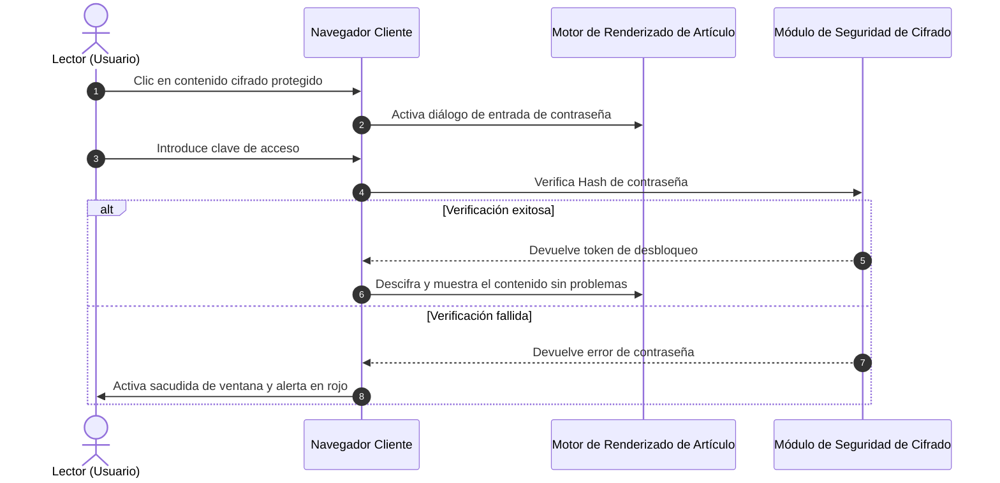

# Guía panorámica de generadores de sitios estáticos (SSG) y formatos de contenido de temas

En la ingeniería moderna de generadores de sitios estáticos (SSG) y temas de blogs independientes, la **capacidad de análisis y presentación del formato del contenido de los artículos** determina directamente los límites de expresión del creador y la experiencia de lectura del lector.

Esta guía, combinando las especificaciones de contenido de los principales ecosistemas de SSG (**Hugo, Jekyll, Eleventy, Astro, Pelican, Hexo, WordPress, VitePress**, etc.), establece un sistema panorámico que cubre **Markup básico, lenguajes de documentos extendidos, formatos de publicación de WordPress, selectores desplegables interactivos, acordeones, fórmulas matemáticas LaTeX, diagramas Mermaid y funciones especiales de cifrado/descifrado**, y proporciona demostraciones de renderizado en vivo plug-and-play.

---

## 1. Resumen del soporte de formatos de contenido y ecosistema de los principales generadores de sitios estáticos (SSG)

Los diferentes generadores de sitios estáticos tienen filosofías de selección distintas en cuanto a la arquitectura de análisis de contenido. La siguiente tabla resume sistemáticamente el soporte nativo y extendido de los motores principales para varios formatos:

| Generador de sitios estáticos / Plataforma | Motor de análisis principal | Formatos soportados nativamente | Formatos soportados por extensión / herramientas externas | Soporte de serialización Front Matter |
| :--- | :--- | :--- | :--- | :--- |
| **Hugo** | Goldmark (Go) | `.md` (CommonMark/GFM), `.html`, `.org` (Org-mode) | `.adoc` (Asciidoctor), `.rst` (rst2html), `.pdc` (Pandoc) | YAML (`---`), TOML (`+++`), JSON (`{}`) |
| **Astro (Arquitectura de este blog)** | Vite + Unified/Remark + MDX | `.md` (GFM), `.mdx` (JSX), `.html`, `.astro` Componentes | Puede montar AST Loader para extender Org/AsciiDoc/RST | YAML, TOML, JSON |
| **Jekyll** | Kramdown (Ruby) | `.md` (Kramdown/GFM), `.html` | `.textile` (Plugin Textile) | YAML |
| **Eleventy (11ty)** | Pipeline de plantillas JavaScript | `.md`, `.html`, `.liquid`, `.njk`, `.ejs`, `.webc` | MDX (Plugin), Extensión de plantilla personalizada | YAML, JSON, JS/11tydata |
| **Hexo** | Marked / Hexo-Renderer | `.md` (GFM), `.html`, Plantillas EJS/Pug | Org-mode / Pandoc (soporte de plugin) | YAML, JSON |
| **Pelican** | Python Docutils | `.md` (Markdown), `.rst` (reStructuredText) | `.asciidoc` (Asciidoctor) | YAML, Markdown Metadata |
| **WordPress (Headless/Tema)** | Motor de bloques Gutenberg | Bloques HTML5, Shortcodes, Formatos de publicación | Editor clásico HTML | Metadatos de bloque JSON / Post Meta |
| **VitePress / Docusaurus** | Markdown-It / MDX | `.md`, `.mdx`, Componentes Vue/React | Sintaxis de contenedor personalizada (`::: tip`) | YAML |

> [!NOTA]
> **Perspectiva de la arquitectura del ecosistema**: Hugo, gracias al alto rendimiento concurrente de Go, soporta nativamente Markdown y Org-mode; mientras que los SSG front-end modernos, representados por **Astro**, con sus **capacidades de MDX e Islas de Componentes (Islands)**, logran la máxima flexibilidad para incrustar sin problemas UI interactivas dinámicas (como los selectores desplegables, ventanas emergentes de contraseña y discos de vinilo que se demuestran en este artículo) en el cuerpo del texto.

---

## 2. Especificaciones de soporte de formato de serialización Front Matter

Los metadatos (Front Matter) en la cabecera de los artículos del blog determinan la ruta, el título, la fecha, la categoría, la portada y el estado de protección del artículo. Este tema soporta todos los modos de serialización principales:

### 1. Formato YAML (el más utilizado, recomendado por defecto)

```yaml
---
title: "Título del artículo"
pubDate: 2026-08-28
author: "shijianus"
tags: ["Astro", "Markdown"]
featured: true
postFormat: "aside"
---
```

### 2. Formato TOML (comúnmente usado en Hugo)

```toml
+++
title = "Título del artículo"
pubDate = 2026-08-28T00:00:00Z
author = "shijianus"
tags = ["Astro", "Markdown"]
featured = true
+++
```

### 3. Formato JSON (para escenarios impulsados por API y Headless)

```json
{
  "title": "Título del artículo",
  "pubDate": "2026-08-28T00:00:00.000Z",
  "author": "shijianus",
  "tags": ["Astro", "Markdown"],
  "featured": true
}
```

---

## 3. Comparación y referencia de migración de Markup ligero especial y formatos no Markdown

En diferentes pilas tecnológicas, los autores pueden utilizar otros lenguajes de marcado ligero además de Markdown. A continuación, se presentan las características sintácticas de los formatos principales y su representación equivalente en este tema:

### 1. AsciiDoc (.adoc / .asciidoc)

AsciiDoc es común en libros técnicos y manuales de ingeniería extensos, y cuenta con un sistema muy rico de bloques de notas y atributos:

```asciidoc
// Sintaxis de código fuente AsciiDoc
= Especificación técnica de AsciiDoc
:author: shijianus
:toc: macro

[NOTE]
====
Esta es una tarjeta de nota al estilo AsciiDoc.
====

[cols="1,2,1", options="header"]
|===
| Módulo | Descripción | Estado
| Motor principal | Pipeline estático de Astro 6 | Listo
|===
```

**Escritura equivalente en Markdown / MDX en este tema**:

> [!NOTA]
> Esta es una tarjeta de nota equivalente renderizada nativamente en el tema Astro, con estilo e interacción completamente alineados.

| Módulo | Descripción | Estado |
| :--- | :--- | :---: |
| **Motor principal** | Pipeline estático de Astro 6 | <span class="badge badge-success">Listo</span> |

---

### 2. Emacs Org-Mode (.org)

Org-mode es una potente herramienta para usuarios de Emacs para la gestión del conocimiento, el seguimiento de tareas y la redacción de documentos:

```ini
#+TITLE: Notas de práctica de Emacs Org-Mode
#+DATE: 2026-08-28
#+TAGS: Emacs OrgMode

* TODO Fase uno: Mejora del escaneo de Markdown [1/2]
- [X] Corregir desbordamiento de tablas y en dispositivos móviles
- [ ] Completar el conversor de sintaxis de Org-mode

#+BEGIN_QUOTE
“Org-mode no es solo un formato, sino un flujo de trabajo de pensamiento ejecutable.”
#+END_QUOTE
```

**Presentación de la lista de tareas GFM estática estándar en este tema (solo lectura)**:

- [x] Corregir desbordamiento de tablas y en dispositivos móviles
- [ ] Completar el conversor de sintaxis de Org-mode

> [!QUOTE]
> “Org-mode no es solo un formato, sino un flujo de trabajo de pensamiento ejecutable.”

#### Lista de tareas interactiva y barra de progreso encadenada (Interactive Tutorial Checklist & Chained Progression)

En tutoriales técnicos, ejercicios prácticos y guías de despliegue, las listas de tareas `[ ]` tradicionales de solo lectura no permiten una interacción o memorización intuitiva. Este tema ha añadido especialmente una **lista de verificación interactiva (`.article-task-tracker`) que admite la selección en tiempo real y la vinculación de estados en cadena**. Cada vez que el lector marca un elemento, la barra de progreso dinámica recalculará el porcentaje en tiempo real, y cuando todos los pasos clave se hayan confirmado, también **desbloqueará automáticamente las instrucciones de preparación posteriores**, lo que la hace ideal como lista de verificación de finalización para tutoriales:

<div class="article-task-tracker" data-storage-key="content-format-tutorial-demo">
  <div class="task-tracker__header">
    <div class="task-tracker__title">
      <svg width="20" height="20" viewBox="0 0 24 24" fill="none" stroke="currentColor" stroke-width="2"><path d="M9 11l3 3L22 4"/><path d="M21 12v7a2 2 0 0 1-2 2H5a2 2 0 0 1-2-2V5a2 2 0 0 1 2-2h11"/></svg>
      <span>Lista de verificación previa al despliegue de ingeniería de sitios estáticos (marcado interactivo en tiempo real)</span>
    </div>
    <span class="task-tracker__count">1/4 pasos completados (25%)</span>
  </div>
  <div class="task-tracker__bar-wrap">
    <div class="task-tracker__fill" style="width: 25%;"></div>
  </div>
  <ul class="task-checklist">
    <li class="task-checklist-item is-done">
      <input type="checkbox" checked id="chk-step-1" />
      <div class="task-item-body">
        <label for="chk-step-1" class="task-item-label">Paso 1: Completar la copia de seguridad completa del código local y el Git Commit</label>
        <div class="task-item-desc">Confirmar que el árbol de trabajo actual está limpio, registrar el Hash de la copia de seguridad en el registro de auditoría de desarrollo.</div>
      </div>
    </li>
    <li class="task-checklist-item">
      <input type="checkbox" id="chk-step-2" />
      <div class="task-item-body">
        <label for="chk-step-2" class="task-item-label">Paso 2: Configurar la pipeline de construcción estática de Cloudflare Pages</label>
        <div class="task-item-desc">Configurar <code>BLOG_BUILD_TARGET=static</code> y el entorno de ejecución de Node.js 20+.</div>
      </div>
    </li>
    <li class="task-checklist-item">
      <input type="checkbox" id="chk-step-3" />
      <div class="task-item-body">
        <label for="chk-step-3" class="task-item-label">Paso 3: Verificar recursos multimedia e incrustación de video/audio externo</label>
        <div class="task-item-desc">Asegurarse de que todos los archivos de audio y video individuales estén estrictamente controlados a menos de 25MB, cumpliendo con las especificaciones de despliegue de CDN.</div>
      </div>
    </li>
    <li class="task-checklist-item">
      <input type="checkbox" id="chk-step-4" />
      <div class="task-item-body">
        <label for="chk-step-4" class="task-item-label">Paso 4: Ejecutar la regresión visual automatizada y pruebas de humo con Playwright</label>
        <div class="task-item-desc">Verificar que todas las tarjetas de medios enriquecidos y los componentes interactivos se muestren correctamente en múltiples resoluciones para PC y dispositivos móviles.</div>
      </div>
    </li>
  </ul>
  <div class="task-tracker__status-card is-pending">
    <div class="status-card__header">
      <span class="badge badge-warning">⏳ Pendiente de preparación</span>
      <span style="font-weight:700;">Progreso actual: 1/4 (25%)</span>
    </div>
    <p style="margin-top:0.4rem;margin-bottom:0;font-size:0.88rem;line-height:1.6;">Por favor, complete cada paso marcado en la lista anterior en orden; cuando todas las tareas estén completadas, aquí se desbloquearán automáticamente las instrucciones de lanzamiento de producción en tiempo real.</p>
  </div>
</div>

---

### 3. reStructuredText (.rst)

reStructuredText es el formato de documentación estándar de la comunidad Python (como Sphinx, ReadTheDocs):

```rst
.. Sintaxis del código fuente de reStructuredText
.. note::
   Este es un bloque Note definido por una directiva RST.

.. code-block:: python
   :linenos:

   def greet(name: str) -> str:
       return f"Hello, {name}!"
```

**Representación equivalente en Markdown en este tema**:

> [!NOTE]
> Esta es una tarjeta equivalente a la nota RST, renderizada en Astro con la especificación de alerta de GitHub.

```python
def greet(name: str) -> str:
    return f"Hello, {name}!"
```

---

### 4. Sintaxis Textile

Textile es un lenguaje de marcado ligero clásico (común en Redmine y los primeros blogs de Jekyll):

```markdown
h2. Título de la sección
bq. Este es el contenido del bloque de cita de Textile.
*Elemento de lista 1*
_Texto enfatizado en cursiva_
```

---

## IV. Implementación completa y presentación visual de los formatos de publicación estilo WordPress

El clásico mecanismo de **Formatos de Publicación** en el ecosistema de temas de WordPress permite que los blogs muestren apariencias visuales exclusivas para diferentes tipos de contenido. Hemos implementado completamente estas 9 formas en la columna principal de este tema:

### 1. `aside` (Susurro / Nota / Tarjeta de Apunte)

Ideal para registrar ideas breves, recordatorios o notas temporales:

<div class="article-aside">
  <p><strong>💡 Apunte/Memo</strong>: El verdadero valor de un sitio estático no reside en la ostentación técnica, sino en ofrecer una experiencia de lectura pura, ultrarrápida y sin la carga de mantenimiento del lado del servidor. Incluso después de cinco o diez años, los archivos HTML generados seguirán abriéndose perfectamente.</p>
</div>

---

### 2. `status` (Actualización de estado / Pensamiento fugaz / Micro-cita)

Tarjeta de publicación de estado instantáneo al estilo Twitter/Weibo, que incluye el avatar del autor, el identificador del cliente y la etiqueta de estado de ánimo:

<div class="article-status">
  <div class="article-status__header">
    <div class="article-status__user">
      
      <div>
        <div class="article-status__name">shijianus</div>
        <div class="article-status__meta">Publicado el 2026-08-28 14:32 · 🇨🇳 Hangzhou</div>
      </div>
    </div>
    <div class="article-status__badge">
      <span>📱 Desde Geek Workshop Mac Studio</span>
    </div>
  </div>
  <p class="article-status__content">
    ¡Hoy finalmente completé la expansión de formato y la reestructuración visual de la columna principal del blog! Desde KaTeX y Mermaid hasta los menús desplegables interactivos y los discos de vinilo, la sensación de entrega estática de pila completa es fantástica 🚀✨
  </p>
</div>

---

### 3. `quote` (Cita destacada / Gran tarjeta de cita célebre)

Se utiliza para mostrar citas de figuras importantes, aforismos de diseño o frases célebres:

<div class="article-quote">
  <div class="article-quote__icon">“</div>
  <div class="article-quote__body">
    Simplicity is prerequisite for reliability. (La simplicidad es un requisito previo para la fiabilidad.)
  </div>
  <div class="article-quote__author">
    
    <div class="article-quote__author-info">
      <div class="article-quote__author-name">Edsger W. Dijkstra</div>
      <div class="article-quote__author-title">Científico de la computación · Ganador del Premio Turing (1972)</div>
    </div>
  </div>
</div>

---

### 4. `gallery` (Galería de imágenes / Álbum adaptable y cuadrícula estilo Polaroid)

Soporta cuadrículas responsivas adaptables de múltiples columnas y tarjetas de papel fotográfico estilo Polaroid con un toque humano. Al hacer clic en cualquier imagen, se activa una ampliación en pantalla completa tipo lightbox:

#### Galería adaptable de 2 y 3 columnas

<div class="article-gallery">
  <div class="gallery-grid gallery-grid-3">
    <div class="gallery-item">
      
      <div class="gallery-item__caption">Vista panorámica del escritorio de un geek</div>
    </div>
    <div class="gallery-item">
      
      <div class="gallery-item__caption">Pantalla grande de diseño de arquitectura de sistema</div>
    </div>
    <div class="gallery-item">
      
      <div class="gallery-item__caption">Portada visual de viaje por la Vía Láctea</div>
    </div>
  </div>
</div>

#### Galería de fotos estilo Polaroid (Polaroid Style)

<div class="gallery-polaroid">
  <div class="polaroid-card">
    
    <div class="polaroid-card__caption">2026.04 Hangzhou · Base de I+D</div>
  </div>
  <div class="polaroid-card">
    
    <div class="polaroid-card__caption">2026.08 Noche de evolución y refactorización de arquitectura</div>
  </div>
</div>

---

### 5. `video` (Tarjeta de reproducción de video adaptable)

Soporta una relación de aspecto responsiva de 16:9, bordes redondeados y una descripción en la barra inferior, ocupando una fila completa para su visualización. Compatible con incrustaciones externas proxy de Bilibili y YouTube, así como con MP4 nativos del sitio (cada archivo se mantiene por debajo de 25MB, cumpliendo con las especificaciones de despliegue estático de Cloudflare Pages):

#### Incrustación de video externo (Incrustación proxy de enlaces de Bilibili y YouTube · Por defecto, el lector debe desplazarse hasta aquí y hacer clic para iniciar la reproducción)

<div class="video-embed-card" data-video-type="bilibili">
  <iframe src="https://player.bilibili.com/player.html?bvid=BV11k4y1T7kS&page=1&high_quality=1&danmaku=0&autoplay=0" allowfullscreen="true" loading="lazy" allow="accelerometer; autoplay; clipboard-write; encrypted-media; gyroscope; picture-in-picture; web-share" sandbox="allow-top-navigation-by-user-activation allow-same-origin allow-forms allow-scripts allow-popups"></iframe>
  <div class="embed-caption">🎬 Demostración de incrustación externa de Bilibili: BV11k4y1T7kS (1080P HD · requiere desplazarse hasta aquí y hacer clic para reproducir)</div>
</div>

<div class="video-embed-card" data-video-type="youtube">
  <iframe src="https://www.youtube-nocookie.com/embed/LXb3EKWsInQ?autoplay=0&rel=0" allowfullscreen="true" loading="lazy" allow="accelerometer; autoplay; clipboard-write; encrypted-media; gyroscope; picture-in-picture; web-share"></iframe>
  <div class="embed-caption">🎬 Demostración de incrustación externa de YouTube: Demostración de Costa Rica 4K 60fps HDR (1080P/4K · URL real y válida · requiere desplazarse hasta aquí y hacer clic para reproducir)</div>
</div>

#### Incrustación de video MP4 nativo del sitio (Reproductor de video HTML5 nativo · Soporta velocidad de reproducción y Picture-in-Picture · Descarga deshabilitada por defecto)

<div class="video-embed-card">
  <video controls controlsList="nodownload" preload="metadata" playsinline oncontextmenu="return false;">
    <source src="/media/video/landscape_compressed.mp4" type="video/mp4" />
    Su navegador no soporta la reproducción de video HTML5.
  </video>
  <div class="embed-caption">🎥 Video nativo incrustado local 1: Demostración de paisaje en 4K/1080P Ultra HD (Tamaño 21.7MB · Soporta velocidad de reproducción y Picture-in-Picture · Descarga directa deshabilitada)</div>
</div>

<div class="video-embed-card">
  <video controls controlsList="nodownload" preload="metadata" playsinline oncontextmenu="return false;">
    <source src="/media/video/blue_archive_miracle.mp4" type="video/mp4" />
    Su navegador no soporta la reproducción de video HTML5.
  </video>
  <div class="embed-caption">🎥 Video nativo incrustado local 2: 【Blue Archive】“El principio y el fin de un milagro — ¡Nuestra historia la decidimos nosotros!” (Tamaño 23.3MB · Soporta velocidad de reproducción y Picture-in-Picture · Descarga directa deshabilitada)</div>
</div>

---

### 6. `audio` (Tarjeta de música con disco de vinilo giratorio)

Controlador de audio HTML5 incorporado que activa automáticamente una **animación de rotación suave y continua del disco de vinilo** al reproducirse. Todas las portadas de los discos son portadas de álbumes oficiales de alta definición que coinciden con la realidad, admiten múltiples formatos de audio principales (FLAC sin pérdidas, MP3 de alta tasa de bits, AAC/M4A) y tienen protección anti-scraping y anti-descarga incorporada:

#### ① Shaun - Way Back Home (Formato de audio FLAC sin pérdidas · 24.55MB)

<div class="article-audio-card">
  <div class="audio-card__cover">
    
  </div>
  <div class="audio-card__info">
    <div class="audio-card__title">
      <span>Way Back Home</span>
      <span class="badge badge-purple">FLAC Lossless</span>
    </div>
    <div class="audio-card__author">Shaun (숀) · Audio sin pérdidas (FLAC / 44.1kHz 16-bit 961 kbps)</div>
    <audio controls preload="metadata" controlsList="nodownload" oncontextmenu="return false;" src="/media/audio/WayBackHome.flac"></audio>
  </div>
</div>

#### ② ヨルシカ (Yorushika) - Kanojo wa Tabi ni Deru (Formato HD MP3 320Kbps · 8.41MB)

<div class="article-audio-card">
  <div class="audio-card__cover">
    
  </div>
  <div class="audio-card__info">
    <div class="audio-card__title">
      <span>Kanojo wa Tabi ni Deru (Ella emprende un viaje)</span>
      <span class="badge badge-success">320 Kbps MP3</span>
    </div>
    <div class="audio-card__author">ヨルシカ (Yorushika) · Estéreo HD (MP3 / 48kHz 320 kbps)</div>
    <audio controls preload="metadata" controlsList="nodownload" oncontextmenu="return false;" src="/media/audio/彼女は旅に出る.mp3"></audio>
  </div>
</div>

#### ③ すこっぷ feat. Hatsune Miku - アイロニ (Formato M4A / AAC · 7.63MB)

<div class="article-audio-card">
  <div class="audio-card__cover">
    
  </div>
  <div class="audio-card__info">
    <div class="audio-card__title">
      <span>アイロニ (Irony / Ironía)</span>
      <span class="badge badge-cyan">M4A / AAC</span>
    </div>
    <div class="audio-card__author">すこっぷ feat. Hatsune Miku · Audio AAC (M4A / 44.1kHz 260 kbps)</div>
    <audio controls preload="metadata" controlsList="nodownload" oncontextmenu="return false;" src="/media/audio/アイロニ.m4a"></audio>
  </div>
</div>

---

### 7. `link` (Tarjeta de vista previa de enlace externo y marcador / Bookmark Preview)

Proporciona una elegante vista previa en formato de tarjeta para las referencias clave dentro del artículo:

<a class="article-bookmark" href="https://github.com/shijianus/shijianus-blog" target="_blank" rel="noopener">
  <div class="article-bookmark__content">
    <div class="article-bookmark__title">EpoCanvas / shijianus-blog (Repositorio de especificaciones de diseño del tema principal del blog Jikan)</div>
    <p class="article-bookmark__desc">EpoCanvas (Jidai Kabu) es un sistema de arquitectura de contenido de blog geek moderno centrado en la presentación de información de alta densidad, microinteracciones elegantes y soporte de formato completo.</p>
    <div class="article-bookmark__site">
      <span class="badge badge-primary">GitHub</span>
      <span>github.com · EpoCanvas Core Spec</span>
    </div>
  </div>
  <div class="article-bookmark__icon">
    <svg viewBox="0 0 24 24" width="24" height="24" fill="none" stroke="currentColor" stroke-width="2" stroke-linecap="round" stroke-linejoin="round"><path d="M18 13v6a2 2 0 0 1-2 2H5a2 2 0 0 1-2-2V8a2 2 0 0 1 2-2h6"/><polyline points="15 3 21 3 21 9"/><line x1="10" y1="14" x2="21" y2="3"/></svg>
  </div>
</a>

---

### 8. `chat` (Flujo de Diálogo Animado Orgánico / Organic Animated Dialogue Stream)

Se utiliza para demostrar vívidamente defensas técnicas, discusiones de diálogo entre dos personas o escenarios de entrevistas a usuarios. Admite burbujas izquierda/derecha, código en línea, colores personalizados y **efectos de animación de escritura adaptativos al contenido dinámico, efectos de sonido sintetizados de Web Audio y avatares dinámicos (`footer_mini_logo__media`)**:
*   **Modo estático (predeterminado)**: `<div class="article-chat">` mantiene una presentación ligera y puramente estática, con cero sobrecarga de JS;
*   **Activación de demostración dinámica (control de parámetros)**: Al configurar `data-animate="true"` (o `class="article-chat is-animated"`), el sistema activará automáticamente una **animación de escritura con temporización realista, basada en la longitud de los caracteres y una aleatoriedad natural, junto con tonos de aviso exclusivos para la izquierda y la derecha, la primera vez que el lector se desplace a esa vista**;
*   **Temporización dinámica no mecánica (Content-Length Aware Timing)**: El sistema decide inteligentemente la duración del indicador de escritura según la longitud del mensaje (frases cortas parpadean durante 380ms, párrafos técnicos largos implican 1000ms+ de "pensamiento" al escribir), y añade pausas naturales y ligeras fluctuaciones de sonido entre las burbujas, acordes con el juicio de lectura humano;
*   **Soporte de avatares de video dinámicos (`footer_mini_logo__media`)**: Los avatares admiten la incrustación de micro-videos MP4 y pósteres estáticos de respaldo;
*   **Activación única y garantía de recarga**: Una vez activado al desplazarse por primera vez, se bloquea automáticamente, y los desplazamientos repetidos posteriores no lo activarán de nuevo para no interrumpir la lectura; solo se restablecerá cuando el usuario actualice la página (F5); también se proporciona una barra de micro-controles en la esquina superior derecha con "↺ Reproducir" y "🔊/🔇 Alternar sonido".

<div class="article-chat" data-animate="true" data-sound="true">
  <div class="chat-message chat-left">
    <span class="chat-avatar footer_mini_logo__media">
      <video autoplay muted loop playsinline preload="metadata" poster="/media/shijianus/avatar.jpg" aria-hidden="true">
        <source src="/media/shijianus/avatar-dynamic.mp4" type="video/mp4" />
      </video>
      
    </span>
    <div class="chat-body">
      <div class="chat-author">Desarrollador <a href="https://github.com/LeonBoven" target="_blank" rel="noopener noreferrer">Léon Boven</a> · 10:15</div>
      <div class="chat-bubble">
        ¡Hola! Me pregunto si la implementación de la renderización estática de <code>KaTeX</code> y <code>Mermaid</code> en Astro ralentizará la velocidad de carga de la página frontend.
      </div>
    </div>
  </div>

  <div class="chat-message chat-right">
    
    <div class="chat-body">
      <div class="chat-author">Arquitecto <a href="https://github.com/shijianus" target="_blank" rel="noopener noreferrer">shijianus</a> · 10:16</div>
      <div class="chat-bubble">
        ¡En absoluto! Porque <code>remark-math</code> y <code>rehype-katex</code> ya compilan las fórmulas en cadenas puras de HTML/MathML durante el tiempo de construcción (Build-time), lo que significa <strong>0 carga de tiempo de ejecución de JS</strong> en el lado del navegador; y los diagramas de Mermaid también cargan módulos ESM de forma asíncrona y bajo demanda, ¡haciendo que la primera pantalla sea extremadamente rápida! ⚡
      </div>
    </div>
  </div>

  <div class="chat-message chat-left">
    <span class="chat-avatar footer_mini_logo__media">
      <video autoplay muted loop playsinline preload="metadata" poster="/media/shijianus/avatar.jpg" aria-hidden="true">
        <source src="/media/shijianus/avatar-dynamic.mp4" type="video/mp4" />
      </video>
      
    </span>
    <div class="chat-body">
      <div class="chat-author">Desarrollador <a href="https://github.com/LeonBoven" target="_blank" rel="noopener noreferrer">Léon Boven</a> · 10:17</div>
      <div class="chat-bubble">
        ¡Genial! Entonces, ¿también podemos escribir diagramas de secuencia de arquitectura y convertidores de unidades interactivos directamente en Markdown, listos para usar, verdad?
      </div>
    </div>
  </div>

  <div class="chat-message chat-right">
    
    <div class="chat-body">
      <div class="chat-author">Arquitecto <a href="https://github.com/shijianus" target="_blank" rel="noopener noreferrer">shijianus</a> · 10:18</div>
      <div class="chat-bubble">
        ¡Así es! No solo la ampliación con doble clic y la exportación SVG de alta definición están completamente disponibles, sino que el convertidor de unidades también integra la <strong>sincronización en tiempo real de tipos de cambio en línea</strong> y la <strong>selección de unidades base mediante un desplegable</strong>, garantizando una expresión simétrica completa para unidades de masa fijas. ¡Todas las mediciones han sido rigurosamente probadas! 🚀
      </div>
    </div>
  </div>

  <div class="chat-message chat-left">
    <span class="chat-avatar footer_mini_logo__media">
      <video autoplay muted loop playsinline preload="metadata" poster="/media/shijianus/avatar.jpg" aria-hidden="true">
        <source src="/media/shijianus/avatar-dynamic.mp4" type="video/mp4" />
      </video>
      
    </span>
    <div class="chat-body">
      <div class="chat-author">Desarrollador <a href="https://github.com/LeonBoven" target="_blank" rel="noopener noreferrer">Léon Boven</a> · 10:19</div>
      <div class="chat-bubble">
        ¡Entendido! La sensación interactiva y la animación de escritura que varía según la longitud del mensaje son muy naturales. ¡Voy a actualizar la biblioteca de documentación técnica del equipo ahora mismo! 🎉
      </div>
    </div>
  </div>

  <div class="chat-message chat-right">
    
    <div class="chat-body">
      <div class="chat-author">Arquitecto <a href="https://github.com/shijianus" target="_blank" rel="noopener noreferrer">shijianus</a> · 10:20</div>
      <div class="chat-bubble">
        ¡Bienvenido a probarlo! Si en el futuro encuentras alguna necesidad de extensión de formato o personalización, no dudes en discutirlo en el foro o en GitHub~ ✨
      </div>
    </div>
  </div>
</div>

---

## V. Formatos de menú desplegable especiales y componentes interactivos (Dropdown Selectors & Interactive Formats)

Para los **formatos de menú desplegable especiales** solicitados explícitamente por los usuarios, hemos proporcionado en el cuerpo del artículo componentes de selector desplegable de respuesta instantánea puramente del lado del cliente:

### 1. Conmutador desplegable de múltiples marcos y versiones de código (Interactive Dropdown Switcher)

Los lectores pueden seleccionar libremente el marco tecnológico en el menú desplegable, y el panel del cuerpo del artículo cambiará el contenido y el código correspondientes en tiempo real sin recargar la página:

<div class="article-dropdown-switcher">
  <div class="article-dropdown-switcher__header">
    <div class="article-dropdown-switcher__title">
      <svg width="20" height="20" viewBox="0 0 24 24" fill="none" stroke="currentColor" stroke-width="2"><rect x="3" y="3" width="18" height="18" rx="2"/><path d="M9 3v18"/><path d="m14 9 3 3-3 3"/></svg>
      <span>Por favor, seleccione el código de implementación del framework frontend que desea ver:</span>
    </div>
    <select class="article-select dropdown-switcher__select">
      <option value="react-tab">⚛️ React 19 (Hooks y TSX)</option>
      <option value="vue-tab">🟢 Vue 3.5 (Composition API)</option>
      <option value="astro-tab">🚀 Astro 6 (Componente de Isla)</option>
      <option value="svelte-tab">🟠 Svelte 5 (Runas)</option>
    </select>
  </div>
  <div class="article-dropdown-switcher__body">
    <div class="article-dropdown-panel is-active" data-panel="react-tab">
      <div class="article-dropdown-panel__title">⚛️ Implementación del componente React 19:</div>
      <pre class="no-code-enhance"><code class="language-tsx">import { useState } from 'react';
export function Counter() {
  const [count, setCount] = useState(0);
  return (
    &lt;button onClick={() =&gt; setCount((c) =&gt; c + 1)} className="btn-primary"&gt;
      Contador de clics de React:&#123;count&#125;
    &lt;/button&gt;
  );
}</code></pre>
    </div>
    <div class="article-dropdown-panel" data-panel="vue-tab">
      <div class="article-dropdown-panel__title">🟢 Implementación del componente de archivo único Vue 3.5:</div>
      <pre class="no-code-enhance"><code class="language-html">&lt;script setup lang="ts"&gt;
import { ref } from 'vue';
const count = ref(0);
&lt;/script&gt;
&lt;template&gt;
  &lt;button @click="count++" class="btn-primary"&gt;
    Contador de clics de Vue:&#123;&#123; count &#125;&#125;
  &lt;/button&gt;
&lt;/template&gt;</code></pre>
    </div>
    <div class="article-dropdown-panel" data-panel="astro-tab">
      <div class="article-dropdown-panel__title">🚀 Implementación del componente estático Astro 6 sin JS:</div>
      <pre class="no-code-enhance"><code class="language-astro">---
const { title = "Islas Astro de alta velocidad" } = Astro.props;
---
&lt;div class="astro-island"&gt;
  &lt;h3&gt;&#123;title&#125;&lt;/h3&gt;
  &lt;p&gt;Entrega por defecto 0KB de JavaScript, ¡interactividad bajo demanda!&lt;/p&gt;
&lt;/div&gt;</code></pre>
    </div>
    <div class="article-dropdown-panel" data-panel="svelte-tab">
      <div class="article-dropdown-panel__title">🟠 Implementación de Svelte 5 Runes:</div>
      <pre class="no-code-enhance"><code class="language-svelte">&lt;script lang="ts"&gt;
  let count = $state(0);
&lt;/script&gt;
&lt;button onclick={() =&gt; count++} class="btn-primary"&gt;
  Contador de clics de Svelte:&#123;count&#125;
&lt;/button&gt;</code></pre>
    </div>
  </div>
</div>

---

### 2. Convertidor de Unidades Universal Interactivo Multicategoría (Universal Interactive Unit Converter · Selector Desplegable de Base y Tipo de Cambio en Tiempo Real)

Permite a los usuarios introducir libremente **cualquier valor base** en el campo de entrada (el valor predeterminado es `1`, con soporte para incrementadores/decrementadores y un botón de reinicio), y realizar conversiones instantáneas y fluidas entre diferentes categorías (masa y peso, tipos de cambio internacionales, almacenamiento de datos, ancho de banda de red, longitud y dimensiones):
* **Base de Conversión Dinámicamente Conmutable (Base Unit Dropdown)**: La unidad base a la derecha del campo de entrada admite la selección libre mediante un desplegable (por ejemplo, en masa se puede elegir `kg`, `g`, `lb`, `斤`, `oz`, `t`, etc.; en tipos de cambio se puede elegir `USD`, `HKD`, `CNY`, `EUR`, `JPY`, `GBP`, etc.). Después de seleccionar cualquier unidad base, la cuadrícula de conversión de destino **excluirá automáticamente de forma inteligente la unidad base actual (eliminando por completo las tarjetas redundantes como 1kg=1kg)**, y recalculará instantáneamente todas las unidades de destino utilizando la base actual como denominador;
* **Acceso a la Red para Fluctuaciones de Tipo de Cambio Reales (Live Forex API)**: Al cambiar a «💱 Tipos de Cambio Internacionales», el sistema solicitará automáticamente y de forma asíncrona al servidor `/api/exchange-rate` y recurrirá a una interfaz pública de tipos de cambio en tiempo real para obtener las últimas cotizaciones en tiempo real de las principales divisas (en la esquina superior derecha se mostrará `🟢 Tipo de cambio en tiempo real sincronizado`); cuando no haya conexión o se esté sin conexión, se recurrirá automáticamente y sin interrupciones a las proporciones base integradas (se mostrará `⚪ Tipo de cambio base sin conexión`), asegurando que el "tiempo real" sea verdaderamente en tiempo real y que la experiencia sin conexión sea sólida como una roca;
* **Llamada Conveniente a la API Universal**: El sistema también expone globalmente la función auxiliar `window.shijianusAPI.fetchExchangeRates(base)`, facilitando que cualquier script personalizado dentro del documento invoque instantáneamente los datos de cotización en tiempo real;
* **Copia Rápida con un Clic y Derivación de Ecuaciones**: Cada tarjeta de conversión ofrece un botón de copia con un clic y retroalimentación de resaltado, y en la parte inferior se muestra sincrónicamente un resumen de la derivación de la cadena de ecuaciones dinámicas.

<div class="interactive-unit-converter" data-default="1" data-title="🔄 Convertidor de Unidades Universal Interactivo (Soporta cambio de unidad base y tipo de cambio en tiempo real)"></div>

---

### 3. Calculadora Desplegable de Parámetros de Especificación y Codificación de Video (Interactive Spec Calc Dropdown)

Al seleccionar diferentes opciones, los indicadores técnicos correspondientes y las explicaciones de conversión se muestran en tiempo real a la derecha:

<div class="interactive-calc-select">
  <div class="article-select-box">
    <label>
      <svg width="18" height="18" viewBox="0 0 24 24" fill="none" stroke="currentColor" stroke-width="2"><circle cx="12" cy="12" r="10"/><path d="M12 6v6l4 2"/></svg>
      <span>Seleccionar resolución de codificación de video:</span>
    </label>
    <select class="article-select">
      <option value="1080p" data-desc="1920 × 1080 @ 60fps · Tasa de bits 6,000 Kbps · Ancho de banda recomendado 15 Mbps">1080P Full HD (1080p60)</option>
      <option value="2k" data-desc="2560 × 1440 @ 60fps · Tasa de bits 12,000 Kbps · Ancho de banda recomendado 30 Mbps">2K Ultra Claro (1440p60)</option>
      <option value="4k" data-desc="3840 × 2160 @ 60fps · Tasa de bits 25,000 Kbps · Ancho de banda recomendado 60 Mbps">4K Ultra HD (2160p60 HDR)</option>
      <option value="8k" data-desc="7680 × 4320 @ 60fps · Tasa de bits 80,000 Kbps · Ancho de banda recomendado 200 Mbps">8K Calidad Cine (4320p60 AV1)</option>
    </select>
  </div>
  <div class="calc-output-box">
    <span>📊 <strong>Resultado de la estimación de especificaciones técnicas</strong>:</span>
    <span class="calc-output-value">1920 × 1080 @ 60fps · Tasa de bits 6,000 Kbps · Ancho de banda recomendado 15 Mbps</span>
  </div>
</div>

---

## VI. Acordeones Plegables, Pestañas y Diseño Multicolumna (Collapsibles, Tabs & Columns)

### 1. Grupo de acordeón exclusivo (Expandir un elemento cierra automáticamente los demás)

Configure `data-single="true"`. Al expandir un elemento, los demás elementos expandidos del mismo grupo se contraerán automáticamente, manteniendo la página ordenada y enfocada:

<div class="article-accordion-group" data-single="true">
  <details class="article-accordion" open>
    <summary>
      <span>🔒 1. Ventajas de seguridad de los sitios estáticos</span>
      <svg class="accordion-chevron" viewBox="0 0 24 24" fill="none" stroke="currentColor" stroke-width="2"><polyline points="9 18 15 12 9 6"/></svg>
    </summary>
    <div class="accordion-content">
      <p>Los sitios estáticos no tienen motores de ejecución dinámicos tradicionales de PHP/Node.js ni bases de datos SQL expuestas a la red pública, lo que los inmuniza físicamente contra la inyección SQL y los riesgos de ejecución remota de código (RCE) en el servidor.</p>
    </div>
  </details>

  <details class="article-accordion">
    <summary>
      <span>⚡ 2. Entrega acelerada por CDN global en el borde</span>
      <svg class="accordion-chevron" viewBox="0 0 24 24" fill="none" stroke="currentColor" stroke-width="2"><polyline points="9 18 15 12 9 6"/></svg>
    </summary>
    <div class="accordion-content">
      <p>Al desplegar los artefactos compilados en Cloudflare Pages o GitHub Pages, todos los recursos estáticos pueden ser almacenados en caché en más de 300 nodos de borde globales, con un tiempo hasta el primer byte (TTFB) típicamente inferior a 20ms.</p>
    </div>
  </details>

  <details class="article-accordion">
    <summary>
      <span>💰 3. Costos de alojamiento en la nube extremadamente bajos</span>
      <svg class="accordion-chevron" viewBox="0 0 24 24" fill="none" stroke="currentColor" stroke-width="2"><polyline points="9 18 15 12 9 6"/></svg>
    </summary>
    <div class="accordion-content">
      <p>Los sitios estáticos no requieren la ejecución 24/7 de costosos servidores VPS en la nube. Con la base de datos Cloudflare D1 de nivel gratuito y un sistema de comentarios sin servidor, los costos operativos diarios son casi nulos.</p>
    </div>
  </details>
</div>

---

### 2. Grupo de acordeón no exclusivo e independiente (Permite expandir múltiples elementos simultáneamente)

Configure `data-single="false"` (o el modo de expansión múltiple por defecto). Los lectores pueden expandir libremente varios o todos los elementos plegables para una comparación lateral y una lectura profunda, sin que el contenido ya abierto se cierre al expandir un nuevo elemento:

<div class="article-accordion-group" data-single="false">
  <details class="article-accordion" open>
    <summary>
      <span>🛠️ Módulo de Arquitectura A: Pipeline del compilador de sintaxis AST de Markdown</span>
      <svg class="accordion-chevron" viewBox="0 0 24 24" fill="none" stroke="currentColor" stroke-width="2"><polyline points="9 18 15 12 9 6"/></svg>
    </summary>
    <div class="accordion-content">
      <p>Basado en las arquitecturas Unified, Remark-math y Rehype-katex, transforma el árbol de sintaxis Markdown en nodos HTML semánticos estándar de forma completamente estática durante la fase de compilación y construcción, y completa el resaltado y la generación de fórmulas en el lado de Node.js.</p>
    </div>
  </details>

  <details class="article-accordion" open>
    <summary>
      <span>🎨 Módulo de Arquitectura B: Motor visual dinámico EpoCanvas y sistema responsivo</span>
      <svg class="accordion-chevron" viewBox="0 0 24 24" fill="none" stroke="currentColor" stroke-width="2"><polyline points="9 18 15 12 9 6"/></svg>
    </summary>
    <div class="accordion-content">
      <p>Ofrece fondo de aurora (Aurora), paralaje de campo estelar (Starfield), mimetismo de vidrio esmerilado (Glassmorphism) y adaptación de puntos de interrupción responsivos multidispositivo, presentando una experiencia estética consistente tanto en pantallas anchas 4K como en teléfonos plegables.</p>
    </div>
  </details>

  <details class="article-accordion">
    <summary>
      <span>🛡️ Módulo de Arquitectura C: Sistema de aislamiento de seguridad jerárquico WebCrypto SHA-256</span>
      <svg class="accordion-chevron" viewBox="0 0 24 24" fill="none" stroke="currentColor" stroke-width="2"><polyline points="9 18 15 12 9 6"/></svg>
    </summary>
    <div class="accordion-content">
      <p>Incorpora desbloqueo persistente de sesión de nivel 1, máscaras dinámicas polimórficas antiprivacidad de nivel 2 (desenfoque gaussiano/mosaico/máscara de spoiler), bloqueo instantáneo al salir del viewport de nivel 3 y un esquema de cifrado de fragmentos de URL externos, eliminando por completo la exposición de contraseñas en texto plano en el DOM.</p>
    </div>
  </details>
</div>

---

### 3. Pestañas Interactivas (Interactive Tabs)

<div class="article-tabs">
  <div class="article-tabs__nav">
    <button class="article-tabs__button is-active" type="button">pnpm</button>
    <button class="article-tabs__button" type="button">npm</button>
    <button class="article-tabs__button" type="button">yarn</button>
    <button class="article-tabs__button" type="button">bun</button>
  </div>
  <div class="article-tabs__panels">
    <div class="article-tabs__panel is-active">
      <pre class="no-code-enhance"><code class="language-bash">pnpm add @astrojs/mdx remark-math rehype-katex katex mermaid</code></pre>
    </div>
    <div class="article-tabs__panel">
      <pre class="no-code-enhance"><code class="language-bash">npm install @astrojs/mdx remark-math rehype-katex katex mermaid</code></pre>
    </div>
    <div class="article-tabs__panel">
      <pre class="no-code-enhance"><code class="language-bash">yarn add @astrojs/mdx remark-math rehype-katex katex mermaid</code></pre>
    </div>
    <div class="article-tabs__panel">
      <pre class="no-code-enhance"><code class="language-bash">bun add @astrojs/mdx remark-math rehype-katex katex mermaid</code></pre>
    </div>
  </div>
</div>

---

### 4. Sistema de Diseño de Cuadrícula Multicolumna (Multi-Column Grid)

#### Cuadrícula de Tarjetas de 3 Columnas de Ancho Igual

<div class="article-grid article-grid-3">
  <div class="article-col-card">
    <h4>🎨 Sistema Visual</h4>
    <p>Absorbe profundamente la estética de diseño geek moderna de EpoCanvas, con soporte para alto contraste claro/oscuro, fondos de cristal esmerilado y transiciones de color suaves.</p>
  </div>
  <div class="article-col-card">
    <h4>⚡ Ingeniería de Rendimiento</h4>
    <p>Arquitectura de islas estáticas de Astro 6, prerrenderizado HTML en tiempo de construcción, optimización SEO extrema puramente estática.</p>
  </div>
  <div class="article-col-card">
    <h4>🛠️ Ecosistema de Extensiones</h4>
    <p>Soporte completo para fórmulas KaTeX, diagramas Mermaid, ventanas emergentes cifradas y 9 tipos de formatos de publicación.</p>
  </div>
</div>

#### Cuadrícula de Barra Lateral Desigual 1:2

<div class="article-grid article-columns-1-2">
  <div class="article-col-card">
    <h4>📌 Posicionamiento Arquitectónico</h4>
    <p>Un medio de escritura técnica moderno centrado en geeks e ingenieros.</p>
  </div>
  <div class="article-col-card">
    <h4>🚀 Garantía de Entrega</h4>
    <p>Mecanismos integrados de prueba de humo automatizada y verificación de construcción estática, asegurando que fórmulas, diagramas y tarjetas complejas se muestren perfectamente en todos los dispositivos.</p>
  </div>
</div>

---

## VII. 13 Tipos de Cuadros de Advertencia Semánticos (Admonitions / GitHub Alerts)

Basado en las especificaciones de diseño de GitHub Alert y EpoCanvas, soporta 13 tipos de tarjetas de colores con diferentes semánticas, y permite el plegado por defecto usando la sintaxis `[!TYPE]-`:

> [!NOTE]
> **Nota (Note)**: Esta es una información de fondo estándar o una explicación contextual.

> [!TIP]
> **Consejo (Tip)**: ¡Usa el atajo de teclado <kbd>Ctrl</kbd> + <kbd>K</kbd> para abrir rápidamente el panel de búsqueda global de artículos!

> [!IMPORTANT]
> **Importante (Important)**: Antes de desplegar en un entorno de producción, asegúrate de que la variable de entorno `BLOG_BUILD_TARGET=static` esté correctamente inyectada.

> [!WARNING]
> **Advertencia (Warning)**: No envíes claves de bases de datos de producción o claves privadas de servicios en la nube a repositorios Git públicos.

> [!CAUTION]
> **Precaución (Caution)**: La operación de reconstrucción de tablas de datos es destructiva, ¡haz una copia de seguridad de la base de datos D1 primero!

> [!DANGER]
> **Peligro Fatal (Danger)**: Eliminar directamente la base de datos de producción resultará en la pérdida permanente de todos los comentarios y activos de usuario.

> [!SUCCESS]
> **Éxito (Success)**: ¡El proceso de construcción estática se ha completado con éxito, todas las 47 rutas estáticas están listas!

> [!QUESTION]
> **Pregunta (Question)**: ¿Cómo implementar una búsqueda de texto completo puramente del lado del cliente en milisegundos en un entorno sin dependencias de servidor?

> [!QUOTE]
> **Cita Destacada (Quote)**: "Un buen código no solo es ejecutado por una máquina, sino que también comunica ideas a los humanos con la elegancia de la poesía."

> [!INFO]
> **Información (Info)**: Este blog está construido con Astro 6 y Tailwind 4, con exportación puramente estática de todo el sitio.

> [!TODO]
> **Pendiente (Todo)**: Se planea introducir un índice de búsqueda de texto completo del lado del cliente con WebAssembly en la próxima iteración.

> [!BUG]
> **Error (Bug)**: Se ha corregido el problema de maquetación de tablas truncadas horizontalmente en versiones antiguas en dispositivos con pantallas extremadamente estrechas.

> [!EXAMPLE]
> **Ejemplo (Example)**: Todos los cuadros de advertencia anteriores se adaptan automáticamente a colores de alto contraste en modos oscuro y claro.

### Demostración de Cuadro de Advertencia Plegable

> [!TIP]- Haz clic para expandir: Referencia de configuración de caché ultrarrápida de Nginx en entorno de producción
> ```nginx
> location ~* \.(?:css|js|woff2?|svg|png|jpg|webp)$ {
>     expires 1y;
>     add_header Cache-Control "public, immutable";
>     access_log off;
> }
> ```

## 8. Fórmulas Matemáticas Académicas (KaTeX), Diagramas de Arquitectura (Mermaid 11) y Mapas Mentales Dinámicos (Markmap)

En la documentación técnica de tipo demostrativo y de ejemplo, el concepto central de presentación es la **"comparación entre el efecto de renderizado real y el código fuente correspondiente"** (pestañas de doble etiqueta), lo que no solo permite a los lectores experimentar visualmente y de forma interactiva las características finales, sino que también facilita a los desarrolladores la referencia, copia y migración a proyectos reales con un solo clic.

---

### 1. Fórmulas Matemáticas LaTeX (KaTeX Math · Derivación en Línea y en Bloque de Varias Líneas)

#### Fórmulas en Línea (Inline Formula)

<div class="article-tabs">
<div class="article-tabs__nav">
<button class="article-tabs__button is-active" type="button">🌟 Presentación del Efecto Renderizado</button>
<button class="article-tabs__button" type="button">💻 Código Fuente LaTeX</button>
</div>
<div class="article-tabs__panels">
<div class="article-tabs__panel is-active">

Ecuación de masa-energía $E = mc^2$, identidad de Euler $e^{i\pi} + 1 = 0$, integral de Gauss $\int_{-\infty}^{\infty} e^{-x^2} dx = \sqrt{\pi}$.

</div>
<div class="article-tabs__panel">

```latex
质能方程 $E = mc^2$，欧拉恒等式 $e^{i\pi} + 1 = 0$，高斯积分 $\int_{-\infty}^{\infty} e^{-x^2} dx = \sqrt{\pi}$。
```

</div>
</div>
</div>

#### Fórmula de Derivación en Bloque de Varias Líneas 1: Transformada de Laplace de un Sistema Dinámico de Segundo Orden (Block Math · Ecuación Única)

<div class="article-tabs">
<div class="article-tabs__nav">
<button class="article-tabs__button is-active" type="button">🌟 Presentación del Efecto Renderizado</button>
<button class="article-tabs__button" type="button">💻 Código Fuente LaTeX</button>
</div>
<div class="article-tabs__panels">
<div class="article-tabs__panel is-active">

$$
\mathcal{L}\{\ddot{x}(t) + 2\zeta\omega_n\dot{x}(t) + \omega_n^2 x(t)\} = X(s)(s^2 + 2\zeta\omega_n s + \omega_n^2)
$$

</div>
<div class="article-tabs__panel">

```latex
$$
\mathcal{L}\{\ddot{x}(t) + 2\zeta\omega_n\dot{x}(t) + \omega_n^2 x(t)\} = X(s)(s^2 + 2\zeta\omega_n s + \omega_n^2)
$$
```

</div>
</div>
</div>

#### Fórmula de Derivación en Bloque de Varias Líneas 2: Ecuaciones Clásicas de Maxwell del Electromagnetismo (Block Math · Alineación Multilínea)

<div class="article-tabs">
<div class="article-tabs__nav">
<button class="article-tabs__button is-active" type="button">🌟 Presentación del Efecto Renderizado</button>
<button class="article-tabs__button" type="button">💻 Código Fuente LaTeX</button>
</div>
<div class="article-tabs__panels">
<div class="article-tabs__panel is-active">

$$
\begin{aligned}
\nabla \cdot \mathbf{E} &= \frac{\rho}{\varepsilon_0} \\
\nabla \cdot \mathbf{B} &= 0 \\
\nabla \times \mathbf{E} &= -\frac{\partial \mathbf{B}}{\partial t} \\
\nabla \times \mathbf{B} &= \mu_0 \mathbf{J} + \mu_0 \varepsilon_0 \frac{\partial \mathbf{E}}{\partial t}
\end{aligned}
$$

</div>
<div class="article-tabs__panel">

```latex
$$
\begin{aligned}
\nabla \cdot \mathbf{E} &= \frac{\rho}{\varepsilon_0} \\
\nabla \cdot \mathbf{B} &= 0 \\
\nabla \times \mathbf{E} &= -\frac{\partial \mathbf{B}}{\partial t} \\
\nabla \times \mathbf{B} &= \mu_0 \mathbf{J} + \mu_0 \varepsilon_0 \frac{\partial \mathbf{E}}{\partial t}
\end{aligned}
$$
```

</div>
</div>
</div>

---

### 2. Diagramas de Arquitectura Mermaid 11 (Flowchart & Sequence · Diagrama de Flujo y Diagrama de Secuencia)

#### ① Diagrama de Flujo de Verificación de Cifrado y Renderizado de Contenido del Blog (Flowchart TD)

<div class="article-tabs">
<div class="article-tabs__nav">
<button class="article-tabs__button is-active" type="button">🌟 Presentación del efecto de renderizado</button>
<button class="article-tabs__button" type="button">💻 Código fuente de Mermaid</button>
</div>
<div class="article-tabs__panels">
<div class="article-tabs__panel is-active">

```mermaid
flowchart TD
    A[Lector visita el artículo] --> B{¿Artículo cifrado?}
    B -- Sí --> C[Abre diálogo de contraseña (efecto cristal esmerilado)]
    C --> D{Verificación de contraseña}
    D -- Correcto --> E[Descifra y muestra el contenido]
    D -- Incorrecto --> F[Activa vibración de ventana y alerta en rojo]
    F -. Reingresar contraseña .-> C
    B -- No --> E
    E --> G[Renderiza fórmulas KaTeX y diagramas Mermaid]
    G --> H[Ofrece experiencia de lectura inmersiva completa]
```

</div>
<div class="article-tabs__panel">

````markdown
```mermaid
flowchart TD
    A[Lector visita el artículo] --> B{¿Artículo cifrado?}
    B -- Sí --> C[Abre diálogo de contraseña (efecto cristal esmerilado)]
    C --> D{Verificación de contraseña}
    D -- Correcto --> E[Descifra y muestra el contenido]
    D -- Incorrecto --> F[Activa vibración de ventana y alerta en rojo]
    F -. Reingresar contraseña .-> C
    B -- No --> E
    E --> G[Renderiza fórmulas KaTeX y diagramas Mermaid]
    G --> H[Ofrece experiencia de lectura inmersiva completa]
```
````

</div>
</div>
</div>

#### ② Diagrama de Secuencia de Autenticación de Seguridad y Descifrado del Cliente (Sequence Diagram)

<div class="article-tabs">
<div class="article-tabs__nav">
<button class="article-tabs__button is-active" type="button">🌟 Presentación del efecto de renderizado</button>
<button class="article-tabs__button" type="button">💻 Código fuente de Mermaid</button>
</div>
<div class="article-tabs__panels">
<div class="article-tabs__panel is-active">



</div>
<div class="article-tabs__panel">

````markdown

````

</div>
</div>
</div>

### 3. Mapa mental interactivo dinámico (Markmap / Mindmap · Expansión de ramas multidireccional)

En la organización de especificaciones técnicas extensas y arquitecturas de sistemas, las listas estáticas tradicionales dificultan la visualización intuitiva de complejas redes de conocimiento. Este tema implementa por primera vez el **motor de mapa mental interactivo dinámico Markmap**, logrando un análisis nativo completo y una mejora interactiva en la columna principal del artículo (`.post.post-page-shell`):

> [!TIP]
> **Reglas clave de la expansión de ramas multidireccional**:
> 1.  **Espacio de protección de bloque único por defecto**: Por defecto, el mapa mental solo muestra **1 nodo raíz central** (Nivel 1), con un indicador de punto plegable a la derecha;
> 2.  **Hacer clic para expandir ramas multidireccionales**: Al hacer clic en el punto de un nodo raíz o de cualquier nodo hijo, las ramas secundarias se **desplegarán suavemente hacia afuera**;
> 3.  **Control total desde la barra de herramientas**: Soporta **ampliar / reducir / centrado adaptativo / expandir todo con un clic / contraer un bloque con un clic / lectura inmersiva a pantalla completa / copiar código fuente**;
> 4.  **Arrastrar y escalar el lienzo**: Mantén pulsado el botón izquierdo del ratón para arrastrar y mover libremente el lienzo, y desplaza la rueda del ratón para escalar la vista.

#### Presentación de mapa mental interactivo: SSG y panorama completo del ecosistema de formatos de contenido del tema

<div class="article-tabs">
<div class="article-tabs__nav">
<button class="article-tabs__button is-active" type="button">🌟 Presentación de mapa interactivo</button>
<button class="article-tabs__button" type="button">💻 Código fuente de la estructura del Mindmap</button>
</div>
<div class="article-tabs__panels">
<div class="article-tabs__panel is-active">

```mindmap
# Arquitectura del generador de sitios estáticos y ecosistema de contenido de formato completo
## 1. Pipeline central de compilación estática
### Pipeline de transformación de sintaxis AST
#### Pipeline de análisis semántico de Markdown / MDX
##### Extensión de sintaxis Unified / Remark
- Conversión de sintaxis de tablas y tachado GFM
- Generación automática de anclajes e IDs de encabezados
##### Extensión de mapa mental interactivo multidireccional Markmap
- Construcción recursiva de árbol AST (Transformer.transform)
- Diseño elástico jerárquico D3 (Flextree Algorithm)
- Máquina de estados de plegado interactiva (payload.fold)
- Coloreado dinámico de ramas con paleta (d3.scaleOrdinal)
##### Extensión de fórmulas matemáticas Rehype Katex
- Análisis de fórmulas en línea y en bloque independiente
- Soporte de definición de macros y fallback de tolerancia a errores
#### Resaltado de código y sombreadores estáticos
##### Compilador de doble tema Shiki
- Análisis de reglas de sintaxis VSCode TextMate
- Pre-renderizado de doble tema (claro/oscuro) con cero hidratación
### Compilador y empaquetado de recursos
#### Recarga en caliente ultrarrápida Vite 6 (HMR)
##### Carga de módulos nativos ESM
- Compilación bajo demanda y actualización en caliente en milisegundos
#### Pipeline de generación estática Rollup
##### Optimización de empaquetado estático
- División inteligente de código (Code Splitting)
- Eliminación de redundancia (Tree-Shaking)
## 2. Interacción dinámica y sistema de islas
### Islas de componentes híbridos (Islands)
#### Montaje de componentes de cliente por isla
##### Componentes de cliente React 19
- Aislamiento de estado independiente y comunicación de contexto
- Persistencia del estado de sesión (SessionStorage / Crypto)
##### Islas del lado del servidor Astro
- JS de cliente de tiempo de ejecución cero (Zero-JS por defecto)
- Activación bajo demanda de islas interactivas (client:visible)
### Sistema visual y de animación moderno
#### Fondos dinámicos y motor de renderizado
##### Aurora Boreal / Campo de Estrellas
- Aceleración de hardware WebGL / Canvas 2D
- Modo de ahorro de energía y pausa automática al salir del viewport
##### Especificación de tarjetas de cristal esmerilado (Glassmorphism)
- Desenfoque gaussiano dinámico y múltiples sombras ambientales
- Diseño adaptativo responsivo para todas las plataformas (PC / Tablet / Móvil)
## 3. Panorama de formatos y funciones especiales
### Comparación de especificaciones de documentos extendidos
#### Adaptación nativa equivalente a AsciiDoc (.adoc)
#### Mapeo de listas de tareas de Emacs Org-Mode (.org)
#### Conversión de directivas reStructuredText (.rst)
### Conjunto de componentes altamente interactivos
#### Selector desplegable interactivo (Dropdown Switcher)
#### Tarjetas plegables de acordeón mutuamente excluyentes (Accordion Groups)
#### Reproductor de audio dinámico de vinilo (Vinyl Audio)
### Seguridad, privacidad y cifrado por niveles
#### Verificación de hash WebCrypto SHA-256 (sin exposición de texto plano)
#### Desbloqueo persistente de sesión de Nivel 1 (Session Persistent)
#### Conmutación de máscara antiprivacidad de Nivel 2 (Desenfoque gaussiano / Mosaico / Máscara de spoiler)
#### Bloqueo al salir del viewport antiprivacidad de Nivel 3 (IntersectionObserver)
#### Aislamiento de punto final de descifrado segmentado externo (Standalone Token)
```

</div>
<div class="article-tabs__panel">

````markdown
```mindmap
# Arquitectura del generador de sitios estáticos y ecosistema de contenido de formato completo
## 1. Pipeline central de compilación estática
### Pipeline de transformación de sintaxis AST
#### Pipeline de análisis semántico de Markdown / MDX
##### Extensión de sintaxis Unified / Remark
- Conversión de sintaxis de tablas y tachado GFM
- Generación automática de anclajes e IDs de encabezados
##### Extensión de mapa mental interactivo multidireccional Markmap
- Construcción recursiva de árbol AST (Transformer.transform)
- Diseño elástico jerárquico D3 (Algoritmo Flextree)
- Máquina de estados de plegado interactiva (payload.fold)
- Coloreado dinámico de ramas con paleta (d3.scaleOrdinal)
##### Extensión de fórmulas matemáticas Rehype Katex
- Análisis de fórmulas en línea y en bloque independiente
- Soporte de definición de macros y fallback de tolerancia a errores
#### Resaltado de código y sombreadores estáticos
##### Compilador de doble tema Shiki
- Análisis de reglas de sintaxis VSCode TextMate
- Pre-renderizado de doble tema (claro/oscuro) con cero hidratación
### Compilador y empaquetado de recursos
#### Recarga en caliente ultrarrápida Vite 6 (HMR)
##### Carga de módulos nativos ESM
- Compilación bajo demanda y actualización en caliente en milisegundos
#### Pipeline de generación estática Rollup
##### Optimización de empaquetado estático
- División inteligente de código (Code Splitting)
- Eliminación de redundancia (Tree-Shaking)
## 2. Interacción dinámica y sistema de islas
### Islas de componentes híbridos (Islands)
#### Montaje de componentes de cliente por isla
##### Componentes de cliente React 19
- Aislamiento de estado independiente y comunicación de contexto
- Persistencia del estado de sesión (SessionStorage / Crypto)
##### Islas del lado del servidor Astro
- JS de cliente de tiempo de ejecución cero (Zero-JS por defecto)
- Activación bajo demanda de islas interactivas (client:visible)
### Sistema visual y de animación moderno
#### Fondos dinámicos y motor de renderizado
##### Aurora Boreal / Campo de Estrellas
- Aceleración de hardware WebGL / Canvas 2D
- Modo de ahorro de energía y pausa automática al salir del viewport
##### Especificación de tarjetas de cristal esmerilado (Glassmorphism)
- Desenfoque gaussiano dinámico y múltiples sombras ambientales
- Diseño adaptativo responsivo para todas las plataformas (PC / Tablet / Móvil)
## 3. Panorama de formatos y funciones especiales
### Comparación de especificaciones de documentos extendidos
#### Adaptación nativa equivalente a AsciiDoc (.adoc)
#### Mapeo de listas de tareas de Emacs Org-Mode (.org)
#### Conversión de directivas reStructuredText (.rst)
### Conjunto de componentes altamente interactivos
#### Selector desplegable interactivo (Dropdown Switcher)
#### Tarjetas plegables de acordeón mutuamente excluyentes (Accordion Groups)
#### Reproductor de audio dinámico de vinilo (Vinyl Audio)
### Seguridad, privacidad y cifrado por niveles
#### Verificación de hash WebCrypto SHA-256 (sin exposición de texto plano)
#### Desbloqueo persistente de sesión de Nivel 1 (Session Persistent)
#### Conmutación de máscara antiprivacidad de Nivel 2 (Desenfoque gaussiano / Mosaico / Máscara de spoiler)
#### Bloqueo al salir del viewport antiprivacidad de Nivel 3 (IntersectionObserver)
#### Aislamiento de punto final de descifrado segmentado externo (Standalone Token)
```
````

</div>
</div>
</div>

#### Especificaciones de Escritura y Referencia de Sintaxis Markdown

El **motor de renderizado de Mindmap** integrado en este blog se basa en el análisis recursivo AST y el diseño de árbol elástico D3 Flextree, **soportando de forma nativa la expansión de niveles ilimitados (Nivel 1 a Nivel N)**, sin ninguna restricción de profundidad máxima. Al escribir artículos, el autor puede elegir las siguientes especificaciones de escritura según la complejidad de la profundidad del árbol de conocimiento:

##### 1. Sintaxis de Escalera Híbrida (Recomendado 1~6 Niveles Troncales + Derivación Profunda de Lista Infinita)
Los títulos estándar de Markdown admiten 6 niveles de profundidad (`#` a `######`). Por debajo del 6º nivel, se puede continuar derivando infinitamente hacia abajo (Nivel 7, Nivel 8, Nivel 9...) utilizando elementos de lista desordenada (`-`, `*`) combinados con sangría de espacios:

````markdown
```mindmap
# Nivel 1 Tema Central (H1)
## Nivel 2 Rama de Dominio (H2)
### Nivel 3 Subsistema (H3)
#### Nivel 4 Módulo Técnico (H4)
##### Nivel 5 Unidad de Componente (H5)
###### Nivel 6 Especificación de Algoritmo (H6)
- Nivel 7 Detalles de Ejecución Específicos (Elemento de lista)
  - Nivel 8 Parámetros de Subelemento (Sangría +2 espacios)
    - Nivel 9 Primitivas de Hardware de Bajo Nivel (Sangría +4 espacios)
```
````

##### 2. Sintaxis de Sangría Infinita de Lista Pura (Recomendado para 6+ Niveles o Árboles de Conocimiento Extremadamente Profundos)
Si no se necesita la semántica de los títulos de Markdown, o si la red de conocimiento tiene niveles extremadamente profundos (por ejemplo, árboles de clasificación, deducciones conceptuales, estructuras AST), se puede usar directamente la lista desordenada `-` y expresar **una profundidad teóricamente infinita** de ramas multidireccionales mediante sangría de 2 o 4 espacios:

````markdown
```mindmap
- 🌐 Tema Raíz: Mapa de Conocimiento de Ciencias de la Computación (Nivel 1)
  - 🖥️ Ingeniería de Sistemas de Software (Nivel 2)
    - 📦 Sistemas Operativos y Núcleos (Nivel 3)
      - ⚙️ Planificación de Procesos y Hilos (Nivel 4)
        - 🔄 Primitivas de Sincronización Concurrente (Nivel 5)
          - 🔒 Mutex y Semáforos (Nivel 6)
            - ⚡ Instrucciones Atómicas CAS a Nivel de Hardware (Nivel 7)
              - ⏱️ Protocolo MESI de Coherencia de Caché (Nivel 8)
                - 🔬 Barreras de Memoria y Reordenamiento de Instrucciones en Pipeline (Nivel 9)
```
````

##### 3. Control de Parámetros Avanzados en Línea (Cabecera JSON Opcional)
Se puede personalizar el estado inicial y las dimensiones visuales del mapa mental utilizando un objeto JSON de una sola línea en la primera línea del bloque de código:

````markdown
```mindmap
{"initialExpandLevel": 2, "height": "560px", "title": "Panorama de la Arquitectura de Ingeniería Full-Stack"}
# Tema Central
## Rama de Nivel Uno A
### Rama de Nivel Dos A1
- Punto de Conocimiento Detallado 1
```
````

*   **`initialExpandLevel`**: Nivel de expansión inicial. `1` para el modo de protección de nodo raíz colapsado; `2` para expandir al tronco principal; `6` para expansión completa.
*   **`height`**: Especifica la altura del lienzo, como `"480px"`, `"600px"` (por defecto `"460px"`).
*   **`title`**: Texto de título personalizado para el encabezado del mapa mental.

##### 4. Características Interactivas y Guía de Operación del Visor
*   **Clic para profundizar suavemente (Drill-down)**: Al hacer clic en un nodo con un punto o texto que emite un brillo pulsante, se expandirán/contraerán suavemente sus ramas multidireccionales de nivel inferior;
*   **Expandir/Contraer con un clic**: La barra de herramientas ofrece `⊞` (expandir todas las ramas con un clic) y `⊟` (restaurar al bloque inicial con un clic);
*   **Centrado adaptativo (Ajustar Vista)**: Al hacer clic en `🎯`, se calcula automáticamente la mejor vista centrada en función de todos los nodos actualmente expandidos;
*   **Modo inmersivo de pantalla completa**: Al hacer clic en `⛶`, se expande a un lienzo independiente de pantalla completa (presione `Esc` para salir en cualquier momento), obteniendo un espacio de exploración horizontal ilimitado;
*   **Percepción de metadatos en tiempo real**: La barra de encabezado muestra en tiempo real el número total de nodos y la profundidad máxima del mapa mental actual (por ejemplo, `53 nodos · estructura de 6 niveles de ramas`).

---

## IX. Seguridad y Privacidad, Cifrado Graduado (Nivel 1/2/3) y Funcionalidad Especial de Desencriptación Segmentada Externa

Para eliminar por completo la exposición de contraseñas en texto plano en los atributos del DOM (como `data-password`, que es fácil de inspeccionar), el sistema de contenido de este blog se ha actualizado completamente a la **verificación de hash WebCrypto SHA-256 (`data-hash`)**, y se ha establecido un sistema de cifrado local de tres niveles dentro del texto y de descifrado segmentado externo:
*   **Regla de restablecimiento de seguridad predeterminada (Persistencia Cero al Recargar)**: Por defecto, todo el contenido cifrado (Nivel 1, Nivel 2, Nivel 3 y puertas de descifrado externas) **se restablecerá automáticamente y de forma decidida a un estado bloqueado después de una actualización de página (F5 / recarga)**, evitando por completo el riesgo de seguridad de permanecer expuesto después de una actualización de página;
*   **Parámetro de persistencia abierta (`data-persist`)**: Para satisfacer las necesidades de apertura en escenarios de documentos especiales, la política de restablecimiento predeterminada se puede anular mediante la configuración de parámetros:
    *   `data-persist="session"` (o `data-persist="true"`): Mantiene el desbloqueo a través de las actualizaciones durante la sesión de la pestaña actual;
    *   `data-persist="local"`: Recuerda persistentemente el estado de desbloqueo en el almacenamiento local del navegador;
    *   Por defecto no configurado: Ciclo de vida de solo memoria, **la página se restablece de forma segura y se bloquea inmediatamente al recargar**.

---

### 1. Cifrado de Nivel 1: Cifrado Básico de Página Única (Nivel 1 · Restablecimiento por Recarga Predeterminado)

Introduzca una credencial de acceso una vez para desbloquear el contenido principal. Por defecto, la página se vuelve a bloquear automáticamente al recargarla; si necesita que persista entre recargas, puede añadir `data-persist="session"` a la etiqueta:

<div class="article-encrypted-box" data-level="1" data-hash="d7fb6c64b9aa44cc0c3b427edaa623369dee1a9778329801f68fdaa34b09d351" data-hint="💡 Sugerencia de cifrado de Nivel 1: Para la clave de demostración, introduzca shijianus2026 (Verificación de hash · Recarga automática de bloqueo)">
  <div class="encrypted-box__lock">
    <div class="encrypted-box__level-tag"><span class="badge badge-success">🛡️ Cifrado Nivel 1 · Restablecimiento automático al recargar</span> <span class="badge badge-cyan">Protección SHA-256</span></div>
    <div class="encrypted-box__icon">🔒</div>
    <div class="encrypted-box__title">Protección Nivel 1: Configuración de Desarrollo Privada y Activos de Código Fuente</div>
    <div class="encrypted-box__desc">Esta área está protegida por una política de seguridad de Nivel 1. La contraseña se verifica mediante hash con WebCrypto, sin exposición de texto plano; la página se volverá a bloquear automáticamente después de recargarla.</div>
    <button class="encrypted-box__btn" type="button">🔑 Verificar clave para desbloquear contenido</button>
  </div>
  <div class="encrypted-box__content">
    <div class="admonition admonition-success">
      <div class="admonition-title">
        <svg viewBox="0 0 24 24" fill="none" stroke="currentColor" stroke-width="2"><path d="M22 11.08V12a10 10 0 1 1-5.93-9.14"/><polyline points="22 4 12 14.01 9 11.01"/></svg>
        <span>🎉 ¡Verificación de Nivel 1 exitosa! La página actual ha sido desbloqueada (se volverá a bloquear automáticamente de forma segura al recargar)</span>
      </div>
      <div class="admonition-content">
        <p><strong>Parámetros clave del entorno de desarrollo desbloqueados:</strong></p>
        <ul>
          <li><code>DEPLOY_ENDPOINT</code>: <code>https://api.shijian.us/v2/deploy/core</code></li>
          <li><code>AUTH_SCOPE</code>: <code>read:articles, write:releases</code></li>
        </ul>
      </div>
    </div>
  </div>
</div>

---

### 2. Cifrado de Nivel 2: Protección de Máscara Anti-espionaje después del Desbloqueo (Nivel 2 · Protección de Máscara)

Aunque el contenido se descifra tras una verificación exitosa, **por defecto entra automáticamente en un estado de máscara anti-espionaje con desenfoque gaussiano** (la barra de alternancia no se muestra por defecto, se puede ver claramente al pasar el ratón por encima), resistiendo eficazmente el espionaje a corta distancia.
- Para **activar la barra de herramientas**: Configure `data-allow-select="true"` para activar la barra de herramientas de alternancia de máscara. **La barra de herramientas también está protegida dentro de la máscara por defecto** (al pasar el ratón, la barra de herramientas y el contenido principal se revelan claramente y se pueden hacer clic para alternar); si necesita que la barra de herramientas permanezca fuera de la máscara, puede configurar `data-toolbar-masked="false"`;
- Para **especificar el método de máscara**: Puede forzar un modo de máscara específico a través de `data-mask="blur|mosaic|spoiler|reveal"`;
- Para **personalizar la barra de configuración**: Admite pasar `data-mask-options="blur,mosaic"` en las etiquetas Markdown para personalizar rápidamente los modos opcionales, o escribir directamente la estructura `<div class="encrypted-mask-toolbar">` en el cuerpo del texto, y el sistema escaneará y activará automáticamente la barra de configuración personalizada;
- Para **garantía de restablecimiento al recargar**: Por defecto, la página se vuelve a bloquear automáticamente después de recargarla.

<div class="article-encrypted-box" data-level="2" data-allow-select="true" data-hash="f31aafdcf42582306027026c37ee59c747be6e17258aa490c5bba32b93911c07" data-hint="💡 Sugerencia de cifrado de nivel 2: la clave de demostración es epocanvas2026">
  <div class="encrypted-box__lock">
    <div class="encrypted-box__level-tag"><span class="badge badge-warning">🛡️ Cifrado de nivel 2 · Modo de protección contra miradas indiscretas con máscara</span> <span class="badge badge-purple">Máscara dinámica polimórfica</span></div>
    <div class="encrypted-box__icon">🛡️</div>
    <div class="encrypted-box__title">Protección de nivel 2: Datos comerciales confidenciales y lista financiera</div>
    <div class="encrypted-box__desc">Tras el descifrado, se activará por defecto la protección de desenfoque gaussiano; solo al pasar el ratón o hacer clic se podrá ver con claridad, resistiendo eficazmente las miradas indiscretas a corta distancia; la página se volverá a bloquear automáticamente al refrescarse.</div>
    <button class="encrypted-box__btn" type="button">🔑 Verificar credenciales y activar vista anti-espionaje</button>
  </div>
  <div class="encrypted-box__content">
    <div class="admonition admonition-important">
      <div class="admonition-title">
        <svg viewBox="0 0 24 24" fill="none" stroke="currentColor" stroke-width="2"><path d="M12 2v20"/><path d="M17 5H9.5a3.5 3.5 0 0 0 0 7h5a3.5 3.5 0 0 1 0 7H6"/></svg>
        <span>📊 Parámetros financieros y contractuales clave del proyecto comercial</span>
      </div>
      <div class="admonition-content">
        <p>A continuación se muestra la asignación presupuestaria de soporte comercial de EpoCanvas para el año 2026:</p>
        <ul>
          <li><strong>Tarifa de licencia de privatización a nivel empresarial</strong>: ¥ 280,000 / año (incluye clúster de alta disponibilidad y garantía SLA)</li>
          <li><strong>Gasto de tráfico CDN de borde</strong>: ¥ 36,500 / mes</li>
          <li><strong>Clave de consultor técnico exclusivo</strong>: <code>sec_corp_epocanvas_key_2026</code></li>
        </ul>
      </div>
    </div>
  </div>
</div>

---

### 3. Cifrado de nivel 3: Bloqueo automático al salir del área visible (Level 3 · Viewport Auto-Lock)

¡Nivel de seguridad ultra alto! **No se escribe en ningún almacenamiento persistente**; una vez que el contenido descifrado **abandona el área visible actual de la pantalla** al desplazarse, o si la pestaña del navegador cambia a segundo plano, el sistema se **volverá a bloquear automáticamente al instante**, y para volver a verlo será necesario introducir la contraseña de nuevo:

<div class="article-encrypted-box" data-level="3" data-hash="0f67fcb3bceddb88ef917fa5cf73affc3490db24a44adf25238a00f5ee81ee89" data-hint="💡 Sugerencia de cifrado de nivel 3: la clave de demostración es level3pass">
  <div class="encrypted-box__lock">
    <div class="encrypted-box__level-tag"><span class="badge badge-danger">🛡️ Cifrado de nivel 3 · Bloqueo al salir del área visible</span> <span class="badge badge-orange">Monitoreo de centinela de área visible</span></div>
    <div class="encrypted-box__relock-wrap">
      <div class="encrypted-relock-notice">⚠️ Protección de seguridad activada: El sistema se ha vuelto a bloquear automáticamente porque el contenido salió previamente del área visible de la pantalla.</div>
    </div>
    <div class="encrypted-box__icon">🚨</div>
    <div class="encrypted-box__title">Nivel 3 Ultrasecreto: Claves privadas de infraestructura crítica e instrucciones de recuperación ante desastres</div>
    <div class="encrypted-box__desc">Estándar de máxima protección. Una vez descifrado, si se desplaza fuera de la pantalla, se activa inmediatamente el mecanismo de destrucción y rebloqueo, sin dejar texto claro fuera de la pantalla.</div>
    <button class="encrypted-box__btn" type="button">🔐 Verificar clave avanzada (Bloqueo al salir del área visible)</button>
  </div>
  <div class="encrypted-box__content">
    <div class="encrypted-level3-status">
      <span class="security-pulse-dot"></span>
      <span>Centinela anti-espionaje del área visible en escucha en tiempo real · El texto claro se destruye inmediatamente al salir del área visible</span>
    </div>
    <div class="admonition admonition-danger">
      <div class="admonition-title">
        <svg viewBox="0 0 24 24" fill="none" stroke="currentColor" stroke-width="2"><path d="M8.5 14.5A2.5 2.5 0 0 0 11 12c0-1.38-.5-2-1-3-1.072-2.143-.224-4.054 2-6 .5 2.5 2 4.9 4 6.5 2 1.6 3 3.5 3 5.5a7 7 0 1 1-14 0c0-1.153.433-2.294 1-3a2.5 2.5 0 0 0 2.5 2.5z"/></svg>
        <span>⚡ Credenciales de adquisición de emergencia del clúster ultrasecreto</span>
      </div>
      <div class="admonition-content">
        <p>Tenga en cuenta: Esta información solo es visible dentro del área visible actual; desplazarla hacia abajo o hacia arriba para que salga de la pantalla la bloqueará automáticamente:</p>
        <pre><code># Instrucción de autodestrucción / conmutación de nodo central de emergencia
curl -X POST https://cluster.shijian.us/v1/node/failover \
  -H "X-Root-Token: 9f86d081884c7d659a2feaa0c55ad015a3bf4f1b2b0b822cd15d6c15b0f00a08"</code></pre>
      </div>
    </div>
  </div>
</div>

---

### 4. Desencriptación de Segmentos de Enlace Externo (External Link Segment Decryption Gate)

Durante la fase de construcción o la estratificación de la arquitectura, un mismo artículo puede dividirse físicamente en un **segmento de texto público** y un **segmento de texto cifrado controlado por enlace externo**. El creador puede insertar una puerta de guía de desencriptación de enlace externo al final del artículo o en cualquier posición de un capítulo. Tras verificar las credenciales, el contenido se desencripta dinámicamente y se monta sin problemas la segunda mitad completa del texto:

<div class="article-external-decrypt-gate" data-hash="d7fb6c64b9aa44cc0c3b427edaa623369dee1a9778329801f68fdaa34b09d351" data-hint="🔑 Clave de segmento de enlace externo: Por favor, introduzca shijianus2026">
  <div class="external-gate__header">
    <div class="external-gate__badge">
      <span class="badge badge-purple">🌐 Cifrado de Segmento Seguro de Enlace Externo</span>
      <span class="badge badge-cyan">Almacenamiento Fragmentado en Punto Final</span>
      <span class="badge badge-success">WebCrypto SHA-256</span>
    </div>
    <h3 class="external-gate__title">🔐 Capítulos profundos del texto principal aislados externamente</h3>
    <p class="external-gate__desc">Este artículo extenso ha habilitado el **almacenamiento aislado de segmentos de enlace externo** durante la fase de construcción: el 75% inicial de la sintaxis básica y la descripción de componentes se entrega públicamente; las soluciones de implementación de ingeniería a nivel empresarial y las demostraciones de derivación de arquitectura han sido cifradas y almacenadas. Haga clic en el botón de abajo e introduzca la clave para desencriptar y montar el contenido restante del texto principal en tiempo real y sin interrupciones en esta misma página.</p>
  </div>
  <div class="external-gate__actions">
    <button type="button" class="external-gate__btn">🔑 Introducir credenciales para desencriptar y montar el texto completo</button>
    <a href="#top" class="article-btn article-btn-outline external-gate__btn-alt">⬆️ Volver al inicio del artículo</a>
  </div>
  <div class="external-gate__decrypted-payload">
    <div class="decrypted-payload-banner">
      <span class="badge badge-success">✨ Cifrado de segmento de enlace externo verificado y desencriptado con éxito, texto principal montado sin problemas</span>
      <span class="payload-timestamp">SHA-256 Stream Verified</span>
    </div>
    <div class="decrypted-payload-body">
      <h4>📦 Texto principal desencriptado de segmento de enlace externo: Estándares de implementación de ingeniería de contenido SSG a nivel empresarial</h4>
      <p>¡Felicidades por desbloquear con éxito el contenido central del segmento de enlace externo de este artículo! En los modernos proyectos de grandes bases de conocimiento estáticas, almacenar contenido altamente sensible o de privilegio de pago mediante cifrado de segmento de enlace externo ofrece las siguientes ventajas clave:</p>
      <ul>
        <li><strong>Carga mínima en la primera pantalla</strong>: Los visitantes no autorizados solo descargan el HTML público básico, reduciendo el consumo de red en más del 60%;</li>
        <li><strong>Protección contra rastreo y reversión</strong>: El texto cifrado sensible y las claves se almacenan de forma aislada, impidiendo que los rastreadores estáticos extraigan datos válidos del DOM público;</li>
        <li><strong>Acceso fluido e imperceptible</strong>: A través del motor WebCrypto del cliente, los lectores pueden disfrutar de una experiencia de lectura continua y sin interrupciones en la página actual, sin necesidad de saltos de página.</li>
      </ul>
    </div>
  </div>
</div>

---

### 5. Desenfoque Gaussiano en Línea, Mosaico y Ocultación de Spoilers

Además del cifrado a nivel de bloque, el texto principal también ofrece una variedad de máscaras ligeras de privacidad y diversión:

- **Desenfoque Gaussiano de texto**: <span class="blur-text">¡Este es un texto clave con spoiler protegido por desenfoque Gaussiano, pasa el ratón o haz clic para verlo claramente!</span>
- **Mosaico de cortina negra**: <span class="mosaic-text">Datos confidenciales: SHA256-7f83b1657ff1fc53b92dc18148a1d65dfc2d4b1fa3d677284addd200126d9069</span>
- **Máscara de spoiler de Discord**: ||Este es un spoiler envuelto en dobles barras verticales, haz clic para revelar.||
- **Bloqueo de ocultación en línea**: %%Aquí hay contenido oculto en línea envuelto en signos de porcentaje, haz clic para expandir.%%

#### Protección de imagen con desenfoque Gaussiano

<div class="blur-image-wrap">
  
  <div class="blur-image-badge"><span>👁️ Pasa el ratón o haz clic para revelar la niebla</span></div>
</div>

---

## X. Línea de tiempo, Pasos, Listas de Definición y Tablas de Datos

### 1. Línea de tiempo vertical (Vertical Timeline)

<div class="article-timeline">
  <div class="timeline-node is-success">
    <div class="timeline-node__dot"></div>
    <div class="timeline-node__content">
      <div class="timeline-node__date">2026.04 · Reestructuración básica</div>
      <div class="timeline-node__title">Migración completada del núcleo del sitio estático Astro 6</div>
      <p class="timeline-node__desc">Establecimiento de una nueva arquitectura de Content Collections y un pipeline de resaltado de código Shiki.</p>
    </div>
  </div>

  <div class="timeline-node is-warning">
    <div class="timeline-node__dot"></div>
    <div class="timeline-node__content">
      <div class="timeline-node__date">2026.08 · Expansión de características</div>
      <div class="timeline-node__title">Implementación completa de WordPress Post Formats y conmutador de menú desplegable</div>
      <p class="timeline-node__desc">Complemento de 13 tipos de Admonitions, fórmulas matemáticas KaTeX y sistema de descifrado de ventanas emergentes con contraseña.</p>
    </div>
  </div>

  <div class="timeline-node">
    <div class="timeline-node__dot"></div>
    <div class="timeline-node__content">
      <div class="timeline-node__date">Perspectivas futuras · Evolución del ecosistema</div>
      <div class="timeline-node__title">Lanzamiento de estándares de temas de código abierto y plugins multiplataforma</div>
      <p class="timeline-node__desc">Provisión de una cadena de herramientas de migración de contenido sin interrupciones con un solo clic, desde Hexo/WordPress hasta Astro.</p>
    </div>
  </div>
</div>

---

### 2. Pasos del tutorial (Tutorial Steps)

<div class="article-steps">
  <div class="article-steps__item">
    <div class="article-steps__num">1</div>
    <div class="article-steps__content">
      <h4>Escribir artículos en Markdown o MDX</h4>
      <p>Crear archivos <code>.md</code> en el directorio <code>src/content/posts/</code> y declarar los metadatos de Front Matter.</p>
    </div>
  </div>
  <div class="article-steps__item">
    <div class="article-steps__num">2</div>
    <div class="article-steps__content">
      <h4>Combinar libremente tarjetas multimedia enriquecidas y componentes interactivos</h4>
      <p>Seleccionar según sea necesario conmutadores desplegables, tarjetas de música de vinilo, álbumes de galería o bloques de cifrado/descifrado.</p>
    </div>
  </div>
  <div class="article-steps__item">
    <div class="article-steps__num">3</div>
    <div class="article-steps__content">
      <h4>Compilación estática con un clic y publicación en segundos</h4>
      <p>Ejecutar <code>npm run build</code> para generar artefactos puramente estáticos y enviarlos a Cloudflare CDN para aceleración global.</p>
    </div>
  </div>
</div>

---

### 3. Listas de definición y especificaciones (Definition Lists & Specs)

<dl class="article-dl">
  <dt>Astro Islands</dt>
  <dd>Divide las páginas en un esqueleto HTML estático y componentes interactivos hidratados de forma independiente, reduciendo drásticamente el tamaño de JavaScript.</dd>
  <dt>Compilador KaTeX</dt>
  <dd>Completa el análisis AST de la sintaxis LaTeX durante el tiempo de construcción, sin latencia de renderizado adicional en el cliente.</dd>
  <dt>Post Formats</dt>
  <dd>Especificación de definición de formato de contenido originaria de WordPress, utilizada para otorgar una apariencia de diseño exclusiva a diferentes tipos de artículos.</dd>
</dl>

---

## Once, Micro-tipografía en línea y embellecimiento de texto enriquecido con insignias

- **Resaltado multicolor (formato de etiqueta HTML)**:
  - <mark class="mark-yellow">Resaltado amarillo (anotación clave)</mark>
  - <mark class="mark-green">Resaltado verde (recomendación exitosa)</mark>
  - <mark class="mark-blue">Resaltado azul (pista de información)</mark>
  - <mark class="mark-pink">Resaltado rosa (inspiración de diseño)</mark>
  - <mark class="mark-purple">Resaltado morado (principio profundo)</mark>
  - <mark class="mark-orange">Resaltado naranja (advertencia operativa)</mark>
  - <mark class="mark-red">Resaltado rojo (advertencia de riesgo)</mark>
  - <mark class="mark-cyan">Resaltado cian (protocolo de red)</mark>
- **Resaltado de azúcar sintáctico rápido (formato `==color:contenido==`)**:
  - ==Texto resaltado predeterminado (amarillo automático)==
  - ==green:Azúcar sintáctico de resaltado verde (marcado ágil)==
  - ==blue:Azúcar sintáctico de resaltado azul (elemento arquitectónico)==
  - ==pink:Azúcar sintáctico de resaltado rosa (embellecimiento de interfaz)==
  - ==purple:Azúcar sintáctico de resaltado morado (algoritmo central)==
- **Insignias de estado (Badges)**:
  - <span class="badge badge-primary">Recomendado (Primary)</span>
  - <span class="badge badge-success">Aprobado (Success)</span>
  - <span class="badge badge-warning">Atención (Warning)</span>
  - <span class="badge badge-danger">Peligro (Danger)</span>
  - <span class="badge badge-info">Información (Info)</span>
  - <span class="badge badge-purple">Arquitectura (Purple)</span>
  - <span class="badge badge-cyan">Red (Cyan)</span>
  - <span class="badge badge-orange">Hardware (Orange)</span>
- **Demostración de teclas**: <kbd>Ctrl</kbd> + <kbd>Shift</kbd> + <kbd>P</kbd> abre la paleta de comandos global.
- **Anotación fonética y de pronunciación multilingüe (Ruby / Multilingual Phonetics)**:
  - **Pinyin chino (Hanyu Pinyin)**: <ruby>時間<rt>shí jiān</rt></ruby> · <ruby>画布<rt>huà bù</rt></ruby> · <ruby>極客<rt>jí kè</rt></ruby>
  - **Símbolos fonéticos chinos (Bopomofo / Zhuyin taiwanés)**: <ruby>時間<rt>ㄕˊ ㄐㄧㄢ</rt></ruby> · <ruby>極客<rt>ㄐㄧˊ ㄎㄜˋ</rt></ruby> · <ruby>編程<rt>ㄅㄧㄢ ㄔㄥˊ</rt></ruby>
  - **Kanji japonés + Furigana en Hiragana (Furigana / Kun'yomi・On'yomi)**: <ruby>時間<rt>じかん</rt></ruby> · <ruby>明日<rt>あす</rt></ruby> · <ruby>儚い<rt>はかない</rt></ruby>
  - **Préstamos y Ateji en Katakana japonés (Katakana / Loanwords & Ateji)**: <ruby>画布<rt>キャンバス</rt></ruby> · <ruby>電脳<rt>パソコン</rt></ruby> · <ruby>宇宙<rt>コスモ</rt></ruby>
  - **Jukujikun japonés (Jukujikun / Lectura especial Gikun)**: <ruby>煙草<rt>タバコ</rt></ruby> · <ruby>大人<rt>おとな</rt></ruby> · <ruby>今日<rt>きょう</rt></ruby>
  - **Palabra en inglés + Transcripción fonética IPA (English + IPA Transcription)**: <ruby>EpoCanvas<rt>/ˌepəˈkænvəs/</rt></ruby> · <ruby>Aesthetics<rt>/esˈθetɪks/</rt></ruby> · <ruby>Chronos<rt>/ˈkrɒnɒs/</rt></ruby>
  - **Transcripción fonética IPA y pronunciación especial en francés (French IPA & Special Pronunciation)**: <ruby>Rendez-vous<rt>/ʁɑ̃.de.vu/</rt></ruby> · <ruby>Déjà-vu<rt>/de.ʒa.vy/</rt></ruby> · <ruby>C'est la vie<rt>/sɛ la vi/</rt></ruby>
  - **Umlaut y pronunciación de palabras compuestas en alemán (German Umlaut & Compounds)**: <ruby>Zeitgeist<rt>/ˈtsaɪtɡaɪst/</rt></ruby> · <ruby>Schadenfreude<rt>/ˈʃaːdn̩ˌfʁɔʏ̯də/</rt></ruby>
  - **Griego y su transliteración latina (Greek + Romanization)**: <ruby>Φιλοσοφία<rt>philosophia</rt></ruby> · <ruby>Καλημέρα<rt>kaliméra</rt></ruby>
  - **Hanja coreano y anotación fonética Hangul (Hanja + Hangul)**: <ruby>時間<rt>시간</rt></ruby> · <ruby>極客<rt>긱</rt></ruby> · <ruby>未來<rt>미래</rt></ruby>
  - **Transcripción fonética rusa/cirílica (Russian Cyrillic + IPA)**: <ruby>Привет<rt>/prʲɪˈvʲet/</rt></ruby> · <ruby>Спасибо<rt>/spɐˈsʲibə/</rt></ruby>
  - **Devanagari sánscrito y transliteración IAST (Sanskrit Devanagari + IAST)**: <ruby>नमस्ते<rt>namaste</rt></ruby> · <ruby>शान्तिः<rt>śāntiḥ</rt></ruby>
- **Explicación de abreviaturas**: <abbr title="Generador de Sitios Estáticos (Static Site Generator)">SSG</abbr> y <abbr title="Aplicación de Una Sola Página (Single Page Application)">SPA</abbr>.
- **Subrayado ondulado y discontinuo**: <u class="u-wavy">Subrayado ondulado de énfasis</u> y <u class="u-dashed">Subrayado discontinuo de atención</u>.
- **Botones de llamada a la acción (CTA Buttons)**:
  - <a class="article-btn article-btn-primary" href="#top">Volver arriba ⬆️</a>
  - <a class="article-btn article-btn-outline" href="/archives/">Ver archivo completo del sitio 📂</a>

---

## Doce. Notas al pie y burbujas flotantes (Footnotes)

En artículos académicos o técnicos extensos, las notas al pie son una forma de citación indispensable. Al pasar el ratón sobre el superíndice de la nota al pie a continuación, se mostrará directamente una burbuja de definición[^ref-ssg-spec], sin necesidad de abandonar la vista de lectura actual[^ref-epocanvas-ui].

[^ref-ssg-spec]: **Especificación de Contenido SSG**: Los generadores de sitios estáticos principales siguen un estándar moderno de ingeniería de contenido centrado en Markdown/GFM, con MDX o lenguajes de plantilla como extensiones.
[^ref-epocanvas-ui]: **Especificación Estética EpoCanvas**: Con microinteracciones refinadas, colores de alto contraste y un uso moderado del espacio en blanco, ofrece una experiencia de lectura de primera clase para la comunidad geek china y global.

---

---

## Conclusión: Construyendo un sistema de presentación de contenido orientado al futuro

A través de esta actualización y expansión completa, `shijianus-blog` ha logrado una cobertura panorámica de formatos de contenido SSG principales, WordPress Post Formats, menús desplegables interactivos, acordeones plegables, fórmulas LaTeX, diagramas Mermaid y funciones especiales como el cifrado de contraseñas en la columna de contenido principal (`.article-body.post-content`).

Ya sean rigurosos artículos técnicos extensos o ensayos ligeros sobre la vida y las humanidades, cada creador puede encontrar la forma de expresión más adecuada en este sistema.