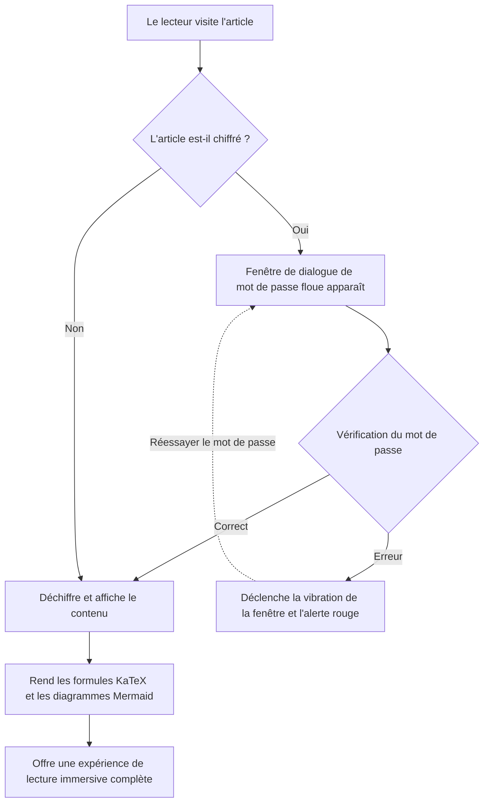
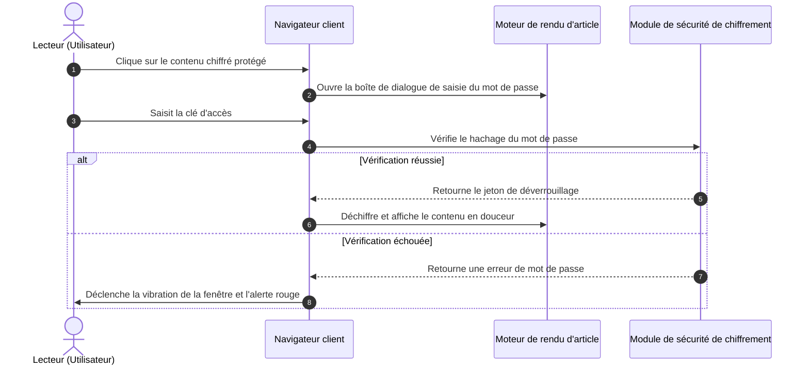

# Guide panoramique des générateurs de sites statiques (SSG) et des formats de contenu de thème

Dans l'ingénierie moderne des générateurs de sites statiques (SSG) et des thèmes de blogs indépendants, la **capacité d'analyse et de rendu des formats de contenu des articles** détermine directement les limites d'expression du créateur et l'expérience de lecture du lecteur.

Ce guide, en combinant les spécifications de contenu des écosystèmes SSG majeurs (**Hugo, Jekyll, Eleventy, Astro, Pelican, Hexo, WordPress, VitePress**, etc.), établit un système panoramique couvrant le **balisage de base, les langages de documentation étendus, les formats de publication WordPress, les sélecteurs déroulants interactifs, les accordéons, les formules mathématiques LaTeX, les diagrammes Mermaid et les fonctionnalités spéciales de chiffrement/déchiffrement**, et fournit des démonstrations de rendu en direct prêtes à l'emploi.

---

## I. Récapitulatif du support des formats de contenu et de l'écosystème des générateurs de sites statiques (SSG) majeurs

Les différents générateurs de sites statiques adoptent des philosophies distinctes en matière d'architecture d'analyse de contenu. Le tableau ci-dessous récapitule de manière systématique le support natif et étendu des divers formats par les moteurs principaux :

| Générateur de site statique / Plateforme | Moteur d'analyse principal | Formats pris en charge nativement | Formats pris en charge via extensions / outils externes | Support de sérialisation Front Matter |
| :--- | :--- | :--- | :--- | :--- |
| **Hugo** | Goldmark (Go) | `.md` (CommonMark/GFM), `.html`, `.org` (Org-mode) | `.adoc` (Asciidoctor), `.rst` (rst2html), `.pdc` (Pandoc) | YAML (`---`), TOML (`+++`), JSON (`{}`) |
| **Astro (Architecture de ce blog)** | Vite + Unified/Remark + MDX | `.md` (GFM), `.mdx` (JSX), `.html`, composants `.astro` | Peut monter des chargeurs AST pour étendre Org/AsciiDoc/RST | YAML, TOML, JSON |
| **Jekyll** | Kramdown (Ruby) | `.md` (Kramdown/GFM), `.html` | `.textile` (plugin Textile) | YAML |
| **Eleventy (11ty)** | Pipeline de templates JavaScript | `.md`, `.html`, `.liquid`, `.njk`, `.ejs`, `.webc` | MDX (plugin), extensions de templates personnalisées | YAML, JSON, JS/11tydata |
| **Hexo** | Marked / Hexo-Renderer | `.md` (GFM), `.html`, templates EJS/Pug | Org-mode / Pandoc (support de plugins) | YAML, JSON |
| **Pelican** | Python Docutils | `.md` (Markdown), `.rst` (reStructuredText) | `.asciidoc` (Asciidoctor) | YAML, Markdown Metadata |
| **WordPress (Headless/Thème)** | Gutenberg Block Engine | Blocs HTML5, Shortcodes, Formats de publication | Éditeur classique HTML | Métadonnées de bloc JSON / Post Meta |
| **VitePress / Docusaurus** | Markdown-It / MDX | `.md`, `.mdx`, composants Vue/React | Syntaxe de conteneur personnalisée (`::: tip`) | YAML |

> [!NOTE]
> **Aperçu de l'architecture de l'écosystème** : Hugo, grâce à la haute concurrence du langage Go, prend en charge nativement Markdown et Org-mode ; tandis que les SSG front-end modernes, représentés par **Astro**, exploitent les **capacités de MDX et des îles de composants (Islands)** pour intégrer de manière transparente des interfaces utilisateur interactives dynamiques (telles que le sélecteur déroulant, la fenêtre contextuelle de mot de passe, le disque vinyle présentés dans cet article) directement dans le corps du texte, offrant une flexibilité ultime.

---

## II. Spécification du support des formats de sérialisation Front Matter

Les métadonnées en début d'article de blog (Front Matter) déterminent le routage, le titre, la date, la catégorie, la couverture et le statut de protection de l'article. Ce thème prend en charge tous les modes de sérialisation courants :

### 1. Format YAML (le plus largement utilisé, recommandé par défaut)

```yaml
---
title: "Titre de l'article"
pubDate: 2026-08-28
author: "shijianus"
tags: ["Astro", "Markdown"]
featured: true
postFormat: "aside"
---
```

### 2. Format TOML (couramment utilisé par Hugo)

```toml
+++
title = "Titre de l'article"
pubDate = 2026-08-28T00:00:00Z
author = "shijianus"
tags = ["Astro", "Markdown"]
featured = true
+++
```

### 3. Format JSON (pour les scénarios pilotés par API et Headless)

```json
{
  "title": "Titre de l'article",
  "pubDate": "2026-08-28T00:00:00.000Z",
  "author": "shijianus",
  "tags": ["Astro", "Markdown"],
  "featured": true
}
```

---

## III. Comparaison et référence de migration pour les balisages légers spéciaux et les formats non-Markdown

Dans différentes piles technologiques, les auteurs peuvent utiliser d'autres langages de balisage légers que Markdown. Voici les caractéristiques syntaxiques des formats courants et leur rendu équivalent dans ce thème :

### 1. AsciiDoc (.adoc / .asciidoc)

AsciiDoc est couramment utilisé dans les livres techniques et les longs manuels d'ingénierie, et dispose d'un système extrêmement riche de blocs d'avertissement et d'attributs :

```asciidoc
// Syntaxe source AsciiDoc
= Spécification technique AsciiDoc
:author: shijianus
:toc: macro

[NOTE]
====
Ceci est une carte de note de style AsciiDoc.
====

[cols="1,2,1", options="header"]
|===
| Module | Description | Statut
| Moteur principal | Pipeline statique Astro 6 | Prêt
|===
```

**Écriture équivalente en Markdown / MDX dans ce thème** :

> [!NOTE]
> Ceci est une carte de note équivalente rendue nativement dans le thème Astro, avec un style et une interaction parfaitement alignés.

| Module | Description | Statut |
| :--- | :--- | :---: |
| **Moteur principal** | Pipeline statique Astro 6 | <span class="badge badge-success">Prêt</span> |

### 2. Emacs Org-Mode (.org)

Org-mode est un outil puissant pour les utilisateurs d'Emacs pour la gestion des connaissances, le suivi des tâches et la rédaction de documents :

```ini
#+TITLE: Notes de pratique Emacs Org-Mode
#+DATE: 2026-08-28
#+TAGS: Emacs OrgMode

* TODO Phase 1 : Amélioration de la numérisation Markdown [1/2]
- [X] Correction des tableaux et du débordement mobile
- [ ] Compléter le convertisseur de syntaxe Org-mode

#+BEGIN_QUOTE
“Org-mode n'est pas seulement un format, c'est aussi un flux de travail de pensée exécutable.”
#+END_QUOTE
```

**Présentation de la liste de tâches GFM statique standard dans ce thème (état en lecture seule)** :

- [x] Correction des tableaux et du débordement mobile
- [ ] Compléter le convertisseur de syntaxe Org-mode

> [!QUOTE]
> “Org-mode n'est pas seulement un format, c'est aussi un flux de travail de pensée exécutable.”

#### Liste de contrôle de tutoriel interactive et progression en chaîne (Interactive Tutorial Checklist & Chained Progression)

Dans les tutoriels techniques, les exercices pratiques et les guides de déploiement, les listes de tâches `[ ]` traditionnelles en lecture seule ne permettent pas une interaction et une mémorisation intuitives. Ce thème propose une **liste de contrôle interactive (`.article-task-tracker`) qui prend en charge le cochage en temps réel et la liaison d'état en chaîne**. Chaque fois que le lecteur coche un élément, la barre de progression dynamique recalcule le pourcentage en temps réel. Une fois toutes les étapes clés confirmées, les **instructions de préparation en aval seront automatiquement débloquées en chaîne**, ce qui la rend idéale comme liste de contrôle de progression pour les tutoriels :

<div class="article-task-tracker" data-storage-key="content-format-tutorial-demo">
  <div class="task-tracker__header">
    <div class="task-tracker__title">
      <svg width="20" height="20" viewBox="0 0 24 24" fill="none" stroke="currentColor" stroke-width="2"><path d="M9 11l3 3L22 4"/><path d="M21 12v7a2 2 0 0 1-2 2H5a2 2 0 0 1-2-2V5a2 2 0 0 1 2-2h11"/></svg>
      <span>Liste de contrôle préalable au déploiement technique d'un site statique (cochage interactif en temps réel)</span>
    </div>
    <span class="task-tracker__count">1/4 étapes terminées (25%)</span>
  </div>
  <div class="task-tracker__bar-wrap">
    <div class="task-tracker__fill" style="width: 25%;"></div>
  </div>
  <ul class="task-checklist">
    <li class="task-checklist-item is-done">
      <input type="checkbox" checked id="chk-step-1" />
      <div class="task-item-body">
        <label for="chk-step-1" class="task-item-label">Étape 1 : Effectuer une sauvegarde complète du code local et un commit Git</label>
        <div class="task-item-desc">Vérifier que l'arborescence de travail est propre et enregistrer le hachage de sauvegarde dans le journal d'audit de développement.</div>
      </div>
    </li>
    <li class="task-checklist-item">
      <input type="checkbox" id="chk-step-2" />
      <div class="task-item-body">
        <label for="chk-step-2" class="task-item-label">Étape 2 : Configurer le pipeline de construction statique de Cloudflare Pages</label>
        <div class="task-item-desc">Définir <code>BLOG_BUILD_TARGET=static</code> et l'environnement d'exécution Node.js 20+.</div>
      </div>
    </li>
    <li class="task-checklist-item">
      <input type="checkbox" id="chk-step-3" />
      <div class="task-item-body">
        <label for="chk-step-3" class="task-item-label">Étape 3 : Vérifier les ressources multimédias et l'intégration de vidéos/audios externes</label>
        <div class="task-item-desc">S'assurer que la taille de tous les fichiers audio et vidéo est strictement inférieure à 25 Mo, conformément aux spécifications de déploiement CDN.</div>
      </div>
    </li>
    <li class="task-checklist-item">
      <input type="checkbox" id="chk-step-4" />
      <div class="task-item-body">
        <label for="chk-step-4" class="task-item-label">Étape 4 : Exécuter la régression visuelle automatisée et les tests de fumée avec Playwright</label>
        <div class="task-item-desc">Vérifier que la mise en page de toutes les cartes multimédias riches et des composants interactifs est correcte sur PC et mobile, à différentes résolutions.</div>
      </div>
    </li>
  </ul>
  <div class="task-tracker__status-card is-pending">
    <div class="status-card__header">
      <span class="badge badge-warning">⏳ En attente de préparation</span>
      <span style="font-weight:700;">Progression actuelle : 1/4 (25%)</span>
    </div>
    <p style="margin-top:0.4rem;margin-bottom:0;font-size:0.88rem;line-height:1.6;">Veuillez compléter chaque étape cochée dans la liste ci-dessus ; une fois toutes les tâches terminées, les instructions de publication en production seront débloquées en temps réel ici.</p>
  </div>
</div>

---

### 3. reStructuredText (.rst)

reStructuredText est le format de documentation standard de la communauté Python (par exemple, Sphinx, ReadTheDocs) :

```rst
.. Syntaxe source reStructuredText
.. note::
   Ceci est un bloc Note défini par une directive RST.

.. code-block:: python
   :linenos:

   def greet(name: str) -> str:
       return f"Hello, {name}!"
```

**Rendu équivalent en Markdown dans ce thème** :

> [!NOTE]
> Ceci est une carte équivalente à une Note RST, rendue selon la spécification GitHub Alert dans Astro.

```python
def greet(name: str) -> str:
    return f"Hello, {name}!"
```

---

### 4. Syntaxe Textile

Textile est un langage de balisage léger de longue date (courant dans Redmine et les premiers blogs Jekyll) :

```markdown
h2. Titre de section
bq. Ceci est le contenu d'un bloc de citation Textile.
*Élément de liste 1*
_Texte en italique accentué_
```

---

## IV. Implémentation complète et présentation visuelle des formats de publication (Post Formats) de style WordPress

Le mécanisme classique des **Formats de publication** dans l'écosystème des thèmes WordPress permet aux blogs d'afficher des formes visuelles spécifiques pour différents types de contenu. Nous avons entièrement implémenté ces 9 formats dans la colonne principale de ce thème :

### 1. `aside` (Pensée rapide / Mémo / Carte de note)

Convient pour enregistrer de courtes inspirations, des rappels ou des notes temporaires :

<div class="article-aside">
  <p><strong>💡 Mémo rapide</strong> : La véritable valeur d'un site statique ne réside pas dans la démonstration technique, mais dans la livraison d'une expérience de lecture pure, ultra-rapide et sans charge de maintenance côté serveur. Même après cinq ou dix ans, les fichiers HTML générés peuvent toujours être ouverts parfaitement.</p>
</div>

---

### 2. `status` (Mise à jour de statut / Pensée fugace / Micro-citation)

Une carte de publication de statut instantanée de style Twitter/Weibo, incluant l'avatar de l'auteur, l'identifiant du client et un tag d'humeur :

<div class="article-status">
  <div class="article-status__header">
    <div class="article-status__user">
      
      <div>
        <div class="article-status__name">shijianus</div>
        <div class="article-status__meta">Publié le 28-08-2026 14:32 · 🇨🇳 Hangzhou</div>
      </div>
    </div>
    <div class="article-status__badge">
      <span>📱 Depuis Geek Workshop Mac Studio</span>
    </div>
  </div>
  <p class="article-status__content">
    Aujourd'hui, j'ai enfin terminé toutes les extensions de format et la refonte visuelle de la colonne de contenu principale du blog ! De KaTeX et Mermaid aux menus déroulants interactifs et aux disques vinyles, la sensation de livraison statique complète est incroyable 🚀✨
  </p>
</div>

---

### 3. `quote` (Citation sélectionnée / Grande carte de citation)

Utilisé pour afficher des citations percutantes, des maximes de design ou des phrases mémorables :

<div class="article-quote">
  <div class="article-quote__icon">“</div>
  <div class="article-quote__body">
    Simplicity is prerequisite for reliability. (La simplicité est un prérequis à la fiabilité.)
  </div>
  <div class="article-quote__author">
    
    <div class="article-quote__author-info">
      <div class="article-quote__author-name">Edsger W. Dijkstra</div>
      <div class="article-quote__author-title">Informaticien · Lauréat du Prix Turing (1972)</div>
    </div>
  </div>
</div>

---

### 4. `gallery` (Galerie d'images / Album adaptatif et grille Polaroid)

Prend en charge des grilles réactives adaptatives à plusieurs colonnes et des cartes photo Polaroid avec une touche humaine. Cliquer sur n'importe quelle image déclenche un agrandissement en plein écran avec une lightbox :

#### Galerie adaptative à 2 et 3 colonnes

<div class="article-gallery">
  <div class="gallery-grid gallery-grid-3">
    <div class="gallery-item">
      
      <div class="gallery-item__caption">Vue panoramique du poste de travail du geek</div>
    </div>
    <div class="gallery-item">
      
      <div class="gallery-item__caption">Grand écran de conception d'architecture système</div>
    </div>
    <div class="gallery-item">
      
      <div class="gallery-item__caption">Couverture visuelle de la balade galactique</div>
    </div>
  </div>
</div>

#### Galerie de photos Polaroid (Style Polaroid)

<div class="gallery-polaroid">
  <div class="polaroid-card">
    
    <div class="polaroid-card__caption">2026.04 Hangzhou · Base de R&D</div>
  </div>
  <div class="polaroid-card">
    
    <div class="polaroid-card__caption">2026.08 Nuit de refonte et d'évolution architecturale</div>
  </div>
</div>

---

### 5. `video` (Carte de lecture vidéo adaptative)

Prend en charge un rapport réactif 16:9, des bords arrondis et une description en bas de page. Chaque vidéo occupe une ligne complète. Compatible avec l'intégration externe de Bilibili et YouTube via proxy, ainsi qu'avec les fichiers MP4 natifs du site (chaque fichier est limité à 25 Mo, respectant les spécifications de déploiement statique de Cloudflare Pages) :

#### Intégration vidéo externe (Intégration via proxy de liens Bilibili & YouTube · Par défaut, le lecteur doit faire défiler jusqu'ici et cliquer pour démarrer la lecture)

<div class="video-embed-card" data-video-type="bilibili">
  <iframe src="https://player.bilibili.com/player.html?bvid=BV11k4y1T7kS&page=1&high_quality=1&danmaku=0&autoplay=0" allowfullscreen="true" loading="lazy" allow="accelerometer; autoplay; clipboard-write; encrypted-media; gyroscope; picture-in-picture; web-share" sandbox="allow-top-navigation-by-user-activation allow-same-origin allow-forms allow-scripts allow-popups"></iframe>
  <div class="embed-caption">🎬 Démonstration d'intégration externe Bilibili : BV11k4y1T7kS (1080P HD · Faites défiler jusqu'ici et cliquez pour lire)</div>
</div>

<div class="video-embed-card" data-video-type="youtube">
  <iframe src="https://www.youtube-nocookie.com/embed/LXb3EKWsInQ?autoplay=0&rel=0" allowfullscreen="true" loading="lazy" allow="accelerometer; autoplay; clipboard-write; encrypted-media; gyroscope; picture-in-picture; web-share"></iframe>
  <div class="embed-caption">🎬 Démonstration d'intégration externe YouTube : Costa Rica 4K 60fps HDR (1080P/4K · URL valide · Faites défiler jusqu'ici et cliquez pour lire)</div>
</div>

#### Intégration vidéo MP4 native sur le site (Lecteur vidéo HTML5 natif · Prend en charge la vitesse de lecture et le mode image dans l'image · Téléchargement désactivé par défaut)

<div class="video-embed-card">
  <video controls controlsList="nodownload" preload="metadata" playsinline oncontextmenu="return false;">
    <source src="/media/video/landscape_compressed.mp4" type="video/mp4" />
    Votre navigateur ne prend pas en charge la lecture vidéo HTML5.
  </video>
  <div class="embed-caption">🎥 Vidéo native intégrée 1 : Démonstration de paysage ultra HD 4K/1080P (Taille 21.7 Mo · Prend en charge la vitesse de lecture et le mode image dans l'image · Téléchargement direct désactivé)</div>
</div>

<div class="video-embed-card">
  <video controls controlsList="nodownload" preload="metadata" playsinline oncontextmenu="return false;">
    <source src="/media/video/blue_archive_miracle.mp4" type="video/mp4" />
    Votre navigateur ne prend pas en charge la lecture vidéo HTML5.
  </video>
  <div class="embed-caption">🎥 Vidéo native intégrée 2 : [Blue Archive] "Le début et la fin du miracle — C'est à nous de décider de notre histoire !" (Taille 23.3 Mo · Prend en charge la vitesse de lecture et le mode image dans l'image · Téléchargement direct désactivé)</div>
</div>

---

### 6. `audio` (Carte musicale avec vinyle rotatif)

Contrôleur audio HTML5 intégré, déclenchant automatiquement une **animation de rotation fluide et continue du disque vinyle** lors de la lecture. Toutes les pochettes d'album sont des couvertures officielles haute définition fidèlement assorties, prenant en charge plusieurs formats audio courants (FLAC sans perte, MP3 à haut débit, AAC/M4A), avec une protection anti-scraping et anti-téléchargement intégrée :

#### ① Shaun - Way Back Home (Format audio FLAC sans perte · 24.55 Mo)

<div class="article-audio-card">
  <div class="audio-card__cover">
    
  </div>
  <div class="audio-card__info">
    <div class="audio-card__title">
      <span>Way Back Home</span>
      <span class="badge badge-purple">FLAC Lossless</span>
    </div>
    <div class="audio-card__author">Shaun (숀) · Audio sans perte (FLAC / 44.1kHz 16-bit 961 kbps)</div>
    <audio controls preload="metadata" controlsList="nodownload" oncontextmenu="return false;" src="/media/audio/WayBackHome.flac"></audio>
  </div>
</div>

#### ② ヨルシカ (Yorushika) - 彼女は旅に出る (Format HD MP3 320 Kbps · 8.41 Mo)

<div class="article-audio-card">
  <div class="audio-card__cover">
    
  </div>
  <div class="audio-card__info">
    <div class="audio-card__title">
      <span>彼女は旅に出る (She Leaves on a Journey)</span>
      <span class="badge badge-success">320 Kbps MP3</span>
    </div>
    <div class="audio-card__author">ヨルシカ (Yorushika) · Stéréo HD (MP3 / 48kHz 320 kbps)</div>
    <audio controls preload="metadata" controlsList="nodownload" oncontextmenu="return false;" src="/media/audio/彼女は旅に出る.mp3"></audio>
  </div>
</div>

#### ③ すこっぷ feat. 初音ミク - アイロニ (Format M4A / AAC · 7.63 Mo)

<div class="article-audio-card">
  <div class="audio-card__cover">
    
  </div>
  <div class="audio-card__info">
    <div class="audio-card__title">
      <span>アイロニ (Irony / Ironie)</span>
      <span class="badge badge-cyan">M4A / AAC</span>
    </div>
    <div class="audio-card__author">すこっぷ feat. 初音ミク · Audio AAC (M4A / 44.1kHz 260 kbps)</div>
    <audio controls preload="metadata" controlsList="nodownload" oncontextmenu="return false;" src="/media/audio/アイロニ.m4a"></audio>
  </div>
</div>

---

### 7. `link` (Carte de prévisualisation de lien externe et de signet / Bookmark Preview)

Fournit une prévisualisation élégante sous forme de carte pour les références clés de l'article :

<a class="article-bookmark" href="https://github.com/shijianus/shijianus-blog" target="_blank" rel="noopener">
  <div class="article-bookmark__content">
    <div class="article-bookmark__title">EpoCanvas / shijianus-blog (Dépôt des spécifications de conception du thème principal du blog 時間)</div>
    <p class="article-bookmark__desc">EpoCanvas (時代画布) est un système d'architecture de contenu de blog geek moderne axé sur la présentation d'informations à haute densité, les micro-interactions élégantes et la prise en charge de tous les formats.</p>
    <div class="article-bookmark__site">
      <span class="badge badge-primary">GitHub</span>
      <span>github.com · EpoCanvas Core Spec</span>
    </div>
  </div>
  <div class="article-bookmark__icon">
    <svg viewBox="0 0 24 24" width="24" height="24" fill="none" stroke="currentColor" stroke-width="2" stroke-linecap="round" stroke-linejoin="round"><path d="M18 13v6a2 2 0 0 1-2 2H5a2 2 0 0 1-2-2V8a2 2 0 0 1 2-2h6"/><polyline points="15 3 21 3 21 9"/><line x1="10" y1="14" x2="21" y2="3"/></svg>
  </div>
</a>

### 8. `chat` (Flux de dialogue à bulles de chat / Organic Animated Dialogue Stream)

Utilisé pour des démonstrations vivantes de soutenances techniques, de discussions à deux ou de scénarios d'entretiens utilisateurs, prenant en charge les bulles gauche/droite, le code en ligne, la personnalisation des couleurs, ainsi que des effets d'animation de saisie adaptatifs au contenu dynamique, des effets sonores de synthèse Web Audio et des avatars dynamiques (`footer_mini_logo__media`) :
*   **Mode statique (par défaut)** : `<div class="article-chat">` maintient une présentation légère et purement statique, sans aucun coût JS ;
*   **Activation de la démonstration dynamique (contrôle par paramètre)** : Configurez `data-animate="true"` (ou `class="article-chat is-animated"`), le système déclenchera automatiquement une animation de saisie réaliste basée sur la longueur des caractères et une loi aléatoire naturelle, ainsi que des sons d'invite exclusifs gauche/droite, **lorsque le lecteur fera défiler la page pour la première fois dans cette fenêtre d'affichage** ;
*   **Synchronisation dynamique non mécanique (Content-Length Aware Timing)** : Le système détermine intelligemment la durée de l'indicateur de saisie en fonction de la longueur du message (380 ms de clignotement pour les phrases courtes, 1000 ms+ de "réflexion" pour les longs paragraphes techniques), et ajoute des pauses naturelles et de légères variations de fréquence sonore entre les bulles, conformes à la lecture humaine ;
*   **Prise en charge des avatars vidéo dynamiques (`footer_mini_logo__media`)** : Les avatars prennent en charge l'intégration de micro-vidéos MP4 animées et d'affiches statiques de secours ;
*   **Déclenchement unique et garantie de rechargement** : Après le premier déclenchement par défilement, il se verrouille automatiquement, les défilements répétés ultérieurs ne le déclencheront pas à nouveau pour ne pas perturber la lecture ; il ne sera réinitialisé que lorsque l'utilisateur rafraîchira la page (F5) ; une barre de micro-contrôle "↺ Rejouer" et "🔊/🔇 Activer/Désactiver le son" est également disponible en haut à droite.

<div class="article-chat" data-animate="true" data-sound="true">
  <div class="chat-message chat-left">
    <span class="chat-avatar footer_mini_logo__media">
      <video autoplay muted loop playsinline preload="metadata" poster="/media/shijianus/avatar.jpg" aria-hidden="true">
        <source src="/media/shijianus/avatar-dynamic.mp4" type="video/mp4" />
      </video>
      
    </span>
    <div class="chat-body">
      <div class="chat-author">Développeur <a href="https://github.com/LeonBoven" target="_blank" rel="noopener noreferrer">Léon Boven</a> · 10:15</div>
      <div class="chat-bubble">
        Bonjour ! L'implémentation du rendu statique de <code>KaTeX</code> et <code>Mermaid</code> dans Astro ne ralentira-t-elle pas la vitesse de chargement des pages front-end ?
      </div>
    </div>
  </div>

  <div class="chat-message chat-right">
    
    <div class="chat-body">
      <div class="chat-author">Architecte <a href="https://github.com/shijianus" target="_blank" rel="noopener noreferrer">shijianus</a> · 10:16</div>
      <div class="chat-bubble">
        Absolument pas ! Car <code>remark-math</code> et <code>rehype-katex</code> compilent déjà les formules en chaînes HTML/MathML pures pendant la phase de construction (Build-time), ce qui représente <strong>0 charge d'exécution JS</strong> côté navigateur ; et les diagrammes Mermaid chargent également les modules ESM de manière asynchrone et à la demande, rendant le premier affichage extrêmement rapide ! ⚡
      </div>
    </div>
  </div>

  <div class="chat-message chat-left">
    <span class="chat-avatar footer_mini_logo__media">
      <video autoplay muted loop playsinline preload="metadata" poster="/media/shijianus/avatar.jpg" aria-hidden="true">
        <source src="/media/shijianus/avatar-dynamic.mp4" type="video/mp4" />
      </video>
      
    </span>
    <div class="chat-body">
      <div class="chat-author">Développeur <a href="https://github.com/LeonBoven" target="_blank" rel="noopener noreferrer">Léon Boven</a> · 10:17</div>
      <div class="chat-bubble">
        Génial ! Donc, nous pouvons directement écrire des diagrammes de séquence d'architecture et des convertisseurs d'unités interactifs en Markdown, prêts à l'emploi, n'est-ce pas ?
      </div>
    </div>
  </div>

  <div class="chat-message chat-right">
    
    <div class="chat-body">
      <div class="chat-author">Architecte <a href="https://github.com/shijianus" target="_blank" rel="noopener noreferrer">shijianus</a> · 10:18</div>
      <div class="chat-bubble">
        Exactement ! Non seulement le double-clic pour zoomer et l'exportation SVG haute définition sont entièrement disponibles, mais le convertisseur d'unités intègre également la <strong>synchronisation en temps réel des taux de change en ligne</strong> et le <strong>changement d'unité de base via un menu déroulant</strong>, et assure une expression complète et symétrique des unités de masse fixes, toutes les mesures ayant été rigoureusement testées ! 🚀
      </div>
    </div>
  </div>

  <div class="chat-message chat-left">
    <span class="chat-avatar footer_mini_logo__media">
      <video autoplay muted loop playsinline preload="metadata" poster="/media/shijianus/avatar.jpg" aria-hidden="true">
        <source src="/media/shijianus/avatar-dynamic.mp4" type="video/mp4" />
      </video>
      
    </span>
    <div class="chat-body">
      <div class="chat-author">Développeur <a href="https://github.com/LeonBoven" target="_blank" rel="noopener noreferrer">Léon Boven</a> · 10:19</div>
      <div class="chat-bubble">
        Compris ! Cette sensation interactive et l'animation de saisie qui varie en fonction de la longueur du message sont très naturelles, je vais immédiatement mettre à jour la bibliothèque de documentation technique de l'équipe ! 🎉
      </div>
    </div>
  </div>

  <div class="chat-message chat-right">
    
    <div class="chat-body">
      <div class="chat-author">Architecte <a href="https://github.com/shijianus" target="_blank" rel="noopener noreferrer">shijianus</a> · 10:20</div>
      <div class="chat-bubble">
        Bienvenue à l'essayer ! Si vous rencontrez des besoins d'extension de format ou de personnalisation à l'avenir, n'hésitez pas à en discuter sur le forum ou sur GitHub~ ✨
      </div>
    </div>
  </div>
</div>

---

## V. Formats de listes déroulantes spéciales et composants interactifs dynamiques (Dropdown Selectors & Interactive Formats)

Pour les **formats de listes déroulantes spéciales** explicitement demandés par les utilisateurs, nous avons intégré des composants de sélecteur déroulant à réponse instantanée côté client directement dans le corps de l'article :

### 1. Sélecteur déroulant pour plusieurs frameworks et versions de code (Interactive Dropdown Switcher)

Les lecteurs peuvent librement choisir un framework technique dans la liste déroulante, et le panneau de contenu basculera en temps réel, sans rechargement, pour afficher le contenu et le code correspondants :

<div class="article-dropdown-switcher">
  <div class="article-dropdown-switcher__header">
    <div class="article-dropdown-switcher__title">
      <svg width="20" height="20" viewBox="0 0 24 24" fill="none" stroke="currentColor" stroke-width="2"><rect x="3" y="3" width="18" height="18" rx="2"/><path d="M9 3v18"/><path d="m14 9 3 3-3 3"/></svg>
      <span>Veuillez sélectionner le code d'implémentation du framework frontend à afficher :</span>
    </div>
    <select class="article-select dropdown-switcher__select">
      <option value="react-tab">⚛️ React 19 (Hooks & TSX)</option>
      <option value="vue-tab">🟢 Vue 3.5 (Composition API)</option>
      <option value="astro-tab">🚀 Astro 6 (Island Component)</option>
      <option value="svelte-tab">🟠 Svelte 5 (Runes)</option>
    </select>
  </div>
  <div class="article-dropdown-switcher__body">
    <div class="article-dropdown-panel is-active" data-panel="react-tab">
      <div class="article-dropdown-panel__title">⚛️ Implémentation du composant React 19 :</div>
      <pre class="no-code-enhance"><code class="language-tsx">import { useState } from 'react';
export function Counter() {
  const [count, setCount] = useState(0);
  return (
    &lt;button onClick={() =&gt; setCount((c) =&gt; c + 1)} className="btn-primary"&gt;
      React Compteur de clics :&#123;count&#125;
    &lt;/button&gt;
  );
}</code></pre>
    </div>
    <div class="article-dropdown-panel" data-panel="vue-tab">
      <div class="article-dropdown-panel__title">🟢 Implémentation du composant monofichier Vue 3.5 :</div>
      <pre class="no-code-enhance"><code class="language-html">&lt;script setup lang="ts"&gt;
import { ref } from 'vue';
const count = ref(0);
&lt;/script&gt;
&lt;template&gt;
  &lt;button @click="count++" class="btn-primary"&gt;
    Vue Compteur de clics :&#123;&#123; count &#125;&#125;
  &lt;/button&gt;
&lt;/template&gt;</code></pre>
    </div>
    <div class="article-dropdown-panel" data-panel="astro-tab">
      <div class="article-dropdown-panel__title">🚀 Implémentation du composant statique Astro 6 (zéro JS) :</div>
      <pre class="no-code-enhance"><code class="language-astro">---
const { title = "Archipel Astro ultra-rapide" } = Astro.props;
---
&lt;div class="astro-island"&gt;
  &lt;h3&gt;&#123;title&#125;&lt;/h3&gt;
  &lt;p&gt;Livraison par défaut de 0 Ko de JavaScript, hydratation interactive à la demande !&lt;/p&gt;
&lt;/div&gt;</code></pre>
    </div>
    <div class="article-dropdown-panel" data-panel="svelte-tab">
      <div class="article-dropdown-panel__title">🟠 Implémentation Svelte 5 Runes :</div>
      <pre class="no-code-enhance"><code class="language-svelte">&lt;script lang="ts"&gt;
  let count = $state(0);
&lt;/script&gt;
&lt;button onclick={() =&gt; count++} class="btn-primary"&gt;
  Svelte Compteur de clics :&#123;count&#125;
&lt;/button&gt;</code></pre>
    </div>
  </div>
</div>

---

### 2. Convertisseur d'unités universel interactif multi-catégories (Universal Interactive Unit Converter · Sélecteur de base déroulant et taux de change en temps réel)

Permet à l'utilisateur de saisir librement **n'importe quelle valeur de base** dans le champ de saisie (la valeur par défaut est `1`, prend en charge les incrémenteurs/décrémenteurs et la réinitialisation en un clic), et de convertir instantanément et de manière transparente entre différentes catégories (masse/poids, taux de change internationaux, stockage de données, bande passante réseau, longueur/dimensions) :
*   **Base de conversion dynamique et commutable (Base Unit Dropdown)** : L'unité de base à droite du champ de saisie prend en charge la sélection libre via un menu déroulant (par exemple, pour la masse, vous pouvez choisir `kg`, `g`, `lb`, `斤`, `oz`, `t`, etc. ; pour les taux de change, vous pouvez choisir `USD`, `HKD`, `CNY`, `EUR`, `JPY`, `GBP`, etc.). Après avoir sélectionné une unité de base, la grille de conversion cible **exclura intelligemment et automatiquement l'unité de base actuelle (éliminant complètement les cartes redondantes comme 1kg=1kg)**, et recalculera instantanément toutes les unités cibles en utilisant la base actuelle comme dénominateur ;
*   **Accès en ligne aux fluctuations réelles des taux de change (Live Forex API)** : Lors du passage à « 💱 Taux de change internationaux », le système demandera automatiquement et de manière asynchrone au serveur `/api/exchange-rate` et utilisera une interface publique de taux de change en temps réel pour obtenir les derniers cours en direct des principales devises (le coin supérieur droit affichera `🟢 Taux de change en temps réel synchronisés en ligne`) ; en cas de non-connexion ou de déconnexion hors ligne, il reviendra automatiquement et de manière transparente aux ratios de base intégrés (affichant `⚪ Taux de change de base hors ligne`), garantissant que le « temps réel » est vraiment en temps réel et que l'expérience hors ligne est solide comme le roc ;
*   **Appel API universel et pratique** : Le système expose également la fonction d'assistance `window.shijianusAPI.fetchExchangeRates(base)` globalement, facilitant l'appel instantané des données de cours en temps réel par tout script personnalisé dans la documentation ;
*   **Copie rapide en un clic et déduction d'équations** : Chaque carte de conversion fournit un bouton de copie en un clic avec un retour visuel en surbrillance, et un résumé de la déduction de la chaîne d'équations dynamique est affiché simultanément en bas.

<div class="interactive-unit-converter" data-default="1" data-title="🔄 Convertisseur d'unités universel interactif (prend en charge le changement d'unité de base et les taux de change en temps réel)"></div>

---

### 3. Calculateur interactif de spécifications et de codecs vidéo (Interactive Spec Calc Dropdown)

Lorsque différentes options sont sélectionnées, les indicateurs techniques et les descriptions de conversion correspondants s'affichent en temps réel sur la droite :

<div class="interactive-calc-select">
  <div class="article-select-box">
    <label>
      <svg width="18" height="18" viewBox="0 0 24 24" fill="none" stroke="currentColor" stroke-width="2"><circle cx="12" cy="12" r="10"/><path d="M12 6v6l4 2"/></svg>
      <span>Sélectionner la résolution d'encodage vidéo :</span>
    </label>
    <select class="article-select">
      <option value="1080p" data-desc="1920 × 1080 @ 60fps · Débit binaire 6 000 Kbps · Bande passante recommandée 15 Mbps">Full HD 1080P (1080p60)</option>
      <option value="2k" data-desc="2560 × 1440 @ 60fps · Débit binaire 12 000 Kbps · Bande passante recommandée 30 Mbps">2K Ultra HD (1440p60)</option>
      <option value="4k" data-desc="3840 × 2160 @ 60fps · Débit binaire 25 000 Kbps · Bande passante recommandée 60 Mbps">4K Ultra HD (2160p60 HDR)</option>
      <option value="8k" data-desc="7680 × 4320 @ 60fps · Débit binaire 80 000 Kbps · Bande passante recommandée 200 Mbps">8K Qualité Cinéma (4320p60 AV1)</option>
    </select>
  </div>
  <div class="calc-output-box">
    <span>📊 <strong>Résultat de la déduction des spécifications techniques</strong> :</span>
    <span class="calc-output-value">1920 × 1080 @ 60fps · Débit binaire 6 000 Kbps · Bande passante recommandée 15 Mbps</span>
  </div>
</div>

---

## 六. Accordéons, onglets et mise en page multi-colonnes (Collapsibles, Tabs & Columns)

### 1. Groupe d'accordéons exclusif (Développer un élément ferme automatiquement les autres)

Configurez `data-single="true"`. Lorsque vous développez un élément, les autres éléments développés du même groupe se réduisent automatiquement, gardant la page propre et focalisée :

<div class="article-accordion-group" data-single="true">
  <details class="article-accordion" open>
    <summary>
      <span>🔒 1. Avantages de sécurité des sites statiques</span>
      <svg class="accordion-chevron" viewBox="0 0 24 24" fill="none" stroke="currentColor" stroke-width="2"><polyline points="9 18 15 12 9 6"/></svg>
    </summary>
    <div class="accordion-content">
      <p>Les sites statiques n'ont pas de moteur d'exécution dynamique PHP/Node.js traditionnel ni de base de données SQL exposée au public, ce qui les immunise physiquement contre les injections SQL et les risques d'exécution de code à distance côté serveur (RCE).</p>
    </div>
  </details>

  <details class="article-accordion">
    <summary>
      <span>⚡ 2. Livraison accélérée par CDN mondial en périphérie</span>
      <svg class="accordion-chevron" viewBox="0 0 24 24" fill="none" stroke="currentColor" stroke-width="2"><polyline points="9 18 15 12 9 6"/></svg>
    </summary>
    <div class="accordion-content">
      <p>En déployant les artefacts compilés sur Cloudflare Pages ou GitHub Pages, toutes les ressources statiques peuvent être mises en cache sur plus de 300 nœuds périphériques mondiaux, avec un temps de premier octet (TTFB) généralement inférieur à 20 ms.</p>
    </div>
  </details>

  <details class="article-accordion">
    <summary>
      <span>💰 3. Coûts d'hébergement de services cloud extrêmement bas</span>
      <svg class="accordion-chevron" viewBox="0 0 24 24" fill="none" stroke="currentColor" stroke-width="2"><polyline points="9 18 15 12 9 6"/></svg>
    </summary>
    <div class="accordion-content">
      <p>Les sites statiques n'ont pas besoin de serveurs cloud VPS coûteux fonctionnant 24h/24 et 7j/7. Associés à la base de données Cloudflare D1 de niveau gratuit et à un système de commentaires sans serveur, les coûts d'exploitation quotidiens sont presque nuls.</p>
    </div>
  </details>
</div>

---

### 2. Groupe d'accordéons non exclusif (Développement multiple / Permet l'expansion simultanée de plusieurs éléments)

Configurez `data-single="false"` (ou le mode d'ouverture multiple par défaut). Les lecteurs peuvent librement développer plusieurs ou tous les éléments repliables pour une comparaison horizontale et une lecture approfondie, sans que l'ouverture d'un nouvel élément ne ferme le contenu déjà ouvert :

<div class="article-accordion-group" data-single="false">
  <details class="article-accordion" open>
    <summary>
      <span>🛠️ Module d'architecture A : Pipeline du compilateur de syntaxe Markdown AST</span>
      <svg class="accordion-chevron" viewBox="0 0 24 24" fill="none" stroke="currentColor" stroke-width="2"><polyline points="9 18 15 12 9 6"/></svg>
    </summary>
    <div class="accordion-content">
      <p>Basé sur l'architecture Unified, Remark-math et Rehype-katex, il convertit entièrement l'arbre syntaxique Markdown en nœuds HTML sémantiques standard au stade de la compilation, et réalise la coloration syntaxique et la génération de formules côté Node.js.</p>
    </div>
  </details>

  <details class="article-accordion" open>
    <summary>
      <span>🎨 Module d'architecture B : Moteur visuel dynamique EpoCanvas et système réactif</span>
      <svg class="accordion-chevron" viewBox="0 0 24 24" fill="none" stroke="currentColor" stroke-width="2"><polyline points="9 18 15 12 9 6"/></svg>
    </summary>
    <div class="accordion-content">
      <p>Offre un arrière-plan Aurora, un parallaxe Starfield, un effet de verre dépoli (Glassmorphism) et une adaptation réactive aux points d'arrêt multi-appareils, offrant une expérience esthétique cohérente sur les écrans larges 4K comme sur les téléphones pliables.</p>
    </div>
  </details>

  <details class="article-accordion">
    <summary>
      <span>🛡️ Module d'architecture C : Système d'isolation de sécurité hiérarchique WebCrypto SHA-256</span>
      <svg class="accordion-chevron" viewBox="0 0 24 24" fill="none" stroke="currentColor" stroke-width="2"><polyline points="9 18 15 12 9 6"/></svg>
    </summary>
    <div class="accordion-content">
      <p>Intègre un déverrouillage de session persistant de niveau 1, un masque dynamique polymorphe anti-espionnage de niveau 2 (flou gaussien/mosaïque/masque de spoiler), un verrouillage de niveau 3 en cas de sortie du champ de vision par une sentinelle, et une solution de chiffrement fragmenté d'URL externes, éliminant complètement l'exposition des mots de passe en texte clair dans le DOM.</p>
    </div>
  </details>
</div>

---

### 3. Onglets interactifs

<div class="article-tabs">
  <div class="article-tabs__nav">
    <button class="article-tabs__button is-active" type="button">pnpm</button>
    <button class="article-tabs__button" type="button">npm</button>
    <button class="article-tabs__button" type="button">yarn</button>
    <button class="article-tabs__button" type="button">bun</button>
  </div>
  <div class="article-tabs__panels">
    <div class="article-tabs__panel is-active">
      <pre class="no-code-enhance"><code class="language-bash">pnpm add @astrojs/mdx remark-math rehype-katex katex mermaid</code></pre>
    </div>
    <div class="article-tabs__panel">
      <pre class="no-code-enhance"><code class="language-bash">npm install @astrojs/mdx remark-math rehype-katex katex mermaid</code></pre>
    </div>
    <div class="article-tabs__panel">
      <pre class="no-code-enhance"><code class="language-bash">yarn add @astrojs/mdx remark-math rehype-katex katex mermaid</code></pre>
    </div>
    <div class="article-tabs__panel">
      <pre class="no-code-enhance"><code class="language-bash">bun add @astrojs/mdx remark-math rehype-katex katex mermaid</code></pre>
    </div>
  </div>
</div>

---

### 4. Système de grille multi-colonnes (Grille multi-colonnes)

#### Grille de cartes à 3 colonnes de largeur égale

<div class="article-grid article-grid-3">
  <div class="article-col-card">
    <h4>🎨 Système visuel</h4>
    <p>Intègre profondément l'esthétique de design geek moderne d'EpoCanvas, supportant un contraste élevé clair-obscur, des arrière-plans en verre dépoli et des transitions de couleurs fluides.</p>
  </div>
  <div class="article-col-card">
    <h4>⚡ Ingénierie de la performance</h4>
    <p>Architecture d'îlots statiques Astro 6, pré-rendu HTML au moment de la construction, optimisation SEO extrême purement statique.</p>
  </div>
  <div class="article-col-card">
    <h4>🛠️ Écosystème d'extensions</h4>
    <p>Prise en charge complète des formules KaTeX, des diagrammes Mermaid, des pop-ups chiffrés et de 9 types de formats de publication.</p>
  </div>
</div>

#### Grille de barre latérale inégale 1:2

<div class="article-grid article-columns-1-2">
  <div class="article-col-card">
    <h4>📌 Positionnement architectural</h4>
    <p>Un support d'écriture technique moderne axé sur les geeks et les ingénieurs.</p>
  </div>
  <div class="article-col-card">
    <h4>🚀 Assurance de livraison</h4>
    <p>Mécanismes intégrés de tests de fumée automatisés et de validation de construction statique, garantissant une présentation parfaite sur tous les appareils, qu'il s'agisse de formules, de diagrammes ou de cartes complexes.</p>
  </div>
</div>

---

## VII. 13 types de boîtes d'avertissement sémantiques (Admonitions / Alertes GitHub)

Basé sur les spécifications de conception de GitHub Alert et EpoCanvas, prend en charge 13 types de cartes colorées avec des significations différentes, et permet un repliement par défaut en utilisant la syntaxe `[!TYPE]-` :

> [!NOTE]
> **Remarque générale (Note)** : Il s'agit d'une information de fond standard ou d'une explication contextuelle.

> [!TIP]
> **Astuce pratique (Tip)** : Utilisez le raccourci clavier <kbd>Ctrl</kbd> + <kbd>K</kbd> pour afficher rapidement le panneau de recherche globale d'articles !

> [!IMPORTANT]
> **Point important (Important)** : Avant de déployer en environnement de production, veuillez vous assurer que la variable d'environnement `BLOG_BUILD_TARGET=static` a été correctement injectée.

> [!WARNING]
> **Avertissement de risque (Warning)** : Ne soumettez pas de clés de base de données de production ou de clés privées de services cloud dans des dépôts Git publics.

> [!CAUTION]
> **Alerte de danger (Caution)** : L'exécution d'une opération de reconstruction de table de données est destructive, veuillez d'abord sauvegarder la base de données D1 !

> [!DANGER]
> **Danger mortel (Danger)** : La suppression directe de la base de données de production entraînera la perte permanente de tous les commentaires et des actifs des utilisateurs.

> [!SUCCESS]
> **Opération réussie (Success)** : Le processus de construction statique est terminé avec succès, toutes les 47 routes statiques sont prêtes !

> [!QUESTION]
> **Discussion sur un problème (Question)** : Comment implémenter une recherche plein texte côté client pure en millisecondes dans un environnement sans dépendance côté serveur ?

> [!QUOTE]
> **Citation sélectionnée (Quote)** : « Un bon code n'est pas seulement exécutable par une machine, il transmet aussi élégamment des idées aux humains, comme un poème. »

> [!INFO]
> **Informations détaillées (Info)** : Ce blog est construit avec Astro 6 et Tailwind 4, et est entièrement exporté en statique.

> [!TODO]
> **Plan à faire (Todo)** : Il est prévu d'introduire un index de recherche plein texte côté client WebAssembly lors de la prochaine itération.

> [!BUG]
> **Enregistrement de bug (Bug)** : Le problème de troncature horizontale des tableaux sur les appareils à écran très étroit dans l'ancienne version a été corrigé.

> [!EXAMPLE]
> **Exemple d'illustration (Example)** : Toutes les boîtes d'avertissement ci-dessus s'adaptent automatiquement aux couleurs à contraste élevé des modes clair et sombre.

### Démonstration de boîte d'avertissement pliable

> [!TIP]- Cliquez pour développer : Référence de configuration de cache Nginx ultra-rapide pour l'environnement de production
> ```nginx
> location ~* \.(?:css|js|woff2?|svg|png|jpg|webp)$ {
>     expires 1y;
>     add_header Cache-Control "public, immutable";
>     access_log off;
> }
> ```

## 8. Formules mathématiques académiques (KaTeX), Diagrammes d'architecture (Mermaid 11) et Cartes mentales dynamiques (Markmap)

Dans les documents techniques de démonstration et d'exemple, le concept de présentation central est **« Effet de rendu réel + Comparaison du code source correspondant »** (onglets à double étiquette), ce qui permet non seulement aux lecteurs de découvrir intuitivement les caractéristiques visuelles et interactives finales, mais facilite également pour les développeurs la consultation, la copie et la migration vers des projets réels en un seul clic.

---

### 1. Formules mathématiques LaTeX (KaTeX Math · Dérivation en ligne et en bloc multi-lignes)

#### Formule en ligne (Inline Formula)

<div class="article-tabs">
<div class="article-tabs__nav">
<button class="article-tabs__button is-active" type="button">🌟 Rendu visuel</button>
<button class="article-tabs__button" type="button">💻 Code source LaTeX</button>
</div>
<div class="article-tabs__panels">
<div class="article-tabs__panel is-active">

Équation masse-énergie $E = mc^2$, identité d'Euler $e^{i\pi} + 1 = 0$, intégrale de Gauss $\int_{-\infty}^{\infty} e^{-x^2} dx = \sqrt{\pi}$.

</div>
<div class="article-tabs__panel">

```latex
质能方程 $E = mc^2$，欧拉恒等式 $e^{i\pi} + 1 = 0$，高斯积分 $\int_{-\infty}^{\infty} e^{-x^2} dx = \sqrt{\pi}$。
```

</div>
</div>
</div>

#### Formule de dérivation en bloc multi-lignes 1 : Transformation de Laplace d'un système dynamique du second ordre (Block Math · Single Equation)

<div class="article-tabs">
<div class="article-tabs__nav">
<button class="article-tabs__button is-active" type="button">🌟 Rendu visuel</button>
<button class="article-tabs__button" type="button">💻 Code source LaTeX</button>
</div>
<div class="article-tabs__panels">
<div class="article-tabs__panel is-active">

$$
\mathcal{L}\{\ddot{x}(t) + 2\zeta\omega_n\dot{x}(t) + \omega_n^2 x(t)\} = X(s)(s^2 + 2\zeta\omega_n s + \omega_n^2)
$$

</div>
<div class="article-tabs__panel">

```latex
$$
\mathcal{L}\{\ddot{x}(t) + 2\zeta\omega_n\dot{x}(t) + \omega_n^2 x(t)\} = X(s)(s^2 + 2\zeta\omega_n s + \omega_n^2)
$$
```

</div>
</div>
</div>

#### Formule de dérivation en bloc multi-lignes 2 : Équations classiques de Maxwell de l'électromagnétisme (Block Math · Multi-line Aligned)

<div class="article-tabs">
<div class="article-tabs__nav">
<button class="article-tabs__button is-active" type="button">🌟 Rendu visuel</button>
<button class="article-tabs__button" type="button">💻 Code source LaTeX</button>
</div>
<div class="article-tabs__panels">
<div class="article-tabs__panel is-active">

$$
\begin{aligned}
\nabla \cdot \mathbf{E} &= \frac{\rho}{\varepsilon_0} \\
\nabla \cdot \mathbf{B} &= 0 \\
\nabla \times \mathbf{E} &= -\frac{\partial \mathbf{B}}{\partial t} \\
\nabla \times \mathbf{B} &= \mu_0 \mathbf{J} + \mu_0 \varepsilon_0 \frac{\partial \mathbf{E}}{\partial t}
\end{aligned}
$$

</div>
<div class="article-tabs__panel">

```latex
$$
\begin{aligned}
\nabla \cdot \mathbf{E} &= \frac{\rho}{\varepsilon_0} \\
\nabla \cdot \mathbf{B} &= 0 \\
\nabla \times \mathbf{E} &= -\frac{\partial \mathbf{B}}{\partial t} \\
\nabla \times \mathbf{B} &= \mu_0 \mathbf{J} + \mu_0 \varepsilon_0 \frac{\partial \mathbf{E}}{\partial t}
\end{aligned}
$$
```

</div>
</div>
</div>

---

### 2. Diagrammes d'architecture Mermaid 11 (Flowchart & Sequence · Organigramme et Diagramme de séquence)

#### ① Organigramme de vérification du chiffrement et de rendu du contenu du blog (Flowchart TD)

<div class="article-tabs">
<div class="article-tabs__nav">
<button class="article-tabs__button is-active" type="button">🌟 Rendu visuel</button>
<button class="article-tabs__button" type="button">💻 Code source Mermaid</button>
</div>
<div class="article-tabs__panels">
<div class="article-tabs__panel is-active">



</div>
<div class="article-tabs__panel">

````markdown

````

</div>
</div>
</div>

#### ② Diagramme de séquence d'authentification de sécurité et de déchiffrement côté client (Sequence Diagram)

<div class="article-tabs">
<div class="article-tabs__nav">
<button class="article-tabs__button is-active" type="button">🌟 Rendu visuel</button>
<button class="article-tabs__button" type="button">💻 Code source Mermaid</button>
</div>
<div class="article-tabs__panels">
<div class="article-tabs__panel is-active">



</div>
<div class="article-tabs__panel">

````markdown

````

</div>
</div>
</div>

### 3. Cartes mentales interactives dynamiques (Markmap / Mindmap · Diffusion multidirectionnelle des branches)

Dans la structuration de spécifications techniques et d'architectures système complexes, les listes statiques traditionnelles peinent à présenter intuitivement les réseaux de connaissances complexes. Ce thème intègre entièrement le **moteur de cartes mentales interactives dynamiques Markmap**, réalisant une analyse native complète et une amélioration interactive dans la colonne principale de l'article (`.post.post-page-shell`) :

> [!TIP]
> **Règles fondamentales de la diffusion multidirectionnelle des branches** :
> 1.  **Espace de protection de bloc unique par défaut** : Par défaut, la carte mentale n'affiche qu'**un seul nœud racine central** (Niveau 1), accompagné d'un indicateur de point repliable sur le côté droit ;
> 2.  **Cliquer pour déplier les branches multidirectionnelles** : En cliquant sur le point d'un nœud racine ou de n'importe quel nœud enfant, les sous-branches se **déploieront en douceur vers l'extérieur** ;
> 3.  **Contrôle complet par la barre d'outils** : Prend en charge le **zoom avant / arrière / l'ajustement automatique au centre / le déploiement de tout en un clic / le repliement d'un seul bloc en un clic / la lecture immersive en plein écran / la copie du code source** ;
> 4.  **Glisser-déposer et zoom sur le canevas** : Maintenez le bouton gauche de la souris enfoncé pour faire glisser et déplacer librement le canevas, et faites défiler la molette de la souris pour zoomer sur la vue.

#### Présentation de la carte mentale vivante : Vue d'ensemble de l'écosystème SSG et des formats de contenu thématiques

<div class="article-tabs">
<div class="article-tabs__nav">
<button class="article-tabs__button is-active" type="button">🌟 Rendu de la carte interactive</button>
<button class="article-tabs__button" type="button">💻 Code source de la structure Mindmap</button>
</div>
<div class="article-tabs__panels">
<div class="article-tabs__panel is-active">

```mindmap
# Architecture de l'écosystème de contenu et des générateurs de sites statiques
## 1. Pipeline de compilation statique principale
### Pipeline de transformation de la syntaxe AST
#### Pipeline d'analyse sémantique Markdown / MDX
##### Extensions de syntaxe Unified / Remark
- Conversion de la syntaxe GFM pour les tableaux et le texte barré
- Génération automatique d'ancres et d'ID pour les titres
##### Extension Markmap pour les cartes mentales interactives multidirectionnelles
- Construction récursive de l'arbre AST (Transformer.transform)
- Disposition hiérarchique flexible D3 (Algorithme Flextree)
- Machine à états de pliage interactif (payload.fold)
- Coloration dynamique des branches par palette (d3.scaleOrdinal)
##### Extension Rehype Katex pour les formules mathématiques
- Analyse des formules en ligne et des blocs de formules indépendants
- Prise en charge des définitions de macros et gestion des erreurs
#### Mise en évidence du code et colorisation statique
##### Compilateur Shiki à double thème
- Analyse des règles de syntaxe VSCode TextMate
- Pré-rendu double thème (clair/sombre) sans hydratation
### Compilateur et regroupement des ressources
#### Rechargement à chaud ultra-rapide Vite 6 (HMR)
##### Chargement natif des modules ESM
- Compilation à la demande et mise à jour à chaud en millisecondes
#### Pipeline de génération statique Rollup
##### Optimisation du regroupement statique
- Division intelligente du code (Code Splitting)
- Élimination des redondances par Tree-Shaking
## 2. Interaction dynamique et architecture des îles
### Îles de composants hybrides
#### Montage des composants clients par île
##### Composants clients React 19
- Isolation d'état indépendante et communication contextuelle
- Persistance de l'état de session (SessionStorage / Crypto)
##### Îles côté serveur Astro
- Zéro JS client à l'exécution (Zero-JS par défaut)
- Activation à la demande des îles interactives (client:visible)
### Système visuel et d'animation moderne
#### Fonds dynamiques et moteur de rendu
##### Aurore boréale / Champ d'étoiles
- Accélération matérielle WebGL / Canvas 2D
- Mode économie d'énergie et pause automatique hors du champ de vision
##### Spécification des cartes en verre dépoli (Glassmorphism)
- Flou gaussien dynamique et ombres environnementales multiples
- Disposition adaptative et réactive multi-plateforme (PC / Tablette / Mobile)
## 3. Vue d'ensemble des formats et fonctionnalités spécifiques
### Comparaison des spécifications de documents étendues
#### Adaptation native équivalente à AsciiDoc (.adoc)
#### Mappage des listes de tâches Emacs Org-Mode (.org)
#### Conversion des directives reStructuredText (.rst)
### Collection de composants riches en interaction
#### Sélecteur déroulant interactif (Dropdown Switcher)
#### Groupes d'accordéons exclusifs (Accordion Groups)
#### Lecteur audio dynamique de disques vinyles (Vinyl Audio)
### Sécurité, confidentialité et chiffrement graduel
#### Vérification de hachage WebCrypto SHA-256 (aucune exposition en clair)
#### Déverrouillage persistant de session de niveau 1 (Session Persistent)
#### Bascule de masquage anti-curiosité de niveau 2 (flou gaussien / mosaïque / masque spoiler)
#### Verrouillage anti-curiosité au départ du champ de vision de niveau 3 (IntersectionObserver)
#### Isolation des points de terminaison de déchiffrement segmentés externes (Standalone Token)
```

</div>
<div class="article-tabs__panel">

````markdown
```mindmap
# Architecture de l'écosystème de contenu et des générateurs de sites statiques
## 1. Pipeline de compilation statique principale
### Pipeline de transformation de la syntaxe AST
#### Pipeline d'analyse sémantique Markdown / MDX
##### Extensions de syntaxe Unified / Remark
- Conversion de la syntaxe GFM pour les tableaux et le texte barré
- Génération automatique d'ancres et d'ID pour les titres
##### Extension Markmap pour les cartes mentales interactives multidirectionnelles
- Construction récursive de l'arbre AST (Transformer.transform)
- Disposition hiérarchique flexible D3 (Algorithme Flextree)
- Machine à états de pliage interactif (payload.fold)
- Coloration dynamique des branches par palette (d3.scaleOrdinal)
##### Extension Rehype Katex pour les formules mathématiques
- Analyse des formules en ligne et des blocs de formules indépendants
- Prise en charge des définitions de macros et gestion des erreurs
#### Mise en évidence du code et colorisation statique
##### Compilateur Shiki à double thème
- Analyse des règles de syntaxe VSCode TextMate
- Pré-rendu double thème (clair/sombre) sans hydratation
### Compilateur et regroupement des ressources
#### Rechargement à chaud ultra-rapide Vite 6 (HMR)
##### Chargement natif des modules ESM
- Compilation à la demande et mise à jour à chaud en millisecondes
#### Pipeline de génération statique Rollup
##### Optimisation du regroupement statique
- Division intelligente du code (Code Splitting)
- Élimination des redondances par Tree-Shaking
## 2. Interaction dynamique et architecture des îles
### Îles de composants hybrides
#### Montage des composants clients par île
##### Composants clients React 19
- Isolation d'état indépendante et communication contextuelle
- Persistance de l'état de session (SessionStorage / Crypto)
##### Îles côté serveur Astro
- Zéro JS client à l'exécution (Zero-JS par défaut)
- Activation à la demande des îles interactives (client:visible)
### Système visuel et d'animation moderne
#### Fonds dynamiques et moteur de rendu
##### Aurore boréale / Champ d'étoiles
- Accélération matérielle WebGL / Canvas 2D
- Mode économie d'énergie et pause automatique hors du champ de vision
##### Spécification des cartes en verre dépoli (Glassmorphism)
- Flou gaussien dynamique et ombres environnementales multiples
- Disposition adaptative et réactive multi-plateforme (PC / Tablette / Mobile)
## 3. Vue d'ensemble des formats et fonctionnalités spécifiques
### Comparaison des spécifications de documents étendues
#### Adaptation native équivalente à AsciiDoc (.adoc)
#### Mappage des listes de tâches Emacs Org-Mode (.org)
#### Conversion des directives reStructuredText (.rst)
### Collection de composants riches en interaction
#### Sélecteur déroulant interactif (Dropdown Switcher)
#### Groupes d'accordéons exclusifs (Accordion Groups)
#### Lecteur audio dynamique de disques vinyles (Vinyl Audio)
### Sécurité, confidentialité et chiffrement graduel
#### Vérification de hachage WebCrypto SHA-256 (aucune exposition en clair)
#### Déverrouillage persistant de session de niveau 1 (Session Persistent)
#### Bascule de masquage anti-curiosité de niveau 2 (flou gaussien / mosaïque / masque spoiler)
#### Verrouillage anti-curiosité au départ du champ de vision de niveau 3 (IntersectionObserver)
#### Isolation des points de terminaison de déchiffrement segmentés externes (Standalone Token)
```
````

</div>
</div>
</div>

#### Conventions d'écriture et référence syntaxique Markdown

Le **moteur de rendu Mindmap** intégré à ce blog, basé sur l'analyse récursive AST et la disposition d'arbre flexible D3 Flextree, **prend en charge nativement l'extension de niveaux illimités (Niveau 1 à Niveau N)**, sans aucune restriction de profondeur maximale. Lors de la rédaction d'articles, l'auteur peut choisir les conventions d'écriture suivantes en fonction de la complexité de l'arborescence des connaissances :

##### 1. Syntaxe mixte en escalier (recommandé : 1 à 6 niveaux principaux + dérivation illimitée de listes profondes)
Les titres Markdown standard prennent en charge 6 niveaux de profondeur (`#` à `######`). Au-delà du 6ème niveau, il est possible de continuer à dériver indéfiniment vers le bas (Niveau 7, Niveau 8, Niveau 9...) en utilisant des éléments de liste non ordonnée (`-`, `*`) avec des indentations d'espace :

````markdown
```mindmap
# Niveau 1 Thème principal (H1)
## Niveau 2 Branche de domaine (H2)
### Niveau 3 Sous-système (H3)
#### Niveau 4 Module technique (H4)
##### Niveau 5 Unité de composant (H5)
###### Niveau 6 Spécification d'algorithme (H6)
- Niveau 7 Détails d'exécution spécifiques (Élément de liste)
  - Niveau 8 Paramètres de sous-élément (Indentation +2 espaces)
    - Niveau 9 Primitives matérielles de bas niveau (Indentation +4 espaces)
```
````

##### 2. Syntaxe d'indentation illimitée purement basée sur des listes (recommandé pour plus de 6 niveaux ou des arborescences de connaissances très profondes)
Si la sémantique des titres Markdown n'est pas nécessaire, ou si le réseau de connaissances est extrêmement profond (par exemple, arborescence de classification, déduction conceptuelle, structure AST), il est possible d'utiliser directement la liste non ordonnée `-` et d'exprimer des branches multidirectionnelles d'une **profondeur théoriquement illimitée** via une indentation de 2 ou 4 espaces :

````markdown
```mindmap
- 🌐 Thème racine : Carte des connaissances en informatique (Niveau 1)
  - 🖥️ Ingénierie des systèmes logiciels (Niveau 2)
    - 📦 Systèmes d'exploitation et noyaux (Niveau 3)
      - ⚙️ Ordonnancement des processus et des threads (Niveau 4)
        - 🔄 Primitives de synchronisation concurrentes (Niveau 5)
          - 🔒 Mutex et sémaphores (Niveau 6)
            - ⚡ Instructions atomiques CAS au niveau matériel (Niveau 7)
              - ⏱️ Protocole MESI de cohérence de cache (Niveau 8)
                - 🔬 Barrières mémoire et réordonnancement des instructions de pipeline (Niveau 9)
```
````

##### 3. Contrôle des paramètres avancés en ligne (en-tête JSON facultatif)
Un objet JSON sur une seule ligne peut être utilisé dans la première ligne du bloc de code pour personnaliser l'état initial et les dimensions de l'arborescence :

````markdown
```mindmap
{"initialExpandLevel": 2, "height": "560px", "title": "Vue d'ensemble de l'architecture d'ingénierie Full-Stack"}
# Thème principal
## Branche de niveau 1 A
### Branche de niveau 2 A1
- Point de connaissance détaillé 1
```
````

*   **`initialExpandLevel`** : Niveau d'expansion initial. `1` pour le mode de protection de pliage du nœud racine unique ; `2` pour l'expansion jusqu'au tronc principal ; `6` pour l'expansion complète.
*   **`height`** : Spécifie la hauteur du canevas, par exemple `"480px"`、`"600px"` (par défaut `"460px"`).
*   **`title`** : Texte du titre de l'en-tête de la carte mentale personnalisé.

##### 4. Fonctionnalités interactives et guide d'utilisation de la vue
*   **Clic pour explorer (Drill-down)** : Cliquez sur un nœud avec un point lumineux pulsant ou du texte pour développer/réduire en douceur ses branches multidirectionnelles de niveau inférieur ;
*   **Développer/Réduire en un clic** : La barre d'outils propose `⊞` (développer toutes les branches en un clic) et `⊟` (restaurer l'état initial en un clic) ;
*   **Centrage adaptatif (Fit View)** : Cliquez sur `🎯` pour calculer automatiquement la meilleure vue centrée en fonction de tous les nœuds actuellement développés ;
*   **Mode immersif plein écran** : Cliquez sur `⛶` pour passer en mode plein écran (appuyez sur `Esc` pour quitter à tout moment), offrant un espace d'exploration horizontal illimité ;
*   **Perception des métadonnées en temps réel** : La barre d'en-tête affiche en temps réel le nombre total de nœuds et la profondeur maximale de la carte mentale actuelle (par exemple, `53 nœuds · structure à 6 niveaux de branches`).

---

## IX. Sécurité et confidentialité, chiffrement par niveaux (Niveau 1/2/3) et fonction de déchiffrement segmenté externe

Afin d'éliminer complètement l'exposition des mots de passe en clair dans les attributs DOM (par exemple, `data-password` facilement espionnable par l'inspection d'éléments), le système de contenu de ce blog a été entièrement mis à niveau vers la **vérification de hachage WebCrypto SHA-256 (`data-hash`)**, et un système de chiffrement local à trois niveaux et de déchiffrement segmenté externe a été établi :
*   **Règle de réinitialisation de sécurité par défaut (Zero Persistence on Reload)** : Par défaut, tout contenu chiffré (niveaux 1, 2, 3 et portes de déchiffrement externes) sera **systématiquement réinitialisé automatiquement à l'état verrouillé après un rafraîchissement de page (F5 / rechargement)**, évitant ainsi complètement les risques de sécurité liés à la persistance de l'état déverrouillé après un rafraîchissement de page ;
*   **Paramètres de persistance ouverts (`data-persist`)** : Pour répondre aux besoins d'ouverture de scénarios de documents spécifiques, la stratégie de réinitialisation par défaut peut être remplacée par la configuration de paramètres :
    *   `data-persist="session"` (ou `data-persist="true"`) : Maintient le déverrouillage entre les rafraîchissements pendant la session de l'onglet actuel ;
    *   `data-persist="local"` : Mémorise l'état de déverrouillage de manière persistante dans le stockage local du navigateur ;
    *   Non configuré par défaut : Cycle de vie purement en mémoire, **réinitialisation de sécurité immédiate au verrouillage après un rafraîchissement de page**.

---

### 1. Chiffrement de niveau 1 : Chiffrement de base d'une seule page (Niveau 1 · Réinitialisation par défaut au rafraîchissement)

Saisissez une fois les identifiants d'accès pour déverrouiller et lire le contenu ; par défaut, la page se reverrouille automatiquement dès qu'elle est rafraîchie. Pour maintenir l'état déverrouillé entre les rafraîchissements, ajoutez `data-persist="session"` à la balise :

<div class="article-encrypted-box" data-level="1" data-hash="d7fb6c64b9aa44cc0c3b427edaa623369dee1a9778329801f68fdaa34b09d351" data-hint="💡 Indice de chiffrement de niveau 1 : Pour la clé de démonstration, veuillez entrer shijianus2026 (vérification de hachage · reverrouillage automatique au rafraîchissement)">
  <div class="encrypted-box__lock">
    <div class="encrypted-box__level-tag"><span class="badge badge-success">🛡️ Chiffrement de niveau 1 · Réinitialisation automatique au rafraîchissement</span> <span class="badge badge-cyan">Protection SHA-256</span></div>
    <div class="encrypted-box__icon">🔒</div>
    <div class="encrypted-box__title">Protection de niveau 1 : Configuration de développement privée et actifs de code source</div>
    <div class="encrypted-box__desc">Cette zone est protégée par une politique de sécurité de niveau 1. Le mot de passe est vérifié par hachage WebCrypto, sans exposition en clair ; la page se reverrouillera automatiquement après rafraîchissement.</div>
    <button class="encrypted-box__btn" type="button">🔑 Vérifier la clé pour déverrouiller le contenu</button>
  </div>
  <div class="encrypted-box__content">
    <div class="admonition admonition-success">
      <div class="admonition-title">
        <svg viewBox="0 0 24 24" fill="none" stroke="currentColor" stroke-width="2"><path d="M22 11.08V12a10 10 0 1 1-5.93-9.14"/><polyline points="22 4 12 14.01 9 11.01"/></svg>
        <span>🎉 Vérification de niveau 1 réussie ! La page actuelle est déverrouillée (le rafraîchissement entraînera un reverrouillage sécurisé automatique)</span>
      </div>
      <div class="admonition-content">
        <p><strong>Les paramètres clés de l'environnement de développement sont déverrouillés :</strong></p>
        <ul>
          <li><code>DEPLOY_ENDPOINT</code>: <code>https://api.shijian.us/v2/deploy/core</code></li>
          <li><code>AUTH_SCOPE</code>: <code>read:articles, write:releases</code></li>
        </ul>
      </div>
    </div>
  </div>
</div>

---

### 2. Chiffrement de niveau 2 : Protection anti-regard indiscret par masque après déchiffrement (Niveau 2 · Protection par masque)

Après une vérification réussie, bien que le contenu soit déchiffré, il **entre automatiquement par défaut dans un état de masque anti-regard indiscret avec flou gaussien** (la barre de commutation n'est pas affichée par défaut, le survol de la souris permet une visualisation claire), résistant efficacement aux regards indiscrets à courte distance.
- **Activer la barre d'outils** : Configurez `data-allow-select="true"` pour activer la barre d'outils de commutation du masque. **La barre d'outils est également protégée par défaut à l'intérieur du masque** (lorsque la souris est survolée, la barre d'outils et le texte apparaissent clairement et peuvent être cliqués pour basculer) ; si vous souhaitez que la barre d'outils reste en dehors du masque, vous pouvez configurer `data-toolbar-masked="false"` ;
- **Spécifier le mode de masque** : Vous pouvez forcer un mode de masque spécifique via `data-mask="blur|mosaic|spoiler|reveal"` ;
- **Barre de paramètres personnalisée** : Il est possible de passer `data-mask-options="blur,mosaic"` dans les balises Markdown pour personnaliser rapidement les modes optionnels, ou d'écrire directement la structure `<div class="encrypted-mask-toolbar">` dans le corps du texte, le système scannera et activera automatiquement la barre de paramètres personnalisée ;
- **Garantie de réinitialisation au rafraîchissement** : Par défaut, la page se reverrouille automatiquement après rafraîchissement.

<div class="article-encrypted-box" data-level="2" data-allow-select="true" data-hash="f31aafdcf42582306027026c37ee59c747be6e17258aa490c5bba32b93911c07" data-hint="💡 Indice de chiffrement de niveau 2 : Pour la clé de démonstration, veuillez saisir epocanvas2026">
  <div class="encrypted-box__lock">
    <div class="encrypted-box__level-tag"><span class="badge badge-warning">🛡️ Chiffrement de niveau 2 · Mode anti-regard avec masque</span> <span class="badge badge-purple">Masque polymorphe dynamique</span></div>
    <div class="encrypted-box__icon">🛡️</div>
    <div class="encrypted-box__title">Protection de niveau 2 : Données commerciales confidentielles et listes financières</div>
    <div class="encrypted-box__desc">Après déchiffrement, une protection par flou gaussien sera activée par défaut. Le contenu ne sera visible qu'au survol ou au clic de la souris, offrant une défense efficace contre les regards indiscrets à proximité ; la page se reverrouille automatiquement après rafraîchissement.</div>
    <button class="encrypted-box__btn" type="button">🔑 Vérifier les identifiants et activer la visualisation anti-regard</button>
  </div>
  <div class="encrypted-box__content">
    <div class="admonition admonition-important">
      <div class="admonition-title">
        <svg viewBox="0 0 24 24" fill="none" stroke="currentColor" stroke-width="2"><path d="M12 2v20"/><path d="M17 5H9.5a3.5 3.5 0 0 0 0 7h5a3.5 3.5 0 0 1 0 7H6"/></svg>
        <span>📊 Paramètres financiers et contractuels clés des projets commerciaux</span>
      </div>
      <div class="admonition-content">
        <p>Voici la répartition du budget de support commercial EpoCanvas pour l'année 2026 :</p>
        <ul>
          <li><strong>Frais de licence de privatisation d'entreprise</strong> : ¥ 280,000 / an (incluant cluster haute disponibilité et garantie SLA)</li>
          <li><strong>Dépenses de trafic CDN Edge</strong> : ¥ 36,500 / mois</li>
          <li><strong>Clé de consultant technique dédié</strong> : <code>sec_corp_epocanvas_key_2026</code></li>
        </ul>
      </div>
    </div>
  </div>
</div>

---

### 3. Chiffrement de niveau 3 : Reverrouillage immédiat à la sortie de la fenêtre d'affichage (Niveau 3 · Verrouillage automatique hors fenêtre d'affichage)

Niveau de sécurité ultra-élevé ! **Aucune écriture dans un stockage persistant** ; dès que le contenu déchiffré **quitte la fenêtre d'affichage actuelle** lors du défilement, ou que l'onglet du navigateur passe en arrière-plan, le système se **reverrouille automatiquement instantanément**. Pour le consulter à nouveau, il faut ressaisir le mot de passe :

<div class="article-encrypted-box" data-level="3" data-hash="0f67fcb3bceddb88ef917fa5cf73affc3490db24a44adf25238a00f5ee81ee89" data-hint="💡 Indice de chiffrement de niveau 3 : Pour la clé de démonstration, veuillez saisir level3pass">
  <div class="encrypted-box__lock">
    <div class="encrypted-box__level-tag"><span class="badge badge-danger">🛡️ Chiffrement de niveau 3 · Verrouillage immédiat à la sortie de la fenêtre d'affichage</span> <span class="badge badge-orange">Surveillance Sentinelle de la fenêtre d'affichage</span></div>
    <div class="encrypted-box__relock-wrap">
      <div class="encrypted-relock-notice">⚠️ Protection de sécurité déclenchée : Le système a été automatiquement reverrouillé car le contenu a précédemment quitté la fenêtre d'affichage !</div>
    </div>
    <div class="encrypted-box__icon">🚨</div>
    <div class="encrypted-box__title">Niveau 3 Top Secret : Clés privées d'infrastructure critique et instructions de reprise après sinistre</div>
    <div class="encrypted-box__desc">Norme de protection la plus élevée. Une fois déchiffré, si le contenu est défilé hors de l'écran, un mécanisme de destruction et de reverrouillage est immédiatement déclenché, ne laissant jamais de texte en clair en dehors de l'écran.</div>
    <button class="encrypted-box__btn" type="button">🔐 Vérifier la clé avancée (verrouillage immédiat à la sortie de la fenêtre d'affichage)</button>
  </div>
  <div class="encrypted-box__content">
    <div class="encrypted-level3-status">
      <span class="security-pulse-dot"></span>
      <span>Sentinelle anti-regard de la fenêtre d'affichage en écoute en temps réel · Destruction immédiate du texte en clair à la sortie de la fenêtre d'affichage</span>
    </div>
    <div class="admonition admonition-danger">
      <div class="admonition-title">
        <svg viewBox="0 0 24 24" fill="none" stroke="currentColor" stroke-width="2"><path d="M8.5 14.5A2.5 2.5 0 0 0 11 12c0-1.38-.5-2-1-3-1.072-2.143-.224-4.054 2-6 .5 2.5 2 4.9 4 6.5 2 1.6 3 3.5 3 5.5a7 7 0 1 1-14 0c0-1.153.433-2.294 1-3a2.5 2.5 0 0 0 2.5 2.5z"/></svg>
        <span>⚡ Identifiants de prise de contrôle d'urgence du cluster top secret</span>
      </div>
      <div class="admonition-content">
        <p>Veuillez noter : Cette information n'est visible que dans la fenêtre d'affichage actuelle. La faire défiler vers le bas ou vers le haut pour la faire sortir de l'écran entraînera un verrouillage automatique :</p>
        <pre><code># 核心节点紧急自毁 / 切换指令
curl -X POST https://cluster.shijian.us/v1/node/failover \
  -H "X-Root-Token: 9f86d081884c7d659a2feaa0c55ad015a3bf4f1b2b0b822cd15d6c15b0f00a08"</code></pre>
      </div>
    </div>
  </div>
</div>

---

### 4. Porte de déchiffrement de segment de lien externe (External Link Segment Decryption Gate)

Lors de la phase de construction ou de la stratification architecturale, un même article peut être physiquement divisé en un **segment de texte public** et un **segment de texte chiffré contrôlé par lien externe**. Les créateurs peuvent insérer une porte de déchiffrement externe à la fin de l'article ou à n'importe quel endroit d'un chapitre, qui, après vérification des identifiants, déchiffrera dynamiquement et montera de manière transparente la seconde moitié complète du texte :

<div class="article-external-decrypt-gate" data-hash="d7fb6c64b9aa44cc0c3b427edaa623369dee1a9778329801f68fdaa34b09d351" data-hint="🔑 Clé de segment externe : Veuillez entrer shijianus2026">
  <div class="external-gate__header">
    <div class="external-gate__badge">
      <span class="badge badge-purple">🌐 Chiffrement de segment sécurisé externe</span>
      <span class="badge badge-cyan">Stockage fragmenté aux points d'accès</span>
      <span class="badge badge-success">WebCrypto SHA-256</span>
    </div>
    <h3 class="external-gate__title">🔐 Les chapitres approfondis du texte sont stockés de manière isolée via un lien externe</h3>
    <p class="external-gate__desc">Ce long article a activé le **stockage segmenté isolé par lien externe** pendant la phase de construction : les 75% initiaux de la syntaxe de base et des descriptions de composants sont livrés publiquement ; les solutions d'implémentation d'ingénierie de niveau entreprise et les démonstrations de dérivation d'architecture ont été chiffrées et stockées. Cliquez sur le bouton ci-dessous pour entrer la clé, et le contenu restant du texte sera déchiffré et monté de manière transparente en temps réel sur cette page.</p>
  </div>
  <div class="external-gate__actions">
    <button type="button" class="external-gate__btn">🔑 Entrer les identifiants pour déchiffrer et monter le texte complet</button>
    <a href="#top" class="article-btn article-btn-outline external-gate__btn-alt">⬆️ Retour en haut de l'article</a>
  </div>
  <div class="external-gate__decrypted-payload">
    <div class="decrypted-payload-banner">
      <span class="badge badge-success">✨ Le texte chiffré du segment externe a été vérifié et déchiffré avec succès, le contenu est monté de manière transparente</span>
      <span class="payload-timestamp">Flux SHA-256 vérifié</span>
    </div>
    <div class="decrypted-payload-body">
      <h4>📦 Contenu déchiffré du segment externe : Spécifications d'implémentation de l'ingénierie de contenu SSG de niveau entreprise</h4>
      <p>Félicitations, vous avez déverrouillé avec succès le contenu essentiel du segment externe de cet article ! Dans l'ingénierie moderne des grandes bases de connaissances statiques, le stockage de contenu hautement sensible ou privilégié (payant) via un chiffrement de segment externe offre les avantages clés suivants :</p>
      <ul>
        <li><strong>Minimisation de la charge initiale de l'écran</strong> : Les visiteurs non autorisés ne récupèrent que le HTML public de base, réduisant les frais de réseau de plus de 60 % ;</li>
        <li><strong>Protection contre le scraping et la rétro-ingénierie</strong> : Le texte chiffré sensible et la clé sont stockés séparément, empêchant les crawlers statiques de récupérer des données valides du DOM public ;</li>
        <li><strong>Accès fluide et transparent</strong> : Grâce au moteur WebCrypto côté client, les lecteurs peuvent profiter d'une expérience de lecture continue et transparente sans avoir à changer de page.</li>
      </ul>
    </div>
  </div>
</div>

---

### 5. Flou gaussien, mosaïque et masquage de spoiler en ligne

En plus du chiffrement par bloc, le texte en ligne offre également une variété de masques légers anti-curiosité et ludiques :

- **Flou gaussien de texte** : <span class="blur-text">Ceci est un texte spoiler clé protégé par un flou gaussien, survolez ou cliquez pour le voir clairement !</span>
- **Mosaïque de censure** : <span class="mosaic-text">Données confidentielles : SHA256-7f83b1657ff1fc53b92dc18148a1d65dfc2d4b1fa3d677284addd200126d9069</span>
- **Masque de spoiler Discord** : ||Ceci est un masque de spoiler entouré de doubles barres verticales, cliquez pour révéler.||
- **Verrou de contenu masqué en ligne** : %%Ceci est un contenu masqué en ligne entouré de signes de pourcentage, cliquez pour développer.%%

#### Protection d'image par flou gaussien

<div class="blur-image-wrap">
  
  <div class="blur-image-badge"><span>👁️ Survolez ou cliquez pour dissiper le brouillard</span></div>
</div>

---

## X. Chronologie, barres de progression, listes de définitions et tableaux de données

### 1. Chronologie verticale (Vertical Timeline)

<div class="article-timeline">
  <div class="timeline-node is-success">
    <div class="timeline-node__dot"></div>
    <div class="timeline-node__content">
      <div class="timeline-node__date">2026.04 · Refonte de base</div>
      <div class="timeline-node__title">Migration du noyau du site statique Astro 6 terminée</div>
      <p class="timeline-node__desc">Établissement d'une nouvelle architecture Content Collections et d'un pipeline de coloration syntaxique Shiki.</p>
    </div>
  </div>

  <div class="timeline-node is-warning">
    <div class="timeline-node__dot"></div>
    <div class="timeline-node__content">
      <div class="timeline-node__date">2026.08 · Extension des fonctionnalités</div>
      <div class="timeline-node__title">Implémentation complète des formats de publication WordPress et du sélecteur déroulant</div>
      <p class="timeline-node__desc">Achèvement de 13 types d'Admonitions, des formules mathématiques KaTeX et du système de déchiffrement par fenêtre contextuelle de mot de passe.</p>
    </div>
  </div>

  <div class="timeline-node">
    <div class="timeline-node__dot"></div>
    <div class="timeline-node__content">
      <div class="timeline-node__date">Perspectives d'avenir · Évolution de l'écosystème</div>
      <div class="timeline-node__title">Publication de la norme de thème open source et de plugins multiplateformes</div>
      <p class="timeline-node__desc">Fourniture d'une chaîne d'outils de migration de contenu transparente en un clic de Hexo/WordPress vers Astro.</p>
    </div>
  </div>
</div>

---

### 2. Étapes du tutoriel (Tutorial Steps)

<div class="article-steps">
  <div class="article-steps__item">
    <div class="article-steps__num">1</div>
    <div class="article-steps__content">
      <h4>Rédiger des articles Markdown ou MDX</h4>
      <p>Créez un fichier <code>.md</code> dans le répertoire <code>src/content/posts/</code> et déclarez les métadonnées Front Matter.</p>
    </div>
  </div>
  <div class="article-steps__item">
    <div class="article-steps__num">2</div>
    <div class="article-steps__content">
      <h4>Combiner librement des cartes multimédias riches et des composants interactifs</h4>
      <p>Choisissez selon vos besoins parmi les sélecteurs déroulants, les cartes musicales vinyles, les galeries de photos ou les blocs de chiffrement/déchiffrement.</p>
    </div>
  </div>
  <div class="article-steps__item">
    <div class="article-steps__num">3</div>
    <div class="article-steps__content">
      <h4>Compilation statique en un clic et publication en quelques secondes</h4>
      <p>Exécutez <code>npm run build</code> pour générer des artefacts purement statiques et les pousser vers le CDN Cloudflare pour une accélération mondiale.</p>
    </div>
  </div>
</div>

---

### 3. Listes de définitions et spécifications (Definition Lists & Specs)

<dl class="article-dl">
  <dt>Îles Astro (Islands)</dt>
  <dd>Divise les pages en squelettes HTML statiques et en composants interactifs hydratés indépendamment, réduisant considérablement la taille du JavaScript.</dd>
  <dt>Compilateur KaTeX</dt>
  <dd>Effectue l'analyse AST de la syntaxe LaTeX au moment de la construction, sans délai de rendu supplémentaire côté client.</dd>
  <dt>Post Formats</dt>
  <dd>Spécification de définition de forme de contenu issue de WordPress, utilisée pour attribuer une apparence de mise en page exclusive à différents types d'articles.</dd>
</dl>

---

## XI. Micro-typographie enrichie en ligne et badges

- **Surlignage multicolore (format balise HTML)** :
  - <mark class="mark-yellow">Surlignage jaune (annotation clé)</mark>
  - <mark class="mark-green">Surlignage vert (recommandation réussie)</mark>
  - <mark class="mark-blue">Surlignage bleu (indice d'information)</mark>
  - <mark class="mark-pink">Surlignage rose (inspiration design)</mark>
  - <mark class="mark-purple">Surlignage violet (principe approfondi)</mark>
  - <mark class="mark-orange">Surlignage orange (alerte opérationnelle)</mark>
  - <mark class="mark-red">Surlignage rouge (avertissement de risque)</mark>
  - <mark class="mark-cyan">Surlignage cyan (protocole réseau)</mark>
- **Surlignage syntaxique rapide (format `==couleur:contenu==`)** :
  - ==Texte surligné par défaut (jaune automatique)==
  - ==green:Surlignage syntaxique vert (marqueur agile)==
  - ==blue:Surlignage syntaxique bleu (élément d'architecture)==
  - ==pink:Surlignage syntaxique rose (embellissement d'interface)==
  - ==purple:Surlignage syntaxique violet (algorithme clé)==
- **Badges d'état** :
  - <span class="badge badge-primary">Recommandé (Primary)</span>
  - <span class="badge badge-success">Réussi (Success)</span>
  - <span class="badge badge-warning">Attention (Warning)</span>
  - <span class="badge badge-danger">Danger (Danger)</span>
  - <span class="badge badge-info">Info (Info)</span>
  - <span class="badge badge-purple">Architecture (Purple)</span>
  - <span class="badge badge-cyan">Réseau (Cyan)</span>
  - <span class="badge badge-orange">Matériel (Orange)</span>
- **Affichage des touches** : <kbd>Ctrl</kbd> + <kbd>Shift</kbd> + <kbd>P</kbd> ouvre la palette de commandes globale.
- **Annotation phonétique et prononciation multilingue (Ruby / Phonétique multilingue)** :
  - **Pinyin chinois (Hanyu Pinyin)** : <ruby>時間<rt>shí jiān</rt></ruby> · <ruby>画布<rt>huà bù</rt></ruby> · <ruby>極客<rt>jí kè</rt></ruby>
  - **Symboles phonétiques chinois (Bopomofo / Zhuyin taïwanais)** : <ruby>時間<rt>ㄕˊ ㄐㄧㄢ</rt></ruby> · <ruby>極客<rt>ㄐㄧˊ ㄎㄜˋ</rt></ruby> · <ruby>編程<rt>ㄅㄧㄢ ㄔㄥˊ</rt></ruby>
  - **Kanji japonais + Furigana Hiragana (Furigana / Kundoku・Ondoku)** : <ruby>時間<rt>じかん</rt></ruby> · <ruby>明日<rt>あす</rt></ruby> · <ruby>儚い<rt>はかない</rt></ruby>
  - **Mots d'emprunt et Ateji japonais en Katakana (Katakana / Mots d'emprunt & Ateji)** : <ruby>画布<rt>キャンバス</rt></ruby> · <ruby>電脳<rt>パソコン</rt></ruby> · <ruby>宇宙<rt>コスモ</rt></ruby>
  - **Jukujikun japonais (Jukujikun / Lecture spéciale Gikun)** : <ruby>煙草<rt>タバコ</rt></ruby> · <ruby>大人<rt>おとな</rt></ruby> · <ruby>今日<rt>きょう</rt></ruby>
  - **Mots anglais + Transcription phonétique internationale IPA (Anglais + Transcription IPA)** : <ruby>EpoCanvas<rt>/ˌepəˈkænvəs/</rt></ruby> · <ruby>Aesthetics<rt>/esˈθetɪks/</rt></ruby> · <ruby>Chronos<rt>/ˈkrɒnɒs/</rt></ruby>
  - **Transcription phonétique française IPA et liaisons spéciales (IPA français & Prononciation spéciale)** : <ruby>Rendez-vous<rt>/ʁɑ̃.de.vu/</rt></ruby> · <ruby>Déjà-vu<rt>/de.ʒa.vy/</rt></ruby> · <ruby>C'est la vie<rt>/sɛ la vi/</rt></ruby>
  - **Umlaut et prononciation des mots composés allemands (Umlaut allemand & Mots composés)** : <ruby>Zeitgeist<rt>/ˈtsaɪtɡaɪst/</rt></ruby> · <ruby>Schadenfreude<rt>/ˈʃaːdn̩ˌfʁɔʏ̯də/</rt></ruby>
  - **Grec et sa translittération latine (Grec + Romanisation)** : <ruby>Φιλοσοφία<rt>philosophia</rt></ruby> · <ruby>Καλημέρα<rt>kaliméra</rt></ruby>
  - **Caractères chinois coréens (Hanja) et prononciation Hangul (Hanja + Hangul)** : <ruby>時間<rt>시간</rt></ruby> · <ruby>極客<rt>긱</rt></ruby> · <ruby>未來<rt>미래</rt></ruby>
  - **Transcription phonétique russe/cyrillique (Russe cyrillique + IPA)** : <ruby>Привет<rt>/prʲɪˈvʲet/</rt></ruby> · <ruby>Спасибо<rt>/spɐˈsʲibə/</rt></ruby>
  - **Sanskrit Devanagari et translittération IAST (Sanskrit Devanagari + IAST)** : <ruby>नमस्ते<rt>namaste</rt></ruby> · <ruby>शान्तिः<rt>śāntiḥ</rt></ruby>
- **Explication des abréviations** : <abbr title="Générateur de site statique">SSG</abbr> et <abbr title="Application monopage">SPA</abbr>.
- **Soulignement ondulé et en pointillés** : <u class="u-wavy">Soulignement ondulé d'accentuation</u> et <u class="u-dashed">Soulignement en pointillés d'emphase</u>.
- **Boutons d'appel à l'action (CTA Buttons)** :
  - <a class="article-btn article-btn-primary" href="#top">Retour en haut ⬆️</a>
  - <a class="article-btn article-btn-outline" href="/archives/">Voir toutes les archives du site 📂</a>

---

## XII. Notes de bas de page et bulles flottantes (Footnotes)

Dans les articles académiques ou techniques longs, les notes de bas de page sont une forme de citation indispensable. Survolez l'indice de note de bas de page ci-dessous pour faire apparaître directement une bulle d'explication[^ref-ssg-spec], sans quitter la fenêtre de lecture actuelle[^ref-epocanvas-ui].

[^ref-ssg-spec]: **Spécification de contenu SSG** : Les générateurs de sites statiques (SSG) grand public suivent tous les normes d'ingénierie de contenu modernes centrées sur Markdown/GFM, avec MDX ou des langages de template comme extensions.
[^ref-epocanvas-ui]: **Spécification esthétique EpoCanvas** : Offrant une expérience de lecture de premier ordre aux communautés chinoises et mondiales de geeks, grâce à des micro-interactions raffinées, des couleurs à contraste élevé et un usage modéré de l'espace blanc.

---

---

## Conclusion : Construire un système de présentation de contenu tourné vers l'avenir

Grâce à cette mise à niveau et extension complète, `shijianus-blog` a réalisé, dans la colonne de contenu principale (`.article-body.post-content`), une couverture panoramique des formats de contenu SSG grand public, des formats de publication WordPress, des listes déroulantes interactives, des accordéons pliables, des formules LaTeX, des diagrammes Mermaid et des fonctionnalités spécifiques telles que le chiffrement par mot de passe.

Qu'il s'agisse d'un article technique long et rigoureux ou d'un essai léger sur la vie et la culture, chaque créateur peut trouver la forme d'expression la plus appropriée dans ce système !