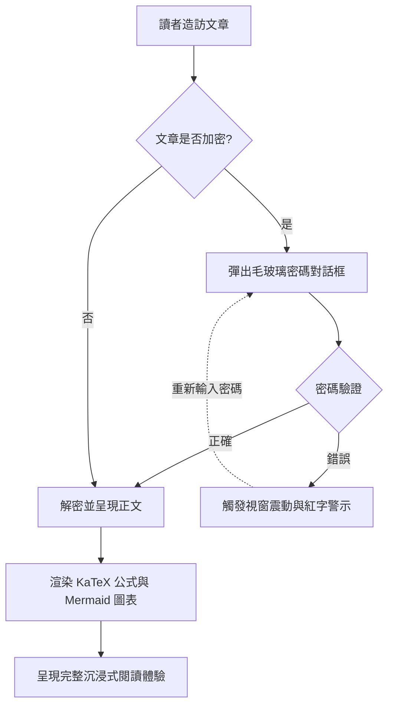
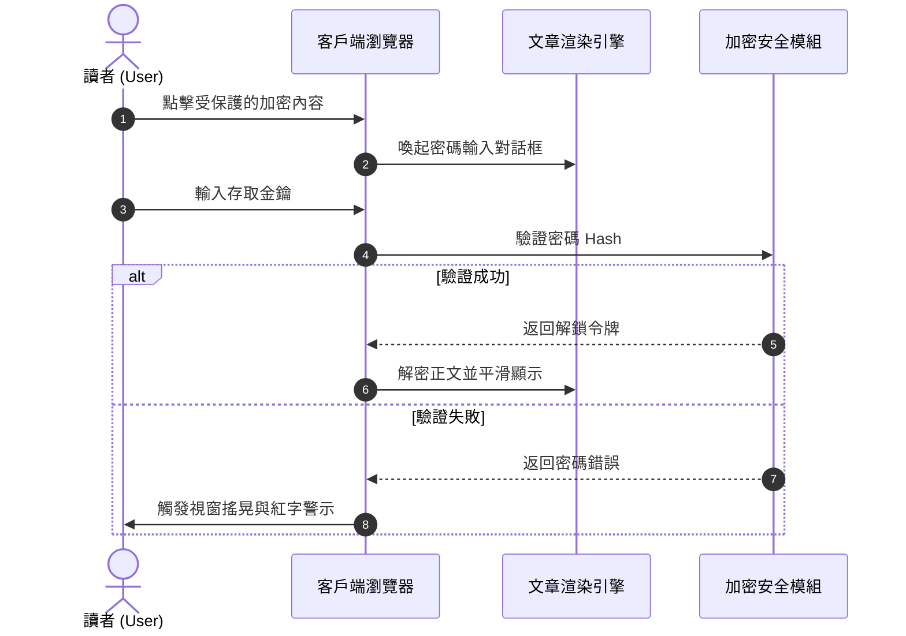

# 靜態網站產生器（SSG）與主題內容格式全景指南

在現代靜態網站產生器（SSG）與獨立部落格主題工程中，**文章內容格式的解析與呈現能力**直接決定了創作者的表達邊界與讀者的閱讀體驗。

本篇指南結合主流 SSG 生態（**Hugo、Jekyll、Eleventy、Astro、Pelican、Hexo、WordPress、VitePress** 等）的內容規範，建立起一套覆蓋 **基礎 Markup、擴展文件語言、WordPress Post Formats、互動式下拉選單切換器、手風琴摺疊、LaTeX 數學公式、Mermaid 圖表及加密解密特殊功能** 的全景體系，並提供即插即用的即時渲染示範。

---

## 一、主流靜態網站產生器（SSG）內容格式支援與生態彙總

不同的靜態網站產生器在內容解析架構上有不同的選型哲學。下表系統彙總了主流引擎對各種格式的原生與擴展支援情況：

| 靜態網站產生器 / 平台 | 核心解析引擎 | 原生內建支援格式 | 擴展 / 外部工具支援格式 | Front Matter 序列化支援 |
| :--- | :--- | :--- | :--- | :--- |
| **Hugo** | Goldmark (Go) | `.md` (CommonMark/GFM), `.html`, `.org` (Org-mode) | `.adoc` (Asciidoctor), `.rst` (rst2html), `.pdc` (Pandoc) | YAML (`---`), TOML (`+++`), JSON (`{}`) |
| **Astro (本部落格架構)** | Vite + Unified/Remark + MDX | `.md` (GFM), `.mdx` (JSX), `.html`, `.astro` 組件 | 可掛載 AST Loader 擴展 Org/AsciiDoc/RST | YAML, TOML, JSON |
| **Jekyll** | Kramdown (Ruby) | `.md` (Kramdown/GFM), `.html` | `.textile` (Textile 外掛程式) | YAML |
| **Eleventy (11ty)** | JavaScript 模板管道 | `.md`, `.html`, `.liquid`, `.njk`, `.ejs`, `.webc` | MDX (外掛程式), 自訂模板擴展 | YAML, JSON, JS/11tydata |
| **Hexo** | Marked / Hexo-Renderer | `.md` (GFM), `.html`, EJS/Pug 模板 | Org-mode / Pandoc (外掛程式支援) | YAML, JSON |
| **Pelican** | Python Docutils | `.md` (Markdown), `.rst` (reStructuredText) | `.asciidoc` (Asciidoctor) | YAML, Markdown Metadata |
| **WordPress (無頭/主題)** | Gutenberg Block Engine | HTML5 Blocks, Shortcodes, Post Formats | Classic Editor HTML | JSON 區塊中繼資料 / Post Meta |
| **VitePress / Docusaurus** | Markdown-It / MDX | `.md`, `.mdx`, Vue/React 組件 | 自訂容器語法 (`::: tip`) | YAML |

> [!NOTE]
> **生態架構洞察**：Hugo 憑藉 Go 語言的高併發原生支援了 Markdown 與 Org-mode；而以 **Astro** 為代表的現代前端 SSG，則憑藉 **MDX 與組件化群島（Islands）能力**，實現了將動態互動 UI（如本文演示的下拉選單切換器、密碼彈窗、黑膠唱片）無縫嵌入正文的終極靈活性。

---

## 二、Front Matter 序列化格式支援規範

部落格文章頭部的中繼資料（Front Matter）決定了文章的路由、標題、時間、分類、封面及受保護狀態。本主題支援所有主流序列化模式：

### 1. YAML 格式（最廣泛使用，推薦預設）

```yaml
---
title: "文章標題"
pubDate: 2026-08-28
author: "shijianus"
tags: ["Astro", "Markdown"]
featured: true
postFormat: "aside"
---
```

### 2. TOML 格式（Hugo 常用）

```toml
+++
title = "文章標題"
pubDate = 2026-08-28T00:00:00Z
author = "shijianus"
tags = ["Astro", "Markdown"]
featured = true
+++
```

### 3. JSON 格式（API 驅動與無頭場景）

```json
{
  "title": "文章標題",
  "pubDate": "2026-08-28T00:00:00.000Z",
  "author": "shijianus",
  "tags": ["Astro", "Markdown"],
  "featured": true
}
```

---

## 三、特殊輕量 Markup 與非 Markdown 格式對比及遷移對照

在不同技術棧中，作者可能使用除 Markdown 外的其他輕量標記語言。以下提供主流格式的語法特性及在本主題中的等價呈現：

### 1. AsciiDoc (.adoc / .asciidoc)

AsciiDoc 常見於技術書籍與長篇工程手冊，擁有極其豐富的提示區塊與屬性系統：

```asciidoc
// AsciiDoc 原始碼語法
= AsciiDoc 技術規範
:author: shijianus
:toc: macro

[NOTE]
====
這是一條 AsciiDoc 風格的注意卡片。
====

[cols="1,2,1", options="header"]
|===
| 模組 | 描述 | 狀態
| 核心引擎 | Astro 6 靜態管線 | 已就緒
|===
```

**本主題中的 Markdown / MDX 等效寫法**：

> [!NOTE]
> 這是一條在 Astro 主題中原生渲染的等效注意卡片，樣式與互動完全對齊。

| 模組 | 描述 | 狀態 |
| :--- | :--- | :---: |
| **核心引擎** | Astro 6 靜態管線 | <span class="badge badge-success">已就緒</span> |

### 2. Emacs Org-Mode (.org)

Org-mode 是 Emacs 使用者進行知識管理、任務追蹤與文件編寫的強大工具：

```ini
#+TITLE: Emacs Org-Mode 實踐筆記
#+DATE: 2026-08-28
#+TAGS: Emacs OrgMode

* TODO 第一階段：Markdown 掃描增強 [1/2]
- [X] 修復表格與行動裝置溢出
- [ ] 補全 Org-mode 語法轉換器

#+BEGIN_QUOTE
“Org-mode 不僅是格式，更是一種可執行的思維工作流。”
#+END_QUOTE
```

**本主題中的標準靜態 GFM 任務清單呈現（唯讀狀態）**：

- [x] 修復表格與行動裝置溢出
- [ ] 補全 Org-mode 語法轉換器

> [!QUOTE]
> “Org-mode 不僅是格式，更是一種可執行的思維工作流。”

#### 可互動式任務清單與連動進度條（Interactive Tutorial Checklist & Chained Progression）

在技術教學、實戰演練與部署指南中，傳統的唯讀 `[ ]` 任務清單無法直觀互動與記憶。本主題特別增設了**支援即時勾選與連鎖狀態連動的可互動清單（`.article-task-tracker`）**。讀者每勾選一項，動態進度條將即時重新計算百分比，當全部關鍵步驟確認完畢後，還將**自動連鎖解鎖下游就緒指令**，非常適合用作教學的通關檢查表：

<div class="article-task-tracker" data-storage-key="content-format-tutorial-demo">
  <div class="task-tracker__header">
    <div class="task-tracker__title">
      <svg width="20" height="20" viewBox="0 0 24 24" fill="none" stroke="currentColor" stroke-width="2"><path d="M9 11l3 3L22 4"/><path d="M21 12v7a2 2 0 0 1-2 2H5a2 2 0 0 1-2-2V5a2 2 0 0 1 2-2h11"/></svg>
      <span>靜態站點工程化上線部署前置檢查清單（可互動即時打勾）</span>
    </div>
    <span class="task-tracker__count">1/4 步驟已完成 (25%)</span>
  </div>
  <div class="task-tracker__bar-wrap">
    <div class="task-tracker__fill" style="width: 25%;"></div>
  </div>
  <ul class="task-checklist">
    <li class="task-checklist-item is-done">
      <input type="checkbox" checked id="chk-step-1" />
      <div class="task-item-body">
        <label for="chk-step-1" class="task-item-label">步驟 1：完成本地程式碼完整備份與 Git Commit</label>
        <div class="task-item-desc">確認目前工作樹乾淨，備份 Hash 記錄至開發稽核日誌。</div>
      </div>
    </li>
    <li class="task-checklist-item">
      <input type="checkbox" id="chk-step-2" />
      <div class="task-item-body">
        <label for="chk-step-2" class="task-item-label">步驟 2：配置 Cloudflare Pages 靜態建構管線</label>
        <div class="task-item-desc">設定 <code>BLOG_BUILD_TARGET=static</code> 與 Node.js 20+ 執行時環境。</div>
      </div>
    </li>
    <li class="task-checklist-item">
      <input type="checkbox" id="chk-step-3" />
      <div class="task-item-body">
        <label for="chk-step-3" class="task-item-label">步驟 3：驗證媒體資源與外部視訊/音訊內嵌</label>
        <div class="task-item-desc">確保所有音訊與視訊單一檔案大小嚴格控制在 25MB 以內，符合 CDN 部署規範。</div>
      </div>
    </li>
    <li class="task-checklist-item">
      <input type="checkbox" id="chk-step-4" />
      <div class="task-item-body">
        <label for="chk-step-4" class="task-item-label">步驟 4：執行 Playwright 自動化視覺回歸與冒煙測試</label>
        <div class="task-item-desc">驗證 PC 端與行動裝置多解析度下所有富媒體卡片與互動元件排版正常。</div>
      </div>
    </li>
  </ul>
  <div class="task-tracker__status-card is-pending">
    <div class="status-card__header">
      <span class="badge badge-warning">⏳ 待辦就緒中</span>
      <span style="font-weight:700;">目前進度：1/4 (25%)</span>
    </div>
    <p style="margin-top:0.4rem;margin-bottom:0;font-size:0.88rem;line-height:1.6;">請依序完成上方清單中打勾的每個步驟；當所有任務完成後，此處將即時連鎖解鎖生產發佈指令。</p>
  </div>
</div>

---

### 3. reStructuredText (.rst)

reStructuredText 是 Python 社群（如 Sphinx、ReadTheDocs）的標準文件格式：

```rst
.. reStructuredText 原始碼語法
.. note::
   這是一條 RST 指令定義的 Note 區塊。

.. code-block:: python
   :linenos:

   def greet(name: str) -> str:
       return f"Hello, {name}!"
```

**本主題中的 Markdown 等效呈現**：

> [!NOTE]
> 這是在 Astro 中以 GitHub Alert 規範呈現的 RST Note 等價卡片。

```python
def greet(name: str) -> str:
    return f"Hello, {name}!"
```

---

### 4. Textile 語法

Textile 是老牌輕量級標記語言（常見於 Redmine 與早期 Jekyll 部落格）：

```markdown
h2. 章節標題
bq. 這是 Textile 引用區塊內容。
*列表項 1*
_斜體強調文字_
```

---

## 四、WordPress 風格文章形態（Post Formats）全量實裝與視覺呈現

WordPress 主題生態中經典的 **Post Formats** 機制允許部落格針對不同類型內容展現專屬的視覺形態。我們在本主題正文欄中完整實現了這 9 種形態：

### 1. `aside`（輕語 / 便籤 / 隨筆卡片）

適合記錄短小的思考靈感、備忘提醒或臨時筆記：

<div class="article-aside">
  <p><strong>💡 隨筆備忘</strong>：靜態網站的真正價值不在於炫技，而是在於交付極速、零伺服器端維護負擔的純粹閱讀體驗。即便經過五年、十年，生成的 HTML 文件依然可以完美打開。</p>
</div>

---

### 2. `status`（狀態動態 / 碎碎念 / 微語錄）

類似 Twitter/微博風格的即時狀態發布卡片，包含作者頭像、客戶端標識與心情標籤：

<div class="article-status">
  <div class="article-status__header">
    <div class="article-status__user">
      
      <div>
        <div class="article-status__name">shijianus</div>
        <div class="article-status__meta">發布於 2026-08-28 14:32 · 🇨🇳 杭州</div>
      </div>
    </div>
    <div class="article-status__badge">
      <span>📱 來自 極客工坊 Mac Studio</span>
    </div>
  </div>
  <p class="article-status__content">
    今天終於完成了部落格主內容欄的全部格式擴展與視覺重構！從 KaTeX、Mermaid 到互動式下拉框與黑膠唱片，全棧靜態交付的感覺太棒了 🚀✨
  </p>
</div>

---

### 3. `quote`（精選引言 / 名言大卡片）

用於展現極具分量的人物語錄、設計箴言或金句：

<div class="article-quote">
  <div class="article-quote__icon">“</div>
  <div class="article-quote__body">
    Simplicity is prerequisite for reliability. (簡單是可靠的前提條件。)
  </div>
  <div class="article-quote__author">
    
    <div class="article-quote__author-info">
      <div class="article-quote__author-name">Edsger W. Dijkstra</div>
      <div class="article-quote__author-title">電腦科學家 · 圖靈獎得主 (1972)</div>
    </div>
  </div>
</div>

---

### 4. `gallery`（圖片畫廊 / 自適應相簿與拍立得網格）

支援多欄自適應響應式網格與具人文質感的拍立得相紙卡片，點擊任意圖片均可觸發全螢幕燈箱放大：

#### 2 欄與 3 欄自適應畫廊

<div class="article-gallery">
  <div class="gallery-grid gallery-grid-3">
    <div class="gallery-item">
      
      <div class="gallery-item__caption">極客工作臺全景</div>
    </div>
    <div class="gallery-item">
      
      <div class="gallery-item__caption">系統架構設計大螢幕</div>
    </div>
    <div class="gallery-item">
      
      <div class="gallery-item__caption">星河漫遊視覺封面</div>
    </div>
  </div>
</div>

#### 拍立得相紙畫廊（Polaroid Style）

<div class="gallery-polaroid">
  <div class="polaroid-card">
    
    <div class="polaroid-card__caption">2026.04 杭州·研發基地</div>
  </div>
  <div class="polaroid-card">
    
    <div class="polaroid-card__caption">2026.08 架構演進重構夜</div>
  </div>
</div>

---

### 5. `video`（自適應影片播放卡片）

支援 16:9 響應式比例、圓角邊框與底欄說明，單行獨佔一個完整橫位展示。相容 Bilibili、YouTube 外部代理式嵌入及站內原生 MP4（單檔案均控制在 25MB 以內，滿足 Cloudflare Pages 靜態部署規範）：

#### 外部影片內嵌（Bilibili & YouTube 連結代理式嵌入 · 預設需讀者翻到此處並點擊開始播放）

<div class="video-embed-card" data-video-type="bilibili">
  <iframe src="https://player.bilibili.com/player.html?bvid=BV11k4y1T7kS&page=1&high_quality=1&danmaku=0&autoplay=0" allowfullscreen="true" loading="lazy" allow="accelerometer; autoplay; clipboard-write; encrypted-media; gyroscope; picture-in-picture; web-share" sandbox="allow-top-navigation-by-user-activation allow-same-origin allow-forms allow-scripts allow-popups"></iframe>
  <div class="embed-caption">🎬 Bilibili 外部內嵌演示：BV11k4y1T7kS (1080P 高畫質 · 需翻至此處並點擊播放)</div>
</div>

<div class="video-embed-card" data-video-type="youtube">
  <iframe src="https://www.youtube-nocookie.com/embed/LXb3EKWsInQ?autoplay=0&rel=0" allowfullscreen="true" loading="lazy" allow="accelerometer; autoplay; clipboard-write; encrypted-media; gyroscope; picture-in-picture; web-share"></iframe>
  <div class="embed-caption">🎬 YouTube 外部內嵌演示：Costa Rica 4K 60fps HDR 演示 (1080P/4K · 真實有效 URL · 需翻至此處並點擊播放)</div>
</div>

#### 站內原生 MP4 影片內嵌（Native HTML5 Video Player · 支援倍速與畫中畫 · 預設禁用下載）

<div class="video-embed-card">
  <video controls controlsList="nodownload" preload="metadata" playsinline oncontextmenu="return false;">
    <source src="/media/video/landscape_compressed.mp4" type="video/mp4" />
    您的瀏覽器不支援 HTML5 影片播放。
  </video>
  <div class="embed-caption">🎥 本地原生內嵌影片 1：4K/1080P 超高畫質風光演示 (檔案大小 21.7MB · 支援倍速與畫中畫 · 已禁用直接下載)</div>
</div>

<div class="video-embed-card">
  <video controls controlsList="nodownload" preload="metadata" playsinline oncontextmenu="return false;">
    <source src="/media/video/blue_archive_miracle.mp4" type="video/mp4" />
    您的瀏覽器不支援 HTML5 影片播放。
  </video>
  <div class="embed-caption">🎥 本地原生內嵌影片 2：【蔚藍檔案】「奇蹟的終始—我們的故事由我們來決定！」 (檔案大小 23.3MB · 支援倍速與畫中畫 · 已禁用直接下載)</div>
</div>

---

### 6. `audio`（黑膠唱片旋轉音樂卡片）

內建 HTML5 音訊控制器，並在播放時自動觸發**黑膠唱片無級平滑旋轉動態效果**。所有唱片封面均採用真實匹配的官方高畫質專輯封面，支援多種主流音訊格式（無損 FLAC、高位元率 MP3、AAC/M4A），且已內建反爬蟲與防下載保護：

#### ① Shaun - Way Back Home（FLAC 無損音訊格式 · 24.55MB）

<div class="article-audio-card">
  <div class="audio-card__cover">
    
  </div>
  <div class="audio-card__info">
    <div class="audio-card__title">
      <span>Way Back Home</span>
      <span class="badge badge-purple">FLAC Lossless</span>
    </div>
    <div class="audio-card__author">Shaun (숀) · 無損音訊 (FLAC / 44.1kHz 16-bit 961 kbps)</div>
    <audio controls preload="metadata" controlsList="nodownload" oncontextmenu="return false;" src="/media/audio/WayBackHome.flac"></audio>
  </div>
</div>

#### ② ヨルシカ (Yorushika) - 彼女は旅に出る（MP3 320Kbps 高畫質格式 · 8.41MB）

<div class="article-audio-card">
  <div class="audio-card__cover">
    
  </div>
  <div class="audio-card__info">
    <div class="audio-card__title">
      <span>彼女は旅に出る (She Leaves on a Journey)</span>
      <span class="badge badge-success">320 Kbps MP3</span>
    </div>
    <div class="audio-card__author">ヨルシカ (Yorushika) · 高畫質立體聲 (MP3 / 48kHz 320 kbps)</div>
    <audio controls preload="metadata" controlsList="nodownload" oncontextmenu="return false;" src="/media/audio/彼女は旅に出る.mp3"></audio>
  </div>
</div>

#### ③ すこっぷ feat. 初音ミク - アイロニ（M4A / AAC 格式 · 7.63MB）

<div class="article-audio-card">
  <div class="audio-card__cover">
    
  </div>
  <div class="audio-card__info">
    <div class="audio-card__title">
      <span>アイロニ (Irony / 諷刺)</span>
      <span class="badge badge-cyan">M4A / AAC</span>
    </div>
    <div class="audio-card__author">すこっぷ feat. 初音ミク · AAC 音訊 (M4A / 44.1kHz 260 kbps)</div>
    <audio controls preload="metadata" controlsList="nodownload" oncontextmenu="return false;" src="/media/audio/アイロニ.m4a"></audio>
  </div>
</div>

---

### 7. `link`（外部連結與書籤預覽卡片 / Bookmark Preview）

為文章內的關鍵參考出處提供優雅的卡片化預覽：

<a class="article-bookmark" href="https://github.com/shijianus/shijianus-blog" target="_blank" rel="noopener">
  <div class="article-bookmark__content">
    <div class="article-bookmark__title">EpoCanvas / shijianus-blog (時間部落格主題核心設計規範儲存庫)</div>
    <p class="article-bookmark__desc">EpoCanvas（時代畫布）是一套專注於高密度資訊呈現、優雅微互動與全格式支援的現代化極客部落格內容架構系統。</p>
    <div class="article-bookmark__site">
      <span class="badge badge-primary">GitHub</span>
      <span>github.com · EpoCanvas Core Spec</span>
    </div>
  </div>
  <div class="article-bookmark__icon">
    <svg viewBox="0 0 24 24" width="24" height="24" fill="none" stroke="currentColor" stroke-width="2" stroke-linecap="round" stroke-linejoin="round"><path d="M18 13v6a2 2 0 0 1-2 2H5a2 2 0 0 1-2-2V8a2 2 0 0 1 2-2h6"/><polyline points="15 3 21 3 21 9"/><line x1="10" y1="14" x2="21" y2="3"/></svg>
  </div>
</a>

### 8. `chat`（聊天氣泡對話串流 / Organic Animated Dialogue Stream）

用於生動演示技術答辯、雙人對話討論或使用者訪談情境，支援左右氣泡、行內程式碼、自訂配色以及**動態內容自適應打字動畫效果、Web Audio 合成音效與動態頭像（`footer_mini_logo__media`）**：
* **靜態模式（預設）**：`<div class="article-chat">` 保持輕量純靜態呈現，零 JS 開銷；
* **啟用動態演示（參數控制）**：配置 `data-animate="true"`（或 `class="article-chat is-animated"`），系統將在**讀者第一次捲動滑入該視口時自動觸發基於字元長度與自然隨機律決定的擬真時序打字動畫與左右專屬提示音**；
* **非機械動態時序（Content-Length Aware Timing）**：系統根據發言長短智慧決定打字中指示器時長（短句 380ms 閃爍發出，長技術段落 1000ms+ 打字思考），並在氣泡間加入符合人類閱讀判斷的自然停頓與微頻音效抖動；
* **動態視訊頭像支援（`footer_mini_logo__media`）**：頭像支援嵌入 MP4 微視訊動畫效果與靜態備用海報；
* **單次觸發與重載保障**：首次滑入觸發後自動鎖定，後續反覆捲動不會重複觸發打擾閱讀；只有當使用者重新整理網頁（F5）重新載入時才會重新就緒；同時提供右上角「↺ 重播」與「🔊/🔇 音效切換」微控欄。

<div class="article-chat" data-animate="true" data-sound="true">
  <div class="chat-message chat-left">
    <span class="chat-avatar footer_mini_logo__media">
      <video autoplay muted loop playsinline preload="metadata" poster="/media/shijianus/avatar.jpg" aria-hidden="true">
        <source src="/media/shijianus/avatar-dynamic.mp4" type="video/mp4" />
      </video>
      
    </span>
    <div class="chat-body">
      <div class="chat-author">開發者 <a href="https://github.com/LeonBoven" target="_blank" rel="noopener noreferrer">Léon Boven</a> · 10:15</div>
      <div class="chat-bubble">
        你好！請問在 Astro 中實現 <code>KaTeX</code> 和 <code>Mermaid</code> 的靜態渲染會不會拖慢前端頁面載入速度？
      </div>
    </div>
  </div>

  <div class="chat-message chat-right">
    
    <div class="chat-body">
      <div class="chat-author">架構師 <a href="https://github.com/shijianus" target="_blank" rel="noopener noreferrer">shijianus</a> · 10:16</div>
      <div class="chat-bubble">
        完全不會！因為 <code>remark-math</code> 和 <code>rehype-katex</code> 在建置期（Build-time）就已經把公式編譯成了純 HTML/MathML 字串，瀏覽器端 <strong>0 JS 執行時負擔</strong>；而 Mermaid 圖表也是動態按需非同步載入 ESM 模組，首頁載入極其輕快！⚡
      </div>
    </div>
  </div>

  <div class="chat-message chat-left">
    <span class="chat-avatar footer_mini_logo__media">
      <video autoplay muted loop playsinline preload="metadata" poster="/media/shijianus/avatar.jpg" aria-hidden="true">
        <source src="/media/shijianus/avatar-dynamic.mp4" type="video/mp4" />
      </video>
      
    </span>
    <div class="chat-body">
      <div class="chat-author">開發者 <a href="https://github.com/LeonBoven" target="_blank" rel="noopener noreferrer">Léon Boven</a> · 10:17</div>
      <div class="chat-bubble">
        太棒了！那我們在 Markdown 裡直接寫架構時序圖和互動式單位換算器也是開箱即用的對吧？
      </div>
    </div>
  </div>

  <div class="chat-message chat-right">
    
    <div class="chat-body">
      <div class="chat-author">架構師 <a href="https://github.com/shijianus" target="_blank" rel="noopener noreferrer">shijianus</a> · 10:18</div>
      <div class="chat-bubble">
        對的！不僅雙擊放大與高清 SVG 匯出已全量具備，單位換算器更是接入了<strong>即時聯網外匯牌價同步</strong>與<strong>基準單位下拉切換</strong>，而且保證固定質量單位完整對稱表達，所有度量均經過嚴謹測試！🚀
      </div>
    </div>
  </div>

  <div class="chat-message chat-left">
    <span class="chat-avatar footer_mini_logo__media">
      <video autoplay muted loop playsinline preload="metadata" poster="/media/shijianus/avatar.jpg" aria-hidden="true">
        <source src="/media/shijianus/avatar-dynamic.mp4" type="video/mp4" />
      </video>
      
    </span>
    <div class="chat-body">
      <div class="chat-author">開發者 <a href="https://github.com/LeonBoven" target="_blank" rel="noopener noreferrer">Léon Boven</a> · 10:19</div>
      <div class="chat-bubble">
        收到！這個互動手感與根據訊息長短變化的打字動畫非常自然，我這就把團隊的技術文件庫升級上來！🎉
      </div>
    </div>
  </div>

  <div class="chat-message chat-right">
    
    <div class="chat-body">
      <div class="chat-author">架構師 <a href="https://github.com/shijianus" target="_blank" rel="noopener noreferrer">shijianus</a> · 10:20</div>
      <div class="chat-bubble">
        歡迎體驗！後續如果遇到任何格式擴展或客製化需求，隨時在討論區或 GitHub 交流探討~ ✨
      </div>
    </div>
  </div>
</div>

---

## 五、特殊的下拉式選單格式與動態互動元件（Dropdown Selectors & Interactive Formats）

針對使用者明確要求的**特殊下拉式選單格式**，我們在文章正文層提供了純客戶端即時回應的下拉式選擇器元件：

### 1. 多框架與多程式碼版本下拉式切換器（Interactive Dropdown Switcher）

讀者可以在下拉式選單中自由選擇技術框架，正文面板將即時無重新整理地切換對應的內容與程式碼：

<div class="article-dropdown-switcher">
  <div class="article-dropdown-switcher__header">
    <div class="article-dropdown-switcher__title">
      <svg width="20" height="20" viewBox="0 0 24 24" fill="none" stroke="currentColor" stroke-width="2"><rect x="3" y="3" width="18" height="18" rx="2"/><path d="M9 3v18"/><path d="m14 9 3 3-3 3"/></svg>
      <span>請選擇要查看的前端框架實作程式碼：</span>
    </div>
    <select class="article-select dropdown-switcher__select">
      <option value="react-tab">⚛️ React 19 (Hooks & TSX)</option>
      <option value="vue-tab">🟢 Vue 3.5 (Composition API)</option>
      <option value="astro-tab">🚀 Astro 6 (Island Component)</option>
      <option value="svelte-tab">🟠 Svelte 5 (Runes)</option>
    </select>
  </div>
  <div class="article-dropdown-switcher__body">
    <div class="article-dropdown-panel is-active" data-panel="react-tab">
      <div class="article-dropdown-panel__title">⚛️ React 19 元件實作方式：</div>
      <pre class="no-code-enhance"><code class="language-tsx">import { useState } from 'react';
export function Counter() {
  const [count, setCount] = useState(0);
  return (
    &lt;button onClick={() =&gt; setCount((c) =&gt; c + 1)} className="btn-primary"&gt;
      React 点击计数：&#123;count&#125;
    &lt;/button&gt;
  );
}</code></pre>
    </div>
    <div class="article-dropdown-panel" data-panel="vue-tab">
      <div class="article-dropdown-panel__title">🟢 Vue 3.5 單一檔案元件實作方式：</div>
      <pre class="no-code-enhance"><code class="language-html">&lt;script setup lang="ts"&gt;
import { ref } from 'vue';
const count = ref(0);
&lt;/script&gt;
&lt;template&gt;
  &lt;button @click="count++" class="btn-primary"&gt;
    Vue 点击计数：&#123;&#123; count &#125;&#125;
  &lt;/button&gt;
&lt;/template&gt;</code></pre>
    </div>
    <div class="article-dropdown-panel" data-panel="astro-tab">
      <div class="article-dropdown-panel__title">🚀 Astro 6 零 JS 靜態元件實作方式：</div>
      <pre class="no-code-enhance"><code class="language-astro">---
const { title = "Astro 极速群岛" } = Astro.props;
---
&lt;div class="astro-island"&gt;
  &lt;h3&gt;&#123;title&#125;&lt;/h3&gt;
  &lt;p&gt;默认交付 0KB JavaScript，按需注水交互！&lt;/p&gt;
&lt;/div&gt;</code></pre>
    </div>
    <div class="article-dropdown-panel" data-panel="svelte-tab">
      <div class="article-dropdown-panel__title">🟠 Svelte 5 Runes 實作方式：</div>
      <pre class="no-code-enhance"><code class="language-svelte">&lt;script lang="ts"&gt;
  let count = $state(0);
&lt;/script&gt;
&lt;button onclick={() =&gt; count++} class="btn-primary"&gt;
  Svelte 点击计数：&#123;count&#125;
&lt;/button&gt;</code></pre>
    </div>
  </div>
</div>

---

### 2. 互動式多類別通用單位換算器（Universal Interactive Unit Converter · 基準下拉切換與即時匯率）

支援使用者在輸入框中自由輸入**任意基數數值**（預設值為 `1`，支援增減步進器與一鍵重設），並在不同類別（質量重量、國際匯率、資料儲存、網路頻寬、長度尺寸）之間即時無縫換算：
* **動態可切換換算基準（Base Unit Dropdown）**：輸入框右側的基準單位支援下拉自由選擇（例如在質量中可選擇 `kg`、`g`、`lb`、`斤`、`oz`、`t` 等；在匯率中可選擇 `USD`、`HKD`、`CNY`、`EUR`、`JPY`、`GBP` 等）。選擇任一基準單位後，目標換算網格將**智慧自動排除當前基準單位（徹底杜絕 1kg=1kg 冗餘卡片）**，並以當前基準為分母即時重算所有目標單位；
* **真實匯率波動聯網接入（Live Forex API）**：切換至「💱 國際匯率」時，系統將自動非同步請求伺服器端 `/api/exchange-rate` 並回退公共即時匯率介面，獲取各大主流貨幣的最新即時牌價（右上角顯示 `🟢 即時聯網匯率已同步`）；在未聯網或斷網離線時自動無縫回退至內建基準比例（顯示 `⚪ 離線基準匯率`），確保「即時」真正即時且離線體驗堅如磐石；
* **通用 API 便捷呼叫**：系統同時在全域暴露了 `window.shijianusAPI.fetchExchangeRates(base)` 輔助函數，方便文件內的任何自訂腳本即時呼叫即時牌價資料；
* **快捷一鍵複製與等式推算**：每個換算卡片均提供一鍵複製按鈕與高亮回饋，底部同步展示動態等式鏈推算摘要。

<div class="interactive-unit-converter" data-default="1" data-title="🔄 互動式通用單位換算器（支援基準單位切換與即時匯率）"></div>

---

### 3. 規格參數與視訊編碼下拉推算器（Interactive Spec Calc Dropdown）

選擇不同選項時，右側即時顯示對應的技術指標與換算說明：

<div class="interactive-calc-select">
  <div class="article-select-box">
    <label>
      <svg width="18" height="18" viewBox="0 0 24 24" fill="none" stroke="currentColor" stroke-width="2"><circle cx="12" cy="12" r="10"/><path d="M12 6v6l4 2"/></svg>
      <span>選擇視訊編碼解析度：</span>
    </label>
    <select class="article-select">
      <option value="1080p" data-desc="1920 × 1080 @ 60fps · 位元率 6,000 Kbps · 建議頻寬 15 Mbps">1080P 全高清 (1080p60)</option>
      <option value="2k" data-desc="2560 × 1440 @ 60fps · 位元率 12,000 Kbps · 建議頻寬 30 Mbps">2K 極清 (1440p60)</option>
      <option value="4k" data-desc="3840 × 2160 @ 60fps · 位元率 25,000 Kbps · 建議頻寬 60 Mbps">4K 超高清 (2160p60 HDR)</option>
      <option value="8k" data-desc="7680 × 4320 @ 60fps · 位元率 80,000 Kbps · 建議頻寬 200 Mbps">8K 劇院級 (4320p60 AV1)</option>
    </select>
  </div>
  <div class="calc-output-box">
    <span>📊 <strong>技術規格推算結果</strong>：</span>
    <span class="calc-output-value">1920 × 1080 @ 60fps · 位元率 6,000 Kbps · 建議頻寬 15 Mbps</span>
  </div>
</div>

---

## 六、手風琴摺疊、分頁與多欄排版（Collapsibles, Tabs & Columns）

### 1. 互斥手風琴摺疊組（Exclusive Accordion Group · 展開單項自動閉合其餘項）

配置 `data-single="true"`。展開其中一項時，同組內的其它展開項將自動聯動收起，保持頁面整潔聚焦：

<div class="article-accordion-group" data-single="true">
  <details class="article-accordion" open>
    <summary>
      <span>🔒 1. 靜態站點的安全性優勢</span>
      <svg class="accordion-chevron" viewBox="0 0 24 24" fill="none" stroke="currentColor" stroke-width="2"><polyline points="9 18 15 12 9 6"/></svg>
    </summary>
    <div class="accordion-content">
      <p>靜態站點沒有傳統的 PHP/Node.js 動態執行引擎和暴露在公網的 SQL 資料庫，從物理層面免疫了 SQL 注入與伺服器端遠端程式碼執行（RCE）風險。</p>
    </div>
  </details>

  <details class="article-accordion">
    <summary>
      <span>⚡ 2. 全球 CDN 邊緣加速交付</span>
      <svg class="accordion-chevron" viewBox="0 0 24 24" fill="none" stroke="currentColor" stroke-width="2"><polyline points="9 18 15 12 9 6"/></svg>
    </summary>
    <div class="accordion-content">
      <p>透過將編譯產物部署至 Cloudflare Pages 或 GitHub Pages，所有靜態資源可在全球 300+ 邊緣節點快取，首位元組回應時間（TTFB）通常低於 20ms。</p>
    </div>
  </details>

  <details class="article-accordion">
    <summary>
      <span>💰 3. 極低的雲服務託管成本</span>
      <svg class="accordion-chevron" viewBox="0 0 24 24" fill="none" stroke="currentColor" stroke-width="2"><polyline points="9 18 15 12 9 6"/></svg>
    </summary>
    <div class="accordion-content">
      <p>靜態站點無需全天候運行昂貴的 VPS 雲伺服器，配合免費層級的 Cloudflare D1 資料庫與 Serverless 評論系統，日常營運成本近乎為零。</p>
    </div>
  </details>
</div>

---

### 2. 非互斥獨立手風琴摺疊組（Multi-Expand / Non-Exclusive Accordion Group · 允許多項同時展開）

配置 `data-single="false"`（或預設多開模式）。讀者可以自由展開多個或全部摺疊項進行橫向比對與深度閱讀，不會因為展開新項目而關閉已開啟的內容：

<div class="article-accordion-group" data-single="false">
  <details class="article-accordion" open>
    <summary>
      <span>🛠️ 架構模組 A：Markdown AST 語法編譯器流水線</span>
      <svg class="accordion-chevron" viewBox="0 0 24 24" fill="none" stroke="currentColor" stroke-width="2"><polyline points="9 18 15 12 9 6"/></svg>
    </summary>
    <div class="accordion-content">
      <p>基於 Unified、Remark-math 與 Rehype-katex 架構，在編譯建構階段將 Markdown 語法樹完全靜態轉化為標準語義 HTML 節點，並在 Node.js 端完成高亮和公式生成。</p>
    </div>
  </details>

  <details class="article-accordion" open>
    <summary>
      <span>🎨 架構模組 B：EpoCanvas 動態視覺引擎與響應式系統</span>
      <svg class="accordion-chevron" viewBox="0 0 24 24" fill="none" stroke="currentColor" stroke-width="2"><polyline points="9 18 15 12 9 6"/></svg>
    </summary>
    <div class="accordion-content">
      <p>提供極光背景（Aurora）、星空視差（Starfield）、毛玻璃擬態（Glassmorphism）與多端響應式斷點適配，無論在 4K 寬螢幕還是摺疊螢幕手機上均呈現一致的美學體驗。</p>
    </div>
  </details>

  <details class="article-accordion">
    <summary>
      <span>🛡️ 架構模組 C：WebCrypto SHA-256 分級安全隔離體系</span>
      <svg class="accordion-chevron" viewBox="0 0 24 24" fill="none" stroke="currentColor" stroke-width="2"><polyline points="9 18 15 12 9 6"/></svg>
    </summary>
    <div class="accordion-content">
      <p>內置 1 級會話持久解鎖、2 級防窺動態多態遮罩（高斯模糊/馬賽克/劇透遮罩）、3 級視口哨兵離開即鎖以及外聯 URL 分片加密方案，徹底杜絕密碼明文在 DOM 中的暴露。</p>
    </div>
  </details>
</div>

---

### 3. 多標籤選項卡（Interactive Tabs）

<div class="article-tabs">
  <div class="article-tabs__nav">
    <button class="article-tabs__button is-active" type="button">pnpm</button>
    <button class="article-tabs__button" type="button">npm</button>
    <button class="article-tabs__button" type="button">yarn</button>
    <button class="article-tabs__button" type="button">bun</button>
  </div>
  <div class="article-tabs__panels">
    <div class="article-tabs__panel is-active">
      <pre class="no-code-enhance"><code class="language-bash">pnpm add @astrojs/mdx remark-math rehype-katex katex mermaid</code></pre>
    </div>
    <div class="article-tabs__panel">
      <pre class="no-code-enhance"><code class="language-bash">npm install @astrojs/mdx remark-math rehype-katex katex mermaid</code></pre>
    </div>
    <div class="article-tabs__panel">
      <pre class="no-code-enhance"><code class="language-bash">yarn add @astrojs/mdx remark-math rehype-katex katex mermaid</code></pre>
    </div>
    <div class="article-tabs__panel">
      <pre class="no-code-enhance"><code class="language-bash">bun add @astrojs/mdx remark-math rehype-katex katex mermaid</code></pre>
    </div>
  </div>
</div>

---

### 4. 多欄格線佈局系統（Multi-Column Grid）

#### 3 欄等寬卡片格線

<div class="article-grid article-grid-3">
  <div class="article-col-card">
    <h4>🎨 視覺體系</h4>
    <p>深度吸收 EpoCanvas 現代極客設計美學，支援明暗高對比、毛玻璃背景與平滑色彩過渡。</p>
  </div>
  <div class="article-col-card">
    <h4>⚡ 效能工程</h4>
    <p>Astro 6 靜態群島架構，建置期 HTML 預渲染，純靜態極致 SEO 優化。</p>
  </div>
  <div class="article-col-card">
    <h4>🛠️ 擴展生態</h4>
    <p>全面支援 KaTeX 公式、Mermaid 圖表、加密彈窗與 9 種文章格式 (Post Formats)。</p>
  </div>
</div>

#### 1:2 不均等側邊欄格線

<div class="article-grid article-columns-1-2">
  <div class="article-col-card">
    <h4>📌 架構定位</h4>
    <p>專注於極客與工程師的現代化技術寫作載體。</p>
  </div>
  <div class="article-col-card">
    <h4>🚀 交付保障</h4>
    <p>內建完善的自動化煙霧測試與靜態建置驗證機制，無論公式、圖表還是複雜卡片，都能確保在所有裝置上嚴絲合縫呈現。</p>
  </div>
</div>

---

## 七、13 種語義告示框（Admonitions / GitHub Alerts）

基於 GitHub Alert 與 EpoCanvas 設計規範，支援 13 種不同語義的彩色卡片，並支援使用 `[!TYPE]-` 語法實現預設摺疊：

> [!NOTE]
> **常規備註（Note）**：這是一條標準的背景資訊或上下文說明。

> [!TIP]
> **實用技巧（Tip）**：使用快捷鍵 <kbd>Ctrl</kbd> + <kbd>K</kbd> 可以快速喚起全域文章搜尋面板！

> [!IMPORTANT]
> **重要事項（Important）**：在部署生產環境前，請確認 `BLOG_BUILD_TARGET=static` 環境變數已正確注入。

> [!WARNING]
> **風險警告（Warning）**：請勿在公開 Git 儲存庫中提交生產資料庫金鑰或雲端服務私鑰。

> [!CAUTION]
> **危險警示（Caution）**：執行資料表重建操作具有破壞性，請先備份 D1 資料庫！

> [!DANGER]
> **致命危險（Danger）**：直接刪除生產資料庫將導致所有評論與使用者資產永久損毀。

> [!SUCCESS]
> **操作成功（Success）**：靜態建置流程已成功完成，所有 47 個靜態路由已就緒！

> [!QUESTION]
> **疑難探討（Question）**：如何在無伺服器端依賴的環境下實現毫秒級的純客戶端全文檢索？

> [!QUOTE]
> **精選引用（Quote）**：「優秀的程式碼不僅能被機器執行，更能像詩歌一樣優雅地向人類傳達思想。」

> [!INFO]
> **詳細資訊（Info）**：本部落格基於 Astro 6 與 Tailwind 4 建置，全站純靜態匯出。

> [!TODO]
> **待辦計畫（Todo）**：計畫在下一個迭代中引入 WebAssembly 客戶端全文檢索索引。

> [!BUG]
> **缺陷記錄（Bug）**：已修復舊版在極端窄螢幕裝置下表格橫向截斷的排版問題。

> [!EXAMPLE]
> **範例說明（Example）**：以上所有告示框均自動適配深色與淺色模式的高對比度色彩。

### 摺疊式告示框演示

> [!TIP]- 點擊展開查看：生產環境 Nginx 極速快取配置參考
> ```nginx
> location ~* \.(?:css|js|woff2?|svg|png|jpg|webp)$ {
>     expires 1y;
>     add_header Cache-Control "public, immutable";
>     access_log off;
> }
> ```

## 八、學術數學公式（KaTeX）、架構圖表（Mermaid 11）與動態心智圖（Markmap）

在展示型與範例型技術文件中，以 **「實際渲染效果 + 對應原始碼對照」**（雙標籤分頁 Tabs）為核心呈現理念，不僅能讓讀者直觀體驗最終視覺與互動特性，更能方便開發者一鍵參考、複製並遷移至實際專案中。

---

### 1. LaTeX 數學公式（KaTeX Math · 行內與區塊多行推導）

#### 行內公式（Inline Formula）

<div class="article-tabs">
<div class="article-tabs__nav">
<button class="article-tabs__button is-active" type="button">🌟 渲染效果呈現</button>
<button class="article-tabs__button" type="button">💻 LaTeX 原始碼</button>
</div>
<div class="article-tabs__panels">
<div class="article-tabs__panel is-active">

質能方程 $E = mc^2$，歐拉恆等式 $e^{i\pi} + 1 = 0$，高斯積分 $\int_{-\infty}^{\infty} e^{-x^2} dx = \sqrt{\pi}$。

</div>
<div class="article-tabs__panel">

```latex
质能方程 $E = mc^2$，欧拉恒等式 $e^{i\pi} + 1 = 0$，高斯积分 $\int_{-\infty}^{\infty} e^{-x^2} dx = \sqrt{\pi}$。
```

</div>
</div>
</div>

#### 區塊多行推導公式 1：二階動態系統拉普拉斯變換（Block Math · Single Equation）

<div class="article-tabs">
<div class="article-tabs__nav">
<button class="article-tabs__button is-active" type="button">🌟 渲染效果呈現</button>
<button class="article-tabs__button" type="button">💻 LaTeX 原始碼</button>
</div>
<div class="article-tabs__panels">
<div class="article-tabs__panel is-active">

$$
\mathcal{L}\{\ddot{x}(t) + 2\zeta\omega_n\dot{x}(t) + \omega_n^2 x(t)\} = X(s)(s^2 + 2\zeta\omega_n s + \omega_n^2)
$$

</div>
<div class="article-tabs__panel">

```latex
$$
\mathcal{L}\{\ddot{x}(t) + 2\zeta\omega_n\dot{x}(t) + \omega_n^2 x(t)\} = X(s)(s^2 + 2\zeta\omega_n s + \omega_n^2)
$$
```

</div>
</div>
</div>

#### 區塊多行推導公式 2：馬克士威經典電磁方程組（Block Math · Multi-line Aligned）

<div class="article-tabs">
<div class="article-tabs__nav">
<button class="article-tabs__button is-active" type="button">🌟 渲染效果呈現</button>
<button class="article-tabs__button" type="button">💻 LaTeX 原始碼</button>
</div>
<div class="article-tabs__panels">
<div class="article-tabs__panel is-active">

$$
\begin{aligned}
\nabla \cdot \mathbf{E} &= \frac{\rho}{\varepsilon_0} \\
\nabla \cdot \mathbf{B} &= 0 \\
\nabla \times \mathbf{E} &= -\frac{\partial \mathbf{B}}{\partial t} \\
\nabla \times \mathbf{B} &= \mu_0 \mathbf{J} + \mu_0 \varepsilon_0 \frac{\partial \mathbf{E}}{\partial t}
\end{aligned}
$$

</div>
<div class="article-tabs__panel">

```latex
$$
\begin{aligned}
\nabla \cdot \mathbf{E} &= \frac{\rho}{\varepsilon_0} \\
\nabla \cdot \mathbf{B} &= 0 \\
\nabla \times \mathbf{E} &= -\frac{\partial \mathbf{B}}{\partial t} \\
\nabla \times \mathbf{B} &= \mu_0 \mathbf{J} + \mu_0 \varepsilon_0 \frac{\partial \mathbf{E}}{\partial t}
\end{aligned}
$$
```

</div>
</div>
</div>

---

### 2. Mermaid 11 架構圖表（Flowchart & Sequence · 流程圖與時序圖）

#### ① 部落格加密驗證與內容渲染流程圖（Flowchart TD）

<div class="article-tabs">
<div class="article-tabs__nav">
<button class="article-tabs__button is-active" type="button">🌟 渲染效果呈現</button>
<button class="article-tabs__button" type="button">💻 Mermaid 原始碼</button>
</div>
<div class="article-tabs__panels">
<div class="article-tabs__panel is-active">



</div>
<div class="article-tabs__panel">

````markdown

````

</div>
</div>
</div>

#### ② 客戶端安全鑑權與解密時序圖（Sequence Diagram）

<div class="article-tabs">
<div class="article-tabs__nav">
<button class="article-tabs__button is-active" type="button">🌟 渲染效果呈現</button>
<button class="article-tabs__button" type="button">💻 Mermaid 原始碼</button>
</div>
<div class="article-tabs__panels">
<div class="article-tabs__panel is-active">



</div>
<div class="article-tabs__panel">

````markdown

````

</div>
</div>
</div>

### 3. 動態互動式心智圖（Markmap / Mindmap · 多向分支擴散）

在長篇技術規範與系統架構梳理中，傳統的靜態列表難以直觀呈現複雜的知識脈絡。本主題全新實裝 **Markmap 動態互動式心智圖引擎**，在文章主欄（`.post.post-page-shell`）中實現徹底的原生解析與互動增強：

> [!TIP]
> **多向分支擴散核心規則**：
> 1. **預設單塊保護空間**：預設狀態下，心智圖僅展示 **1 塊核心根節點**（Level 1），右側附帶折疊小圓點指示器；
> 2. **點擊展開多向分支**：點擊根節點或任意子節點的小圓點，子分支將**平滑向外散開**；
> 3. **工具列全能操控**：支援 **放大 / 縮小 / 居中自適應 / 一鍵展開全部 / 一鍵收起單塊 / 全螢幕沉浸式閱讀 / 複製原始碼**；
> 4. **畫布拖曳與縮放**：按住滑鼠左鍵可自由拖曳平移畫布，滾動滑鼠滾輪可縮放視野。

#### 活體心智圖呈現：SSG 與主題內容格式生態全景

<div class="article-tabs">
<div class="article-tabs__nav">
<button class="article-tabs__button is-active" type="button">🌟 互動導圖呈現</button>
<button class="article-tabs__button" type="button">💻 Mindmap 結構原始碼</button>
</div>
<div class="article-tabs__panels">
<div class="article-tabs__panel is-active">

```mindmap
# 靜態站點生成器與全格式內容生態架構
## 1. 靜態編譯核心流水線
### AST 語法轉換管道
#### Markdown / MDX 語義解析流水線
##### Unified / Remark 語法拓展
- GFM 表格與刪除線語法轉換
- 自動生成 Heading 錨點與 ID
##### Markmap 互動式多向心智圖拓展
- 遞歸 AST 樹建構 (Transformer.transform)
- D3 層次化彈性佈局 (Flextree Algorithm)
- 互動式折疊狀態機 (payload.fold)
- 動態調色板分支染色 (d3.scaleOrdinal)
##### Rehype Katex 數學公式拓展
- 行內公式與獨立塊公式解析
- 宏定義支援與錯誤容錯回退
#### 程式碼高亮與靜態著色器
##### Shiki 雙主題編譯器
- VSCode TextMate 語法規則解析
- 淺色/深色模式雙主題預渲染零水合
### 編譯器與資源打包
#### Vite 6 極速熱重載 (HMR)
##### ESM 原生模組載入
- 毫秒級按需編譯與熱更新
#### Rollup 靜態生成流水線
##### 靜態打包優化
- 智能程式碼分塊 (Code Splitting)
- Tree-Shaking 冗餘消除
## 2. 動態互動與群島體系
### 混合組件群島 Islands
#### 客戶端組件分島掛載
##### React 19 Client Components
- 獨立狀態隔離與上下文通訊
- 會話狀態保持 (SessionStorage / Crypto)
##### Astro Server-Side Islands
- 零運行時客戶端 JS (Zero-JS by Default)
- 按需激活互動島嶼 (client:visible)
### 現代視覺與動效系統
#### 動態背景與渲染引擎
##### Aurora 極光 / Starfield 星空
- WebGL / Canvas 2D 硬體加速
- 節能模式與視口離開自動暫停
##### 毛玻璃卡片 Glassmorphism 規範
- 動態高斯模糊與多重環境陰影
- 響應式全端自適應佈局 (PC / Pad / Mobile)
## 3. 格式全景與特異功能
### 擴展文檔規範對照
#### AsciiDoc (.adoc) 原生等效適配
#### Emacs Org-Mode (.org) 任務清單映射
#### reStructuredText (.rst) 指令轉換
### 富互動組件集
#### 互動式下拉框切換器 (Dropdown Switcher)
#### 互斥手風琴折疊卡片 (Accordion Groups)
#### 動態黑膠唱片音頻播放器 (Vinyl Audio)
### 安全隱私與分級加密
#### WebCrypto SHA-256 哈希校驗 (無明文外露)
#### 1級會話持久解鎖 (Session Persistent)
#### 2級防窺遮罩切換 (高斯模糊 / 馬賽克 / 劇透遮罩)
#### 3級視口防窺離開即鎖 (IntersectionObserver)
#### 外聯分段解密端點隔離 (Standalone Token)
```

</div>
<div class="article-tabs__panel">

````markdown
```mindmap
# 靜態站點生成器與全格式內容生態架構
## 1. 靜態編譯核心流水線
### AST 語法轉換管道
#### Markdown / MDX 語義解析流水線
##### Unified / Remark 語法拓展
- GFM 表格與刪除線語法轉換
- 自動生成 Heading 錨點與 ID
##### Markmap 互動式多向心智圖拓展
- 遞歸 AST 樹建構 (Transformer.transform)
- D3 層次化彈性佈局 (Flextree Algorithm)
- 互動式折疊狀態機 (payload.fold)
- 動態調色板分支染色 (d3.scaleOrdinal)
##### Rehype Katex 數學公式拓展
- 行內公式與獨立塊公式解析
- 宏定義支援與錯誤容錯回退
#### 程式碼高亮與靜態著色器
##### Shiki 雙主題編譯器
- VSCode TextMate 語法規則解析
- 淺色/深色模式雙主題預渲染零水合
### 編譯器與資源打包
#### Vite 6 極速熱重載 (HMR)
##### ESM 原生模組載入
- 毫秒級按需編譯與熱更新
#### Rollup 靜態生成流水線
##### 靜態打包優化
- 智能程式碼分塊 (Code Splitting)
- Tree-Shaking 冗餘消除
## 2. 動態互動與群島體系
### 混合組件群島 Islands
#### 客戶端組件分島掛載
##### React 19 Client Components
- 獨立狀態隔離與上下文通訊
- 會話狀態保持 (SessionStorage / Crypto)
##### Astro Server-Side Islands
- 零運行時客戶端 JS (Zero-JS by Default)
- 按需激活互動島嶼 (client:visible)
### 現代視覺與動效系統
#### 動態背景與渲染引擎
##### Aurora 極光 / Starfield 星空
- WebGL / Canvas 2D 硬體加速
- 節能模式與視口離開自動暫停
##### 毛玻璃卡片 Glassmorphism 規範
- 動態高斯模糊與多重環境陰影
- 響應式全端自適應佈局 (PC / Pad / Mobile)
## 3. 格式全景與特異功能
### 擴展文檔規範對照
#### AsciiDoc (.adoc) 原生等效適配
#### Emacs Org-Mode (.org) 任務清單映射
#### reStructuredText (.rst) 指令轉換
### 富互動組件集
#### 互動式下拉框切換器 (Dropdown Switcher)
#### 互斥手風琴折疊卡片 (Accordion Groups)
#### 動態黑膠唱片音頻播放器 (Vinyl Audio)
### 安全隱私與分級加密
#### WebCrypto SHA-256 哈希校驗 (無明文外露)
#### 1級會話持久解鎖 (Session Persistent)
#### 2級防窺遮罩切換 (高斯模糊 / 馬賽克 / 劇透遮罩)
#### 3級視口防窺離開即鎖 (IntersectionObserver)
#### 外聯分段解密端點隔離 (Standalone Token)
```
````

</div>
</div>
</div>

#### Markdown 編寫規範與語法參考

本部落格整合的 **心智圖渲染引擎** 基於 AST 遞迴解析與 D3 Flextree 彈性樹佈局，**原生支援無限層級擴展（Level 1 至 Level N）**，無任何深度上限限制。作者在編寫文章時，可根據知識樹的縱深複雜度選擇以下書寫規範：

##### 1. 混合階梯語法（推薦 1~6 層骨幹 + 無限列表深層衍生）
標準 Markdown 標題支援 6 級深度（`#` 至 `######`），在第 6 級以下可繼續透過無序列表項（`-`、`*`）配合空格縮排無限向下衍生（Level 7、Level 8、Level 9...）：

````markdown
```mindmap
# Level 1 核心主題 (H1)
## Level 2 領域分支 (H2)
### Level 3 子系統 (H3)
#### Level 4 技術模組 (H4)
##### Level 5 組件單元 (H5)
###### Level 6 演算法規範 (H6)
- Level 7 細分執行細節 (List item)
  - Level 8 子項參數 (Indent +2 spaces)
    - Level 9 底層硬體原語 (Indent +4 spaces)
```
````

##### 2. 純列表無限縮排語法（推薦 6 層以上或極深知識樹）
如果不需要 Markdown 標題語義，或知識網路層級極深（例如分類樹、概念演繹、AST 結構），可直接使用無序列表 `-` 並透過 2 或 4 個空格縮排表達**理論上無限深度**的多向分支：

````markdown
```mindmap
- 🌐 根主題：電腦科學知識圖譜 (Level 1)
  - 🖥️ 軟體系統工程 (Level 2)
    - 📦 作業系統與核心 (Level 3)
      - ⚙️ 程序與執行緒排程 (Level 4)
        - 🔄 並行同步原語 (Level 5)
          - 🔒 互斥鎖與號誌 (Level 6)
            - ⚡ 硬體級 CAS 原子指令 (Level 7)
              - ⏱️ Cache Coherency MESI 協定 (Level 8)
                - 🔬 記憶體屏障與管線指令重排 (Level 9)
```
````

##### 3. 內聯高級參數控制（可選 JSON 標頭）
可在程式碼區塊第一行使用單行 JSON 物件客製化導圖的初態與外觀尺寸：

````markdown
```mindmap
{"initialExpandLevel": 2, "height": "560px", "title": "全端工程架構全景"}
# 核心主題
## 一級分支 A
### 二級分支 A1
- 細分知識點 1
```
````

* **`initialExpandLevel`**：初始展開層級。`1` 為單塊根節點摺疊保護模式；`2` 為展開至骨幹主幹；`6` 為全量展開。
* **`height`**：指定畫布高度，如 `"480px"`、`"600px"`（預設 `"460px"`）。
* **`title`**：自訂導圖標頭標題文字。

##### 4. 互動特性與視口操作指引
* **點擊平滑下鑽（Drill-down）**：點擊帶有呼吸光暈圓點或文字的節點，即可平滑展開/收起其下級多向分支；
* **一鍵展開/收起**：工具列提供 `⊞`（一鍵展開全部分支）與 `⊟`（一鍵恢復初始單塊）；
* **自適應居中（Fit View）**：點擊 `🎯` 自動根據目前展開的所有節點計算最佳居中視野；
* **全螢幕沉浸模式**：點擊 `⛶` 展開至全螢幕獨立畫布（按 `Esc` 隨時退出），獲得無限橫向探索空間；
* **中繼資料即時感知**：標頭欄即時展示目前導圖的總節點數與最大深度（例如 `53 個節點 · 6 層分支結構`）。

---

## 九、安全隱私、分級加密（Level 1/2/3）與外聯分段解密特異功能

為了徹底杜絕密碼明文暴露在 DOM 屬性中（如 `data-password` 易被審查元素窺探），本部落格內容系統全面升級為 **WebCrypto SHA-256 雜湊校驗（`data-hash`）**，並建立起三級文內局部加密與外聯分段解密體系：
* **預設安全重置規則（Zero Persistence on Reload）**：預設情況下，所有加密內容（1級、2級、3級及外聯解密門）在**頁面重新整理（F5 / 重新載入）後都會堅決自動重置回上鎖狀態**，徹底避免頁面重新整理後保持裸露的安全隱患；
* **開放性持久化參數（`data-persist`）**：為了滿足特殊文件場景的開放性需求，可透過參數配置覆蓋預設重置策略：
  * `data-persist="session"`（或 `data-persist="true"`）：在目前分頁會話期間跨重新整理保持解鎖；
  * `data-persist="local"`：在本地瀏覽器儲存中持久記憶解鎖狀態；
  * 預設未配置：純記憶體生命週期，**頁面重新整理立即安全重置上鎖**。

---

### 1. 1級加密：單頁基礎加密（Level 1 · Default Refresh Reset）

輸入一次存取憑證即可解鎖閱讀正文，預設重新整理頁面後即刻自動重鎖；若需跨重新整理保持，可在標籤中加入 `data-persist="session"`：

<div class="article-encrypted-box" data-level="1" data-hash="d7fb6c64b9aa44cc0c3b427edaa623369dee1a9778329801f68fdaa34b09d351" data-hint="💡 1級加密提示：演示金鑰請輸入 shijianus2026（雜湊校驗 · 重新整理自動重鎖）">
  <div class="encrypted-box__lock">
    <div class="encrypted-box__level-tag"><span class="badge badge-success">🛡️ 1級加密 · 重新整理自動重置</span> <span class="badge badge-cyan">SHA-256 保護</span></div>
    <div class="encrypted-box__icon">🔒</div>
    <div class="encrypted-box__title">1級保護：私有開發配置與原始碼資產</div>
    <div class="encrypted-box__desc">此區域受 1 級安全策略保護，密碼使用 WebCrypto 雜湊校驗，無明文外露；重新整理頁面後將自動重鎖。</div>
    <button class="encrypted-box__btn" type="button">🔑 驗證金鑰解鎖內容</button>
  </div>
  <div class="encrypted-box__content">
    <div class="admonition admonition-success">
      <div class="admonition-title">
        <svg viewBox="0 0 24 24" fill="none" stroke="currentColor" stroke-width="2"><path d="M22 11.08V12a10 10 0 1 1-5.93-9.14"/><polyline points="22 4 12 14.01 9 11.01"/></svg>
        <span>🎉 1級驗證通過！目前頁面已解鎖（重新整理將自動安全重鎖）</span>
      </div>
      <div class="admonition-content">
        <p><strong>核心開發環境參數已解鎖：</strong></p>
        <ul>
          <li><code>DEPLOY_ENDPOINT</code>: <code>https://api.shijian.us/v2/deploy/core</code></li>
          <li><code>AUTH_SCOPE</code>: <code>read:articles, write:releases</code></li>
        </ul>
      </div>
    </div>
  </div>
</div>

---

### 2. 2級加密：解密後遮罩防窺保護（Level 2 · Mask Protection）

驗證成功後內容雖被解密，但**預設自動進入高斯模糊防窺遮罩狀態**（預設不顯示切換欄，滑鼠懸停即可清晰查看），有效抵禦近距離窺屏。
- **開啟工具列**：配置 `data-allow-select="true"` 開啟遮罩切換工具列，**工具列預設同樣包含在遮罩內受保護**（滑鼠懸停時工具列與正文一同清晰顯露並可點擊切換）；如需工具列保持在遮罩外，可配置 `data-toolbar-masked="false"`；
- **指定遮罩方式**：可透過 `data-mask="blur|mosaic|spoiler|reveal"` 強制指定遮罩模式；
- **自訂設定欄**：支援在 Markdown 標籤中傳入 `data-mask-options="blur,mosaic"` 快速客製化可選模式，或直接在正文中書寫 `<div class="encrypted-mask-toolbar">` 結構，系統會自動掃描並啟用自訂設定欄；
- **重新整理重置保障**：預設重新整理頁面後自動重鎖。

<div class="article-encrypted-box" data-level="2" data-allow-select="true" data-hash="f31aafdcf42582306027026c37ee59c747be6e17258aa490c5bba32b93911c07" data-hint="💡 2級加密提示：演示金鑰請輸入 epocanvas2026">
  <div class="encrypted-box__lock">
    <div class="encrypted-box__level-tag"><span class="badge badge-warning">🛡️ 2級加密 · 遮罩防窺模式</span> <span class="badge badge-purple">動態多態遮罩</span></div>
    <div class="encrypted-box__icon">🛡️</div>
    <div class="encrypted-box__title">2級保護：機密商業數據與財務清單</div>
    <div class="encrypted-box__desc">解密後將預設啟用高斯模糊保護，滑鼠懸浮或點按方可看清，有效抵禦近距離窺視；頁面刷新後自動重鎖。</div>
    <button class="encrypted-box__btn" type="button">🔑 驗證憑證並開啟防窺查看</button>
  </div>
  <div class="encrypted-box__content">
    <div class="admonition admonition-important">
      <div class="admonition-title">
        <svg viewBox="0 0 24 24" fill="none" stroke="currentColor" stroke-width="2"><path d="M12 2v20"/><path d="M17 5H9.5a3.5 3.5 0 0 0 0 7h5a3.5 3.5 0 0 1 0 7H6"/></svg>
        <span>📊 商業專案核心財務與合約參數</span>
      </div>
      <div class="admonition-content">
        <p>以下為 2026 年度 EpoCanvas 商業支援預算分配：</p>
        <ul>
          <li><strong>企業級私有化授權費</strong>：¥ 280,000 / 年（含高可用叢集與 SLA 保障）</li>
          <li><strong>邊緣 CDN 流量支出</strong>：¥ 36,500 / 月</li>
          <li><strong>專屬技術顧問金鑰</strong>：<code>sec_corp_epocanvas_key_2026</code></li>
        </ul>
      </div>
    </div>
  </div>
</div>

---

### 3. 3級加密：離開視口立即重新上鎖（Level 3 · Viewport Auto-Lock）

超高安全級別！**不寫入任何持久化儲存**；一旦解密後的內容在捲動中**離開目前螢幕視口**，或者瀏覽器分頁切換到後台，系統將**瞬間自動重新上鎖**，再次查看必須重新輸入密碼：

<div class="article-encrypted-box" data-level="3" data-hash="0f67fcb3bceddb88ef917fa5cf73affc3490db24a44adf25238a00f5ee81ee89" data-hint="💡 3級加密提示：演示金鑰請輸入 level3pass">
  <div class="encrypted-box__lock">
    <div class="encrypted-box__level-tag"><span class="badge badge-danger">🛡️ 3級加密 · 離開視口即鎖</span> <span class="badge badge-orange">視口哨兵監控</span></div>
    <div class="encrypted-box__relock-wrap">
      <div class="encrypted-relock-notice">⚠️ 安全保護已觸發：由於該內容先前離開了螢幕視口，系統已自動重新鎖定！</div>
    </div>
    <div class="encrypted-box__icon">🚨</div>
    <div class="encrypted-box__title">3級絕密：核心基礎設施私鑰與災備指令</div>
    <div class="encrypted-box__desc">最高防護標準。解密後一旦捲動移出螢幕，立即觸發銷毀重鎖機制，絕不在螢幕外遺留任何明文。</div>
    <button class="encrypted-box__btn" type="button">🔐 驗證高階金鑰（離開視口即鎖）</button>
  </div>
  <div class="encrypted-box__content">
    <div class="encrypted-level3-status">
      <span class="security-pulse-dot"></span>
      <span>視口防窺哨兵即時監聽中 · 移出視口立即銷毀明文</span>
    </div>
    <div class="admonition admonition-danger">
      <div class="admonition-title">
        <svg viewBox="0 0 24 24" fill="none" stroke="currentColor" stroke-width="2"><path d="M8.5 14.5A2.5 2.5 0 0 0 11 12c0-1.38-.5-2-1-3-1.072-2.143-.224-4.054 2-6 .5 2.5 2 4.9 4 6.5 2 1.6 3 3.5 3 5.5a7 0 1 1-14 0c0-1.153.433-2.294 1-3a2.5 2.5 0 0 0 2.5 2.5z"/></svg>
        <span>⚡ 絕密叢集應急接管憑據</span>
      </div>
      <div class="admonition-content">
        <p>請注意：此資訊僅在目前視口內可見，向下或向上捲動使其離開螢幕將自動上鎖：</p>
        <pre><code># 核心節點緊急自毀 / 切換指令
curl -X POST https://cluster.shijian.us/v1/node/failover \
  -H "X-Root-Token: 9f86d081884c7d659a2feaa0c55ad015a3bf4f1b2b0b822cd15d6c15b0f00a08"</code></pre>
      </div>
    </div>
  </div>
</div>

---

### 4. 外部連結分段解密（External Link Segment Decryption Gate）

在建構期或架構分層時，同一篇文章可以被實體分割為**公開正文段**與**外部連結受控密文段**。創作者可在文末或章節任意位置插入外部連結解密引導門，驗證憑證後動態解密並在此無縫掛載完整後半段正文：

<div class="article-external-decrypt-gate" data-hash="d7fb6c64b9aa44cc0c3b427edaa623369dee1a9778329801f68fdaa34b09d351" data-hint="🔑 外部連結分段金鑰：請輸入 shijianus2026">
  <div class="external-gate__header">
    <div class="external-gate__badge">
      <span class="badge badge-purple">🌐 外部連結安全分段加密</span>
      <span class="badge badge-cyan">端點分片儲存</span>
      <span class="badge badge-success">WebCrypto SHA-256</span>
    </div>
    <h3 class="external-gate__title">🔐 正文深度章節已外部連結隔離存放</h3>
    <p class="external-gate__desc">當前長文在建構階段啟用了**外部連結分段隔離儲存**：前 75% 基礎語法與組件說明公開交付；核心企業級工程落地方案與架構推導演示已被加密打包存放。點擊下方按鈕輸入金鑰，即可在當前頁面即時無縫解密並掛載剩餘正文內容。</p>
  </div>
  <div class="external-gate__actions">
    <button type="button" class="external-gate__btn">🔑 輸入憑證解密並掛載完整正文</button>
    <a href="#top" class="article-btn article-btn-outline external-gate__btn-alt">⬆️ 返回文章頂部</a>
  </div>
  <div class="external-gate__decrypted-payload">
    <div class="decrypted-payload-banner">
      <span class="badge badge-success">✨ 外部連結分段密文已成功驗證解密，正文無縫掛載完成</span>
      <span class="payload-timestamp">SHA-256 Stream Verified</span>
    </div>
    <div class="decrypted-payload-body">
      <h4>📦 外部連結分段解密正文：企業級 SSG 內容工程落地規範</h4>
      <p>恭喜您成功解鎖了本文的外部連結分段核心內容！在現代大型靜態知識庫工程中，將高敏感或付費特權內容採用外部連結分段加密存放，具有以下核心優勢：</p>
      <ul>
        <li><strong>首頁載入極小化</strong>：未授權存取者僅拉取基礎公開 HTML，網路開銷減少 60% 以上；</li>
        <li><strong>防抓取與防逆向</strong>：敏感密文與金鑰隔離儲存，靜態爬蟲無法從公開 DOM 中抓取到任何有效資料；</li>
        <li><strong>無感流式接入</strong>：透過客戶端 WebCrypto 引擎，讀者在當前頁面無需頁面跳轉即可享受無縫展開的連貫閱讀體驗。</li>
      </ul>
    </div>
  </div>
</div>

---

### 5. 行內高斯模糊、馬賽克與劇透隱藏

除了區塊級加密外，正文行內亦提供豐富的輕量級防窺與趣味遮罩：

- **文字高斯模糊**：<span class="blur-text">這是一段被高斯模糊保護的關鍵劇透文字，滑鼠懸浮或點擊即可看清！</span>
- **黑幕馬賽克**：<span class="mosaic-text">機密資料：SHA256-7f83b1657ff1fc53b92dc18148a1d65dfc2d4b1fa3d677284addd200126d9069</span>
- **Discord 劇透遮罩**：||這是一段使用雙豎線包裹的劇透遮罩，點擊揭開。||
- **內聯隱藏鎖**：%%這裡是使用百分號包裹的內聯隱藏內容，點擊展開。%%

#### 圖片高斯模糊保護

<div class="blur-image-wrap">
  
  <div class="blur-image-badge"><span>👁️ 懸浮或點擊揭開迷霧</span></div>
</div>

---

## 十、時間軸、步驟條、定義列表與資料表格

### 1. 垂直時間軸（Vertical Timeline）

<div class="article-timeline">
  <div class="timeline-node is-success">
    <div class="timeline-node__dot"></div>
    <div class="timeline-node__content">
      <div class="timeline-node__date">2026.04 · 基礎重構</div>
      <div class="timeline-node__title">完成 Astro 6 靜態網站核心遷移</div>
      <p class="timeline-node__desc">建立全新 Content Collections 架構與 Shiki 程式碼高亮管道。</p>
    </div>
  </div>

  <div class="timeline-node is-warning">
    <div class="timeline-node__dot"></div>
    <div class="timeline-node__content">
      <div class="timeline-node__date">2026.08 · 特性擴展</div>
      <div class="timeline-node__title">全面實裝 WordPress Post Formats 與下拉選單切換器</div>
      <p class="timeline-node__desc">補齊 13 種 Admonitions、KaTeX 數學公式與密碼彈窗解密系統。</p>
    </div>
  </div>

  <div class="timeline-node">
    <div class="timeline-node__dot"></div>
    <div class="timeline-node__content">
      <div class="timeline-node__date">未來展望 · 生態演進</div>
      <div class="timeline-node__title">發布開源主題標準與多平台外掛</div>
      <p class="timeline-node__desc">提供從 Hexo/WordPress 到 Astro 的一鍵無縫內容遷移工具鏈。</p>
    </div>
  </div>
</div>

---

### 2. 教學步驟條（Tutorial Steps）

<div class="article-steps">
  <div class="article-steps__item">
    <div class="article-steps__num">1</div>
    <div class="article-steps__content">
      <h4>編寫 Markdown 或 MDX 文章</h4>
      <p>在 <code>src/content/posts/</code> 目錄下建立 <code>.md</code> 檔案，宣告 Front Matter 後設資料。</p>
    </div>
  </div>
  <div class="article-steps__item">
    <div class="article-steps__num">2</div>
    <div class="article-steps__content">
      <h4>自由組合富媒體卡片與互動元件</h4>
      <p>按需選用下拉選單切換器、黑膠音樂卡片、畫廊相簿或加密解密區塊。</p>
    </div>
  </div>
  <div class="article-steps__item">
    <div class="article-steps__num">3</div>
    <div class="article-steps__content">
      <h4>一鍵靜態編譯並秒級發布</h4>
      <p>執行 <code>npm run build</code> 產生純靜態產物，推送到 Cloudflare CDN 全球加速。</p>
    </div>
  </div>
</div>

---

### 3. 定義列表與規格表（Definition Lists & Specs）

<dl class="article-dl">
  <dt>Astro 群島 (Islands)</dt>
  <dd>將頁面拆分為靜態 HTML 骨架與獨立注水的互動式元件，極大縮減 JavaScript 體積。</dd>
  <dt>KaTeX 編譯器</dt>
  <dd>在建構期完成 LaTeX 語法的 AST 解析，零客戶端額外渲染延遲。</dd>
  <dt>Post Formats</dt>
  <dd>源自 WordPress 的內容形態定義規範，用於賦予不同文章類型專屬的排版外觀。</dd>
</dl>

---

## 十一、富文本行內微排版美化與徽章

- **多色彩高亮（HTML 標籤形式）**：
  - <mark class="mark-yellow">黃色高亮（重點標註）</mark>
  - <mark class="mark-green">綠色高亮（成功推薦）</mark>
  - <mark class="mark-blue">藍色高亮（資訊線索）</mark>
  - <mark class="mark-pink">粉色高亮（設計靈感）</mark>
  - <mark class="mark-purple">紫色高亮（深度原理）</mark>
  - <mark class="mark-orange">橙色高亮（操作預警）</mark>
  - <mark class="mark-red">紅色高亮（風險警示）</mark>
  - <mark class="mark-cyan">青色高亮（網路協定）</mark>
- **快捷語法糖高亮（`==顏色:內容==` 形式）**：
  - ==預設高亮文字（自動黃色）==
  - ==green:綠色高亮語法糖（敏捷標記）==
  - ==blue:藍色高亮語法糖（架構要素）==
  - ==pink:粉色高亮語法糖（介面美化）==
  - ==purple:紫色高亮語法糖（核心演算法）==
- **狀態徽章（Badges）**：
  - <span class="badge badge-primary">推薦 (Primary)</span>
  - <span class="badge badge-success">通過 (Success)</span>
  - <span class="badge badge-warning">注意 (Warning)</span>
  - <span class="badge badge-danger">危險 (Danger)</span>
  - <span class="badge badge-info">資訊 (Info)</span>
  - <span class="badge badge-purple">架構 (Purple)</span>
  - <span class="badge badge-cyan">網路 (Cyan)</span>
  - <span class="badge badge-orange">硬體 (Orange)</span>
- **按鍵展示**：<kbd>Ctrl</kbd> + <kbd>Shift</kbd> + <kbd>P</kbd> 開啟全域命令調色板。
- **多語言注音與發音標註（Ruby / Multilingual Phonetics）**：
  - **中文漢語拼音（Hanyu Pinyin）**：<ruby>時間<rt>shí jiān</rt></ruby> · <ruby>畫布<rt>huà bù</rt></ruby> · <ruby>極客<rt>jí kè</rt></ruby>
  - **中文注音符號（Bopomofo / 臺灣注音）**：<ruby>時間<rt>ㄕˊ ㄐㄧㄢ</rt></ruby> · <ruby>極客<rt>ㄐㄧˊ ㄎㄜˋ</rt></ruby> · <ruby>編程<rt>ㄅㄧㄢ ㄔㄥˊ</rt></ruby>
  - **日文漢字 + 平假名振假名（Furigana / 訓讀・音讀）**：<ruby>時間<rt>じかん</rt></ruby> · <ruby>明日<rt>あす</rt></ruby> · <ruby>儚い<rt>はかない</rt></ruby>
  - **日文片假名外來語與当て字（Katakana / Loanwords & Ateji）**：<ruby>畫布<rt>キャンバス</rt></ruby> · <ruby>電脳<rt>パソコン</rt></ruby> · <ruby>宇宙<rt>コスモ</rt></ruby>
  - **日文熟字訓（Jukujikun / 義訓特殊讀法）**：<ruby>煙草<rt>タバコ</rt></ruby> · <ruby>大人<rt>おとな</rt></ruby> · <ruby>今日<rt>きょう</rt></ruby>
  - **英文單詞 + IPA 國際音標標註（English + IPA Transcription）**：<ruby>EpoCanvas<rt>/ˌepəˈkænvəs/</rt></ruby> · <ruby>Aesthetics<rt>/esˈθetɪks/</rt></ruby> · <ruby>Chronos<rt>/ˈkrɒnɒs/</rt></ruby>
  - **法語音標與特殊連誦（French IPA & Special Pronunciation）**：<ruby>Rendez-vous<rt>/ʁɑ̃.de.vu/</rt></ruby> · <ruby>Déjà-vu<rt>/de.ʒa.vy/</rt></ruby> · <ruby>C'est la vie<rt>/sɛ la vi/</rt></ruby>
  - **德語變音與複合詞發音（German Umlaut & Compounds）**：<ruby>Zeitgeist<rt>/ˈtsaɪtɡaɪst/</rt></ruby> · <ruby>Schadenfreude<rt>/ˈʃaːdn̩ˌfʁɔʏ̯də/</rt></ruby>
  - **希臘文與其拉丁轉寫（Greek + Romanization）**：<ruby>Φιλοσοφία<rt>philosophia</rt></ruby> · <ruby>Καλημέρα<rt>kaliméra</rt></ruby>
  - **韓文漢字與諺文注音（Hanja + Hangul）**：<ruby>時間<rt>시간</rt></ruby> · <ruby>極客<rt>긱</rt></ruby> · <ruby>未來<rt>미래</rt></ruby>
  - **俄語/西里爾字母音標（Russian Cyrillic + IPA）**：<ruby>Привет<rt>/prʲɪˈvʲet/</rt></ruby> · <ruby>Спасибо<rt>/spɐˈsʲibə/</rt></ruby>
  - **梵文/天城文與 IAST 轉寫（Sanskrit Devanagari + IAST）**：<ruby>नमस्ते<rt>namaste</rt></ruby> · <ruby>शान्तिः<rt>śāntiḥ</rt></ruby>
- **縮寫說明**：<abbr title="Static Site Generator 靜態站點生成器">SSG</abbr> 與 <abbr title="Single Page Application 單頁應用程式">SPA</abbr>。
- **波浪與虛線底線**：<u class="u-wavy">波浪強調底線</u> 與 <u class="u-dashed">虛線注重底線</u>。
- **行動呼籲按鈕（CTA Buttons）**：
  - <a class="article-btn article-btn-primary" href="#top">返回頂部 ⬆️</a>
  - <a class="article-btn article-btn-outline" href="/archives/">查看全站歸檔 📂</a>

---

## 十二、註腳與懸浮氣泡（Footnotes）

在學術或長篇技術文章中，註腳是不可或缺的引用形式。滑鼠懸浮於下方註腳角標即可直接彈出釋義氣泡[^ref-ssg-spec]，無需離開當前閱讀視口[^ref-epocanvas-ui]。

[^ref-ssg-spec]: **SSG 內容規範**：主流靜態網站生成器均遵循以 Markdown/GFM 為核心，以 MDX 或模板語言為擴展的現代內容工程標準。
[^ref-epocanvas-ui]: **EpoCanvas 美學規範**：以精緻的微互動、高對比色彩與克制的留白，為中文與全球極客社群帶來一流的閱讀體驗。

---

---

## 結語：建構面向未來的內容呈現系統

透過本次全量升級與擴展，`shijianus-blog` 在主內容欄（`.article-body.post-content`）上實現了對主流 SSG 內容格式、WordPress Post Formats、互動式下拉框、手風琴摺疊、LaTeX 公式、Mermaid 圖表以及密碼加密等特異功能的全景覆蓋。

無論是嚴謹的長篇技術論文，還是輕量的人文生活隨筆，每一位創作者都能在這套系統中找到最契合的表達形態！