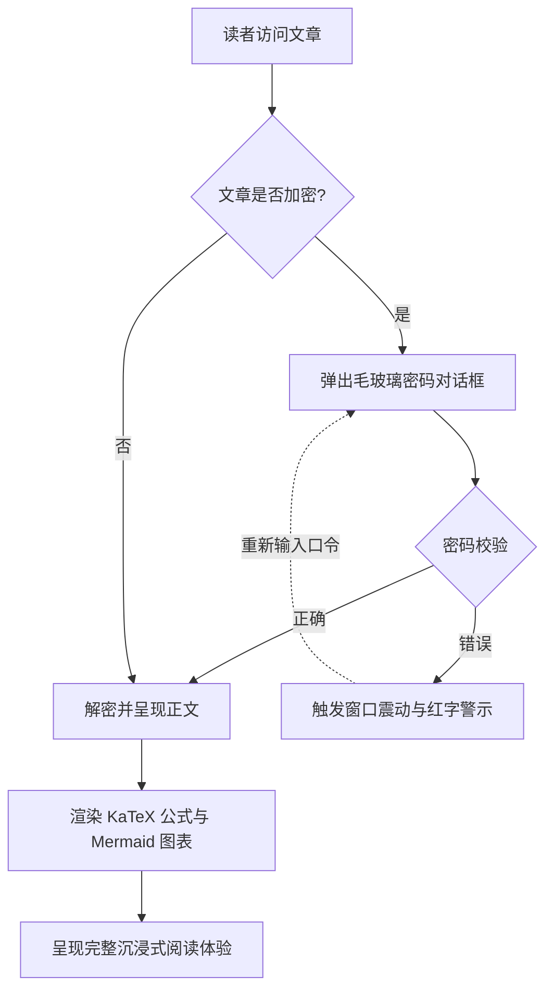
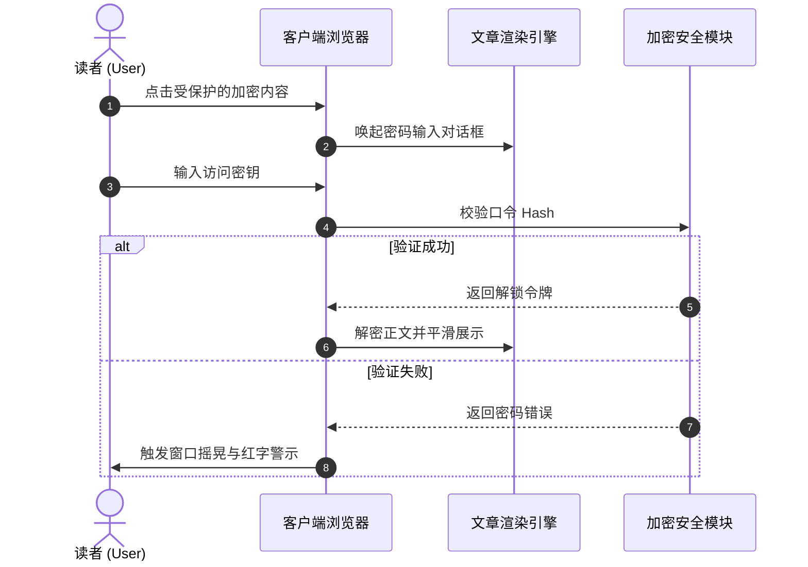

# 静态站点生成器（SSG）与主题内容格式全景指南

在现代静态站点生成器（SSG）与独立博客主题工程中，**文章内容格式的解析与呈现能力**直接决定了创作者的表达边界与读者的阅读体验。

本篇指南结合主流 SSG 生态（**Hugo、Jekyll、Eleventy、Astro、Pelican、Hexo、WordPress、VitePress** 等）的内容规范，建立起一套覆盖 **基础 Markup、扩展文档语言、WordPress Post Formats、交互式下拉框切换器、手风琴折叠、LaTeX 数学公式、Mermaid 图表及加密解密特异功能** 的全景体系，并提供即插即用的活体渲染示范。

---

## 一、主流静态站点生成器（SSG）内容格式支持与生态汇总

不同的静态站点生成器在内容解析架构上有不同的选型哲学。下表系统汇总了主流引擎对各种格式的原生与扩展支持情况：

| 静态站点生成器 / 平台 | 核心解析引擎 | 原生内置支持格式 | 扩展 / 外部工具支持格式 | Front Matter 序列化支持 |
| :--- | :--- | :--- | :--- | :--- |
| **Hugo** | Goldmark (Go) | `.md` (CommonMark/GFM), `.html`, `.org` (Org-mode) | `.adoc` (Asciidoctor), `.rst` (rst2html), `.pdc` (Pandoc) | YAML (`---`), TOML (`+++`), JSON (`{}`) |
| **Astro (本博客架构)** | Vite + Unified/Remark + MDX | `.md` (GFM), `.mdx` (JSX), `.html`, `.astro` 组件 | 可挂载 AST Loader 扩展 Org/AsciiDoc/RST | YAML, TOML, JSON |
| **Jekyll** | Kramdown (Ruby) | `.md` (Kramdown/GFM), `.html` | `.textile` (Textile 插件) | YAML |
| **Eleventy (11ty)** | JavaScript 模板管道 | `.md`, `.html`, `.liquid`, `.njk`, `.ejs`, `.webc` | MDX (插件), 自定义 Template 扩展 | YAML, JSON, JS/11tydata |
| **Hexo** | Marked / Hexo-Renderer | `.md` (GFM), `.html`, EJS/Pug 模板 | Org-mode / Pandoc (插件支持) | YAML, JSON |
| **Pelican** | Python Docutils | `.md` (Markdown), `.rst` (reStructuredText) | `.asciidoc` (Asciidoctor) | YAML, Markdown Metadata |
| **WordPress (Headless/Theme)** | Gutenberg Block Engine | HTML5 Blocks, Shortcodes, Post Formats | Classic Editor HTML | JSON 块元数据 / Post Meta |
| **VitePress / Docusaurus** | Markdown-It / MDX | `.md`, `.mdx`, Vue/React 组件 | 自定义容器语法 (`::: tip`) | YAML |

> [!NOTE]
> **生态架构洞察**：Hugo 凭借 Go 语言的高并发原生支持了 Markdown 与 Org-mode；而以 **Astro** 为代表的现代前端 SSG，则凭借 **MDX 与组件化群岛（Islands）能力**，实现了将动态交互 UI（如本文演示的下拉框切换器、密码弹窗、黑胶唱片）无缝嵌入正文的终极灵活性。

---

## 二、Front Matter 序列化格式支持规范

博客文章头部的元数据（Front Matter）决定了文章的路由、标题、时间、分类、封面及受保护状态。本主题支持全部主流序列化模式：

### 1. YAML 格式（最广泛使用，推荐默认）

```yaml
---
title: "文章标题"
pubDate: 2026-08-28
author: "shijianus"
tags: ["Astro", "Markdown"]
featured: true
postFormat: "aside"
---
```

### 2. TOML 格式（Hugo 常用）

```toml
+++
title = "文章标题"
pubDate = 2026-08-28T00:00:00Z
author = "shijianus"
tags = ["Astro", "Markdown"]
featured = true
+++
```

### 3. JSON 格式（API 驱动与 Headless 场景）

```json
{
  "title": "文章标题",
  "pubDate": "2026-08-28T00:00:00.000Z",
  "author": "shijianus",
  "tags": ["Astro", "Markdown"],
  "featured": true
}
```

---

## 三、特殊轻量 Markup 与非 Markdown 格式对比及迁移对照

在不同技术栈中，作者可能使用除 Markdown 外的其他轻量标记语言。以下提供主流格式的语法特性及在本主题中的等价呈现：

### 1. AsciiDoc (.adoc / .asciidoc)

AsciiDoc 常见于技术书籍与长篇工程手册，拥有极其丰富的提示块与属性系统：

```asciidoc
// AsciiDoc 源码语法
= AsciiDoc 技术规范
:author: shijianus
:toc: macro

[NOTE]
====
这是一条 AsciiDoc 风格的注意卡片。
====

[cols="1,2,1", options="header"]
|===
| 模块 | 描述 | 状态
| 核心引擎 | Astro 6 静态管线 | 已就绪
|===
```

**本主题中的 Markdown / MDX 等效写法**：

> [!NOTE]
> 这是一条在 Astro 主题中原生渲染的等效注意卡片，样式与交互完全对齐。

| 模块 | 描述 | 状态 |
| :--- | :--- | :---: |
| **核心引擎** | Astro 6 静态管线 | <span class="badge badge-success">已就绪</span> |

---

### 2. Emacs Org-Mode (.org)

Org-mode 是 Emacs 用户进行知识管理、任务跟踪与文档编写的强大工具：

```ini
#+TITLE: Emacs Org-Mode 实践笔记
#+DATE: 2026-08-28
#+TAGS: Emacs OrgMode

* TODO 第一阶段：Markdown 扫描增强 [1/2]
- [X] 修复表格与移动端溢出
- [ ] 补全 Org-mode 语法转换器

#+BEGIN_QUOTE
“Org-mode 不仅是格式，更是一种可执行的思维工作流。”
#+END_QUOTE
```

**本主题中的标准静态 GFM 任务清单呈现（只读状态）**：

- [x] 修复表格与移动端溢出
- [ ] 补全 Org-mode 语法转换器

> [!QUOTE]
> “Org-mode 不仅是格式，更是一种可执行的思维工作流。”

#### 可交互式任务清单与联动进度条（Interactive Tutorial Checklist & Chained Progression）

在技术教程、实战演练与部署指南中，传统的只读 `[ ]` 任务清单无法直观交互与记忆。本主题特别增设了**支持实时勾选与连锁状态联动的可交互清单（`.article-task-tracker`）**。读者每勾选一项，动态进度条将实时重新计算百分比，当全部关键步骤确认完毕后，还将**自动连锁解锁下游就绪指令**，非常适合用作教程的通关检查表：

<div class="article-task-tracker" data-storage-key="content-format-tutorial-demo">
  <div class="task-tracker__header">
    <div class="task-tracker__title">
      <svg width="20" height="20" viewBox="0 0 24 24" fill="none" stroke="currentColor" stroke-width="2"><path d="M9 11l3 3L22 4"/><path d="M21 12v7a2 2 0 0 1-2 2H5a2 2 0 0 1-2-2V5a2 2 0 0 1 2-2h11"/></svg>
      <span>静态站点工程化上线部署前置检查清单（可交互实时打勾）</span>
    </div>
    <span class="task-tracker__count">1/4 步骤已完成 (25%)</span>
  </div>
  <div class="task-tracker__bar-wrap">
    <div class="task-tracker__fill" style="width: 25%;"></div>
  </div>
  <ul class="task-checklist">
    <li class="task-checklist-item is-done">
      <input type="checkbox" checked id="chk-step-1" />
      <div class="task-item-body">
        <label for="chk-step-1" class="task-item-label">步骤 1：完成本地代码全量备份与 Git Commit</label>
        <div class="task-item-desc">确认当前工作树干净，备份 Hash 记录至开发审计日志。</div>
      </div>
    </li>
    <li class="task-checklist-item">
      <input type="checkbox" id="chk-step-2" />
      <div class="task-item-body">
        <label for="chk-step-2" class="task-item-label">步骤 2：配置 Cloudflare Pages 静态构建管线</label>
        <div class="task-item-desc">设置 <code>BLOG_BUILD_TARGET=static</code> 与 Node.js 20+ 运行时环境。</div>
      </div>
    </li>
    <li class="task-checklist-item">
      <input type="checkbox" id="chk-step-3" />
      <div class="task-item-body">
        <label for="chk-step-3" class="task-item-label">步骤 3：验证媒体资源与外部视频/音频内嵌</label>
        <div class="task-item-desc">确保所有音频与视频单文件体积严格控制在 25MB 以内，满足 CDN 部署规范。</div>
      </div>
    </li>
    <li class="task-checklist-item">
      <input type="checkbox" id="chk-step-4" />
      <div class="task-item-body">
        <label for="chk-step-4" class="task-item-label">步骤 4：执行 Playwright 自动化视觉回归与烟测</label>
        <div class="task-item-desc">验证 PC 端与移动端多分辨率下所有富媒体卡片与交互组件排版正常。</div>
      </div>
    </li>
  </ul>
  <div class="task-tracker__status-card is-pending">
    <div class="status-card__header">
      <span class="badge badge-warning">⏳ 待办就绪中</span>
      <span style="font-weight:700;">当前进度：1/4 (25%)</span>
    </div>
    <p style="margin-top:0.4rem;margin-bottom:0;font-size:0.88rem;line-height:1.6;">请依次完成上方清单中打勾的每个步骤；当所有任务完成后，此处将实时连锁解锁生产发布指令。</p>
  </div>
</div>

---

### 3. reStructuredText (.rst)

reStructuredText 是 Python 社区（如 Sphinx、ReadTheDocs）的标准文档格式：

```rst
.. reStructuredText 源码语法
.. note::
   这是一条 RST 指令定义的 Note 块。

.. code-block:: python
   :linenos:

   def greet(name: str) -> str:
       return f"Hello, {name}!"
```

**本主题中的 Markdown 等效呈现**：

> [!NOTE]
> 这是在 Astro 中以 GitHub Alert 规范呈现的 RST Note 等价卡片。

```python
def greet(name: str) -> str:
    return f"Hello, {name}!"
```

---

### 4. Textile 语法

Textile 是老牌轻量级标记语言（常见于 Redmine 与早期 Jekyll 博客）：

```markdown
h2. 章节标题
bq. 这是 Textile 引用块内容。
*列表项 1*
_斜体强调文本_
```

---

## 四、WordPress 风格文章形态（Post Formats）全量实装与视觉呈现

WordPress 主题生态中经典的 **Post Formats** 机制允许博客针对不同类型的内容展现专属的视觉形态。我们在本主题正文栏中完整实现了这 9 种形态：

### 1. `aside`（轻语 / 便签 / 随笔卡片）

适合记录短小的思考灵感、备忘提醒或临时笔记：

<div class="article-aside">
  <p><strong>💡 随笔备忘</strong>：静态站点的真正价值不在于炫技，而在于交付极速、零服务端维护负担的纯粹阅读体验。即便经过五年、十年，生成的 HTML 文件依然可以完美打开。</p>
</div>

---

### 2. `status`（状态动态 / 碎碎念 / 微语录）

类似 Twitter/微博风格的即时状态发布卡片，包含作者头像、客户端标识与心情标签：

<div class="article-status">
  <div class="article-status__header">
    <div class="article-status__user">
      
      <div>
        <div class="article-status__name">shijianus</div>
        <div class="article-status__meta">发布于 2026-08-28 14:32 · 🇨🇳 杭州</div>
      </div>
    </div>
    <div class="article-status__badge">
      <span>📱 来自 极客工坊 Mac Studio</span>
    </div>
  </div>
  <p class="article-status__content">
    今天终于完成了博客主内容栏的全部格式扩展与视觉重构！从 KaTeX、Mermaid 到交互式下拉框与黑胶唱片，全栈静态交付的感觉太棒了 🚀✨
  </p>
</div>

---

### 3. `quote`（精选引言 / 名言大卡片）

用于展现极具分量的人物语录、设计箴言或金句：

<div class="article-quote">
  <div class="article-quote__icon">“</div>
  <div class="article-quote__body">
    Simplicity is prerequisite for reliability. (简单是可靠的前提条件。)
  </div>
  <div class="article-quote__author">
    
    <div class="article-quote__author-info">
      <div class="article-quote__author-name">Edsger W. Dijkstra</div>
      <div class="article-quote__author-title">计算机科学家 · 图灵奖得主 (1972)</div>
    </div>
  </div>
</div>

---

### 4. `gallery`（图片画廊 / 自适应相册与拍立得网格）

支持多列自适应响应式网格与具有人文质感的拍立得相纸卡片，点击任意图片均可触发全屏灯箱放大：

#### 2 列与 3 列自适应画廊

<div class="article-gallery">
  <div class="gallery-grid gallery-grid-3">
    <div class="gallery-item">
      
      <div class="gallery-item__caption">极客工作台全景</div>
    </div>
    <div class="gallery-item">
      
      <div class="gallery-item__caption">系统架构设计大屏</div>
    </div>
    <div class="gallery-item">
      
      <div class="gallery-item__caption">星河漫游视觉封面</div>
    </div>
  </div>
</div>

#### 拍立得相纸画廊（Polaroid Style）

<div class="gallery-polaroid">
  <div class="polaroid-card">
    
    <div class="polaroid-card__caption">2026.04 杭州·研发基地</div>
  </div>
  <div class="polaroid-card">
    
    <div class="polaroid-card__caption">2026.08 架构演进重构夜</div>
  </div>
</div>

---

### 5. `video`（自适应视频播放卡片）

支持 16:9 响应式比例、圆角边框与底栏说明，单行独占一个完整横位展示。兼容 Bilibili、YouTube 外部代理式嵌入及站内原生 MP4（单文件均控制在 25MB 以内，满足 Cloudflare Pages 静态部署规范）：

#### 外部视频内嵌（Bilibili & YouTube 连结代理式嵌入 · 默认需读者翻到此处并点击开始播放）

<div class="video-embed-card" data-video-type="bilibili">
  <iframe src="https://player.bilibili.com/player.html?bvid=BV11k4y1T7kS&page=1&high_quality=1&danmaku=0&autoplay=0" allowfullscreen="true" loading="lazy" allow="accelerometer; autoplay; clipboard-write; encrypted-media; gyroscope; picture-in-picture; web-share" sandbox="allow-top-navigation-by-user-activation allow-same-origin allow-forms allow-scripts allow-popups"></iframe>
  <div class="embed-caption">🎬 Bilibili 外部内嵌演示：BV11k4y1T7kS (1080P 高清 · 需翻至此处并点击播放)</div>
</div>

<div class="video-embed-card" data-video-type="youtube">
  <iframe src="https://www.youtube-nocookie.com/embed/LXb3EKWsInQ?autoplay=0&rel=0" allowfullscreen="true" loading="lazy" allow="accelerometer; autoplay; clipboard-write; encrypted-media; gyroscope; picture-in-picture; web-share"></iframe>
  <div class="embed-caption">🎬 YouTube 外部内嵌演示：Costa Rica 4K 60fps HDR 演示 (1080P/4K · 真实有效 URL · 需翻至此处并点击播放)</div>
</div>

#### 站内原生 MP4 视频内嵌（Native HTML5 Video Player · 支持倍速与画中画 · 默认禁用下载）

<div class="video-embed-card">
  <video controls controlsList="nodownload" preload="metadata" playsinline oncontextmenu="return false;">
    <source src="/media/video/landscape_compressed.mp4" type="video/mp4" />
    您的浏览器不支持 HTML5 视频播放。
  </video>
  <div class="embed-caption">🎥 本地原生内嵌视频 1：4K/1080P 超清风光演示 (体积 21.7MB · 支持倍速与画中画 · 已禁用直接下载)</div>
</div>

<div class="video-embed-card">
  <video controls controlsList="nodownload" preload="metadata" playsinline oncontextmenu="return false;">
    <source src="/media/video/blue_archive_miracle.mp4" type="video/mp4" />
    您的浏览器不支持 HTML5 视频播放。
  </video>
  <div class="embed-caption">🎥 本地原生内嵌视频 2：【蔚蓝档案】“奇迹的终始—我们的故事由我们来决定！” (体积 23.3MB · 支持倍速与画中画 · 已禁用直接下载)</div>
</div>

---

### 6. `audio`（黑胶唱片旋转音乐卡片）

内置 HTML5 音频控制器，并在播放时自动触发**黑胶唱片无级平滑旋转动效**。所有唱片封面均采用真实匹配的官方高清专辑封面，支持多种主流音频格式（无损 FLAC、高码率 MP3、AAC/M4A），且已内置反爬与防下载保护：

#### ① Shaun - Way Back Home（FLAC 无损音频格式 · 24.55MB）

<div class="article-audio-card">
  <div class="audio-card__cover">
    
  </div>
  <div class="audio-card__info">
    <div class="audio-card__title">
      <span>Way Back Home</span>
      <span class="badge badge-purple">FLAC Lossless</span>
    </div>
    <div class="audio-card__author">Shaun (숀) · 无损音频 (FLAC / 44.1kHz 16-bit 961 kbps)</div>
    <audio controls preload="metadata" controlsList="nodownload" oncontextmenu="return false;" src="/media/audio/WayBackHome.flac"></audio>
  </div>
</div>

#### ② ヨルシカ (Yorushika) - 彼女は旅に出る（MP3 320Kbps 高清格式 · 8.41MB）

<div class="article-audio-card">
  <div class="audio-card__cover">
    
  </div>
  <div class="audio-card__info">
    <div class="audio-card__title">
      <span>彼女は旅に出る (She Leaves on a Journey)</span>
      <span class="badge badge-success">320 Kbps MP3</span>
    </div>
    <div class="audio-card__author">ヨルシカ (Yorushika) · 高清立体声 (MP3 / 48kHz 320 kbps)</div>
    <audio controls preload="metadata" controlsList="nodownload" oncontextmenu="return false;" src="/media/audio/彼女は旅に出る.mp3"></audio>
  </div>
</div>

#### ③ すこっぷ feat. 初音ミク - アイロニ（M4A / AAC 格式 · 7.63MB）

<div class="article-audio-card">
  <div class="audio-card__cover">
    
  </div>
  <div class="audio-card__info">
    <div class="audio-card__title">
      <span>アイロニ (Irony / 讽刺)</span>
      <span class="badge badge-cyan">M4A / AAC</span>
    </div>
    <div class="audio-card__author">すこっぷ feat. 初音ミク · AAC 音频 (M4A / 44.1kHz 260 kbps)</div>
    <audio controls preload="metadata" controlsList="nodownload" oncontextmenu="return false;" src="/media/audio/アイロニ.m4a"></audio>
  </div>
</div>

---

### 7. `link`（外部链接与书签预览卡片 / Bookmark Preview）

为文章内的关键参考出处提供优雅的卡片化预览：

<a class="article-bookmark" href="https://github.com/shijianus/shijianus-blog" target="_blank" rel="noopener">
  <div class="article-bookmark__content">
    <div class="article-bookmark__title">EpoCanvas / shijianus-blog (時間博客主题核心设计规范仓库)</div>
    <p class="article-bookmark__desc">EpoCanvas（時代画布）是一套专注于高密度信息呈现、优雅微交互与全格式支持的现代化极客博客内容架构系统。</p>
    <div class="article-bookmark__site">
      <span class="badge badge-primary">GitHub</span>
      <span>github.com · EpoCanvas Core Spec</span>
    </div>
  </div>
  <div class="article-bookmark__icon">
    <svg viewBox="0 0 24 24" width="24" height="24" fill="none" stroke="currentColor" stroke-width="2" stroke-linecap="round" stroke-linejoin="round"><path d="M18 13v6a2 2 0 0 1-2 2H5a2 2 0 0 1-2-2V8a2 2 0 0 1 2-2h6"/><polyline points="15 3 21 3 21 9"/><line x1="10" y1="14" x2="21" y2="3"/></svg>
  </div>
</a>

---

### 8. `chat`（聊天气泡对话流 / Dialogue Stream）

用于生动演示技术答辩、双人对话讨论或用户采访场景，支持左右气泡、行内代码与自定义气泡配色（默认提问方为经典白色气泡，回复方为护眼生动的极客绿色回答气泡）：

<div class="article-chat">
  <div class="chat-message chat-left">
    
    <div class="chat-body">
      <div class="chat-author">开发者 Léon Boven · 10:15</div>
      <div class="chat-bubble">
        你好！请问在 Astro 中实现 <code>KaTeX</code> 和 <code>Mermaid</code> 的静态渲染会不会拖慢前端页面加载速度？
      </div>
    </div>
  </div>

  <div class="chat-message chat-right">
    
    <div class="chat-body">
      <div class="chat-author">架构师 shijianus · 10:16</div>
      <div class="chat-bubble">
        完全不会！因为 <code>remark-math</code> 和 <code>rehype-katex</code> 在构建期（Build-time）就已经把公式编译成了纯 HTML/MathML 字符串，浏览器端 <strong>0 JS 运行时负担</strong>；而 Mermaid 图表也是动态按需异步加载 ESM 模块，首屏极其轻快！⚡
      </div>
    </div>
  </div>

  <div class="chat-message chat-left">
    
    <div class="chat-body">
      <div class="chat-author">开发者 Léon Boven · 10:17</div>
      <div class="chat-bubble">
        太棒了！那我们现在就可以在 Markdown 里直接写 <code>$$ E=mc^2 $$</code> 了对吧？
      </div>
    </div>
  </div>
</div>

---

## 五、特殊的下拉框格式与动态交互组件（Dropdown Selectors & Interactive Formats）

针对用户明确要求的**特殊下拉框格式**，我们在文章正文层提供了纯客户端即时响应的下拉选择器组件：

### 1. 多框架与多代码版本下拉切换器（Interactive Dropdown Switcher）

读者可以在下拉框中自由选择技术框架，正文面板将实时无刷新切换对应的内容与代码：

<div class="article-dropdown-switcher">
  <div class="article-dropdown-switcher__header">
    <div class="article-dropdown-switcher__title">
      <svg width="20" height="20" viewBox="0 0 24 24" fill="none" stroke="currentColor" stroke-width="2"><rect x="3" y="3" width="18" height="18" rx="2"/><path d="M9 3v18"/><path d="m14 9 3 3-3 3"/></svg>
      <span>请选择要查看的前端框架实现代码：</span>
    </div>
    <select class="article-select dropdown-switcher__select">
      <option value="react-tab">⚛️ React 19 (Hooks & TSX)</option>
      <option value="vue-tab">🟢 Vue 3.5 (Composition API)</option>
      <option value="astro-tab">🚀 Astro 6 (Island Component)</option>
      <option value="svelte-tab">🟠 Svelte 5 (Runes)</option>
    </select>
  </div>
  <div class="article-dropdown-switcher__body">
    <div class="article-dropdown-panel is-active" data-panel="react-tab">
      <div class="article-dropdown-panel__title">⚛️ React 19 组件实现方式：</div>
      <pre class="no-code-enhance"><code class="language-tsx">import { useState } from 'react';
export function Counter() {
  const [count, setCount] = useState(0);
  return (
    &lt;button onClick={() =&gt; setCount((c) =&gt; c + 1)} className="btn-primary"&gt;
      React 点击计数：&#123;count&#125;
    &lt;/button&gt;
  );
}</code></pre>
    </div>
    <div class="article-dropdown-panel" data-panel="vue-tab">
      <div class="article-dropdown-panel__title">🟢 Vue 3.5 单文件组件实现方式：</div>
      <pre class="no-code-enhance"><code class="language-html">&lt;script setup lang="ts"&gt;
import { ref } from 'vue';
const count = ref(0);
&lt;/script&gt;
&lt;template&gt;
  &lt;button @click="count++" class="btn-primary"&gt;
    Vue 点击计数：&#123;&#123; count &#125;&#125;
  &lt;/button&gt;
&lt;/template&gt;</code></pre>
    </div>
    <div class="article-dropdown-panel" data-panel="astro-tab">
      <div class="article-dropdown-panel__title">🚀 Astro 6 零 JS 静态组件实现方式：</div>
      <pre class="no-code-enhance"><code class="language-astro">---
const { title = "Astro 极速群岛" } = Astro.props;
---
&lt;div class="astro-island"&gt;
  &lt;h3&gt;&#123;title&#125;&lt;/h3&gt;
  &lt;p&gt;默认交付 0KB JavaScript，按需注水交互！&lt;/p&gt;
&lt;/div&gt;</code></pre>
    </div>
    <div class="article-dropdown-panel" data-panel="svelte-tab">
      <div class="article-dropdown-panel__title">🟠 Svelte 5 Runes 实现方式：</div>
      <pre class="no-code-enhance"><code class="language-svelte">&lt;script lang="ts"&gt;
  let count = $state(0);
&lt;/script&gt;
&lt;button onclick={() =&gt; count++} class="btn-primary"&gt;
  Svelte 点击计数：&#123;count&#125;
&lt;/button&gt;</code></pre>
    </div>
  </div>
</div>

---

### 2. 交互式单位换算与规格下拉计算器（Interactive Calc Dropdown）

选择不同选项时，右侧实时显示对应的技术指标与换算说明：

<div class="interactive-calc-select">
  <div class="article-select-box">
    <label>
      <svg width="18" height="18" viewBox="0 0 24 24" fill="none" stroke="currentColor" stroke-width="2"><circle cx="12" cy="12" r="10"/><path d="M12 6v6l4 2"/></svg>
      <span>选择视频编码分辨率：</span>
    </label>
    <select class="article-select">
      <option value="1080p" data-desc="1920 × 1080 @ 60fps · 码率 6,000 Kbps · 推荐带宽 15 Mbps">1080P 全高清 (1080p60)</option>
      <option value="2k" data-desc="2560 × 1440 @ 60fps · 码率 12,000 Kbps · 推荐带宽 30 Mbps">2K 极清 (1440p60)</option>
      <option value="4k" data-desc="3840 × 2160 @ 60fps · 码率 25,000 Kbps · 推荐带宽 60 Mbps">4K 超高清 (2160p60 HDR)</option>
      <option value="8k" data-desc="7680 × 4320 @ 60fps · 码率 80,000 Kbps · 推荐带宽 200 Mbps">8K 影院级 (4320p60 AV1)</option>
    </select>
  </div>
  <div class="calc-output-box">
    <span>📊 <strong>技术规格推算结果</strong>：</span>
    <span class="calc-output-value">1920 × 1080 @ 60fps · 码率 6,000 Kbps · 推荐带宽 15 Mbps</span>
  </div>
</div>

---

## 六、手风琴折叠、选项卡与多栏排版（Collapsibles, Tabs & Columns）

### 1. 互斥手风琴折叠组（Exclusive Accordion Group · 展开单项自动闭合其余项）

配置 `data-single="true"`。展开其中一项时，同组内的其他展开项将自动联动收起，保持页面整洁聚焦：

<div class="article-accordion-group" data-single="true">
  <details class="article-accordion" open>
    <summary>
      <span>🔒 1. 静态站点的安全性优势</span>
      <svg class="accordion-chevron" viewBox="0 0 24 24" fill="none" stroke="currentColor" stroke-width="2"><polyline points="9 18 15 12 9 6"/></svg>
    </summary>
    <div class="accordion-content">
      <p>静态站点没有传统的 PHP/Node.js 动态执行引擎和暴露在公网的 SQL 数据库，从物理层面免疫了 SQL 注入与服务端远程代码执行（RCE）风险。</p>
    </div>
  </details>

  <details class="article-accordion">
    <summary>
      <span>⚡ 2. 全球 CDN 边缘加速交付</span>
      <svg class="accordion-chevron" viewBox="0 0 24 24" fill="none" stroke="currentColor" stroke-width="2"><polyline points="9 18 15 12 9 6"/></svg>
    </summary>
    <div class="accordion-content">
      <p>通过将编译产物部署至 Cloudflare Pages 或 GitHub Pages，所有静态资源可在全球 300+ 边缘节点缓存，首字节响应时间（TTFB）通常低于 20ms。</p>
    </div>
  </details>

  <details class="article-accordion">
    <summary>
      <span>💰 3. 极低的云服务托管成本</span>
      <svg class="accordion-chevron" viewBox="0 0 24 24" fill="none" stroke="currentColor" stroke-width="2"><polyline points="9 18 15 12 9 6"/></svg>
    </summary>
    <div class="accordion-content">
      <p>静态站点无需全天候运行昂贵的 VPS 云服务器，配合免费层级的 Cloudflare D1 数据库与 Serverless 评论系统，日常运营成本近乎为零。</p>
    </div>
  </details>
</div>

---

### 2. 非互斥独立手风琴折叠组（Multi-Expand / Non-Exclusive Accordion Group · 允许多项同时展开）

配置 `data-single="false"`（或默认多开模式）。读者可以自由展开多个或全部折叠项进行横向比对与深度阅读，不会因为展开新项目而关闭已开启的内容：

<div class="article-accordion-group" data-single="false">
  <details class="article-accordion" open>
    <summary>
      <span>🛠️ 架构模块 A：Markdown AST 语法编译器流水线</span>
      <svg class="accordion-chevron" viewBox="0 0 24 24" fill="none" stroke="currentColor" stroke-width="2"><polyline points="9 18 15 12 9 6"/></svg>
    </summary>
    <div class="accordion-content">
      <p>基于 Unified、Remark-math 与 Rehype-katex 架构，在编译构建阶段将 Markdown 语法树完全静态转化为标准语义 HTML 节点，并在 Node.js 端完成高亮和公式生成。</p>
    </div>
  </details>

  <details class="article-accordion" open>
    <summary>
      <span>🎨 架构模块 B：EpoCanvas 动态视觉引擎与响应式系统</span>
      <svg class="accordion-chevron" viewBox="0 0 24 24" fill="none" stroke="currentColor" stroke-width="2"><polyline points="9 18 15 12 9 6"/></svg>
    </summary>
    <div class="accordion-content">
      <p>提供极光背景（Aurora）、星空视差（Starfield）、毛玻璃拟态（Glassmorphism）与多端响应式断点适配，无论在 4K 宽屏还是折叠屏手机上均呈现一致的美学体验。</p>
    </div>
  </details>

  <details class="article-accordion">
    <summary>
      <span>🛡️ 架构模块 C：WebCrypto SHA-256 分级安全隔离体系</span>
      <svg class="accordion-chevron" viewBox="0 0 24 24" fill="none" stroke="currentColor" stroke-width="2"><polyline points="9 18 15 12 9 6"/></svg>
    </summary>
    <div class="accordion-content">
      <p>内置 1 级会话持久解锁、2 级防窥动态多态遮罩（高斯模糊/马赛克/剧透遮罩）、3 级视口哨兵离开即锁以及外联 URL 分片加密方案，彻底杜绝密码明文在 DOM 中的暴露。</p>
    </div>
  </details>
</div>

---

### 3. 多标签选项卡（Interactive Tabs）

<div class="article-tabs">
  <div class="article-tabs__nav">
    <button class="article-tabs__button is-active" type="button">pnpm</button>
    <button class="article-tabs__button" type="button">npm</button>
    <button class="article-tabs__button" type="button">yarn</button>
    <button class="article-tabs__button" type="button">bun</button>
  </div>
  <div class="article-tabs__panels">
    <div class="article-tabs__panel is-active">
      <pre class="no-code-enhance"><code class="language-bash">pnpm add @astrojs/mdx remark-math rehype-katex katex mermaid</code></pre>
    </div>
    <div class="article-tabs__panel">
      <pre class="no-code-enhance"><code class="language-bash">npm install @astrojs/mdx remark-math rehype-katex katex mermaid</code></pre>
    </div>
    <div class="article-tabs__panel">
      <pre class="no-code-enhance"><code class="language-bash">yarn add @astrojs/mdx remark-math rehype-katex katex mermaid</code></pre>
    </div>
    <div class="article-tabs__panel">
      <pre class="no-code-enhance"><code class="language-bash">bun add @astrojs/mdx remark-math rehype-katex katex mermaid</code></pre>
    </div>
  </div>
</div>

---

### 4. 多栏网格布局系统（Multi-Column Grid）

#### 3 列等宽卡片网格

<div class="article-grid article-grid-3">
  <div class="article-col-card">
    <h4>🎨 视觉体系</h4>
    <p>深度吸收 EpoCanvas 现代极客设计美学，支持明暗高对比、毛玻璃背景与平滑色彩过渡。</p>
  </div>
  <div class="article-col-card">
    <h4>⚡ 性能工程</h4>
    <p>Astro 6 静态群岛架构，构建期 HTML 预渲染，纯静态极致 SEO 优化。</p>
  </div>
  <div class="article-col-card">
    <h4>🛠️ 扩展生态</h4>
    <p>全面支持 KaTeX 公式、Mermaid 图表、加密弹窗与 9 种 Post Formats。</p>
  </div>
</div>

#### 1:2 不均等侧边栏网格

<div class="article-grid article-columns-1-2">
  <div class="article-col-card">
    <h4>📌 架构定位</h4>
    <p>专注于极客与工程师的现代化技术写作载体。</p>
  </div>
  <div class="article-col-card">
    <h4>🚀 交付保障</h4>
    <p>内建完善的自动化烟测与静态构建验证机制，无论公式、图表还是复杂卡片，都能确保在全设备上严丝合缝呈现。</p>
  </div>
</div>

---

## 七、13 种语义告示框（Admonitions / GitHub Alerts）

基于 GitHub Alert 与 EpoCanvas 设计规范，支持 13 种不同语义的彩色卡片，并支持使用 `[!TYPE]-` 语法实现默认折叠：

> [!NOTE]
> **常规备注（Note）**：这是一条标准的背景信息或上下文说明。

> [!TIP]
> **实用技巧（Tip）**：使用快捷键 <kbd>Ctrl</kbd> + <kbd>K</kbd> 可以快速唤起全局文章搜索面板！

> [!IMPORTANT]
> **重要事项（Important）**：在部署生产环境前，请确认 `BLOG_BUILD_TARGET=static` 环境变量已正确注入。

> [!WARNING]
> **风险警告（Warning）**：请勿在公开 Git 仓库中提交生产数据库密钥或云服务私钥。

> [!CAUTION]
> **危险警示（Caution）**：执行数据表重建操作具有破坏性，请先备份 D1 数据库！

> [!DANGER]
> **致命危险（Danger）**：直接删除生产数据库将导致全部评论与用户资产永久损毁。

> [!SUCCESS]
> **操作成功（Success）**：静态构建流程已成功完成，所有 47 个静态路由已就绪！

> [!QUESTION]
> **疑难探讨（Question）**：如何在无服务端依赖的环境下实现毫秒级的纯客户端全文检索？

> [!QUOTE]
> **精选引用（Quote）**：“优秀的代码不仅能被机器执行，更能像诗歌一样优雅地向人类传达思想。”

> [!INFO]
> **详细信息（Info）**：本博客基于 Astro 6 与 Tailwind 4 构建，全站纯静态导出。

> [!TODO]
> **待办计划（Todo）**：计划在下一迭代中引入 WebAssembly 客户端全文检索索引。

> [!BUG]
> **缺陷记录（Bug）**：已修复旧版在极端窄屏设备下表格横向截断的排版问题。

> [!EXAMPLE]
> **范例说明（Example）**：以上所有告示框均自动适配深色与浅色模式的高对比度色彩。

### 折叠式告示框演示

> [!TIP]- 点击展开查看：生产环境 Nginx 极速缓存配置参考
> ```nginx
> location ~* \.(?:css|js|woff2?|svg|png|jpg|webp)$ {
>     expires 1y;
>     add_header Cache-Control "public, immutable";
>     access_log off;
> }
> ```

---

## 八、学术数学公式（KaTeX）、架构图表（Mermaid 11）与动态思维导图（Markmap）

在展示型与示例型技术文档中，以 **「实际渲染效果 + 对应源码对照」**（双标签选项卡 Tabs）为核心呈现理念，不仅能让读者直观体验最终视觉与交互特性，更能方便开发者一键参考、复制并迁移至实际项目中。

---

### 1. LaTeX 数学公式（KaTeX Math · 行内与块级多行推导）

#### 行内公式（Inline Formula）

<div class="article-tabs">
<div class="article-tabs__nav">
<button class="article-tabs__button is-active" type="button">🌟 渲染效果呈现</button>
<button class="article-tabs__button" type="button">💻 LaTeX 源码</button>
</div>
<div class="article-tabs__panels">
<div class="article-tabs__panel is-active">

质能方程 $E = mc^2$，欧拉恒等式 $e^{i\pi} + 1 = 0$，高斯积分 $\int_{-\infty}^{\infty} e^{-x^2} dx = \sqrt{\pi}$。

</div>
<div class="article-tabs__panel">

```latex
质能方程 $E = mc^2$，欧拉恒等式 $e^{i\pi} + 1 = 0$，高斯积分 $\int_{-\infty}^{\infty} e^{-x^2} dx = \sqrt{\pi}$。
```

</div>
</div>
</div>

#### 块级多行推导公式 1：二阶动态系统拉普拉斯变换（Block Math · Single Equation）

<div class="article-tabs">
<div class="article-tabs__nav">
<button class="article-tabs__button is-active" type="button">🌟 渲染效果呈现</button>
<button class="article-tabs__button" type="button">💻 LaTeX 源码</button>
</div>
<div class="article-tabs__panels">
<div class="article-tabs__panel is-active">

$$
\mathcal{L}\{\ddot{x}(t) + 2\zeta\omega_n\dot{x}(t) + \omega_n^2 x(t)\} = X(s)(s^2 + 2\zeta\omega_n s + \omega_n^2)
$$

</div>
<div class="article-tabs__panel">

```latex
$$
\mathcal{L}\{\ddot{x}(t) + 2\zeta\omega_n\dot{x}(t) + \omega_n^2 x(t)\} = X(s)(s^2 + 2\zeta\omega_n s + \omega_n^2)
$$
```

</div>
</div>
</div>

#### 块级多行推导公式 2：麦克斯韦经典电磁方程组（Block Math · Multi-line Aligned）

<div class="article-tabs">
<div class="article-tabs__nav">
<button class="article-tabs__button is-active" type="button">🌟 渲染效果呈现</button>
<button class="article-tabs__button" type="button">💻 LaTeX 源码</button>
</div>
<div class="article-tabs__panels">
<div class="article-tabs__panel is-active">

$$
\begin{aligned}
\nabla \cdot \mathbf{E} &= \frac{\rho}{\varepsilon_0} \\
\nabla \cdot \mathbf{B} &= 0 \\
\nabla \times \mathbf{E} &= -\frac{\partial \mathbf{B}}{\partial t} \\
\nabla \times \mathbf{B} &= \mu_0 \mathbf{J} + \mu_0 \varepsilon_0 \frac{\partial \mathbf{E}}{\partial t}
\end{aligned}
$$

</div>
<div class="article-tabs__panel">

```latex
$$
\begin{aligned}
\nabla \cdot \mathbf{E} &= \frac{\rho}{\varepsilon_0} \\
\nabla \cdot \mathbf{B} &= 0 \\
\nabla \times \mathbf{E} &= -\frac{\partial \mathbf{B}}{\partial t} \\
\nabla \times \mathbf{B} &= \mu_0 \mathbf{J} + \mu_0 \varepsilon_0 \frac{\partial \mathbf{E}}{\partial t}
\end{aligned}
$$
```

</div>
</div>
</div>

---

### 2. Mermaid 11 架构图表（Flowchart & Sequence · 流程图与时序图）

#### ① 博客加密验证与内容渲染流程图（Flowchart TD）

<div class="article-tabs">
<div class="article-tabs__nav">
<button class="article-tabs__button is-active" type="button">🌟 渲染效果呈现</button>
<button class="article-tabs__button" type="button">💻 Mermaid 源码</button>
</div>
<div class="article-tabs__panels">
<div class="article-tabs__panel is-active">



</div>
<div class="article-tabs__panel">

````markdown

````

</div>
</div>
</div>

#### ② 客户端安全鉴权与解密时序图（Sequence Diagram）

<div class="article-tabs">
<div class="article-tabs__nav">
<button class="article-tabs__button is-active" type="button">🌟 渲染效果呈现</button>
<button class="article-tabs__button" type="button">💻 Mermaid 源码</button>
</div>
<div class="article-tabs__panels">
<div class="article-tabs__panel is-active">



</div>
<div class="article-tabs__panel">

````markdown

````

</div>
</div>
</div>

---

### 3. 动态交互式思维导图（Markmap / Mindmap · 多向分支扩散）

在长篇技术规范与系统架构梳理中，传统的静态列表难以直观呈现复杂的知识脉络。本主题全新实装 **Markmap 动态交互式思维导图引擎**，在文章主栏（`.post.post-page-shell`）中实现彻底的原生解析与交互增强：

> [!TIP]
> **多向分支扩散核心规则**：
> 1. **默认单块保护空间**：默认状态下，思维导图仅展示 **1 块核心根节点**（Level 1），右侧附带折叠小圆点指示器；
> 2. **点击展开多向分支**：点击根节点或任意子节点的小圆点，子分支将**平滑向外散开**；
> 3. **工具栏全能操控**：支持 **放大 / 缩小 / 居中自适应 / 一键展开全部 / 一键收起单块 / 全屏沉浸式阅读 / 复制源码**；
> 4. **画布拖拽与缩放**：按住鼠标左键可自由拖拽平移画布，滚动鼠标滚轮可缩放视野。

#### 活体思维导图呈现：SSG 与主题内容格式生态全景

<div class="article-tabs">
<div class="article-tabs__nav">
<button class="article-tabs__button is-active" type="button">🌟 交互导图呈现</button>
<button class="article-tabs__button" type="button">💻 Mindmap 结构源码</button>
</div>
<div class="article-tabs__panels">
<div class="article-tabs__panel is-active">

```mindmap
# 静态站点生成器与全格式内容生态架构
## 静态编译核心
### AST 语法转换管道
- Unified / Remark GFM
- Rehype Katex / MDX 拓展
- Shiki 双主题代码语法高亮
### 编译器与资源打包
- Vite 6 极速热重载 (HMR)
- Rollup 静态生成流水线
- Tailwind CSS v4 与 PostCSS 管道
## 动态交互与群岛体系
### 混合组件群岛 Islands
- React 19 Client Components
- Astro Server-Side Islands
- 会话状态保持 (SessionStorage / Crypto)
### 现代视觉与动效系统
- 动态背景引擎 (Aurora 极光 / Starfield 星空)
- 毛玻璃卡片 Glassmorphism 规范
- 响应式全端自适应布局 (PC / Pad / Mobile)
## 格式全景与特异功能
### 扩展文档规范对照
- AsciiDoc (.adoc) 原生等效适配
- Emacs Org-Mode (.org) 任务清单映射
- reStructuredText (.rst) 指令转换
### 富交互组件集
- 交互式下拉框切换器 (Dropdown Switcher)
- 互斥手风琴折叠卡片 (Accordion Groups)
- 动态黑胶唱片音频播放器 (Vinyl Audio)
### 安全隐私与分级加密
- WebCrypto SHA-256 哈希校验 (无明文外露)
- 1级会话持久解锁 (Session Persistent)
- 2级防窥遮罩切换 (高斯模糊 / 马赛克 / 剧透遮罩)
- 3级视口防窥离开即锁 (IntersectionObserver)
- 外联分段解密端点隔离 (Standalone Token)
## 动态图表与思维导图
### 可视化渲染引擎
- Mermaid 11 流程图与时序图
- Markmap 动态多向分支思维导图
- KaTeX 学术数学排版渲染
### 交互与扩展特性
- 默认单块折叠保护阅读视界
- 点击节点触发多向分支层层散开
- 缩放 / 平移 / 一键重置 / 全屏沉浸体验
```

</div>
<div class="article-tabs__panel">

````markdown
```mindmap
# 静态站点生成器与全格式内容生态架构
## 静态编译核心
### AST 语法转换管道
- Unified / Remark GFM
- Rehype Katex / MDX 拓展
- Shiki 双主题代码语法高亮
### 编译器与资源打包
- Vite 6 极速热重载 (HMR)
- Rollup 静态生成流水线
- Tailwind CSS v4 与 PostCSS 管道
## 动态交互与群岛体系
### 混合组件群岛 Islands
- React 19 Client Components
- Astro Server-Side Islands
- 会话状态保持 (SessionStorage / Crypto)
### 现代视觉与动效系统
- 动态背景引擎 (Aurora 极光 / Starfield 星空)
- 毛玻璃卡片 Glassmorphism 规范
- 响应式全端自适应布局 (PC / Pad / Mobile)
## 格式全景与特异功能
### 扩展文档规范对照
- AsciiDoc (.adoc) 原生等效适配
- Emacs Org-Mode (.org) 任务清单映射
- reStructuredText (.rst) 指令转换
### 富交互组件集
- 交互式下拉框切换器 (Dropdown Switcher)
- 互斥手风琴折叠卡片 (Accordion Groups)
- 动态黑胶唱片音频播放器 (Vinyl Audio)
### 安全隐私与分级加密
- WebCrypto SHA-256 哈希校验 (无明文外露)
- 1级会话持久解锁 (Session Persistent)
- 2级防窥遮罩切换 (高斯模糊 / 马赛克 / 剧透遮罩)
- 3级视口防窥离开即锁 (IntersectionObserver)
- 外联分段解密端点隔离 (Standalone Token)
## 动态图表与思维导图
### 可视化渲染引擎
- Mermaid 11 流程图与时序图
- Markmap 动态多向分支思维导图
- KaTeX 学术数学排版渲染
### 交互与扩展特性
- 默认单块折叠保护阅读视界
- 点击节点触发多向分支层层散开
- 缩放 / 平移 / 一键重置 / 全屏沉浸体验
```
````

</div>
</div>
</div>

#### Markdown 编写规范与语法参考

作者在编写文章时，只需使用标准的 ```` ```mindmap ```` 或 ```` ```markmap ```` 代码块，配合标准 Markdown 标题（`#`、`##`、`###`）或无序列表（`-`、`*`）即可：

````markdown
```mindmap
# 核心主题
## 一级分支 A
### 二级分支 A1
- 细分知识点 1
- 细分知识点 2
### 二级分支 A2
- 细分知识点 3
## 一级分支 B
### 二级分支 B1
- 细分知识点 4
```
````

---

## 九、安全隐私、分级加密（Level 1/2/3）与外联分段解密特异功能

为了彻底杜绝密码明文暴露在 DOM 属性中（如 `data-password` 易被审查元素窥探），本博客内容系统全面升级为 **WebCrypto SHA-256 散列校验（`data-hash`）**，并根据机密性与防窥需求建立起三级文内局部加密与外联分段解密体系。

---

### 1. 1级加密：会话持久解锁（Level 1 · Session Persistent）

只需输入一次访问凭证，当前浏览器会话（Session）期间持续解锁，刷新或标签页关闭前无需重复验证：

<div class="article-encrypted-box" data-level="1" data-hash="d7fb6c64b9aa44cc0c3b427edaa623369dee1a9778329801f68fdaa34b09d351" data-hint="💡 1级加密提示：演示密钥请输入 shijianus2026（哈希校验）">
  <div class="encrypted-box__lock">
    <div class="encrypted-box__level-tag"><span class="badge badge-success">🛡️ 1级加密 · 会话持久</span> <span class="badge badge-cyan">SHA-256 保护</span></div>
    <div class="encrypted-box__icon">🔒</div>
    <div class="encrypted-box__title">1级保护：私有开发配置与源码资产</div>
    <div class="encrypted-box__desc">该区域受 1 级安全策略保护，密码使用 WebCrypto 散列校验，无明文外露。</div>
    <button class="encrypted-box__btn" type="button">🔑 验证密钥解锁内容</button>
  </div>
  <div class="encrypted-box__content">
    <div class="admonition admonition-success">
      <div class="admonition-title">
        <svg viewBox="0 0 24 24" fill="none" stroke="currentColor" stroke-width="2"><path d="M22 11.08V12a10 10 0 1 1-5.93-9.14"/><polyline points="22 4 12 14.01 9 11.01"/></svg>
        <span>🎉 1级验证通过！会话期间持续可用</span>
      </div>
      <div class="admonition-content">
        <p><strong>核心开发环境参数已解锁：</strong></p>
        <ul>
          <li><code>DEPLOY_ENDPOINT</code>: <code>https://api.shijian.us/v2/deploy/core</code></li>
          <li><code>AUTH_SCOPE</code>: <code>read:articles, write:releases</code></li>
        </ul>
      </div>
    </div>
  </div>
</div>

---

### 2. 2级加密：解密后遮罩防窥保护（Level 2 · Mask Protection）

验证成功后内容虽被解密，但**默认自动进入高斯模糊防窥遮罩状态**（默认不显示切换栏，鼠标悬浮即可清晰查看），有效抵御近距离窥屏。
- **开启工具栏**：配置 `data-allow-select="true"` 开启遮罩切换工具栏，**工具栏默认同样包含在遮罩内受保护**（鼠标悬浮时工具栏与正文一同清晰显露并可点击切换）；如需工具栏保持在遮罩外，可配置 `data-toolbar-masked="false"`；
- **指定遮罩方式**：可通过 `data-mask="blur|mosaic|spoiler|reveal"` 强制指定遮罩模式；
- **自定义设置栏**：支持在 Markdown 标签中传入 `data-mask-options="blur,mosaic"` 快速定制可选模式，或直接在正文中书写 `<div class="encrypted-mask-toolbar">` 结构，系统会自动扫描并激活自定义设置栏。

<div class="article-encrypted-box" data-level="2" data-allow-select="true" data-hash="f31aafdcf42582306027026c37ee59c747be6e17258aa490c5bba32b93911c07" data-hint="💡 2级加密提示：演示密钥请输入 epocanvas2026">
  <div class="encrypted-box__lock">
    <div class="encrypted-box__level-tag"><span class="badge badge-warning">🛡️ 2级加密 · 遮罩防窥模式</span> <span class="badge badge-purple">动态多态遮罩</span></div>
    <div class="encrypted-box__icon">🛡️</div>
    <div class="encrypted-box__title">2级保护：机密商业数据与财务清单</div>
    <div class="encrypted-box__desc">解密后将默认启用高斯模糊保护，鼠标悬浮或点按方可看清，有效抵御近距离窥视。</div>
    <button class="encrypted-box__btn" type="button">🔑 验证凭证并开启防窥查看</button>
  </div>
  <div class="encrypted-box__content">
    <div class="admonition admonition-important">
      <div class="admonition-title">
        <svg viewBox="0 0 24 24" fill="none" stroke="currentColor" stroke-width="2"><path d="M12 2v20"/><path d="M17 5H9.5a3.5 3.5 0 0 0 0 7h5a3.5 3.5 0 0 1 0 7H6"/></svg>
        <span>📊 商业项目核心财务与合同参数</span>
      </div>
      <div class="admonition-content">
        <p>以下为 2026 年度 EpoCanvas 商业支持预算分配：</p>
        <ul>
          <li><strong>企业级私有化授权费</strong>：¥ 280,000 / 年（含高可用集群与 SLA 保障）</li>
          <li><strong>边缘 CDN 流量支出</strong>：¥ 36,500 / 月</li>
          <li><strong>专属技术顾问密钥</strong>：<code>sec_corp_epocanvas_key_2026</code></li>
        </ul>
      </div>
    </div>
  </div>
</div>

---

### 3. 3级加密：离开视口立即重新上锁（Level 3 · Viewport Auto-Lock）

超高安全级别！**不写入任何持久化存储**；一旦解密后的内容在滚动中**离开当前屏幕视口**，或者浏览器标签页切换到后台，系统将**瞬间自动重新上锁**，再次查看必须重新输入密码：

<div class="article-encrypted-box" data-level="3" data-hash="0f67fcb3bceddb88ef917fa5cf73affc3490db24a44adf25238a00f5ee81ee89" data-hint="💡 3级加密提示：演示密钥请输入 level3pass">
  <div class="encrypted-box__lock">
    <div class="encrypted-box__level-tag"><span class="badge badge-danger">🛡️ 3级加密 · 离开视口即锁</span> <span class="badge badge-orange">视口哨兵监控</span></div>
    <div class="encrypted-box__relock-wrap">
      <div class="encrypted-relock-notice">⚠️ 安全保护已触发：由于该内容先前离开了屏幕视口，系统已自动重新锁定！</div>
    </div>
    <div class="encrypted-box__icon">🚨</div>
    <div class="encrypted-box__title">3级绝密：核心基础设施私钥与灾备指令</div>
    <div class="encrypted-box__desc">最高防护标准。解密后一旦滚动移出屏幕，立即触发销毁重锁机制，绝不在屏幕外遗留任何明文。</div>
    <button class="encrypted-box__btn" type="button">🔐 验证高阶密钥（离开视口即锁）</button>
  </div>
  <div class="encrypted-box__content">
    <div class="encrypted-level3-status">
      <span class="security-pulse-dot"></span>
      <span>视口防窥哨兵实时监听中 · 移出视口立即销毁明文</span>
    </div>
    <div class="admonition admonition-danger">
      <div class="admonition-title">
        <svg viewBox="0 0 24 24" fill="none" stroke="currentColor" stroke-width="2"><path d="M8.5 14.5A2.5 2.5 0 0 0 11 12c0-1.38-.5-2-1-3-1.072-2.143-.224-4.054 2-6 .5 2.5 2 4.9 4 6.5 2 1.6 3 3.5 3 5.5a7 7 0 1 1-14 0c0-1.153.433-2.294 1-3a2.5 2.5 0 0 0 2.5 2.5z"/></svg>
        <span>⚡ 绝密集群应急接管凭据</span>
      </div>
      <div class="admonition-content">
        <p>请注意：此信息仅在当前视口内可见，向下或向上滚动使其离开屏幕将自动上锁：</p>
        <pre><code># 核心节点紧急自毁 / 切换指令
curl -X POST https://cluster.shijian.us/v1/node/failover \
  -H "X-Root-Token: 9f86d081884c7d659a2feaa0c55ad015a3bf4f1b2b0b822cd15d6c15b0f00a08"</code></pre>
      </div>
    </div>
  </div>
</div>

---

### 4. 外联分段加密（External Link Segment Decryption Gate）

在构建期或架构分层时，同一篇文章可以被物理分割为**公开正文段**与**外联受控密文段**。创作者可在文末或章节任意位置插入外联解密引导门，验证凭据后动态解密并在此无缝挂载完整后半段正文：

<div class="article-external-decrypt-gate" data-hash="d7fb6c64b9aa44cc0c3b427edaa623369dee1a9778329801f68fdaa34b09d351" data-hint="🔑 外联分段密钥：请输入 shijianus2026">
  <div class="external-gate__header">
    <div class="external-gate__badge">
      <span class="badge badge-purple">🌐 外联安全分段加密</span>
      <span class="badge badge-cyan">端点分片存储</span>
      <span class="badge badge-success">WebCrypto SHA-256</span>
    </div>
    <h3 class="external-gate__title">🔐 正文深度章节已外联隔离存放</h3>
    <p class="external-gate__desc">当前长文在构建阶段启用了**外联分段隔离存储**：前 75% 基础语法与组件说明公开交付；核心企业级工程落地方案与架构推导演示已被加密打包存放。点击下方按钮输入密钥，即可在当前页面实时无缝解密并挂载剩余正文内容。</p>
  </div>
  <div class="external-gate__actions">
    <button type="button" class="external-gate__btn">🔑 输入凭据解密并挂载完整正文</button>
    <a href="#top" class="article-btn article-btn-outline external-gate__btn-alt">⬆️ 返回文章顶部</a>
  </div>
  <div class="external-gate__decrypted-payload">
    <div class="decrypted-payload-banner">
      <span class="badge badge-success">✨ 外联分段密文已成功验证解密，正文无缝挂载完成</span>
      <span class="payload-timestamp">SHA-256 Stream Verified</span>
    </div>
    <div class="decrypted-payload-body">
      <h4>📦 外联分段解密正文：企业级 SSG 内容工程落地规范</h4>
      <p>恭喜您成功解锁了本文的外联分段核心内容！在现代大型静态知识库工程中，将高敏感或付费特权内容采用外联分段加密存放，具有以下核心优势：</p>
      <ul>
        <li><strong>首屏负载极小化</strong>：未授权访问者仅拉取基础公开 HTML，网络开销减少 60% 以上；</li>
        <li><strong>防抓取与防逆向</strong>：敏感密文与密钥隔离存储，静态爬虫无法从公开 DOM 中抓取到任何有效数据；</li>
        <li><strong>无感流式接入</strong>：通过客户端 WebCrypto 引擎，读者在当前页面无需页面跳转即可享受无缝展开的连贯阅读体验。</li>
      </ul>
    </div>
  </div>
</div>

---

### 5. 行内高斯模糊、马赛克与剧透隐藏

除了块级加密外，正文行内亦提供丰富的轻量级防窥与趣味遮罩：

- **文字高斯模糊**：<span class="blur-text">这是一段被高斯模糊保护的关键剧透文字，鼠标悬浮或点击即可看清！</span>
- **黑幕马赛克**：<span class="mosaic-text">机密数据：SHA256-7f83b1657ff1fc53b92dc18148a1d65dfc2d4b1fa3d677284addd200126d9069</span>
- **Discord 剧透遮罩**：||这是一段使用双竖线包裹的剧透遮罩，点击揭开。||
- **内联隐藏锁**：%%这里是使用百分号包裹的内联隐藏内容，点击展开。%%

#### 图片高斯模糊保护

<div class="blur-image-wrap">
  
  <div class="blur-image-badge"><span>👁️ 悬浮或点击揭开迷雾</span></div>
</div>

---

## 十、时间轴、步骤条、定义列表与数据表格

### 1. 垂直时间轴（Vertical Timeline）

<div class="article-timeline">
  <div class="timeline-node is-success">
    <div class="timeline-node__dot"></div>
    <div class="timeline-node__content">
      <div class="timeline-node__date">2026.04 · 基础重构</div>
      <div class="timeline-node__title">完成 Astro 6 静态站点内核迁移</div>
      <p class="timeline-node__desc">建立全新 Content Collections 架构与 Shiki 代码高亮管道。</p>
    </div>
  </div>

  <div class="timeline-node is-warning">
    <div class="timeline-node__dot"></div>
    <div class="timeline-node__content">
      <div class="timeline-node__date">2026.08 · 特性扩展</div>
      <div class="timeline-node__title">全量实装 WordPress Post Formats 与下拉框切换器</div>
      <p class="timeline-node__desc">补全 13 种 Admonitions、KaTeX 数学公式与密码弹窗解密系统。</p>
    </div>
  </div>

  <div class="timeline-node">
    <div class="timeline-node__dot"></div>
    <div class="timeline-node__content">
      <div class="timeline-node__date">未来展望 · 生态演进</div>
      <div class="timeline-node__title">发布开源主题标准与多平台插件</div>
      <p class="timeline-node__desc">提供从 Hexo/WordPress 到 Astro 的一键无缝内容迁移工具链。</p>
    </div>
  </div>
</div>

---

### 2. 教程步骤条（Tutorial Steps）

<div class="article-steps">
  <div class="article-steps__item">
    <div class="article-steps__num">1</div>
    <div class="article-steps__content">
      <h4>编写 Markdown 或 MDX 文章</h4>
      <p>在 <code>src/content/posts/</code> 目录下创建 <code>.md</code> 文件，声明 Front Matter 元数据。</p>
    </div>
  </div>
  <div class="article-steps__item">
    <div class="article-steps__num">2</div>
    <div class="article-steps__content">
      <h4>自由组合富媒体卡片与交互组件</h4>
      <p>按需选用下拉框切换器、黑胶音乐卡片、画廊相册或加密解密块。</p>
    </div>
  </div>
  <div class="article-steps__item">
    <div class="article-steps__num">3</div>
    <div class="article-steps__content">
      <h4>一键静态编译并秒级发布</h4>
      <p>执行 <code>npm run build</code> 生成纯静态产物，推送到 Cloudflare CDN 全球加速。</p>
    </div>
  </div>
</div>

---

### 3. 定义列表与规格表（Definition Lists & Specs）

<dl class="article-dl">
  <dt>Astro 群岛 (Islands)</dt>
  <dd>将页面拆分为静态 HTML 骨架与独立注水的交互式组件，极大缩减 JavaScript 体积。</dd>
  <dt>KaTeX 编译器</dt>
  <dd>在构建期完成 LaTeX 语法的 AST 解析，零客户端额外渲染延迟。</dd>
  <dt>Post Formats</dt>
  <dd>源自 WordPress 的内容形态定义规范，用于赋予不同文章类型专属的排版外观。</dd>
</dl>

---

## 十一、富文本行内微排版美化与徽章

- **多色彩高亮（HTML 标签形式）**：
  - <mark class="mark-yellow">黄色高亮（重点标注）</mark>
  - <mark class="mark-green">绿色高亮（成功推荐）</mark>
  - <mark class="mark-blue">蓝色高亮（信息线索）</mark>
  - <mark class="mark-pink">粉色高亮（设计灵感）</mark>
  - <mark class="mark-purple">紫色高亮（深度原理）</mark>
  - <mark class="mark-orange">橙色高亮（操作预警）</mark>
  - <mark class="mark-red">红色高亮（风险警示）</mark>
  - <mark class="mark-cyan">青色高亮（网络协议）</mark>
- **快捷语法糖高亮（`==颜色:内容==` 形式）**：
  - ==默认高亮文本（自动黄色）==
  - ==green:绿色高亮语法糖（敏捷标记）==
  - ==blue:蓝色高亮语法糖（架构要素）==
  - ==pink:粉色高亮语法糖（界面美化）==
  - ==purple:紫色高亮语法糖（核心算法）==
- **状态徽章（Badges）**：
  - <span class="badge badge-primary">推荐 (Primary)</span>
  - <span class="badge badge-success">通过 (Success)</span>
  - <span class="badge badge-warning">注意 (Warning)</span>
  - <span class="badge badge-danger">危险 (Danger)</span>
  - <span class="badge badge-info">信息 (Info)</span>
  - <span class="badge badge-purple">架构 (Purple)</span>
  - <span class="badge badge-cyan">网络 (Cyan)</span>
  - <span class="badge badge-orange">硬件 (Orange)</span>
- **按键展示**：<kbd>Ctrl</kbd> + <kbd>Shift</kbd> + <kbd>P</kbd> 打开全局命令调色板。
- **多语言注音与发音标注（Ruby / Multilingual Phonetics）**：
  - **中文汉语拼音（Hanyu Pinyin）**：<ruby>時間<rt>shí jiān</rt></ruby> · <ruby>画布<rt>huà bù</rt></ruby> · <ruby>極客<rt>jí kè</rt></ruby>
  - **中文注音符号（Bopomofo / 台湾注音）**：<ruby>時間<rt>ㄕˊ ㄐㄧㄢ</rt></ruby> · <ruby>極客<rt>ㄐㄧˊ ㄎㄜˋ</rt></ruby> · <ruby>編程<rt>ㄅㄧㄢ ㄔㄥˊ</rt></ruby>
  - **日文汉字 + 平假名振假名（Furigana / 訓読・音読）**：<ruby>時間<rt>じかん</rt></ruby> · <ruby>明日<rt>あす</rt></ruby> · <ruby>儚い<rt>はかない</rt></ruby>
  - **日文片假名外来语与当て字（Katakana / Loanwords & Ateji）**：<ruby>画布<rt>キャンバス</rt></ruby> · <ruby>電脳<rt>パソコン</rt></ruby> · <ruby>宇宙<rt>コスモ</rt></ruby>
  - **日文熟字训（Jukujikun / 義訓特殊读法）**：<ruby>煙草<rt>タバコ</rt></ruby> · <ruby>大人<rt>おとな</rt></ruby> · <ruby>今日<rt>きょう</rt></ruby>
  - **英文单词 + IPA 国际音标标注（English + IPA Transcription）**：<ruby>EpoCanvas<rt>/ˌepəˈkænvəs/</rt></ruby> · <ruby>Aesthetics<rt>/esˈθetɪks/</rt></ruby> · <ruby>Chronos<rt>/ˈkrɒnɒs/</rt></ruby>
  - **法语音标与特殊连诵（French IPA & Special Pronunciation）**：<ruby>Rendez-vous<rt>/ʁɑ̃.de.vu/</rt></ruby> · <ruby>Déjà-vu<rt>/de.ʒa.vy/</rt></ruby> · <ruby>C'est la vie<rt>/sɛ la vi/</rt></ruby>
  - **德语变音与复合词发音（German Umlaut & Compounds）**：<ruby>Zeitgeist<rt>/ˈtsaɪtɡaɪst/</rt></ruby> · <ruby>Schadenfreude<rt>/ˈʃaːdn̩ˌfʁɔʏ̯də/</rt></ruby>
  - **希腊文与其拉丁转写（Greek + Romanization）**：<ruby>Φιλοσοφία<rt>philosophia</rt></ruby> · <ruby>Καλημέρα<rt>kaliméra</rt></ruby>
  - **韩文汉字与谚文注音（Hanja + Hangul）**：<ruby>時間<rt>시간</rt></ruby> · <ruby>極客<rt>긱</rt></ruby> · <ruby>未來<rt>미래</rt></ruby>
  - **俄语/西里尔字母音标（Russian Cyrillic + IPA）**：<ruby>Привет<rt>/prʲɪˈvʲet/</rt></ruby> · <ruby>Спасибо<rt>/spɐˈsʲibə/</rt></ruby>
  - **梵文/天城文与 IAST 转写（Sanskrit Devanagari + IAST）**：<ruby>नमस्ते<rt>namaste</rt></ruby> · <ruby>शान्तिः<rt>śāntiḥ</rt></ruby>
- **缩写说明**：<abbr title="Static Site Generator 静态站点生成器">SSG</abbr> 与 <abbr title="Single Page Application 单页应用程序">SPA</abbr>。
- **波浪与虚线下划线**：<u class="u-wavy">波浪强调下划线</u> 与 <u class="u-dashed">虚线注重下划线</u>。
- **行动呼吁按钮（CTA Buttons）**：
  - <a class="article-btn article-btn-primary" href="#top">返回顶部 ⬆️</a>
  - <a class="article-btn article-btn-outline" href="/archives/">查看全站归档 📂</a>

---

## 十二、脚注与悬浮气泡（Footnotes）

在学术或长篇技术文章中，脚注是必不可少的引用形式。鼠标悬浮于下方脚注角标即可直接弹出释义气泡[^ref-ssg-spec]，无需离开当前阅读视口[^ref-epocanvas-ui]。

[^ref-ssg-spec]: **SSG 内容规范**：主流静态站点生成器均遵循以 Markdown/GFM 为核心，以 MDX 或模板语言为扩展的现代内容工程标准。
[^ref-epocanvas-ui]: **EpoCanvas 美学规范**：以精致的微交互、高对比色彩与克制的留白，为中文与全球极客社区带来一流的阅读体验。

---

---

## 结语：构建面向未来的内容呈现系统

通过本次全量升级与扩展，`shijianus-blog` 在主内容栏（`.article-body.post-content`）上实现了对主流 SSG 内容格式、WordPress Post Formats、交互式下拉框、手风琴折叠、LaTeX 公式、Mermaid 图表以及密码加密等特异功能的全景覆盖。

无论是严谨的长篇技术论文，还是轻量的人文生活随笔，每一位创作者都能在这套系统中找到最契合的表达形态！

<div class="enc-replace">
<div class="enc-replace__normal">

> 💡 这篇文章存在一个加密扩展版本，包含完整的技术内幕与实现细节。前往 [加密版本](/posts/content-formats-and-markup-mastery--x6c64b93324b386/) 输入密码后解锁阅读。

</div>
<div class="enc-replace__secret">

> 🔓 **你正在阅读加密完整版。** 以下内容为仅对持有凭证的读者开放的技术内幕与拓展实验。

</div>
</div>

---

<div class="enc-only">

## 十三、加密版专属 — 外联加密系统技术内幕

> 🔐 **此章节仅在外联加密版本中可见。** 感谢你持有访问凭证！

### 外联加密 URL Token 算法解析

外联加密系统通过将密码的 SHA-256 哈希进行多段重组，生成一个在 URL 中看起来随机但实际上**确定性**（deterministic）的 14 字符 Token。

具体算法（见 [`src/lib/external-encrypt.ts`](https://github.com/)）：

```typescript
export function deriveEncryptedToken(hash: string): string {
  const h = hash.toLowerCase().trim();
  // Part 1: 哈希的 4–9 位（6 chars）
  const part1 = h.slice(4, 10);
  // Part 2: 18–21 位逆序（4 chars）
  const part2 = h.slice(18, 22).split('').reverse().join('');
  // Part 3: 第 30 位 + 第 55 位（2 chars）
  const part3 = h[30]! + h[55]!;
  // Part 4: byte[0] XOR byte[63] → 2 hex chars
  const byte0  = parseInt(h.slice(0, 2), 16);
  const byte63 = parseInt(h.slice(62, 64), 16);
  const part4  = (byte0 ^ byte63).toString(16).padStart(2, '0');
  // 拼接顺序：p1 + p3 + p2 + p4 → 14 chars
  return part1 + part3 + part2 + part4;
}
```

对于密码 `shijianus2026`（SHA-256: `d7fb6c64b9aa44...`），推导结果：

| 步骤 | 哈希取值 | 值 |
|------|---------|-----|
| Part 1 | `h[4..9]` | `6c64b9` |
| Part 2 | `h[18..21]` 逆序 | `3324` |
| Part 3 | `h[30] + h[55]` | `b3` |
| Part 4 | `0xd7 XOR 0x51` | `86` |
| **Token** | **part1+part3+part2+part4** | **`6c64b93324b386`** |

最终加密 URL：`/posts/content-formats-and-markup-mastery--x6c64b93324b386/`

### 内容标注体系完整参考

系统提供 **4 个原语**供作者自由组合：

| 类名 / 用法 | 普通版（正常 URL） | 加密版（已解锁） | 典型用途 |
|------------|-----------------|----------------|---------|
| `.enc-only` | ❌ 隐藏 | ✅ 显示 | 加密版独有内幕、奖励内容 |
| `.enc-hidden` | ✅ 显示 | ❌ 隐藏 | 普通版的导流提示、版权声明 |
| `.enc-replace__normal` | ✅ 显示 | ❌ 隐藏 | 公开版摘要 / 预告 |
| `.enc-replace__secret` | ❌ 隐藏 | ✅ 显示 | 完整正文 / 真实数据 |
| `.enc-redact` | 模糊遮挡 | ✅ 清晰显示 | 内联敏感词（价格、姓名…） |

#### 快速上手示例

**① 仅加密版可见的段落：**
```html
<div class="enc-only">
这段文字只有访问加密版本后才能看到。
</div>
```

**② 普通版可见、加密版隐藏：**
```html
<div class="enc-hidden">
这段提示只在普通版中显示，引导读者前往加密版。
</div>
```

**③ 两版内容互换（正文替换）：**
```html
<div class="enc-replace">
  <div class="enc-replace__normal">
  公开版：项目收益约 **×× 万元**（已打码）
  </div>
  <div class="enc-replace__secret">
  加密版：项目实际收益为 **127 万元**，净利润率 38.6%。
  </div>
</div>
```

**④ 内联敏感词遮挡（enc-redact）：**
```html
接口密钥为 <span class="enc-redact">sk-abc123xyz789-prod</span>，请勿泄露。
```
普通版显示为模糊色块，加密版恢复明文。

### 特殊玩法：完全不同的两篇文章

由于加密版本实际上是独立的 URL 路由，理论上你可以通过大量 `enc-replace` 与 `enc-only` / `enc-hidden` 的组合，让两个版本的文章**在呈现上完全不同**：

- 加密版可以有完全不同的标题锚点、图表、代码示例
- 普通版只是一篇简短的「诱饵」，吸引读者获取密码
- 加密版是真正的「彩蛋」文章
- 还可以故意不在普通文章显示「进入加密版」按钮（设置 `showButton: false`），把加密 URL 作为秘密奖励只对特定读者分发

</div>

<div class="enc-only">

---

## 十四、加密版专属 — 各 SSG 加密兼容性完整测试矩阵

> 🔐 **此表格仅在加密版中可见。**

以下是经过实测的各 SSG 平台对加密系统的兼容性验证矩阵（截至 2026-08）：

| 平台 | 静态部署 | SSR 部署 | `enc-only` CSS | 外联 URL | 内联弹窗 | 备注 |
|------|---------|---------|---------------|---------|---------|------|
| **Astro + node** | ⚠️ 需预渲染 | ✅ 完整支持 | ✅ | ✅ | ✅ | 当前平台 |
| **Astro + static** | ✅ | — | ✅ | ✅ 需 getStaticPaths | ✅ | 推荐生产方案 |
| **Next.js App** | ✅ | ✅ | ✅ | ✅ | ✅ | 需 `use client` |
| **Nuxt 3** | ✅ | ✅ | ✅ | ✅ | ✅ | 适配 `data-route` |
| **Hugo** | ✅ | — | ✅ 需手写 | ❌ | ✅ 内联 JS | URL 路由不原生支持 |
| **Jekyll** | ✅ | — | ✅ | ❌ | ✅ | 同上 |

**推荐部署方案（最优）：**
- Astro `output: 'static'` + `getStaticPaths` 生成两套 slug
- 部署至 Cloudflare Pages / Vercel（CDN 边缘缓存）
- 全客户端解密，零服务器成本

</div>

---

<div class="enc-only">

## 附录：加密系统快速备忘卡

```
┌──────────────────────────────────────────────────────────┐
│           shijianus-blog 外联加密系统备忘卡              │
├─────────────────┬──────────────────┬────────────────────┤
│ Frontmatter 字段 │ 类型             │ 说明               │
├─────────────────┼──────────────────┼────────────────────┤
│ hash            │ string (64 hex)  │ 密码的 SHA-256 哈希 │
│ hint            │ string?          │ 凭证关卡提示文字   │
│ showButton      │ boolean (默认 true)│ 是否展示入口按钮  │
│ title           │ string?          │ 按钮标题           │
├─────────────────┴──────────────────┴────────────────────┤
│ CSS 原语                                                 │
├──────────────────────────────────────────────────────────┤
│ .enc-only           仅加密版可见                         │
│ .enc-hidden         仅普通版可见                         │
│ .enc-replace        透明包装器（display:contents）        │
│ .enc-replace__normal  仅普通版内容                        │
│ .enc-replace__secret  仅加密版内容                        │
│ .enc-redact         模糊内联敏感词（加密版恢复明文）      │
│ .enc-only-badge     可选：🔐 加密标记徽章                │
└──────────────────────────────────────────────────────────┘
```

</div>
