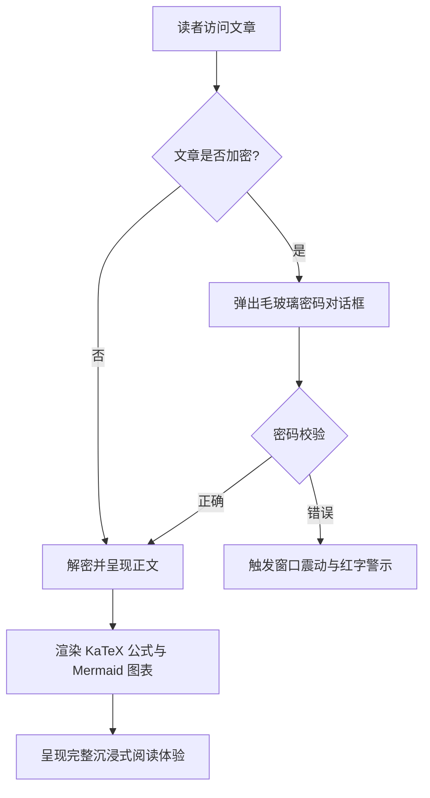
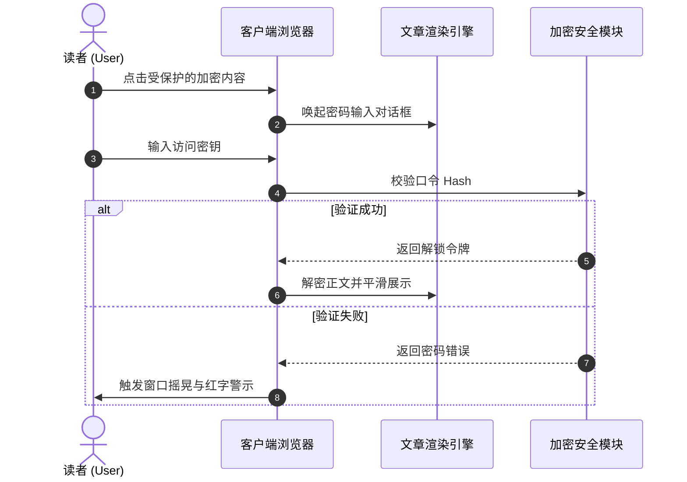

# 静态站点生成器（SSG）与主题内容格式全景指南

在现代静态站点生成器（SSG）与独立博客主题工程中，**文章内容格式的解析与呈现能力**直接决定了创作者的表达边界与读者的阅读体验。

本篇指南结合主流 SSG 生态（**Hugo、Jekyll、Eleventy、Astro、Pelican、Hexo、WordPress、VitePress** 等）的内容规范，建立起一套覆盖 **基础 Markup、扩展文档语言、WordPress Post Formats、交互式下拉框切换器、手风琴折叠、LaTeX 数学公式、Mermaid 图表及加密解密特异功能** 的全景体系，并提供即插即用的活体渲染示范。

---

## 一、主流静态站点生成器（SSG）内容格式支持与生态汇总

不同的静态站点生成器在内容解析架构上有不同的选型哲学。下表系统汇总了主流引擎对各种格式的原生与扩展支持情况：

| 静态站点生成器 / 平台 | 核心解析引擎 | 原生内置支持格式 | 扩展 / 外部工具支持格式 | Front Matter 序列化支持 |
| :--- | :--- | :--- | :--- | :--- |
| **Hugo** | Goldmark (Go) | `.md` (CommonMark/GFM), `.html`, `.org` (Org-mode) | `.adoc` (Asciidoctor), `.rst` (rst2html), `.pdc` (Pandoc) | YAML (`---`), TOML (`+++`), JSON (`{}`) |
| **Astro (本博客架构)** | Vite + Unified/Remark + MDX | `.md` (GFM), `.mdx` (JSX), `.html`, `.astro` 组件 | 可挂载 AST Loader 扩展 Org/AsciiDoc/RST | YAML, TOML, JSON |
| **Jekyll** | Kramdown (Ruby) | `.md` (Kramdown/GFM), `.html` | `.textile` (Textile 插件) | YAML |
| **Eleventy (11ty)** | JavaScript 模板管道 | `.md`, `.html`, `.liquid`, `.njk`, `.ejs`, `.webc` | MDX (插件), 自定义 Template 扩展 | YAML, JSON, JS/11tydata |
| **Hexo** | Marked / Hexo-Renderer | `.md` (GFM), `.html`, EJS/Pug 模板 | Org-mode / Pandoc (插件支持) | YAML, JSON |
| **Pelican** | Python Docutils | `.md` (Markdown), `.rst` (reStructuredText) | `.asciidoc` (Asciidoctor) | YAML, Markdown Metadata |
| **WordPress (Headless/Theme)** | Gutenberg Block Engine | HTML5 Blocks, Shortcodes, Post Formats | Classic Editor HTML | JSON 块元数据 / Post Meta |
| **VitePress / Docusaurus** | Markdown-It / MDX | `.md`, `.mdx`, Vue/React 组件 | 自定义容器语法 (`::: tip`) | YAML |

> [!NOTE]
> **生态架构洞察**：Hugo 凭借 Go 语言的高并发原生支持了 Markdown 与 Org-mode；而以 **Astro** 为代表的现代前端 SSG，则凭借 **MDX 与组件化群岛（Islands）能力**，实现了将动态交互 UI（如本文演示的下拉框切换器、密码弹窗、黑胶唱片）无缝嵌入正文的终极灵活性。

---

## 二、Front Matter 序列化格式支持规范

博客文章头部的元数据（Front Matter）决定了文章的路由、标题、时间、分类、封面及受保护状态。本主题支持全部主流序列化模式：

### 1. YAML 格式（最广泛使用，推荐默认）

```yaml
---
title: "文章标题"
pubDate: 2026-08-28
author: "shijianus"
tags: ["Astro", "Markdown"]
featured: true
postFormat: "aside"
---
```

### 2. TOML 格式（Hugo 常用）

```toml
+++
title = "文章标题"
pubDate = 2026-08-28T00:00:00Z
author = "shijianus"
tags = ["Astro", "Markdown"]
featured = true
+++
```

### 3. JSON 格式（API 驱动与 Headless 场景）

```json
{
  "title": "文章标题",
  "pubDate": "2026-08-28T00:00:00.000Z",
  "author": "shijianus",
  "tags": ["Astro", "Markdown"],
  "featured": true
}
```

---

## 三、特殊轻量 Markup 与非 Markdown 格式对比及迁移对照

在不同技术栈中，作者可能使用除 Markdown 外的其他轻量标记语言。以下提供主流格式的语法特性及在本主题中的等价呈现：

### 1. AsciiDoc (.adoc / .asciidoc)

AsciiDoc 常见于技术书籍与长篇工程手册，拥有极其丰富的提示块与属性系统：

```asciidoc
// AsciiDoc 源码语法
= AsciiDoc 技术规范
:author: shijianus
:toc: macro

[NOTE]
====
这是一条 AsciiDoc 风格的注意卡片。
====

[cols="1,2,1", options="header"]
|===
| 模块 | 描述 | 状态
| 核心引擎 | Astro 6 静态管线 | 已就绪
|===
```

**本主题中的 Markdown / MDX 等效写法**：

> [!NOTE]
> 这是一条在 Astro 主题中原生渲染的等效注意卡片，样式与交互完全对齐。

| 模块 | 描述 | 状态 |
| :--- | :--- | :---: |
| **核心引擎** | Astro 6 静态管线 | <span class="badge badge-success">已就绪</span> |

---

### 2. Emacs Org-Mode (.org)

Org-mode 是 Emacs 用户进行知识管理、任务跟踪与文档编写的强大工具：

```ini
#+TITLE: Emacs Org-Mode 实践笔记
#+DATE: 2026-08-28
#+TAGS: Emacs OrgMode

* TODO 第一阶段：Markdown 扫描增强 [1/2]
- [X] 修复表格与移动端溢出
- [ ] 补全 Org-mode 语法转换器

#+BEGIN_QUOTE
“Org-mode 不仅是格式，更是一种可执行的思维工作流。”
#+END_QUOTE
```

**本主题中的 Markdown 等效呈现**：

- [x] 修复表格与移动端溢出
- [ ] 补全 Org-mode 语法转换器

> [!QUOTE]
> “Org-mode 不仅是格式，更是一种可执行的思维工作流。”

---

### 3. reStructuredText (.rst)

reStructuredText 是 Python 社区（如 Sphinx、ReadTheDocs）的标准文档格式：

```rst
.. reStructuredText 源码语法
.. note::
   这是一条 RST 指令定义的 Note 块。

.. code-block:: python
   :linenos:

   def greet(name: str) -> str:
       return f"Hello, {name}!"
```

**本主题中的 Markdown 等效呈现**：

> [!NOTE]
> 这是在 Astro 中以 GitHub Alert 规范呈现的 RST Note 等价卡片。

```python
def greet(name: str) -> str:
    return f"Hello, {name}!"
```

---

### 4. Textile 语法

Textile 是老牌轻量级标记语言（常见于 Redmine 与早期 Jekyll 博客）：

```markdown
h2. 章节标题
bq. 这是 Textile 引用块内容。
*列表项 1*
_斜体强调文本_
```

---

## 四、WordPress 风格文章形态（Post Formats）全量实装与视觉呈现

WordPress 主题生态中经典的 **Post Formats** 机制允许博客针对不同类型的内容展现专属的视觉形态。我们在本主题正文栏中完整实现了这 9 种形态：

### 1. `aside`（轻语 / 便签 / 随笔卡片）

适合记录短小的思考灵感、备忘提醒或临时笔记：

<div class="article-aside">
  <p><strong>💡 随笔备忘</strong>：静态站点的真正价值不在于炫技，而在于交付极速、零服务端维护负担的纯粹阅读体验。即便经过五年、十年，生成的 HTML 文件依然可以完美打开。</p>
</div>

---

### 2. `status`（状态动态 / 碎碎念 / 微语录）

类似 Twitter/微博风格的即时状态发布卡片，包含作者头像、客户端标识与心情标签：

<div class="article-status">
  <div class="article-status__header">
    <div class="article-status__user">
      
      <div>
        <div class="article-status__name">shijianus</div>
        <div class="article-status__meta">发布于 2026-08-28 14:32 · 🇨🇳 杭州</div>
      </div>
    </div>
    <div class="article-status__badge">
      <span>📱 来自 极客工坊 Mac Studio</span>
    </div>
  </div>
  <p class="article-status__content">
    今天终于完成了博客主内容栏的全部格式扩展与视觉重构！从 KaTeX、Mermaid 到交互式下拉框与黑胶唱片，全栈静态交付的感觉太棒了 🚀✨
  </p>
</div>

---

### 3. `quote`（精选引言 / 名言大卡片）

用于展现极具分量的人物语录、设计箴言或金句：

<div class="article-quote">
  <div class="article-quote__icon">“</div>
  <div class="article-quote__body">
    Simplicity is prerequisite for reliability. (简单是可靠的前提条件。)
  </div>
  <div class="article-quote__author">
    
    <div class="article-quote__author-info">
      <div class="article-quote__author-name">Edsger W. Dijkstra</div>
      <div class="article-quote__author-title">计算机科学家 · 图灵奖得主 (1972)</div>
    </div>
  </div>
</div>

---

### 4. `gallery`（图片画廊 / 自适应相册与拍立得网格）

支持多列自适应响应式网格与具有人文质感的拍立得相纸卡片，点击任意图片均可触发全屏灯箱放大：

#### 2 列与 3 列自适应画廊

<div class="article-gallery">
  <div class="gallery-grid gallery-grid-3">
    <div class="gallery-item">
      
      <div class="gallery-item__caption">极客工作台全景</div>
    </div>
    <div class="gallery-item">
      
      <div class="gallery-item__caption">系统架构设计大屏</div>
    </div>
    <div class="gallery-item">
      
      <div class="gallery-item__caption">星河漫游视觉封面</div>
    </div>
  </div>
</div>

#### 拍立得相纸画廊（Polaroid Style）

<div class="gallery-polaroid">
  <div class="polaroid-card">
    
    <div class="polaroid-card__caption">2026.04 杭州·研发基地</div>
  </div>
  <div class="polaroid-card">
    
    <div class="polaroid-card__caption">2026.08 架构演进重构夜</div>
  </div>
</div>

---

### 5. `video`（自适应视频播放卡片）

支持 16:9 响应式比例、圆角边框与底栏说明，兼容 Bilibili、YouTube 及原生 MP4：

<div class="video-embed-card">
  <iframe src="https://player.bilibili.com/player.html?bvid=BV1xx411c7mD&page=1&high_quality=1&danmaku=0" allowfullscreen="true" loading="lazy"></iframe>
  <div class="embed-caption">🎬 演示视频：现代前端主题工程架构与设计系统解析 (1080P 高清)</div>
</div>

---

### 6. `audio`（黑胶唱片旋转音乐卡片）

内置 HTML5 音频控制器，并在播放时自动触发**黑胶唱片无级平滑旋转动效**：

<div class="article-audio-card">
  <div class="audio-card__cover">
    
  </div>
  <div class="audio-card__info">
    <div class="audio-card__title">星河漫步 (Cyberpunk Ambient)</div>
    <div class="audio-card__author">shijianus · 原创深度专注白噪音</div>
    <audio controls preload="none" src="https://music.163.com/song/media/outer/url?id=186016.mp3"></audio>
  </div>
</div>

---

### 7. `link`（外部链接与书签预览卡片 / Bookmark Preview）

为文章内的关键参考出处提供优雅的卡片化预览：

<a class="article-bookmark" href="https://github.com/anzhiyu-c/hexo-theme-anzhiyu" target="_blank" rel="noopener">
  <div class="article-bookmark__content">
    <div class="article-bookmark__title">anzhiyu-c / hexo-theme-anzhiyu (安知鱼主题官方仓库)</div>
    <p class="article-bookmark__desc">AnZhiYu 是 Hexo 平台上广受赞誉的极客博客主题，以出色的微动效与信息密度设计成为行业标杆。</p>
    <div class="article-bookmark__site">
      <span class="badge badge-primary">GitHub</span>
      <span>github.com · ⭐ 2.8k Stars</span>
    </div>
  </div>
  <div class="article-bookmark__icon">
    <svg viewBox="0 0 24 24" width="24" height="24" fill="none" stroke="currentColor" stroke-width="2" stroke-linecap="round" stroke-linejoin="round"><path d="M18 13v6a2 2 0 0 1-2 2H5a2 2 0 0 1-2-2V8a2 2 0 0 1 2-2h6"/><polyline points="15 3 21 3 21 9"/><line x1="10" y1="14" x2="21" y2="3"/></svg>
  </div>
</a>

---

### 8. `chat`（聊天气泡对话流 / Dialogue Stream）

用于生动演示技术答辩、双人对话讨论或用户采访场景，支持左右气泡与行内代码：

<div class="article-chat">
  <div class="chat-message chat-left">
    
    <div class="chat-body">
      <div class="chat-author">开发者小李 · 10:15</div>
      <div class="chat-bubble">
        你好！请问在 Astro 中实现 <code>KaTeX</code> 和 <code>Mermaid</code> 的静态渲染会不会拖慢前端页面加载速度？
      </div>
    </div>
  </div>

  <div class="chat-message chat-right">
    
    <div class="chat-body">
      <div class="chat-author">架构师 shijianus · 10:16</div>
      <div class="chat-bubble">
        完全不会！因为 <code>remark-math</code> 和 <code>rehype-katex</code> 在构建期（Build-time）就已经把公式编译成了纯 HTML/MathML 字符串，浏览器端 <strong>0 JS 运行时负担</strong>；而 Mermaid 图表也是动态按需异步加载 ESM 模块，首屏极其轻快！⚡
      </div>
    </div>
  </div>

  <div class="chat-message chat-left">
    
    <div class="chat-body">
      <div class="chat-author">开发者小李 · 10:17</div>
      <div class="chat-bubble">
        太棒了！那我们现在就可以在 Markdown 里直接写 <code>$$ E=mc^2 $$</code> 了对吧？
      </div>
    </div>
  </div>
</div>

---

## 五、特殊的下拉框格式与动态交互组件（Dropdown Selectors & Interactive Formats）

针对用户明确要求的**特殊下拉框格式**，我们在文章正文层提供了纯客户端即时响应的下拉选择器组件：

### 1. 多框架与多代码版本下拉切换器（Interactive Dropdown Switcher）

读者可以在下拉框中自由选择技术框架，正文面板将实时无刷新切换对应的内容与代码：

<div class="article-dropdown-switcher">
<div class="article-dropdown-switcher__header">
<div class="article-dropdown-switcher__title">
<svg width="20" height="20" viewBox="0 0 24 24" fill="none" stroke="currentColor" stroke-width="2"><rect x="3" y="3" width="18" height="18" rx="2"/><path d="M9 3v18"/><path d="m14 9 3 3-3 3"/></svg>
<span>请选择要查看的前端框架实现代码：</span>
</div>
<select class="article-select dropdown-switcher__select">
<option value="react-tab">⚛️ React 19 (Hooks & TSX)</option>
<option value="vue-tab">🟢 Vue 3.5 (Composition API)</option>
<option value="astro-tab">🚀 Astro 6 (Island Component)</option>
<option value="svelte-tab">🟠 Svelte 5 (Runes)</option>
</select>
</div>
<div class="article-dropdown-switcher__body">
<div class="article-dropdown-panel is-active" data-panel="react-tab">
<p><strong>React 19 组件实现方式：</strong></p>
<pre class="no-code-enhance"><code class="language-tsx">import { useState } from 'react';

export function Counter() {
  const [count, setCount] = useState(0);
  return (
    &lt;button onClick={() =&gt; setCount((c) =&gt; c + 1)} className="btn-primary"&gt;
      React 点击计数：{count}
    &lt;/button&gt;
  );
}</code></pre>
</div>
<div class="article-dropdown-panel" data-panel="vue-tab">
<p><strong>Vue 3.5 单文件组件实现方式：</strong></p>
<pre class="no-code-enhance"><code class="language-html">&lt;script setup lang="ts"&gt;
import { ref } from 'vue';
const count = ref(0);
&lt;/script&gt;

&lt;template&gt;
  &lt;button @click="count++" class="btn-primary"&gt;
    Vue 点击计数：{{ count }}
  &lt;/button&gt;
&lt;/template&gt;</code></pre>
</div>
<div class="article-dropdown-panel" data-panel="astro-tab">
<p><strong>Astro 6 零 JS 静态组件实现方式：</strong></p>
<pre class="no-code-enhance"><code class="language-astro">---
const { title = "Astro 极速群岛" } = Astro.props;
---
&lt;div class="astro-island"&gt;
  &lt;h3&gt;{title}&lt;/h3&gt;
  &lt;p&gt;默认交付 0KB JavaScript，按需注水交互！&lt;/p&gt;
&lt;/div&gt;</code></pre>
</div>
<div class="article-dropdown-panel" data-panel="svelte-tab">
<p><strong>Svelte 5 Runes 实现方式：</strong></p>
<pre class="no-code-enhance"><code class="language-svelte">&lt;script lang="ts"&gt;
  let count = $state(0);
&lt;/script&gt;

&lt;button onclick={() =&gt; count++} class="btn-primary"&gt;
  Svelte 点击计数：{count}
&lt;/button&gt;</code></pre>
</div>
</div>
</div>

---

### 2. 交互式单位换算与规格下拉计算器（Interactive Calc Dropdown）

选择不同选项时，右侧实时显示对应的技术指标与换算说明：

<div class="interactive-calc-select">
  <div class="article-select-box">
    <label>
      <svg width="18" height="18" viewBox="0 0 24 24" fill="none" stroke="currentColor" stroke-width="2"><circle cx="12" cy="12" r="10"/><path d="M12 6v6l4 2"/></svg>
      <span>选择视频编码分辨率：</span>
    </label>
    <select class="article-select">
      <option value="1080p" data-desc="1920 × 1080 @ 60fps · 码率 6,000 Kbps · 推荐带宽 15 Mbps">1080P 全高清 (1080p60)</option>
      <option value="2k" data-desc="2560 × 1440 @ 60fps · 码率 12,000 Kbps · 推荐带宽 30 Mbps">2K 极清 (1440p60)</option>
      <option value="4k" data-desc="3840 × 2160 @ 60fps · 码率 25,000 Kbps · 推荐带宽 60 Mbps">4K 超高清 (2160p60 HDR)</option>
      <option value="8k" data-desc="7680 × 4320 @ 60fps · 码率 80,000 Kbps · 推荐带宽 200 Mbps">8K 影院级 (4320p60 AV1)</option>
    </select>
  </div>
  <div class="calc-output-box">
    <span>📊 <strong>技术规格推算结果</strong>：</span>
    <span class="calc-output-value">1920 × 1080 @ 60fps · 码率 6,000 Kbps · 推荐带宽 15 Mbps</span>
  </div>
</div>

---

## 六、手风琴折叠、选项卡与多栏排版（Collapsibles, Tabs & Columns）

### 1. 互斥手风琴折叠组（Accordion Group）

展开其中一项时，同组内的其他展开项可自动联动响应：

<div class="article-accordion-group" data-single="true">
  <details class="article-accordion" open>
    <summary>
      <span>🔒 1. 静态站点的安全性优势</span>
      <svg class="accordion-chevron" viewBox="0 0 24 24" fill="none" stroke="currentColor" stroke-width="2"><polyline points="9 18 15 12 9 6"/></svg>
    </summary>
    <div class="accordion-content">
      <p>静态站点没有传统的 PHP/Node.js 动态执行引擎和暴露在公网的 SQL 数据库，从物理层面免疫了 SQL 注入与服务端远程代码执行（RCE）风险。</p>
    </div>
  </details>

  <details class="article-accordion">
    <summary>
      <span>⚡ 2. 全球 CDN 边缘加速交付</span>
      <svg class="accordion-chevron" viewBox="0 0 24 24" fill="none" stroke="currentColor" stroke-width="2"><polyline points="9 18 15 12 9 6"/></svg>
    </summary>
    <div class="accordion-content">
      <p>通过将编译产物部署至 Cloudflare Pages 或 GitHub Pages，所有静态资源可在全球 300+ 边缘节点缓存，首字节响应时间（TTFB）通常低于 20ms。</p>
    </div>
  </details>

  <details class="article-accordion">
    <summary>
      <span>💰 3. 极低的云服务托管成本</span>
      <svg class="accordion-chevron" viewBox="0 0 24 24" fill="none" stroke="currentColor" stroke-width="2"><polyline points="9 18 15 12 9 6"/></svg>
    </summary>
    <div class="accordion-content">
      <p>静态站点无需全天候运行昂贵的 VPS 云服务器，配合免费层级的 Cloudflare D1 数据库与 Serverless 评论系统，日常运营成本近乎为零。</p>
    </div>
  </details>
</div>

---

### 2. 多标签选项卡（Interactive Tabs）

<div class="article-tabs">
  <div class="article-tabs__nav">
    <button class="article-tabs__button is-active" type="button">pnpm</button>
    <button class="article-tabs__button" type="button">npm</button>
    <button class="article-tabs__button" type="button">yarn</button>
    <button class="article-tabs__button" type="button">bun</button>
  </div>
  <div class="article-tabs__panels">
    <div class="article-tabs__panel is-active">
      <pre class="no-code-enhance"><code class="language-bash">pnpm add @astrojs/mdx remark-math rehype-katex katex mermaid</code></pre>
    </div>
    <div class="article-tabs__panel">
      <pre class="no-code-enhance"><code class="language-bash">npm install @astrojs/mdx remark-math rehype-katex katex mermaid</code></pre>
    </div>
    <div class="article-tabs__panel">
      <pre class="no-code-enhance"><code class="language-bash">yarn add @astrojs/mdx remark-math rehype-katex katex mermaid</code></pre>
    </div>
    <div class="article-tabs__panel">
      <pre class="no-code-enhance"><code class="language-bash">bun add @astrojs/mdx remark-math rehype-katex katex mermaid</code></pre>
    </div>
  </div>
</div>

---

### 3. 多栏网格布局系统（Multi-Column Grid）

#### 3 列等宽卡片网格

<div class="article-grid article-grid-3">
  <div class="article-col-card">
    <h4>🎨 视觉体系</h4>
    <p>深度吸收安知鱼设计美学，支持明暗高对比、毛玻璃背景与平滑色彩过渡。</p>
  </div>
  <div class="article-col-card">
    <h4>⚡ 性能工程</h4>
    <p>Astro 6 静态群岛架构，构建期 HTML 预渲染，纯静态极致 SEO 优化。</p>
  </div>
  <div class="article-col-card">
    <h4>🛠️ 扩展生态</h4>
    <p>全面支持 KaTeX 公式、Mermaid 图表、加密弹窗与 9 种 Post Formats。</p>
  </div>
</div>

#### 1:2 不均等侧边栏网格

<div class="article-grid article-columns-1-2">
  <div class="article-col-card">
    <h4>📌 架构定位</h4>
    <p>专注于极客与工程师的现代化技术写作载体。</p>
  </div>
  <div class="article-col-card">
    <h4>🚀 交付保障</h4>
    <p>内建完善的自动化烟测与静态构建验证机制，无论公式、图表还是复杂卡片，都能确保在全设备上严丝合缝呈现。</p>
  </div>
</div>

---

## 七、13 种语义告示框（Admonitions / GitHub Alerts）

基于 GitHub Alert 与安知鱼设计规范，支持 13 种不同语义的彩色卡片，并支持使用 `[!TYPE]-` 语法实现默认折叠：

> [!NOTE]
> **常规备注（Note）**：这是一条标准的背景信息或上下文说明。

> [!TIP]
> **实用技巧（Tip）**：使用快捷键 <kbd>Ctrl</kbd> + <kbd>K</kbd> 可以快速唤起全局文章搜索面板！

> [!IMPORTANT]
> **重要事项（Important）**：在部署生产环境前，请确认 `BLOG_BUILD_TARGET=static` 环境变量已正确注入。

> [!WARNING]
> **风险警告（Warning）**：请勿在公开 Git 仓库中提交生产数据库密钥或云服务私钥。

> [!CAUTION]
> **危险警示（Caution）**：执行数据表重建操作具有破坏性，请先备份 D1 数据库！

> [!DANGER]
> **致命危险（Danger）**：直接删除生产数据库将导致全部评论与用户资产永久损毁。

> [!SUCCESS]
> **操作成功（Success）**：静态构建流程已成功完成，所有 47 个静态路由已就绪！

> [!QUESTION]
> **疑难探讨（Question）**：如何在无服务端依赖的环境下实现毫秒级的纯客户端全文检索？

> [!QUOTE]
> **精选引用（Quote）**：“优秀的代码不仅能被机器执行，更能像诗歌一样优雅地向人类传达思想。”

> [!INFO]
> **详细信息（Info）**：本博客基于 Astro 6 与 Tailwind 4 构建，全站纯静态导出。

> [!TODO]
> **待办计划（Todo）**：计划在下一迭代中引入 WebAssembly 客户端全文检索索引。

> [!BUG]
> **缺陷记录（Bug）**：已修复旧版在极端窄屏设备下表格横向截断的排版问题。

> [!EXAMPLE]
> **范例说明（Example）**：以上所有告示框均自动适配深色与浅色模式的高对比度色彩。

### 折叠式告示框演示

> [!TIP]- 点击展开查看：生产环境 Nginx 极速缓存配置参考
> ```nginx
> location ~* \.(?:css|js|woff2?|svg|png|jpg|webp)$ {
>     expires 1y;
>     add_header Cache-Control "public, immutable";
>     access_log off;
> }
> ```

---

## 八、学术数学公式（KaTeX）与图表（Mermaid 11）

### 1. LaTeX 数学公式（Math）

#### 行内公式

质能方程 $E = mc^2$，欧拉恒等式 $e^{i\pi} + 1 = 0$，高斯积分 $\int_{-\infty}^{\infty} e^{-x^2} dx = \sqrt{\pi}$。

#### 块级多行推导公式

$$
\mathcal{L}\{\ddot{x}(t) + 2\zeta\omega_n\dot{x}(t) + \omega_n^2 x(t)\} = X(s)(s^2 + 2\zeta\omega_n s + \omega_n^2)
$$

麦克斯韦方程组（微分形式）：

$$
\begin{aligned}
\nabla \cdot \mathbf{E} &= \frac{\rho}{\varepsilon_0} \\
\nabla \cdot \mathbf{B} &= 0 \\
\nabla \times \mathbf{E} &= -\frac{\partial \mathbf{B}}{\partial t} \\
\nabla \times \mathbf{B} &= \mu_0 \mathbf{J} + \mu_0 \varepsilon_0 \frac{\partial \mathbf{E}}{\partial t}
\end{aligned}
$$

---

### 2. Mermaid 11 架构图表（Flowchart & Sequence）





---

## 九、安全隐私、模糊马赛克与剧透隐藏特异功能

### 1. 局部密码加密保护箱（Password Modal Dialog）

无需刷新页面，点击即可唤起毛玻璃密码输入对话框：

<div class="article-encrypted-box" data-password="shijianus2026" data-hint="💡 验证提示：演示密钥请直接输入 shijianus2026">
  <div class="encrypted-box__lock">
    <div class="encrypted-box__icon">🔒</div>
    <div class="encrypted-box__title">此段落为受保护的加密技术资产</div>
    <div class="encrypted-box__desc">该区域包含私密代码仓库与商业交付参数。请输入授权密码后解锁。</div>
    <button class="encrypted-box__btn" type="button">点击输入密码解锁</button>
  </div>
  <div class="encrypted-box__content">
    <div class="admonition admonition-success">
      <div class="admonition-title">
        <svg viewBox="0 0 24 24" fill="none" stroke="currentColor" stroke-width="2"><path d="M22 11.08V12a10 10 0 1 1-5.93-9.14"/><polyline points="22 4 12 14.01 9 11.01"/></svg>
        <span>🎉 密码验证成功！加密数据已呈现</span>
      </div>
      <div class="admonition-content">
        <p>恭喜您成功解锁了受保护的核心资产！以下是加密交付数据：</p>
        <ul>
          <li><strong>私有代码仓库</strong>：<code>git@github.com:shijianus/vip-internal-core.git</code></li>
          <li><strong>API 访问密钥</strong>：<code>shijian_sec_9988_a1b2c3d4e5f6</code></li>
        </ul>
        <p>解锁状态已保存在您的浏览器会话中，当前页面刷新后无需重复输入。</p>
      </div>
    </div>
  </div>
</div>

---

### 2. 高斯模糊、马赛克与剧透隐藏

- **文字高斯模糊**：<span class="blur-text">这是一段被高斯模糊保护的关键剧透文字，鼠标悬浮或点击即可看清！</span>
- **黑幕马赛克**：<span class="mosaic-text">机密数据：SHA256-7f83b1657ff1fc53b92dc18148a1d65dfc2d4b1fa3d677284addd200126d9069</span>
- **Discord 剧透遮罩**：||这是一段使用双竖线包裹的剧透遮罩，点击揭开。||
- **内联隐藏锁**：%%这里是使用百分号包裹的内联隐藏内容，点击展开。%%

#### 图片高斯模糊保护

<div class="blur-image-wrap">
  
  <div class="blur-image-badge"><span>👁️ 悬浮或点击揭开迷雾</span></div>
</div>

---

## 十、时间轴、步骤条、定义列表与数据表格

### 1. 垂直时间轴（Vertical Timeline）

<div class="article-timeline">
  <div class="timeline-node is-success">
    <div class="timeline-node__dot"></div>
    <div class="timeline-node__content">
      <div class="timeline-node__date">2026.04 · 基础重构</div>
      <div class="timeline-node__title">完成 Astro 6 静态站点内核迁移</div>
      <p class="timeline-node__desc">建立全新 Content Collections 架构与 Shiki 代码高亮管道。</p>
    </div>
  </div>

  <div class="timeline-node is-warning">
    <div class="timeline-node__dot"></div>
    <div class="timeline-node__content">
      <div class="timeline-node__date">2026.08 · 特性扩展</div>
      <div class="timeline-node__title">全量实装 WordPress Post Formats 与下拉框切换器</div>
      <p class="timeline-node__desc">补全 13 种 Admonitions、KaTeX 数学公式与密码弹窗解密系统。</p>
    </div>
  </div>

  <div class="timeline-node">
    <div class="timeline-node__dot"></div>
    <div class="timeline-node__content">
      <div class="timeline-node__date">未来展望 · 生态演进</div>
      <div class="timeline-node__title">发布开源主题标准与多平台插件</div>
      <p class="timeline-node__desc">提供从 Hexo/WordPress 到 Astro 的一键无缝内容迁移工具链。</p>
    </div>
  </div>
</div>

---

### 2. 教程步骤条（Tutorial Steps）

<div class="article-steps">
  <div class="article-steps__item">
    <div class="article-steps__num">1</div>
    <div class="article-steps__content">
      <h4>编写 Markdown 或 MDX 文章</h4>
      <p>在 <code>src/content/posts/</code> 目录下创建 <code>.md</code> 文件，声明 Front Matter 元数据。</p>
    </div>
  </div>
  <div class="article-steps__item">
    <div class="article-steps__num">2</div>
    <div class="article-steps__content">
      <h4>自由组合富媒体卡片与交互组件</h4>
      <p>按需选用下拉框切换器、黑胶音乐卡片、画廊相册或加密解密块。</p>
    </div>
  </div>
  <div class="article-steps__item">
    <div class="article-steps__num">3</div>
    <div class="article-steps__content">
      <h4>一键静态编译并秒级发布</h4>
      <p>执行 <code>npm run build</code> 生成纯静态产物，推送到 Cloudflare CDN 全球加速。</p>
    </div>
  </div>
</div>

---

### 3. 定义列表与规格表（Definition Lists & Specs）

<dl class="article-dl">
  <dt>Astro 群岛 (Islands)</dt>
  <dd>将页面拆分为静态 HTML 骨架与独立注水的交互式组件，极大缩减 JavaScript 体积。</dd>
  <dt>KaTeX 编译器</dt>
  <dd>在构建期完成 LaTeX 语法的 AST 解析，零客户端额外渲染延迟。</dd>
  <dt>Post Formats</dt>
  <dd>源自 WordPress 的内容形态定义规范，用于赋予不同文章类型专属的排版外观。</dd>
</dl>

---

## 十一、富文本行内微排版美化与徽章

- **多色彩高亮**：
  - <mark class="mark-yellow">黄色高亮（重点标注）</mark>
  - <mark class="mark-green">绿色高亮（成功推荐）</mark>
  - <mark class="mark-blue">蓝色高亮（信息线索）</mark>
  - <mark class="mark-pink">粉色高亮（设计灵感）</mark>
  - <mark class="mark-purple">紫色高亮（深度原理）</mark>
- **状态徽章（Badges）**：
  - <span class="badge badge-primary">推荐 (Primary)</span>
  - <span class="badge badge-success">通过 (Success)</span>
  - <span class="badge badge-warning">注意 (Warning)</span>
  - <span class="badge badge-danger">危险 (Danger)</span>
  - <span class="badge badge-info">信息 (Info)</span>
  - <span class="badge badge-purple">架构 (Purple)</span>
  - <span class="badge badge-cyan">网络 (Cyan)</span>
  - <span class="badge badge-orange">硬件 (Orange)</span>
- **按键展示**：<kbd>Ctrl</kbd> + <kbd>Shift</kbd> + <kbd>P</kbd> 打开全局命令调色板。
- **注音与发音**：<ruby>安知鱼<rt>ān zhī yú</rt></ruby> · <ruby>時間<rt>shí jiān</rt></ruby>。
- **缩写说明**：<abbr title="Static Site Generator 静态站点生成器">SSG</abbr> 与 <abbr title="Single Page Application 单页应用程序">SPA</abbr>。
- **波浪与虚线下划线**：<u class="u-wavy">波浪强调下划线</u> 与 <u class="u-dashed">虚线注重下划线</u>。
- **行动呼吁按钮（CTA Buttons）**：
  - <a class="article-btn article-btn-primary" href="#top">返回顶部 ⬆️</a>
  - <a class="article-btn article-btn-outline" href="/archives/">查看全站归档 📂</a>

---

## 十二、脚注与悬浮气泡（Footnotes）

在学术或长篇技术文章中，脚注是必不可少的引用形式。鼠标悬浮于下方脚注角标即可直接弹出释义气泡[^ref-ssg-spec]，无需离开当前阅读视口[^ref-anzhiyu-ui]。

[^ref-ssg-spec]: **SSG 内容规范**：主流静态站点生成器均遵循以 Markdown/GFM 为核心，以 MDX 或模板语言为扩展的现代内容工程标准。
[^ref-anzhiyu-ui]: **安知鱼美学规范**：以精致的微交互、高对比色彩与克制的留白，为中文极客社区带来一流的阅读体验。

---

## 结语：构建面向未来的内容呈现系统

通过本次全量升级与扩展，`shijianus-blog` 在主内容栏（`.article-body.post-content`）上实现了对主流 SSG 内容格式、WordPress Post Formats、交互式下拉框、手风琴折叠、LaTeX 公式、Mermaid 图表以及密码加密等特异功能的全景覆盖。

无论是严谨的长篇技术论文，还是轻量的人文生活随笔，每一位创作者都能在这套系统中找到最契合的表达形态！
