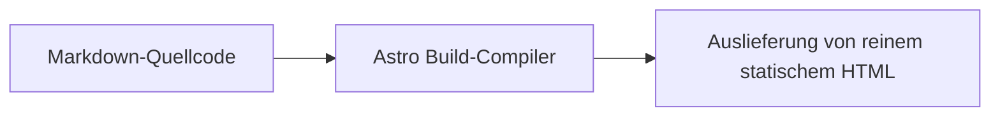

Dieser Artikel ist ein **umfassender Abnahmetest und ein vollständiger Belastungstest-Demonstrationsartikel (All-in-one Master Showcase)**, der zum schnellen automatisierten Testen aller Formate und speziellen Funktionen im Haupttextbereich dient.

---

## 1. Hinweisboxen (Callouts)

> [!TIP]
> **Tipp**: Verwenden Sie die Tastenkombination <kbd>Ctrl</kbd> + <kbd>K</kbd>, um die Suche aufzurufen.

> [!WARNING]
> **Warnung**: Bitte bewahren Sie Ihren privaten Schlüssel sicher auf.

---

## 2. Dropdowns und Akkordeons

Framework auswählen:

<select class="article-select dropdown-switcher__select">
<option value="react-tab">⚛️ React 19</option>
<option value="vue-tab">🟢 Vue 3.5</option>
</select>

React 19 Komponenten-Code wurde geladen.

Vue 3.5 Single-File-Komponenten-Code wurde geladen.

  

    💡 Zum Aufklappen klicken: Erläuterung zur Leistungsoptimierung
    <svg class="accordion-chevron" viewBox="0 0 24 24" fill="none" stroke="currentColor" stroke-width="2"><polyline points="9 18 15 12 9 6"/></svg>
  

  

    
Astro verwendet die Islands-Architektur und liefert standardmäßig 0KB JS aus.

  

---

## 3. Mathematische Formeln und Mermaid-Diagramme (Math & Mermaid)

Inline-Formel: $E = mc^2$, Gauß-Integral: $\int_{-\infty}^{\infty} e^{-x^2} dx = \sqrt{\pi}$.

Maxwell-Gleichungen als Block:

$$
\nabla \cdot \mathbf{E} = \frac{\rho}{\varepsilon_0}, \quad \nabla \times \mathbf{B} = \mu_0 \mathbf{J} + \mu_0 \varepsilon_0 \frac{\partial \mathbf{E}}{\partial t}
$$

---

## 4. Sichere Passwortentschlüsselung und Gaußsche Unschärfe

  

    
🔒

    
Geschütztes verschlüsseltes Asset

    
Bitte geben Sie das Autorisierungspasswort ein, um es zu entsperren.

    <button class="encrypted-box__btn" type="button">Zum Entsperren Passwort eingeben</button>
  

  

    

      
🎉 Entschlüsselung erfolgreich

      

        
Privater Token: <code>shijian_sec_9988_a1b2c3d4e5f6</code>

      

    

  

- Gaußsche Unschärfe Text: Fahren Sie mit der Maus darüber, um den Spoiler-Inhalt zu sehen!
- Blackout-Mosaik: Vertrauliche Daten: SHA256-7f83b1657ff1fc53
- Discord Spoiler: ||Doppelter vertikaler Strich Spoiler-Maske||
- Inline-Sperre: %%Inhalt mit Prozentzeichen versteckt%%

---

## 5. Post-Formate (Notiz, Status, Audio und Galerie)

  
<strong>💡 Notiz</strong>: Bleiben Sie fokussiert, liefern Sie kontinuierlich reinen Wert.

  

    
  

  

    
Sternenwanderung

    
shijianus · Originales, konzentrationsförderndes weißes Rauschen

    <audio controls preload="none" src="https://music.163.com/song/media/outer/url?id=186016.mp3"></audio>
  

