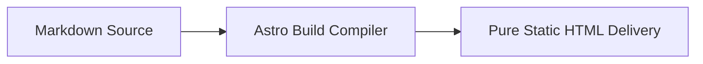

This article serves as an **All-in-one Master Showcase** for comprehensive acceptance testing and full-scale stress testing, designed to quickly and automatically verify all formats and unique features within the main content area.

---

## 1. Callouts

> [!TIP]
> **Tip**: Use the shortcut <kbd>Ctrl</kbd> + <kbd>K</kbd> to open search.

> [!WARNING]
> **Warning**: Please keep your private key secure.

---

## 2. Dropdowns & Accordions

Select Framework:

<select class="article-select dropdown-switcher__select">
<option value="react-tab">⚛️ React 19</option>
<option value="vue-tab">🟢 Vue 3.5</option>
</select>

React 19 component code loaded.

Vue 3.5 single-file component code loaded.

  

    💡 Click to Expand: Performance Optimization Details
    <svg class="accordion-chevron" viewBox="0 0 24 24" fill="none" stroke="currentColor" stroke-width="2"><polyline points="9 18 15 12 9 6"/></svg>
  

  

    
Astro uses an Islands Architecture, delivering 0KB JS by default.

  

---

## 3. Math Formulas & Mermaid Diagrams

Inline formula: $E = mc^2$, Gaussian integral: $\int_{-\infty}^{\infty} e^{-x^2} dx = \sqrt{\pi}$.

Block-level Maxwell's equations:

$$
\nabla \cdot \mathbf{E} = \frac{\rho}{\varepsilon_0}, \quad \nabla \times \mathbf{B} = \mu_0 \mathbf{J} + \mu_0 \varepsilon_0 \frac{\partial \mathbf{E}}{\partial t}
$$

---

## 4. Secure Password Decryption & Gaussian Blur

  

    
🔒

    
Protected Encrypted Asset

    
Please enter the authorized password to unlock.

    <button class="encrypted-box__btn" type="button">Click to Enter Password and Unlock</button>
  

  

    

      
🎉 Decryption Successful

      

        
Private Token: <code>shijian_sec_9988_a1b2c3d4e5f6</code>

      

    

  

- Gaussian Blur Text: Hover to reveal spoiler content!
- Blackout Mosaic: Confidential Data: SHA256-7f83b1657ff1fc53
- Discord Spoiler: ||Double vertical bar spoiler mask||
- Inline Lock: %%Percentage sign hidden content%%

---

## 5. Post Formats (Notes, Status, Audio & Gallery)

  
<strong>💡 Note</strong>: Stay focused, continuously deliver pure value.

  

    
  

  

    
Starlight Stroll

    
shijianus · Original Focus White Noise

    <audio controls preload="none" src="https://music.163.com/song/media/outer/url?id=186016.mp3"></audio>
  

