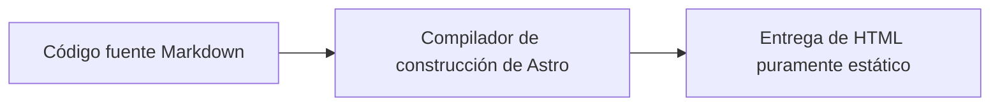

Este es un **artículo de demostración para pruebas de aceptación integrales y de estrés (All-in-one Master Showcase)**, diseñado para probar rápidamente y de forma automatizada todos los formatos y características especiales de la columna principal del texto.

---

## 1. Cuadros de aviso (Callouts)

> [!TIP]
> **Consejo**: Usa el atajo de teclado <kbd>Ctrl</kbd> + <kbd>K</kbd> para abrir la búsqueda.

> [!WARNING]
> **Advertencia**: Guarda tu clave privada de forma segura.

---

## 2. Desplegables y Acordeones (Dropdowns & Accordions)

Seleccionar framework:

<select class="article-select dropdown-switcher__select">
<option value="react-tab">⚛️ React 19</option>
<option value="vue-tab">🟢 Vue 3.5</option>
</select>

El código del componente de React 19 ha sido cargado.

El código del componente de archivo único de Vue 3.5 ha sido cargado.

  

    💡 Haz clic para expandir: Explicación de optimización de rendimiento
    <svg class="accordion-chevron" viewBox="0 0 24 24" fill="none" stroke="currentColor" stroke-width="2"><polyline points="9 18 15 12 9 6"/></svg>
  

  

    
Astro utiliza la arquitectura de Islas, entregando 0KB de JS por defecto.

  

---

## 3. Fórmulas matemáticas y diagramas Mermaid (Math & Mermaid)

Fórmula en línea: $E = mc^2$, integral de Gauss: $\int_{-\infty}^{\infty} e^{-x^2} dx = \sqrt{\pi}$.

Ecuaciones de Maxwell en bloque:

$$
\nabla \cdot \mathbf{E} = \frac{\rho}{\varepsilon_0}, \quad \nabla \times \mathbf{B} = \mu_0 \mathbf{J} + \mu_0 \varepsilon_0 \frac{\partial \mathbf{E}}{\partial t}
$$

---

## 4. Descifrado seguro de contraseñas y desenfoque gaussiano

  

    
🔒

    
Activo cifrado protegido

    
Introduce la contraseña autorizada para desbloquear.

    <button class="encrypted-box__btn" type="button">Haz clic para introducir la contraseña y desbloquear</button>
  

  

    

      
🎉 Descifrado exitoso

      

        
Token privado: <code>shijian_sec_9988_a1b2c3d4e5f6</code>

      

    

  

- Texto con desenfoque gaussiano: ¡Pasa el ratón por encima para ver el contenido del spoiler!
- Mosaico de censura: Datos confidenciales: SHA256-7f83b1657ff1fc53
- Spoiler de Discord: ||Máscara de spoiler de doble barra vertical||
- Bloqueo en línea: %%Contenido oculto con porcentaje%%

---

## 5. Formatos de publicación (Notas, estado, audio y galería)

  
<strong>💡 Nota</strong>: Mantente enfocado, entrega valor puro continuamente.

  

    
  

  

    
Paseo Estelar

    
shijianus · Ruido blanco original para concentración

    <audio controls preload="none" src="https://music.163.com/song/media/outer/url?id=186016.mp3"></audio>
  

