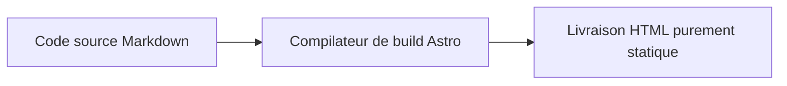

Cet article est un **exemple de test d'acceptation complet et de stress panoramique (All-in-one Master Showcase)**, conçu pour tester rapidement et automatiquement tous les formats et fonctionnalités spéciales de la colonne de contenu.

---

## 1. Encadrés d'information (Callouts)

> [!TIP]
> **Astuce** : Utilisez le raccourci clavier <kbd>Ctrl</kbd> + <kbd>K</kbd> pour lancer la recherche.

> [!WARNING]
> **Avertissement** : Veuillez conserver votre clé privée en toute sécurité.

---

## 2. Sélecteurs déroulants et accordéons (Dropdowns & Accordions)

Sélectionner le framework :

<select class="article-select dropdown-switcher__select">
<option value="react-tab">⚛️ React 19</option>
<option value="vue-tab">🟢 Vue 3.5</option>
</select>

Le code du composant React 19 a été chargé.

Le code du composant monofichier Vue 3.5 a été chargé.

  

    💡 Cliquez pour développer : Explication de l'optimisation des performances
    <svg class="accordion-chevron" viewBox="0 0 24 24" fill="none" stroke="currentColor" stroke-width="2"><polyline points="9 18 15 12 9 6"/></svg>
  

  

    
Astro utilise l'architecture Islands et livre par défaut 0 Ko de JS.

  

---

## 3. Formules mathématiques et diagrammes Mermaid (Math & Mermaid)

Formules en ligne : $E = mc^2$, intégrale de Gauss : $\int_{-\infty}^{\infty} e^{-x^2} dx = \sqrt{\pi}$.

Équations de Maxwell en bloc :

$$
\nabla \cdot \mathbf{E} = \frac{\rho}{\varepsilon_0}, \quad \nabla \times \mathbf{B} = \mu_0 \mathbf{J} + \mu_0 \varepsilon_0 \frac{\partial \mathbf{E}}{\partial t}
$$

---

## 4. Déchiffrement sécurisé de mot de passe et flou gaussien

  

    
🔒

    
Actif chiffré protégé

    
Veuillez entrer le mot de passe autorisé pour déverrouiller.

    <button class="encrypted-box__btn" type="button">Cliquez pour entrer le mot de passe et déverrouiller</button>
  

  

    

      
🎉 Déchiffrement réussi

      

        
Jeton privé : <code>shijian_sec_9988_a1b2c3d4e5f6</code>

      

    

  

- Texte flou gaussien : Passez la souris pour voir le contenu spoiler !
- Mosaïque de censure : Données confidentielles : SHA256-7f83b1657ff1fc53
- Spoiler Discord : ||Masque de spoiler à double barre verticale||
- Verrouillage en ligne : %%Contenu caché par pourcentage%%

---

## 5. Formats de publication (Notes, Statuts, Audio et Galerie)

  
<strong>💡 Note</strong> : Restez concentré, livrez continuellement de la valeur pure.

  

    
  

  

    
Marche dans la Voie Lactée

    
shijianus · Bruit blanc original pour la concentration

    <audio controls preload="none" src="https://music.163.com/song/media/outer/url?id=186016.mp3"></audio>
  

