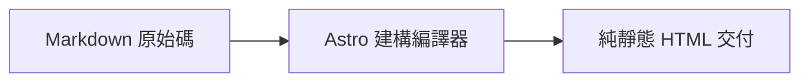

本篇為 **一站式綜合驗收與全景壓力測試示範文章（All-in-one Master Showcase）**，用於快速自動化測試內文欄的所有格式與特異功能。

---

## 1. 提示框（Callouts）

> [!TIP]
> **技巧**：使用快捷鍵 <kbd>Ctrl</kbd> + <kbd>K</kbd> 喚起搜尋。

> [!WARNING]
> **警告**：請妥善保管私鑰。

---

## 2. 下拉式選單與手風琴（Dropdowns & Accordions）

選擇框架：

<select class="article-select dropdown-switcher__select">
<option value="react-tab">⚛️ React 19</option>
<option value="vue-tab">🟢 Vue 3.5</option>
</select>

React 19 元件程式碼已載入。

Vue 3.5 單檔案元件程式碼已載入。

  

    💡 點擊展開：效能最佳化說明
    <svg class="accordion-chevron" viewBox="0 0 24 24" fill="none" stroke="currentColor" stroke-width="2"><polyline points="9 18 15 12 9 6"/></svg>
  

  

    
Astro 採用 Islands 架構，預設交付 0KB JS。

  

---

## 3. 數學公式與 Mermaid 圖表（Math & Mermaid）

行內公式：$E = mc^2$，高斯積分：$\int_{-\infty}^{\infty} e^{-x^2} dx = \sqrt{\pi}$。

區塊級馬克士威方程式：

$$
\nabla \cdot \mathbf{E} = \frac{\rho}{\varepsilon_0}, \quad \nabla \times \mathbf{B} = \mu_0 \mathbf{J} + \mu_0 \varepsilon_0 \frac{\partial \mathbf{E}}{\partial t}
$$

---

## 4. 安全密碼解密與高斯模糊

  

    
🔒

    
受保護加密資產

    
請輸入授權密碼後解鎖。

    <button class="encrypted-box__btn" type="button">點擊輸入密碼解鎖</button>
  

  

    

      
🎉 解密成功

      

        
私有令牌：<code>shijian_sec_9988_a1b2c3d4e5f6</code>

      

    

  

- 高斯模糊文字：懸浮即可看清劇透內容！
- 黑幕馬賽克：機密資料：SHA256-7f83b1657ff1fc53
- Discord 劇透：||雙豎線劇透遮罩||
- 內聯鎖：%%百分號隱藏內容%%

---

## 5. 文章格式（便條、狀態、音訊與畫廊）

  
<strong>💡 隨筆</strong>：保持專注，持續交付純粹價值。

  

    
  

  

    
星河漫步

    
shijianus · 原創專注白噪音

    <audio controls preload="none" src="https://music.163.com/song/media/outer/url?id=186016.mp3"></audio>
  

