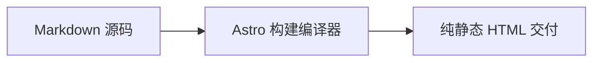

本篇为 **一站式综合验收与全景压测示范文章（All-in-one Master Showcase）**，用于快速自动化测试正文栏的所有格式与特异功能。

---

## 1. 告示框（Callouts）

> [!TIP]
> **技巧**：使用快捷键 <kbd>Ctrl</kbd> + <kbd>K</kbd> 唤起搜索。

> [!WARNING]
> **警告**：请妥善保管私钥。

---

## 2. 下拉框与手风琴（Dropdowns & Accordions）

选择框架：

<select class="article-select dropdown-switcher__select">
<option value="react-tab">⚛️ React 19</option>
<option value="vue-tab">🟢 Vue 3.5</option>
</select>

React 19 组件代码已加载。

Vue 3.5 单文件组件代码已加载。

  

    💡 点击展开：性能优化说明
    <svg class="accordion-chevron" viewBox="0 0 24 24" fill="none" stroke="currentColor" stroke-width="2"><polyline points="9 18 15 12 9 6"/></svg>
  

  

    
Astro 采用 Islands 架构，默认交付 0KB JS。

  

---

## 3. 数学公式与 Mermaid 图表（Math & Mermaid）

行内公式：$E = mc^2$，高斯积分：$\int_{-\infty}^{\infty} e^{-x^2} dx = \sqrt{\pi}$。

块级麦克斯韦方程：

$$
\nabla \cdot \mathbf{E} = \frac{\rho}{\varepsilon_0}, \quad \nabla \times \mathbf{B} = \mu_0 \mathbf{J} + \mu_0 \varepsilon_0 \frac{\partial \mathbf{E}}{\partial t}
$$

---

## 4. 安全密码解密与高斯模糊

  

    
🔒

    
受保护加密资产

    
请输入授权密码后解锁。

    <button class="encrypted-box__btn" type="button">点击输入密码解锁</button>
  

  

    

      
🎉 解密成功

      

        
私有令牌：<code>shijian_sec_9988_a1b2c3d4e5f6</code>

      

    

  

- 高斯模糊文字：悬浮即可看清剧透内容！
- 黑幕马赛克：机密数据：SHA256-7f83b1657ff1fc53
- Discord 剧透：||双竖线剧透遮罩||
- 内联锁：%%百分号隐藏内容%%

---

## 5. Post Formats（便签、状态、音频与画廊）

  
<strong>💡 随笔</strong>：保持专注，持续交付纯粹价值。

  

    
  

  

    
星河漫步

    
shijianus · 原创专注白噪音

    <audio controls preload="none" src="https://music.163.com/song/media/outer/url?id=186016.mp3"></audio>
  

