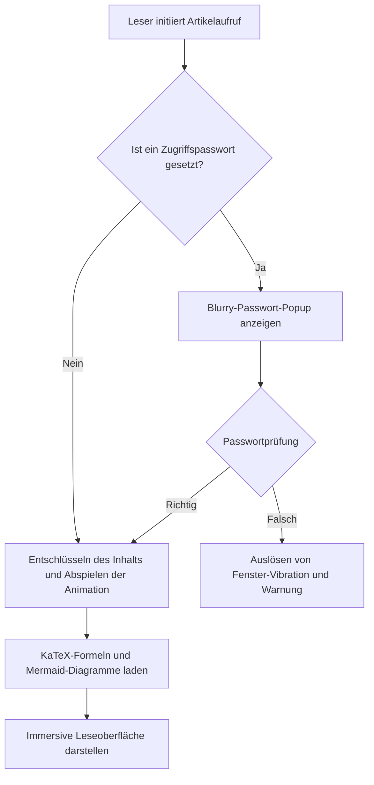
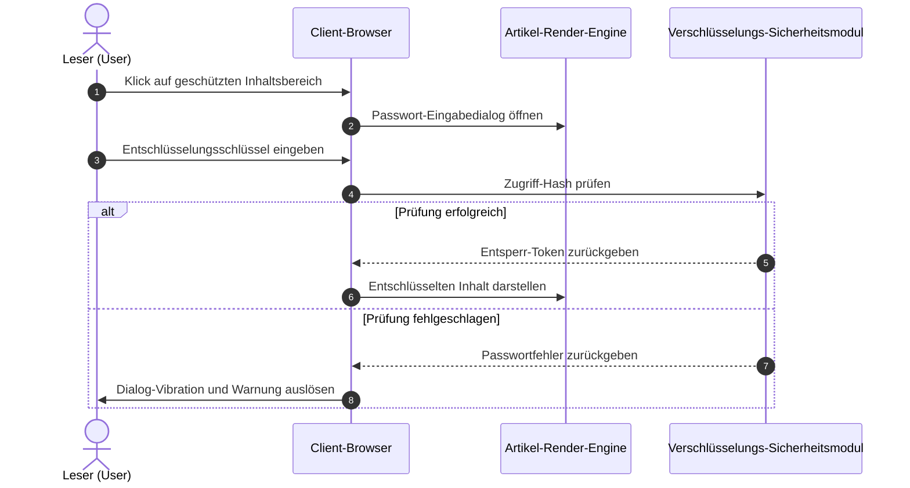
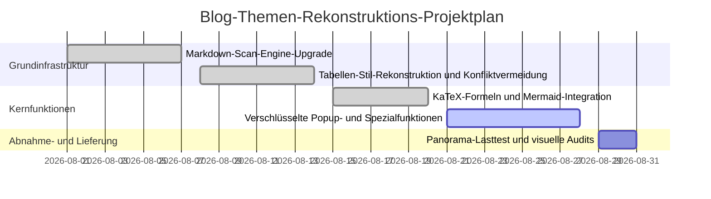
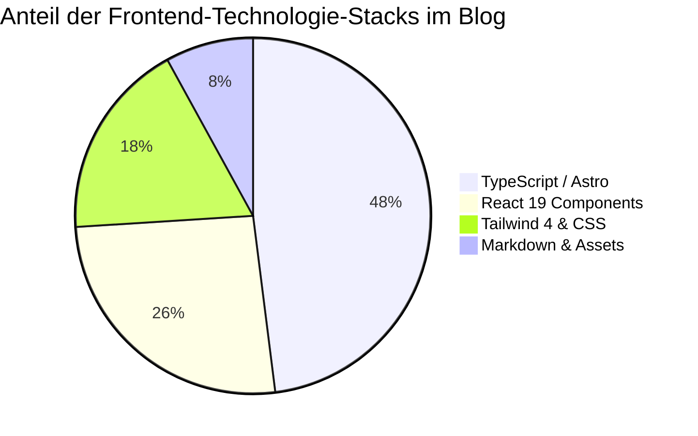

Dieses Beispiel ist ausschließlich dafür gedacht, die Kompilierungs‑ und Rendering‑Fähigkeiten von **Mermaid 11 Vektordiagrammen** im Blog‑Artikeltext zu demonstrieren und zu testen.

Die Diagramme basieren auf reinen Text‑Code‑Deklarationen, der Client lädt bei Bedarf asynchron die ESM‑Engine und passt sich automatisch dem Hell‑ bzw. Dunkel‑Thema an.

---

## 1. Systemarchitektur‑Entscheidungs‑Flussdiagramm (Flowchart)

---

## 2. Client‑Interaktions‑Sequenzdiagramm (Sequence Diagram)

---

## 3. Projekt‑Meilenstein‑Gantt‑Diagramm (Gantt Chart)

---

## 4. Technologie‑Stack‑Code‑Anteil‑Kuchendiagramm (Pie Chart)

