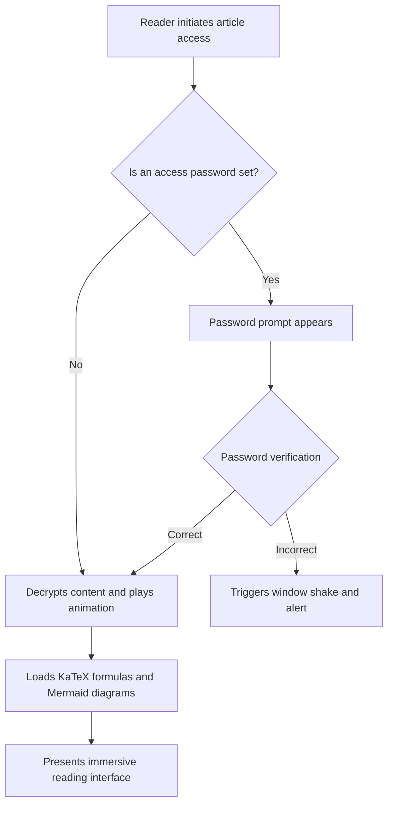
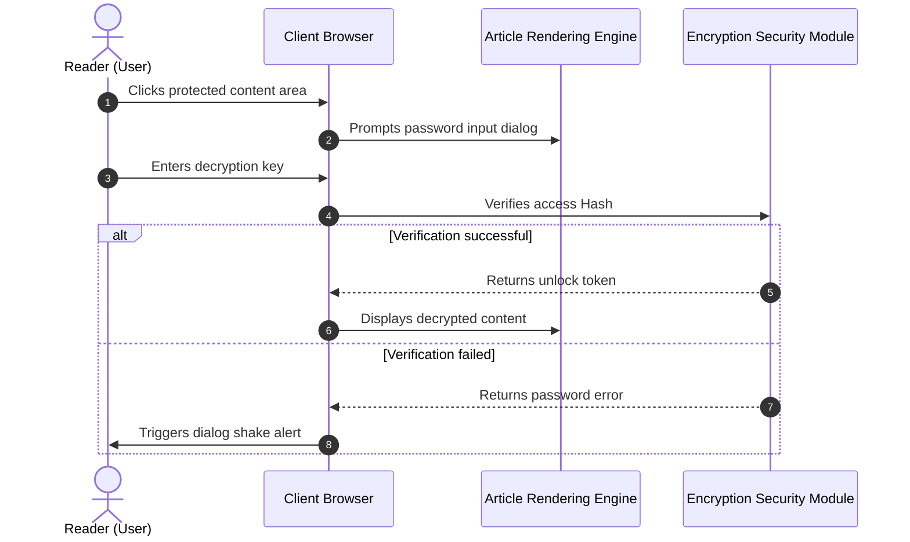
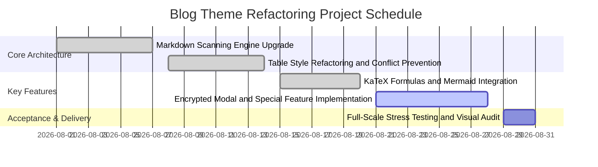
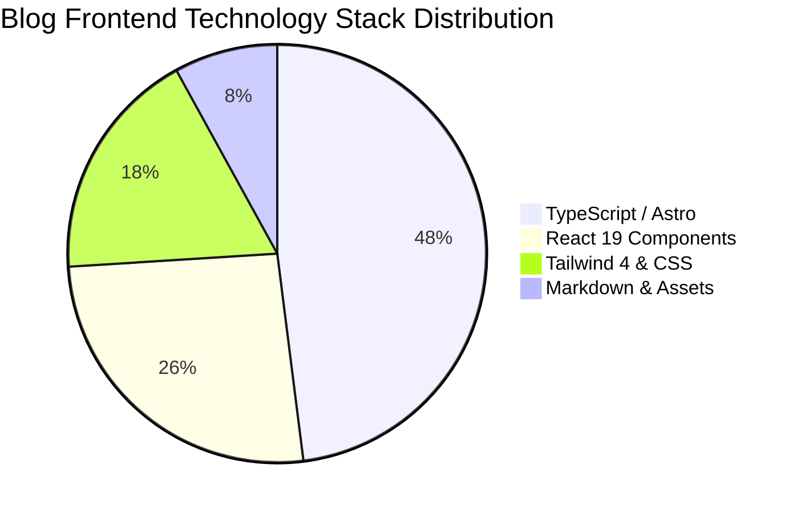

This example article is dedicated to showcasing and testing the compilation and rendering capabilities of **Mermaid 11 vector diagrams** within blog posts.

Diagrams are declared using plain text code, with the client asynchronously loading the ESM engine on demand, automatically adapting to light and dark themes.

---

## 1. System Architecture Decision Flowchart

---

## 2. Client Interaction Sequence Diagram

---

## 3. Project Milestone Gantt Chart

---

## 4. Technology Stack Code Distribution Pie Chart

