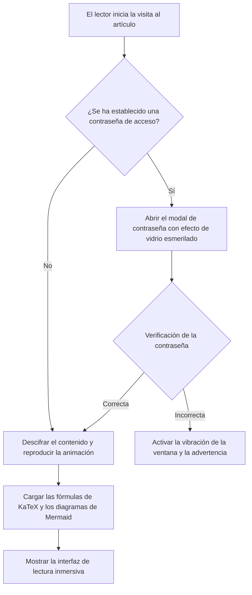
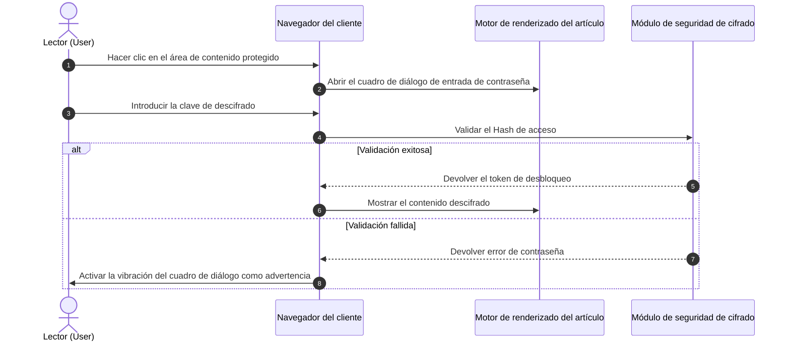
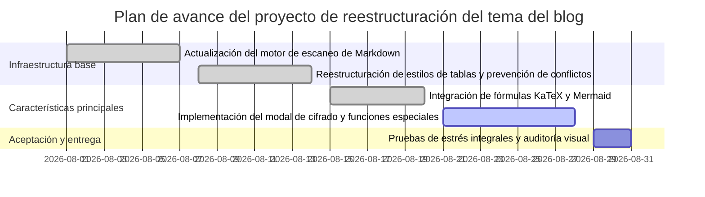
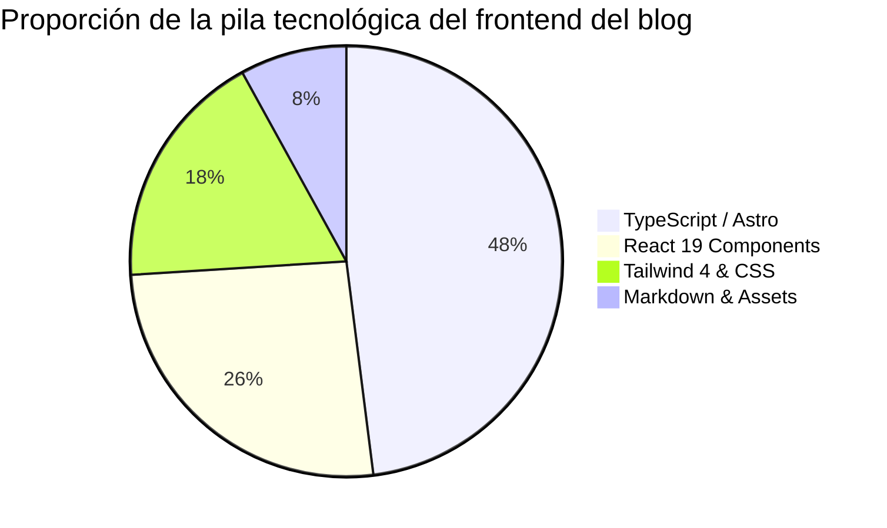

Este ejemplo está diseñado específicamente para demostrar y probar la capacidad de compilación y renderizado de **diagramas vectoriales de Mermaid 11** en el cuerpo del artículo del blog.

Los diagramas se declaran mediante código de texto plano, el motor ESM se carga de forma asíncrona bajo demanda en el cliente y se adapta automáticamente a los temas claro y oscuro.

---

## 1. Diagrama de flujo de decisiones de arquitectura del sistema (Flowchart)

---

## 2. Diagrama de secuencia de interacción del cliente (Sequence Diagram)

---

## 3. Diagrama de Gantt de hitos del proyecto (Gantt Chart)

---

## 4. Gráfico de pastel de proporción de código de la pila tecnológica (Pie Chart)

