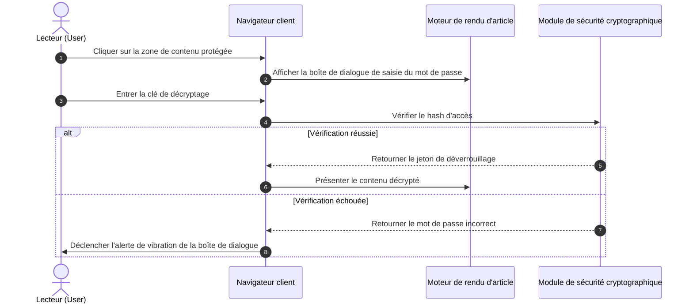
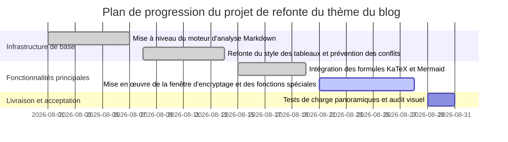
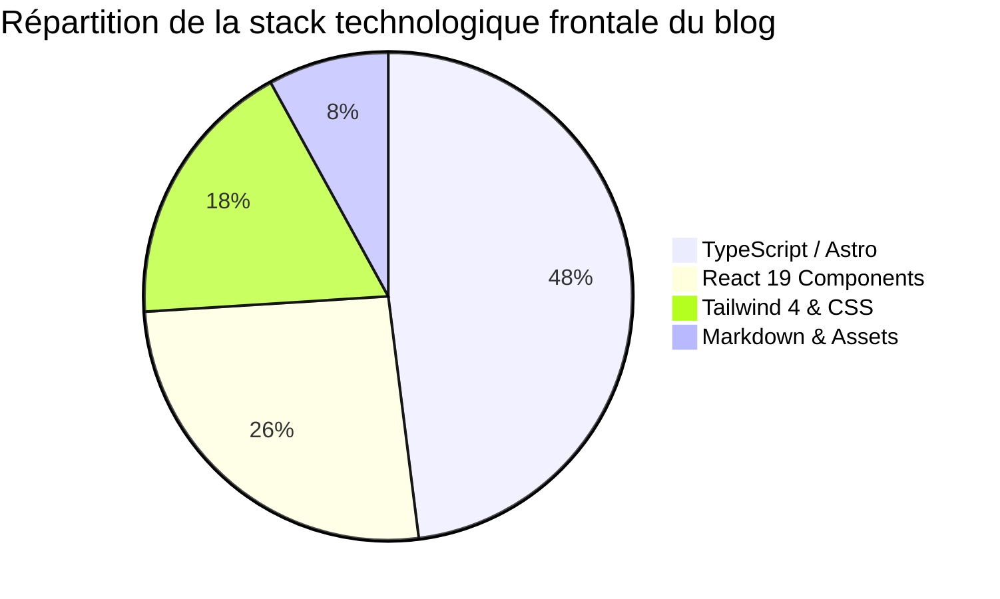

Cet exemple est dédié à la démonstration et au test des capacités de compilation et de rendu des **diagrammes vectoriels Mermaid 11** dans le corps du blog.

Les diagrammes sont déclarés via du code texte brut, le client charge de manière asynchrone le moteur ESM à la demande et s'adapte automatiquement aux thèmes clair et sombre.

---

## 1. Diagramme de flux de décision de l'architecture système (Flowchart)

```mermaid
graph TD
    A[Le lecteur initie la visite de l'article] --> B{Mot de passe d'accès défini ?}
    B -->|Oui| C[Afficher la fenêtre de saisie du mot de passe (effet flou)]
    C --> D{Vérification du mot de passe}
    D -->|Correct| E[Décrypter le contenu et lancer l'animation]
    D -->|Incorrect| F[Déclencher le tremblement de la fenêtre et l'alerte]
    B -->|Non| E
    E --> G[Charger les formules KaTeX et les diagrammes Mermaid]
    G --> H[Présenter l'interface de lecture immersive]
```

---

## 2. Diagramme de séquence d'interaction client (Sequence Diagram)



---

## 3. Diagramme de Gantt des jalons du projet (Gantt Chart)



---

## 4. Diagramme circulaire de répartition du code de la stack technologique (Pie Chart)

