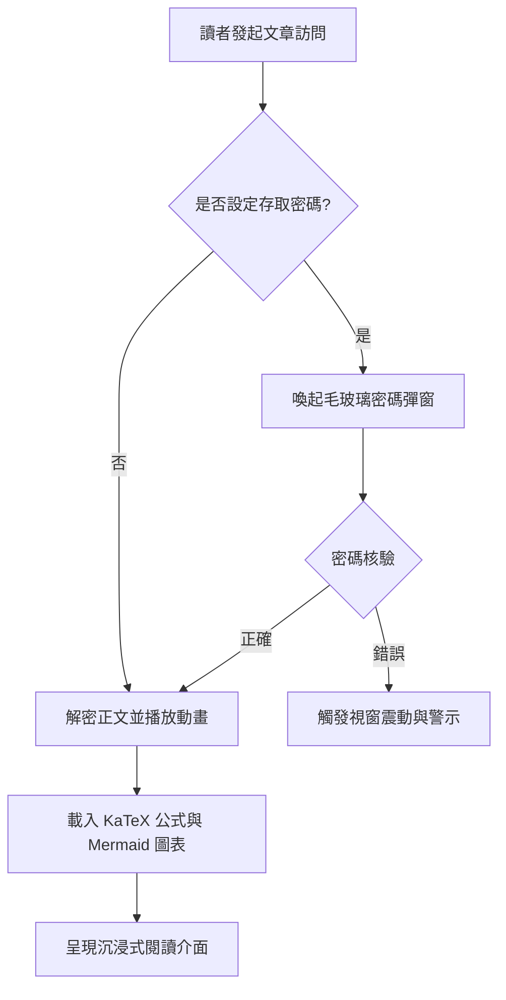
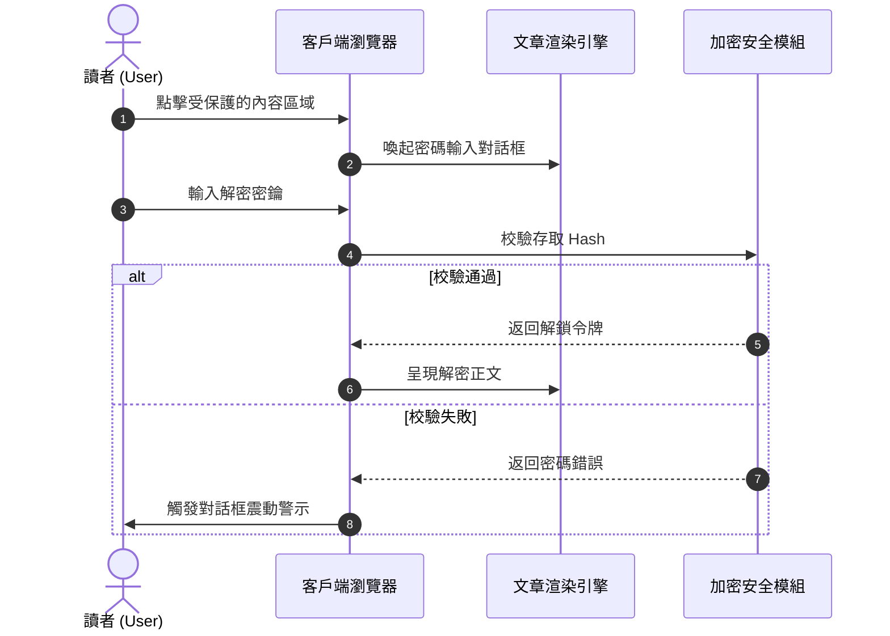
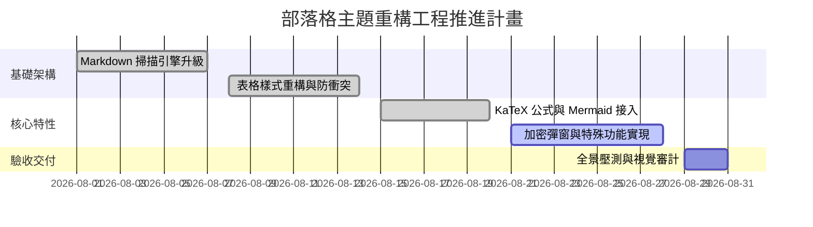
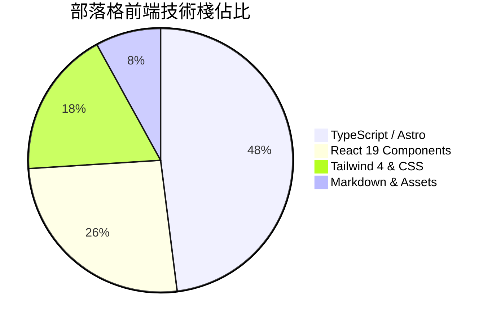

本篇範例專用於展示與測試部落格正文中的 **Mermaid 11 向量圖表** 編譯與渲染能力。

圖表基於純文字程式碼宣告，客戶端按需非同步載入 ESM 引擎，自動適配明暗主題。

---

## 一、系統架構決策流程圖（Flowchart）

---

## 二、客戶端互動時序圖（Sequence Diagram）

---

## 三、專案里程碑甘特圖（Gantt Chart）

---

## 四、技術棧程式碼佔比餅圖（Pie Chart）

