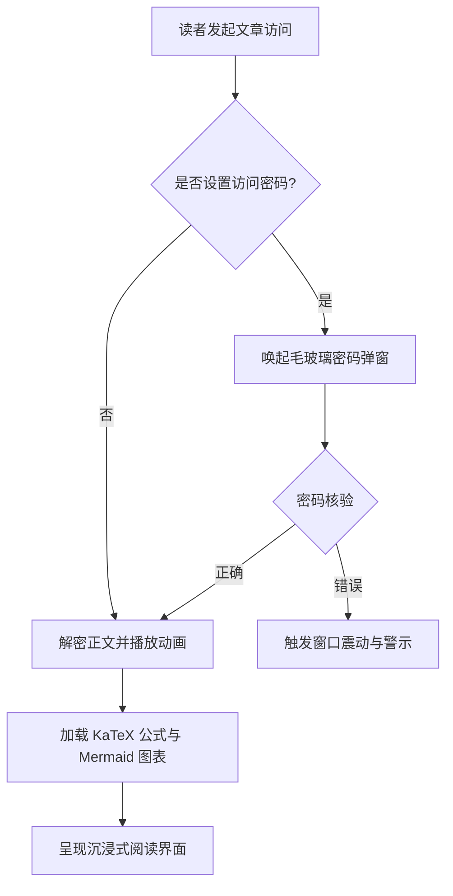
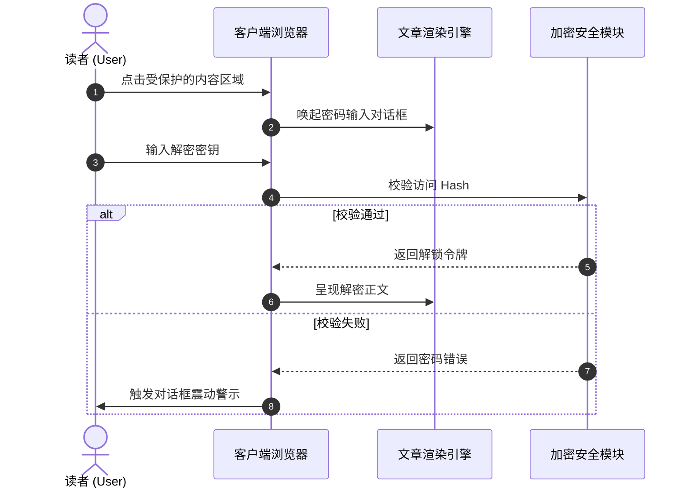
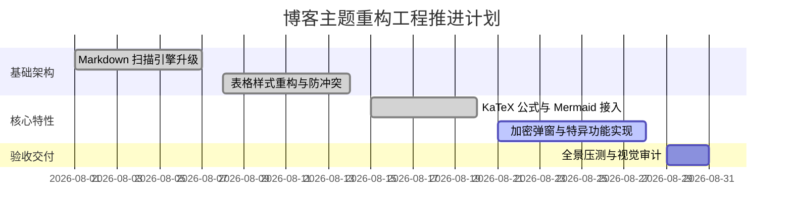
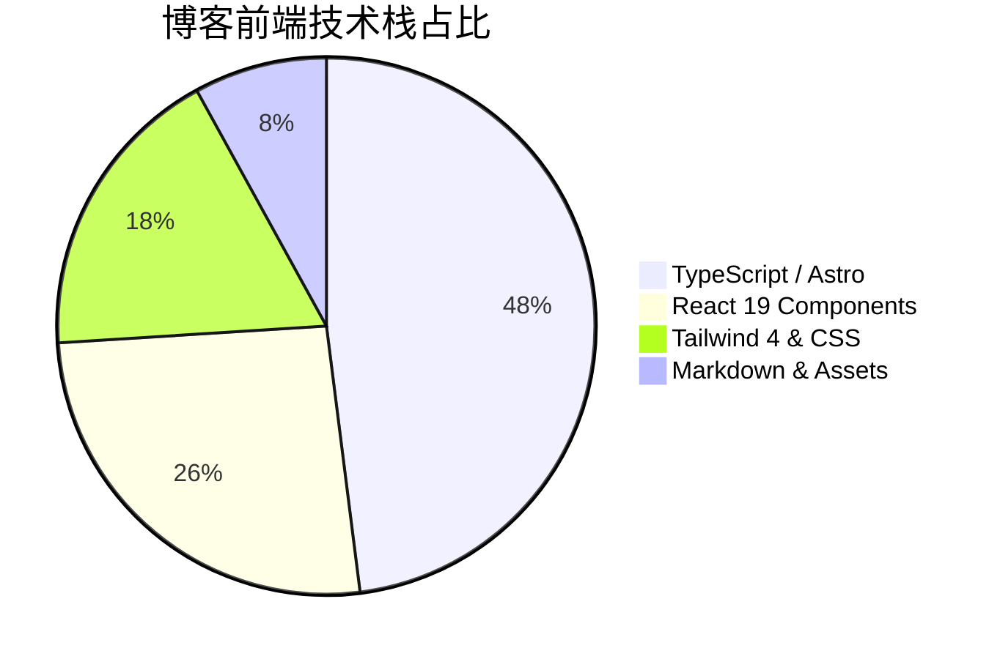

本篇示例专用于展示与测试博客正文中的 **Mermaid 11 矢量图表** 编译与渲染能力。

图表基于纯文本代码声明，客户端按需异步加载 ESM 引擎，自动适配明暗主题。

---

## 一、系统架构决策流程图（Flowchart）

---

## 二、客户端交互时序图（Sequence Diagram）

---

## 三、项目里程碑甘特图（Gantt Chart）

---

## 四、技术栈代码占比饼图（Pie Chart）

