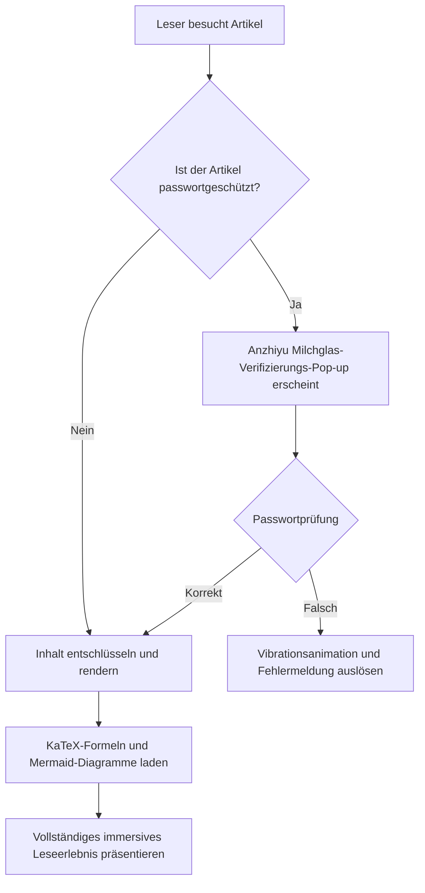
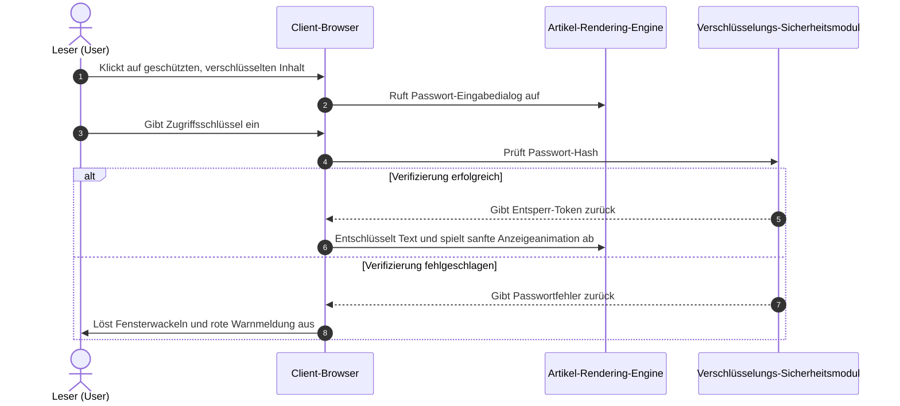
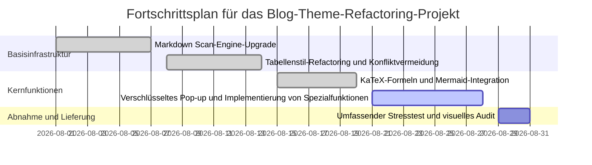
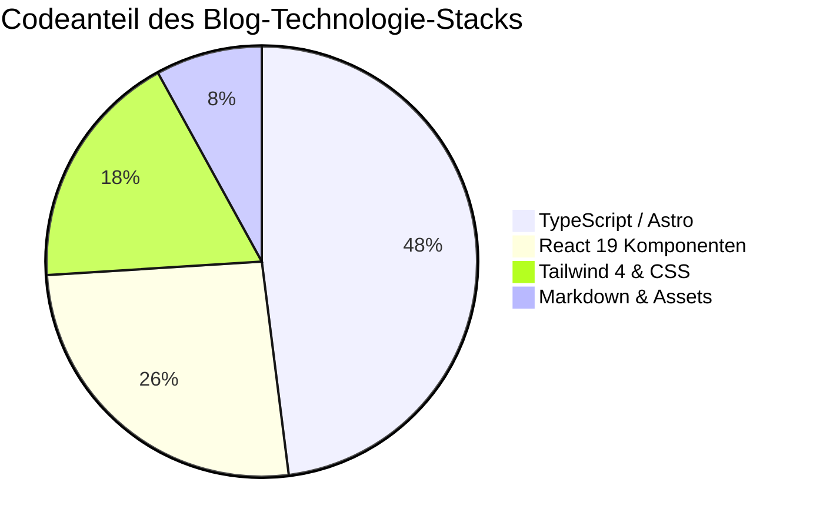
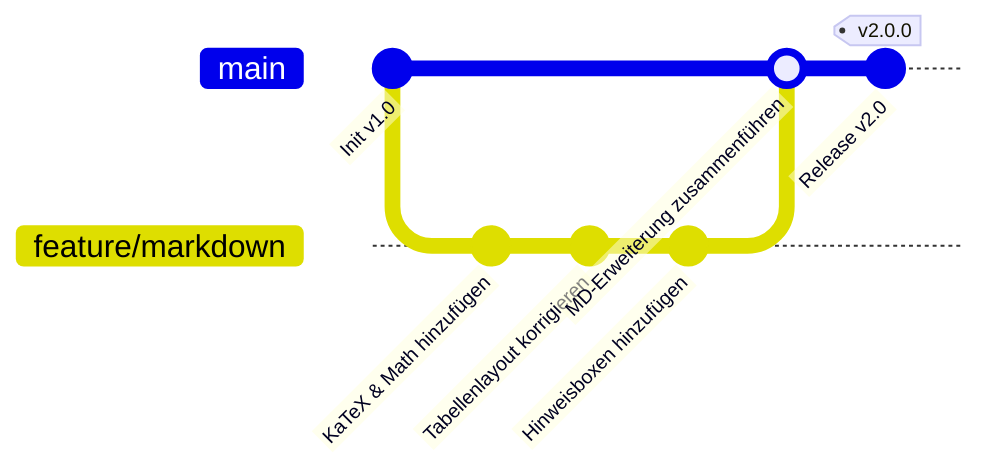

# Willkommen beim All-in-One Markdown-Rendering- und Spezialfunktionssystem

Dies ist ein **Markdown All-in-One Syntax-Demo- und Technisches Benutzerhandbuch**, das speziell für diesen Blog (`shijianus-blog`) erstellt wurde. Diese Website hat sich tiefgreifend von den visuellen Spezifikationen des Open-Source-Klassikers **Hexo-Theme-Anzhiyu** und den modernen statischen Rendering-Fähigkeiten von **Astro 6** inspirieren lassen, um ein vollständiges Markdown-Parsing-System neu aufzubauen und zu integrieren.

Ob akademische LaTeX-Mathematikformeln, Mermaid-Architekturflussdiagramme, mehrsprachiger Code-Wechsel, Diff-Vergleiche, GitHub-Stil-Hinweisfelder, adaptives Tabellen-Scrolling oder innovative Spezialfunktionen wie **passwortverschlüsselte Pop-up-Entsperrung, Gaußsche Unschärfe und Mosaikeffekte für Text/Bilder sowie Rich-Media-Karten** – all dies wird hier nativ unterstützt.

---

## I. Mathematische Formeln (Math / KaTeX)

Dieser Blog verfügt über integrierte `remark-math`- und `rehype-katex`-Rendering-Pipelines, die eine hochperformante Kompilierung und adaptive Layout-Anpassung für Inline- und Blockformeln auf allen Geräten unterstützen.

### 1. Inline-Mathematikformeln (Inline Math)

Verwenden Sie `$ ... $` direkt im Text, um LaTeX-Ausdrücke einzuschließen:

- Masse-Energie-Äquivalenz: $E = mc^2$
- Eulers Identität: $e^{i\pi} + 1 = 0$
- Gaußsche Normalverteilungsdichtefunktion: $f(x) = \frac{1}{\sigma \sqrt{2\pi}} e^{-\frac{1}{2}\left(\frac{x-\mu}{\sigma}\right)^2}$
- Summenlimit: $\lim_{n \to \infty} \sum_{k=1}^n \frac{1}{k^2} = \frac{\pi^2}{6}$

### 2. Block-Mathematikformeln (Display Math)

Verwenden Sie `$$ ... $$`, um eigenständige Absätze zu bilden, die mehrzeilige Ableitungen und Matrixsatz unterstützen. Auf Mobilgeräten ist ein horizontaler, elastischer Scroll-Container integriert, der die Seitenbreite niemals beeinträchtigt:

$$
\mathcal{L}\{\ddot{x}(t) + 2\zeta\omega_n\dot{x}(t) + \omega_n^2 x(t)\} = X(s)(s^2 + 2\zeta\omega_n s + \omega_n^2)
$$

Maxwell-Gleichungen (Differentialform):

$$
\begin{aligned}
\nabla \cdot \mathbf{E} &= \frac{\rho}{\varepsilon_0} \\
\nabla \cdot \mathbf{B} &= 0 \\
\nabla \times \mathbf{E} &= -\frac{\partial \mathbf{B}}{\partial t} \\
\nabla \times \mathbf{B} &= \mu_0 \mathbf{J} + \mu_0 \varepsilon_0 \frac{\partial \mathbf{E}}{\partial t}
\end{aligned}
$$

Gauß-Integral und Matrixoperationen:

$$
\int_{-\infty}^{\infty} e^{-x^2} \, dx = \sqrt{\pi}, \quad
\mathbf{A} = \begin{bmatrix}
a_{11} & a_{12} & \cdots & a_{1n} \\
a_{21} & a_{22} & \cdots & a_{2n} \\
\vdots & \vdots & \ddots & \vdots \\
a_{m1} & a_{m2} & \cdots & a_{mn}
\end{bmatrix}
$$

---

## II. Diagramme und Zeichen-Codeblöcke (Diagrams as Code)

Der Blog integriert nativ die **Mermaid 11**-Engine, die die Echtzeit-Kompilierung von Diagrammcode in hochauflösende Vektor-SVG-Diagramme unterstützt und sich automatisch an den Hell-/Dunkelmodus anpasst.

### 1. Geschäftsarchitektur- und Entscheidungsflussdiagramm (Flowchart)



### 2. Systeminteraktions-Sequenzdiagramm (Sequence Diagram)



### 3. Projektlieferungs-Gantt-Diagramm (Gantt Chart)



### 4. Statistik-Tortendiagramm und Versionsgraph (Pie Chart & GitGraph)





---

## Drei. Hinweisboxen und Callouts (Admonition / Callout)

Basierend auf der GitHub Alert-Syntax und der Designästhetik von Anzhiyu werden 9 farbige Karten mit unterschiedlicher Semantik unterstützt, einschließlich eines **zusammenklappbaren Modus**.

### 1. Standard-Hinweisboxen (Standard Callouts)

> [!NOTE]
> **Allgemeine Anmerkung (Note)**: Dies ist eine Standard-Hintergrundinformation oder ergänzende Erläuterung, die den Kontext des Artikels liefert.

> [!TIP]
> **Praktischer Tipp (Tip)**: Verwenden Sie die Tastenkombination <kbd>Strg</kbd> + <kbd>K</kbd>, um schnell das globale Artikelsuchfeld aufzurufen!

> [!IMPORTANT]
> **Wichtiger Hinweis (Important)**: Stellen Sie vor der Bereitstellung in der Produktionsumgebung sicher, dass die Umgebungsvariable `BLOG_BUILD_TARGET=static` korrekt injiziert wurde.

> [!WARNING]
> **Risikowarnung (Warning)**: Codieren Sie keine Datenbankschlüssel oder private Cloud-Dienstschlüssel in öffentlichen Repositories fest.

> [!CAUTION]
> **Gefahrenhinweis (Caution)**: Das Umstrukturieren von Datentabellen ist irreversibel. Führen Sie zuerst `npm run cf:d1:migrate` aus, um Daten zu sichern!

> [!DANGER]
> **Tödliche Gefahr (Danger)**: Das direkte Löschen der Produktionsdatenbank führt zum dauerhaften Verlust aller Kommentare und Benutzerressourcen.

> [!SUCCESS]
> **Vorgang erfolgreich (Success)**: Der statische Build-Prozess wurde erfolgreich abgeschlossen, alle 43 statischen Routen sind bereit!

> [!QUESTION]
> **Frage zur Diskussion (Question)**: Wie lässt sich eine millisekundengenaue, rein clientseitige Volltextsuche in einer Umgebung ohne Serverabhängigkeiten realisieren?

> [!QUOTE]
> **Ausgewähltes Zitat (Quote)**: „Guter Code wird nicht nur von Maschinen ausgeführt, sondern vermittelt Ideen auch elegant wie Poesie an Menschen.“

### 2. Zusammenklappbare Hinweisboxen (Collapsible Details Admonitions)

Durch Hinzufügen von `-` nach dem Marker wird eine standardmäßig eingeklappte Hinweisbox erzeugt, während `+` sie standardmäßig ausklappt:

> [!TIP]- Zum Ausklappen klicken: Referenz zur Nginx-Schnellcache-Konfiguration für die Produktionsumgebung
> Im Folgenden finden Sie die empfohlene Strategie für langlebigen Cache statischer Ressourcen:
> ```nginx
> location ~* \.(?:css|js|woff2?|svg|png|jpg|webp)$ {
>     expires 1y;
>     add_header Cache-Control "public, immutable";
>     access_log off;
> }
> ```

---

## Vier. Erweiterte Codeblock-Funktionen (Advanced Code Blocks)

Wir haben allen Codeblöcken in den Artikeln **macOS-Skeuomorphismus-Ampel-Kontrollleisten**, **Sprach-Badges**, **Ein-Klick-Kopieren**, **Diff-Vergleich für hinzugefügte/gelöschte Zeilen** und einen **automatischen Faltmechanismus für sehr lange Codes** hinzugefügt.

### 1. TypeScript Codebeispiel (mit Diff für hinzugefügte/gelöschte Zeilen)

```typescript
import { defineConfig } from 'astro/config';
import remarkMath from 'remark-math';
import rehypeKatex from 'rehype-katex';

export default defineConfig({
  site: 'https://shijian.us',
- output: 'server', // Alte serverseitige Rendering-Konfiguration
+ output: 'static', // [!code ++] Auf statischen Exportmodus aktualisiert, 300% schneller
  markdown: {
+   remarkPlugins: [remarkMath], // [!code ++]
+   rehypePlugins: [rehypeKatex], // [!code ++]
    shikiConfig: {
      themes: {
        light: 'github-light',
        dark: 'github-dark-dimmed',
      },
    },
  },
});
```

### 2. Demo für das Falten von sehr langem Code (automatische Höhenbegrenzung mit Ausklapp-Button)

```json
{
  "project": "shijianus-blog",
  "version": "2.0.0",
  "author": "shijianus",
  "dependencies": {
    "@astrojs/mdx": "^5.0.3",
    "@astrojs/node": "^10.0.6",
    "@astrojs/react": "^5.0.2",
    "@tailwindcss/postcss": "^4.2.4",
    "@tailwindcss/vite": "^4.2.2",
    "astro": "^6.1.3",
    "katex": "^0.16.11",
    "lucide-react": "^0.460.0",
    "mermaid": "^11.4.1",
    "react": "^19.2.4",
    "react-dom": "^19.2.4",
    "rehype-katex": "^7.0.1",
    "remark-gfm": "^4.0.1",
    "remark-math": "^6.0.0",
    "tailwindcss": "^4.2.2"
  },
  "scripts": {
    "dev": "astro dev --host 0.0.0.0",
    "build": "BLOG_BUILD_TARGET=static PUBLIC_STATIC_EXPORT=1 astro build",
    "preview": "astro preview",
    "clean": "node scripts/clean.mjs"
  },
  "keywords": [
    "astro",
    "blog",
    "anzhiyu",
    "katex",
    "mermaid",
    "tailwind4"
  ]
}
```

## Fünf. Aufgabenlisten und Tabellen – Allround-Verbesserungen (Task Lists & Tables)

### 1. Interaktive GFM-Aufgabenlisten (Task Lists)

- [x] Tiefenanalyse von LaTeX-Mathematikformeln (`remark-math` + `rehype-katex`)
- [x] Dynamisches Laden und Rendern von Mermaid-Flussdiagrammen und Sequenzdiagrammen
- [x] Behebung von Tabellenerkennungskonflikten, Implementierung von adaptivem responsivem horizontalem Scrollen
- [x] Integration von 9 Anzhiyu-Stil-Alert-Benachrichtigungskarten
- [x] Implementierung der Entsperrung von lokal verschlüsselten Inhalten über ein Milchglas-Passwort-Popup
- [x] Hinzufügen von Gaußschem Weichzeichner und Mosaikmasken für Text und Bilder
- [ ] Unterstützung weiterer Drittanbieter-Einbettungskomponenten (in kontinuierlicher Iteration)

### 2. Verbesserte adaptive Tabellen (Fixed Table Layout)

Tabellen zeigen keine Zellkompression, Verformung oder Rahmenabschneidung mehr und verfügen über einen subtilen Glanz im Tabellenkopf und abwechselnde Zeilenfarben:

| Modulname | Kerntechnologieunterstützung | Interaktive Merkmale | Status-Badge |
| :--- | :--- | :--- | :---: |
| **Mathematische Formeln** | KaTeX + AST Compiler | Inline-/Block-adaptive Darstellung, keine Client-Leistungsbelastung | <span class="badge badge-success">Stabile Unterstützung</span> |
| **Architekturdiagramme** | Mermaid 11 | Flussdiagramme, Sequenzdiagramme, Gantt-Diagramme, Dark-Mode-adaptiv | <span class="badge badge-success">Stabile Unterstützung</span> |
| **Verschlüsselter Inhalt** | Passwort-Popup + Session-Speicherung | Milchglas-Dialog, Fehler-Vibrationsanimation, sichere Isolation | <span class="badge badge-primary">Kernspezifisch</span> |
| **Unschärfe und Mosaik** | CSS Backdrop Filter | Hover/Klick zum Aufheben der Unschärfe, Bildmasken-Badge | <span class="badge badge-info">Interaktionsverbesserung</span> |
| **Code-Hervorhebung** | Shiki + Mac Enhancer | Hinzufügen/Löschen von Diff-Zeilen, Ein-Klick-Kopieren, Falten von sehr langem Code | <span class="badge badge-success">Vollständig bereit</span> |
| **Bilder-Lightbox** | Fullscreen Lightbox | Vollbild-Zoom für große Bilder, dunkle Überlagerung, `Esc`-Beenden | <span class="badge badge-warning">Benutzererfahrung verbessert</span> |

---

## Sechs. Spezielle Funktion: Verschlüsselter Inhalt und Passwort-Popup-Entsperrung (Encryption & Password Modal)

Dieser Blog bietet einen **lokalen Inhaltspasswortschutzmechanismus**, der über normales Markdown hinausgeht. Ohne die Seite neu zu laden, können Sie durch Klicken das ansprechende Anzhiyu-Milchglas-Passwort-Eingabedialogfeld aufrufen!

<div class="article-encrypted-box" data-hash="d7fb6c64b9aa44cc0c3b427edaa623369dee1a9778329801f68fdaa34b09d351" data-hint="💡 Hinweis zur Verifizierung: Geben Sie für den Demo-Schlüssel direkt shijianus2026 ein">
  <div class="encrypted-box__lock">
    <div class="encrypted-box__icon">🔒</div>
    <div class="encrypted-box__title">Dieser Abschnitt enthält geschützte, verschlüsselte Inhalte</div>
    <div class="encrypted-box__desc">Dieser Bereich enthält private Ressourcen und technische Kernparameter. Bitte geben Sie das autorisierte Passwort ein, um ihn anzuzeigen.</div>
    <button class="encrypted-box__btn" type="button">Klicken Sie hier, um das Passwort einzugeben und zu entsperren</button>
  </div>
  <div class="encrypted-box__content">
    <div class="admonition admonition-success">
      <div class="admonition-title">
        <svg viewBox="0 0 24 24" fill="none" stroke="currentColor" stroke-width="2" stroke-linecap="round" stroke-linejoin="round"><path d="M22 11.08V12a10 10 0 1 1-5.93-9.14"/><polyline points="22 4 12 14.01 9 11.01"/></svg>
        <span>🎉 Passwort erfolgreich verifiziert! Entschlüsselter Inhalt wird angezeigt</span>
      </div>
      <div class="admonition-content">
        <p>Herzlichen Glückwunsch, Sie haben das geschützte technische Geheimnis erfolgreich entsperrt! Hier sind die verschlüsselten Lieferdaten:</p>
        <ul>
          <li><strong>Privates Code-Repository</strong>: <code>git@github.com:shijianus/vip-internal-core.git</code></li>
          <li><strong>API-Zugriffstoken (Token)</strong>: <code>shijian_sec_9988_a1b2c3d4e5f6</code></li>
          <li><strong>Exklusiver Support-Kanal</strong>: Telegram Privatkanal <code>@shijianus_insiders</code></li>
        </ul>
        <p>Der Entsperrungsstatus wurde in Ihrer Browsersitzung gespeichert. Sie müssen das Passwort nach dem Aktualisieren der aktuellen Seite nicht erneut eingeben.</p>
      </div>
    </div>
  </div>
</div>

---

## Sieben. Spezielle Funktionen: Gaußsche Unschärfe, Mosaik und Spoiler-Verbergen (Blur, Mosaic & Spoilers)

Im täglichen Schreiben ist es manchmal notwendig, sensible Inhalte, Plot-Antworten oder spannende Bilder visuell zu verwischen oder zu maskieren.

### 1. Gaußsche Unschärfe für Text (Gaussian Blur Text)

Dies ist ein wichtiger Spoiler-Text, der durch Unschärfe geschützt ist: <span class="blur-text">Der wahre Mörder ist tatsächlich der Butler, er hat den Schlüssel bereits im dritten Kapitel heimlich ausgetauscht!</span> (**Fahren Sie mit der Maus darüber oder klicken Sie auf den Text oben, um die Unschärfe aufzuheben**).

### 2. Mosaik-Text (Mosaic Mask Text)

Dies ist ein Text mit einer schwarzen Mosaikmaske: <span class="mosaic-text">Vertrauliche Daten: SHA256-7f83b1657ff1fc53b92dc18148a1d65dfc2d4b1fa3d677284addd200126d9069</span> (**Fahren Sie mit der Maus darüber oder klicken Sie, um den Klartext anzuzeigen**).

### 3. Inline-Spoiler und versteckte Markierungen

- Discord-Stil Spoiler-Maske: ||Dies ist eine Spoiler-Maske, die mit doppelten vertikalen Linien umschlossen ist und nach dem Klicken dauerhaft enthüllt wird.||
- Direkt inline versteckter Inhalt: %%Dies ist ein inline versteckter Inhalt, der mit Prozentzeichen umschlossen ist und durch Klicken erweitert wird.%%

### 4. Bild-Gaußscher Weichzeichner (Blurred Image Protection)

Für Inhalte, die urheberrechtlich sensibel, mysteriös oder für Erwachsene bestimmt sind, kann ein Bild-Weichzeichnerschutz-Container verwendet werden:

<div class="blur-image-wrap">
  
  <div class="blur-image-badge"><span>👁️ Überfahren oder klicken, um den Schleier zu lüften</span></div>
</div>

### 5. Ausklappbares Feld für versteckte Inhalte (Hidden Content Box)

<div class="hidden-box">
  <button class="hidden-box__toggle" type="button">
    <span>💡 Klicken zum Ausklappen: Detaillierte Ableitung der algorithmischen Zeitkomplexität</span>
    <span>▼</span>
  </button>
  <div class="hidden-box__content">
    <p>Für QuickSort beträgt die durchschnittliche Zeitkomplexität $\mathcal{O}(n \log n)$, während sie im schlimmsten Fall, wenn jede Partition ungleichmäßig ist, auf $\mathcal{O}(n^2)$ degeneriert. Durch die Einführung eines randomisierten Pivots kann die Wahrscheinlichkeit des schlimmsten Falls exponentiell gesenkt werden.</p>
  </div>
</div>

---

## VIII. Falt- und Container-Komponenten (Tabs, Steps & Accordions)

### 1. Interaktive Tabs für mehrsprachiges Paketmanagement (Interactive Tabs)

<div class="article-tabs">
  <div class="article-tabs__nav">
    <button class="article-tabs__button is-active" type="button">pnpm (empfohlen)</button>
    <button class="article-tabs__button" type="button">npm</button>
    <button class="article-tabs__button" type="button">yarn</button>
    <button class="article-tabs__button" type="button">bun</button>
  </div>
  <div class="article-tabs__panels">
    <div class="article-tabs__panel is-active">
      <p>Abhängigkeiten mit **pnpm** blitzschnell installieren und verknüpfen:</p>
      <pre class="no-code-enhance"><code class="language-bash">pnpm install remark-math rehype-katex katex mermaid</code></pre>
    </div>
    <div class="article-tabs__panel">
      <p>Standard-Paketmanager **npm** verwenden:</p>
      <pre class="no-code-enhance"><code class="language-bash">npm install remark-math rehype-katex katex mermaid</code></pre>
    </div>
    <div class="article-tabs__panel">
      <p>Modernen **Yarn**-Modus verwenden:</p>
      <pre class="no-code-enhance"><code class="language-bash">yarn add remark-math rehype-katex katex mermaid</code></pre>
    </div>
    <div class="article-tabs__panel">
      <p>Superschnelle **Bun**-Laufzeit verwenden:</p>
      <pre class="no-code-enhance"><code class="language-bash">bun add remark-math rehype-katex katex mermaid</code></pre>
    </div>
  </div>
</div>

### 2. Tutorial-Schrittleiste (Tutorial Steps)

<div class="article-steps">
  <div class="article-steps__item">
    <div class="article-steps__num">1</div>
    <div class="article-steps__content">
      <h4>Umgebungsvorbereitung und Abhängigkeitsinstallation</h4>
      <p>Führen Sie im Projektstammverzeichnis den Installationsbefehl aus, um Astro 6 sowie die Kernabhängigkeitspakete KaTeX und Mermaid einzubinden.</p>
    </div>
  </div>
  <div class="article-steps__item">
    <div class="article-steps__num">2</div>
    <div class="article-steps__content">
      <h4>Astro Markdown Kompilierungspipeline konfigurieren</h4>
      <p>Registrieren Sie <code>remarkMath</code> und <code>rehypeKatex</code> in <code>astro.config.mjs</code> und konfigurieren Sie das Shiki Dual-Theme.</p>
    </div>
  </div>
  <div class="article-steps__item">
    <div class="article-steps__num">3</div>
    <div class="article-steps__content">
      <h4>Enhancer und Stilbibliotheken einbinden</h4>
      <p>Binden Sie <code>markdown-enhancements.css</code> und die Feature-Erweiterungsskripte in das globale Layout <code>BlogLayout.astro</code> ein.</p>
    </div>
  </div>
</div>

---

## IX. Rich Media und plattformübergreifende Karten-Einbettungen (Embeds & Media Cards)

### 1. GitHub Repository-Karte (GitHub Repo Card)

<div class="github-repo-card">
  <div class="repo-card__header">
    <span class="repo-card__icon"><i class="anzhiyufont anzhiyu-icon-github"></i></span>
    <a class="repo-card__name" href="https://github.com/anzhiyu-c/hexo-theme-anzhiyu" target="_blank" rel="noopener">anzhiyu-c / hexo-theme-anzhiyu</a>
  </div>
  <p class="repo-card__desc">Anzhiyu Theme – Ein minimalistisches, ästhetisch ansprechendes und funktionsreiches Hexo-Blog-Theme, die Quelle der Frontend-UI und des Design-Inspiration für diesen Blog.</p>
  <div class="repo-card__footer">
    <span class="repo-card__lang"><span class="repo-lang-dot" style="background:#f1e05a;"></span>JavaScript</span>
    <span class="repo-card__star">⭐ 2.8k Sterne</span>
    <span class="repo-card__fork">🍴 680 Forks</span>
  </div>
</div>

### 2. Responsive Video-Einbettungskarte (Video Embed)

<div class="video-embed-card">
  <iframe src="https://player.bilibili.com/player.html?bvid=BV1xx411c7mD&page=1&high_quality=1&danmaku=0" allowfullscreen="true" loading="lazy"></iframe>
  <div class="embed-caption">Bilibili 1080P Video-Einbettungsdemo</div>
</div>

### 3. Audio-Musikkarte (Audio Card)

<div class="article-audio-card">
  <div class="audio-card__cover">
    
  </div>
  <div class="audio-card__info">
    <div class="audio-card__title">Sternenwanderung (Starry Wander)</div>
    <div class="audio-card__author">shijianus · Originaler atmosphärischer Weißrausch</div>
    <audio controls preload="none" src="https://music.163.com/song/media/outer/url?id=186016.mp3"></audio>
  </div>
</div>

---

## 10. Fußnoten und Hover-Tooltip-Vorschauen (Footnotes & Hover Tooltips)

In akademischen oder langen technischen Artikeln sind Fußnoten eine unverzichtbare Ausdrucksform. Diese Website unterstützt nicht nur standardmäßige GFM-Fußnotensprünge, sondern auch **Erläuterungs-Tooltips, die beim Überfahren mit der Maus erscheinen**, sodass das Lesen abgeschlossen werden kann, ohne den aktuellen Ansichtsbereich verlassen zu müssen[^ref-astro].

Hier ist eine zweite Fußnotenreferenz zur Themenarchitektur[^ref-anzhiyu] und eine dritte ergänzende Anmerkung zur mathematischen Rendering-Leistung[^ref-math].

[^ref-astro]: **Astro 6 Architektur**: Verwendet die Island Architecture (Inselarchitektur), um standardmäßig eine statische Bereitstellung ohne JavaScript zu erreichen, was die Ladezeit der ersten Seite und die SEO-Leistung erheblich verbessert.
[^ref-anzhiyu]: **Anzhiyu**: Eines der repräsentativsten modernen Geek-Design-Themes im Hexo-Ökosystem, bekannt für seine feinen Mikroanimationen und Informationshierarchie.
[^ref-math]: **KaTeX Leistung**: Im Vergleich zum traditionellen MathJax kann KaTeX das gesamte statische Rendering von HTML/MathML bereits serverseitig abschließen, was die Leistung um mehr als das 10-fache steigert.

---

## 11. Inline-Syntaxerweiterungen für Rich Text (Inline Typography)

- **Mehrfarbige Hervorhebungsmarkierungen (HTML-Form und Syntax-Zucker)**:
  - <mark class="mark-yellow">Gelbe Hervorhebung (wichtige Anmerkung)</mark>
  - <mark class="mark-green">Grüne Hervorhebung (erfolgreiche Empfehlung)</mark>
  - <mark class="mark-blue">Blaue Hervorhebung (Informationshinweis)</mark>
  - <mark class="mark-pink">Rosa Hervorhebung (Design-Inspiration)</mark>
  - <mark class="mark-purple">Lila Hervorhebung (tiefgreifendes Prinzip)</mark>
  - <mark class="mark-orange">Orange Hervorhebung (Bedienungswarnung)</mark>
  - <mark class="mark-red">Rote Hervorhebung (Risikowarnung)</mark>
  - <mark class="mark-cyan">Cyan-Hervorhebung (Netzwerkprotokoll)</mark>
  - ==Kurz-Syntax-Zucker: green:Grüne Hervorhebung== und ==purple:Lila Hervorhebung==
- **Individuelle Unterstreichungen**:
  - <u class="u-wavy">Wellenförmige Betonungsunterstreichung (Wavy Underline)</u>
  - <u class="u-dashed">Gestrichelte Betonungsunterstreichung (Dashed Underline)</u>
- **Tastenanzeige**: <kbd>Strg</kbd> + <kbd>Umschalt</kbd> + <kbd>P</kbd> öffnet die Befehlspalette.
- **Pinyin/Zhuyin**: <ruby>安知鱼<rt>ān zhī yú</rt></ruby> · <ruby>時間<rt>shí jiān</rt></ruby>.
- **Abkürzungs-Hover-Erklärung**: <abbr title="Cascading Style Sheets Kaskadierende Stilvorlagen">CSS</abbr> und <abbr title="HyperText Markup Language Hypertext-Auszeichnungssprache">HTML</abbr>.
- **Status-Pill-Badge**:
  - <span class="badge badge-primary">Empfohlen</span>
  - <span class="badge badge-success">Bestanden</span>
  - <span class="badge badge-warning">Achtung</span>
  - <span class="badge badge-danger">Kritisch</span>
  - <span class="badge badge-info">Hinweis</span>

---

## Fazit: Aufbau eines eleganten und leistungsstarken Inhaltssystems

Durch diese vollständige Neugestaltung und Scan-Optimierung hat `shijianus-blog` im Bereich des Markdown-Renderings eine umfassende Ausdruckskraft erreicht, die der von nativen Hexo/Anzhiyu-Themes ebenbürtig oder sogar überlegen ist.

Von der präzisen Ableitung technischer Formeln bis hin zu lebendigen Mermaid-Geschäftsarchitekturdiagrammen; von sicheren lokalen Passwortdialogen bis hin zu unterhaltsamen Gaußschen Unschärfen und Spoiler-Masken – dieses System ermöglicht es, jeden Blogartikel auf die anständigste, professionellste und interaktivste Weise den Lesern zu präsentieren.