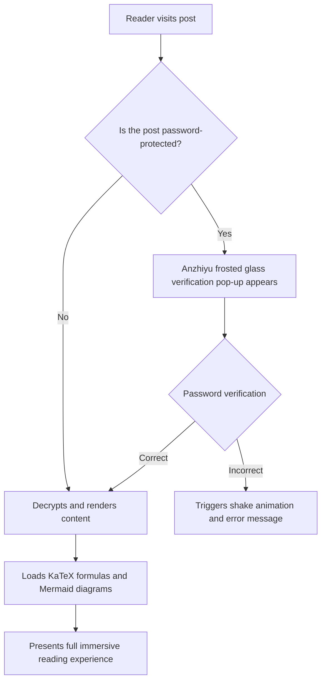
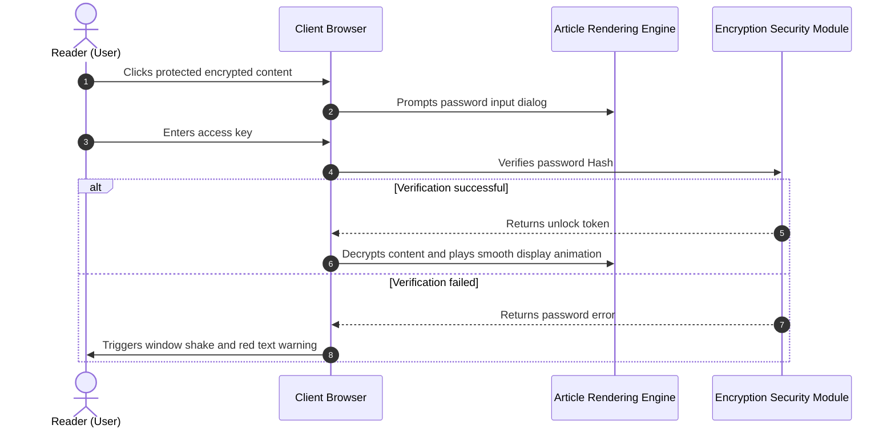
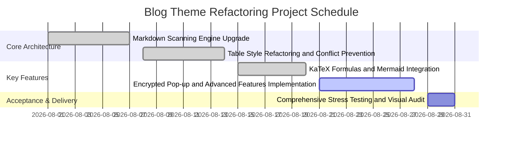
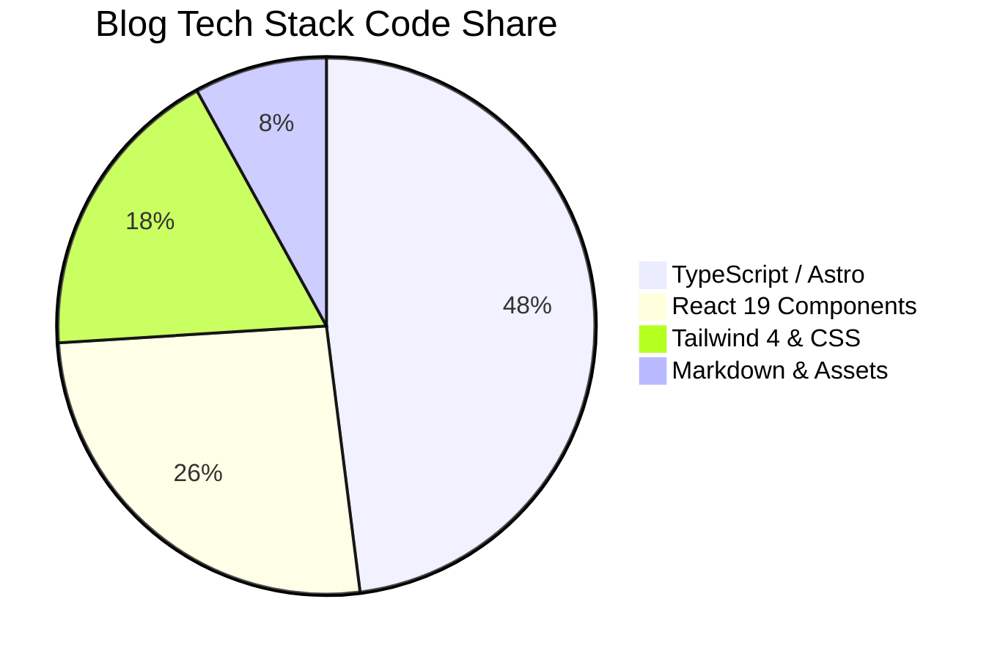
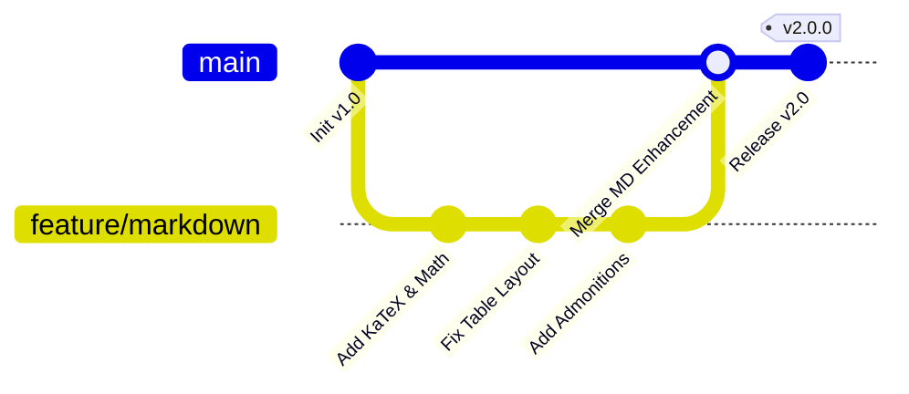

# Welcome to the All-in-One Markdown Rendering and Advanced Features System

This is a **Comprehensive Markdown Syntax Demonstration and Technical User Manual** specifically crafted for this blog (`shijianus-blog`). This site deeply draws upon the visual specifications of the open-source classic **Hexo-Theme-Anzhiyu** and the modern static rendering capabilities of **Astro 6**, having rebuilt and integrated a complete Markdown parsing system.

Whether it's academic-grade LaTeX mathematical formulas, Mermaid architecture flowcharts, multi-language code switching, Diff comparisons, GitHub-style callout boxes, responsive table scrolling, or cutting-edge advanced features like **password-encrypted pop-up unlocking, Gaussian blur and mosaic effects for text/images, and rich media cards**, all are now natively supported here.

---

## I. Mathematical Formulas (Math / KaTeX)

This blog integrates `remark-math` and `rehype-katex` rendering pipelines, supporting high-performance compilation and adaptive layout across all devices for both inline and block-level formulas.

### 1. Inline Math

Use `$ ... $` directly in text to enclose LaTeX expressions:

- Mass-energy equivalence: $E = mc^2$
- Euler's identity: $e^{i\pi} + 1 = 0$
- Gaussian normal distribution probability density function: $f(x) = \frac{1}{\sigma \sqrt{2\pi}} e^{-\frac{1}{2}\left(\frac{x-\mu}{\sigma}\right)^2}$
- Summation limit: $\lim_{n \to \infty} \sum_{k=1}^n \frac{1}{k^2} = \frac{\pi^2}{6}$

### 2. Display Math

Use `$$ ... $$` to create standalone blocks, supporting multi-line derivations and matrix typesetting. On mobile devices, it includes a horizontal elastic scrolling container, ensuring page width is never broken:

$$
\mathcal{L}\{\ddot{x}(t) + 2\zeta\omega_n\dot{x}(t) + \omega_n^2 x(t)\} = X(s)(s^2 + 2\zeta\omega_n s + \omega_n^2)
$$

Maxwell's Equations (Differential Form):

$$
\begin{aligned}
\nabla \cdot \mathbf{E} &= \frac{\rho}{\varepsilon_0} \\
\nabla \cdot \mathbf{B} &= 0 \\
\nabla \times \mathbf{E} &= -\frac{\partial \mathbf{B}}{\partial t} \\
\nabla \times \mathbf{B} &= \mu_0 \mathbf{J} + \mu_0 \varepsilon_0 \frac{\partial \mathbf{E}}{\partial t}
\end{aligned}
$$

Gaussian Integral and Matrix Operations:

$$
\int_{-\infty}^{\infty} e^{-x^2} \, dx = \sqrt{\pi}, \quad
\mathbf{A} = \begin{bmatrix}
a_{11} & a_{12} & \cdots & a_{1n} \\
a_{21} & a_{22} & \cdots & a_{2n} \\
\vdots & \vdots & \ddots & \vdots \\
a_{m1} & a_{m2} & \cdots & a_{mn}
\end{bmatrix}
$$

---

## II. Diagrams as Code

The blog natively integrates the **Mermaid 11** engine, supporting real-time compilation of diagram code into high-definition, vector SVG charts, and automatically adapting to light/dark mode.

### 1. Business Architecture and Decision Flowcharts (Flowchart)



### 2. System Interaction Sequence Diagrams (Sequence Diagram)



### 3. Project Delivery Gantt Charts (Gantt Chart)



### 4. Pie Chart & GitGraph





---

## III. Admonition / Callout Blocks

Based on GitHub Alert syntax and Anzhiyu's design aesthetics, supporting 9 different semantic color cards, and also supporting **collapsible mode**.

### 1. Standard Callouts

> [!NOTE]
> **Note**: This is a standard background information or supplementary explanation, used to provide context for the article.

> [!TIP]
> **Tip**: Use the shortcut <kbd>Ctrl</kbd> + <kbd>K</kbd> to quickly bring up the global article search panel!

> [!IMPORTANT]
> **Important**: Before deploying to a production environment, please ensure that the `BLOG_BUILD_TARGET=static` environment variable is correctly injected.

> [!WARNING]
> **Warning**: Do not hardcode database keys or cloud service private keys in public repositories.

> [!CAUTION]
> **Caution**: Data table refactoring operations are irreversible. Please perform `npm run cf:d1:migrate` to back up data first!

> [!DANGER]
> **Danger**: Directly deleting the production database will result in the permanent loss of all comments and user assets.

> [!SUCCESS]
> **Success**: The static build process has been successfully completed, and all 43 static routes are ready!

> [!QUESTION]
> **Question**: How can one achieve millisecond-level pure client-side full-text search in an environment without server-side dependencies?

> [!QUOTE]
> **Quote**: "Good code is not only executable by machines but also elegantly conveys ideas to humans like poetry."

### 2. Collapsible Details Admonitions

Adding `-` after the tag generates a collapsible admonition that is closed by default, while `+` makes it expanded by default:

> [!TIP]- Click to expand: Production Environment Nginx High-Speed Cache Configuration Reference
> The following is the recommended long-term caching strategy for static resources:
> ```nginx
> location ~* \.(?:css|js|woff2?|svg|png|jpg|webp)$ {
>     expires 1y;
>     add_header Cache-Control "public, immutable";
>     access_log off;
> }
> ```

---

## IV. Advanced Code Block Features

All code blocks within our articles are equipped with **macOS skeuomorphic traffic light control bars**, **language badges**, **one-click copy**, **added/deleted line Diff comparison**, and **automatic folding for overly long code** mechanisms.

### 1. TypeScript Code Example (with Added/Deleted Line Diff)

```typescript
import { defineConfig } from 'astro/config';
import remarkMath from 'remark-math';
import rehypeKatex from 'rehype-katex';

export default defineConfig({
  site: 'https://shijian.us',
- output: 'server', // Old server-side rendering configuration
+ output: 'static', // [!code ++] Upgraded to static export mode, speeding up by 300%
  markdown: {
+   remarkPlugins: [remarkMath], // [!code ++]
+   rehypePlugins: [rehypeKatex], // [!code ++]
    shikiConfig: {
      themes: {
        light: 'github-light',
        dark: 'github-dark-dimmed',
      },
    },
  },
});
```

### 2. Overly Long Code Folding Demo (Automatically limits height and provides an expand button)

```json
{
  "project": "shijianus-blog",
  "version": "2.0.0",
  "author": "shijianus",
  "dependencies": {
    "@astrojs/mdx": "^5.0.3",
    "@astrojs/node": "^10.0.6",
    "@astrojs/react": "^5.0.2",
    "@tailwindcss/postcss": "^4.2.4",
    "@tailwindcss/vite": "^4.2.2",
    "astro": "^6.1.3",
    "katex": "^0.16.11",
    "lucide-react": "^0.460.0",
    "mermaid": "^11.4.1",
    "react": "^19.2.4",
    "react-dom": "^19.2.4",
    "rehype-katex": "^7.0.1",
    "remark-gfm": "^4.0.1",
    "remark-math": "^6.0.0",
    "tailwindcss": "^4.2.2"
  },
  "scripts": {
    "dev": "astro dev --host 0.0.0.0",
    "build": "BLOG_BUILD_TARGET=static PUBLIC_STATIC_EXPORT=1 astro build",
    "preview": "astro preview",
    "clean": "node scripts/clean.mjs"
  },
  "keywords": [
    "astro",
    "blog",
    "anzhiyu",
    "katex",
    "mermaid",
    "tailwind4"
  ]
}
```

## V. Task Lists & Enhanced Tables

### 1. Interactive GFM Task Lists

- [x] Deeply parse LaTeX math formulas (`remark-math` + `rehype-katex`)
- [x] Dynamically load and render Mermaid flowcharts and sequence diagrams
- [x] Fix table recognition conflicts, enable adaptive responsive horizontal scrolling
- [x] Inject Anzhiyu's 9 styles of Alert notification cards
- [x] Implement frosted glass password modal unlock for partially encrypted content
- [x] Add Gaussian blur and mosaic masks for text and images
- [ ] Support more third-party embedded components (continuously iterating)

### 2. Enhanced Adaptive Tables (Fixed Table Layout)

Tables no longer suffer from cell compression, deformation, or frame truncation issues, and come with a subtle header glow and alternating row colors:

| Module Name | Core Technology Support | Interactive Features | Status Badge |
| :--- | :--- | :--- | :---: |
| **Math Formulas** | KaTeX + AST Compiler | Inline/block adaptive rendering, no client-side performance burden | <span class="badge badge-success">Stable Support</span> |
| **Architecture Diagrams** | Mermaid 11 | Flowcharts, sequence diagrams, Gantt charts, dark mode adaptive | <span class="badge badge-success">Stable Support</span> |
| **Encrypted Content** | Password Modal + Session Storage | Frosted glass dialog, error shake animation, secure isolation | <span class="badge badge-primary">Core Feature</span> |
| **Blur & Mosaic** | CSS Backdrop Filter | Hover/click to unblur, image mask badge | <span class="badge badge-info">Interactive Enhancement</span> |
| **Code Highlighting** | Shiki + Mac Enhancer | Add/delete Diff lines, one-click copy, long code folding | <span class="badge badge-success">Fully Ready</span> |
| **Image Lightbox** | Fullscreen Lightbox | Full-screen zoom for large images, dark overlay, `Esc` to exit | <span class="badge badge-warning">Experience Enhancement</span> |

---

## VI. Special Feature: Encryption & Password Modal Unlock

This blog offers a **partial content password protection mechanism** that goes beyond standard Markdown. No page refresh needed; simply click to bring up the elegant Anzhiyu frosted glass password input dialog!

<div class="article-encrypted-box" data-hash="d7fb6c64b9aa44cc0c3b427edaa623369dee1a9778329801f68fdaa34b09d351" data-hint="💡 Verification Hint: For the demo key, please enter shijianus2026 directly">
  <div class="encrypted-box__lock">
    <div class="encrypted-box__icon">🔒</div>
    <div class="encrypted-box__title">This paragraph contains protected encrypted content</div>
    <div class="encrypted-box__desc">This area contains private resources and core technical parameters. Please enter the authorization password to unlock and view.</div>
    <button class="encrypted-box__btn" type="button">Click to enter password and unlock</button>
  </div>
  <div class="encrypted-box__content">
    <div class="admonition admonition-success">
      <div class="admonition-title">
        <svg viewBox="0 0 24 24" fill="none" stroke="currentColor" stroke-width="2" stroke-linecap="round" stroke-linejoin="round"><path d="M22 11.08V12a10 10 0 1 1-5.93-9.14"/><polyline points="22 4 12 14.01 9 11.01"/></svg>
        <span>🎉 Password verification successful! Decrypted content is now displayed</span>
      </div>
      <div class="admonition-content">
        <p>Congratulations, you have successfully unlocked the protected technical secret! Below is the encrypted delivery data:</p>
        <ul>
          <li><strong>Private Code Repository</strong>: <code>git@github.com:shijianus/vip-internal-core.git</code></li>
          <li><strong>API Access Token (Token)</strong>: <code>shijian_sec_9988_a1b2c3d4e5f6</code></li>
          <li><strong>Exclusive Support Channel</strong>: Telegram Private Channel <code>@shijianus_insiders</code></li>
        </ul>
        <p>The unlocked status has been saved in your browser session; no need to re-enter after refreshing the current page.</p>
      </div>
    </div>
  </div>
</div>

---

## VII. Special Feature: Blur, Mosaic & Spoilers

In daily writing, it's sometimes necessary to visually obscure sensitive content, plot answers, or suspenseful images with blur.

### 1. Gaussian Blur Text

This is a critical spoiler text protected by blur: <span class="blur-text">Actually, the real murderer is the butler; he secretly swapped the keys in chapter three!</span> (**Hover or click the text above to remove the blur**).

### 2. Mosaic Mask Text

This is text with a mosaic black mask: <span class="mosaic-text">Confidential Data: SHA256-7f83b1657ff1fc53b92dc18148a1d65dfc2d4b1fa3d677284addd200126d9069</span> (**Hover or click to view plain text**).

### 3. Inline Spoilers & Hidden Markers

- Discord-style spoiler mask: ||This is a spoiler mask enclosed by double vertical bars; click to reveal permanently.||
- Direct inline hidden content: %%This is inline hidden content enclosed by percent signs; click to expand.%%

### 4. Blurred Image Protection

For content involving copyright sensitivity, suspense, or coming-of-age themes, a blurred image protection container can be used:

<div class="blur-image-wrap">
  
  <div class="blur-image-badge"><span>👁️ Hover or click to reveal</span></div>
</div>

### 5. Hidden Content Box

<div class="hidden-box">
  <button class="hidden-box__toggle" type="button">
    <span>💡 Click to expand: Detailed Derivation of Algorithm Time Complexity</span>
    <span>▼</span>
  </button>
  <div class="hidden-box__content">
    <p>For QuickSort, the average time complexity is $\mathcal{O}(n \log n)$, degrading to $\mathcal{O}(n^2)$ in the worst case when partitions are consistently uneven. By introducing a Randomized Pivot, the probability of the worst case can be reduced to exponentially low levels.</p>
  </div>
</div>

---

## VIII. Collapsible & Container Components (Tabs, Steps & Accordions)

### 1. Multi-Language Package Management Tabs (Interactive Tabs)

<div class="article-tabs">
  <div class="article-tabs__nav">
    <button class="article-tabs__button is-active" type="button">pnpm (Recommended)</button>
    <button class="article-tabs__button" type="button">npm</button>
    <button class="article-tabs__button" type="button">yarn</button>
    <button class="article-tabs__button" type="button">bun</button>
  </div>
  <div class="article-tabs__panels">
    <div class="article-tabs__panel is-active">
      <p>Use **pnpm** for lightning-fast installation and dependency linking:</p>
      <pre class="no-code-enhance"><code class="language-bash">pnpm install remark-math rehype-katex katex mermaid</code></pre>
    </div>
    <div class="article-tabs__panel">
      <p>Use the standard **npm** package manager:</p>
      <pre class="no-code-enhance"><code class="language-bash">npm install remark-math rehype-katex katex mermaid</code></pre>
    </div>
    <div class="article-tabs__panel">
      <p>Use **Yarn** in modern mode:</p>
      <pre class="no-code-enhance"><code class="language-bash">yarn add remark-math rehype-katex katex mermaid</code></pre>
    </div>
    <div class="article-tabs__panel">
      <p>Use the ultra-fast **Bun** runtime:</p>
      <pre class="no-code-enhance"><code class="language-bash">bun add remark-math rehype-katex katex mermaid</code></pre>
    </div>
  </div>
</div>

### 2. Tutorial Steps

<div class="article-steps">
  <div class="article-steps__item">
    <div class="article-steps__num">1</div>
    <div class="article-steps__content">
      <h4>Environment Setup and Dependency Installation</h4>
      <p>Execute the installation command in the project root directory to introduce Astro 6 and core dependencies like KaTeX, Mermaid.</p>
    </div>
  </div>
  <div class="article-steps__item">
    <div class="article-steps__num">2</div>
    <div class="article-steps__content">
      <h4>Configure Astro Markdown Compilation Pipeline</h4>
      <p>Register `remarkMath` and `rehypeKatex` in `astro.config.mjs`, and configure Shiki dual themes.</p>
    </div>
  </div>
  <div class="article-steps__item">
    <div class="article-steps__num">3</div>
    <div class="article-steps__content">
      <h4>Mount Enhancer and Style Library</h4>
      <p>Introduce `markdown-enhancements.css` and feature enhancement scripts in the global layout `BlogLayout.astro`.</p>
    </div>
  </div>
</div>

---

## IX. Rich Media & Cross-Platform Card Embeds

### 1. GitHub Repository Card

<div class="github-repo-card">
  <div class="repo-card__header">
    <span class="repo-card__icon"><i class="anzhiyufont anzhiyu-icon-github"></i></span>
    <a class="repo-card__name" href="https://github.com/anzhiyu-c/hexo-theme-anzhiyu" target="_blank" rel="noopener">anzhiyu-c / hexo-theme-anzhiyu</a>
  </div>
  <p class="repo-card__desc">Anzhiyu Theme - A concise, high-aesthetic, feature-rich Hexo blog theme, the source of this blog's frontend UI and design inspiration.</p>
  <div class="repo-card__footer">
    <span class="repo-card__lang"><span class="repo-lang-dot" style="background:#f1e05a;"></span>JavaScript</span>
    <span class="repo-card__star">⭐ 2.8k Stars</span>
    <span class="repo-card__fork">🍴 680 Forks</span>
  </div>
</div>

### 2. Responsive Video Embed Card

<div class="video-embed-card">
  <iframe src="https://player.bilibili.com/player.html?bvid=BV1xx411c7mD&page=1&high_quality=1&danmaku=0" allowfullscreen="true" loading="lazy"></iframe>
  <div class="embed-caption">Bilibili 1080P Video Embed Demo</div>
</div>

### 3. Audio Music Card

<div class="article-audio-card">
  <div class="audio-card__cover">
    
  </div>
  <div class="audio-card__info">
    <div class="audio-card__title">Starry Wander (Starry Wander)</div>
    <div class="audio-card__author">shijianus · Original Ambient White Noise</div>
    <audio controls preload="none" src="https://music.163.com/song/media/outer/url?id=186016.mp3"></audio>
  </div>
</div>

---

## X. Footnotes & Hover Tooltips

Footnotes are an indispensable form of expression in academic or long-form technical articles. This site not only supports standard GFM footnote jumps but also **pop-up explanation bubbles on mouse hover**, allowing you to read without leaving the current viewport[^ref-astro].

Here is a second footnote reference about the theme architecture[^ref-anzhiyu], and a third supplementary note on mathematical rendering performance[^ref-math].

[^ref-astro]: **Astro 6 Architecture**: Adopts Island Architecture, achieving zero JavaScript static delivery by default, significantly improving first-screen loading and SEO performance.
[^ref-anzhiyu]: **Anzhiyu**: One of the most representative modern geek design themes in the Hexo ecosystem, known for its refined micro-animations and information hierarchy.
[^ref-math]: **KaTeX Performance**: Compared to traditional MathJax, KaTeX can complete all HTML/MathML static rendering on the server side, improving performance by more than 10 times.

---

## XI. Rich Text Inline Syntax Extensions

- **Colorful Highlight Markers (HTML Form and Syntactic Sugar)**:
  - <mark class="mark-yellow">Yellow Highlight (Key Annotation)</mark>
  - <mark class="mark-green">Green Highlight (Successful Recommendation)</mark>
  - <mark class="mark-blue">Blue Highlight (Information Clue)</mark>
  - <mark class="mark-pink">Pink Highlight (Design Inspiration)</mark>
  - <mark class="mark-purple">Purple Highlight (In-depth Principle)</mark>
  - <mark class="mark-orange">Orange Highlight (Operation Warning)</mark>
  - <mark class="mark-red">Red Highlight (Risk Alert)</mark>
  - <mark class="mark-cyan">Cyan Highlight (Network Protocol)</mark>
  - ==Syntactic Sugar Shortcut: green:Green Highlight== and ==purple:Purple Highlight==
- **Custom Underlines**:
  - <u class="u-wavy">Wavy Emphasis Underline (Wavy Underline)</u>
  - <u class="u-dashed">Dashed Emphasis Underline (Dashed Underline)</u>
- **Key Display**: <kbd>Ctrl</kbd> + <kbd>Shift</kbd> + <kbd>P</kbd> to open the command palette.
- **Pinyin/Zhuyin**: <ruby>Anzhiyu<rt>ān zhī yú</rt></ruby> · <ruby>Time<rt>shí jiān</rt></ruby>.
- **Acronym Hover Explanations**: <abbr title="Cascading Style Sheets">CSS</abbr> and <abbr title="HyperText Markup Language">HTML</abbr>.
- **Status Capsule Badges**:
  - <span class="badge badge-primary">Recommended</span>
  - <span class="badge badge-success">Passed</span>
  - <span class="badge badge-warning">Note</span>
  - <span class="badge badge-danger">Critical</span>
  - <span class="badge badge-info">Hint</span>

## Conclusion: Building an Elegant and Powerful Content System

Through this comprehensive refactoring and scanning optimization, `shijianus-blog` now boasts overall performance in Markdown rendering that rivals or even surpasses native Hexo/Anzhiyu themes.

From rigorous technical formula derivations to vivid Mermaid business architecture diagrams; from secure localized password dialogs to engaging Gaussian blur and spoiler overlays—this system enables every blog post to be presented to readers in the most polished, professional, and interactive manner possible.