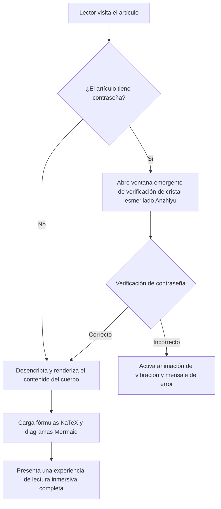
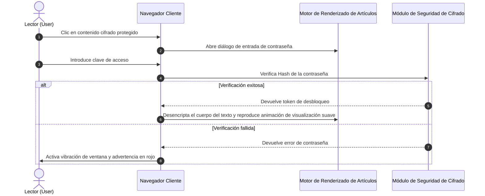
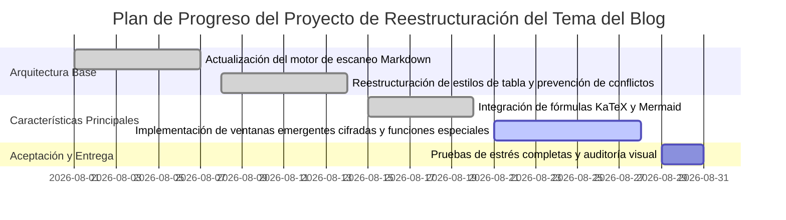
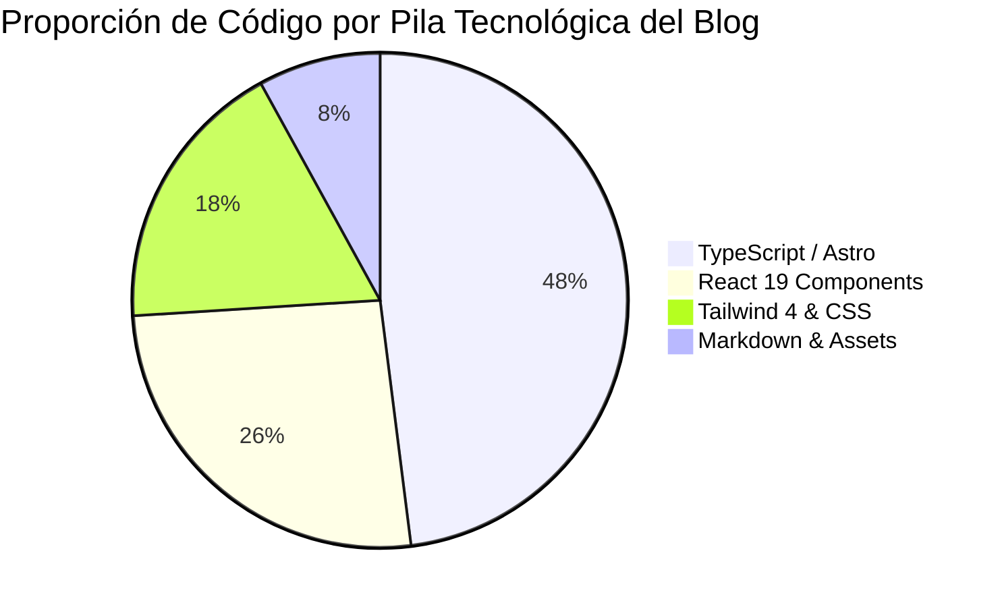
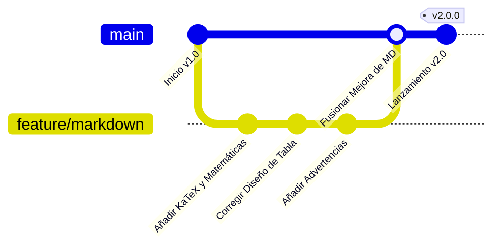

# Bienvenido al sistema de renderizado Markdown todo en uno y funciones especiales

Este es un **manual de uso técnico y demostración de sintaxis Markdown completa** creado específicamente para este blog (`shijianus-blog`). Este sitio ha absorbido profundamente las especificaciones visuales del clásico de código abierto **Hexo-Theme-Anzhiyu** y las capacidades de renderizado estático moderno de **Astro 6**, reconstruyendo e integrando un sistema completo de análisis de Markdown.

Ya sean fórmulas matemáticas LaTeX de nivel académico, diagramas de flujo de arquitectura Mermaid, cambio de código multilingüe, comparación de diferencias Diff, cuadros de notificación estilo GitHub, desplazamiento adaptable de tablas, o funciones especiales de vanguardia como **desbloqueo de ventanas emergentes con contraseña cifrada, desenfoque gaussiano y mosaico de texto/imágenes, y tarjetas de medios enriquecidos**, todo ha recibido soporte nativo aquí.

---

## I. Fórmulas Matemáticas (Math / KaTeX)

Este blog integra las tuberías de renderizado `remark-math` y `rehype-katex`, que soportan la compilación de alto rendimiento y el diseño adaptable a todos los dispositivos para fórmulas en línea y en bloque.

### 1. Fórmulas Matemáticas en Línea (Inline Math)

Utilice `$ ... $` directamente en el texto para envolver expresiones LaTeX:

- Ecuación de masa-energía: $E = mc^2$
- Identidad de Euler: $e^{i\pi} + 1 = 0$
- Función de densidad de probabilidad normal gaussiana: $f(x) = \frac{1}{\sigma \sqrt{2\pi}} e^{-\frac{1}{2}\left(\frac{x-\mu}{\sigma}\right)^2}$
- Límite de la suma: $\lim_{n \to \infty} \sum_{k=1}^n \frac{1}{k^2} = \frac{\pi^2}{6}$

### 2. Fórmulas Matemáticas en Bloque (Display Math)

Utilice `$$ ... $$` para crear bloques independientes, soportando derivaciones de varias líneas y diseño de matrices. En dispositivos móviles, incluye un contenedor de desplazamiento horizontal elástico para no romper el ancho de la página:

$$
\mathcal{L}\{\ddot{x}(t) + 2\zeta\omega_n\dot{x}(t) + \omega_n^2 x(t)\} = X(s)(s^2 + 2\zeta\omega_n s + \omega_n^2)
$$

Ecuaciones de Maxwell (forma diferencial):

$$
\begin{aligned}
\nabla \cdot \mathbf{E} &= \frac{\rho}{\varepsilon_0} \\
\nabla \cdot \mathbf{B} &= 0 \\
\nabla \times \mathbf{E} &= -\frac{\partial \mathbf{B}}{\partial t} \\
\nabla \times \mathbf{B} &= \mu_0 \mathbf{J} + \mu_0 \varepsilon_0 \frac{\partial \mathbf{E}}{\partial t}
\end{aligned}
$$

Integral de Gauss y operaciones matriciales:

$$
\int_{-\infty}^{\infty} e^{-x^2} \, dx = \sqrt{\pi}, \quad
\mathbf{A} = \begin{bmatrix}
a_{11} & a_{12} & \cdots & a_{1n} \\
a_{21} & a_{22} & \cdots & a_{2n} \\
\vdots & \vdots & \ddots & \vdots \\
a_{m1} & a_{m2} & \cdots & a_{mn}
\end{bmatrix}
$$

---

## II. Diagramas y Bloques de Código de Dibujo (Diagrams as Code)

El blog integra de forma nativa el motor **Mermaid 11**, que soporta la compilación en tiempo real de código de diagramas en gráficos SVG vectoriales de alta definición, y se adapta automáticamente a los modos claro/oscuro.

### 1. Diagrama de Flujo de Arquitectura de Negocio y Decisión (Flowchart)



### 2. Diagrama de Secuencia de Interacción del Sistema (Sequence Diagram)



### 3. Diagrama de Gantt de Entrega del Proyecto (Gantt Chart)



### 4. Gráfico de Pastel y Gráfico de Versiones (Pie Chart & GitGraph)





---

## Tres. Cuadros de Aviso y Bloques de Sugerencia (Admonition / Callout)

Basado en la sintaxis de Alerta de GitHub y la estética de diseño de Anzhiyu, soporta 9 tipos de tarjetas de colores con diferentes semánticas, y también soporta el **modo plegable**.

### 1. Cuadros de Aviso Estándar (Standard Callouts)

> [!NOTA]
> **Nota General (Note)**: Esta es una información de fondo estándar o una aclaración complementaria, utilizada para proporcionar contexto al artículo.

> [!CONSEJO]
> **Consejo Práctico (Tip)**: ¡Usa el atajo de teclado <kbd>Ctrl</kbd> + <kbd>K</kbd> para abrir rápidamente el panel de búsqueda global de artículos!

> [!IMPORTANTE]
> **Asunto Importante (Important)**: Antes de desplegar en un entorno de producción, asegúrate de que la variable de entorno `BLOG_BUILD_TARGET=static` se haya inyectado correctamente.

> [!ADVERTENCIA]
> **Advertencia de Riesgo (Warning)**: No codifiques directamente claves de bases de datos o claves privadas de servicios en la nube en repositorios públicos.

> [!PRECAUCIÓN]
> **Advertencia de Peligro (Caution)**: La operación de refactorización de tablas de datos es irreversible, ¡ejecuta primero `npm run cf:d1:migrate` para hacer una copia de seguridad de los datos!

> [!PELIGRO]
> **Peligro Mortal (Danger)**: Eliminar directamente la base de datos de producción resultará en la pérdida permanente de todos los comentarios y activos de usuario.

> [!ÉXITO]
> **Operación Exitosa (Success)**: ¡El proceso de construcción estática se ha completado con éxito, todas las 43 rutas estáticas están listas!

> [!PREGUNTA]
> **Pregunta de Discusión (Question)**: ¿Cómo implementar una búsqueda de texto completo puramente del lado del cliente en milisegundos en un entorno sin dependencias de servidor?

> [!CITA]
> **Cita Destacada (Quote)**: "El buen código no solo puede ser ejecutado por máquinas, sino que también puede transmitir ideas a los humanos con la elegancia de la poesía."

### 2. Cuadros de Aviso Plegables (Collapsible Details Admonitions)

Añade `-` después de la etiqueta para generar un cuadro de aviso plegable que se cierra por defecto, y `+` para que se expanda por defecto:

> [!CONSEJO]- Haz clic para expandir: Referencia de Configuración de Caché Ultrarrápida de Nginx en Entorno de Producción
> A continuación se presenta la estrategia recomendada para el almacenamiento en caché a largo plazo de recursos estáticos:
> ```nginx
> location ~* \.(?:css|js|woff2?|svg|png|jpg|webp)$ {
>     expires 1y;
>     add_header Cache-Control "public, immutable";
>     access_log off;
> }
> ```

---

## Cuatro. Funcionalidades Avanzadas de Bloques de Código (Advanced Code Blocks)

Hemos dotado a todos los bloques de código dentro de los artículos con **barras de control de semáforo de macOS (skeuomorphic)**, **insignias de lenguaje**, **copia con un clic**, **comparación Diff de líneas añadidas/eliminadas** y un mecanismo de **plegado automático para código muy largo**.

### 1. Ejemplo de Código TypeScript (con Diff de Líneas Añadidas/Eliminadas)

```typescript
import { defineConfig } from 'astro/config';
import remarkMath from 'remark-math';
import rehypeKatex from 'rehype-katex';

export default defineConfig({
  site: 'https://shijian.us',
- output: 'server', // Antigua configuración de renderizado del lado del servidor
+ output: 'static', // [!code ++] Actualizado a modo de exportación estática, acelera un 300%
  markdown: {
+   remarkPlugins: [remarkMath], // [!code ++]
+   rehypePlugins: [rehypeKatex], // [!code ++]
    shikiConfig: {
      themes: {
        light: 'github-light',
        dark: 'github-dark-dimmed',
      },
    },
  },
});
```

### 2. Demostración de Plegado de Código Muy Largo (con Altura Limitada Automáticamente y Botón de Expandir)

```json
{
  "project": "shijianus-blog",
  "version": "2.0.0",
  "author": "shijianus",
  "dependencies": {
    "@astrojs/mdx": "^5.0.3",
    "@astrojs/node": "^10.0.6",
    "@astrojs/react": "^5.0.2",
    "@tailwindcss/postcss": "^4.2.4",
    "@tailwindcss/vite": "^4.2.2",
    "astro": "^6.1.3",
    "katex": "^0.16.11",
    "lucide-react": "^0.460.0",
    "mermaid": "^11.4.1",
    "react": "^19.2.4",
    "react-dom": "^19.2.4",
    "rehype-katex": "^7.0.1",
    "remark-gfm": "^4.0.1",
    "remark-math": "^6.0.0",
    "tailwindcss": "^4.2.2"
  },
  "scripts": {
    "dev": "astro dev --host 0.0.0.0",
    "build": "BLOG_BUILD_TARGET=static PUBLIC_STATIC_EXPORT=1 astro build",
    "preview": "astro preview",
    "clean": "node scripts/clean.mjs"
  },
  "keywords": [
    "astro",
    "blog",
    "anzhiyu",
    "katex",
    "mermaid",
    "tailwind4"
  ]
}
```

## V. Mejora Completa de Listas de Tareas y Tablas (Task Lists & Tables)

### 1. Listas de Tareas GFM Interactivas (Task Lists)

- [x] Análisis profundo de fórmulas matemáticas LaTeX (`remark-math` + `rehype-katex`)
- [x] Carga y renderizado dinámico de diagramas de flujo y secuencia Mermaid
- [x] Corrección de conflictos de reconocimiento de tablas, implementación de desplazamiento horizontal responsivo y adaptativo
- [x] Inyección de 9 estilos de tarjetas de notificación de alerta An Zhi Yu
- [x] Implementación de desbloqueo de contenido cifrado parcial con ventana emergente de contraseña de efecto cristal esmerilado
- [x] Adición de desenfoque gaussiano y máscara de mosaico para texto e imágenes
- [ ] Soporte para más componentes incrustados de terceros (en iteración continua)

### 2. Tablas Adaptativas Mejoradas (Fixed Table Layout)

Las tablas ya no presentan problemas de compresión o truncamiento de celdas, y vienen con un sutil brillo en el encabezado y alternancia de color en las filas:

| Nombre del Módulo | Soporte Tecnológico Clave | Características Interactivas | Estado |
| :--- | :--- | :--- | :---: |
| **Fórmulas Matemáticas** | KaTeX + Compilador AST | Renderizado adaptativo en línea/bloque, sin carga de rendimiento para el cliente | <span class="badge badge-success">Soporte Estable</span> |
| **Diagramas de Arquitectura** | Mermaid 11 | Diagramas de flujo, de secuencia, de Gantt, adaptativos al modo oscuro | <span class="badge badge-success">Soporte Estable</span> |
| **Contenido Cifrado** | Ventana emergente de contraseña + Almacenamiento de Sesión | Diálogo de cristal esmerilado, animación de vibración de error, aislamiento seguro | <span class="badge badge-primary">Característica Clave</span> |
| **Desenfoque y Mosaico** | Filtro de Fondo CSS | Desenfoque al pasar el ratón/clic, insignia de máscara de imagen | <span class="badge badge-info">Mejora Interactiva</span> |
| **Resaltado de Código** | Shiki + Mac Enhancer | Líneas Diff de adición/eliminación, copiar con un clic, plegado de código largo | <span class="badge badge-success">Listo y Completo</span> |
| **Lightbox de Imágenes** | Lightbox de Pantalla Completa | Zoom de imagen grande a pantalla completa, superposición oscura, salir con `Esc` | <span class="badge badge-warning">Mejora de Experiencia</span> |

---

## VI. Función Especial: Contenido Cifrado y Desbloqueo con Ventana Emergente de Contraseña (Encryption & Password Modal)

Este blog ofrece un **mecanismo de protección de contenido parcial con contraseña** que va más allá del Markdown ordinario. ¡Sin necesidad de recargar la página, un clic puede activar el elegante cuadro de diálogo de entrada de contraseña de cristal esmerilado de An Zhi Yu!

<div class="article-encrypted-box" data-hash="d7fb6c64b9aa44cc0c3b427edaa623369dee1a9778329801f68fdaa34b09d351" data-hint="💡 Sugerencia de verificación: Para la clave de demostración, simplemente ingrese shijianus2026">
  <div class="encrypted-box__lock">
    <div class="encrypted-box__icon">🔒</div>
    <div class="encrypted-box__title">Este párrafo contiene contenido cifrado protegido</div>
    <div class="encrypted-box__desc">Esta área contiene recursos privados y parámetros técnicos clave. Ingrese la contraseña autorizada para desbloquear y ver.</div>
    <button class="encrypted-box__btn" type="button">Haga clic para ingresar la contraseña y desbloquear</button>
  </div>
  <div class="encrypted-box__content">
    <div class="admonition admonition-success">
      <div class="admonition-title">
        <svg viewBox="0 0 24 24" fill="none" stroke="currentColor" stroke-width="2" stroke-linecap="round" stroke-linejoin="round"><path d="M22 11.08V12a10 10 0 1 1-5.93-9.14"/><polyline points="22 4 12 14.01 9 11.01"/></svg>
        <span>🎉 ¡Verificación de contraseña exitosa! Contenido descifrado presentado</span>
      </div>
      <div class="admonition-content">
        <p>¡Felicidades! Ha desbloqueado con éxito el secreto técnico protegido. A continuación, se presentan los datos de entrega cifrados:</p>
        <ul>
          <li><strong>Repositorio de Código Privado</strong>: <code>git@github.com:shijianus/vip-internal-core.git</code></li>
          <li><strong>Token de Acceso a la API (Token)</strong>: <code>shijian_sec_9988_a1b2c3d4e5f6</code></li>
          <li><strong>Canal de Soporte Exclusivo</strong>: Canal privado de Telegram <code>@shijianus_insiders</code></li>
        </ul>
        <p>El estado de desbloqueo se ha guardado en su sesión del navegador; no es necesario volver a introducirlo después de actualizar la página actual.</p>
      </div>
    </div>
  </div>
</div>

---

## VII. Función Especial: Desenfoque Gaussiano, Mosaico y Ocultación de Spoilers (Blur, Mosaic & Spoilers)

En la escritura diaria, a veces es necesario aplicar un desenfoque visual o una máscara a contenido sensible, respuestas de la trama o imágenes de suspenso.

### 1. Texto con Desenfoque Gaussiano (Gaussian Blur Text)

Este es un texto clave de spoiler protegido por desenfoque: <span class="blur-text">¡En realidad, el verdadero asesino es el mayordomo, quien ya había cambiado la llave en secreto en el tercer capítulo!</span> (**Pase el ratón o haga clic en el texto de arriba para eliminar el desenfoque**).

### 2. Texto con Máscara de Mosaico (Mosaic Mask Text)

Este es un texto con una máscara de mosaico negro: <span class="mosaic-text">Datos confidenciales: SHA256-7f83b1657ff1fc53b92dc18148a1d65dfc2d4b1fa3d677284addd200126d9069</span> (**Pase el ratón o haga clic para ver el texto sin formato**).

### 3. Spoilers en Línea y Marcadores Ocultos

- Máscara de spoiler estilo Discord: ||Este es un spoiler oculto entre dobles barras verticales, haga clic para revelarlo permanentemente.||
- Contenido oculto en línea directo: %%Aquí hay contenido oculto en línea envuelto en signos de porcentaje, haga clic para expandir.%%

### 4. Protección de Imagen Borrosa (Blurred Image Protection)

Para contenido sensible a derechos de autor, de suspense o para adultos, se puede usar un contenedor de protección de imagen borrosa:

<div class="blur-image-wrap">
  
  <div class="blur-image-badge"><span>👁️ Pasa el ratón o haz clic para desvelar</span></div>
</div>

### 5. Caja de Contenido Oculto (Hidden Content Box)

<div class="hidden-box">
  <button class="hidden-box__toggle" type="button">
    <span>💡 Haz clic para expandir: Derivación detallada de la complejidad temporal de algoritmos</span>
    <span>▼</span>
  </button>
  <div class="hidden-box__content">
    <p>Para el algoritmo de ordenación rápida (QuickSort), la complejidad temporal promedio es $\mathcal{O}(n \log n)$, y en el peor de los casos, cuando cada partición es desigual, degenera a $\mathcal{O}(n^2)$. Al introducir un pivote aleatorio (Randomized Pivot), la probabilidad del peor caso puede reducirse exponencialmente.</p>
  </div>
</div>

---

## Ocho. Componentes de Plegado y Contenedor (Tabs, Steps & Accordions)

### 1. Pestañas Interactivas (Interactive Tabs)

<div class="article-tabs">
  <div class="article-tabs__nav">
    <button class="article-tabs__button is-active" type="button">pnpm (recomendado)</button>
    <button class="article-tabs__button" type="button">npm</button>
    <button class="article-tabs__button" type="button">yarn</button>
    <button class="article-tabs__button" type="button">bun</button>
  </div>
  <div class="article-tabs__panels">
    <div class="article-tabs__panel is-active">
      <p>Usa <strong>pnpm</strong> para instalar y enlazar dependencias rápidamente:</p>
      <pre class="no-code-enhance"><code class="language-bash">pnpm install remark-math rehype-katex katex mermaid</code></pre>
    </div>
    <div class="article-tabs__panel">
      <p>Usa el gestor de paquetes estándar <strong>npm</strong>:</p>
      <pre class="no-code-enhance"><code class="language-bash">npm install remark-math rehype-katex katex mermaid</code></pre>
    </div>
    <div class="article-tabs__panel">
      <p>Usa el modo moderno de <strong>Yarn</strong>:</p>
      <pre class="no-code-enhance"><code class="language-bash">yarn add remark-math rehype-katex katex mermaid</code></pre>
    </div>
    <div class="article-tabs__panel">
      <p>Usa el entorno de ejecución ultrarrápido <strong>Bun</strong>:</p>
      <pre class="no-code-enhance"><code class="language-bash">bun add remark-math rehype-katex katex mermaid</code></pre>
    </div>
  </div>
</div>

### 2. Pasos del Tutorial (Tutorial Steps)

<div class="article-steps">
  <div class="article-steps__item">
    <div class="article-steps__num">1</div>
    <div class="article-steps__content">
      <h4>Preparación del Entorno e Instalación de Dependencias</h4>
      <p>Ejecuta el comando de instalación en el directorio raíz del proyecto para incluir Astro 6 y los paquetes de dependencias principales de KaTeX y Mermaid.</p>
    </div>
  </div>
  <div class="article-steps__item">
    <div class="article-steps__num">2</div>
    <div class="article-steps__content">
      <h4>Configuración del Pipeline de Compilación Markdown de Astro</h4>
      <p>Registra <code>remarkMath</code> y <code>rehypeKatex</code> en <code>astro.config.mjs</code>, y configura los dos temas de Shiki.</p>
    </div>
  </div>
  <div class="article-steps__item">
    <div class="article-steps__num">3</div>
    <div class="article-steps__content">
      <h4>Montaje del Mejorador y la Biblioteca de Estilos</h4>
      <p>Incluye <code>markdown-enhancements.css</code> y los scripts de mejora de características en el diseño global <code>BlogLayout.astro</code>.</p>
    </div>
  </div>
</div>

---

## Nueve. Incrustaciones y Tarjetas Multimedia (Embeds & Media Cards)

### 1. Tarjeta de Repositorio de GitHub

<div class="github-repo-card">
  <div class="repo-card__header">
    <span class="repo-card__icon"><i class="anzhiyufont anzhiyu-icon-github"></i></span>
    <a class="repo-card__name" href="https://github.com/anzhiyu-c/hexo-theme-anzhiyu" target="_blank" rel="noopener">anzhiyu-c / hexo-theme-anzhiyu</a>
  </div>
  <p class="repo-card__desc">Tema Anzhiyu - Un tema de blog Hexo conciso, estéticamente agradable y rico en funciones, la interfaz de usuario frontend y la fuente de inspiración de diseño de este blog.</p>
  <div class="repo-card__footer">
    <span class="repo-card__lang"><span class="repo-lang-dot" style="background:#f1e05a;"></span>JavaScript</span>
    <span class="repo-card__star">⭐ 2.8k Estrellas</span>
    <span class="repo-card__fork">🍴 680 Bifurcaciones</span>
  </div>
</div>

### 2. Tarjeta de Video Responsiva (Embed)

<div class="video-embed-card">
  <iframe src="https://player.bilibili.com/player.html?bvid=BV1xx411c7mD&page=1&high_quality=1&danmaku=0" allowfullscreen="true" loading="lazy"></iframe>
  <div class="embed-caption">Demostración de incrustación de video Bilibili 1080P</div>
</div>

### 3. Tarjeta de Audio Musical

<div class="article-audio-card">
  <div class="audio-card__cover">
    
  </div>
  <div class="audio-card__info">
    <div class="audio-card__title">Viaje Estelar (Starry Wander)</div>
    <div class="audio-card__author">shijianus · Ruido blanco ambiental original</div>
    <audio controls preload="none" src="https://music.163.com/song/media/outer/url?id=186016.mp3"></audio>
  </div>
</div>

---

## Diez. Notas al Pie y Vistas Previas de Burbujas Flotantes

En artículos académicos o técnicos extensos, las notas al pie son una forma de expresión indispensable. Este sitio no solo admite los saltos de nota al pie estándar de GFM, sino que también permite que **aparezcan burbujas de definición al pasar el ratón** sobre ellas, lo que permite la lectura sin salir de la vista actual[^ref-astro].

Aquí hay una segunda referencia a una nota al pie sobre la arquitectura del tema[^ref-anzhiyu], y una tercera nota complementaria sobre el rendimiento de la renderización matemática[^ref-math].

[^ref-astro]: **Arquitectura Astro 6**: Adopta la Arquitectura de Islas (Island Architecture), logrando una entrega estática predeterminada sin JavaScript, lo que mejora significativamente la carga de la primera pantalla y el rendimiento SEO.
[^ref-anzhiyu]: **Anzhiyu**: Uno de los temas de diseño geek modernos más representativos en el ecosistema Hexo, conocido por sus microanimaciones refinadas y su jerarquía de información.
[^ref-math]: **Rendimiento de KaTeX**: En comparación con el MathJax tradicional, KaTeX puede completar toda la renderización estática de HTML/MathML en el lado del servidor, mejorando el rendimiento en más de 10 veces.

---

## Once. Extensiones de Sintaxis en Línea de Texto Enriquecido

- **Marcadores de Resaltado Multicolor (Formato HTML y Azúcar Sintáctico)**:
  - <mark class="mark-yellow">Resaltado amarillo (énfasis)</mark>
  - <mark class="mark-green">Resaltado verde (recomendación exitosa)</mark>
  - <mark class="mark-blue">Resaltado azul (pista de información)</mark>
  - <mark class="mark-pink">Resaltado rosa (inspiración de diseño)</mark>
  - <mark class="mark-purple">Resaltado morado (principio profundo)</mark>
  - <mark class="mark-orange">Resaltado naranja (advertencia de operación)</mark>
  - <mark class="mark-red">Resaltado rojo (advertencia de riesgo)</mark>
  - <mark class="mark-cyan">Resaltado cian (protocolo de red)</mark>
  - ==Azúcar sintáctico rápido: green:Resaltado verde== y ==purple:Resaltado morado==
- **Subrayados Personalizados**:
  - <u class="u-wavy">Subrayado ondulado de énfasis (Wavy Underline)</u>
  - <u class="u-dashed">Subrayado de énfasis con línea discontinua (Dashed Underline)</u>
- **Visualización de Teclas**: <kbd>Ctrl</kbd> + <kbd>Shift</kbd> + <kbd>P</kbd> para abrir el panel de comandos.
- **Pinyin/Zhuyin**: <ruby>安知鱼<rt>ān zhī yú</rt></ruby> · <ruby>時間<rt>shí jiān</rt></ruby>。
- **Explicación Flotante de Abreviaturas**: <abbr title="Cascading Style Sheets Hojas de Estilo en Cascada">CSS</abbr> y <abbr title="HyperText Markup Language Lenguaje de Marcado de Hipertexto">HTML</abbr>.
- **Insignias de Estado en Cápsula**:
  - <span class="badge badge-primary">Recomendado</span>
  - <span class="badge badge-success">Aprobado</span>
  - <span class="badge badge-warning">Atención</span>
  - <span class="badge badge-danger">Grave</span>
  - <span class="badge badge-info">Sugerencia</span>

## Conclusión: Construyendo un sistema de contenido elegante y potente

Gracias a esta refactorización completa y optimización de escaneo, `shijianus-blog` ha logrado una capacidad comparable e incluso superior a los temas nativos de Hexo/Anzhiyu en el ámbito de la renderización de Markdown.

Desde rigurosas derivaciones de fórmulas técnicas hasta vívidos diagramas de arquitectura de negocio con Mermaid; desde diálogos de contraseña locales seguros hasta el divertido desenfoque gaussiano y las máscaras de spoiler, este sistema permite que cada artículo del blog pueda presentarse a los lectores de la manera más digna, profesional y con mayor interactividad.