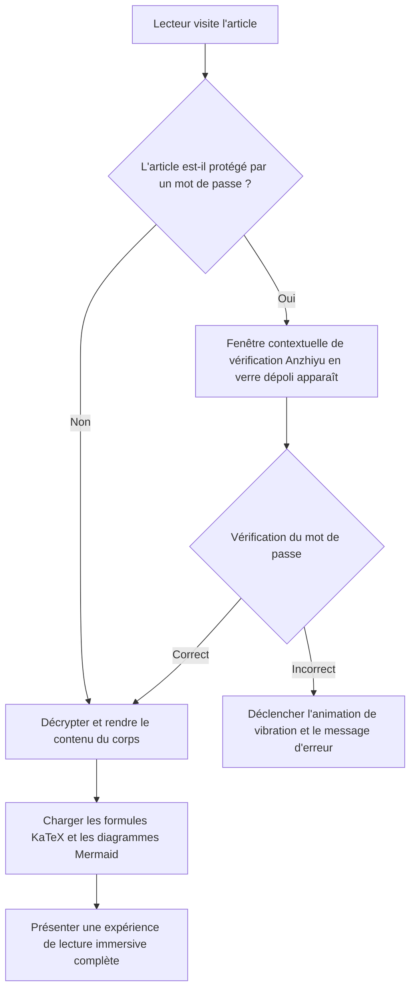
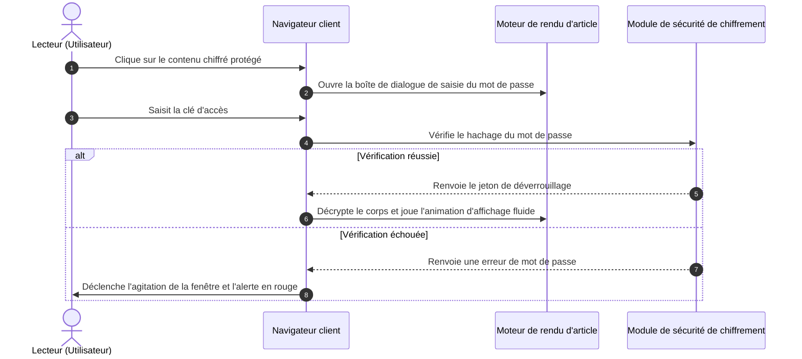
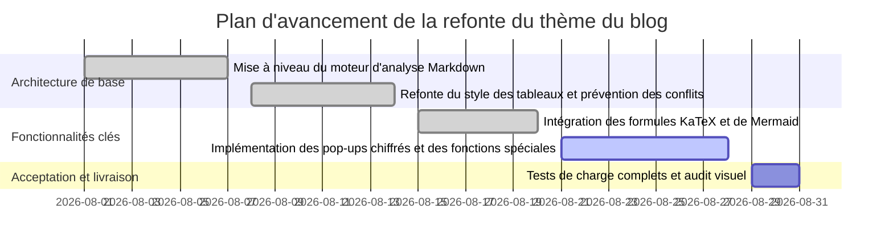
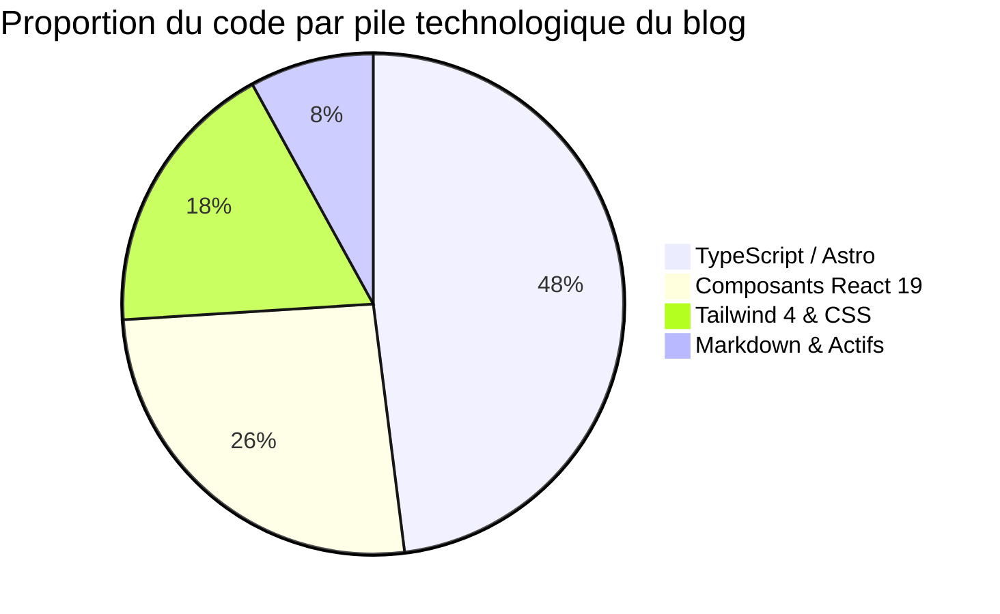
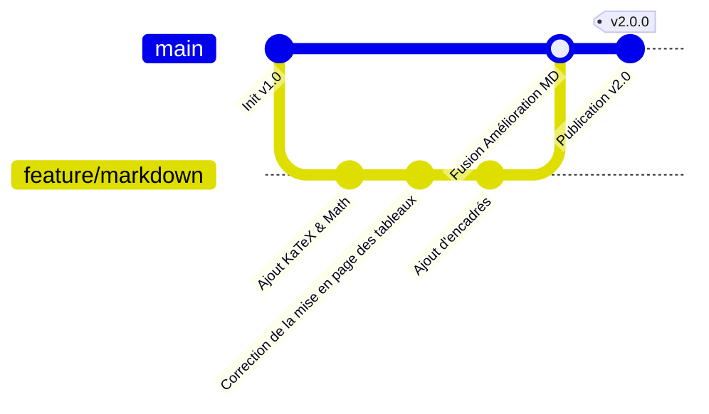

# Bienvenue dans le système de rendu Markdown tout-en-un et de fonctionnalités spéciales

Ceci est un **manuel de démonstration de la syntaxe Markdown tout-en-un et d'utilisation technique** conçu spécifiquement pour ce blog (`shijianus-blog`). Ce site s'est profondément inspiré des spécifications visuelles du classique open source **Hexo-Theme-Anzhiyu** et des capacités de rendu statique moderne d'**Astro 6**, reconstruisant et intégrant un système complet d'analyse Markdown.

Qu'il s'agisse de formules mathématiques LaTeX de niveau académique, de diagrammes de flux d'architecture Mermaid, de commutation de code multilingue, de comparaison de différences Diff, de boîtes de notification de style GitHub, de défilement adaptatif des tableaux, ou encore de fonctionnalités avancées telles que le **déverrouillage par fenêtre contextuelle de mot de passe chiffré, le flou gaussien et la mosaïque de texte/images, et les cartes multimédia enrichies**, toutes sont désormais prises en charge nativement ici.

---

## I. Formules mathématiques (Math / KaTeX)

Ce blog intègre les pipelines de rendu `remark-math` et `rehype-katex`, prenant en charge la compilation haute performance des formules en ligne et en bloc, ainsi que la mise en page adaptative sur tous les appareils.

### 1. Formules mathématiques en ligne (Inline Math)

Utilisez `$ ... $` directement dans le texte pour encadrer les expressions LaTeX :

- Équation masse-énergie : $E = mc^2$
- Identité d'Euler : $e^{i\pi} + 1 = 0$
- Fonction de densité de la distribution normale de Gauss : $f(x) = \frac{1}{\sigma \sqrt{2\pi}} e^{-\frac{1}{2}\left(\frac{x-\mu}{\sigma}\right)^2}$
- Limite de la somme : $\lim_{n \to \infty} \sum_{k=1}^n \frac{1}{k^2} = \frac{\pi^2}{6}$

### 2. Formules mathématiques en bloc (Display Math)

Utilisez `$$ ... $$` pour créer des paragraphes indépendants, prenant en charge les dérivations multilignes et la mise en page matricielle. Sur les appareils mobiles, un conteneur de défilement horizontal élastique est intégré, garantissant de ne jamais rompre la largeur de la page :

$$
\mathcal{L}\{\ddot{x}(t) + 2\zeta\omega_n\dot{x}(t) + \omega_n^2 x(t)\} = X(s)(s^2 + 2\zeta\omega_n s + \omega_n^2)
$$

Équations de Maxwell (forme différentielle) :

$$
\begin{aligned}
\nabla \cdot \mathbf{E} &= \frac{\rho}{\varepsilon_0} \\
\nabla \cdot \mathbf{B} &= 0 \\
\nabla \times \mathbf{E} &= -\frac{\partial \mathbf{B}}{\partial t} \\
\nabla \times \mathbf{B} &= \mu_0 \mathbf{J} + \mu_0 \varepsilon_0 \frac{\partial \mathbf{E}}{\partial t}
\end{aligned}
$$

Intégrale de Gauss et opérations matricielles :

$$
\int_{-\infty}^{\infty} e^{-x^2} \, dx = \sqrt{\pi}, \quad
\mathbf{A} = \begin{bmatrix}
a_{11} & a_{12} & \cdots & a_{1n} \\
a_{21} & a_{22} & \cdots & a_{2n} \\
\vdots & \vdots & \ddots & \vdots \\
a_{m1} & a_{m2} & \cdots & a_{mn}
\end{bmatrix}
$$

---

## II. Diagrammes et blocs de code de dessin (Diagrams as Code)

Le blog intègre nativement le moteur **Mermaid 11**, prenant en charge la compilation en temps réel du code de diagramme en diagrammes SVG vectoriels haute définition, et s'adaptant automatiquement aux modes clair/sombre.

### 1. Diagramme de flux d'architecture métier et de décision (Flowchart)



### 2. Diagramme de séquence d'interaction système (Sequence Diagram)



### 3. Diagramme de Gantt de livraison de projet (Gantt Chart)



### 4. Graphique circulaire et GitGraph





---

## III. Encadrés et blocs d'appel (Admonition / Callout)

Basé sur la syntaxe GitHub Alert et l'esthétique de conception d'Anzhiyu, il prend en charge 9 types de cartes colorées avec des sémantiques différentes, ainsi que le **mode pliable**.

### 1. Encadrés standards (Standard Callouts)

> [!NOTE]
> **Remarque (Note)** : Il s'agit d'une information de fond standard ou d'une explication complémentaire, utilisée pour fournir le contexte de l'article.

> [!TIP]
> **Astuce (Tip)** : Utilisez le raccourci clavier <kbd>Ctrl</kbd> + <kbd>K</kbd> pour afficher rapidement le panneau de recherche global d'articles !

> [!IMPORTANT]
> **Important (Important)** : Avant de déployer en environnement de production, assurez-vous que la variable d'environnement `BLOG_BUILD_TARGET=static` a été correctement injectée.

> [!WARNING]
> **Avertissement (Warning)** : Ne codez pas en dur les clés de base de données ou les clés privées de services cloud dans des dépôts publics.

> [!CAUTION]
> **Attention (Caution)** : L'exécution d'opérations de refactoring de table de données est irréversible. Veuillez d'abord exécuter `npm run cf:d1:migrate` pour sauvegarder les données !

> [!DANGER]
> **Danger mortel (Danger)** : La suppression directe de la base de données de production entraînera la perte permanente de tous les commentaires et actifs des utilisateurs.

> [!SUCCESS]
> **Opération réussie (Success)** : Le processus de construction statique est terminé avec succès, toutes les 43 routes statiques sont prêtes !

> [!QUESTION]
> **Question (Question)** : Comment réaliser une recherche plein texte côté client pur en millisecondes dans un environnement sans dépendance côté serveur ?

> [!QUOTE]
> **Citation sélectionnée (Quote)** : « Un bon code n'est pas seulement exécutable par une machine, il transmet aussi élégamment des idées aux humains, comme un poème. »

### 2. Encadrés pliables (Collapsible Details Admonitions)

Ajoutez `-` après le marqueur pour générer un encadré pliable fermé par défaut, et `+` pour un encadré ouvert par défaut :

> [!TIP]- Cliquez pour développer : Référence de configuration de cache Nginx ultra-rapide pour l'environnement de production
> Voici la stratégie de cache longue durée recommandée pour les ressources statiques :
> ```nginx
> location ~* \.(?:css|js|woff2?|svg|png|jpg|webp)$ {
>     expires 1y;
>     add_header Cache-Control "public, immutable";
>     access_log off;
> }
> ```

---

## IV. Fonctionnalités avancées des blocs de code (Advanced Code Blocks)

Nous avons doté tous les blocs de code des articles des mécanismes suivants : **barre de contrôle de feux de circulation macOS skeuomorphique**, **badge de langue**, **copie en un clic**, **comparaison Diff des lignes ajoutées/supprimées** et **pliage automatique du code très long**.

### 1. Exemple de code TypeScript (avec Diff des lignes ajoutées/supprimées)

```typescript
import { defineConfig } from 'astro/config';
import remarkMath from 'remark-math';
import rehypeKatex from 'rehype-katex';

export default defineConfig({
  site: 'https://shijian.us',
- output: 'server', // Ancienne configuration de rendu côté serveur
+ output: 'static', // [!code ++] Mise à niveau vers le mode d'exportation statique, accélération de 300 %
  markdown: {
+   remarkPlugins: [remarkMath], // [!code ++]
+   rehypePlugins: [rehypeKatex], // [!code ++]
    shikiConfig: {
      themes: {
        light: 'github-light',
        dark: 'github-dark-dimmed',
      },
    },
  },
});
```

### 2. Démonstration de pliage de code très long (hauteur limitée automatiquement avec bouton d'extension)

```json
{
  "project": "shijianus-blog",
  "version": "2.0.0",
  "author": "shijianus",
  "dependencies": {
    "@astrojs/mdx": "^5.0.3",
    "@astrojs/node": "^10.0.6",
    "@astrojs/react": "^5.0.2",
    "@tailwindcss/postcss": "^4.2.4",
    "@tailwindcss/vite": "^4.2.2",
    "astro": "^6.1.3",
    "katex": "^0.16.11",
    "lucide-react": "^0.460.0",
    "mermaid": "^11.4.1",
    "react": "^19.2.4",
    "react-dom": "^19.2.4",
    "rehype-katex": "^7.0.1",
    "remark-gfm": "^4.0.1",
    "remark-math": "^6.0.0",
    "tailwindcss": "^4.2.2"
  },
  "scripts": {
    "dev": "astro dev --host 0.0.0.0",
    "build": "BLOG_BUILD_TARGET=static PUBLIC_STATIC_EXPORT=1 astro build",
    "preview": "astro preview",
    "clean": "node scripts/clean.mjs"
  },
  "keywords": [
    "astro",
    "blog",
    "anzhiyu",
    "katex",
    "mermaid",
    "tailwind4"
  ]
}
```

## V. Améliorations complètes des listes de tâches et des tableaux (Task Lists & Tables)

### 1. Listes de tâches GFM interactives (Task Lists)

- [x] Analyse approfondie des formules mathématiques LaTeX (`remark-math` + `rehype-katex`)
- [x] Chargement et rendu dynamiques des organigrammes et diagrammes de séquence Mermaid
- [x] Correction des conflits de reconnaissance de tableau, implémentation du défilement horizontal adaptatif et réactif
- [x] Injection de 9 styles de cartes d'alerte An Zhiyu
- [x] Implémentation du déverrouillage par fenêtre modale de mot de passe en verre dépoli pour le contenu chiffré local
- [x] Ajout de flou gaussien et de masques mosaïques pour le texte et les images
- [ ] Prise en charge de plus de composants intégrés tiers (en itération continue)

### 2. Tableaux adaptatifs améliorés (Fixed Table Layout)

Les tableaux ne présentent plus de problèmes de compression ou de troncation des cellules, et sont livrés avec un léger thème d'en-tête et une coloration alternée des lignes :

| Nom du module | Support technique clé | Caractéristiques interactives | Badge d'état |
| :--- | :--- | :--- | :---: |
| **Formules mathématiques** | KaTeX + Compilateur AST | Rendu adaptatif en ligne/bloc, sans charge de performance côté client | <span class="badge badge-success">Support stable</span> |
| **Diagrammes d'architecture** | Mermaid 11 | Organigrammes, diagrammes de séquence, diagrammes de Gantt, adaptation au mode sombre | <span class="badge badge-success">Support stable</span> |
| **Contenu chiffré** | Fenêtre modale de mot de passe + Stockage de session | Boîte de dialogue en verre dépoli, animation de vibration d'erreur, isolation sécurisée | <span class="badge badge-primary">Fonctionnalité clé</span> |
| **Flou et mosaïque** | Filtre d'arrière-plan CSS | Désactivation du flou au survol/clic, badge de masquage d'image | <span class="badge badge-info">Amélioration interactive</span> |
| **Mise en évidence du code** | Shiki + Mac Enhancer | Lignes Diff ajoutées/supprimées, copie en un clic, pliage de code long | <span class="badge badge-success">Prêt et complet</span> |
| **Visionneuse d'images** | Visionneuse plein écran | Zoom plein écran pour les grandes images, masque sombre, sortie par `Esc` | <span class="badge badge-warning">Amélioration de l'expérience</span> |

---

## VI. Fonctionnalité spécifique : Contenu chiffré et déverrouillage par fenêtre modale de mot de passe (Encryption & Password Modal)

Ce blog offre un **mécanisme de protection par mot de passe pour le contenu local** qui va au-delà du Markdown ordinaire. Sans avoir à rafraîchir la page, un simple clic suffit pour faire apparaître la magnifique boîte de dialogue de saisie de mot de passe en verre dépoli d'An Zhiyu !

<div class="article-encrypted-box" data-hash="d7fb6c64b9aa44cc0c3b427edaa623369dee1a9778329801f68fdaa34b09d351" data-hint="💡 Indice de vérification : Pour la clé de démonstration, entrez simplement shijianus2026">
  <div class="encrypted-box__lock">
    <div class="encrypted-box__icon">🔒</div>
    <div class="encrypted-box__title">Ce paragraphe contient du contenu chiffré et protégé</div>
    <div class="encrypted-box__desc">Cette zone contient des ressources privées et des paramètres techniques clés. Veuillez entrer le mot de passe autorisé pour déverrouiller et afficher.</div>
    <button class="encrypted-box__btn" type="button">Cliquer pour entrer le mot de passe et déverrouiller</button>
  </div>
  <div class="encrypted-box__content">
    <div class="admonition admonition-success">
      <div class="admonition-title">
        <svg viewBox="0 0 24 24" fill="none" stroke="currentColor" stroke-width="2" stroke-linecap="round" stroke-linejoin="round"><path d="M22 11.08V12a10 10 0 1 1-5.93-9.14"/><polyline points="22 4 12 14.01 9 11.01"/></svg>
        <span>🎉 Vérification du mot de passe réussie ! Le contenu déchiffré est affiché</span>
      </div>
      <div class="admonition-content">
        <p>Félicitations, vous avez déverrouillé avec succès le secret technique protégé ! Voici les données de livraison chiffrées :</p>
        <ul>
          <li><strong>Dépôt de code privé</strong> : <code>git@github.com:shijianus/vip-internal-core.git</code></li>
          <li><strong>Jeton d'accès API (Token)</strong> : <code>shijian_sec_9988_a1b2c3d4e5f6</code></li>
          <li><strong>Canal de support exclusif</strong> : Canal privé Telegram <code>@shijianus_insiders</code></li>
        </ul>
        <p>L'état de déverrouillage est enregistré dans votre session de navigateur ; il n'est pas nécessaire de le saisir à nouveau après avoir rafraîchi la page actuelle.</p>
      </div>
    </div>
  </div>
</div>

---

## VII. Fonctionnalité spécifique : Flou gaussien, mosaïque et masquage de spoilers (Blur, Mosaic & Spoilers)

Dans la rédaction quotidienne, il est parfois nécessaire de masquer visuellement du contenu sensible, des réponses d'intrigue ou des images à suspense par un flou.

### 1. Texte avec flou gaussien (Gaussian Blur Text)

Ceci est un texte spoiler clé protégé par un flou : <span class="blur-text">En fait, le véritable meurtrier est le majordome, il avait déjà secrètement échangé les clés au chapitre trois !</span> (**Passez la souris ou cliquez sur le texte ci-dessus pour annuler le flou**).

### 2. Texte en mosaïque (Mosaic Mask Text)

Ceci est un texte utilisant un masque noir en mosaïque : <span class="mosaic-text">Données confidentielles : SHA256-7f83b1657ff1fc53b92dc18148a1d65dfc2d4b1fa3d677284addd200126d9069</span> (**Passez la souris ou cliquez pour voir le texte en clair**).

### 3. Spoilers en ligne et balises de masquage

- Masque de spoiler de style Discord : ||Ceci est un masque de spoiler entouré de doubles barres verticales, qui se révèle définitivement après un clic.||
- Contenu masqué directement en ligne : %%Ceci est un contenu masqué en ligne entouré de signes de pourcentage, cliquez pour développer.%%

### 4. Flou Gaussien d'Image (Protection d'Image Floue)

Pour le contenu sensible au droit d'auteur, suspens ou pour adultes, un conteneur de protection d'image floue peut être utilisé :

<div class="blur-image-wrap">
  
  <div class="blur-image-badge"><span>👁️ Survolez ou cliquez pour révéler</span></div>
</div>

### 5. Panneau de Contenu Masqué (Boîte de Contenu Caché)

<div class="hidden-box">
  <button class="hidden-box__toggle" type="button">
    <span>💡 Cliquez pour développer : Explication détaillée de la dérivation de la complexité temporelle des algorithmes</span>
    <span>▼</span>
  </button>
  <div class="hidden-box__content">
    <p>Pour le tri rapide (QuickSort), la complexité temporelle moyenne est de $\mathcal{O}(n \log n)$, et dans le pire des cas, lorsque chaque partition est inégale, elle dégénère en $\mathcal{O}(n^2)$. L'introduction d'un pivot aléatoire (Randomized Pivot) peut réduire la probabilité du pire des cas à un niveau exponentiellement bas.</p>
  </div>
</div>

---

## VIII. Composants Pliables et Conteneurs (Onglets, Étapes & Accordéons)

### 1. Onglets de Gestion de Paquets (Onglets Interactifs)

<div class="article-tabs">
  <div class="article-tabs__nav">
    <button class="article-tabs__button is-active" type="button">pnpm (recommandé)</button>
    <button class="article-tabs__button" type="button">npm</button>
    <button class="article-tabs__button" type="button">yarn</button>
    <button class="article-tabs__button" type="button">bun</button>
  </div>
  <div class="article-tabs__panels">
    <div class="article-tabs__panel is-active">
      <p>Utilisez <strong>pnpm</strong> pour installer et lier les dépendances ultra-rapidement :</p>
      <pre class="no-code-enhance"><code class="language-bash">pnpm install remark-math rehype-katex katex mermaid</code></pre>
    </div>
    <div class="article-tabs__panel">
      <p>Utilisez le gestionnaire de paquets standard <strong>npm</strong> :</p>
      <pre class="no-code-enhance"><code class="language-bash">npm install remark-math rehype-katex katex mermaid</code></pre>
    </div>
    <div class="article-tabs__panel">
      <p>Utilisez le mode moderne de <strong>Yarn</strong> :</p>
      <pre class="no-code-enhance"><code class="language-bash">yarn add remark-math rehype-katex katex mermaid</code></pre>
    </div>
    <div class="article-tabs__panel">
      <p>Utilisez le runtime ultra-rapide <strong>Bun</strong> :</p>
      <pre class="no-code-enhance"><code class="language-bash">bun add remark-math rehype-katex katex mermaid</code></pre>
    </div>
  </div>
</div>

### 2. Étapes du Tutoriel (Étapes de Tutoriel)

<div class="article-steps">
  <div class="article-steps__item">
    <div class="article-steps__num">1</div>
    <div class="article-steps__content">
      <h4>Préparation de l'environnement et installation des dépendances</h4>
      <p>Exécutez la commande d'installation à la racine du projet pour introduire Astro 6 et les dépendances principales de KaTeX, Mermaid.</p>
    </div>
  </div>
  <div class="article-steps__item">
    <div class="article-steps__num">2</div>
    <div class="article-steps__content">
      <h4>Configuration du pipeline de compilation Astro Markdown</h4>
      <p>Enregistrez <code>remarkMath</code> et <code>rehypeKatex</code> dans <code>astro.config.mjs</code>, et configurez le double thème Shiki.</p>
    </div>
  </div>
  <div class="article-steps__item">
    <div class="article-steps__num">3</div>
    <div class="article-steps__content">
      <h4>Montage de l'Enhancer et de la bibliothèque de styles</h4>
      <p>Introduisez <code>markdown-enhancements.css</code> et les scripts d'amélioration des fonctionnalités dans la mise en page globale <code>BlogLayout.astro</code>.</p>
    </div>
  </div>
</div>

---

## IX. Intégrations de Médias Riches et Cartes Multiplateformes (Embeds & Media Cards)

### 1. Carte de dépôt GitHub (GitHub Repo Card)

<div class="github-repo-card">
  <div class="repo-card__header">
    <span class="repo-card__icon"><i class="anzhiyufont anzhiyu-icon-github"></i></span>
    <a class="repo-card__name" href="https://github.com/anzhiyu-c/hexo-theme-anzhiyu" target="_blank" rel="noopener">anzhiyu-c / hexo-theme-anzhiyu</a>
  </div>
  <p class="repo-card__desc">Thème Anzhiyu - Un thème de blog Hexo simple, esthétique et riche en fonctionnalités, source d'inspiration pour l'interface utilisateur et le design de ce blog.</p>
  <div class="repo-card__footer">
    <span class="repo-card__lang"><span class="repo-lang-dot" style="background:#f1e05a;"></span>JavaScript</span>
    <span class="repo-card__star">⭐ 2,8k Étoiles</span>
    <span class="repo-card__fork">🍴 680 Forks</span>
  </div>
</div>

### 2. Carte de lecture vidéo responsive (Video Embed)

<div class="video-embed-card">
  <iframe src="https://player.bilibili.com/player.html?bvid=BV1xx411c7mD&page=1&high_quality=1&danmaku=0" allowfullscreen="true" loading="lazy"></iframe>
  <div class="embed-caption">Démonstration d'intégration vidéo Bilibili 1080P</div>
</div>

### 3. Carte audio musicale (Audio Card)

<div class="article-audio-card">
  <div class="audio-card__cover">
    
  </div>
  <div class="audio-card__info">
    <div class="audio-card__title">Voyage stellaire (Starry Wander)</div>
    <div class="audio-card__author">shijianus · Bruit blanc ambiant original</div>
    <audio controls preload="none" src="https://music.163.com/song/media/outer/url?id=186016.mp3"></audio>
  </div>
</div>

---

## Dix. Notes de bas de page et aperçus de bulles au survol (Footnotes & Hover Tooltips)

Dans les articles académiques ou techniques longs, les notes de bas de page sont une forme d'expression indispensable. Ce site prend non seulement en charge les sauts de note de bas de page GFM standard, mais permet également aux **bulles d'explication d'apparaître au survol de la souris**, permettant une lecture complète sans quitter la fenêtre d'affichage actuelle[^ref-astro].

Voici une deuxième référence de note de bas de page concernant l'architecture du thème[^ref-anzhiyu], ainsi qu'une troisième note complémentaire sur les performances de rendu mathématique[^ref-math].

[^ref-astro]: **Architecture Astro 6** : Adopte l'architecture en îlots (Island Architecture) pour une livraison statique par défaut sans JavaScript, améliorant considérablement le chargement initial de la page et les performances SEO.
[^ref-anzhiyu]: **Anzhiyu** : L'un des thèmes de design geek modernes les plus représentatifs de l'écosystème Hexo, réputé pour ses micro-animations délicates et sa hiérarchie d'informations.
[^ref-math]: **Performances de KaTeX** : Comparé à MathJax traditionnel, KaTeX peut effectuer tout le rendu statique HTML/MathML côté serveur, améliorant les performances de plus de 10 fois.

---

## Onze. Extensions de syntaxe en ligne de texte enrichi (Inline Typography)

- **Marquage en surbrillance multicolore (forme HTML et sucre syntaxique)** :
  - <mark class="mark-yellow">Surlignage jaune (mise en évidence)</mark>
  - <mark class="mark-green">Surlignage vert (recommandation réussie)</mark>
  - <mark class="mark-blue">Surlignage bleu (indice d'information)</mark>
  - <mark class="mark-pink">Surlignage rose (inspiration design)</mark>
  - <mark class="mark-purple">Surlignage violet (principe approfondi)</mark>
  - <mark class="mark-orange">Surlignage orange (alerte d'opération)</mark>
  - <mark class="mark-red">Surlignage rouge (avertissement de risque)</mark>
  - <mark class="mark-cyan">Surlignage cyan (protocole réseau)</mark>
  - ==Sucre syntaxique rapide : green:Surlignage vert== et ==purple:Surlignage violet==
- **Soulignements personnalisés** :
  - <u class="u-wavy">Soulignement ondulé (Wavy Underline)</u>
  - <u class="u-dashed">Soulignement en pointillés (Dashed Underline)</u>
- **Affichage des touches** : <kbd>Ctrl</kbd> + <kbd>Shift</kbd> + <kbd>P</kbd> pour ouvrir le panneau de commandes.
- **Pinyin/Zhuyin** : <ruby>安知鱼<rt>ān zhī yú</rt></ruby> · <ruby>時間<rt>shí jiān</rt></ruby>.
- **Explication au survol des acronymes** : <abbr title="Cascading Style Sheets Feuilles de style en cascade">CSS</abbr> et <abbr title="HyperText Markup Language Langage de balisage hypertexte">HTML</abbr>.
- **Badges de statut** :
  - <span class="badge badge-primary">Recommandé</span>
  - <span class="badge badge-success">Approuvé</span>
  - <span class="badge badge-warning">Attention</span>
  - <span class="badge badge-danger">Grave</span>
  - <span class="badge badge-info">Indice</span>

---

## Conclusion : Construire un système de contenu élégant et puissant

Grâce à cette refonte complète et à l'optimisation par balayage, `shijianus-blog` a désormais une capacité à rivaliser, voire à surpasser, les thèmes natifs Hexo/Anzhiyu en termes de performances globales dans le domaine du rendu Markdown.

Des dérivations rigoureuses de formules techniques aux diagrammes d'architecture métier Mermaid vivants ; des boîtes de dialogue de mot de passe locales sécurisées aux flous gaussien et masques anti-spoiler amusants — ce système permet à chaque article de blog d'être présenté aux lecteurs de la manière la plus digne, la plus professionnelle et la plus interactive.