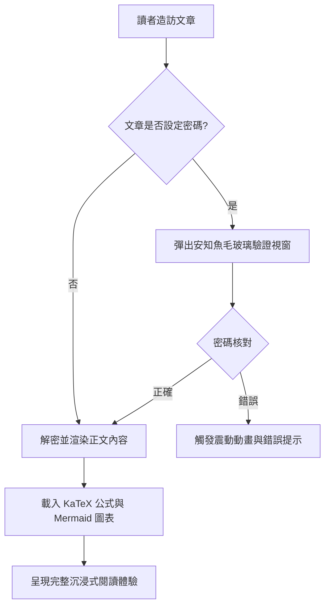
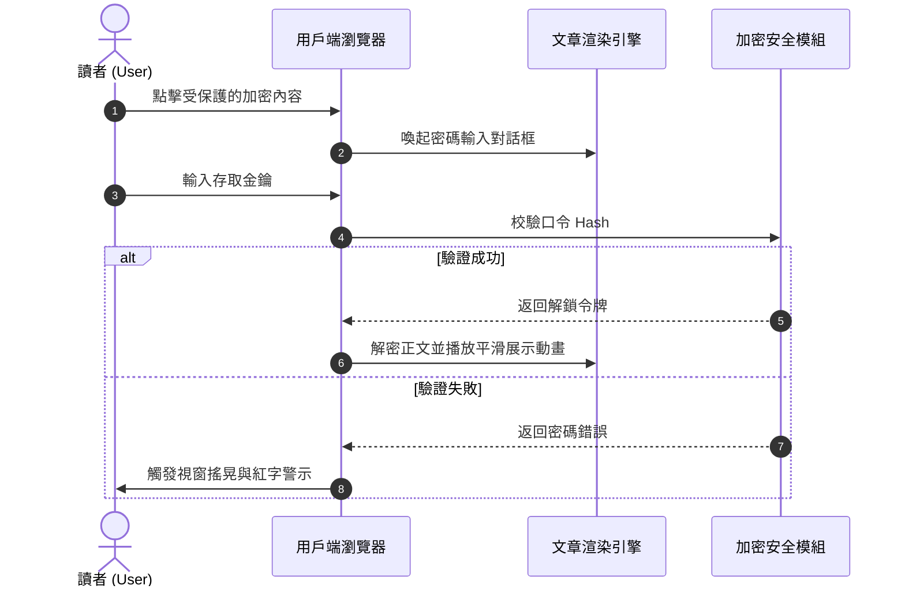
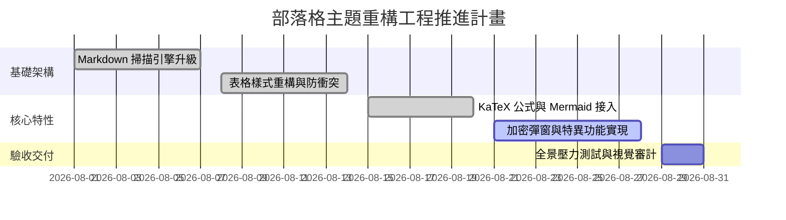
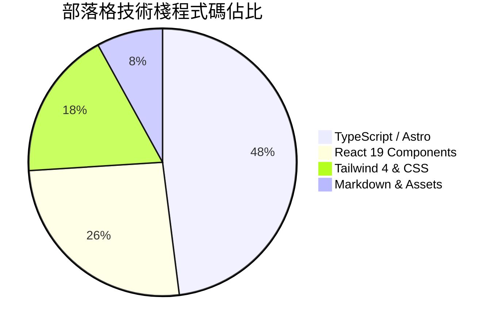
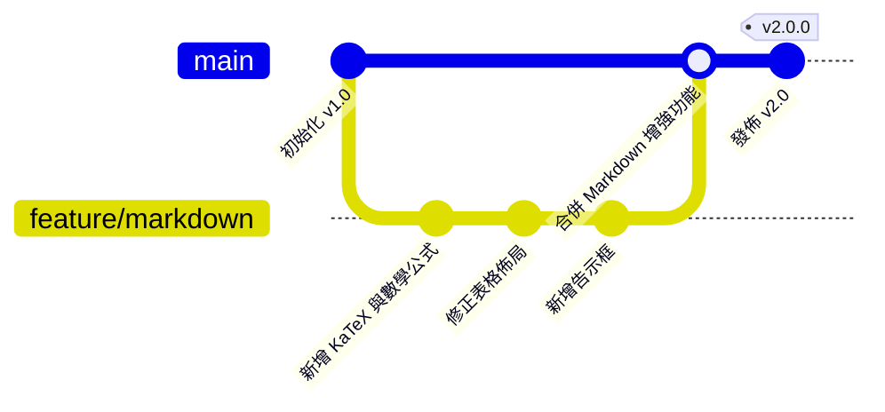

# 歡迎體驗全能 Markdown 渲染與特異功能系統

這是一篇專為本部落格（`shijianus-blog`）打造的 **Markdown 全能語法演示與技術使用手冊**。本站深度汲取了開源經典 **Hexo-Theme-Anzhiyu（安知魚）** 的視覺規範與 **Astro 6** 現代靜態渲染能力，重構並內建了完整的 Markdown 解析體系。

無論是學術級的 LaTeX 數學公式、Mermaid 架構流程圖，還是多語言程式碼切換、Diff 差異對比、GitHub 風格告示框、表格自適應捲動，抑或是前沿的 **密碼加密彈窗解鎖、文字/圖片高斯模糊與馬賽克、富媒體卡片** 等特異功能，均已在此得到原生級支援。

---

## 一、數學公式（Math / KaTeX）

本部落格內建 `remark-math` 與 `rehype-katex` 渲染管線，支援行內公式與區塊級公式的高性能編譯與全設備自適應排版。

### 1. 行內數學公式（Inline Math）

在文本中直接使用 `$ ... $` 包裹 LaTeX 表達式：

- 質能方程：$E = mc^2$
- 歐拉恆等式：$e^{i\pi} + 1 = 0$
- 高斯常態分佈密度函數：$f(x) = \frac{1}{\sigma \sqrt{2\pi}} e^{-\frac{1}{2}\left(\frac{x-\mu}{\sigma}\right)^2}$
- 求和極限：$\lim_{n \to \infty} \sum_{k=1}^n \frac{1}{k^2} = \frac{\pi^2}{6}$

### 2. 區塊級數學公式（Display Math）

使用 `$$ ... $$` 獨立成段，支援多行推導與矩陣排版。在行動裝置下自帶水平彈性捲動容器，絕不破壞頁面寬度：

$$
\mathcal{L}\{\ddot{x}(t) + 2\zeta\omega_n\dot{x}(t) + \omega_n^2 x(t)\} = X(s)(s^2 + 2\zeta\omega_n s + \omega_n^2)
$$

馬克士威方程組（微分形式）：

$$
\begin{aligned}
\nabla \cdot \mathbf{E} &= \frac{\rho}{\varepsilon_0} \\
\nabla \cdot \mathbf{B} &= 0 \\
\nabla \times \mathbf{E} &= -\frac{\partial \mathbf{B}}{\partial t} \\
\nabla \times \mathbf{B} &= \mu_0 \mathbf{J} + \mu_0 \varepsilon_0 \frac{\partial \mathbf{E}}{\partial t}
\end{aligned}
$$

高斯積分與矩陣運算：

$$
\int_{-\infty}^{\infty} e^{-x^2} \, dx = \sqrt{\pi}, \quad
\mathbf{A} = \begin{bmatrix}
a_{11} & a_{12} & \cdots & a_{1n} \\
a_{21} & a_{22} & \cdots & a_{2n} \\
\vdots & \vdots & \ddots & \vdots \\
a_{m1} & a_{m2} & \cdots & a_{mn}
\end{bmatrix}
$$

---

## 二、圖表與繪圖程式碼區塊（Diagrams as Code）

部落格原生整合 **Mermaid 11** 引擎，支援將圖表程式碼即時編譯為高清晰度、向量 SVG 圖表，並自動適配明亮/暗黑模式。

### 1. 業務架構與決策流程圖（Flowchart）



### 2. 系統互動時序圖（Sequence Diagram）



### 3. 專案交付甘特圖（Gantt Chart）



### 4. 統計圓餅圖與版本圖（Pie Chart & GitGraph）





---

## 三、告示框與提示塊（Admonition / Callout）

基於 GitHub Alert 語法與安知魚設計美學，支援 9 種不同語義的彩色卡片，並支援 **可摺疊模式**。

### 1. 標準告示框（Standard Callouts）

> [!NOTE]
> **常規備註（Note）**：這是一條標準的背景資訊或補充說明，用於提供文章上下文。

> [!TIP]
> **實用技巧（Tip）**：使用快捷鍵 <kbd>Ctrl</kbd> + <kbd>K</kbd> 可以快速喚起全域文章搜尋面板！

> [!IMPORTANT]
> **重要事項（Important）**：在部署生產環境前，請務必確認 `BLOG_BUILD_TARGET=static` 環境變數已正確注入。

> [!WARNING]
> **風險警告（Warning）**：請勿在公開儲存庫中硬編碼資料庫金鑰或雲端服務私鑰。

> [!CAUTION]
> **危險警示（Caution）**：執行資料表重構操作具有不可逆性，請先執行 `npm run cf:d1:migrate` 備份資料！

> [!DANGER]
> **致命危險（Danger）**：直接刪除生產資料庫將導致全部評論與使用者資產永久損毀。

> [!SUCCESS]
> **操作成功（Success）**：靜態建構流程已成功完成，所有 43 個靜態路由已就緒！

> [!QUESTION]
> **疑難探討（Question）**：如何在無伺服器端依賴的環境下實現毫秒級的純客戶端全文檢索？

> [!QUOTE]
> **精選引用（Quote）**：「優秀的程式碼不僅能被機器執行，更能像詩歌一樣優雅地向人類傳達思想。」

### 2. 可摺疊告示框（Collapsible Details Admonitions）

在標記後添加 `-` 即可生成預設收起的摺疊告示框，添加 `+` 則為預設展開：

> [!TIP]- 點擊展開查看：生產環境 Nginx 極速快取配置參考
> 以下是推薦的靜態資源長效快取策略：
> ```nginx
> location ~* \.(?:css|js|woff2?|svg|png|jpg|webp)$ {
>     expires 1y;
>     add_header Cache-Control "public, immutable";
>     access_log off;
> }
> ```

---

## 四、進階程式碼區塊功能（Advanced Code Blocks）

我們為文章內的所有程式碼區塊賦予了 **macOS 擬物交通燈控制條**、**語言徽章**、**一鍵複製**、**增刪行 Diff 對比** 以及 **超長程式碼自動摺疊** 機制。

### 1. TypeScript 程式碼範例（帶增刪行 Diff）

```typescript
import { defineConfig } from 'astro/config';
import remarkMath from 'remark-math';
import rehypeKatex from 'rehype-katex';

export default defineConfig({
  site: 'https://shijian.us',
- output: 'server', // 舊的伺服器端渲染配置
+ output: 'static', // [!code ++] 升級為靜態匯出模式，提速 300%
  markdown: {
+   remarkPlugins: [remarkMath], // [!code ++]
+   rehypePlugins: [rehypeKatex], // [!code ++]
    shikiConfig: {
      themes: {
        light: 'github-light',
        dark: 'github-dark-dimmed',
      },
    },
  },
});
```

### 2. 超長程式碼摺疊演示（自動限制高度並提供展開按鈕）

```json
{
  "project": "shijianus-blog",
  "version": "2.0.0",
  "author": "shijianus",
  "dependencies": {
    "@astrojs/mdx": "^5.0.3",
    "@astrojs/node": "^10.0.6",
    "@astrojs/react": "^5.0.2",
    "@tailwindcss/postcss": "^4.2.4",
    "@tailwindcss/vite": "^4.2.2",
    "astro": "^6.1.3",
    "katex": "^0.16.11",
    "lucide-react": "^0.460.0",
    "mermaid": "^11.4.1",
    "react": "^19.2.4",
    "react-dom": "^19.2.4",
    "rehype-katex": "^7.0.1",
    "remark-gfm": "^4.0.1",
    "remark-math": "^6.0.0",
    "tailwindcss": "^4.2.2"
  },
  "scripts": {
    "dev": "astro dev --host 0.0.0.0",
    "build": "BLOG_BUILD_TARGET=static PUBLIC_STATIC_EXPORT=1 astro build",
    "preview": "astro preview",
    "clean": "node scripts/clean.mjs"
  },
  "keywords": [
    "astro",
    "blog",
    "anzhiyu",
    "katex",
    "mermaid",
    "tailwind4"
  ]
}
```

## 五、任務列表與表格全能增強（Task Lists & Tables）

### 1. 互動式 GFM 任務列表（Task Lists）

- [x] 深度解析 LaTeX 數學公式（`remark-math` + `rehype-katex`）
- [x] 動態載入並渲染 Mermaid 流程圖與序列圖
- [x] 修復表格識別衝突，實現自適應響應式橫向捲動
- [x] 注入安知魚 9 種風格 Alert 告示卡片
- [x] 實現局部加密內容的毛玻璃密碼彈窗解鎖
- [x] 增加文字與圖片高斯模糊、馬賽克遮罩
- [ ] 支援更多第三方嵌入元件（持續迭代中）

### 2. 增強型自適應表格（Fixed Table Layout）

表格不再出現儲存格擠壓變形或外框截斷問題，且自帶表頭主題微光與隔行變色：

| 模組名稱 | 核心技術支援 | 互動特性 | 狀態角標 |
| :--- | :--- | :--- | :---: |
| **數學公式** | KaTeX + AST Compiler | 行內/塊級自適應渲染，無客戶端效能負擔 | <span class="badge badge-success">穩定支援</span> |
| **架構圖表** | Mermaid 11 | 流程圖、時序圖、甘特圖、暗黑自適應 | <span class="badge badge-success">穩定支援</span> |
| **加密內容** | 密碼彈窗 + Session 儲存 | 毛玻璃對話框、錯誤震動動畫、安全隔離 | <span class="badge badge-primary">核心特異</span> |
| **模糊與馬賽克** | CSS Backdrop Filter | 懸浮/點擊解除模糊、圖片遮罩勳章 | <span class="badge badge-info">互動增強</span> |
| **程式碼高亮** | Shiki + Mac Enhancer | 增刪 Diff 行、一鍵複製、超長程式碼摺疊 | <span class="badge badge-success">完善就緒</span> |
| **圖片燈箱** | Fullscreen Lightbox | 大圖全螢幕縮放、暗色遮罩、`Esc` 退出 | <span class="badge badge-warning">體驗增強</span> |

---

## 六、特異功能：加密內容與密碼彈窗解鎖（Encryption & Password Modal）

本部落格提供超越普通 Markdown 的 **局部內容密碼保護機制**。無需重新整理頁面，點擊即可喚起高顏值安知魚毛玻璃密碼輸入對話框！

<div class="article-encrypted-box" data-hash="d7fb6c64b9aa44cc0c3b427edaa623369dee1a9778329801f68fdaa34b09d351" data-hint="💡 驗證提示：演示金鑰請直接輸入 shijianus2026">
  <div class="encrypted-box__lock">
    <div class="encrypted-box__icon">🔒</div>
    <div class="encrypted-box__title">此段落為受保護的加密內容</div>
    <div class="encrypted-box__desc">該區域包含私密資源與核心技術參數。請輸入授權密碼後解鎖查看。</div>
    <button class="encrypted-box__btn" type="button">點擊輸入密碼解鎖</button>
  </div>
  <div class="encrypted-box__content">
    <div class="admonition admonition-success">
      <div class="admonition-title">
        <svg viewBox="0 0 24 24" fill="none" stroke="currentColor" stroke-width="2" stroke-linecap="round" stroke-linejoin="round"><path d="M22 11.08V12a10 10 0 1 1-5.93-9.14"/><polyline points="22 4 12 14.01 9 11.01"/></svg>
        <span>🎉 密碼驗證成功！解密內容已呈現</span>
      </div>
      <div class="admonition-content">
        <p>恭喜您成功解鎖了受保護的技術秘密！以下是加密交付資料：</p>
        <ul>
          <li><strong>私有程式碼儲存庫</strong>：<code>git@github.com:shijianus/vip-internal-core.git</code></li>
          <li><strong>API 存取令牌 (Token)</strong>：<code>shijian_sec_9988_a1b2c3d4e5f6</code></li>
          <li><strong>專屬支援頻道</strong>：Telegram 私享頻道 <code>@shijianus_insiders</code></li>
        </ul>
        <p>解鎖狀態已保存在您的瀏覽器會話中，目前頁面重新整理後無需重複輸入。</p>
      </div>
    </div>
  </div>
</div>

---

## 七、特異功能：高斯模糊、馬賽克與劇透隱藏（Blur, Mosaic & Spoilers）

在日常寫作中，有時需要對敏感內容、劇情答案或懸念圖片進行視覺模糊遮擋。

### 1. 文字高斯模糊（Gaussian Blur Text）

這是一段被模糊保護的關鍵劇透文字：<span class="blur-text">其實真正的兇手就是管家，他在第三章就已經偷偷換掉了鑰匙！</span>（**滑鼠懸浮或點擊上方文字即可解除模糊**）。

### 2. 馬賽克文字（Mosaic Mask Text）

這是一段採用馬賽克黑色遮罩的文本：<span class="mosaic-text">機密資料：SHA256-7f83b1657ff1fc53b92dc18148a1d65dfc2d4b1fa3d677284addd200126d9069</span>（**懸浮或點擊即可查看明文**）。

### 3. 內聯劇透與隱藏標記

- Discord 風格劇透遮罩：||這是一段使用雙豎線包裹的劇透遮罩，點擊後永久揭開。||
- 直接內聯隱藏內容：%%這裡是使用百分號包裹的內聯隱藏內容，點擊展開。%%

### 4. 圖片高斯模糊（Blurred Image Protection）

對於涉及版權敏感、懸疑或成人禮的內容，可使用圖片模糊保護容器：

<div class="blur-image-wrap">
  
  <div class="blur-image-badge"><span>👁️ 懸浮或點擊揭開迷霧</span></div>
</div>

### 5. 隱藏內容折疊面板（Hidden Content Box）

<div class="hidden-box">
  <button class="hidden-box__toggle" type="button">
    <span>💡 點擊展開：演算法時間複雜度推導詳解</span>
    <span>▼</span>
  </button>
  <div class="hidden-box__content">
    <p>對於快速排序（QuickSort），平均時間複雜度為 $\mathcal{O}(n \log n)$，在最壞情況下當每次劃分都不均勻時退化為 $\mathcal{O}(n^2)$。透過引入隨機化主元（Randomized Pivot）可以將最壞情況機率降至指數級低。</p>
  </div>
</div>

---

## 八、折疊與容器組件（Tabs, Steps & Accordions）

### 1. 多語言套件管理選項卡（Interactive Tabs）

<div class="article-tabs">
  <div class="article-tabs__nav">
    <button class="article-tabs__button is-active" type="button">pnpm (推薦)</button>
    <button class="article-tabs__button" type="button">npm</button>
    <button class="article-tabs__button" type="button">yarn</button>
    <button class="article-tabs__button" type="button">bun</button>
  </div>
  <div class="article-tabs__panels">
    <div class="article-tabs__panel is-active">
      <p>使用 <strong>pnpm</strong> 極速安裝並連結依賴：</p>
      <pre class="no-code-enhance"><code class="language-bash">pnpm install remark-math rehype-katex katex mermaid</code></pre>
    </div>
    <div class="article-tabs__panel">
      <p>使用 <strong>npm</strong> 標準套件管理器：</p>
      <pre class="no-code-enhance"><code class="language-bash">npm install remark-math rehype-katex katex mermaid</code></pre>
    </div>
    <div class="article-tabs__panel">
      <p>使用 <strong>Yarn</strong> 現代模式：</p>
      <pre class="no-code-enhance"><code class="language-bash">yarn add remark-math rehype-katex katex mermaid</code></pre>
    </div>
    <div class="article-tabs__panel">
      <p>使用超高速 <strong>Bun</strong> 執行時：</p>
      <pre class="no-code-enhance"><code class="language-bash">bun add remark-math rehype-katex katex mermaid</code></pre>
    </div>
  </div>
</div>

### 2. 教學步驟條（Tutorial Steps）

<div class="article-steps">
  <div class="article-steps__item">
    <div class="article-steps__num">1</div>
    <div class="article-steps__content">
      <h4>環境準備與依賴安裝</h4>
      <p>在工程根目錄下執行安裝命令，引入 Astro 6 與 KaTeX、Mermaid 核心依賴套件。</p>
    </div>
  </div>
  <div class="article-steps__item">
    <div class="article-steps__num">2</div>
    <div class="article-steps__content">
      <h4>配置 Astro Markdown 編譯管道</h4>
      <p>在 <code>astro.config.mjs</code> 中註冊 <code>remarkMath</code> 與 <code>rehypeKatex</code>，並配置 Shiki 雙主題。</p>
    </div>
  </div>
  <div class="article-steps__item">
    <div class="article-steps__num">3</div>
    <div class="article-steps__content">
      <h4>掛載 Enhancer 與樣式庫</h4>
      <p>在全域佈局 <code>BlogLayout.astro</code> 中引入 <code>markdown-enhancements.css</code> 與特性增強腳本。</p>
    </div>
  </div>
</div>

---

## 九、富媒體與跨平台卡片嵌入（Embeds & Media Cards）

### 1. GitHub 儲存庫卡片（GitHub Repo Card）

<div class="github-repo-card">
  <div class="repo-card__header">
    <span class="repo-card__icon"><i class="anzhiyufont anzhiyu-icon-github"></i></span>
    <a class="repo-card__name" href="https://github.com/anzhiyu-c/hexo-theme-anzhiyu" target="_blank" rel="noopener">anzhiyu-c / hexo-theme-anzhiyu</a>
  </div>
  <p class="repo-card__desc">安知魚主題 - 簡潔、高顏值、功能豐富的 Hexo 部落格主題，本部落格的前端 UI 與設計靈感來源。</p>
  <div class="repo-card__footer">
    <span class="repo-card__lang"><span class="repo-lang-dot" style="background:#f1e05a;"></span>JavaScript</span>
    <span class="repo-card__star">⭐ 2.8k 星</span>
    <span class="repo-card__fork">🍴 680 分支</span>
  </div>
</div>

### 2. 響應式影片播放卡片（Video Embed）

<div class="video-embed-card">
  <iframe src="https://player.bilibili.com/player.html?bvid=BV1xx411c7mD&page=1&high_quality=1&danmaku=0" allowfullscreen="true" loading="lazy"></iframe>
  <div class="embed-caption">Bilibili 1080P 影片嵌入示範</div>
</div>

### 3. 音訊音樂卡片（Audio Card）

<div class="article-audio-card">
  <div class="audio-card__cover">
    
  </div>
  <div class="audio-card__info">
    <div class="audio-card__title">星河漫遊 (Starry Wander)</div>
    <div class="audio-card__author">shijianus · 原創環境白噪音</div>
    <audio controls preload="none" src="https://music.163.com/song/media/outer/url?id=186016.mp3"></audio>
  </div>
</div>

---

## 十、註腳與懸浮氣泡預覽（Footnotes & Hover Tooltips）

在學術或長篇技術文章中，註腳是不可或缺的表達形式。本站不僅支援標準的 GFM 註腳跳轉，更支援 **滑鼠懸浮即可彈出釋義氣泡**，無需跳出當前視窗即可完成閱讀[^ref-astro]。

這裡還有第二個關於主題架構的註腳引用[^ref-anzhiyu]，以及第三個關於數學渲染效能的補充說明[^ref-math]。

[^ref-astro]: **Astro 6 架構**：採用 Island Architecture（群島架構），實現預設零 JavaScript 靜態交付，極大提升了首頁載入與 SEO 效能。
[^ref-anzhiyu]: **安知魚（Anzhiyu）**：Hexo 生態中最具代表性的現代化極客設計主題之一，以精細的微動效與資訊層級著稱。
[^ref-math]: **KaTeX 效能**：相較於傳統 MathJax，KaTeX 在伺服器端即可完成所有 HTML/MathML 的靜態渲染，效能提高 10 倍以上。

---

## 十一、富文字行內語法擴展（Inline Typography）

- **多彩高亮標記（HTML 形式與語法糖）**：
  - <mark class="mark-yellow">黃色高亮（重點標註）</mark>
  - <mark class="mark-green">綠色高亮（成功推薦）</mark>
  - <mark class="mark-blue">藍色高亮（資訊線索）</mark>
  - <mark class="mark-pink">粉色高亮（設計靈感）</mark>
  - <mark class="mark-purple">紫色高亮（深度原理）</mark>
  - <mark class="mark-orange">橙色高亮（操作預警）</mark>
  - <mark class="mark-red">紅色高亮（風險警示）</mark>
  - <mark class="mark-cyan">青色高亮（網路協定）</mark>
  - ==快捷語法糖：green:綠色高亮== 與 ==purple:紫色高亮==
- **個性化底線**：
  - <u class="u-wavy">波浪強調底線（Wavy Underline）</u>
  - <u class="u-dashed">虛線強調底線（Dashed Underline）</u>
- **按鍵展示**：<kbd>Ctrl</kbd> + <kbd>Shift</kbd> + <kbd>P</kbd> 開啟命令面板。
- **拼音/注音**：<ruby>安知魚<rt>ān zhī yú</rt></ruby> · <ruby>時間<rt>shí jiān</rt></ruby>。
- **縮略詞懸浮說明**：<abbr title="Cascading Style Sheets 階層式樣式表">CSS</abbr> 與 <abbr title="HyperText Markup Language 超文件標記語言">HTML</abbr>。
- **狀態膠囊標籤**：
  - <span class="badge badge-primary">推薦</span>
  - <span class="badge badge-success">已通過</span>
  - <span class="badge badge-warning">注意</span>
  - <span class="badge badge-danger">嚴重</span>
  - <span class="badge badge-info">提示</span>

---

## 結語：建構優雅而強大的內容系統

透過本次全面重構與掃描最佳化，`shijianus-blog` 在 Markdown 渲染領域已具備媲美甚至超越原生 Hexo/安知魚主題的綜合表現力。

從嚴謹的技術公式推導，到生動的 Mermaid 業務架構圖；從安全的局部密碼對話框，到充滿趣味的高斯模糊與劇透遮罩——這套系統讓每一篇部落格文章都能夠以最體面、最專業、最富有互動感的形式呈現在讀者面前。