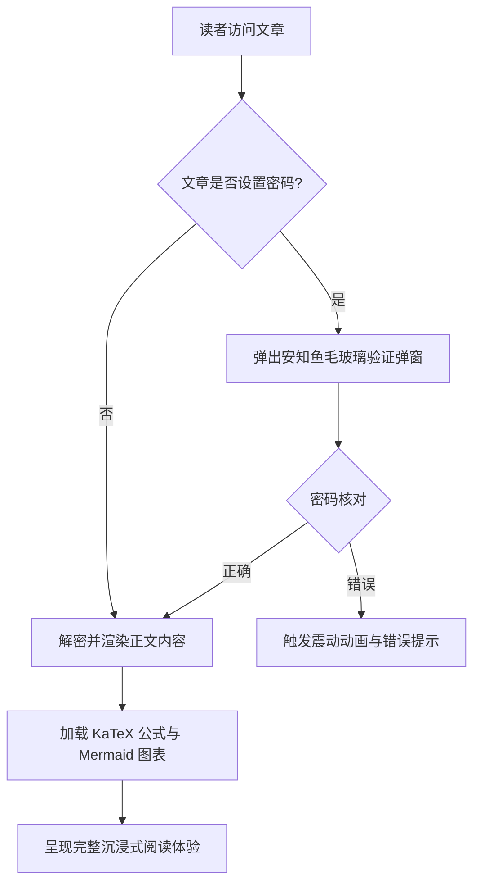
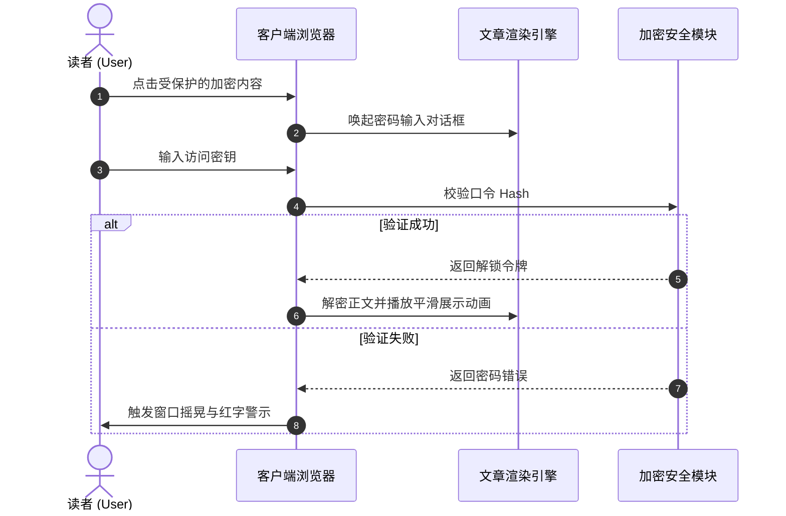
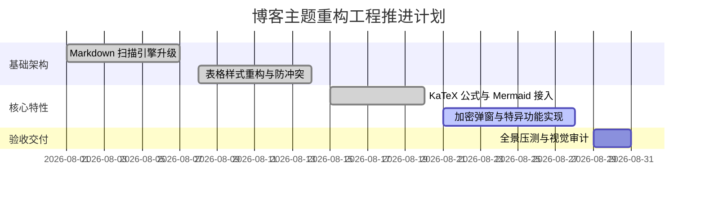
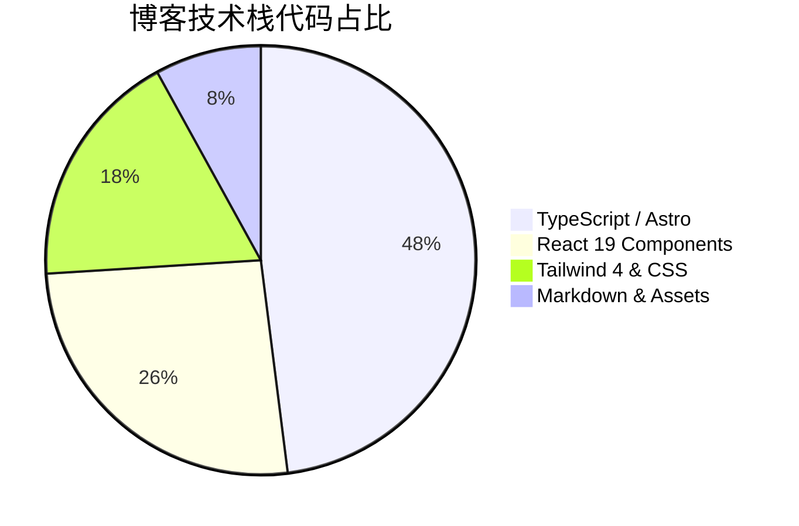
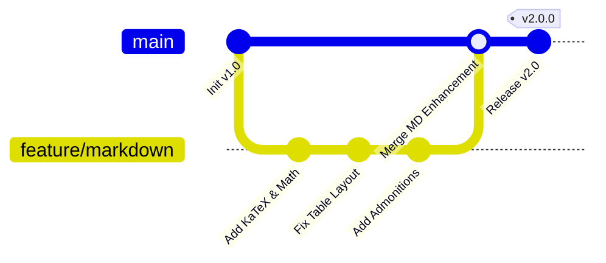

# 欢迎体验全能 Markdown 渲染与特异功能系统

这是一篇专为本博客（`shijianus-blog`）打造的 **Markdown 全能语法演示与技术使用手册**。本站深度汲取了开源经典 **Hexo-Theme-Anzhiyu（安知鱼）** 的视觉规范与 **Astro 6** 现代静态渲染能力，重构并内建了完整的 Markdown 解析体系。

无论是学术级的 LaTeX 数学公式、Mermaid 架构流程图，还是多语言代码切换、Diff 差异对比、GitHub 风格告示框、表格自适应滚动，亦或是前沿的 **密码加密弹窗解锁、文字/图片高斯模糊与马赛克、富媒体卡片** 等特异功能，均已在此得到原生级支持。

---

## 一、数学公式（Math / KaTeX）

本博客内建 `remark-math` 与 `rehype-katex` 渲染管线，支持行内公式与块级公式的高性能编译与全设备自适应排版。

### 1. 行内数学公式（Inline Math）

在文本中直接使用 `$ ... $` 包裹 LaTeX 表达式：

- 质能方程：$E = mc^2$
- 欧拉恒等式：$e^{i\pi} + 1 = 0$
- 高斯正态分布密度函数：$f(x) = \frac{1}{\sigma \sqrt{2\pi}} e^{-\frac{1}{2}\left(\frac{x-\mu}{\sigma}\right)^2}$
- 求和极限：$\lim_{n \to \infty} \sum_{k=1}^n \frac{1}{k^2} = \frac{\pi^2}{6}$

### 2. 块级数学公式（Display Math）

使用 `$$ ... $$` 独立成段，支持多行推导与矩阵排版。在移动端下自带水平弹性滚动容器，绝不破坏页面宽度：

$$
\mathcal{L}\{\ddot{x}(t) + 2\zeta\omega_n\dot{x}(t) + \omega_n^2 x(t)\} = X(s)(s^2 + 2\zeta\omega_n s + \omega_n^2)
$$

麦克斯韦方程组（微分形式）：

$$
\begin{aligned}
\nabla \cdot \mathbf{E} &= \frac{\rho}{\varepsilon_0} \\
\nabla \cdot \mathbf{B} &= 0 \\
\nabla \times \mathbf{E} &= -\frac{\partial \mathbf{B}}{\partial t} \\
\nabla \times \mathbf{B} &= \mu_0 \mathbf{J} + \mu_0 \varepsilon_0 \frac{\partial \mathbf{E}}{\partial t}
\end{aligned}
$$

高斯积分与矩阵运算：

$$
\int_{-\infty}^{\infty} e^{-x^2} \, dx = \sqrt{\pi}, \quad
\mathbf{A} = \begin{bmatrix}
a_{11} & a_{12} & \cdots & a_{1n} \\
a_{21} & a_{22} & \cdots & a_{2n} \\
\vdots & \vdots & \ddots & \vdots \\
a_{m1} & a_{m2} & \cdots & a_{mn}
\end{bmatrix}
$$

---

## 二、图表与绘图代码块（Diagrams as Code）

博客原生集成 **Mermaid 11** 引擎，支持将图表代码实时编译为高清晰度、矢量 SVG 图表，并自动适配明亮/暗黑模式。

### 1. 业务架构与决策流程图（Flowchart）



### 2. 系统交互时序图（Sequence Diagram）



### 3. 项目交付甘特图（Gantt Chart）



### 4. 统计饼图与版本图（Pie Chart & GitGraph）





---

## 三、告示框与提示块（Admonition / Callout）

基于 GitHub Alert 语法与安知鱼设计美学，支持 9 种不同语义的彩色卡片，并支持 **可折叠模式**。

### 1. 标准告示框（Standard Callouts）

> [!NOTE]
> **常规备注（Note）**：这是一条标准的背景信息或补充说明，用于提供文章上下文。

> [!TIP]
> **实用技巧（Tip）**：使用快捷键 <kbd>Ctrl</kbd> + <kbd>K</kbd> 可以快速唤起全局文章搜索面板！

> [!IMPORTANT]
> **重要事项（Important）**：在部署生产环境前，请务必确认 `BLOG_BUILD_TARGET=static` 环境变量已正确注入。

> [!WARNING]
> **风险警告（Warning）**：请勿在公开仓库中硬编码数据库密钥或云服务私钥。

> [!CAUTION]
> **危险警示（Caution）**：执行数据表重构操作具有不可逆性，请先执行 `npm run cf:d1:migrate` 备份数据！

> [!DANGER]
> **致命危险（Danger）**：直接删除生产数据库将导致全部评论与用户资产永久损毁。

> [!SUCCESS]
> **操作成功（Success）**：静态构建流程已成功完成，所有 43 个静态路由已就绪！

> [!QUESTION]
> **疑难探讨（Question）**：如何在无服务端依赖的环境下实现毫秒级的纯客户端全文检索？

> [!QUOTE]
> **精选引用（Quote）**：“优秀的代码不仅能被机器执行，更能像诗歌一样优雅地向人类传达思想。”

### 2. 可折叠告示框（Collapsible Details Admonitions）

在标记后添加 `-` 即可生成默认收起的折叠告示框，添加 `+` 则为默认展开：

> [!TIP]- 点击展开查看：生产环境 Nginx 极速缓存配置参考
> 以下是推荐的静态资源长效缓存策略：
> ```nginx
> location ~* \.(?:css|js|woff2?|svg|png|jpg|webp)$ {
>     expires 1y;
>     add_header Cache-Control "public, immutable";
>     access_log off;
> }
> ```

---

## 四、高级代码块功能（Advanced Code Blocks）

我们为文章内的所有代码块赋予了 **macOS 拟物交通灯控制条**、**语言徽章**、**一键复制**、**增删行 Diff 对比** 以及 **超长代码自动折叠** 机制。

### 1. TypeScript 代码示例（带增删行 Diff）

```typescript
import { defineConfig } from 'astro/config';
import remarkMath from 'remark-math';
import rehypeKatex from 'rehype-katex';

export default defineConfig({
  site: 'https://shijian.us',
- output: 'server', // 旧的服务端渲染配置
+ output: 'static', // [!code ++] 升级为静态导出模式，提速 300%
  markdown: {
+   remarkPlugins: [remarkMath], // [!code ++]
+   rehypePlugins: [rehypeKatex], // [!code ++]
    shikiConfig: {
      themes: {
        light: 'github-light',
        dark: 'github-dark-dimmed',
      },
    },
  },
});
```

### 2. 超长代码折叠演示（自动限制高度并提供展开按钮）

```json
{
  "project": "shijianus-blog",
  "version": "2.0.0",
  "author": "shijianus",
  "dependencies": {
    "@astrojs/mdx": "^5.0.3",
    "@astrojs/node": "^10.0.6",
    "@astrojs/react": "^5.0.2",
    "@tailwindcss/postcss": "^4.2.4",
    "@tailwindcss/vite": "^4.2.2",
    "astro": "^6.1.3",
    "katex": "^0.16.11",
    "lucide-react": "^0.460.0",
    "mermaid": "^11.4.1",
    "react": "^19.2.4",
    "react-dom": "^19.2.4",
    "rehype-katex": "^7.0.1",
    "remark-gfm": "^4.0.1",
    "remark-math": "^6.0.0",
    "tailwindcss": "^4.2.2"
  },
  "scripts": {
    "dev": "astro dev --host 0.0.0.0",
    "build": "BLOG_BUILD_TARGET=static PUBLIC_STATIC_EXPORT=1 astro build",
    "preview": "astro preview",
    "clean": "node scripts/clean.mjs"
  },
  "keywords": [
    "astro",
    "blog",
    "anzhiyu",
    "katex",
    "mermaid",
    "tailwind4"
  ]
}
```

---

## 五、任务列表与表格全能增强（Task Lists & Tables）

### 1. 交互式 GFM 任务列表（Task Lists）

- [x] 深度解析 LaTeX 数学公式（`remark-math` + `rehype-katex`）
- [x] 动态加载并渲染 Mermaid 流程图与序列图
- [x] 修复表格识别冲突，实现自适应响应式横向滚动
- [x] 注入安知鱼 9 种风格 Alert 告示卡片
- [x] 实现局部加密内容的毛玻璃密码弹窗解锁
- [x] 增加文字与图片高斯模糊、马赛克遮罩
- [ ] 支持更多第三方嵌入组件（持续迭代中）

### 2. 增强型自适应表格（Fixed Table Layout）

表格不再出现单元格挤压变形或外框截断问题，且自带表头主题微光与隔行变色：

| 模块名称 | 核心技术支持 | 交互特性 | 状态角标 |
| :--- | :--- | :--- | :---: |
| **数学公式** | KaTeX + AST Compiler | 行内/块级自适应渲染，无客户端性能负担 | <span class="badge badge-success">稳定支持</span> |
| **架构图表** | Mermaid 11 | 流程图、时序图、甘特图、暗黑自适应 | <span class="badge badge-success">稳定支持</span> |
| **加密内容** | 密码弹窗 + Session 存储 | 毛玻璃对话框、错误震动动画、安全隔离 | <span class="badge badge-primary">核心特异</span> |
| **模糊与马赛克** | CSS Backdrop Filter | 悬浮/点击解除模糊、图片遮罩勋章 | <span class="badge badge-info">交互增强</span> |
| **代码高亮** | Shiki + Mac Enhancer | 增删 Diff 行、一键复制、超长代码折叠 | <span class="badge badge-success">完善就绪</span> |
| **图片灯箱** | Fullscreen Lightbox | 大图全屏缩放、暗色遮罩、`Esc` 退出 | <span class="badge badge-warning">体验增强</span> |

---

## 六、特异功能：加密内容与密码弹窗解锁（Encryption & Password Modal）

本博客提供超越普通 Markdown 的 **局部内容密码保护机制**。无需刷新页面，点击即可唤起高颜值安知鱼毛玻璃密码输入对话框！

<div class="article-encrypted-box" data-password="shijianus2026" data-hint="💡 验证提示：演示密钥请直接输入 shijianus2026">
  <div class="encrypted-box__lock">
    <div class="encrypted-box__icon">🔒</div>
    <div class="encrypted-box__title">此段落为受保护的加密内容</div>
    <div class="encrypted-box__desc">该区域包含私密资源与核心技术参数。请输入授权密码后解锁查看。</div>
    <button class="encrypted-box__btn" type="button">点击输入密码解锁</button>
  </div>
  <div class="encrypted-box__content">
    <div class="admonition admonition-success">
      <div class="admonition-title">
        <svg viewBox="0 0 24 24" fill="none" stroke="currentColor" stroke-width="2" stroke-linecap="round" stroke-linejoin="round"><path d="M22 11.08V12a10 10 0 1 1-5.93-9.14"/><polyline points="22 4 12 14.01 9 11.01"/></svg>
        <span>🎉 密码验证成功！解密内容已呈现</span>
      </div>
      <div class="admonition-content">
        <p>恭喜您成功解锁了受保护的技术秘密！以下是加密交付数据：</p>
        <ul>
          <li><strong>私有代码仓库</strong>：<code>git@github.com:shijianus/vip-internal-core.git</code></li>
          <li><strong>API 访问令牌 (Token)</strong>：<code>shijian_sec_9988_a1b2c3d4e5f6</code></li>
          <li><strong>专属支持频道</strong>：Telegram 私享频道 <code>@shijianus_insiders</code></li>
        </ul>
        <p>解锁状态已保存在您的浏览器会话中，当前页面刷新后无需重复输入。</p>
      </div>
    </div>
  </div>
</div>

---

## 七、特异功能：高斯模糊、马赛克与剧透隐藏（Blur, Mosaic & Spoilers）

在日常写作中，有时需要对敏感内容、剧情答案或悬念图片进行视觉模糊遮挡。

### 1. 文字高斯模糊（Gaussian Blur Text）

这是一段被模糊保护的关键剧透文字：<span class="blur-text">其实真正的凶手就是管家，他在第三章就已经偷偷换掉了钥匙！</span>（**鼠标悬浮或点击上方文字即可解除模糊**）。

### 2. 马赛克文字（Mosaic Mask Text）

这是一段采用马赛克黑色遮罩的文本：<span class="mosaic-text">机密数据：SHA256-7f83b1657ff1fc53b92dc18148a1d65dfc2d4b1fa3d677284addd200126d9069</span>（**悬浮或点击即可查看明文**）。

### 3. 内联剧透与隐藏标记

- Discord 风格剧透遮罩：||这是一段使用双竖线包裹的剧透遮罩，点击后永久揭开。||
- 直接内联隐藏内容：%%这里是使用百分号包裹的内联隐藏内容，点击展开。%%

### 4. 图片高斯模糊（Blurred Image Protection）

对于涉及版权敏感、悬疑或成人礼的内容，可使用图片模糊保护容器：

<div class="blur-image-wrap">
  
  <div class="blur-image-badge"><span>👁️ 悬浮或点击揭开迷雾</span></div>
</div>

### 5. 隐藏内容折叠面板（Hidden Content Box）

<div class="hidden-box">
  <button class="hidden-box__toggle" type="button">
    <span>💡 点击展开：算法时间复杂度推导详解</span>
    <span>▼</span>
  </button>
  <div class="hidden-box__content">
    <p>对于快速排序（QuickSort），平均时间复杂度为 $\mathcal{O}(n \log n)$，在最坏情况下当每次划分都不均匀时退化为 $\mathcal{O}(n^2)$。通过引入随机化主元（Randomized Pivot）可以将最坏情况概率降至指数级低。</p>
  </div>
</div>

---

## 八、折叠与容器组件（Tabs, Steps & Accordions）

### 1. 多语言包管理选项卡（Interactive Tabs）

<div class="article-tabs">
  <div class="article-tabs__nav">
    <button class="article-tabs__button is-active" type="button">pnpm (推荐)</button>
    <button class="article-tabs__button" type="button">npm</button>
    <button class="article-tabs__button" type="button">yarn</button>
    <button class="article-tabs__button" type="button">bun</button>
  </div>
  <div class="article-tabs__panels">
    <div class="article-tabs__panel is-active">
      <p>使用 <strong>pnpm</strong> 极速安装并链接依赖：</p>
      <pre class="no-code-enhance"><code class="language-bash">pnpm install remark-math rehype-katex katex mermaid</code></pre>
    </div>
    <div class="article-tabs__panel">
      <p>使用 <strong>npm</strong> 标准包管理器：</p>
      <pre class="no-code-enhance"><code class="language-bash">npm install remark-math rehype-katex katex mermaid</code></pre>
    </div>
    <div class="article-tabs__panel">
      <p>使用 <strong>Yarn</strong> 现代模式：</p>
      <pre class="no-code-enhance"><code class="language-bash">yarn add remark-math rehype-katex katex mermaid</code></pre>
    </div>
    <div class="article-tabs__panel">
      <p>使用超高速 <strong>Bun</strong> 运行时：</p>
      <pre class="no-code-enhance"><code class="language-bash">bun add remark-math rehype-katex katex mermaid</code></pre>
    </div>
  </div>
</div>

### 2. 教程步骤条（Tutorial Steps）

<div class="article-steps">
  <div class="article-steps__item">
    <div class="article-steps__num">1</div>
    <div class="article-steps__content">
      <h4>环境准备与依赖安装</h4>
      <p>在工程根目录下执行安装命令，引入 Astro 6 与 KaTeX、Mermaid 核心依赖包。</p>
    </div>
  </div>
  <div class="article-steps__item">
    <div class="article-steps__num">2</div>
    <div class="article-steps__content">
      <h4>配置 Astro Markdown 编译管道</h4>
      <p>在 <code>astro.config.mjs</code> 中注册 <code>remarkMath</code> 与 <code>rehypeKatex</code>，并配置 Shiki 双主题。</p>
    </div>
  </div>
  <div class="article-steps__item">
    <div class="article-steps__num">3</div>
    <div class="article-steps__content">
      <h4>挂载 Enhancer 与样式库</h4>
      <p>在全局布局 <code>BlogLayout.astro</code> 中引入 <code>markdown-enhancements.css</code> 与特性增强脚本。</p>
    </div>
  </div>
</div>

---

## 九、富媒体与跨平台卡片嵌入（Embeds & Media Cards）

### 1. GitHub 仓库卡片（GitHub Repo Card）

<div class="github-repo-card">
  <div class="repo-card__header">
    <span class="repo-card__icon"><i class="anzhiyufont anzhiyu-icon-github"></i></span>
    <a class="repo-card__name" href="https://github.com/anzhiyu-c/hexo-theme-anzhiyu" target="_blank" rel="noopener">anzhiyu-c / hexo-theme-anzhiyu</a>
  </div>
  <p class="repo-card__desc">安知鱼主题 - 简洁、高颜值、功能丰富的 Hexo 博客主题，本博客的前端 UI 与设计灵感源泉。</p>
  <div class="repo-card__footer">
    <span class="repo-card__lang"><span class="repo-lang-dot" style="background:#f1e05a;"></span>JavaScript</span>
    <span class="repo-card__star">⭐ 2.8k Stars</span>
    <span class="repo-card__fork">🍴 680 Forks</span>
  </div>
</div>

### 2. 响应式视频播放卡片（Video Embed）

<div class="video-embed-card">
  <iframe src="https://player.bilibili.com/player.html?bvid=BV1xx411c7mD&page=1&high_quality=1&danmaku=0" allowfullscreen="true" loading="lazy"></iframe>
  <div class="embed-caption">Bilibili 1080P 视频嵌入演示</div>
</div>

### 3. 音频音乐卡片（Audio Card）

<div class="article-audio-card">
  <div class="audio-card__cover">
    
  </div>
  <div class="audio-card__info">
    <div class="audio-card__title">星河漫游 (Starry Wander)</div>
    <div class="audio-card__author">shijianus · 原创环境白噪音</div>
    <audio controls preload="none" src="https://music.163.com/song/media/outer/url?id=186016.mp3"></audio>
  </div>
</div>

---

## 十、脚注与悬浮气泡预览（Footnotes & Hover Tooltips）

在学术或长篇技术文章中，脚注是必不可少的表达形式。本站不仅支持标准的 GFM 脚注跳转，更支持 **鼠标悬浮即可弹出释义气泡**，无需跳出当前视口即可完成阅读[^ref-astro]。

这里还有第二个关于主题架构的脚注引用[^ref-anzhiyu]，以及第三个关于数学渲染性能的补充说明[^ref-math]。

[^ref-astro]: **Astro 6 架构**：采用 Island Architecture（群岛架构），实现默认零 JavaScript 静态交付，极大提升了首屏加载与 SEO 性能。
[^ref-anzhiyu]: **安知鱼（Anzhiyu）**：Hexo 生态中最具代表性的现代化极客设计主题之一，以精细的微动效与信息层级著称。
[^ref-math]: **KaTeX 性能**：相比于传统 MathJax，KaTeX 在服务端即可完成所有 HTML/MathML 的静态渲染，性能提高 10 倍以上。

---

## 十一、富文本行内语法扩展（Inline Typography）

- **多彩高亮标记**：
  - <mark class="mark-yellow">黄色高亮（重点标注）</mark>
  - <mark class="mark-green">绿色高亮（成功推荐）</mark>
  - <mark class="mark-blue">蓝色高亮（信息线索）</mark>
  - <mark class="mark-pink">粉色高亮（设计灵感）</mark>
  - <mark class="mark-purple">紫色高亮（深度原理）</mark>
- **个性下划线**：
  - <u class="u-wavy">波浪强调下划线（Wavy Underline）</u>
  - <u class="u-dashed">虚线注重下划线（Dashed Underline）</u>
- **按键展示**：<kbd>Ctrl</kbd> + <kbd>Shift</kbd> + <kbd>P</kbd> 打开命令面板。
- **拼音/注音**：<ruby>安知鱼<rt>ān zhī yú</rt></ruby> · <ruby>時間<rt>shí jiān</rt></ruby>。
- **缩略词悬浮说明**：<abbr title="Cascading Style Sheets 层叠样式表">CSS</abbr> 与 <abbr title="HyperText Markup Language 超文本标记语言">HTML</abbr>。
- **状态胶囊角标**：
  - <span class="badge badge-primary">推荐</span>
  - <span class="badge badge-success">已通过</span>
  - <span class="badge badge-warning">注意</span>
  - <span class="badge badge-danger">严重</span>
  - <span class="badge badge-info">提示</span>

---

## 结语：构建优雅而强大的内容系统

通过本次全量重构与扫描优化，`shijianus-blog` 在 Markdown 渲染领域已经拥有了媲美甚至超越原生 Hexo/安知鱼主题的综合表现力。

从严谨的技术公式推导，到生动的 Mermaid 业务架构图；从安全的局部密码对话框，到充满趣味的高斯模糊与剧透遮罩——这套系统让每一篇博客文章都能够以最体面、最专业、最富有交互感的形式呈现在读者面前。
